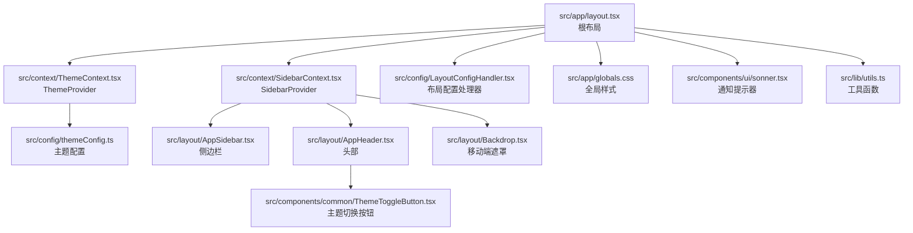
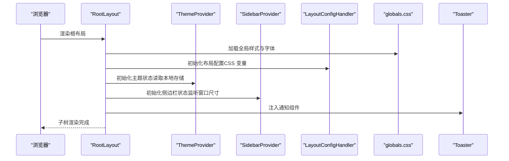
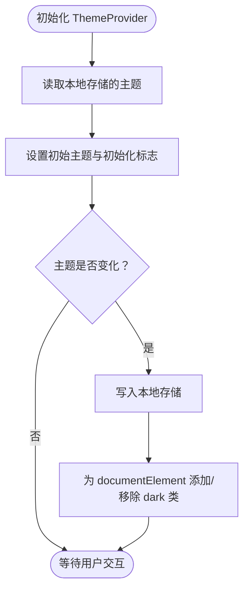
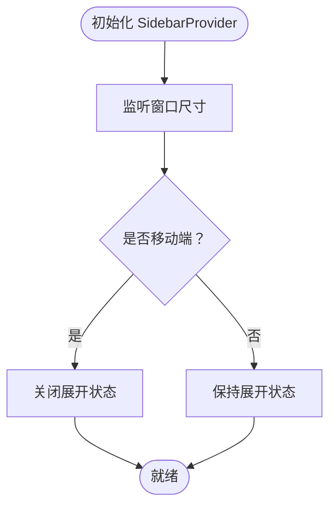
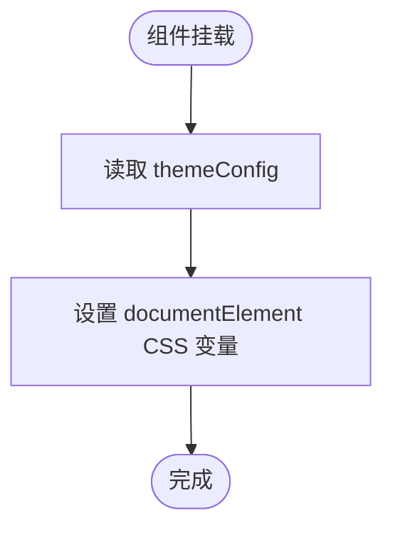
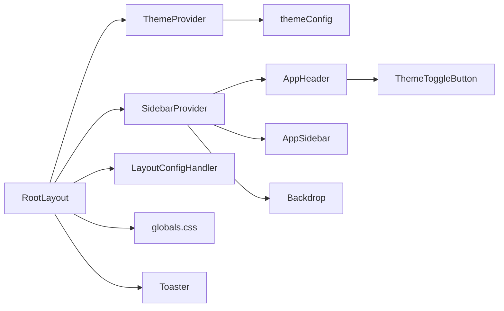

# 根布局 RootLayout

<cite>
**本文引用的文件**
- [src/app/layout.tsx](file://src/app/layout.tsx)
- [src/context/ThemeContext.tsx](file://src/context/ThemeContext.tsx)
- [src/context/SidebarContext.tsx](file://src/context/SidebarContext.tsx)
- [src/config/LayoutConfigHandler.tsx](file://src/config/LayoutConfigHandler.tsx)
- [src/config/themeConfig.ts](file://src/config/themeConfig.ts)
- [src/app/globals.css](file://src/app/globals.css)
- [src/lib/utils.ts](file://src/lib/utils.ts)
- [src/components/ui/sonner.tsx](file://src/components/ui/sonner.tsx)
- [src/layout/AppHeader.tsx](file://src/layout/AppHeader.tsx)
- [src/layout/AppSidebar.tsx](file://src/layout/AppSidebar.tsx)
- [src/layout/Backdrop.tsx](file://src/layout/Backdrop.tsx)
- [src/components/common/ThemeToggleButton.tsx](file://src/components/common/ThemeToggleButton.tsx)
- [package.json](file://package.json)
</cite>

## 目录
1. [简介](#简介)
2. [项目结构](#项目结构)
3. [核心组件](#核心组件)
4. [架构总览](#架构总览)
5. [详细组件分析](#详细组件分析)
6. [依赖关系分析](#依赖关系分析)
7. [性能考量](#性能考量)
8. [故障排查指南](#故障排查指南)
9. [结论](#结论)
10. [附录：最佳实践与常见配置模式](#附录最佳实践与常见配置模式)

## 简介
RootLayout 是整个应用的最外层容器，负责：
- 配置 HTML 根节点（语言、字体变量）
- 集成全局样式与第三方库样式
- 初始化全局状态管理（主题与侧边栏）
- 应用布局配置处理器以注入 CSS 变量
- 提供通知提示器（Toaster）与国际化基础支持

本文件将从设计原理、数据流、生命周期、性能优化与 SEO 友好性等维度，全面解析 RootLayout 的实现与使用方式。

## 项目结构
RootLayout 位于应用入口目录，是 Next.js App Router 中的根布局组件。它通过 Provider 包装子树，为所有页面提供主题、侧边栏与布局配置上下文。

图表来源
- [src/app/layout.tsx:16-32](file://src/app/layout.tsx#L16-L32)
- [src/context/ThemeContext.tsx:15-50](file://src/context/ThemeContext.tsx#L15-L50)
- [src/context/SidebarContext.tsx:27-83](file://src/context/SidebarContext.tsx#L27-L83)
- [src/config/LayoutConfigHandler.tsx:6-29](file://src/config/LayoutConfigHandler.tsx#L6-L29)
- [src/app/globals.css:1-226](file://src/app/globals.css#L1-L226)
- [src/components/ui/sonner.tsx:8-29](file://src/components/ui/sonner.tsx#L8-L29)
- [src/lib/utils.ts:4-6](file://src/lib/utils.ts#L4-L6)
- [src/config/themeConfig.ts:4-30](file://src/config/themeConfig.ts#L4-L30)
- [src/layout/AppSidebar.tsx:104-372](file://src/layout/AppSidebar.tsx#L104-L372)
- [src/layout/AppHeader.tsx:10-44](file://src/layout/AppHeader.tsx#L10-L44)
- [src/layout/Backdrop.tsx:4-14](file://src/layout/Backdrop.tsx#L4-L14)
- [src/components/common/ThemeToggleButton.tsx:4-10](file://src/components/common/ThemeToggleButton.tsx#L4-L10)

章节来源
- [src/app/layout.tsx:16-32](file://src/app/layout.tsx#L16-L32)
- [src/app/globals.css:1-226](file://src/app/globals.css#L1-L226)

## 核心组件
- 根布局 RootLayout：定义 HTML 根节点、加载字体与第三方样式、包裹 Provider 并渲染子树。
- 主题提供者 ThemeProvider：管理明暗主题状态、持久化到本地存储、同步到 DOM。
- 侧边栏提供者 SidebarProvider：管理侧边栏展开/收起、移动端显示、菜单激活状态。
- 布局配置处理器 LayoutConfigHandler：将主题配置映射为 CSS 变量，注入到 documentElement。
- 全局样式 globals.css：引入 Tailwind、动画、shadcn 组件样式与第三方库样式。
- 通知提示器 Toaster：基于 next-themes 的通知组件，按系统主题自动适配。
- 工具函数 cn：合并类名并修复冲突。

章节来源
- [src/app/layout.tsx:16-32](file://src/app/layout.tsx#L16-L32)
- [src/context/ThemeContext.tsx:15-50](file://src/context/ThemeContext.tsx#L15-L50)
- [src/context/SidebarContext.tsx:27-83](file://src/context/SidebarContext.tsx#L27-L83)
- [src/config/LayoutConfigHandler.tsx:6-29](file://src/config/LayoutConfigHandler.tsx#L6-L29)
- [src/app/globals.css:1-226](file://src/app/globals.css#L1-L226)
- [src/components/ui/sonner.tsx:8-29](file://src/components/ui/sonner.tsx#L8-L29)
- [src/lib/utils.ts:4-6](file://src/lib/utils.ts#L4-L6)

## 架构总览
RootLayout 将全局状态、样式与第三方库整合为统一的顶层容器，形成“配置-状态-视图”的分层结构。

图表来源
- [src/app/layout.tsx:16-32](file://src/app/layout.tsx#L16-L32)
- [src/context/ThemeContext.tsx:21-39](file://src/context/ThemeContext.tsx#L21-L39)
- [src/context/SidebarContext.tsx:37-52](file://src/context/SidebarContext.tsx#L37-L52)
- [src/config/LayoutConfigHandler.tsx:7-26](file://src/config/LayoutConfigHandler.tsx#L7-L26)
- [src/app/globals.css:1-226](file://src/app/globals.css#L1-L226)
- [src/components/ui/sonner.tsx:8-29](file://src/components/ui/sonner.tsx#L8-L29)

## 详细组件分析

### 根布局 RootLayout 设计与实现
- HTML 根节点配置
  - 设置语言属性与字体变量，确保全局字体一致。
  - 使用工具函数合并类名，保证样式优先级与可维护性。
- 字体系统集成
  - 引入 Google Fonts 字体并暴露 CSS 变量，便于在 CSS 中使用。
- 主题提供者包装
  - 在 ThemeProvider 内部进行主题状态初始化与持久化，同时同步到 DOM。
- 布局配置处理器
  - 将 themeConfig 映射为 CSS 变量，供组件通过 var() 使用。
- 全局样式与第三方库样式
  - 引入 Tailwind、动画、shadcn 样式与第三方库样式（如 flatpickr、FullCalendar、Swiper 等）。
- 通知提示器
  - 基于 next-themes 自动适配系统主题，提供丰富的通知样式定制。

章节来源
- [src/app/layout.tsx:16-32](file://src/app/layout.tsx#L16-L32)
- [src/lib/utils.ts:4-6](file://src/lib/utils.ts#L4-L6)
- [src/components/ui/sonner.tsx:8-29](file://src/components/ui/sonner.tsx#L8-L29)

### 主题提供者 ThemeProvider
- 状态管理
  - 初始状态：从本地存储读取主题，若无则默认亮色。
  - 持久化：每次切换主题时写入本地存储。
  - DOM 同步：根据当前主题添加或移除 dark 类名。
- 生命周期
  - 首次挂载：执行初始化副作用，设置 isInitialized。
  - 主题变化：触发副作用，更新 DOM 与本地存储。
- 错误处理
  - 若在 Provider 外部调用 useTheme，抛出明确错误。

图表来源
- [src/context/ThemeContext.tsx:21-39](file://src/context/ThemeContext.tsx#L21-L39)

章节来源
- [src/context/ThemeContext.tsx:15-50](file://src/context/ThemeContext.tsx#L15-L50)

### 侧边栏提供者 SidebarProvider
- 状态管理
  - 展开/收起、移动端开关、悬停状态、活动项、子菜单展开。
  - 响应式：监听窗口尺寸，移动端自动关闭展开状态。
- 生命周期
  - 初始化：计算移动端状态并绑定 resize 事件。
  - 卸载：清理事件监听。
- 行为控制
  - 切换展开/收起、移动端开关、子菜单切换、悬停状态设置。

图表来源
- [src/context/SidebarContext.tsx:37-52](file://src/context/SidebarContext.tsx#L37-L52)

章节来源
- [src/context/SidebarContext.tsx:27-83](file://src/context/SidebarContext.tsx#L27-L83)

### 布局配置处理器 LayoutConfigHandler
- 功能
  - 将 themeConfig 中的侧边栏宽度、间距、圆角、主色调等映射为 CSS 变量。
  - 在组件挂载时一次性注入，避免运行时重复计算。
- 适用范围
  - 所有组件可通过 var(--sidebar-width-expanded) 等变量直接使用。

图表来源
- [src/config/LayoutConfigHandler.tsx:7-26](file://src/config/LayoutConfigHandler.tsx#L7-L26)
- [src/config/themeConfig.ts:4-30](file://src/config/themeConfig.ts#L4-L30)

章节来源
- [src/config/LayoutConfigHandler.tsx:6-29](file://src/config/LayoutConfigHandler.tsx#L6-L29)
- [src/config/themeConfig.ts:4-30](file://src/config/themeConfig.ts#L4-L30)

### 全局样式与第三方库样式
- 全局样式
  - 引入 Tailwind、动画、shadcn 组件样式。
  - 定义暗色变体、断点、字体、颜色、阴影、圆角等主题变量。
  - 通过 @theme 与 CSS 变量实现主题一致性。
- 第三方库样式
  - flatpickr、FullCalendar、Swiper、jVectorMap、ApexCharts 等样式被引入并定制。
  - 通过 CSS 类名覆盖与暗色适配，确保在深色模式下正常显示。

章节来源
- [src/app/globals.css:1-226](file://src/app/globals.css#L1-L226)
- [src/app/globals.css:326-899](file://src/app/globals.css#L326-L899)

### 通知提示器 Toaster
- 集成
  - 基于 next-themes 获取系统主题，自动适配浅色/深色。
  - 通过 classNames 自定义通知、描述、动作按钮与取消按钮的样式。
- 使用
  - 在 RootLayout 中渲染，确保全局可用。

章节来源
- [src/components/ui/sonner.tsx:8-29](file://src/components/ui/sonner.tsx#L8-L29)
- [src/app/layout.tsx:27](file://src/app/layout.tsx#L27)

### 工具函数 cn
- 功能
  - 合并多个类名输入，使用 tailwind-merge 解决冲突。
- 用途
  - 在 RootLayout 中用于合并字体与背景类名，确保样式正确叠加。

章节来源
- [src/lib/utils.ts:4-6](file://src/lib/utils.ts#L4-L6)
- [src/app/layout.tsx:23](file://src/app/layout.tsx#L23)

## 依赖关系分析
- 直接依赖
  - RootLayout 依赖 ThemeProvider、SidebarProvider、LayoutConfigHandler、globals.css、Toaster、cn。
- 间接依赖
  - ThemeProvider 依赖 useTheme 与本地存储；SidebarProvider 依赖 useSidebar 与窗口尺寸；LayoutConfigHandler 依赖 themeConfig。
- 外部依赖
  - Next.js App Router、Tailwind CSS v4、next-themes、sonner、第三方图表与日历库。

图表来源
- [src/app/layout.tsx:16-32](file://src/app/layout.tsx#L16-L32)
- [src/context/ThemeContext.tsx:15-50](file://src/context/ThemeContext.tsx#L15-L50)
- [src/context/SidebarContext.tsx:27-83](file://src/context/SidebarContext.tsx#L27-L83)
- [src/config/LayoutConfigHandler.tsx:6-29](file://src/config/LayoutConfigHandler.tsx#L6-L29)
- [src/app/globals.css:1-226](file://src/app/globals.css#L1-L226)
- [src/components/ui/sonner.tsx:8-29](file://src/components/ui/sonner.tsx#L8-L29)
- [src/config/themeConfig.ts:4-30](file://src/config/themeConfig.ts#L4-L30)
- [src/layout/AppHeader.tsx:10-44](file://src/layout/AppHeader.tsx#L10-L44)
- [src/layout/AppSidebar.tsx:104-372](file://src/layout/AppSidebar.tsx#L104-L372)
- [src/layout/Backdrop.tsx:4-14](file://src/layout/Backdrop.tsx#L4-L14)
- [src/components/common/ThemeToggleButton.tsx:4-10](file://src/components/common/ThemeToggleButton.tsx#L4-L10)

章节来源
- [package.json:15-49](file://package.json#L15-L49)

## 性能考量
- 字体与样式加载
  - 使用 Next.js 内置字体优化，减少 FOIT/FOIC。
  - 全局样式集中引入，避免重复加载。
- 状态初始化
  - 主题与侧边栏状态在客户端初始化，避免服务端渲染抖动。
- CSS 变量注入
  - 布局配置处理器仅在挂载时执行一次，降低运行时开销。
- 通知组件
  - Toaster 仅在根布局渲染一次，避免多实例导致的性能问题。
- 第三方库
  - 仅引入必要模块，避免全量打包；按需加载组件。

[本节为通用性能建议，不直接分析具体文件]

## 故障排查指南
- 主题未生效
  - 检查本地存储中是否存在主题键值；确认 DOM 是否包含 dark 类。
  - 参考路径：[src/context/ThemeContext.tsx:21-39](file://src/context/ThemeContext.tsx#L21-L39)
- 侧边栏不响应
  - 确认窗口尺寸监听是否正常；移动端状态下展开状态会被重置。
  - 参考路径：[src/context/SidebarContext.tsx:37-52](file://src/context/SidebarContext.tsx#L37-L52)
- 布局变量无效
  - 确认 LayoutConfigHandler 是否已挂载；检查 CSS 变量是否正确注入。
  - 参考路径：[src/config/LayoutConfigHandler.tsx:7-26](file://src/config/LayoutConfigHandler.tsx#L7-L26)
- 第三方样式异常
  - 检查 globals.css 中对应样式的覆盖规则；确认暗色模式下的类名是否匹配。
  - 参考路径：[src/app/globals.css:326-899](file://src/app/globals.css#L326-L899)
- 通知样式不随系统主题变化
  - 确认 next-themes 的主题设置；检查 Toaster 的 classNames 配置。
  - 参考路径：[src/components/ui/sonner.tsx:8-29](file://src/components/ui/sonner.tsx#L8-L29)

章节来源
- [src/context/ThemeContext.tsx:21-39](file://src/context/ThemeContext.tsx#L21-L39)
- [src/context/SidebarContext.tsx:37-52](file://src/context/SidebarContext.tsx#L37-L52)
- [src/config/LayoutConfigHandler.tsx:7-26](file://src/config/LayoutConfigHandler.tsx#L7-L26)
- [src/app/globals.css:326-899](file://src/app/globals.css#L326-L899)
- [src/components/ui/sonner.tsx:8-29](file://src/components/ui/sonner.tsx#L8-L29)

## 结论
RootLayout 通过 Provider 与配置处理器，将主题、侧边栏与布局变量统一管理，配合全局样式与第三方库样式，构建了高内聚、低耦合的应用容器。其设计兼顾了可维护性、性能与可扩展性，适合在大型后台管理系统中复用与演进。

[本节为总结性内容，不直接分析具体文件]

## 附录：最佳实践与常见配置模式

- 最佳实践
  - 将全局样式集中在 globals.css，避免在组件中重复引入。
  - 使用 CSS 变量统一管理布局参数，便于主题切换与响应式适配。
  - 在客户端组件中使用 next-themes 与 Toaster，确保跨组件一致性。
  - 通过 cn 合并类名，避免样式冲突与冗余。

- 常见配置模式
  - 主题切换：在任意组件中调用 useTheme 的 toggleTheme 实现明暗切换。
    - 参考路径：[src/context/ThemeContext.tsx:41-43](file://src/context/ThemeContext.tsx#L41-L43)
  - 侧边栏控制：在头部或菜单中调用 useSidebar 的 toggleSidebar 或 toggleMobileSidebar。
    - 参考路径：[src/layout/AppHeader.tsx:15-21](file://src/layout/AppHeader.tsx#L15-L21)
  - 布局变量使用：在组件中通过 var(--sidebar-width-expanded) 等变量控制尺寸。
    - 参考路径：[src/layout/AppSidebar.tsx:300-312](file://src/layout/AppSidebar.tsx#L300-L312)
  - 通知提示：在需要的地方调用 Toaster，自动适配系统主题。
    - 参考路径：[src/components/ui/sonner.tsx:8-29](file://src/components/ui/sonner.tsx#L8-L29)

章节来源
- [src/context/ThemeContext.tsx:41-43](file://src/context/ThemeContext.tsx#L41-L43)
- [src/layout/AppHeader.tsx:15-21](file://src/layout/AppHeader.tsx#L15-L21)
- [src/layout/AppSidebar.tsx:300-312](file://src/layout/AppSidebar.tsx#L300-L312)
- [src/components/ui/sonner.tsx:8-29](file://src/components/ui/sonner.tsx#L8-L29)