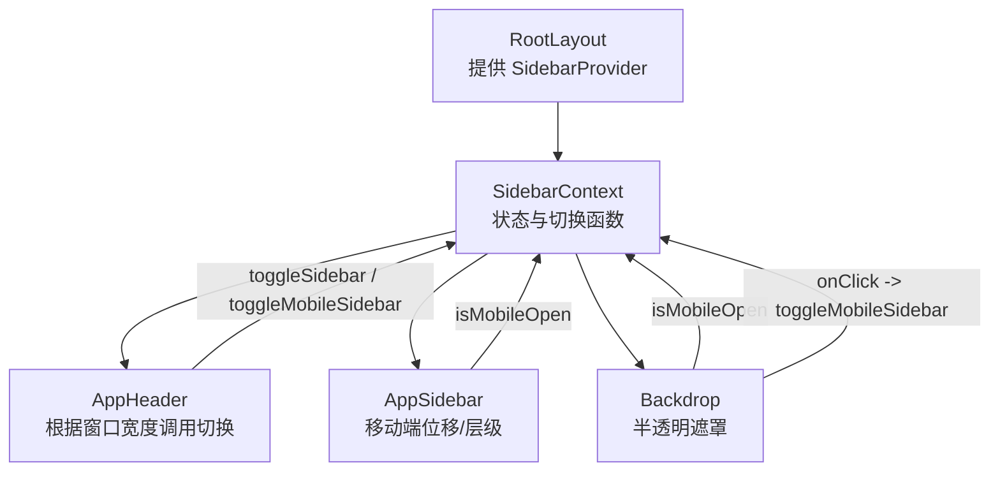
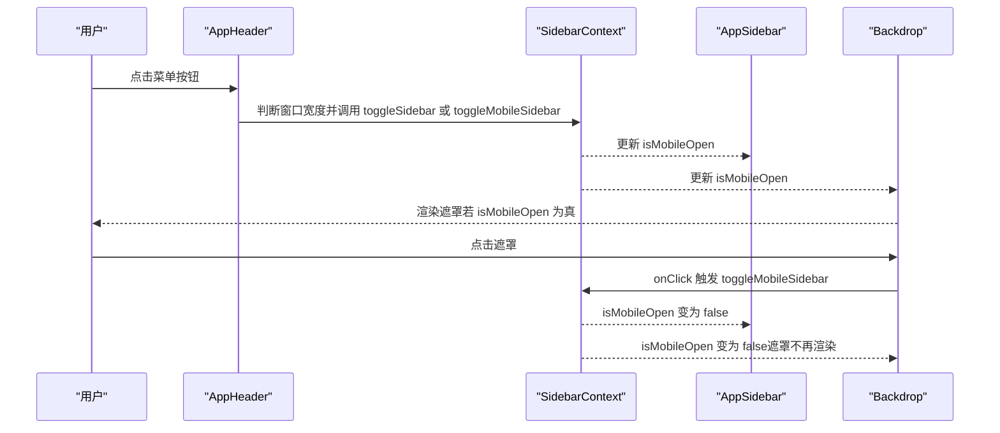
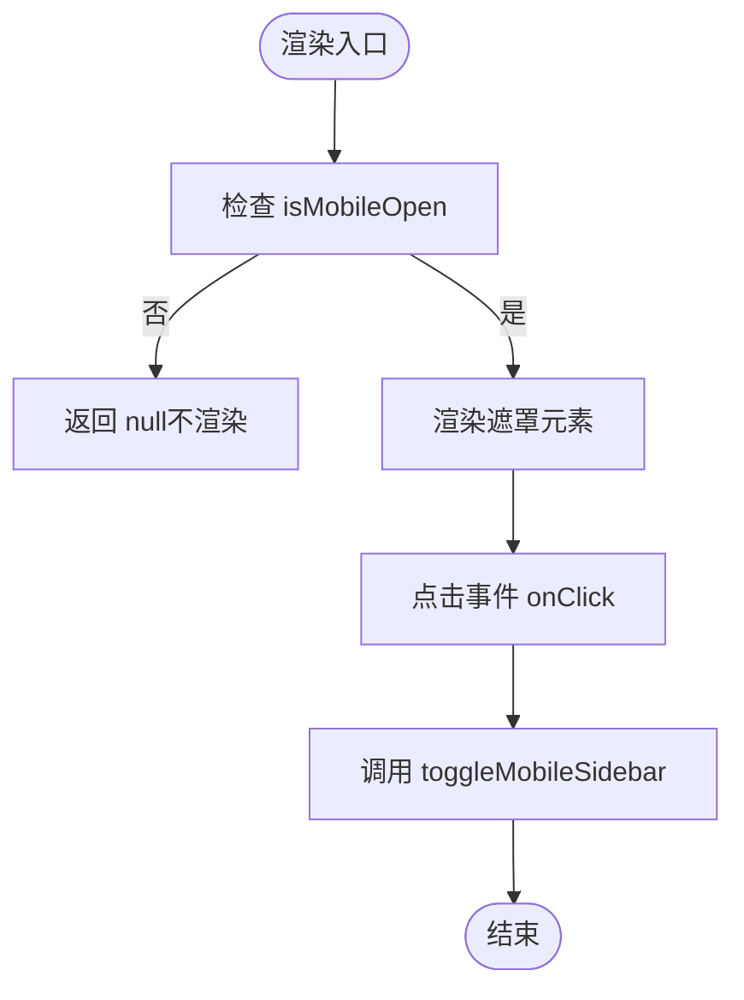
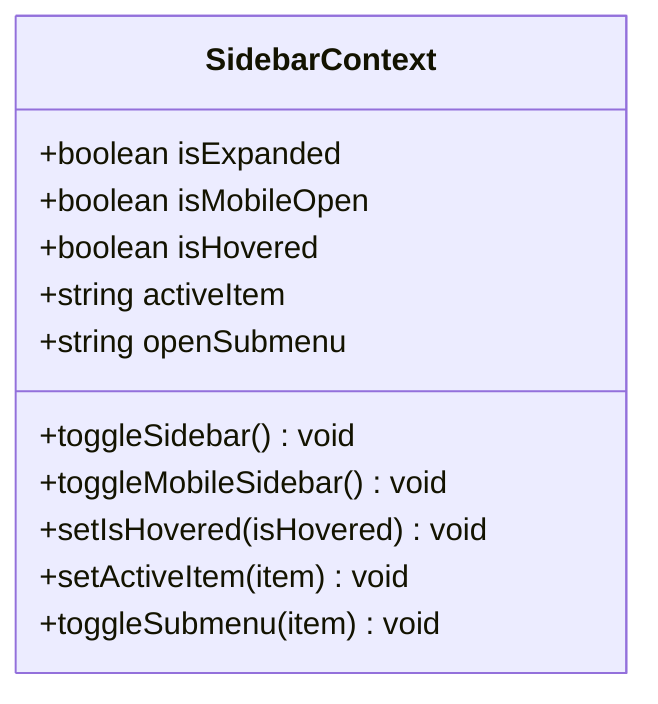
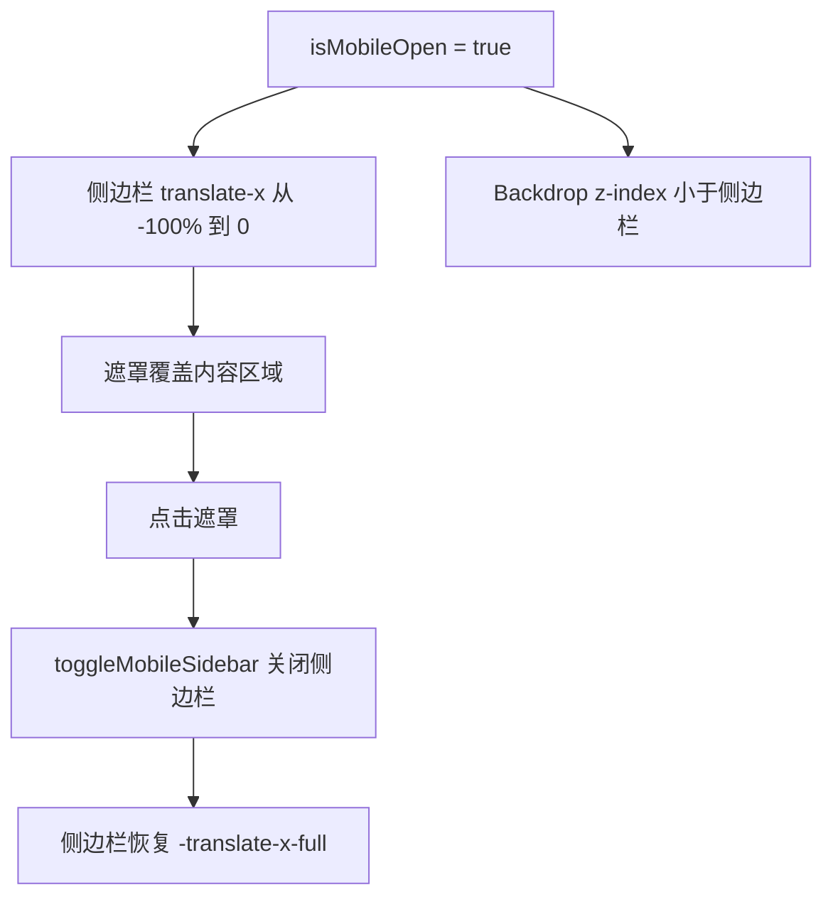
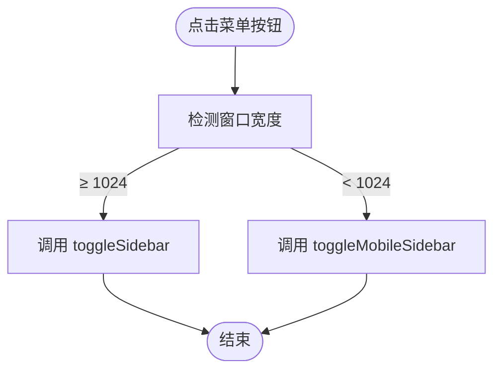
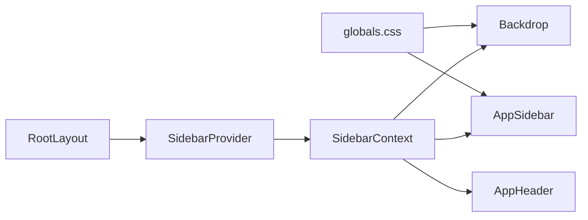

# 背景遮罩 Backdrop

<cite>
**本文引用的文件**
- [Backdrop.tsx](file://src/layout/Backdrop.tsx)
- [SidebarContext.tsx](file://src/context/SidebarContext.tsx)
- [AppSidebar.tsx](file://src/layout/AppSidebar.tsx)
- [AppHeader.tsx](file://src/layout/AppHeader.tsx)
- [layout.tsx](file://src/app/layout.tsx)
- [globals.css](file://src/app/globals.css)
- [index.tsx](file://src/icons/index.tsx)
</cite>

## 目录
1. [简介](#简介)
2. [项目结构](#项目结构)
3. [核心组件](#核心组件)
4. [架构总览](#架构总览)
5. [详细组件分析](#详细组件分析)
6. [依赖关系分析](#依赖关系分析)
7. [性能考量](#性能考量)
8. [故障排查指南](#故障排查指南)
9. [结论](#结论)
10. [附录](#附录)

## 简介
Backdrop 是移动端侧边栏交互的关键视觉与行为组件：当侧边栏处于展开状态（移动端）时，它以半透明覆盖层的形式出现在页面内容之下，用于阻止用户与底层元素的点击交互，并提供点击遮罩即关闭侧边栏的直观反馈。该组件通过与 SidebarContext 协作，基于响应式断点（默认小于 768px 为移动端）动态决定是否渲染，同时配合 AppSidebar 的位移与层级策略，形成完整的移动端模态化体验。

## 项目结构
Backdrop 位于布局层，与上下文、头部、侧边栏共同构成移动端交互闭环：
- 布局根节点提供 SidebarProvider，使子树可消费侧边栏状态
- AppHeader 根据窗口宽度选择切换桌面或移动端侧边栏
- AppSidebar 在移动端根据 isMobileOpen 控制位移与可见性
- Backdrop 仅在 isMobileOpen 为真时渲染，且点击时触发关闭

图表来源
- [layout.tsx:24-26](file://src/app/layout.tsx#L24-L26)
- [SidebarContext.tsx:66-83](file://src/context/SidebarContext.tsx#L66-L83)
- [AppHeader.tsx:13-21](file://src/layout/AppHeader.tsx#L13-L21)
- [AppSidebar.tsx:104-110](file://src/layout/AppSidebar.tsx#L104-L110)
- [Backdrop.tsx:4-14](file://src/layout/Backdrop.tsx#L4-L14)

章节来源
- [layout.tsx:24-26](file://src/app/layout.tsx#L24-L26)
- [SidebarContext.tsx:27-83](file://src/context/SidebarContext.tsx#L27-L83)
- [AppHeader.tsx:10-21](file://src/layout/AppHeader.tsx#L10-L21)
- [AppSidebar.tsx:104-110](file://src/layout/AppSidebar.tsx#L104-L110)
- [Backdrop.tsx:4-14](file://src/layout/Backdrop.tsx#L4-L14)

## 核心组件
- Backdrop
  - 作用：移动端半透明遮罩，阻止穿透点击，点击关闭侧边栏
  - 渲染条件：仅在 isMobileOpen 为真时渲染
  - 事件：点击遮罩触发 toggleMobileSidebar 关闭侧边栏
  - 样式：固定定位、全屏覆盖、z-index 较高、移动端可见
- SidebarContext
  - 提供 isMobileOpen、toggleMobileSidebar 等状态与方法
  - 响应式逻辑：监听窗口尺寸，移动端时自动关闭 isMobileOpen
- AppSidebar
  - 移动端通过 translate-x 控制显隐与过渡
  - 与 Backdrop 共享 z-index 层级，确保遮罩在侧边栏之下
- AppHeader
  - 根据窗口宽度选择桌面/移动端切换逻辑

章节来源
- [Backdrop.tsx:4-14](file://src/layout/Backdrop.tsx#L4-L14)
- [SidebarContext.tsx:27-83](file://src/context/SidebarContext.tsx#L27-L83)
- [AppSidebar.tsx:298-312](file://src/layout/AppSidebar.tsx#L298-L312)
- [AppHeader.tsx:13-21](file://src/layout/AppHeader.tsx#L13-L21)

## 架构总览
Backdrop 与 SidebarContext 的协作流程如下：

图表来源
- [AppHeader.tsx:13-21](file://src/layout/AppHeader.tsx#L13-L21)
- [SidebarContext.tsx:54-64](file://src/context/SidebarContext.tsx#L54-L64)
- [AppSidebar.tsx:298-312](file://src/layout/AppSidebar.tsx#L298-L312)
- [Backdrop.tsx:4-14](file://src/layout/Backdrop.tsx#L4-L14)

## 详细组件分析

### Backdrop 组件
- 渲染策略
  - 当 isMobileOpen 为真时才渲染；否则返回 null，避免无意义的 DOM 节点
- 事件处理
  - onClick 事件直接调用 toggleMobileSidebar，实现点击遮罩关闭侧边栏
- 样式与层级
  - 固定定位、全屏覆盖、移动端可见、较高 z-index，确保遮罩在侧边栏之下
- 无障碍与可访问性
  - 当前未设置 aria-modal、role 或键盘焦点管理；建议在扩展时补充 aria-label、role="dialog"、Esc 键处理等

图表来源
- [Backdrop.tsx:4-14](file://src/layout/Backdrop.tsx#L4-L14)

章节来源
- [Backdrop.tsx:4-14](file://src/layout/Backdrop.tsx#L4-L14)

### SidebarContext 状态与切换
- 状态
  - isExpanded：桌面端展开/折叠
  - isMobileOpen：移动端侧边栏显隐
  - isHovered：悬停态（影响侧边栏宽度）
  - activeItem/openSubmenu：菜单项与子菜单状态
- 切换
  - toggleSidebar：切换 isExpanded
  - toggleMobileSidebar：切换 isMobileOpen
  - 响应式：监听 resize，移动端宽度阈值（默认 768px）下自动关闭 isMobileOpen
- 与 Backdrop 的关系
  - Backdrop 依赖 isMobileOpen 决定是否渲染
  - Backdrop 的点击事件通过 toggleMobileSidebar 影响 isMobileOpen

图表来源
- [SidebarContext.tsx:4-15](file://src/context/SidebarContext.tsx#L4-L15)

章节来源
- [SidebarContext.tsx:27-83](file://src/context/SidebarContext.tsx#L27-L83)

### AppSidebar 与 Backdrop 的层级与过渡
- 层级
  - AppSidebar 使用较大的 z-index（例如 999），Backdrop 使用中等层级（例如 40），保证侧边栏在遮罩之上
- 过渡与位移
  - 通过 transform translate-x 控制侧边栏显隐，配合过渡时长与缓动函数
  - 子菜单高度使用 overflow 与高度计算实现平滑展开/收起
- 与 Backdrop 的联动
  - 当 isMobileOpen 为真时，侧边栏从 -translate-x-full 平移到 0；Backdrop 同时渲染并拦截点击

图表来源
- [AppSidebar.tsx:298-312](file://src/layout/AppSidebar.tsx#L298-L312)
- [Backdrop.tsx:10-13](file://src/layout/Backdrop.tsx#L10-L13)

章节来源
- [AppSidebar.tsx:298-312](file://src/layout/AppSidebar.tsx#L298-L312)
- [Backdrop.tsx:10-13](file://src/layout/Backdrop.tsx#L10-L13)

### AppHeader 的窗口宽度判断
- 根据窗口宽度选择切换逻辑
  - 大屏：toggleSidebar（桌面端）
  - 小屏：toggleMobileSidebar（移动端）

图表来源
- [AppHeader.tsx:13-21](file://src/layout/AppHeader.tsx#L13-L21)

章节来源
- [AppHeader.tsx:13-21](file://src/layout/AppHeader.tsx#L13-L21)

## 依赖关系分析
- 直接依赖
  - Backdrop 依赖 SidebarContext 的 isMobileOpen 与 toggleMobileSidebar
  - AppSidebar 依赖 SidebarContext 的 isMobileOpen 与 isHovered
  - AppHeader 依赖 SidebarContext 的切换函数
- 上下文提供者
  - RootLayout 中注入 SidebarProvider，使子树可消费状态
- 样式变量
  - z-index 与尺寸变量集中定义于全局样式，便于统一管理

图表来源
- [layout.tsx:24-26](file://src/app/layout.tsx#L24-L26)
- [SidebarContext.tsx:66-83](file://src/context/SidebarContext.tsx#L66-L83)
- [Backdrop.tsx:4-14](file://src/layout/Backdrop.tsx#L4-L14)
- [AppSidebar.tsx:104-110](file://src/layout/AppSidebar.tsx#L104-L110)
- [AppHeader.tsx:13-21](file://src/layout/AppHeader.tsx#L13-L21)
- [globals.css:163-168](file://src/app/globals.css#L163-L168)

章节来源
- [layout.tsx:24-26](file://src/app/layout.tsx#L24-L26)
- [SidebarContext.tsx:66-83](file://src/context/SidebarContext.tsx#L66-L83)
- [Backdrop.tsx:4-14](file://src/layout/Backdrop.tsx#L4-L14)
- [AppSidebar.tsx:104-110](file://src/layout/AppSidebar.tsx#L104-L110)
- [AppHeader.tsx:13-21](file://src/layout/AppHeader.tsx#L13-L21)
- [globals.css:163-168](file://src/app/globals.css#L163-L168)

## 性能考量
- 渲染最小化
  - Backdrop 仅在 isMobileOpen 为真时渲染，避免常驻 DOM 节点
- 事件绑定
  - 避免在遮罩上绑定过多监听器；当前仅绑定一次 onClick
- 动画与过渡
  - AppSidebar 使用 transform 与过渡，避免触发布局抖动
- 响应式处理
  - SidebarContext 在 resize 时更新 isMobile 与 isMobileOpen，减少不必要的重绘
- 建议
  - 对于复杂手势（如滑动关闭），可在现有基础上扩展触摸事件处理，但需注意性能与可访问性平衡

## 故障排查指南
- 症状：点击遮罩无法关闭侧边栏
  - 检查 Backdrop 是否正确渲染（isMobileOpen 为真）
  - 检查 onClick 是否被正确绑定到 toggleMobileSidebar
- 症状：遮罩不出现
  - 检查窗口宽度是否满足移动端阈值（默认 < 768px）
  - 检查 SidebarProvider 是否包裹在根布局中
- 症状：遮罩层级异常
  - 检查 Backdrop 与 AppSidebar 的 z-index 定义与相对顺序
- 症状：移动端点击穿透
  - 确保遮罩存在且点击事件冒泡被拦截（当前 onClick 会触发 toggleMobileSidebar）

章节来源
- [Backdrop.tsx:4-14](file://src/layout/Backdrop.tsx#L4-L14)
- [SidebarContext.tsx:37-52](file://src/context/SidebarContext.tsx#L37-L52)
- [AppSidebar.tsx:298-312](file://src/layout/AppSidebar.tsx#L298-L312)
- [layout.tsx:24-26](file://src/app/layout.tsx#L24-L26)

## 结论
Backdrop 通过简洁的状态依赖与事件绑定，在移动端提供了可靠的遮罩交互：点击遮罩即关闭侧边栏，防止点击穿透，提升可用性。其与 SidebarContext、AppSidebar、AppHeader 的协同，构成了清晰的响应式侧边栏模态化方案。为进一步增强体验，可在保持性能的前提下引入更丰富的手势与无障碍能力。

## 附录

### 使用场景与扩展方法
- 基本用法
  - 在移动端打开侧边栏时，Backdrop 自动渲染并拦截点击
  - 点击遮罩区域关闭侧边栏
- 扩展建议
  - 添加 Esc 键支持：在挂载时监听键盘事件，按下 Esc 关闭侧边栏
  - 无障碍增强：为遮罩添加 aria-modal、role="dialog"、aria-label 等属性；首次聚焦到侧边栏或返回焦点
  - 手势支持：在遮罩上监听 touch 事件，实现滑动关闭（需谨慎处理滚动穿透与性能）
  - 动画定制：调整过渡时长与缓动曲线，匹配产品风格
- 样式定制
  - 背景色与透明度：通过类名或 CSS 变量调整
  - 层级管理：通过 z-index 变量统一管理，避免层级冲突
  - 响应式可见性：利用断点类（如 lg:hidden）控制不同屏幕下的显示行为

章节来源
- [Backdrop.tsx:10-13](file://src/layout/Backdrop.tsx#L10-L13)
- [globals.css:163-168](file://src/app/globals.css#L163-L168)
- [AppHeader.tsx:13-21](file://src/layout/AppHeader.tsx#L13-L21)
- [AppSidebar.tsx:298-312](file://src/layout/AppSidebar.tsx#L298-L312)