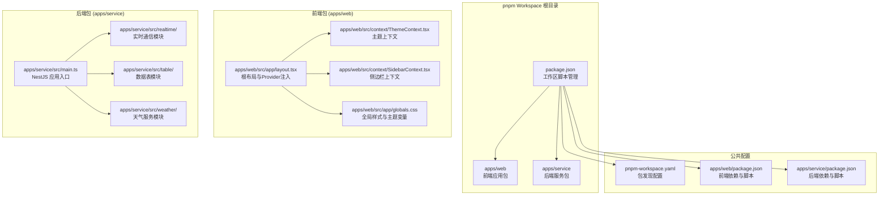
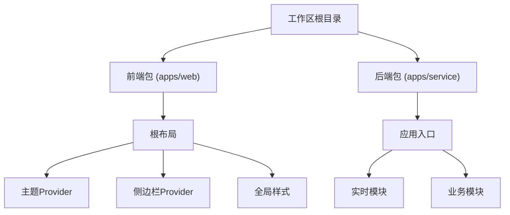
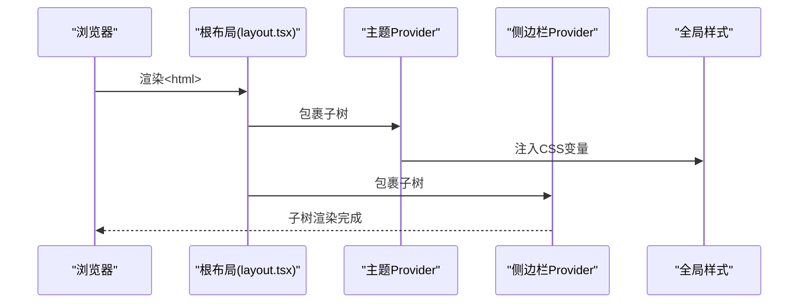
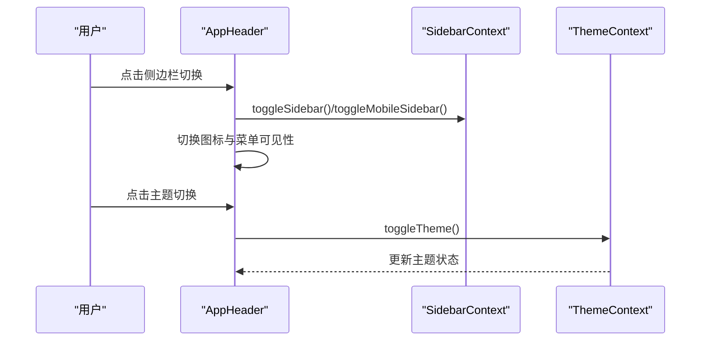
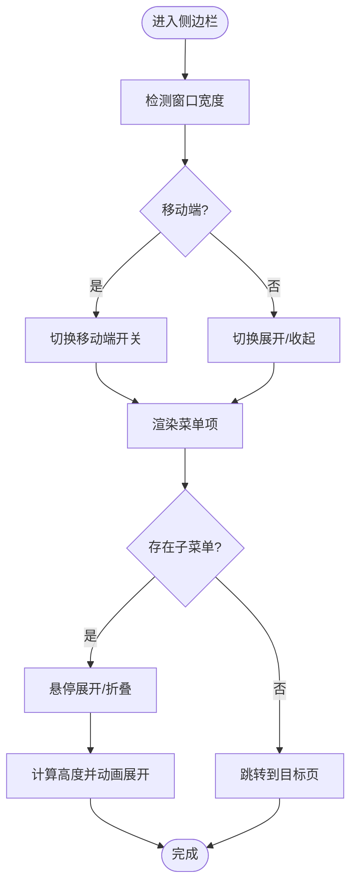
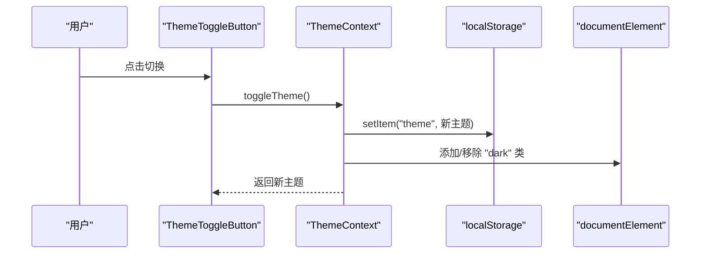
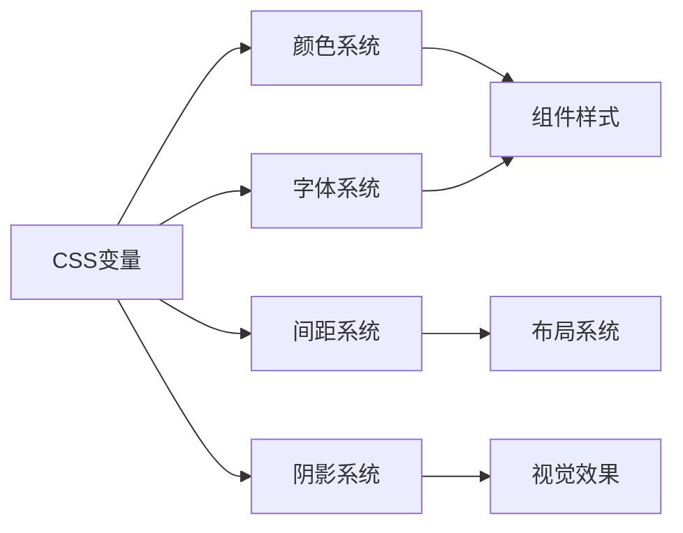
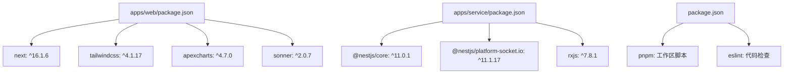

# 架构设计

<cite>
**本文引用的文件**
- [apps/web/src/app/layout.tsx](file://apps/web/src/app/layout.tsx)
- [apps/web/src/layout/AppHeader.tsx](file://apps/web/src/layout/AppHeader.tsx)
- [apps/web/src/layout/AppSidebar.tsx](file://apps/web/src/layout/AppSidebar.tsx)
- [apps/web/src/context/ThemeContext.tsx](file://apps/web/src/context/ThemeContext.tsx)
- [apps/web/src/context/SidebarContext.tsx](file://apps/web/src/context/SidebarContext.tsx)
- [apps/web/src/components/common/ThemeToggleButton.tsx](file://apps/web/src/components/common/ThemeToggleButton.tsx)
- [apps/web/src/lib/utils.ts](file://apps/web/src/lib/utils.ts)
- [apps/web/src/app/globals.css](file://apps/web/src/app/globals.css)
- [apps/web/package.json](file://apps/web/package.json)
- [apps/service/package.json](file://apps/service/package.json)
- [package.json](file://package.json)
- [pnpm-workspace.yaml](file://pnpm-workspace.yaml)
</cite>

## 更新摘要
**所做更改**
- 更新项目结构章节以反映 pnpm workspace 多包架构
- 新增工作区管理章节说明包间依赖和脚本管理
- 更新依赖分析章节以包含后端服务包配置
- 更新架构总览图以体现前后端分离的多包结构
- 新增包间通信和部署策略章节

## 目录
1. [引言](#引言)
2. [项目结构](#项目结构)
3. [工作区管理](#工作区管理)
4. [核心组件](#核心组件)
5. [架构总览](#架构总览)
6. [详细组件分析](#详细组件分析)
7. [依赖分析](#依赖分析)
8. [包间通信与部署](#包间通信与部署)
9. [性能考虑](#性能考虑)
10. [故障排查指南](#故障排查指南)
11. [结论](#结论)
12. [附录](#附录)

## 引言
本项目是一个基于 Next.js App Router 的现代化管理面板前端工程，现已重构为 pnpm workspace 多包结构，包含 apps/web 前端应用和 apps/service 后端服务。系统采用分层架构与组件化设计，结合 Context API 实现全局状态管理（主题与侧边栏），并通过工作区管理实现前后端协同开发。本文档从架构视角系统阐述：分层职责、组件通信、状态管理模式、主题与布局配置、包间依赖关系、以及数据流与控制流，帮助有经验的开发者快速理解并高效扩展。

## 项目结构
项目采用 pnpm workspace 多包架构，通过 apps/web 和 apps/service 两个独立包实现前后端分离。前端包包含完整的 Next.js 应用、组件库、上下文管理和样式系统；后端包提供 NestJS 服务、实时通信和业务逻辑。工作区通过 pnpm-workspace.yaml 配置包发现和依赖管理。

**图表来源**
- [pnpm-workspace.yaml:1-10](file://pnpm-workspace.yaml#L1-L10)
- [apps/web/src/app/layout.tsx:16-32](file://apps/web/src/app/layout.tsx#L16-L32)
- [apps/web/src/context/ThemeContext.tsx:15-50](file://apps/web/src/context/ThemeContext.tsx#L15-L50)
- [apps/web/src/context/SidebarContext.tsx:27-84](file://apps/web/src/context/SidebarContext.tsx#L27-L84)
- [apps/service/src/main.ts:1-50](file://apps/service/src/main.ts#L1-L50)

**章节来源**
- [pnpm-workspace.yaml:1-10](file://pnpm-workspace.yaml#L1-L10)
- [apps/web/src/app/layout.tsx:16-32](file://apps/web/src/app/layout.tsx#L16-L32)
- [apps/service/src/main.ts:1-50](file://apps/service/src/main.ts#L1-L50)

## 工作区管理
pnpm workspace 提供了高效的多包管理能力，通过以下配置实现包间的协调开发：

- **包发现配置**：使用 `apps/*` 模式自动发现前端和后端包
- **脚本聚合**：根目录提供统一的开发、构建和测试脚本
- **依赖共享**：通过 workspace 协议实现包间依赖共享，避免重复安装
- **构建优化**：支持并行构建多个包，提高开发效率

工作区脚本提供了便捷的开发流程：
- `pnpm dev:web` - 启动前端开发服务器
- `pnpm dev:service` - 启动后端开发服务器
- `pnpm build:web` - 构建前端应用
- `pnpm build:service` - 构建后端服务
- `pnpm lint` - 在所有包中执行代码检查

**章节来源**
- [package.json:4-12](file://package.json#L4-L12)
- [pnpm-workspace.yaml:1-10](file://pnpm-workspace.yaml#L1-L10)

## 核心组件
- **根布局与 Provider 注入**：在 apps/web/src/app/layout.tsx 中统一挂载主题与侧边栏 Provider，注入全局样式与通知组件，确保所有子页面共享状态与主题。
- **应用头部**：集成主题切换按钮、通知下拉、用户下拉菜单与快捷搜索，适配桌面端与移动端交互。
- **侧边栏导航**：支持主菜单与"其他"菜单分组、子菜单折叠动画、移动端抽屉与遮罩层联动。
- **主题上下文**：提供主题状态与切换方法，持久化到本地存储并在 DOM 上同步暗色类名。
- **侧边栏上下文**：集中管理展开/收起、移动端开关、悬停展开、活动项与子菜单状态。
- **全局样式系统**：通过 Tailwind CSS v4 与自定义 CSS 变量实现主题化与响应式设计。
- **页面与组件**：页面作为功能域容器，复用通用组件卡片、面包屑等，保证一致性与可维护性。

**章节来源**
- [apps/web/src/app/layout.tsx:16-32](file://apps/web/src/app/layout.tsx#L16-L32)
- [apps/web/src/layout/AppHeader.tsx:10-174](file://apps/web/src/layout/AppHeader.tsx#L10-L174)
- [apps/web/src/layout/AppSidebar.tsx:104-363](file://apps/web/src/layout/AppSidebar.tsx#L104-L363)
- [apps/web/src/context/ThemeContext.tsx:15-59](file://apps/web/src/context/ThemeContext.tsx#L15-L59)
- [apps/web/src/context/SidebarContext.tsx:27-85](file://apps/web/src/context/SidebarContext.tsx#L27-L85)
- [apps/web/src/app/globals.css:1-897](file://apps/web/src/app/globals.css#L1-L897)

## 架构总览
系统采用"工作区根目录 + 前端包 + 后端包"的三层架构，遵循以下原则：
- **包间解耦**：前端包与后端包通过 API 接口通信，实现完全独立的开发和部署
- **状态集中**：前端通过 Context API 管理主题与侧边栏状态，避免跨包状态传播
- **样式统一**：通过 CSS 变量与配置常量统一主题色彩、尺寸与间距
- **开发效率**：工作区管理提供统一的脚本和依赖，支持并行开发和构建

**图表来源**
- [pnpm-workspace.yaml:1-10](file://pnpm-workspace.yaml#L1-L10)
- [apps/web/src/app/layout.tsx:16-32](file://apps/web/src/app/layout.tsx#L16-L32)
- [apps/service/src/main.ts:1-50](file://apps/service/src/main.ts#L1-L50)

## 详细组件分析

### 根布局系统与 Provider 注入
- **职责**：统一注入主题与侧边栏 Provider、加载全局样式与第三方库样式、挂载全局通知组件
- **关键点**：在根节点设置字体变量与背景类名，确保暗色模式初始状态一致；Provider 层级保证子组件可访问上下文

**图表来源**
- [apps/web/src/app/layout.tsx:16-32](file://apps/web/src/app/layout.tsx#L16-L32)

**章节来源**
- [apps/web/src/app/layout.tsx:16-32](file://apps/web/src/app/layout.tsx#L16-L32)

### 应用头部导航
- **功能**：响应式头部，包含侧边栏切换、移动端菜单、搜索框、主题切换、通知与用户下拉
- **交互**：根据窗口宽度动态切换桌面/移动端行为；支持快捷键聚焦搜索框；主题切换按钮直接调用上下文方法
- **依赖**：使用侧边栏上下文控制展开/收起；使用主题上下文控制主题切换

**图表来源**
- [apps/web/src/layout/AppHeader.tsx:10-174](file://apps/web/src/layout/AppHeader.tsx#L10-L174)
- [apps/web/src/context/SidebarContext.tsx:54-64](file://apps/web/src/context/SidebarContext.tsx#L54-L64)
- [apps/web/src/context/ThemeContext.tsx:41-43](file://apps/web/src/context/ThemeContext.tsx#L41-L43)

**章节来源**
- [apps/web/src/layout/AppHeader.tsx:10-174](file://apps/web/src/layout/AppHeader.tsx#L10-L174)

### 侧边栏导航
- **结构**：主菜单与"其他"菜单两组，支持子菜单折叠与动画高度计算；移动端抽屉与遮罩联动
- **状态**：通过上下文管理展开/收起、移动端开关、悬停展开、活动项与子菜单状态
- **路由**：使用路径匹配高亮当前项，支持嵌套子项激活态

**图表来源**
- [apps/web/src/layout/AppSidebar.tsx:104-363](file://apps/web/src/layout/AppSidebar.tsx#L104-L363)
- [apps/web/src/context/SidebarContext.tsx:27-84](file://apps/web/src/context/SidebarContext.tsx#L27-L84)

**章节来源**
- [apps/web/src/layout/AppSidebar.tsx:104-363](file://apps/web/src/layout/AppSidebar.tsx#L104-L363)

### 主题切换机制
- **状态**：上下文维护当前主题与切换函数，初始化时读取本地存储，更新时写回本地存储并在 DOM 添加/移除暗色类名
- **触发**：头部主题按钮触发切换；也可在页面内通过上下文方法进行编程式切换
- **持久化**：使用本地存储保存用户偏好，刷新后仍保持

**图表来源**
- [apps/web/src/components/common/ThemeToggleButton.tsx:4-43](file://apps/web/src/components/common/ThemeToggleButton.tsx#L4-L43)
- [apps/web/src/context/ThemeContext.tsx:15-59](file://apps/web/src/context/ThemeContext.tsx#L15-L59)

**章节来源**
- [apps/web/src/context/ThemeContext.tsx:15-59](file://apps/web/src/context/ThemeContext.tsx#L15-L59)
- [apps/web/src/components/common/ThemeToggleButton.tsx:4-43](file://apps/web/src/components/common/ThemeToggleButton.tsx#L4-L43)

### 全局样式系统
- **主题变量**：通过 CSS 变量集中管理颜色、字体、阴影、圆角等设计令牌
- **响应式断点**：定义移动端到超大屏的完整断点体系
- **工具类**：提供菜单项、徽章、滚动条等专用样式工具类
- **第三方集成**：集成 ApexCharts、FullCalendar、Swiper 等组件库样式

**图表来源**
- [apps/web/src/app/globals.css:7-186](file://apps/web/src/app/globals.css#L7-L186)

**章节来源**
- [apps/web/src/app/globals.css:1-897](file://apps/web/src/app/globals.css#L1-L897)

## 依赖分析
- **前端依赖**：Next.js、Tailwind CSS v4、apexcharts、react-dnd、sonner 等，满足仪表盘、图表、拖拽与通知需求
- **后端依赖**：NestJS、Socket.IO、RxJS 等，提供现代化的服务端架构和实时通信能力
- **构建配置**：Webpack 与 Turbopack 配置中加入 SVG 处理规则，确保图标与矢量资源正确打包
- **工具函数**：cn 组合类名，统一合并 Tailwind 与条件类名，减少样式冲突

**图表来源**
- [apps/web/package.json:17-51](file://apps/web/package.json#L17-L51)
- [apps/service/package.json:23-33](file://apps/service/package.json#L23-L33)
- [package.json:4-12](file://package.json#L4-L12)

**章节来源**
- [apps/web/package.json:17-51](file://apps/web/package.json#L17-L51)
- [apps/service/package.json:23-33](file://apps/service/package.json#L23-L33)
- [apps/web/src/lib/utils.ts:4-6](file://apps/web/src/lib/utils.ts#L4-L6)

## 包间通信与部署
- **API 通信**：前端通过标准 HTTP 请求与后端 RESTful API 交互，实时数据通过 Socket.IO 连接
- **环境配置**：前后端分别管理各自的环境变量和配置文件
- **部署策略**：
  - 前端：静态资源部署到 CDN 或静态托管服务
  - 后端：容器化部署，支持水平扩展和负载均衡
- **CI/CD 集成**：工作区脚本支持自动化构建和测试流程

**章节来源**
- [apps/web/package.json:45-47](file://apps/web/package.json#L45-L47)
- [apps/service/package.json:27-33](file://apps/service/package.json#L27-L33)

## 性能考虑
- **状态最小化**：主题与侧边栏状态集中在两个上下文中，避免跨组件重复计算
- **懒加载与按需**：页面按路由组组织，天然具备按需加载能力；图标与第三方库按需引入
- **样式优化**：CSS 变量集中管理，减少重复样式声明；Tailwind v4 提供更高效的工具类生成
- **动画与滚动**：侧边栏子菜单高度计算与过渡动画在必要时才执行，避免不必要的重排
- **包间优化**：工作区管理避免重复依赖，支持并行构建提高开发效率

## 故障排查指南
- **主题未生效**：检查根布局是否包裹主题 Provider；确认本地存储中的主题值；验证 CSS 变量是否正确注入
- **侧边栏不显示**：确认移动端宽度断点与遮罩事件绑定；检查侧边栏上下文提供的开关方法是否被调用
- **样式异常**：核对全局样式与 CSS 变量注入顺序；检查 Tailwind 自定义工具类是否覆盖默认样式
- **图标或 SVG 问题**：确认 Webpack/Turbopack 中 SVG 处理规则已启用；检查图标导入路径与类型声明
- **包间通信失败**：检查 API 端点配置；验证 CORS 设置；确认 Socket.IO 连接状态

**章节来源**
- [apps/web/src/context/ThemeContext.tsx:15-59](file://apps/web/src/context/ThemeContext.tsx#L15-L59)
- [apps/web/src/layout/AppSidebar.tsx:104-363](file://apps/web/src/layout/AppSidebar.tsx#L104-L363)
- [apps/web/src/app/globals.css:1-897](file://apps/web/src/app/globals.css#L1-L897)

## 结论
该管理面板通过 pnpm workspace 重构为多包架构，实现了前后端的完全解耦和独立开发。前端包专注于用户体验和界面交互，后端包提供稳定的服务支撑。工作区管理确保了开发效率和部署灵活性，同时保持了系统的可扩展性和可维护性。这种架构设计适合在大型后台产品中持续演进和团队协作。

## 附录
- **架构决策要点**
  - 使用 pnpm workspace 管理多包结构，提高开发效率
  - 前后端完全分离，通过 API 接口通信
  - 使用 Context API 管理前端状态，避免深层 props 传递
  - 通过 CSS 变量与配置常量统一主题参数
- **技术选型理由**
  - Next.js App Router：现代路由模型与原生数据获取能力
  - Tailwind CSS v4：原子化样式与主题变量，提升样式一致性与可维护性
  - NestJS：企业级 Node.js 框架，提供稳定的后端架构
  - Socket.IO：实时通信解决方案，支持双向数据交换
  - pnpm workspace：高效的多包管理工具，支持并行构建和依赖共享