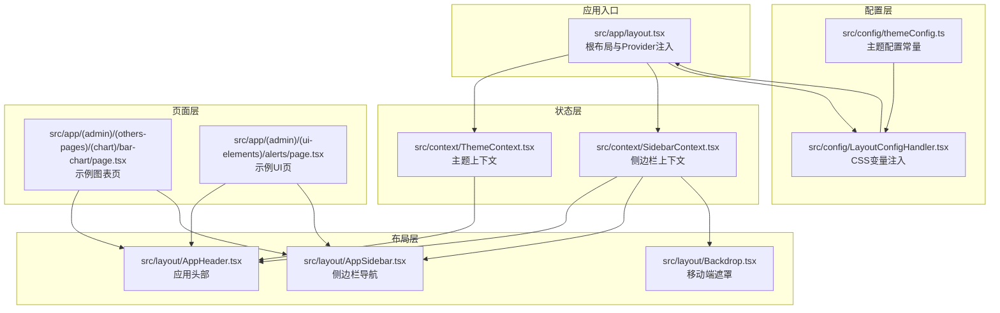
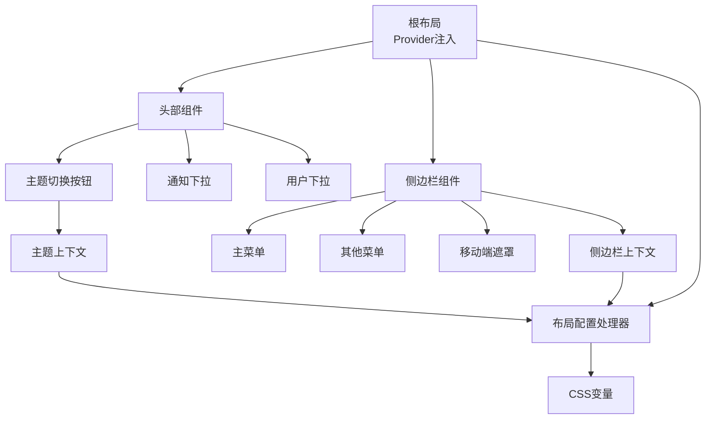
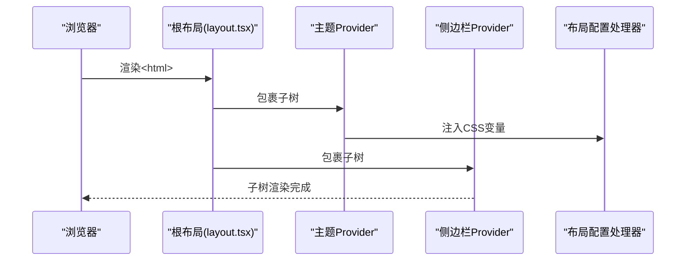
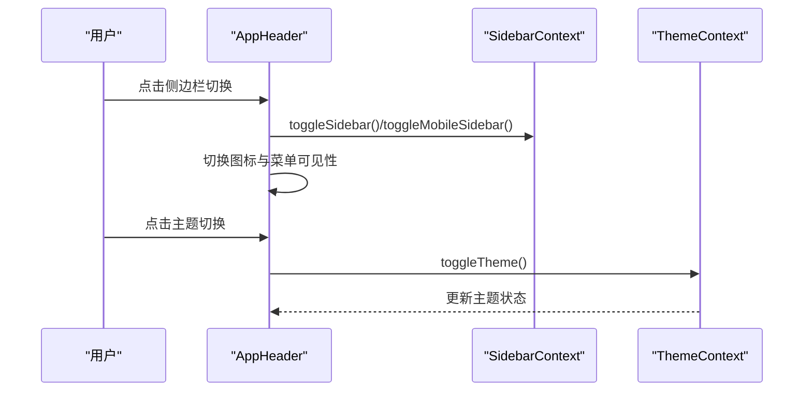
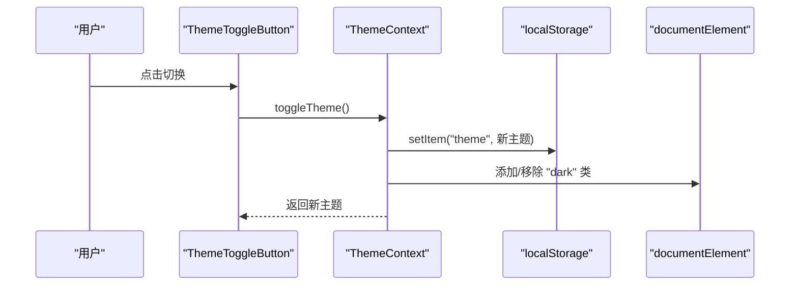
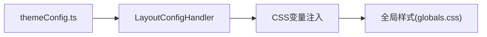
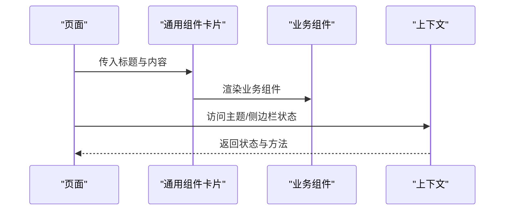
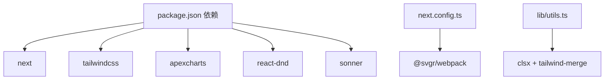

# 架构设计

<cite>
**本文引用的文件**
- [src/app/layout.tsx](file://src/app/layout.tsx)
- [src/layout/AppHeader.tsx](file://src/layout/AppHeader.tsx)
- [src/layout/AppSidebar.tsx](file://src/layout/AppSidebar.tsx)
- [src/context/ThemeContext.tsx](file://src/context/ThemeContext.tsx)
- [src/context/SidebarContext.tsx](file://src/context/SidebarContext.tsx)
- [src/components/common/ThemeToggleButton.tsx](file://src/components/common/ThemeToggleButton.tsx)
- [src/config/LayoutConfigHandler.tsx](file://src/config/LayoutConfigHandler.tsx)
- [src/config/themeConfig.ts](file://src/config/themeConfig.ts)
- [src/layout/Backdrop.tsx](file://src/layout/Backdrop.tsx)
- [src/app/(admin)/(others-pages)/(chart)/bar-chart/page.tsx](file://src/app/(admin)/(others-pages)/(chart)/bar-chart/page.tsx)
- [src/app/(admin)/(ui-elements)/alerts/page.tsx](file://src/app/(admin)/(ui-elements)/alerts/page.tsx)
- [src/lib/utils.ts](file://src/lib/utils.ts)
- [src/app/globals.css](file://src/app/globals.css)
- [package.json](file://package.json)
- [next.config.ts](file://next.config.ts)
</cite>

## 目录
1. [引言](#引言)
2. [项目结构](#项目结构)
3. [核心组件](#核心组件)
4. [架构总览](#架构总览)
5. [详细组件分析](#详细组件分析)
6. [依赖分析](#依赖分析)
7. [性能考虑](#性能考虑)
8. [故障排查指南](#故障排查指南)
9. [结论](#结论)
10. [附录](#附录)

## 引言
本项目是一个基于 Next.js App Router 的现代化管理面板前端工程，采用分层架构与组件化设计，结合 Context API 实现全局状态管理（主题与侧边栏）。系统通过根布局统一注入 Provider，构建出可扩展的主题切换、响应式侧边栏导航与应用头部交互体系。本文档从架构视角系统阐述：分层职责、组件通信、状态管理模式、主题与布局配置、以及数据流与控制流，帮助有经验的开发者快速理解并高效扩展。

## 项目结构
项目采用“App Router + 基于路由组的页面组织”方式，将页面按功能域划分为 admin 与全宽页面两类；组件层按领域拆分，如 layout、components、hooks、context 等；样式通过 Tailwind CSS 与自定义 CSS 变量实现主题化与响应式。

**图表来源**
- [src/app/layout.tsx:16-32](file://src/app/layout.tsx#L16-L32)
- [src/layout/AppHeader.tsx:10-182](file://src/layout/AppHeader.tsx#L10-L182)
- [src/layout/AppSidebar.tsx:104-376](file://src/layout/AppSidebar.tsx#L104-L376)
- [src/context/ThemeContext.tsx:15-50](file://src/context/ThemeContext.tsx#L15-L50)
- [src/context/SidebarContext.tsx:27-84](file://src/context/SidebarContext.tsx#L27-L84)
- [src/config/LayoutConfigHandler.tsx:6-29](file://src/config/LayoutConfigHandler.tsx#L6-L29)
- [src/config/themeConfig.ts:4-31](file://src/config/themeConfig.ts#L4-L31)
- [src/layout/Backdrop.tsx:4-17](file://src/layout/Backdrop.tsx#L4-L17)
- [src/app/(admin)/(others-pages)/(chart)/bar-chart/page.tsx:13-24](file://src/app/(admin)/(others-pages)/(chart)/bar-chart/page.tsx#L13-L24)
- [src/app/(admin)/(ui-elements)/alerts/page.tsx:14-87](file://src/app/(admin)/(ui-elements)/alerts/page.tsx#L14-L87)

**章节来源**
- [src/app/layout.tsx:16-32](file://src/app/layout.tsx#L16-L32)
- [src/app/globals.css:1-899](file://src/app/globals.css#L1-L899)
- [src/config/themeConfig.ts:4-31](file://src/config/themeConfig.ts#L4-L31)

## 核心组件
- 根布局与 Provider 注入：在根布局中统一挂载主题与侧边栏 Provider，并注入全局样式与通知组件，确保所有子页面共享状态与主题。
- 应用头部：集成主题切换按钮、通知下拉、用户下拉菜单与快捷搜索，适配桌面端与移动端交互。
- 侧边栏导航：支持主菜单与“其他”菜单分组、子菜单折叠动画、移动端抽屉与遮罩层联动。
- 主题上下文：提供主题状态与切换方法，持久化到本地存储并在 DOM 上同步暗色类名。
- 侧边栏上下文：集中管理展开/收起、移动端开关、悬停展开、活动项与子菜单状态。
- 布局配置处理器：将主题配置映射为 CSS 变量，驱动布局尺寸、间距与颜色。
- 页面与组件：页面作为功能域容器，复用通用组件卡片、面包屑等，保证一致性与可维护性。

**章节来源**
- [src/app/layout.tsx:16-32](file://src/app/layout.tsx#L16-L32)
- [src/layout/AppHeader.tsx:10-182](file://src/layout/AppHeader.tsx#L10-L182)
- [src/layout/AppSidebar.tsx:104-376](file://src/layout/AppSidebar.tsx#L104-L376)
- [src/context/ThemeContext.tsx:15-50](file://src/context/ThemeContext.tsx#L15-L50)
- [src/context/SidebarContext.tsx:27-84](file://src/context/SidebarContext.tsx#L27-L84)
- [src/config/LayoutConfigHandler.tsx:6-29](file://src/config/LayoutConfigHandler.tsx#L6-L29)
- [src/app/(admin)/(others-pages)/(chart)/bar-chart/page.tsx:13-24](file://src/app/(admin)/(others-pages)/(chart)/bar-chart/page.tsx#L13-L24)
- [src/app/(admin)/(ui-elements)/alerts/page.tsx:14-87](file://src/app/(admin)/(ui-elements)/alerts/page.tsx#L14-L87)

## 架构总览
系统采用“根布局注入 + 布局层 + 状态层 + 配置层 + 页面层”的分层架构，遵循以下原则：
- 分层解耦：布局层仅负责 UI 行为与展示，状态层独立于视图，配置层提供可定制的参数。
- 组件化：页面以功能域组织，复用通用组件，降低重复与提升一致性。
- 状态集中：通过 Context API 将主题与侧边栏状态集中管理，避免跨层级 props 传递。
- 主题与布局：通过 CSS 变量与配置常量统一主题色彩、尺寸与间距，便于全局调整。

**图表来源**
- [src/app/layout.tsx:16-32](file://src/app/layout.tsx#L16-L32)
- [src/layout/AppHeader.tsx:10-182](file://src/layout/AppHeader.tsx#L10-L182)
- [src/layout/AppSidebar.tsx:104-376](file://src/layout/AppSidebar.tsx#L104-L376)
- [src/context/ThemeContext.tsx:15-50](file://src/context/ThemeContext.tsx#L15-L50)
- [src/context/SidebarContext.tsx:27-84](file://src/context/SidebarContext.tsx#L27-L84)
- [src/config/LayoutConfigHandler.tsx:6-29](file://src/config/LayoutConfigHandler.tsx#L6-L29)

## 详细组件分析

### 根布局系统与 Provider 注入
- 职责：统一注入主题与侧边栏 Provider、加载全局样式与第三方库样式、挂载全局通知组件。
- 关键点：在根节点设置字体变量与背景类名，确保暗色模式初始状态一致；Provider 层级保证子组件可访问上下文。

**图表来源**
- [src/app/layout.tsx:16-32](file://src/app/layout.tsx#L16-L32)
- [src/config/LayoutConfigHandler.tsx:6-29](file://src/config/LayoutConfigHandler.tsx#L6-L29)

**章节来源**
- [src/app/layout.tsx:16-32](file://src/app/layout.tsx#L16-L32)

### 应用头部导航
- 功能：响应式头部，包含侧边栏切换、移动端菜单、搜索框、主题切换、通知与用户下拉。
- 交互：根据窗口宽度动态切换桌面/移动端行为；支持快捷键聚焦搜索框；主题切换按钮直接调用上下文方法。
- 依赖：使用侧边栏上下文控制展开/收起；使用主题上下文控制主题切换。

**图表来源**
- [src/layout/AppHeader.tsx:10-182](file://src/layout/AppHeader.tsx#L10-L182)
- [src/context/SidebarContext.tsx:54-64](file://src/context/SidebarContext.tsx#L54-L64)
- [src/context/ThemeContext.tsx:41-43](file://src/context/ThemeContext.tsx#L41-L43)

**章节来源**
- [src/layout/AppHeader.tsx:10-182](file://src/layout/AppHeader.tsx#L10-L182)

### 侧边栏导航
- 结构：主菜单与“其他”菜单两组，支持子菜单折叠与动画高度计算；移动端抽屉与遮罩联动。
- 状态：通过上下文管理展开/收起、移动端开关、悬停展开、活动项与子菜单状态。
- 路由：使用路径匹配高亮当前项，支持嵌套子项激活态。

**图表来源**
- [src/layout/AppSidebar.tsx:104-376](file://src/layout/AppSidebar.tsx#L104-L376)
- [src/context/SidebarContext.tsx:27-84](file://src/context/SidebarContext.tsx#L27-L84)

**章节来源**
- [src/layout/AppSidebar.tsx:104-376](file://src/layout/AppSidebar.tsx#L104-L376)

### 主题切换机制
- 状态：上下文维护当前主题与切换函数，初始化时读取本地存储，更新时写回本地存储并在 DOM 添加/移除暗色类名。
- 触发：头部主题按钮触发切换；也可在页面内通过上下文方法进行编程式切换。
- 持久化：使用本地存储保存用户偏好，刷新后仍保持。

**图表来源**
- [src/components/common/ThemeToggleButton.tsx:4-43](file://src/components/common/ThemeToggleButton.tsx#L4-L43)
- [src/context/ThemeContext.tsx:15-50](file://src/context/ThemeContext.tsx#L15-L50)

**章节来源**
- [src/context/ThemeContext.tsx:15-50](file://src/context/ThemeContext.tsx#L15-L50)
- [src/components/common/ThemeToggleButton.tsx:4-43](file://src/components/common/ThemeToggleButton.tsx#L4-L43)

### 布局配置与主题配置
- 布局配置处理器：将主题配置映射为 CSS 变量，驱动侧边栏宽度、头部高度、内边距、圆角与品牌色。
- 主题配置常量：集中定义尺寸、间距、圆角与颜色，便于全局修改与一致性保障。
- 全局样式：Tailwind 主题变量与自定义工具类配合，形成统一的视觉语言。

**图表来源**
- [src/config/themeConfig.ts:4-31](file://src/config/themeConfig.ts#L4-L31)
- [src/config/LayoutConfigHandler.tsx:6-29](file://src/config/LayoutConfigHandler.tsx#L6-L29)
- [src/app/globals.css:1-899](file://src/app/globals.css#L1-L899)

**章节来源**
- [src/config/LayoutConfigHandler.tsx:6-29](file://src/config/LayoutConfigHandler.tsx#L6-L29)
- [src/config/themeConfig.ts:4-31](file://src/config/themeConfig.ts#L4-L31)
- [src/app/globals.css:1-899](file://src/app/globals.css#L1-L899)

### 页面与组件通信模式
- 页面层：以功能域组织页面，引入通用组件卡片、面包屑等，页面本身不直接管理状态。
- 组件通信：通过 Context API 向下传递状态与方法；组件内部通过本地状态处理 UI 逻辑。
- 示例：图表页与 UI 元素页均通过通用组件卡片承载具体展示内容，保持一致的布局与交互体验。

**图表来源**
- [src/app/(admin)/(others-pages)/(chart)/bar-chart/page.tsx:13-24](file://src/app/(admin)/(others-pages)/(chart)/bar-chart/page.tsx#L13-L24)
- [src/app/(admin)/(ui-elements)/alerts/page.tsx:14-87](file://src/app/(admin)/(ui-elements)/alerts/page.tsx#L14-L87)

**章节来源**
- [src/app/(admin)/(others-pages)/(chart)/bar-chart/page.tsx:13-24](file://src/app/(admin)/(others-pages)/(chart)/bar-chart/page.tsx#L13-L24)
- [src/app/(admin)/(ui-elements)/alerts/page.tsx:14-87](file://src/app/(admin)/(ui-elements)/alerts/page.tsx#L14-L87)

## 依赖分析
- 运行时依赖：Next.js、Tailwind CSS v4、apexcharts、react-dnd、sonner 等，满足仪表盘、图表、拖拽与通知需求。
- 构建配置：Webpack 与 Turbopack 配置中加入 SVG 处理规则，确保图标与矢量资源正确打包。
- 工具函数：cn 组合类名，统一合并 Tailwind 与条件类名，减少样式冲突。

**图表来源**
- [package.json:15-79](file://package.json#L15-L79)
- [next.config.ts:5-22](file://next.config.ts#L5-L22)
- [src/lib/utils.ts:4-6](file://src/lib/utils.ts#L4-L6)

**章节来源**
- [package.json:15-79](file://package.json#L15-L79)
- [next.config.ts:5-22](file://next.config.ts#L5-L22)
- [src/lib/utils.ts:4-6](file://src/lib/utils.ts#L4-L6)

## 性能考虑
- 状态最小化：主题与侧边栏状态集中在两个上下文中，避免跨组件重复计算。
- 懒加载与按需：页面按路由组组织，天然具备按需加载能力；图标与第三方库按需引入。
- 样式优化：CSS 变量集中管理，减少重复样式声明；Tailwind v4 提供更高效的工具类生成。
- 动画与滚动：侧边栏子菜单高度计算与过渡动画在必要时才执行，避免不必要的重排。

## 故障排查指南
- 主题未生效：检查根布局是否包裹主题 Provider；确认本地存储中的主题值；验证 CSS 变量是否正确注入。
- 侧边栏不显示：确认移动端宽度断点与遮罩事件绑定；检查侧边栏上下文提供的开关方法是否被调用。
- 样式异常：核对全局样式与 CSS 变量注入顺序；检查 Tailwind 自定义工具类是否覆盖默认样式。
- 图标或 SVG 问题：确认 Webpack/Turbopack 中 SVG 处理规则已启用；检查图标导入路径与类型声明。

**章节来源**
- [src/context/ThemeContext.tsx:15-50](file://src/context/ThemeContext.tsx#L15-L50)
- [src/layout/Backdrop.tsx:4-17](file://src/layout/Backdrop.tsx#L4-L17)
- [src/app/globals.css:1-899](file://src/app/globals.css#L1-L899)
- [next.config.ts:5-22](file://next.config.ts#L5-L22)

## 结论
该管理面板以 App Router 为基础，通过根布局统一注入与分层组件设计，实现了主题与布局的可配置化、导航与交互的响应式、以及状态管理的集中化。上下文与配置层的分离使系统具备良好的扩展性与可维护性，适合在大型后台产品中持续演进。

## 附录
- 架构决策要点
  - 使用 Context API 管理主题与侧边栏状态，避免深层 props 传递。
  - 通过 CSS 变量与配置常量统一主题参数，便于全局调整。
  - 页面按功能域组织，复用通用组件，提升一致性与开发效率。
- 技术选型理由
  - Next.js App Router：现代路由模型与原生数据获取能力。
  - Tailwind CSS v4：原子化样式与主题变量，提升样式一致性与可维护性。
  - ApexCharts：丰富的图表能力，适配多维数据分析场景。
  - Sonner：轻量级通知组件，改善用户体验。