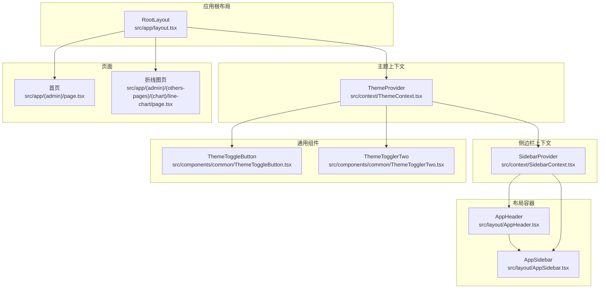
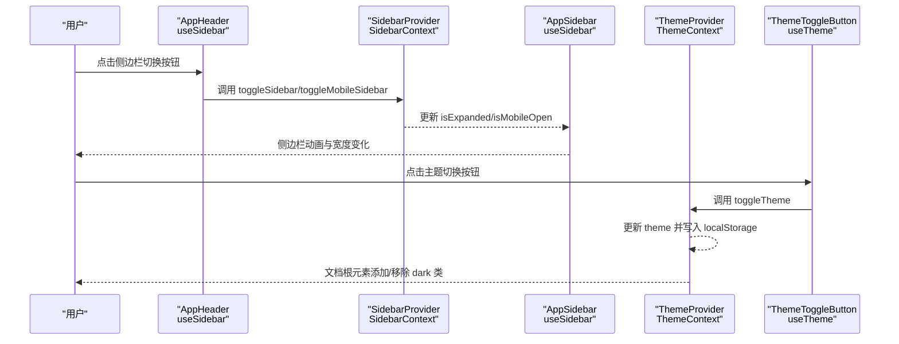
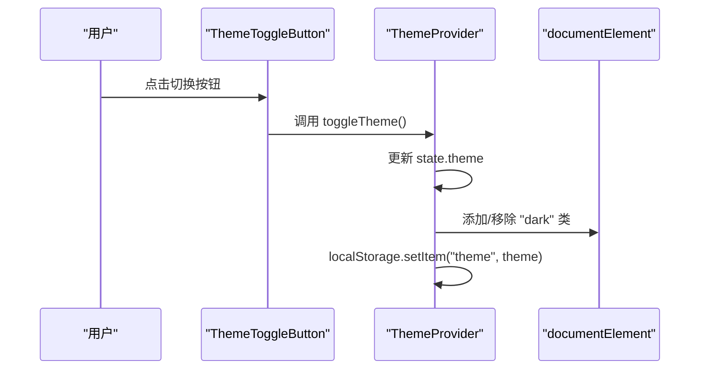
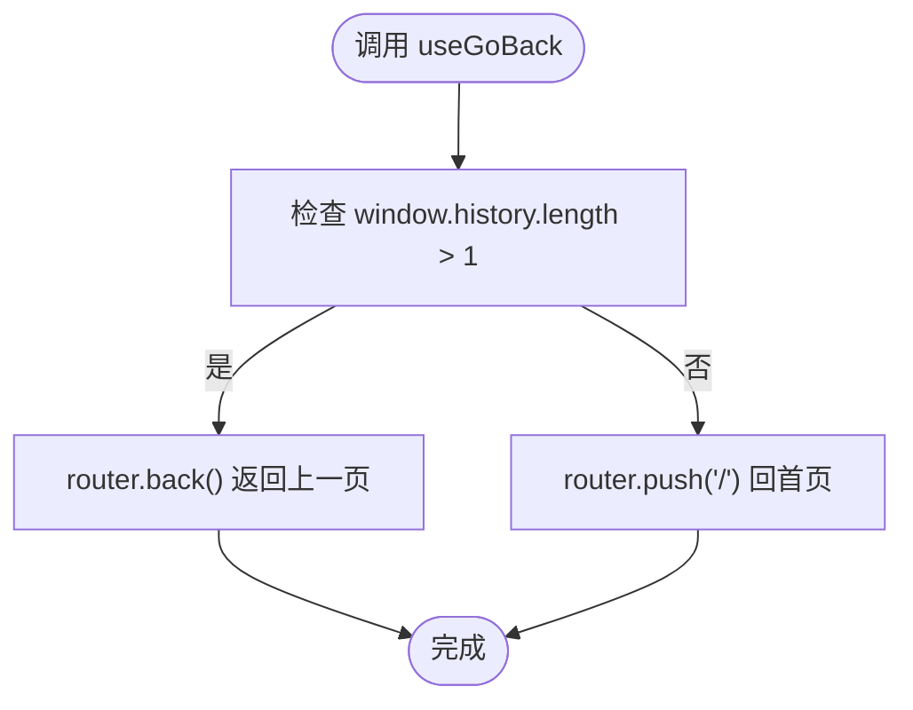
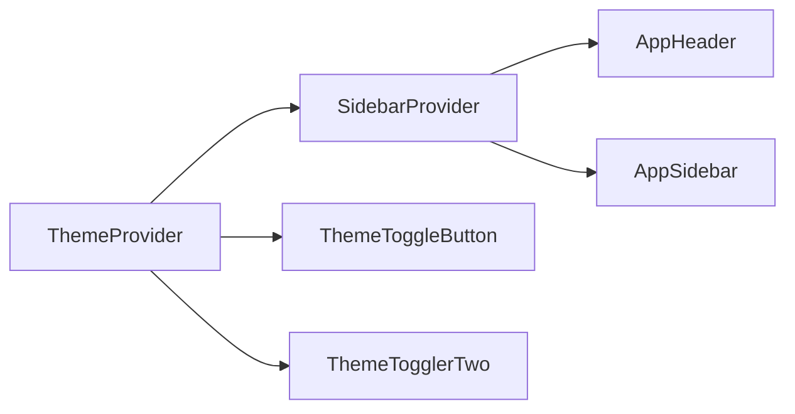

# 状态管理

<cite>
**本文引用的文件**
- [SidebarContext.tsx](file://src/context/SidebarContext.tsx)
- [ThemeContext.tsx](file://src/context/ThemeContext.tsx)
- [useModal.ts](file://src/hooks/useModal.ts)
- [useGoBack.ts](file://src/hooks/useGoBack.ts)
- [AppSidebar.tsx](file://src/layout/AppSidebar.tsx)
- [AppHeader.tsx](file://src/layout/AppHeader.tsx)
- [ThemeToggleButton.tsx](file://src/components/common/ThemeToggleButton.tsx)
- [ThemeTogglerTwo.tsx](file://src/components/common/ThemeTogglerTwo.tsx)
- [layout.tsx](file://src/app/layout.tsx)
- [page.tsx](file://src/app/(admin)/page.tsx)
- [page.tsx](file://src/app/(admin)/(others-pages)/(chart)/line-chart/page.tsx)
- [utils.ts](file://src/lib/utils.ts)
</cite>

## 目录
1. [简介](#简介)
2. [项目结构](#项目结构)
3. [核心组件](#核心组件)
4. [架构总览](#架构总览)
5. [详细组件分析](#详细组件分析)
6. [依赖关系分析](#依赖关系分析)
7. [性能考量](#性能考量)
8. [故障排查指南](#故障排查指南)
9. [结论](#结论)
10. [附录](#附录)

## 简介
本文件系统性梳理基于 React Context API 的状态管理方案，聚焦于两个核心上下文：
- SidebarContext：负责侧边栏状态（展开/收起、移动端开关、悬停状态、当前激活项、子菜单展开等）
- ThemeContext：负责主题状态（明/暗模式）与持久化

同时覆盖以下内容：
- Context Provider 的设计模式与状态提升策略
- 组件间通信机制与最佳实践
- 自定义 Hook 的使用方法（useModal、useGoBack）
- 性能优化建议与状态持久化方案
- 便于开发者深入理解与扩展

## 项目结构
本项目采用“按功能域分层”的组织方式，状态管理相关代码主要位于：
- 上下文：src/context
- 自定义 Hook：src/hooks
- 布局与容器：src/layout
- 页面与组件：src/app 与 src/components



图表来源
- [layout.tsx:16-32](file://src/app/layout.tsx#L16-L32)
- [ThemeContext.tsx:15-50](file://src/context/ThemeContext.tsx#L15-L50)
- [SidebarContext.tsx:27-84](file://src/context/SidebarContext.tsx#L27-L84)
- [AppHeader.tsx:10-182](file://src/layout/AppHeader.tsx#L10-L182)
- [AppSidebar.tsx:104-376](file://src/layout/AppSidebar.tsx#L104-L376)
- [ThemeToggleButton.tsx:4-43](file://src/components/common/ThemeToggleButton.tsx#L4-L43)
- [ThemeTogglerTwo.tsx:5-43](file://src/components/common/ThemeTogglerTwo.tsx#L5-L43)
- [page.tsx:16-43](file://src/app/(admin)/page.tsx#L16-L43)
- [page.tsx:12-23](file://src/app/(admin)/(others-pages)/(chart)/line-chart/page.tsx#L12-L23)

章节来源
- [layout.tsx:16-32](file://src/app/layout.tsx#L16-L32)

## 核心组件
- SidebarContext：提供侧边栏状态与操作函数，包括展开/收起、移动端开关、悬停、激活项、子菜单切换等
- ThemeContext：提供主题状态与切换函数，并在客户端侧进行本地存储持久化
- 自定义 Hook：useModal 提供模态框状态与控制；useGoBack 提供返回逻辑封装

章节来源
- [SidebarContext.tsx:4-25](file://src/context/SidebarContext.tsx#L4-L25)
- [ThemeContext.tsx:8-58](file://src/context/ThemeContext.tsx#L8-L58)
- [useModal.ts:4-12](file://src/hooks/useModal.ts#L4-L12)
- [useGoBack.ts:3-15](file://src/hooks/useGoBack.ts#L3-L15)

## 架构总览
本项目采用“Provider 包裹 + 自定义 Hook 访问”的模式：
- 在根布局中以嵌套 Provider 的形式注入主题与侧边栏上下文
- Header 与 Sidebar 通过 useSidebar 获取状态与操作
- 主题切换按钮通过 useTheme 切换主题并在 DOM 上添加/移除 dark 类名
- 页面组件不直接依赖上下文，保持低耦合



图表来源
- [AppHeader.tsx:13-21](file://src/layout/AppHeader.tsx#L13-L21)
- [SidebarContext.tsx:54-64](file://src/context/SidebarContext.tsx#L54-L64)
- [AppSidebar.tsx:105-106](file://src/layout/AppSidebar.tsx#L105-L106)
- [ThemeContext.tsx:41-43](file://src/context/ThemeContext.tsx#L41-L43)
- [ThemeToggleButton.tsx:5-10](file://src/components/common/ThemeToggleButton.tsx#L5-L10)

## 详细组件分析

### SidebarContext 侧边栏状态管理
- 设计要点
  - 使用 useState 管理 isExpanded、isMobileOpen、isHovered、activeItem、openSubmenu
  - 在 useEffect 中监听窗口尺寸变化，动态设置 isMobile 并重置移动端开关
  - 通过 Provider 将状态与操作函数暴露给子树
- 状态提升策略
  - 将“是否移动端”、“是否展开”等跨组件共享的状态提升至 Provider 层
  - 子组件仅通过 useSidebar 读取与触发变更，避免多处重复逻辑
- 组件间通信机制
  - Header 通过 useSidebar 控制侧边栏展开/收起与移动端开关
  - Sidebar 内部维护子菜单展开状态与高度计算，配合父级状态实现联动
- 关键实现路径
  - Provider 定义与导出：[SidebarProvider:27-84](file://src/context/SidebarContext.tsx#L27-L84)
  - Hook 定义与错误处理：[useSidebar:19-25](file://src/context/SidebarContext.tsx#L19-L25)
  - Header 使用示例：[AppHeader.useSidebar:13-21](file://src/layout/AppHeader.tsx#L13-L21)
  - Sidebar 使用示例：[AppSidebar.useSidebar:105-106](file://src/layout/AppSidebar.tsx#L105-L106)

```mermaid
classDiagram
class SidebarProvider {
+状态 : isExpanded, isMobileOpen, isHovered, activeItem, openSubmenu
+方法 : toggleSidebar(), toggleMobileSidebar(), toggleSubmenu(item), setIsHovered(), setActiveItem()
}
class useSidebar {
+返回 : { isExpanded, isMobileOpen, isHovered, activeItem, openSubmenu, toggleSidebar, toggleMobileSidebar, setIsHovered, setActiveItem, toggleSubmenu }
}
class AppHeader {
+调用 : useSidebar().toggleSidebar()/toggleMobileSidebar()
}
class AppSidebar {
+调用 : useSidebar().isExpanded/isMobileOpen/isHovered
+内部 : 子菜单展开/收起与高度计算
}
SidebarProvider --> useSidebar : "导出 Hook"
AppHeader --> useSidebar : "消费状态"
AppSidebar --> useSidebar : "消费状态"
```

图表来源
- [SidebarContext.tsx:27-84](file://src/context/SidebarContext.tsx#L27-L84)
- [AppHeader.tsx:13-21](file://src/layout/AppHeader.tsx#L13-L21)
- [AppSidebar.tsx:105-106](file://src/layout/AppSidebar.tsx#L105-L106)

章节来源
- [SidebarContext.tsx:27-84](file://src/context/SidebarContext.tsx#L27-L84)
- [AppHeader.tsx:13-21](file://src/layout/AppHeader.tsx#L13-L21)
- [AppSidebar.tsx:105-106](file://src/layout/AppSidebar.tsx#L105-L106)

### ThemeContext 主题状态管理
- 设计要点
  - 使用 useState 管理 theme，并在客户端初始化时从 localStorage 读取保存的主题
  - 通过副作用监听 theme 变化，同步更新 documentElement 的 dark 类名
  - 提供 toggleTheme 切换明/暗模式
- 状态持久化
  - 初始化阶段读取 localStorage，若无则默认 light
  - theme 变化后写回 localStorage，确保刷新后仍保持
- 组件间通信机制
  - 任意需要主题切换的组件均可通过 useTheme 获取 toggleTheme
  - 主题切换直接影响全局样式（通过类名）
- 关键实现路径
  - Provider 定义与导出：[ThemeProvider:15-50](file://src/context/ThemeContext.tsx#L15-L50)
  - Hook 定义与错误处理：[useTheme:52-58](file://src/context/ThemeContext.tsx#L52-L58)
  - 主题切换按钮示例：[ThemeToggleButton:5-10](file://src/components/common/ThemeToggleButton.tsx#L5-L10)



图表来源
- [ThemeContext.tsx:21-39](file://src/context/ThemeContext.tsx#L21-L39)
- [ThemeContext.tsx:41-43](file://src/context/ThemeContext.tsx#L41-L43)
- [ThemeToggleButton.tsx:5-10](file://src/components/common/ThemeToggleButton.tsx#L5-L10)

章节来源
- [ThemeContext.tsx:15-50](file://src/context/ThemeContext.tsx#L15-L50)
- [ThemeToggleButton.tsx:4-43](file://src/components/common/ThemeToggleButton.tsx#L4-L43)

### 自定义 Hook：useModal 与 useGoBack
- useModal
  - 功能：提供 isOpen 状态与 open/close/toggle 控制函数
  - 使用场景：弹窗、抽屉、对话框等
  - 关键实现路径：[useModal:4-12](file://src/hooks/useModal.ts#L4-L12)
- useGoBack
  - 功能：封装返回逻辑，优先使用浏览器历史返回，否则跳转到首页
  - 使用场景：列表页返回详情页、表单取消等
  - 关键实现路径：[useGoBack:3-15](file://src/hooks/useGoBack.ts#L3-L15)



图表来源
- [useGoBack.ts:6-12](file://src/hooks/useGoBack.ts#L6-L12)

章节来源
- [useModal.ts:4-12](file://src/hooks/useModal.ts#L4-L12)
- [useGoBack.ts:3-15](file://src/hooks/useGoBack.ts#L3-L15)

### 页面与布局中的实际应用
- 根布局嵌套 Provider，保证全局可用
  - [RootLayout:24-28](file://src/app/layout.tsx#L24-L28)
- 侧边栏与头部组件消费上下文
  - [AppHeader:13-21](file://src/layout/AppHeader.tsx#L13-L21)
  - [AppSidebar:105-106](file://src/layout/AppSidebar.tsx#L105-L106)
- 主题切换按钮消费上下文
  - [ThemeToggleButton:5-10](file://src/components/common/ThemeToggleButton.tsx#L5-L10)
- 页面组件不直接依赖上下文，保持低耦合
  - [首页](file://src/app/(admin)/page.tsx#L16-L42)
  - [折线图页](file://src/app/(admin)/(others-pages)/(chart)/line-chart/page.tsx#L12-L23)

章节来源
- [layout.tsx:24-28](file://src/app/layout.tsx#L24-L28)
- [AppHeader.tsx:13-21](file://src/layout/AppHeader.tsx#L13-L21)
- [AppSidebar.tsx:105-106](file://src/layout/AppSidebar.tsx#L105-L106)
- [ThemeToggleButton.tsx:5-10](file://src/components/common/ThemeToggleButton.tsx#L5-L10)
- [page.tsx:16-43](file://src/app/(admin)/page.tsx#L16-L43)
- [page.tsx:12-23](file://src/app/(admin)/(others-pages)/(chart)/line-chart/page.tsx#L12-L23)

## 依赖关系分析
- Provider 注入顺序
  - ThemeProvider 外层包裹，再由 LayoutConfigHandler 处理布局配置，最后 SidebarProvider 包裹子树
- 组件依赖
  - AppHeader 依赖 SidebarContext
  - AppSidebar 依赖 SidebarContext
  - ThemeToggleButton 依赖 ThemeContext
- 数据流向
  - 用户交互 -> Header/Sidebar/ThemeToggleButton -> Context Provider -> 全局状态更新 -> 视图响应



图表来源
- [layout.tsx:24-28](file://src/app/layout.tsx#L24-L28)
- [AppHeader.tsx:13](file://src/layout/AppHeader.tsx#L13)
- [AppSidebar.tsx:105](file://src/layout/AppSidebar.tsx#L105)
- [ThemeToggleButton.tsx:5](file://src/components/common/ThemeToggleButton.tsx#L5)
- [ThemeTogglerTwo.tsx:6](file://src/components/common/ThemeTogglerTwo.tsx#L6)

章节来源
- [layout.tsx:24-28](file://src/app/layout.tsx#L24-L28)

## 性能考量
- 避免不必要的重渲染
  - 将高频更新的状态拆分为独立 Context，减少无关组件订阅
  - 对于复杂子菜单，AppSidebar 已通过局部状态与 ref 控制高度，避免全树重渲染
- 事件与副作用
  - SidebarContext 在初始化时仅绑定一次 resize 事件，卸载时清理，避免内存泄漏
  - ThemeContext 在初始化与 theme 变化时才写入 localStorage，降低 IO 开销
- 渲染优化建议
  - 使用 React.memo 或 useMemo 缓存昂贵计算
  - 将不依赖上下文的组件下沉，减少订阅范围
  - 合理拆分 Provider，避免单一 Context 过大

## 故障排查指南
- useSidebar/useTheme 报错
  - 现象：抛出“必须在对应 Provider 内使用”的错误
  - 排查：确认根布局已正确嵌套对应 Provider
  - 参考路径：[useSidebar 错误处理:21-23](file://src/context/SidebarContext.tsx#L21-L23)，[useTheme 错误处理:54-56](file://src/context/ThemeContext.tsx#L54-L56)
- 主题切换无效
  - 现象：点击切换按钮未生效
  - 排查：确认 ThemeProvider 已包裹，且未被其他 Provider 覆盖；检查 localStorage 是否被禁用或异常
  - 参考路径：[ThemeContext 初始化与持久化:21-39](file://src/context/ThemeContext.tsx#L21-L39)
- 移动端侧边栏不显示
  - 现象：移动端无法打开侧边栏
  - 排查：确认 AppHeader 在小屏下调用 toggleMobileSidebar；检查 isMobileOpen 状态是否被外部覆盖
  - 参考路径：[AppHeader 移动端切换:16-21](file://src/layout/AppHeader.tsx#L16-L21)，[SidebarContext 移动端逻辑:37-52](file://src/context/SidebarContext.tsx#L37-L52)

章节来源
- [SidebarContext.tsx:21-23](file://src/context/SidebarContext.tsx#L21-L23)
- [ThemeContext.tsx:21-39](file://src/context/ThemeContext.tsx#L21-L39)
- [AppHeader.tsx:16-21](file://src/layout/AppHeader.tsx#L16-L21)

## 结论
本项目通过 Context Provider 与自定义 Hook 实现了清晰、可扩展的状态管理：
- SidebarContext 与 ThemeContext 分别承担侧边栏与主题两大领域，职责明确
- Header 与 Sidebar 通过 useSidebar 解耦，主题切换通过 useTheme 实现全局一致性
- 自定义 Hook（useModal、useGoBack）为业务场景提供即插即用的能力
- 建议在大型应用中继续拆分 Context、引入选择性订阅与缓存策略，以进一步提升性能与可维护性

## 附录
- 最佳实践清单
  - 将共享状态提升至最近公共祖先 Provider
  - 为每个 Context 提供对应的 Hook，并在 Hook 内抛出明确的错误提示
  - 对频繁更新的状态进行拆分，避免全树重渲染
  - 使用 localStorage 或 sessionStorage 进行轻量持久化，注意边界情况（隐私模式、禁用存储）
- 扩展建议
  - 引入状态选择器（selector）以减少订阅范围
  - 对复杂状态引入 reducer 与 dispatch，统一更新入口
  - 为关键状态增加快照/回滚能力（如主题切换前的备份）