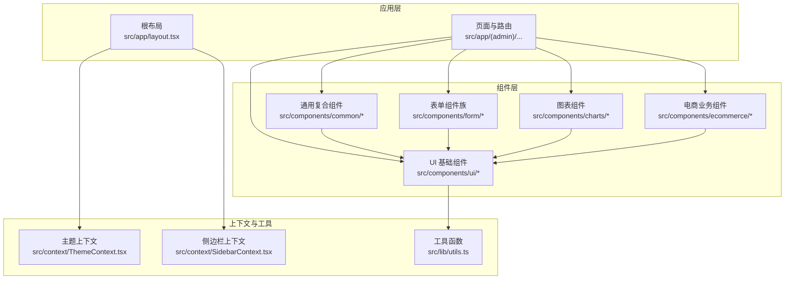
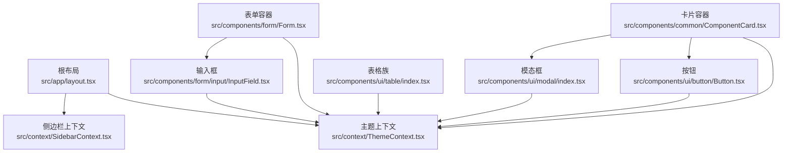
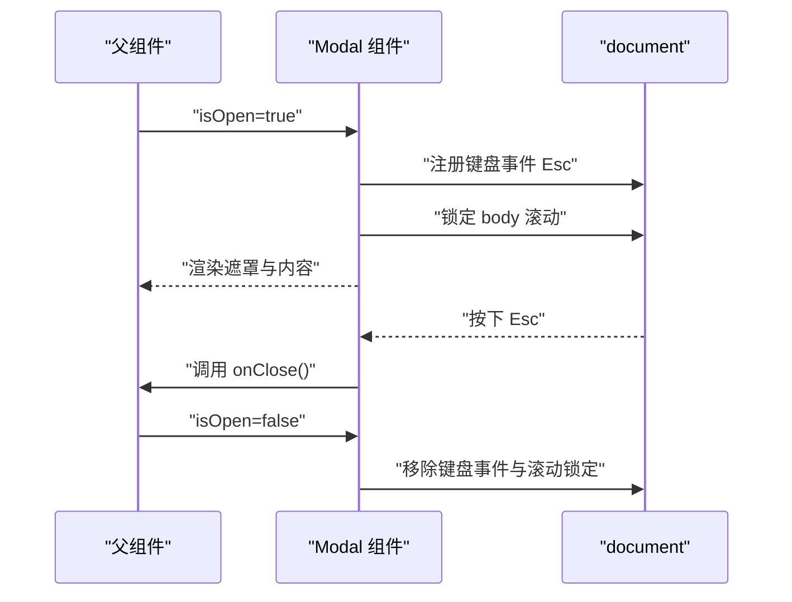
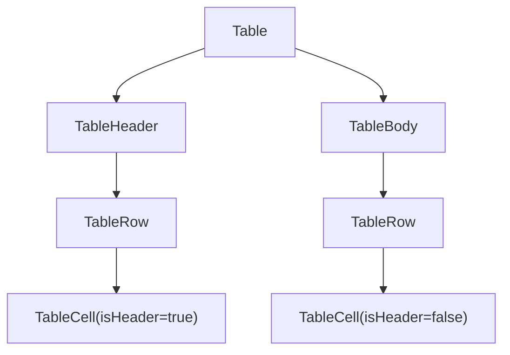
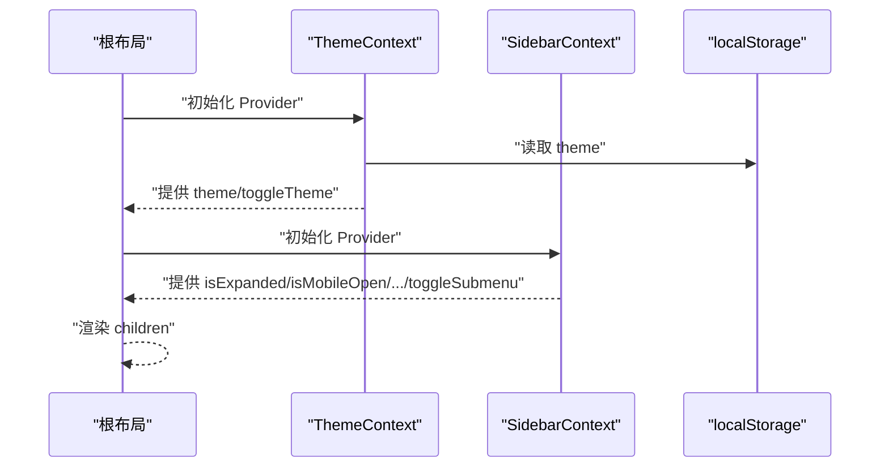
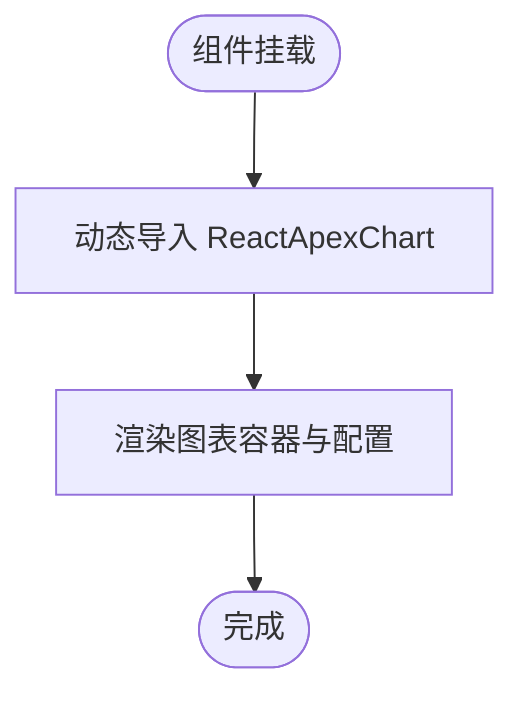
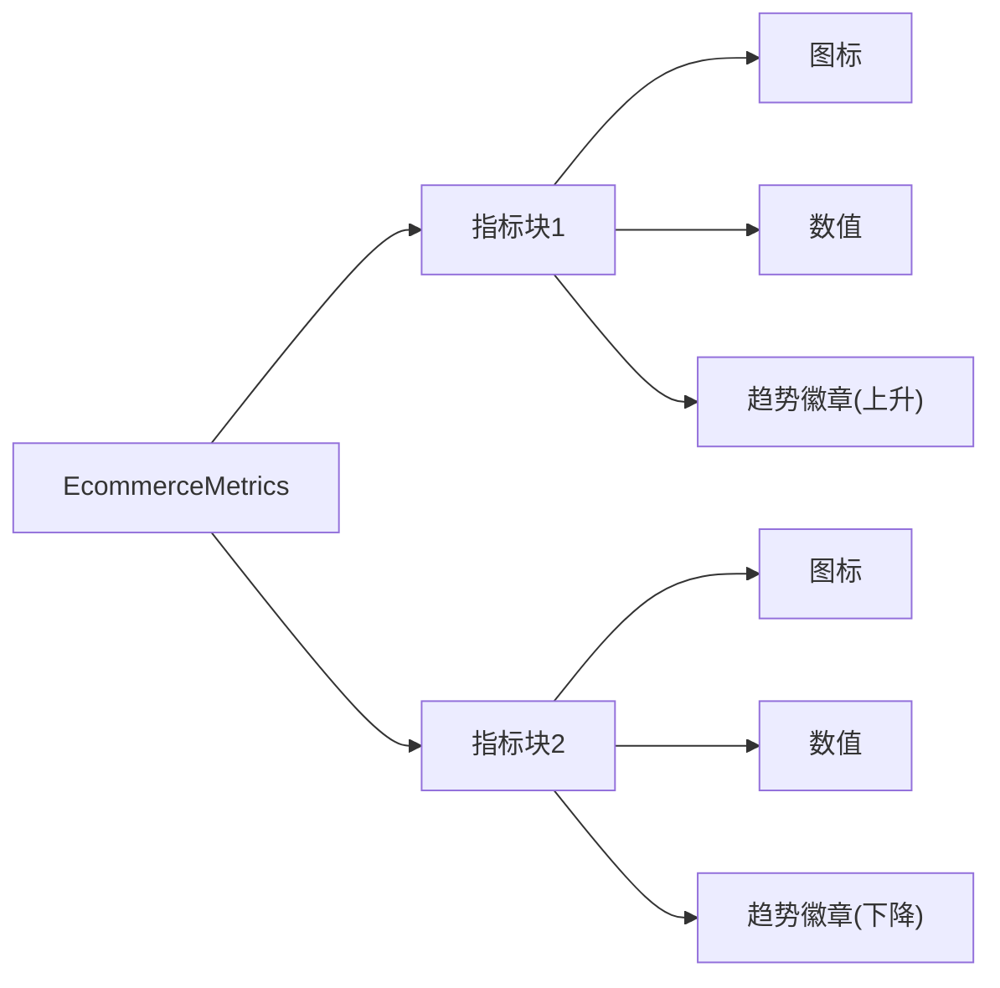
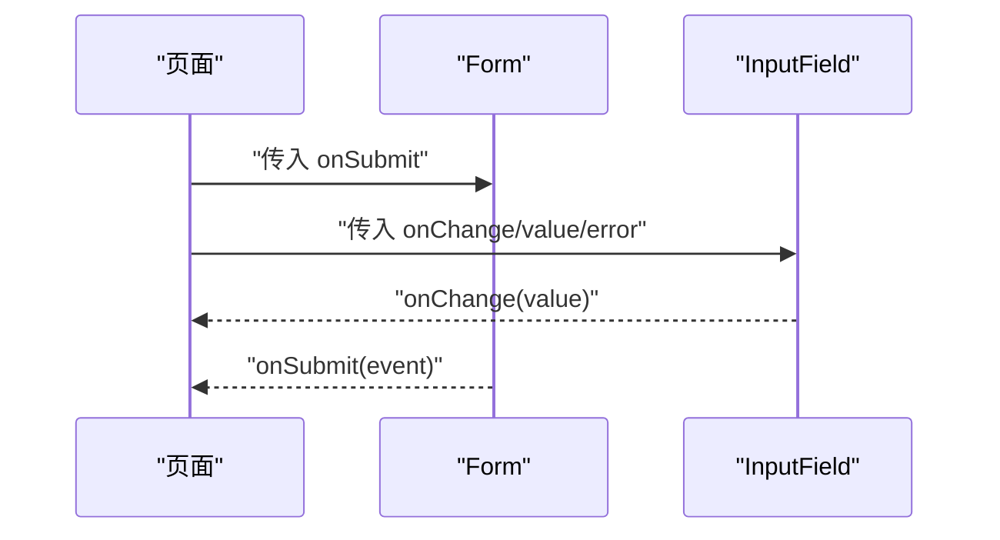
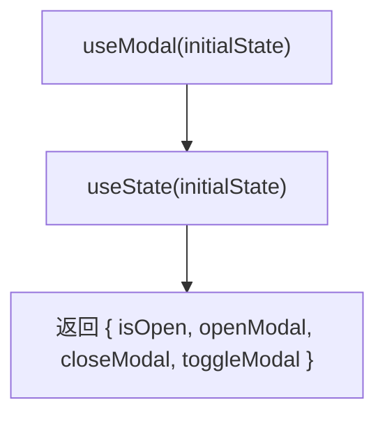
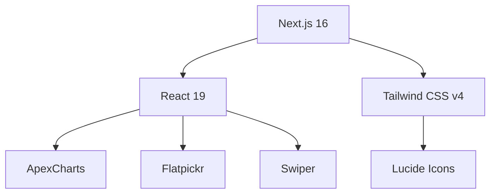

# 组件架构

<cite>
**本文引用的文件**
- [README.md](file://README.md)
- [package.json](file://package.json)
- [src/app/layout.tsx](file://src/app/layout.tsx)
- [src/components/ui/button/Button.tsx](file://src/components/ui/button/Button.tsx)
- [src/components/common/ComponentCard.tsx](file://src/components/common/ComponentCard.tsx)
- [src/components/ui/modal/index.tsx](file://src/components/ui/modal/index.tsx)
- [src/components/ui/table/index.tsx](file://src/components/ui/table/index.tsx)
- [src/context/ThemeContext.tsx](file://src/context/ThemeContext.tsx)
- [src/context/SidebarContext.tsx](file://src/context/SidebarContext.tsx)
- [src/lib/utils.ts](file://src/lib/utils.ts)
- [src/components/form/Form.tsx](file://src/components/form/Form.tsx)
- [src/components/form/input/InputField.tsx](file://src/components/form/input/InputField.tsx)
- [src/components/charts/bar/BarChartOne.tsx](file://src/components/charts/bar/BarChartOne.tsx)
- [src/components/ecommerce/EcommerceMetrics.tsx](file://src/components/ecommerce/EcommerceMetrics.tsx)
- [src/hooks/useModal.ts](file://src/hooks/useModal.ts)
</cite>

## 目录
1. [简介](#简介)
2. [项目结构](#项目结构)
3. [核心组件](#核心组件)
4. [架构总览](#架构总览)
5. [详细组件分析](#详细组件分析)
6. [依赖分析](#依赖分析)
7. [性能考虑](#性能考虑)
8. [故障排查指南](#故障排查指南)
9. [结论](#结论)
10. [附录](#附录)

## 简介
本项目是一个基于 Next.js 16、React 19、TypeScript 和 Tailwind CSS 的免费后台管理模板，提供丰富的 UI 组件与页面示例，覆盖图表、表格、表单、模态框、按钮等常用元素，并内置暗色主题切换与响应式侧边栏交互。组件采用分层设计：基础 UI 组件（如 Button、Modal、Table）、复合组件（如图表、电商指标卡片）与业务组件（如认证表单、日历）。本文档系统梳理组件化设计理念、命名与文件组织规范、Props 设计原则、事件处理模式、组件组合与复用策略、生命周期管理、性能优化与可访问性支持，并给出最佳实践、测试策略与文档规范。

## 项目结构
项目采用“按功能域分层 + 按组件类型分层”的混合组织方式：
- 根目录包含应用入口、全局样式与配置；应用路由位于 src/app 下，页面按功能域分组（如 (admin)/(ui-elements)/(forms) 等）。
- 组件库集中于 src/components，按领域进一步细分：ui、common、form、charts、ecommerce、example、layout、header、tables、videos 等。
- 上下文与工具位于 src/context 与 src/lib，分别提供主题、侧边栏状态管理与通用工具函数。
- 根布局负责注入 Provider、全局样式与通知组件，确保主题、布局配置与上下文在整树生效。

图示来源
- [src/app/layout.tsx:16-32](file://src/app/layout.tsx#L16-L32)
- [src/context/ThemeContext.tsx:15-50](file://src/context/ThemeContext.tsx#L15-L50)
- [src/context/SidebarContext.tsx:27-84](file://src/context/SidebarContext.tsx#L27-L84)

章节来源
- [README.md:77-89](file://README.md#L77-L89)
- [package.json:15-49](file://package.json#L15-L49)
- [src/app/layout.tsx:16-32](file://src/app/layout.tsx#L16-L32)

## 核心组件
本节聚焦基础 UI 组件与通用复合组件的设计与使用方式，体现统一的 Props 设计、事件处理模式与可复用策略。

- Button（基础按钮）
  - 设计要点：通过 size、variant、icon 插槽与 className 扩展实现多形态复用；禁用态与过渡类名统一管理。
  - 事件处理：onClick 回调由外部传入，避免在组件内硬编码行为。
  - 可访问性：原生 button 类型与禁用属性保持语义正确。
  - 复用策略：作为所有交互入口的基础构件，其他复合组件以它为原子能力组合。

- Modal（模态框）
  - 设计要点：受控 isOpen、onClose 控制显示与关闭；Esc 键盘事件、背景点击、滚动锁定等行为在客户端副作用中管理。
  - 事件处理：内部通过 useRef 获取容器并阻止点击冒泡；对外暴露 showCloseButton、isFullscreen 等扩展点。
  - 生命周期：useEffect 注册/清理键盘事件与 body 滚动控制，保证组件卸载时资源回收。
  - 可访问性：焦点管理建议在上层业务中补充（例如自动聚焦到首个可交互元素），当前实现以最小必要副作用为主。

- Table（表格复合组件族）
  - 设计要点：Table、TableHeader、TableBody、TableRow、TableCell 五子组件通过统一的 className 与 isHeader 切换渲染标签，形成一致的表格结构。
  - Props 设计：每个子组件独立的 Props 接口，职责单一，便于按需组合。
  - 复用策略：业务页面直接拼装，减少重复样板代码。

- ComponentCard（通用卡片容器）
  - 设计要点：标题与描述区域与内容区分离，支持自定义 className 扩展样式；常用于“组件展示页”场景。
  - 复用策略：作为示例页的通用容器，提升文档与演示的一致性。

- Form 与 InputField（表单族）
  - 设计要点：Form 统一处理默认提交行为；InputField 支持状态态（成功/错误/禁用）与提示文本，结合 className 实现风格一致性。
  - 事件处理：onChange、onSubmit 等回调由父组件传入，组件仅负责渲染与状态类名拼接。
  - 可访问性：建议配合 Label 组件使用，明确控件语义；当前实现强调视觉状态反馈。

章节来源
- [src/components/ui/button/Button.tsx:3-57](file://src/components/ui/button/Button.tsx#L3-L57)
- [src/components/ui/modal/index.tsx:4-96](file://src/components/ui/modal/index.tsx#L4-L96)
- [src/components/ui/table/index.tsx:3-67](file://src/components/ui/table/index.tsx#L3-L67)
- [src/components/common/ComponentCard.tsx:3-41](file://src/components/common/ComponentCard.tsx#L3-L41)
- [src/components/form/Form.tsx:3-24](file://src/components/form/Form.tsx#L3-L24)
- [src/components/form/input/InputField.tsx:3-87](file://src/components/form/input/InputField.tsx#L3-L87)

## 架构总览
组件架构围绕“上下文驱动 + 组合优先”的理念构建：
- 上下文层：ThemeContext 提供主题状态与切换；SidebarContext 提供侧边栏展开/收起、移动端状态与子菜单控制。
- 布局层：RootLayout 注入 Provider，确保主题、布局配置与通知在整树生效。
- 组件层：基础 UI 组件作为“原子”，复合组件作为“分子”，业务组件作为“宏观页面片段”。

图示来源
- [src/app/layout.tsx:24-28](file://src/app/layout.tsx#L24-L28)
- [src/context/ThemeContext.tsx:41-43](file://src/context/ThemeContext.tsx#L41-L43)
- [src/context/SidebarContext.tsx:54-64](file://src/context/SidebarContext.tsx#L54-L64)
- [src/components/ui/button/Button.tsx:15-57](file://src/components/ui/button/Button.tsx#L15-L57)
- [src/components/ui/modal/index.tsx:13-96](file://src/components/ui/modal/index.tsx#L13-L96)
- [src/components/ui/table/index.tsx:35-67](file://src/components/ui/table/index.tsx#L35-L67)
- [src/components/common/ComponentCard.tsx:10-41](file://src/components/common/ComponentCard.tsx#L10-L41)
- [src/components/form/Form.tsx:9-24](file://src/components/form/Form.tsx#L9-L24)
- [src/components/form/input/InputField.tsx:21-87](file://src/components/form/input/InputField.tsx#L21-L87)

## 详细组件分析

### 模态框组件（Modal）生命周期与事件流
- 生命周期管理：在 isOpen 为真时注册键盘事件与滚动控制，在卸载时清理；确保多次打开/关闭不会产生泄漏。
- 事件处理模式：onClose 由父组件传入，内部通过点击背景或关闭按钮触发；点击内容区域阻止冒泡，避免误关。
- 可访问性建议：增加自动聚焦到首个可交互元素、焦点环回与 ARIA 属性（当前实现以最小必要副作用为主）。

图示来源
- [src/components/ui/modal/index.tsx:23-49](file://src/components/ui/modal/index.tsx#L23-L49)
- [src/components/ui/modal/index.tsx:57-94](file://src/components/ui/modal/index.tsx#L57-L94)

章节来源
- [src/components/ui/modal/index.tsx:4-96](file://src/components/ui/modal/index.tsx#L4-L96)

### 表格组件族（Table）组合与扩展
- 组合关系：Table 作为根容器，TableHeader/Body 包裹 TableRow，TableRow 再包裹 TableCell；isHeader 控制 th/td 渲染。
- 扩展机制：通过 className 透传与子组件 Props 接口，业务可按需添加排序、选择列等特性。
- 复用策略：在页面中直接拼装，减少重复样板代码，提升一致性。

图示来源
- [src/components/ui/table/index.tsx:35-67](file://src/components/ui/table/index.tsx#L35-L67)

章节来源
- [src/components/ui/table/index.tsx:3-67](file://src/components/ui/table/index.tsx#L3-L67)

### 主题与侧边栏上下文（ThemeContext、SidebarContext）
- 主题上下文：从本地存储读取初始主题，切换时写回本地存储并在 DOM 上添加/移除 dark 类，确保全局样式同步。
- 侧边栏上下文：维护展开/收起、移动端状态、悬停、活动项与子菜单开关；根据窗口尺寸动态调整移动端行为。
- 组合关系：根布局同时注入 ThemeProvider 与 SidebarProvider，保证主题与布局状态贯穿全树。

图示来源
- [src/app/layout.tsx:24-28](file://src/app/layout.tsx#L24-L28)
- [src/context/ThemeContext.tsx:21-39](file://src/context/ThemeContext.tsx#L21-L39)
- [src/context/SidebarContext.tsx:37-52](file://src/context/SidebarContext.tsx#L37-L52)

章节来源
- [src/context/ThemeContext.tsx:15-59](file://src/context/ThemeContext.tsx#L15-L59)
- [src/context/SidebarContext.tsx:27-85](file://src/context/SidebarContext.tsx#L27-L85)

### 图表组件（BarChartOne）与动态导入
- 动态导入：使用 next/dynamic 禁用 SSR，避免浏览器环境缺失导致的渲染错误。
- 配置与数据：通过 ApexCharts 的 options 与 series 定义图表外观与数据源；容器具备横向滚动与最小宽度约束，适配不同屏幕。
- 复用策略：将配置与数据抽象为可注入参数，便于在多个页面中复用同一图表组件。

图示来源
- [src/components/charts/bar/BarChartOne.tsx:8-10](file://src/components/charts/bar/BarChartOne.tsx#L8-L10)
- [src/components/charts/bar/BarChartOne.tsx:101-109](file://src/components/charts/bar/BarChartOne.tsx#L101-L109)

章节来源
- [src/components/charts/bar/BarChartOne.tsx:1-111](file://src/components/charts/bar/BarChartOne.tsx#L1-L111)

### 电商指标组件（EcommerceMetrics）与组合模式
- 组合关系：以卡片容器承载指标块，内部组合图标、数值与趋势徽章，形成统一的信息密度与对比方式。
- 复用策略：通过颜色与图标参数化，快速复制类似布局的指标块。

图示来源
- [src/components/ecommerce/EcommerceMetrics.tsx:6-57](file://src/components/ecommerce/EcommerceMetrics.tsx#L6-L57)

章节来源
- [src/components/ecommerce/EcommerceMetrics.tsx:1-57](file://src/components/ecommerce/EcommerceMetrics.tsx#L1-L57)

### 表单组件（Form 与 InputField）与状态管理
- 表单容器：统一处理默认提交行为，将事件透传给父组件，避免在组件内硬编码业务逻辑。
- 输入组件：根据状态（成功/错误/禁用）拼接类名，支持提示文本；与 Form、Label 协同使用提升可访问性。
- 复用策略：通过受控 props 与回调，实现跨页面的统一表单体验。

图示来源
- [src/components/form/Form.tsx:9-21](file://src/components/form/Form.tsx#L9-L21)
- [src/components/form/input/InputField.tsx:21-87](file://src/components/form/input/InputField.tsx#L21-L87)

章节来源
- [src/components/form/Form.tsx:1-24](file://src/components/form/Form.tsx#L1-L24)
- [src/components/form/input/InputField.tsx:1-87](file://src/components/form/input/InputField.tsx#L1-L87)

### Hook 与上下文的协作（useModal）
- 设计要点：useModal 返回 isOpen 与 open/close/toggle 方法，简化模态框状态管理；适合在页面级或业务组件中复用。
- 复用策略：在多个页面共享同一套状态逻辑，降低重复代码。

图示来源
- [src/hooks/useModal.ts:4-12](file://src/hooks/useModal.ts#L4-L12)

章节来源
- [src/hooks/useModal.ts:1-13](file://src/hooks/useModal.ts#L1-L13)

## 依赖分析
- 运行时依赖：Next.js 16、React 19、Tailwind CSS v4、ApexCharts、Flatpickr、Swiper、Lucide 等，支撑页面渲染、图表可视化、日期选择与媒体播放等能力。
- 工具链：ESLint、Prettier、TypeScript、PostCSS、Tailwind 4 等，保障代码质量与样式一致性。
- 组件依赖：UI 基础组件依赖工具函数（clsx + tailwind-merge）进行类名合并；图表组件依赖动态导入避免 SSR 渲染问题；上下文在根布局注入，影响全局主题与布局。

图示来源
- [package.json:15-49](file://package.json#L15-L49)

章节来源
- [package.json:15-49](file://package.json#L15-L49)

## 性能考虑
- 动态导入：图表组件使用动态导入避免 SSR 渲染，减少首屏包体与首次绘制阻塞。
- 条件渲染与副作用：模态框在 isOpen 时才注册键盘事件与滚动锁定，卸载时清理，避免常驻监听。
- 类名合并：使用 clsx 与 tailwind-merge 合并类名，减少冗余样式与重绘。
- 响应式与可访问性：主题切换通过 DOM 类名控制，避免不必要的重渲染；建议在复杂交互中补充焦点管理与 ARIA 属性。

## 故障排查指南
- 模态框无法关闭或背景仍滚动
  - 检查 isOpen 状态是否正确传递至 Modal；确认 onClose 是否被调用。
  - 确认副作用在组件卸载时被清理（键盘事件与滚动锁定）。
- 图表不显示或报错
  - 确认动态导入已生效且未在 SSR 环境中直接渲染图表组件。
  - 检查容器尺寸与最小宽度设置，确保图表有足够空间渲染。
- 主题切换无效
  - 检查本地存储键值与 DOM 类名更新逻辑；确认根布局已注入 ThemeProvider。
- 表单提交异常
  - 确认 Form 容器已阻止默认提交并将事件透传给 onSubmit；检查 Input 的受控 props 与回调是否正确绑定。

章节来源
- [src/components/ui/modal/index.tsx:23-49](file://src/components/ui/modal/index.tsx#L23-L49)
- [src/components/charts/bar/BarChartOne.tsx:8-10](file://src/components/charts/bar/BarChartOne.tsx#L8-L10)
- [src/context/ThemeContext.tsx:30-39](file://src/context/ThemeContext.tsx#L30-L39)
- [src/components/form/Form.tsx:12-15](file://src/components/form/Form.tsx#L12-L15)

## 结论
本项目通过清晰的分层与组合策略，实现了高内聚、低耦合的组件体系：基础 UI 组件提供一致的交互与视觉语言，复合组件承担常见布局与数据展示，业务组件聚焦具体场景。上下文与工具函数贯穿全局，保障主题、布局与样式的一致性。遵循本文档的命名规范、Props 设计原则、事件处理模式与复用策略，可帮助贡献者高效扩展与维护组件库。

## 附录
- 命名规范与文件组织
  - 文件命名：采用帕斯卡命名法（如 Button.tsx、Modal/index.tsx），目录按功能域划分（ui、common、form、charts、ecommerce）。
  - 组件导出：基础组件导出默认函数，复合组件导出命名导出（如 Table、TableHeader 等）。
- Props 设计原则
  - 必需参数最小化：仅暴露必要的 props；可选参数提供合理默认值。
  - 状态态统一：通过布尔/枚举参数控制视觉状态（如 success/error/disabled），避免在组件内硬编码。
  - 回调解耦：将交互行为通过回调交由父组件处理，组件只负责渲染与状态类名拼接。
- 事件处理模式
  - 受控组件：通过 value/defaultValue 与 onChange 实现受控输入。
  - 事件透传：容器组件（如 Form、Modal）统一处理默认行为后将事件透传给父组件。
- 组件组合与复用
  - 组合优先：通过子组件拼装（如 Table → TableHeader/Body → TableRow → TableCell）提升可读性与可维护性。
  - 参数化：将配置与数据抽象为可注入参数，便于跨页面复用。
- 生命周期管理
  - 客户端副作用：在 useEffect 中注册/清理键盘事件、滚动控制与本地存储同步。
  - 动态导入：在需要浏览器 API 的组件中使用动态导入，避免 SSR 渲染失败。
- 性能优化
  - 按需加载：对第三方可视化与媒体组件采用动态导入。
  - 类名合并：使用 clsx 与 tailwind-merge 合并类名，减少样式冲突与重绘。
- 可访问性支持
  - 语义化标签：保持原生控件语义（button、input），提供 aria-label 或配合 Label 组件。
  - 键盘可达：为可交互元素提供键盘操作路径（如 Esc 关闭、Tab 导航）。
- 最佳实践
  - 单一职责：每个子组件职责单一，Props 接口清晰。
  - 默认值与可选：为可选参数提供合理默认值，避免运行时错误。
  - 文档与示例：为每个组件提供简要说明与使用示例，便于集成。
- 测试策略
  - 单元测试：针对 Props 与状态态渲染进行断言；对回调触发进行事件模拟。
  - 集成测试：在页面中组装组件，验证组合效果与交互流程。
  - 可访问性测试：使用自动化工具与人工检查，确保键盘可达与语义正确。
- 文档编写规范
  - 组件说明：包含用途、Props 列表、默认值、事件回调与注意事项。
  - 示例代码：提供最小可用示例，标注关键 props 与回调。
  - 变更记录：在组件注释中标注重要变更与兼容性说明。