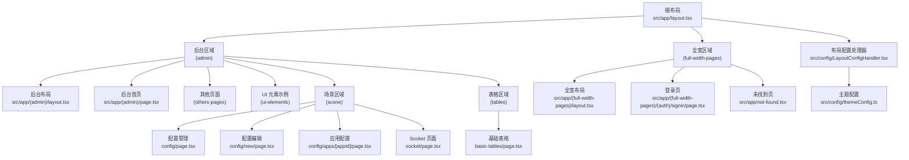
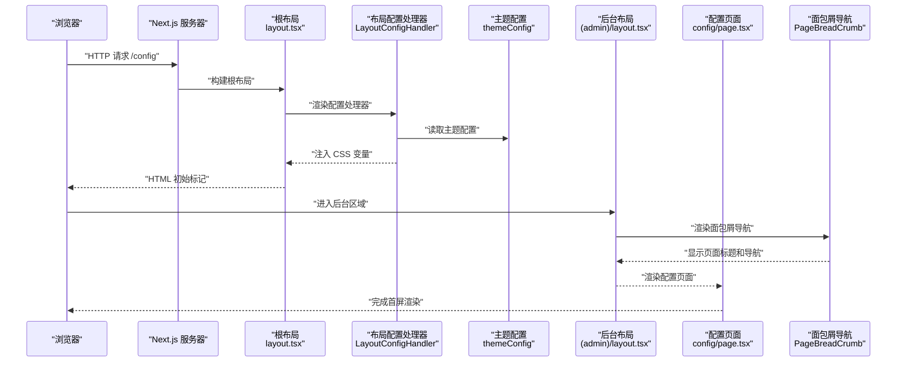
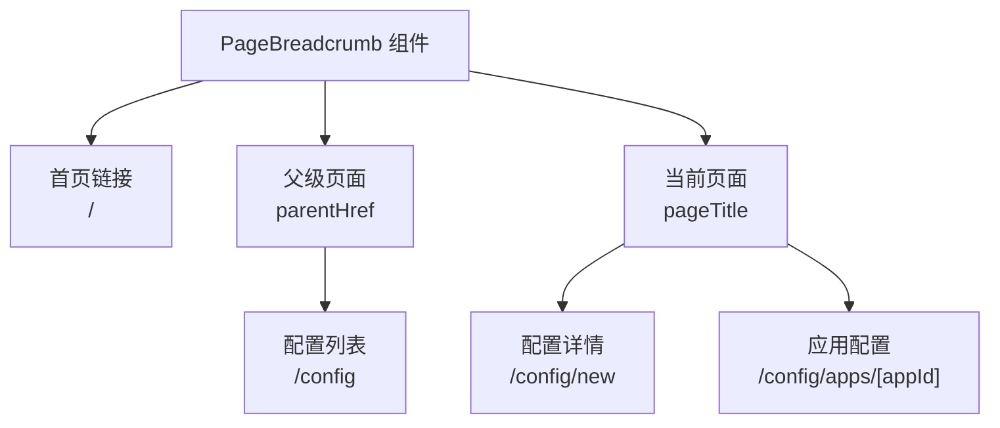
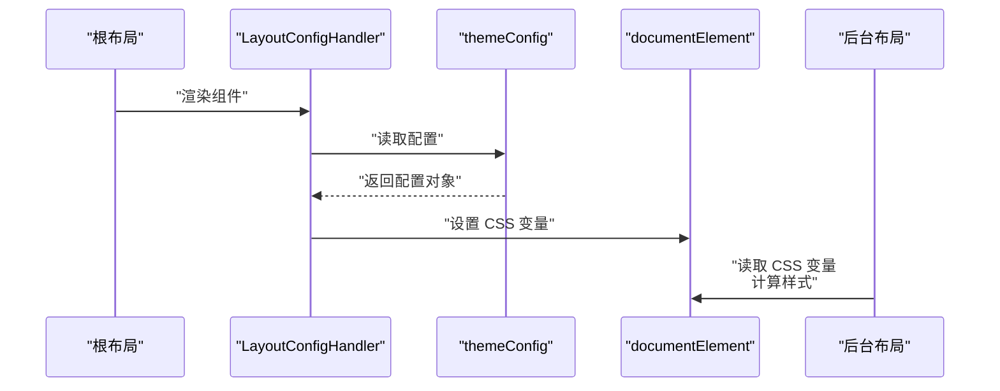
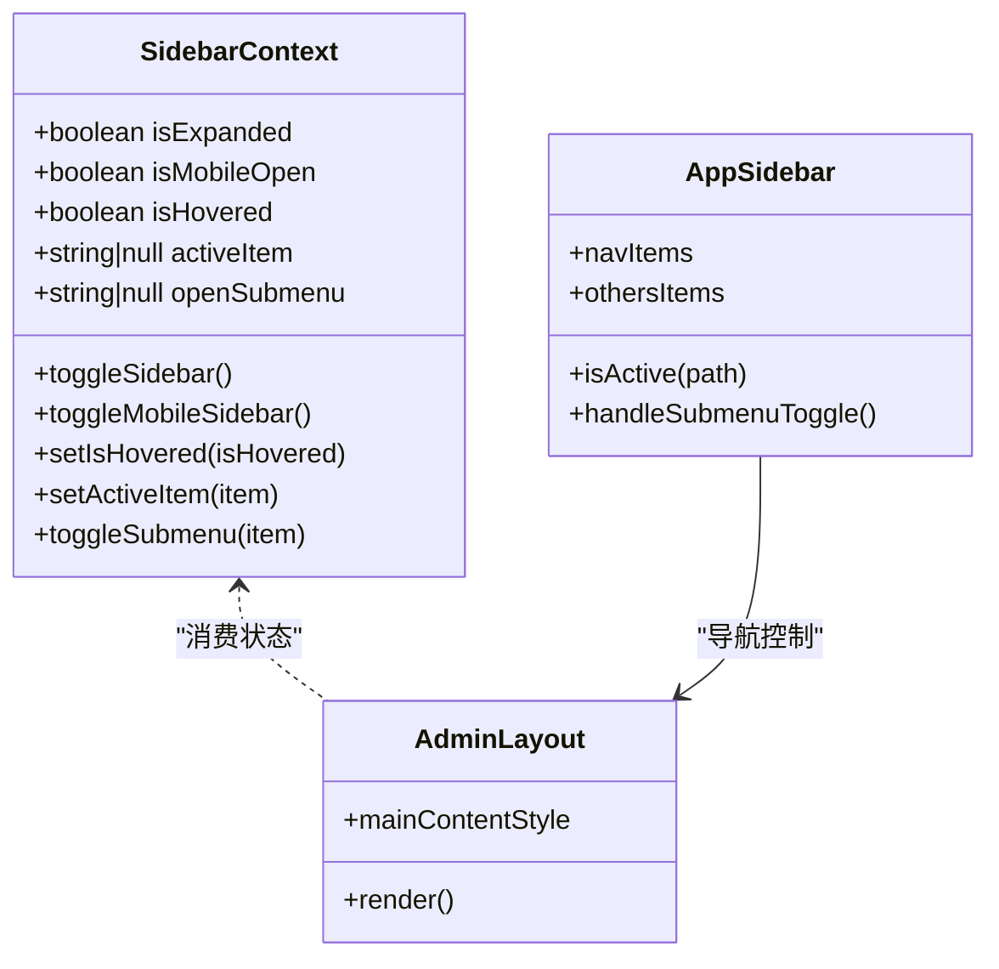
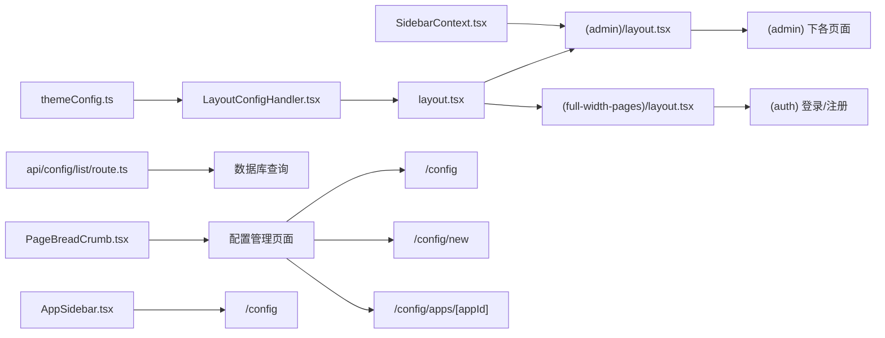

# 路由架构

<cite>
**本文引用的文件**
- [src/app/layout.tsx](file://src/app/layout.tsx)
- [src/app/(admin)/layout.tsx](file://src/app/(admin)/layout.tsx)
- [src/app/(full-width-pages)/layout.tsx](file://src/app/(full-width-pages)/layout.tsx)
- [src/config/LayoutConfigHandler.tsx](file://src/config/LayoutConfigHandler.tsx)
- [src/config/themeConfig.ts](file://src/config/themeConfig.ts)
- [src/context/SidebarContext.tsx](file://src/context/SidebarContext.tsx)
- [src/app/not-found.tsx](file://src/app/not-found.tsx)
- [src/app/(admin)/page.tsx](file://src/app/(admin)/page.tsx)
- [src/app/(admin)/(others-pages)/blank/page.tsx](file://src/app/(admin)/(others-pages)/blank/page.tsx)
- [src/app/(admin)/(ui-elements)/buttons/page.tsx](file://src/app/(admin)/(ui-elements)/buttons/page.tsx)
- [src/app/(full-width-pages)/(auth)/signin/page.tsx](file://src/app/(full-width-pages)/(auth)/signin/page.tsx)
- [src/app/api/config/list/route.ts](file://src/app/api/config/list/route.ts)
- [src/app/(admin)/(others-pages)/(scene)/config/page.tsx](file://src/app/(admin)/(others-pages)/(scene)/config/page.tsx)
- [src/app/(admin)/(others-pages)/(scene)/config/new/page.tsx](file://src/app/(admin)/(others-pages)/(scene)/config/new/page.tsx)
- [src/app/(admin)/(others-pages)/(scene)/config/apps/[appId]/page.tsx](file://src/app/(admin)/(others-pages)/(scene)/config/apps/[appId]/page.tsx)
- [src/components/common/PageBreadCrumb.tsx](file://src/components/common/PageBreadCrumb.tsx)
- [src/layout/AppSidebar.tsx](file://src/layout/AppSidebar.tsx)
- [src/app/(admin)/(others-pages)/(tables)/basic-tables/page.tsx](file://src/app/(admin)/(others-pages)/(tables)/basic-tables/page.tsx)
- [src/app/(admin)/(others-pages)/(scene)/socket/page.tsx](file://src/app/(admin)/(others-pages)/(scene)/socket/page.tsx)
</cite>

## 更新摘要
**变更内容**
- 更新了从 '/table' 到 '/config' 的路由迁移说明
- 新增了面包屑导航系统的详细分析
- 补充了页面元数据和标题管理策略
- 更新了侧边栏导航配置和路由映射
- 增强了配置管理页面的路由架构说明

## 目录
1. [简介](#简介)
2. [项目结构](#项目结构)
3. [核心组件](#核心组件)
4. [架构总览](#架构总览)
5. [详细组件分析](#详细组件分析)
6. [依赖关系分析](#依赖关系分析)
7. [性能考量](#性能考量)
8. [故障排查指南](#故障排查指南)
9. [结论](#结论)
10. [附录](#附录)

## 简介
本文件系统性梳理该项目的 Next.js App Router 路由架构，重点覆盖以下方面：
- 文件系统路由与嵌套路由的组织方式
- 动态路由与区域划分（admin 与 full-width-pages）
- API 路由的实现模式与数据查询策略
- LayoutConfigHandler 的主题与布局配置注入机制
- 页面元数据（SEO）策略
- 路由参数与查询字符串的处理思路
- 权限控制与路由守卫的可扩展点
- 性能优化与错误处理最佳实践

## 项目结构
该应用采用 Next.js App Router 的文件系统路由约定，通过分组目录实现区域化组织：
- 根布局：定义全局主题、字体、Provider 与全局通知
- 区域分组：
  - (admin)：后台管理区域，包含多级子页面与 UI 组件示例
  - (full-width-pages)：全宽页面区域，如登录/注册与错误页
- API 路由：位于 src/app/api 下，按资源命名空间组织
- 配置层：LayoutConfigHandler 将主题配置注入到 CSS 变量，供布局使用

**更新** 新增了场景区域（scene）下的配置管理路由，包括配置列表、配置编辑和应用配置页面

图表来源
- [src/app/layout.tsx:16-32](file://src/app/layout.tsx#L16-L32)
- [src/app/(admin)/layout.tsx:9-44](file://src/app/(admin)/layout.tsx#L9-L44)
- [src/app/(full-width-pages)/layout.tsx:1-8](file://src/app/(full-width-pages)/layout.tsx#L1-L8)
- [src/config/LayoutConfigHandler.tsx:6-29](file://src/config/LayoutConfigHandler.tsx#L6-L29)
- [src/config/themeConfig.ts:4-30](file://src/config/themeConfig.ts#L4-L30)
- [src/app/(admin)/(others-pages)/(scene)/config/page.tsx:170-172](file://src/app/(admin)/(others-pages)/(scene)/config/page.tsx#L170-L172)
- [src/app/(admin)/(others-pages)/(scene)/config/new/page.tsx:214-216](file://src/app/(admin)/(others-pages)/(scene)/config/new/page.tsx#L214-L216)

章节来源
- [src/app/layout.tsx:16-32](file://src/app/layout.tsx#L16-L32)
- [src/app/(admin)/layout.tsx:9-44](file://src/app/(admin)/layout.tsx#L9-L44)
- [src/app/(full-width-pages)/layout.tsx:1-8](file://src/app/(full-width-pages)/layout.tsx#L1-L8)

## 核心组件
- 根布局与 Provider 注入
  - 提供字体、全局样式、主题与通知等顶层能力
  - 注入 LayoutConfigHandler，将主题配置映射为 CSS 变量
- 后台布局与侧边栏上下文
  - 管理侧边栏展开/折叠、移动端状态与悬停状态
  - 动态计算主内容区的外边距，适配不同布局状态
- 布局配置处理器
  - 在客户端启动时，将主题配置写入 documentElement 的 CSS 变量
- 主题配置
  - 定义侧边栏宽度、间距、圆角与品牌色等全局变量

章节来源
- [src/app/layout.tsx:16-32](file://src/app/layout.tsx#L16-L32)
- [src/app/(admin)/layout.tsx:14-23](file://src/app/(admin)/layout.tsx#L14-L23)
- [src/config/LayoutConfigHandler.tsx:6-29](file://src/config/LayoutConfigHandler.tsx#L6-L29)
- [src/config/themeConfig.ts:4-30](file://src/config/themeConfig.ts#L4-L30)

## 架构总览
下图展示从请求到页面渲染的关键路径，以及布局与配置的注入流程。

**更新** 新增了面包屑导航和配置页面的渲染流程

图表来源
- [src/app/layout.tsx:16-32](file://src/app/layout.tsx#L16-L32)
- [src/config/LayoutConfigHandler.tsx:6-29](file://src/config/LayoutConfigHandler.tsx#L6-L29)
- [src/config/themeConfig.ts:4-30](file://src/config/themeConfig.ts#L4-L30)
- [src/app/(admin)/layout.tsx:9-44](file://src/app/(admin)/layout.tsx#L9-L44)
- [src/components/common/PageBreadCrumb.tsx:10-18](file://src/components/common/PageBreadCrumb.tsx#L10-L18)
- [src/app/(admin)/(others-pages)/(scene)/config/page.tsx:170-172](file://src/app/(admin)/(others-pages)/(scene)/config/page.tsx#L170-L172)

## 详细组件分析

### 区域划分与嵌套路由
- (admin) 区域
  - 作为后台管理入口，内部进一步细分为 others-pages、ui-elements 等子区域
  - 通过 (others-pages)、(ui-elements) 等分组目录实现功能模块化
  - 后台首页与各子页面均在该区域内渲染
- 场景区域（scene）
  - 新增的场景功能区域，包含配置管理和 socket 页面
  - 配置区域提供完整的配置管理功能，包括列表、编辑、应用关联等功能
- (full-width-pages) 区域
  - 用于承载全宽布局页面，如登录/注册与错误页
  - 该区域布局仅包裹 children，不附加额外装饰

**更新** 新增了场景区域的详细说明，特别是配置管理功能的路由组织

章节来源
- [src/app/(admin)/layout.tsx:9-44](file://src/app/(admin)/layout.tsx#L9-L44)
- [src/app/(full-width-pages)/layout.tsx:1-8](file://src/app/(full-width-pages)/layout.tsx#L1-L8)
- [src/app/(admin)/(others-pages)/(scene)/config/page.tsx:1-50](file://src/app/(admin)/(others-pages)/(scene)/config/page.tsx#L1-L50)

### 页面元数据与 SEO 策略
- 各页面通过导出 Metadata 对象设置标题与描述，便于搜索引擎抓取与社交分享预览
- 示例：后台首页、空白页、按钮页、登录页均定义了独立的标题与描述
- 配置页面使用 PageBreadcrumb 组件统一管理面包屑导航和页面标题

**更新** 新增了配置页面的元数据管理策略

章节来源
- [src/app/(admin)/page.tsx:10-14](file://src/app/(admin)/page.tsx#L10-L14)
- [src/app/(admin)/(others-pages)/blank/page.tsx:5-8](file://src/app/(admin)/(others-pages)/blank/page.tsx#L5-L8)
- [src/app/(admin)/(ui-elements)/buttons/page.tsx:8-12](file://src/app/(admin)/(ui-elements)/buttons/page.tsx#L8-L12)
- [src/app/(full-width-pages)/(auth)/signin/page.tsx:4-7](file://src/app/(full-width-pages)/(auth)/signin/page.tsx#L4-L7)
- [src/app/(admin)/(others-pages)/(tables)/basic-tables/page.tsx:7-12](file://src/app/(admin)/(others-pages)/(tables)/basic-tables/page.tsx#L7-L12)

### 面包屑导航系统
- PageBreadcrumb 组件提供统一的面包屑导航管理
- 支持父级页面链接和当前页面标题的动态显示
- 在配置管理页面中，面包屑导航指向配置列表页面，形成完整的导航链路

**新增** 面包屑导航系统的详细分析

图表来源
- [src/components/common/PageBreadCrumb.tsx:10-78](file://src/components/common/PageBreadCrumb.tsx#L10-L78)
- [src/app/(admin)/(others-pages)/(scene)/config/page.tsx:170-172](file://src/app/(admin)/(others-pages)/(scene)/config/page.tsx#L170-L172)
- [src/app/(admin)/(others-pages)/(scene)/config/new/page.tsx:214-216](file://src/app/(admin)/(others-pages)/(scene)/config/new/page.tsx#L214-L216)
- [src/app/(admin)/(others-pages)/(scene)/config/apps/[appId]/page.tsx:171-176](file://src/app/(admin)/(others-pages)/(scene)/config/apps/[appId]/page.tsx#L171-L176)

章节来源
- [src/components/common/PageBreadCrumb.tsx:10-78](file://src/components/common/PageBreadCrumb.tsx#L10-L78)
- [src/app/(admin)/(others-pages)/(scene)/config/page.tsx:170-172](file://src/app/(admin)/(others-pages)/(scene)/config/page.tsx#L170-L172)
- [src/app/(admin)/(others-pages)/(scene)/config/new/page.tsx:214-216](file://src/app/(admin)/(others-pages)/(scene)/config/new/page.tsx#L214-L216)
- [src/app/(admin)/(others-pages)/(scene)/config/apps/[appId]/page.tsx:171-176](file://src/app/(admin)/(others-pages)/(scene)/config/apps/[appId]/page.tsx#L171-L176)

### 动态路由与参数处理
- 配置管理支持动态路由参数，如应用 ID 参数 [appId]
- 使用 useParams 获取动态参数，支持应用级别的配置管理
- 查询字符串参数通过 useSearchParams 处理，支持编辑模式切换
- 动态路由段通常通过 URL 段或查询字符串传递；若需在页面中读取，可在客户端使用 router 或 URLSearchParams

**更新** 新增了动态路由参数处理的具体实现

章节来源
- [src/app/(admin)/(others-pages)/(scene)/config/apps/[appId]/page.tsx:30-32](file://src/app/(admin)/(others-pages)/(scene)/config/apps/[appId]/page.tsx#L30-L32)
- [src/app/(admin)/(others-pages)/(scene)/config/new/page.tsx:21-25](file://src/app/(admin)/(others-pages)/(scene)/config/new/page.tsx#L21-L25)

### API 路由实现模式
- 资源命名空间：按领域划分目录，如 config、apps、socket
- 列表接口示例：POST 接口接收 JSON 请求体，解析 name、appId、version、page、pageSize 等字段
- 数据库查询：使用条件数组组合查询条件，限制每页最大条数，计算偏移量
- 响应格式：统一返回 errno、data、page、pageSize 字段，异常时返回 500 与错误信息

图表来源
- [src/app/api/config/list/route.ts:7-77](file://src/app/api/config/list/route.ts#L7-L77)

章节来源
- [src/app/api/config/list/route.ts:7-77](file://src/app/api/config/list/route.ts#L7-L77)

### LayoutConfigHandler 的路由配置机制
- 客户端组件：在根布局中渲染，确保在页面挂载后注入 CSS 变量
- 注入内容：侧边栏宽度、容器内边距、圆角半径、品牌色等
- 与 SidebarContext 协同：后台布局根据 CSS 变量与上下文状态动态调整主内容区样式

图表来源
- [src/config/LayoutConfigHandler.tsx:6-29](file://src/config/LayoutConfigHandler.tsx#L6-L29)
- [src/config/themeConfig.ts:4-30](file://src/config/themeConfig.ts#L4-L30)
- [src/app/(admin)/layout.tsx:17-23](file://src/app/(admin)/layout.tsx#L17-L23)

章节来源
- [src/config/LayoutConfigHandler.tsx:6-29](file://src/config/LayoutConfigHandler.tsx#L6-L29)
- [src/config/themeConfig.ts:4-30](file://src/config/themeConfig.ts#L4-L30)
- [src/app/(admin)/layout.tsx:17-23](file://src/app/(admin)/layout.tsx#L17-L23)

### 侧边栏与布局联动
- SidebarContext 管理展开/折叠、移动端状态、悬停状态与活动项
- 后台布局根据上下文状态动态计算主内容区的 marginLeft
- 移动端自适应：窗口宽度小于阈值时强制关闭侧边栏
- 侧边栏导航更新：场景菜单项现在指向 '/config' 路由

**更新** 侧边栏导航配置已更新为新的路由结构

图表来源
- [src/context/SidebarContext.tsx:19-84](file://src/context/SidebarContext.tsx#L19-L84)
- [src/app/(admin)/layout.tsx:14-43](file://src/app/(admin)/layout.tsx#L14-L43)
- [src/layout/AppSidebar.tsx:28-71](file://src/layout/AppSidebar.tsx#L28-L71)

章节来源
- [src/context/SidebarContext.tsx:19-84](file://src/context/SidebarContext.tsx#L19-L84)
- [src/app/(admin)/layout.tsx:14-43](file://src/app/(admin)/layout.tsx#L14-L43)
- [src/layout/AppSidebar.tsx:28-71](file://src/layout/AppSidebar.tsx#L28-L71)

### 未找到页与错误处理
- not-found.tsx 提供 404 页面，包含网格背景、图片与返回首页链接
- 建议在服务端或中间件层统一拦截未匹配路由并返回该页面，以提升一致性

章节来源
- [src/app/not-found.tsx:6-49](file://src/app/not-found.tsx#L6-L49)

## 依赖关系分析
- 根布局依赖 LayoutConfigHandler 与主题配置，形成"配置驱动"的样式体系
- 后台布局依赖 SidebarContext，实现侧边栏状态与主内容区样式的解耦
- 页面组件通过 Metadata 控制 SEO，API 路由通过统一响应格式保证前端一致性
- 配置管理页面依赖 PageBreadcrumb 组件进行导航管理

**更新** 新增了配置管理页面与面包屑导航组件的依赖关系

图表来源
- [src/config/themeConfig.ts:4-30](file://src/config/themeConfig.ts#L4-L30)
- [src/config/LayoutConfigHandler.tsx:6-29](file://src/config/LayoutConfigHandler.tsx#L6-L29)
- [src/app/layout.tsx:16-32](file://src/app/layout.tsx#L16-L32)
- [src/context/SidebarContext.tsx:19-84](file://src/context/SidebarContext.tsx#L19-L84)
- [src/app/(admin)/layout.tsx:9-44](file://src/app/(admin)/layout.tsx#L9-L44)
- [src/app/api/config/list/route.ts:7-77](file://src/app/api/config/list/route.ts#L7-L77)
- [src/components/common/PageBreadCrumb.tsx:10-78](file://src/components/common/PageBreadCrumb.tsx#L10-L78)
- [src/layout/AppSidebar.tsx:28-71](file://src/layout/AppSidebar.tsx#L28-L71)

章节来源
- [src/app/layout.tsx:16-32](file://src/app/layout.tsx#L16-L32)
- [src/app/(admin)/layout.tsx:9-44](file://src/app/(admin)/layout.tsx#L9-L44)
- [src/app/(full-width-pages)/layout.tsx:1-8](file://src/app/(full-width-pages)/layout.tsx#L1-L8)
- [src/app/api/config/list/route.ts:7-77](file://src/app/api/config/list/route.ts#L7-L77)
- [src/components/common/PageBreadCrumb.tsx:10-78](file://src/components/common/PageBreadCrumb.tsx#L10-L78)
- [src/layout/AppSidebar.tsx:28-71](file://src/layout/AppSidebar.tsx#L28-L71)

## 性能考量
- 首屏渲染
  - 使用静态生成（如适用）与客户端懒加载非关键资源
  - 将第三方库与样式拆分，减少初始包体积
- 路由与布局
  - 将布局层级保持扁平，避免深层嵌套导致不必要的重渲染
  - 使用 CSS 变量与上下文状态驱动样式，减少重复计算
- API 调用
  - 列表接口已内置分页与上限控制，建议在前端也做缓存与去抖
  - 对频繁变更的数据采用增量更新策略
- 配置管理优化
  - 使用 useMemo 优化应用链接计算
  - 实现批量操作减少 API 调用次数

**更新** 新增了配置管理页面的性能优化建议

## 故障排查指南
- 404 页面
  - 确认未匹配路由是否正确返回 not-found 页面
  - 检查页面路径与分组目录是否一致
- API 错误
  - 列表接口返回 errno 与 message 字段，优先检查请求体字段与数据库连接
  - 若出现 500，查看服务端日志定位异常堆栈
- 布局异常
  - 确认 LayoutConfigHandler 已在根布局渲染
  - 检查 CSS 变量是否被覆盖或未生效
- 路由跳转问题
  - 确认侧边栏导航指向正确的 /config 路由
  - 检查面包屑导航的 parentHref 配置

**更新** 新增了路由跳转和面包屑导航的故障排查指南

章节来源
- [src/app/not-found.tsx:6-49](file://src/app/not-found.tsx#L6-L49)
- [src/app/api/config/list/route.ts:67-76](file://src/app/api/config/list/route.ts#L67-L76)

## 结论
该路由架构以文件系统路由为基础，结合区域分组与嵌套路由实现清晰的功能边界；通过 LayoutConfigHandler 与 SidebarContext 实现配置驱动与状态解耦；API 路由采用统一响应格式与参数校验，便于前后端协作。最新的路由迁移从 '/table' 到 '/config' 体现了系统向更清晰的配置管理架构演进，配合 PageBreadcrumb 组件实现了完整的导航体验。建议在现有基础上补充权限守卫、动态路由与查询字符串管理的通用工具，以进一步提升可维护性与扩展性。

## 附录
- 扩展建议
  - 权限守卫：在后台布局或中间件层实现基于角色的访问控制
  - 动态路由：新增 [id]/route.ts 与页面，统一参数解析与校验
  - 查询字符串：提供通用 Hook 封装 URLSearchParams，集中处理筛选与分页
  - 面包屑导航：统一面包屑组件，支持多级导航链路
- 最佳实践
  - 页面元数据统一导出，避免重复配置
  - API 响应格式标准化，便于前端统一处理
  - 布局样式通过 CSS 变量与上下文状态驱动，减少硬编码
  - 路由设计遵循语义化命名，如使用 '/config' 替代 '/table'