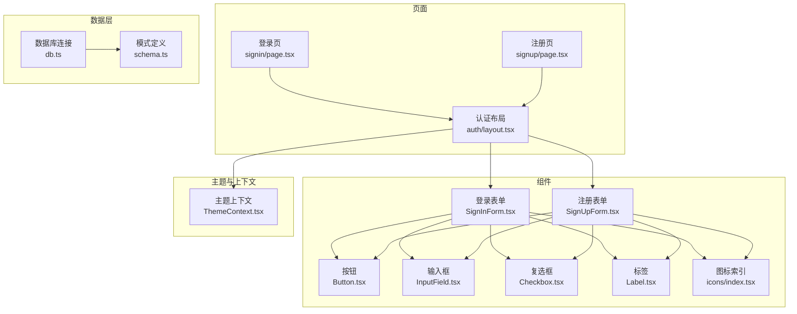
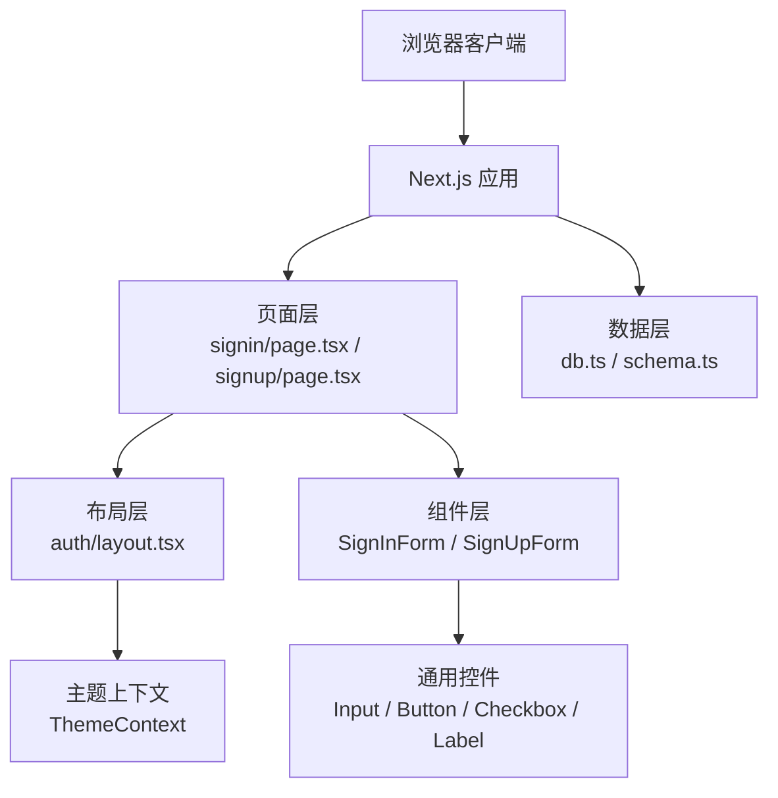
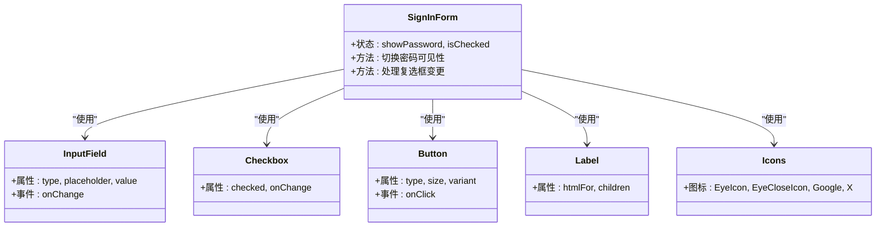
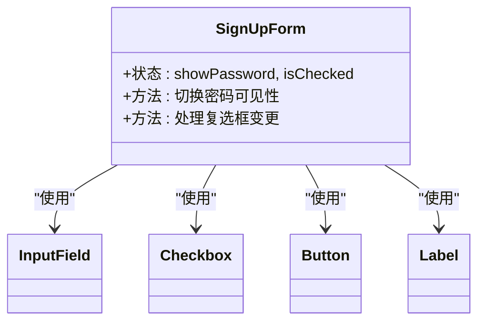
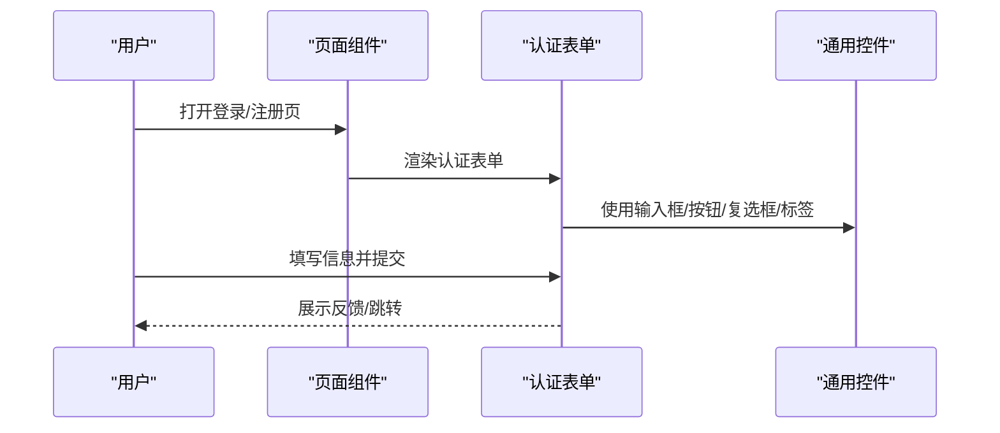
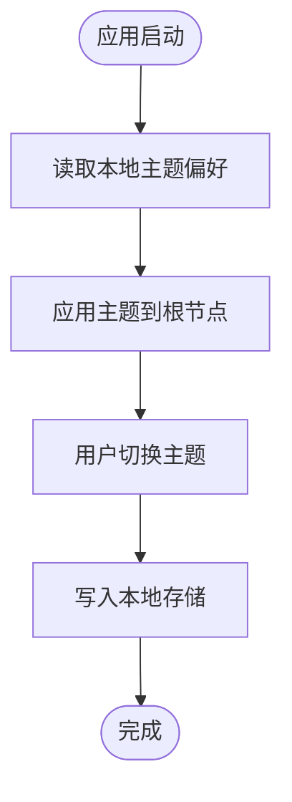
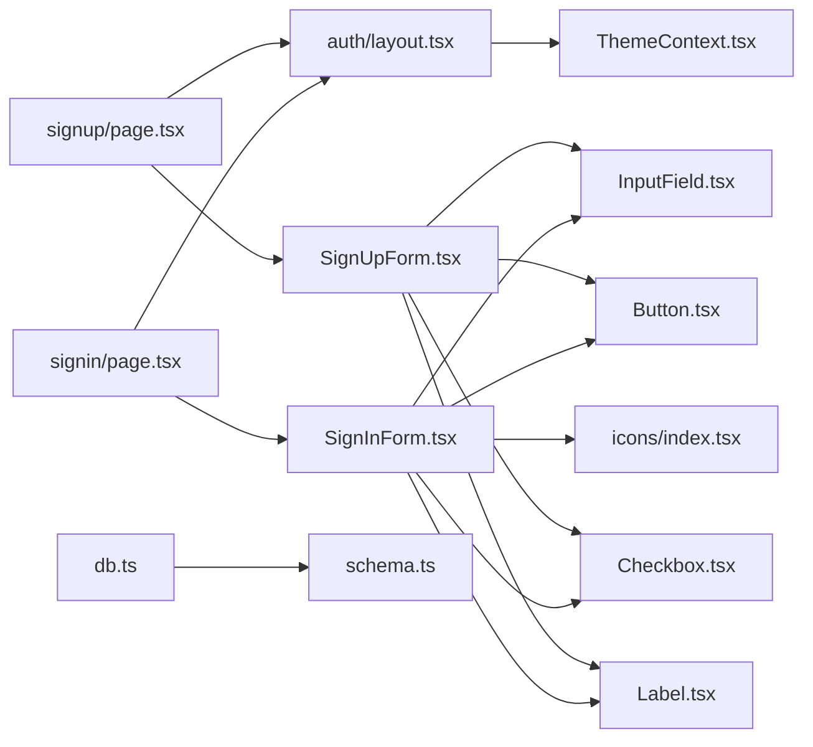

# 用户认证系统

<cite>
**本文引用的文件**
- [src/app/(full-width-pages)/(auth)/layout.tsx](file://src/app/(full-width-pages)/(auth)/layout.tsx)
- [src/app/(full-width-pages)/(auth)/signin/page.tsx](file://src/app/(full-width-pages)/(auth)/signin/page.tsx)
- [src/app/(full-width-pages)/(auth)/signup/page.tsx](file://src/app/(full-width-pages)/(auth)/signup/page.tsx)
- [src/components/auth/SignInForm.tsx](file://src/components/auth/SignInForm.tsx)
- [src/components/auth/SignUpForm.tsx](file://src/components/auth/SignUpForm.tsx)
- [src/components/ui/button/Button.tsx](file://src/components/ui/button/Button.tsx)
- [src/components/form/input/InputField.tsx](file://src/components/form/input/InputField.tsx)
- [src/components/form/input/Checkbox.tsx](file://src/components/form/input/Checkbox.tsx)
- [src/components/form/Label.tsx](file://src/components/form/Label.tsx)
- [src/context/ThemeContext.tsx](file://src/context/ThemeContext.tsx)
- [src/icons/index.tsx](file://src/icons/index.tsx)
- [src/lib/db.ts](file://src/lib/db.ts)
- [src/lib/schema.ts](file://src/lib/schema.ts)
- [src/layout/AppHeader.tsx](file://src/layout/AppHeader.tsx)
- [src/layout/AppSidebar.tsx](file://src/layout/AppSidebar.tsx)
</cite>

## 目录
1. [简介](#简介)
2. [项目结构](#项目结构)
3. [核心组件](#核心组件)
4. [架构总览](#架构总览)
5. [详细组件分析](#详细组件分析)
6. [依赖关系分析](#依赖关系分析)
7. [性能考量](#性能考量)
8. [故障排查指南](#故障排查指南)
9. [结论](#结论)
10. [附录](#附录)

## 简介
本文件面向需要定制或扩展认证功能的开发者，系统性梳理当前仓库中的用户认证体系：登录与注册页面、认证表单组件、输入校验与交互控件、主题与布局支撑、数据库与模式定义等。文档同时给出安全建议（密码加密、会话安全、CSRF 防护）、用户体验优化、错误处理机制、扩展指南与第三方认证集成方案，并提供认证状态持久化策略。

## 项目结构
认证相关代码主要分布在以下位置：
- 页面层：登录页与注册页负责承载认证表单组件并提供页面元数据
- 组件层：登录/注册表单、通用输入控件、按钮、复选框、标签等
- 布局与主题：认证专用布局、主题切换上下文
- 数据访问：数据库连接与模式定义（为后续认证持久化做准备）

**图表来源**
- [src/app/(full-width-pages)/(auth)/signin/page.tsx](file://src/app/(full-width-pages)/(auth)/signin/page.tsx#L1-L12)
- [src/app/(full-width-pages)/(auth)/signup/page.tsx](file://src/app/(full-width-pages)/(auth)/signup/page.tsx#L1-L13)
- [src/app/(full-width-pages)/(auth)/layout.tsx](file://src/app/(full-width-pages)/(auth)/layout.tsx#L1-L47)
- [src/components/auth/SignInForm.tsx:1-155](file://src/components/auth/SignInForm.tsx#L1-L155)
- [src/components/auth/SignUpForm.tsx:1-192](file://src/components/auth/SignUpForm.tsx#L1-L192)
- [src/components/ui/button/Button.tsx:1-57](file://src/components/ui/button/Button.tsx#L1-L57)
- [src/components/form/input/InputField.tsx:1-87](file://src/components/form/input/InputField.tsx#L1-L87)
- [src/components/form/input/Checkbox.tsx:1-83](file://src/components/form/input/Checkbox.tsx#L1-L83)
- [src/components/form/Label.tsx:1-28](file://src/components/form/Label.tsx#L1-L28)
- [src/context/ThemeContext.tsx:1-59](file://src/context/ThemeContext.tsx#L1-L59)
- [src/icons/index.tsx:1-110](file://src/icons/index.tsx#L1-L110)
- [src/lib/db.ts:1-19](file://src/lib/db.ts#L1-L19)
- [src/lib/schema.ts:1-24](file://src/lib/schema.ts#L1-L24)

**章节来源**
- [src/app/(full-width-pages)/(auth)/layout.tsx](file://src/app/(full-width-pages)/(auth)/layout.tsx#L1-L47)
- [src/app/(full-width-pages)/(auth)/signin/page.tsx](file://src/app/(full-width-pages)/(auth)/signin/page.tsx#L1-L12)
- [src/app/(full-width-pages)/(auth)/signup/page.tsx](file://src/app/(full-width-pages)/(auth)/signup/page.tsx#L1-L13)

## 核心组件
- 登录表单组件：提供邮箱、密码输入与“保持登录”选项，支持显示/隐藏密码；包含第三方登录入口与忘记密码链接。
- 注册表单组件：提供姓名、邮箱、密码输入与同意条款复选框；包含第三方注册入口与返回登录链接。
- 表单控件：输入框、标签、复选框、按钮等通用 UI 组件，统一风格与交互行为。
- 认证布局：提供认证页面的整体容器、背景图形与主题切换入口。
- 主题上下文：提供主题切换能力，影响认证页面与全局 UI 的明暗模式。

**章节来源**
- [src/components/auth/SignInForm.tsx:1-155](file://src/components/auth/SignInForm.tsx#L1-L155)
- [src/components/auth/SignUpForm.tsx:1-192](file://src/components/auth/SignUpForm.tsx#L1-L192)
- [src/components/ui/button/Button.tsx:1-57](file://src/components/ui/button/Button.tsx#L1-L57)
- [src/components/form/input/InputField.tsx:1-87](file://src/components/form/input/InputField.tsx#L1-L87)
- [src/components/form/input/Checkbox.tsx:1-83](file://src/components/form/input/Checkbox.tsx#L1-L83)
- [src/components/form/Label.tsx:1-28](file://src/components/form/Label.tsx#L1-L28)
- [src/app/(full-width-pages)/(auth)/layout.tsx](file://src/app/(full-width-pages)/(auth)/layout.tsx#L1-L47)
- [src/context/ThemeContext.tsx:1-59](file://src/context/ThemeContext.tsx#L1-L59)

## 架构总览
认证系统采用“页面 + 组件 + 布局 + 上下文”的分层设计：
- 页面层：登录页与注册页分别渲染对应的表单组件，并设置页面标题与描述。
- 组件层：表单组件组合输入控件与交互元素，形成完整的认证界面。
- 布局层：认证布局提供统一的视觉与交互框架，主题上下文贯穿其中。
- 数据层：数据库连接与模式定义为后续用户信息存储与查询提供基础。

**图表来源**
- [src/app/(full-width-pages)/(auth)/signin/page.tsx](file://src/app/(full-width-pages)/(auth)/signin/page.tsx#L1-L12)
- [src/app/(full-width-pages)/(auth)/signup/page.tsx](file://src/app/(full-width-pages)/(auth)/signup/page.tsx#L1-L13)
- [src/app/(full-width-pages)/(auth)/layout.tsx](file://src/app/(full-width-pages)/(auth)/layout.tsx#L1-L47)
- [src/components/auth/SignInForm.tsx:1-155](file://src/components/auth/SignInForm.tsx#L1-L155)
- [src/components/auth/SignUpForm.tsx:1-192](file://src/components/auth/SignUpForm.tsx#L1-L192)
- [src/components/ui/button/Button.tsx:1-57](file://src/components/ui/button/Button.tsx#L1-L57)
- [src/components/form/input/InputField.tsx:1-87](file://src/components/form/input/InputField.tsx#L1-L87)
- [src/components/form/input/Checkbox.tsx:1-83](file://src/components/form/input/Checkbox.tsx#L1-L83)
- [src/components/form/Label.tsx:1-28](file://src/components/form/Label.tsx#L1-L28)
- [src/context/ThemeContext.tsx:1-59](file://src/context/ThemeContext.tsx#L1-L59)
- [src/lib/db.ts:1-19](file://src/lib/db.ts#L1-L19)
- [src/lib/schema.ts:1-24](file://src/lib/schema.ts#L1-L24)

## 详细组件分析

### 登录表单组件分析
- 结构与交互
  - 提供邮箱与密码输入，支持显示/隐藏密码。
  - “保持登录”复选框用于长期会话偏好。
  - 第三方登录入口（Google、X）占位，便于后续对接。
  - 忘记密码与注册跳转链接。
- 表单控件使用
  - 输入框、标签、复选框、按钮等均来自通用组件库，确保一致的样式与可访问性。
- 图标与视觉
  - 使用图标索引中的眼睛与社交图标，增强语义表达。

**图表来源**
- [src/components/auth/SignInForm.tsx:1-155](file://src/components/auth/SignInForm.tsx#L1-L155)
- [src/components/form/input/InputField.tsx:1-87](file://src/components/form/input/InputField.tsx#L1-L87)
- [src/components/form/input/Checkbox.tsx:1-83](file://src/components/form/input/Checkbox.tsx#L1-L83)
- [src/components/ui/button/Button.tsx:1-57](file://src/components/ui/button/Button.tsx#L1-L57)
- [src/components/form/Label.tsx:1-28](file://src/components/form/Label.tsx#L1-L28)
- [src/icons/index.tsx:1-110](file://src/icons/index.tsx#L1-L110)

**章节来源**
- [src/components/auth/SignInForm.tsx:1-155](file://src/components/auth/SignInForm.tsx#L1-L155)
- [src/components/form/input/InputField.tsx:1-87](file://src/components/form/input/InputField.tsx#L1-L87)
- [src/components/form/input/Checkbox.tsx:1-83](file://src/components/form/input/Checkbox.tsx#L1-L83)
- [src/components/ui/button/Button.tsx:1-57](file://src/components/ui/button/Button.tsx#L1-L57)
- [src/components/form/Label.tsx:1-28](file://src/components/form/Label.tsx#L1-L28)
- [src/icons/index.tsx:1-110](file://src/icons/index.tsx#L1-L110)

### 注册表单组件分析
- 结构与交互
  - 支持姓名、邮箱、密码输入，以及同意条款复选框。
  - 第三方注册入口与返回登录链接。
- 表单控件使用
  - 与登录表单一致，复用通用组件库，保证一致性与可维护性。

**图表来源**
- [src/components/auth/SignUpForm.tsx:1-192](file://src/components/auth/SignUpForm.tsx#L1-L192)
- [src/components/form/input/InputField.tsx:1-87](file://src/components/form/input/InputField.tsx#L1-L87)
- [src/components/form/input/Checkbox.tsx:1-83](file://src/components/form/input/Checkbox.tsx#L1-L83)
- [src/components/ui/button/Button.tsx:1-57](file://src/components/ui/button/Button.tsx#L1-L57)
- [src/components/form/Label.tsx:1-28](file://src/components/form/Label.tsx#L1-L28)

**章节来源**
- [src/components/auth/SignUpForm.tsx:1-192](file://src/components/auth/SignUpForm.tsx#L1-L192)
- [src/components/form/input/InputField.tsx:1-87](file://src/components/form/input/InputField.tsx#L1-L87)
- [src/components/form/input/Checkbox.tsx:1-83](file://src/components/form/input/Checkbox.tsx#L1-L83)
- [src/components/ui/button/Button.tsx:1-57](file://src/components/ui/button/Button.tsx#L1-L57)
- [src/components/form/Label.tsx:1-28](file://src/components/form/Label.tsx#L1-L28)

### 认证页面与布局
- 页面元数据：登录页与注册页分别设置标题与描述，提升 SEO 与可发现性。
- 认证布局：提供统一的背景图形、品牌标识与主题切换入口，增强品牌一致性。

**图表来源**
- [src/app/(full-width-pages)/(auth)/signin/page.tsx](file://src/app/(full-width-pages)/(auth)/signin/page.tsx#L1-L12)
- [src/app/(full-width-pages)/(auth)/signup/page.tsx](file://src/app/(full-width-pages)/(auth)/signup/page.tsx#L1-L13)
- [src/components/auth/SignInForm.tsx:1-155](file://src/components/auth/SignInForm.tsx#L1-L155)
- [src/components/auth/SignUpForm.tsx:1-192](file://src/components/auth/SignUpForm.tsx#L1-L192)
- [src/components/ui/button/Button.tsx:1-57](file://src/components/ui/button/Button.tsx#L1-L57)
- [src/components/form/input/InputField.tsx:1-87](file://src/components/form/input/InputField.tsx#L1-L87)
- [src/components/form/input/Checkbox.tsx:1-83](file://src/components/form/input/Checkbox.tsx#L1-L83)
- [src/components/form/Label.tsx:1-28](file://src/components/form/Label.tsx#L1-L28)

**章节来源**
- [src/app/(full-width-pages)/(auth)/signin/page.tsx](file://src/app/(full-width-pages)/(auth)/signin/page.tsx#L1-L12)
- [src/app/(full-width-pages)/(auth)/signup/page.tsx](file://src/app/(full-width-pages)/(auth)/signup/page.tsx#L1-L13)
- [src/app/(full-width-pages)/(auth)/layout.tsx](file://src/app/(full-width-pages)/(auth)/layout.tsx#L1-L47)

### 主题上下文与状态持久化
- 主题上下文：提供明暗主题切换与本地持久化，影响认证页面与全局 UI。
- 认证状态持久化：当前表单未直接实现会话持久化逻辑，建议在后续集成后端接口时，结合 Cookie/Session 或 Token 方案进行状态管理。

**图表来源**
- [src/context/ThemeContext.tsx:1-59](file://src/context/ThemeContext.tsx#L1-L59)

**章节来源**
- [src/context/ThemeContext.tsx:1-59](file://src/context/ThemeContext.tsx#L1-L59)

## 依赖关系分析
- 页面依赖布局与表单组件，表单组件依赖通用 UI 控件与图标资源。
- 布局依赖主题上下文，实现明暗模式切换。
- 数据层通过数据库连接与模式定义为后续认证持久化提供基础。

**图表来源**
- [src/app/(full-width-pages)/(auth)/signin/page.tsx](file://src/app/(full-width-pages)/(auth)/signin/page.tsx#L1-L12)
- [src/app/(full-width-pages)/(auth)/signup/page.tsx](file://src/app/(full-width-pages)/(auth)/signup/page.tsx#L1-L13)
- [src/app/(full-width-pages)/(auth)/layout.tsx](file://src/app/(full-width-pages)/(auth)/layout.tsx#L1-L47)
- [src/components/auth/SignInForm.tsx:1-155](file://src/components/auth/SignInForm.tsx#L1-L155)
- [src/components/auth/SignUpForm.tsx:1-192](file://src/components/auth/SignUpForm.tsx#L1-L192)
- [src/components/ui/button/Button.tsx:1-57](file://src/components/ui/button/Button.tsx#L1-L57)
- [src/components/form/input/InputField.tsx:1-87](file://src/components/form/input/InputField.tsx#L1-L87)
- [src/components/form/input/Checkbox.tsx:1-83](file://src/components/form/input/Checkbox.tsx#L1-L83)
- [src/components/form/Label.tsx:1-28](file://src/components/form/Label.tsx#L1-L28)
- [src/context/ThemeContext.tsx:1-59](file://src/context/ThemeContext.tsx#L1-L59)
- [src/icons/index.tsx:1-110](file://src/icons/index.tsx#L1-L110)
- [src/lib/db.ts:1-19](file://src/lib/db.ts#L1-L19)
- [src/lib/schema.ts:1-24](file://src/lib/schema.ts#L1-L24)

**章节来源**
- [src/app/(full-width-pages)/(auth)/signin/page.tsx](file://src/app/(full-width-pages)/(auth)/signin/page.tsx#L1-L12)
- [src/app/(full-width-pages)/(auth)/signup/page.tsx](file://src/app/(full-width-pages)/(auth)/signup/page.tsx#L1-L13)
- [src/app/(full-width-pages)/(auth)/layout.tsx](file://src/app/(full-width-pages)/(auth)/layout.tsx#L1-L47)
- [src/components/auth/SignInForm.tsx:1-155](file://src/components/auth/SignInForm.tsx#L1-L155)
- [src/components/auth/SignUpForm.tsx:1-192](file://src/components/auth/SignUpForm.tsx#L1-L192)
- [src/components/ui/button/Button.tsx:1-57](file://src/components/ui/button/Button.tsx#L1-L57)
- [src/components/form/input/InputField.tsx:1-87](file://src/components/form/input/InputField.tsx#L1-L87)
- [src/components/form/input/Checkbox.tsx:1-83](file://src/components/form/input/Checkbox.tsx#L1-L83)
- [src/components/form/Label.tsx:1-28](file://src/components/form/Label.tsx#L1-L28)
- [src/context/ThemeContext.tsx:1-59](file://src/context/ThemeContext.tsx#L1-L59)
- [src/icons/index.tsx:1-110](file://src/icons/index.tsx#L1-L110)
- [src/lib/db.ts:1-19](file://src/lib/db.ts#L1-L19)
- [src/lib/schema.ts:1-24](file://src/lib/schema.ts#L1-L24)

## 性能考量
- 组件复用：登录与注册表单共享通用控件，减少重复实现与维护成本。
- 轻量布局：认证布局仅包含必要的视觉与交互元素，避免过度渲染。
- 主题切换：主题上下文通过本地存储持久化，减少服务端往返。
- 后续优化建议
  - 将第三方登录入口绑定至实际 SDK，避免空占位导致的无效请求。
  - 对表单提交进行防抖与节流，降低网络压力。
  - 在服务端渲染（SSR）或静态生成（SSG）中谨慎处理认证状态，避免敏感信息泄露。

[本节为通用指导，不直接分析具体文件，故无“章节来源”]

## 故障排查指南
- 表单无法提交
  - 检查按钮类型是否为提交按钮，确保表单包裹正确。
  - 参考按钮组件的类型与事件处理约定。
- 输入状态异常
  - 确认输入框的受控与非受控状态一致，避免值不同步。
  - 检查标签与输入框的关联属性（htmlFor/id）。
- 主题切换失效
  - 确保主题上下文在应用根部提供，且本地存储键名一致。
- 数据库连接失败
  - 检查环境变量与连接字符串，确认 SSL 配置与数据库可达性。

**章节来源**
- [src/components/ui/button/Button.tsx:1-57](file://src/components/ui/button/Button.tsx#L1-L57)
- [src/components/form/input/InputField.tsx:1-87](file://src/components/form/input/InputField.tsx#L1-L87)
- [src/components/form/Label.tsx:1-28](file://src/components/form/Label.tsx#L1-L28)
- [src/context/ThemeContext.tsx:1-59](file://src/context/ThemeContext.tsx#L1-L59)
- [src/lib/db.ts:1-19](file://src/lib/db.ts#L1-L19)

## 结论
当前仓库已具备完善的认证页面与表单组件骨架：登录与注册页面、通用表单控件、认证布局与主题上下文。后续应重点补齐后端接口与数据库集成，实现密码加密、会话管理、权限控制与 CSRF 防护，并在用户体验与安全性之间取得平衡。

[本节为总结性内容，不直接分析具体文件，故无“章节来源”]

## 附录

### 安全考虑事项
- 密码加密
  - 存储前必须进行强哈希（如 bcrypt、scrypt 或 Argon2），禁止明文存储。
- 会话安全
  - 使用 HttpOnly、Secure、SameSite Cookie；服务端生成与校验会话令牌；定期轮换令牌。
- CSRF 防护
  - 为关键操作引入 CSRF 令牌与同源策略校验。
- 其他
  - 限制登录尝试次数、启用验证码、对输入进行严格校验与清理。

[本节为通用指导，不直接分析具体文件，故无“章节来源”]

### 用户体验优化
- 实时输入校验与提示
  - 在输入过程中提供即时反馈，减少无效提交。
- 加载态与错误态
  - 明确提交按钮的加载状态与错误展示，避免用户重复提交。
- 无障碍支持
  - 为表单控件提供清晰的标签与键盘导航支持。

[本节为通用指导，不直接分析具体文件，故无“章节来源”]

### 错误处理机制
- 前端
  - 对表单字段进行必填与格式校验，提供明确的错误文案。
- 后端（建议）
  - 返回标准化错误码与消息；区分业务错误与系统错误；记录审计日志。

[本节为通用指导，不直接分析具体文件，故无“章节来源”]

### 认证系统扩展指南
- 后端接口集成
  - 登录/注册接口：接收邮箱与密码，返回会话令牌或 Cookie。
  - 权限控制：基于角色或资源级权限进行路由与组件级控制。
- 第三方认证集成
  - Google、GitHub、Microsoft 等 OAuth 接入，使用标准授权码流程。
  - 验证回调参数并映射到本地用户模型。
- 认证状态持久化策略
  - 前端：LocalStorage/SessionStorage 存储令牌；刷新时自动续期。
  - 服务端：Redis/Memcached 缓存会话；数据库记录用户与权限。

[本节为通用指导，不直接分析具体文件，故无“章节来源”]

### 权限控制机制
- 路由级保护
  - 未登录用户重定向至登录页；已登录用户访问受限路由时进行权限校验。
- 组件级保护
  - 根据用户角色渲染菜单项与功能按钮。
- 资源级保护
  - 请求后端时携带令牌，服务端校验资源所有权与操作权限。

[本节为通用指导，不直接分析具体文件，故无“章节来源”]

### 会话管理策略
- 令牌生命周期
  - 短期访问令牌 + 长期刷新令牌；服务端校验令牌有效性与过期时间。
- 自动登出
  - 令牌过期或异地登录时触发自动登出与提示。
- 多设备同步
  - 服务端记录活跃会话列表，允许用户主动踢出其他设备。

[本节为通用指导，不直接分析具体文件，故无“章节来源”]