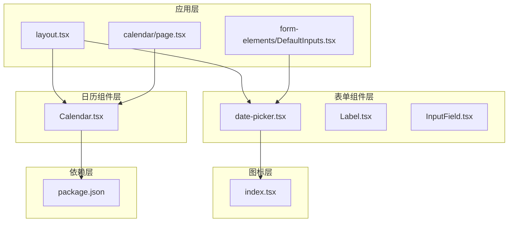
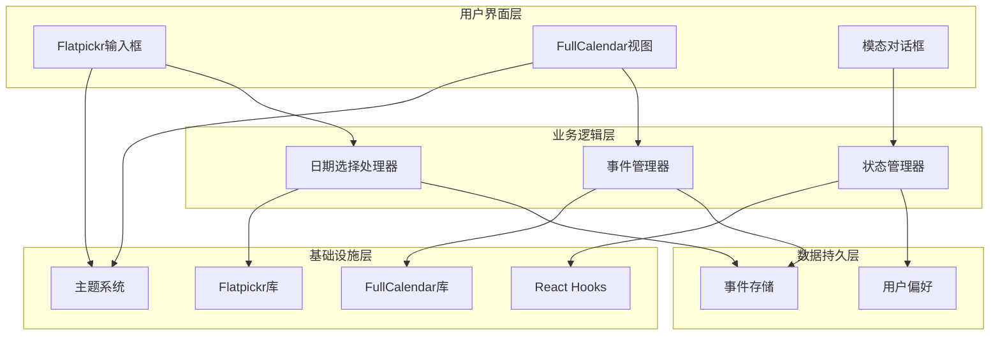
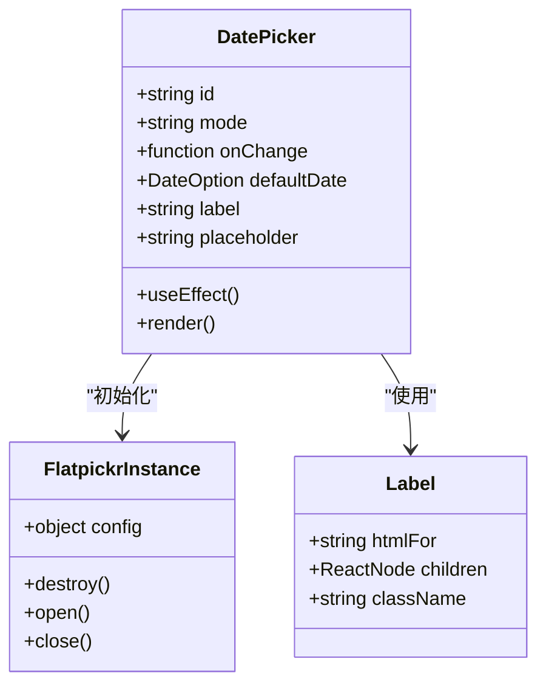
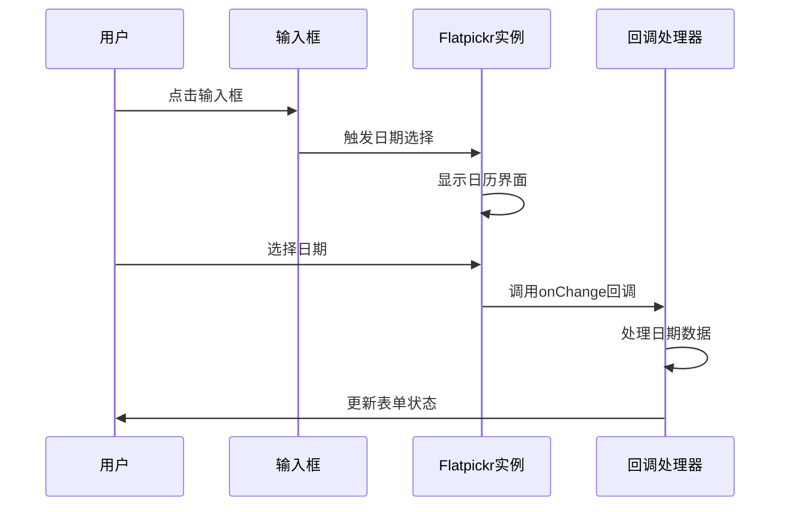
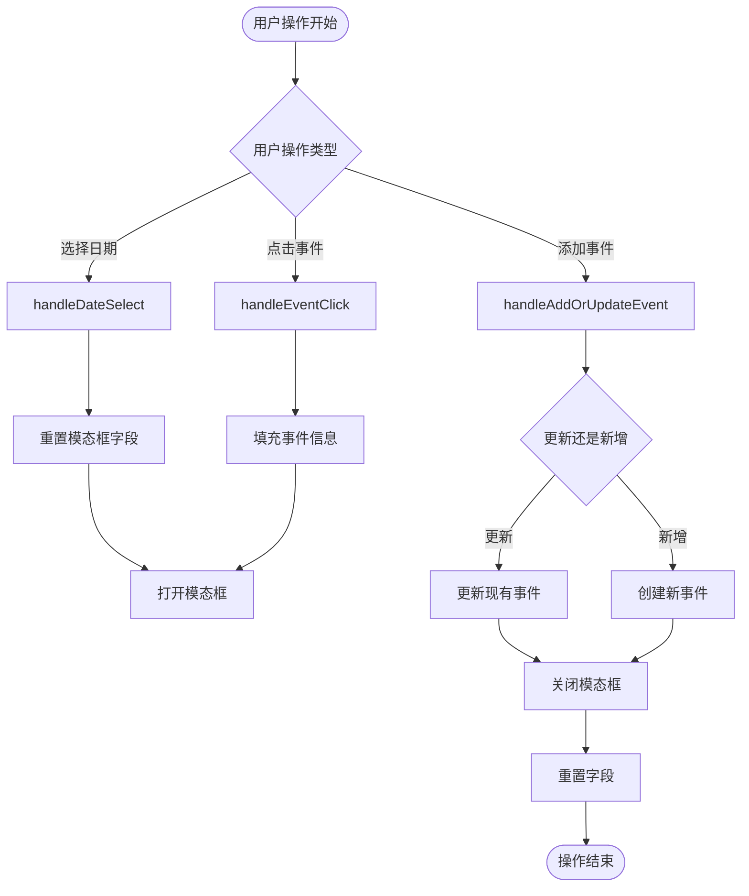
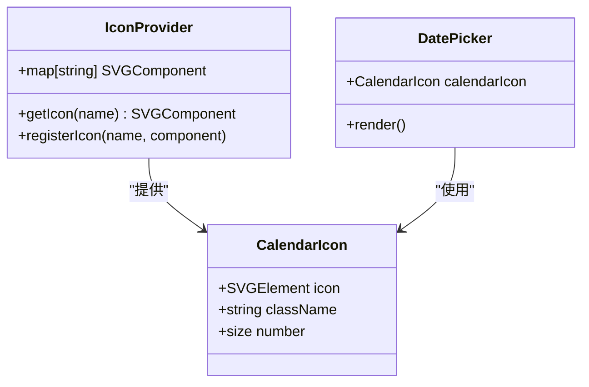
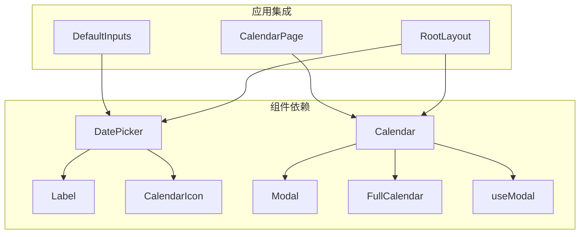

# 日期时间控件

<cite>
**本文档引用的文件**
- [src/components/form/date-picker.tsx](file://src/components/form/date-picker.tsx)
- [src/components/calendar/Calendar.tsx](file://src/components/calendar/Calendar.tsx)
- [src/icons/index.tsx](file://src/icons/index.tsx)
- [src/components/form/Label.tsx](file://src/components/form/Label.tsx)
- [src/app/layout.tsx](file://src/app/layout.tsx)
- [src/app/(admin)/(others-pages)/calendar/page.tsx](file://src/app/(admin)/(others-pages)/calendar/page.tsx)
- [package.json](file://package.json)
- [src/components/form/form-elements/DefaultInputs.tsx](file://src/components/form/form-elements/DefaultInputs.tsx)
- [src/components/form/input/InputField.tsx](file://src/components/form/input/InputField.tsx)
</cite>

## 目录
1. [简介](#简介)
2. [项目结构](#项目结构)
3. [核心组件](#核心组件)
4. [架构概览](#架构概览)
5. [详细组件分析](#详细组件分析)
6. [依赖关系分析](#依赖关系分析)
7. [性能考虑](#性能考虑)
8. [故障排除指南](#故障排除指南)
9. [结论](#结论)
10. [附录](#附录)

## 简介
本文件为Next.js项目中的日期时间控件提供全面的技术文档。项目采用两种主要的日期时间处理方式：基于Flatpickr的轻量级日期选择器和基于FullCalendar的日历组件。前者专注于输入框内的日期选择，后者提供完整的日历视图和事件管理功能。

该系统支持多种日期模式（单选、多选、范围选择、时间选择），具备响应式设计、主题切换、国际化基础架构等特性。通过模块化的组件设计，开发者可以灵活地在表单中集成日期选择功能，或构建完整的日历应用。

## 项目结构
项目采用按功能分层的组织方式，日期时间相关功能分布在以下目录：



**图表来源**
- [src/components/form/date-picker.tsx:1-61](file://src/components/form/date-picker.tsx#L1-L61)
- [src/components/calendar/Calendar.tsx:1-284](file://src/components/calendar/Calendar.tsx#L1-L284)
- [src/app/layout.tsx:1-33](file://src/app/layout.tsx#L1-L33)

**章节来源**
- [src/components/form/date-picker.tsx:1-61](file://src/components/form/date-picker.tsx#L1-L61)
- [src/components/calendar/Calendar.tsx:1-284](file://src/components/calendar/Calendar.tsx#L1-L284)
- [src/app/layout.tsx:1-33](file://src/app/layout.tsx#L1-L33)

## 核心组件
项目包含两个主要的日期时间组件，分别服务于不同的使用场景：

### 1. Flatpickr日期选择器
- **文件路径**: `src/components/form/date-picker.tsx`
- **功能特性**:
  - 支持四种模式：single、multiple、range、time
  - 静态日历显示，嵌入到表单中
  - 自定义日期格式化（YYYY-MM-DD）
  - 响应式设计，支持深色模式
  - 可配置的默认日期和回调函数

### 2. FullCalendar日历组件
- **文件路径**: `src/components/calendar/Calendar.tsx`
- **功能特性**:
  - 完整的日历视图（月、周、日）
  - 事件管理功能（创建、编辑、删除）
  - 多种事件类型和颜色分类
  - 模态对话框交互
  - 响应式布局适配

**章节来源**
- [src/components/form/date-picker.tsx:9-16](file://src/components/form/date-picker.tsx#L9-L16)
- [src/components/calendar/Calendar.tsx:16-20](file://src/components/calendar/Calendar.tsx#L16-L20)

## 架构概览
系统采用分层架构设计，确保组件间的松耦合和高内聚：



**图表来源**
- [src/components/form/date-picker.tsx:26-41](file://src/components/form/date-picker.tsx#L26-L41)
- [src/components/calendar/Calendar.tsx:22-32](file://src/components/calendar/Calendar.tsx#L22-L32)

## 详细组件分析

### Flatpickr日期选择器组件

#### 组件架构


**图表来源**
- [src/components/form/date-picker.tsx:18-41](file://src/components/form/date-picker.tsx#L18-L41)
- [src/components/form/Label.tsx:4-25](file://src/components/form/Label.tsx#L4-L25)

#### 核心配置参数
| 参数名 | 类型 | 默认值 | 描述 |
|--------|------|--------|------|
| id | string | 必需 | 输入框唯一标识符 |
| mode | "single" \| "multiple" \| "range" \| "time" | "single" | 选择模式 |
| onChange | Hook \| Hook[] | - | 日期变更回调函数 |
| defaultDate | DateOption | - | 默认选中日期 |
| label | string | - | 标签文本 |
| placeholder | string | - | 占位符文本 |

#### 数据流处理


**图表来源**
- [src/components/form/date-picker.tsx:26-34](file://src/components/form/date-picker.tsx#L26-L34)

**章节来源**
- [src/components/form/date-picker.tsx:18-41](file://src/components/form/date-picker.tsx#L18-L41)

### FullCalendar日历组件

#### 事件管理系统


**图表来源**
- [src/components/calendar/Calendar.tsx:66-113](file://src/components/calendar/Calendar.tsx#L66-L113)

#### 事件数据模型
| 字段名 | 类型 | 描述 |
|--------|------|------|
| id | string | 事件唯一标识符 |
| title | string | 事件标题 |
| start | Date | 事件开始时间 |
| end | Date | 事件结束时间 |
| extendedProps.calendar | string | 事件分类（Danger/Success/Primary/Warning） |

**章节来源**
- [src/components/calendar/Calendar.tsx:16-20](file://src/components/calendar/Calendar.tsx#L16-L20)
- [src/components/calendar/Calendar.tsx:41-64](file://src/components/calendar/Calendar.tsx#L41-L64)

### 图标系统集成

#### 日历图标组件


**图表来源**
- [src/icons/index.tsx:34](file://src/icons/index.tsx#L34)
- [src/components/form/date-picker.tsx:54-56](file://src/components/form/date-picker.tsx#L54-L56)

**章节来源**
- [src/icons/index.tsx:34](file://src/icons/index.tsx#L34)
- [src/components/form/date-picker.tsx:54-56](file://src/components/form/date-picker.tsx#L54-L56)

## 依赖关系分析

### 外部依赖库
项目使用以下关键依赖库来实现日期时间功能：

```mermaid
graph LR
subgraph "日期时间库"
A[flatpickr v4.6.13]
B[@fullcalendar/react v6.1.19]
C[@fullcalendar/core v6.1.19]
end
subgraph "UI框架"
D[Tailwind CSS]
E[Next.js]
F[React 19.2.0]
end
subgraph "工具库"
G[tailwind-merge]
H[clsx]
I[shadcn]
end
A --> F
B --> F
C --> B
D --> E
E --> F
```

**图表来源**
- [package.json:33](file://package.json#L33)
- [package.json:21](file://package.json#L21)

### 内部依赖关系


**图表来源**
- [src/components/form/form-elements/DefaultInputs.tsx:8](file://src/components/form/form-elements/DefaultInputs.tsx#L8)
- [src/app/(admin)/(others-pages)/calendar/page.tsx:1](file://src/app/(admin)/(others-pages)/calendar/page.tsx#L1)

**章节来源**
- [package.json:15-49](file://package.json#L15-L49)

## 性能考虑
基于当前实现的性能特征分析：

### 渲染优化
- **懒加载**: Flatpickr实例在组件挂载时创建，在卸载时销毁，避免内存泄漏
- **条件渲染**: 日历图标仅在需要时渲染
- **状态管理**: 使用React状态管理减少不必要的重新渲染

### 内存管理
- **生命周期**: 组件卸载时自动清理Flatpickr实例
- **事件监听**: 合理的事件绑定和解绑机制
- **资源释放**: 模态框关闭时重置相关状态

### 加载性能
- **按需引入**: 仅在需要时加载相关CSS和JS资源
- **缓存策略**: 浏览器自动缓存静态资源
- **体积控制**: 通过Tree Shaking减少打包体积

## 故障排除指南

### 常见问题及解决方案

#### 1. 日期格式问题
**症状**: 日期显示格式不正确
**解决方案**: 
- 检查dateFormat配置参数
- 确认defaultDate格式一致性
- 验证onChange回调的数据格式

#### 2. 主题兼容性问题
**症状**: 深色模式下显示异常
**解决方案**:
- 确保Flatpickr CSS正确引入
- 检查Tailwind CSS类名拼写
- 验证CSS变量是否正确设置

#### 3. 事件冲突问题
**症状**: 日历事件点击无响应
**解决方案**:
- 检查事件处理器绑定
- 确认事件对象属性完整性
- 验证模态框状态管理

**章节来源**
- [src/components/form/date-picker.tsx:36-40](file://src/components/form/date-picker.tsx#L36-L40)
- [src/components/calendar/Calendar.tsx:73-81](file://src/components/calendar/Calendar.tsx#L73-L81)

## 结论
该项目的日期时间控件系统展现了良好的架构设计和实现质量。通过Flatpickr和FullCalendar的有机结合，既满足了表单中的简单日期选择需求，又提供了完整的日历管理功能。

系统的主要优势包括：
- **模块化设计**: 组件职责清晰，易于维护和扩展
- **响应式支持**: 完善的移动端适配
- **主题集成**: 与整体UI设计风格保持一致
- **性能优化**: 合理的资源管理和内存控制

建议的改进方向：
- 增加国际化支持（多语言、多时区）
- 扩展验证规则和错误处理
- 添加键盘导航支持
- 实现更丰富的自定义选项

## 附录

### API参考

#### Flatpickr组件API
| 属性名 | 类型 | 必需 | 默认值 | 描述 |
|--------|------|------|--------|------|
| id | string | 是 | - | 输入框ID |
| mode | enum | 否 | "single" | 选择模式 |
| onChange | function | 否 | - | 日期变更回调 |
| defaultDate | Date | 否 | - | 默认日期 |
| label | string | 否 | - | 标签文本 |
| placeholder | string | 否 | - | 占位符 |

#### FullCalendar组件API
| 属性名 | 类型 | 必需 | 默认值 | 描述 |
|--------|------|------|--------|------|
| events | EventInput[] | 否 | [] | 事件数组 |
| onEventClick | function | 否 | - | 事件点击回调 |
| onDateSelect | function | 否 | - | 日期选择回调 |
| initialView | string | 否 | "dayGridMonth" | 初始视图 |

### 配置示例
- **日期格式**: YYYY-MM-DD（可配置）
- **主题颜色**: 基于Tailwind CSS变量
- **响应式断点**: 移动端优先设计
- **无障碍支持**: WAI-ARIA标签和键盘导航