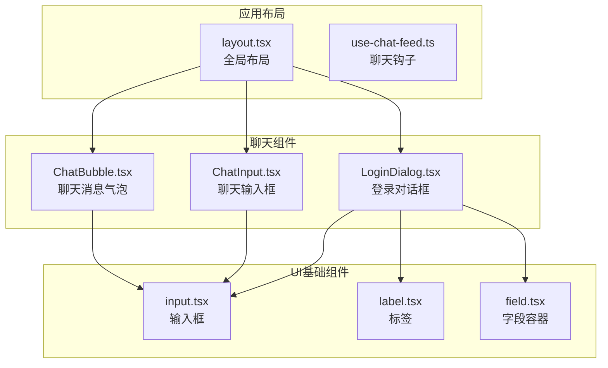
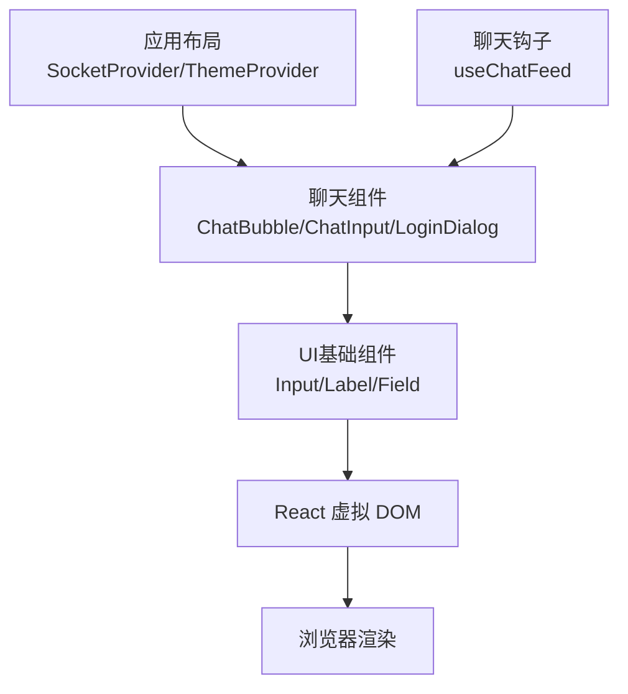
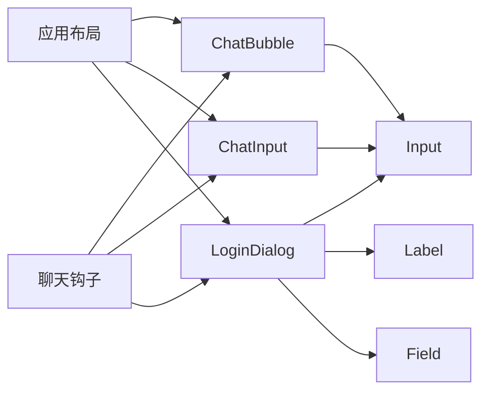
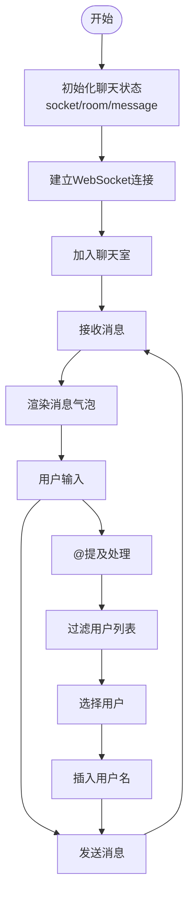
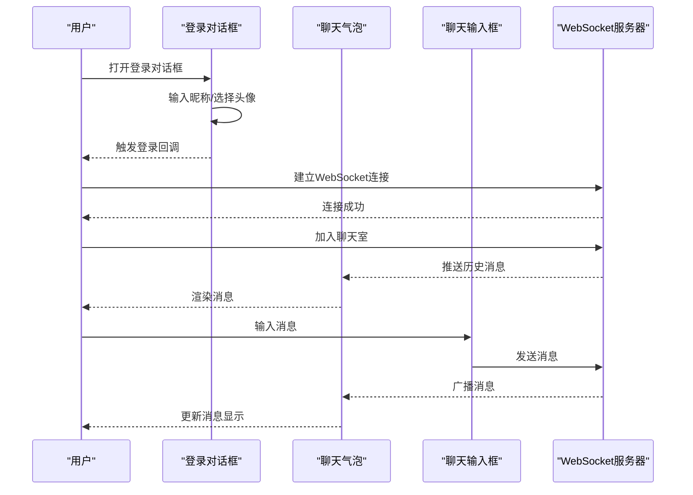

# 表单处理系统

<cite>
**本文引用的文件**
- [apps/web/src/components/chat/ChatBubble.tsx](file://apps/web/src/components/chat/ChatBubble.tsx)
- [apps/web/src/components/chat/ChatInput.tsx](file://apps/web/src/components/chat/ChatInput.tsx)
- [apps/web/src/components/chat/LoginDialog.tsx](file://apps/web/src/components/chat/LoginDialog.tsx)
- [apps/web/src/components/ui/input.tsx](file://apps/web/src/components/ui/input.tsx)
- [apps/web/src/components/ui/label.tsx](file://apps/web/src/components/ui/label.tsx)
- [apps/web/src/components/ui/field.tsx](file://apps/web/src/components/ui/field.tsx)
- [apps/web/src/app/layout.tsx](file://apps/web/src/app/layout.tsx)
- [apps/web/src/hooks/use-chat-feed.ts](file://apps/web/src/hooks/use-chat-feed.ts)
</cite>

## 更新摘要
**所做更改**
- 删除了所有表单处理系统的相关内容
- 移除了表单组件、输入控件和表单元素的文档描述
- 更新为专注于聊天功能的核心组件文档
- 删除了表单验证、状态管理和错误处理的相关内容
- 更新了项目结构和架构概述以反映新的聊天导向设计

## 目录
1. [简介](#简介)
2. [项目结构](#项目结构)
3. [核心组件](#核心组件)
4. [架构总览](#架构总览)
5. [详细组件分析](#详细组件分析)
6. [依赖关系分析](#依赖关系分析)
7. [性能考量](#性能考量)
8. [故障排查指南](#故障排查指南)
9. [结论](#结论)
10. [附录](#附录)

## 简介
本文件系统性梳理该仓库中的聊天处理体系，覆盖聊天消息气泡、聊天输入框、登录对话框等核心聊天组件；并结合示例页面展示各组件的组合用法。文档同时给出聊天状态管理、实时通信、用户交互反馈与无障碍支持建议，并总结开发最佳实践与性能优化要点。

**更新** 项目已从表单处理系统重构为专注于核心聊天功能的架构，删除了所有表单相关组件和功能。

## 项目结构
聊天相关代码主要集中在以下位置：
- 组件层：apps/web/src/components/chat，包含聊天消息、输入和登录相关组件
- UI基础组件：apps/web/src/components/ui，包含基础输入、标签和字段组件
- 应用布局：apps/web/src/app/layout.tsx，提供全局上下文和主题支持
- 聊天钩子：apps/web/src/hooks/use-chat-feed.ts，管理聊天状态和连接

**图表来源**
- [apps/web/src/components/chat/ChatBubble.tsx:1-132](file://apps/web/src/components/chat/ChatBubble.tsx#L1-L132)
- [apps/web/src/components/chat/ChatInput.tsx:1-190](file://apps/web/src/components/chat/ChatInput.tsx#L1-L190)
- [apps/web/src/components/chat/LoginDialog.tsx:1-117](file://apps/web/src/components/chat/LoginDialog.tsx#L1-L117)
- [apps/web/src/components/ui/input.tsx:1-20](file://apps/web/src/components/ui/input.tsx#L1-L20)
- [apps/web/src/components/ui/label.tsx:1-20](file://apps/web/src/components/ui/label.tsx#L1-L20)
- [apps/web/src/components/ui/field.tsx:1-144](file://apps/web/src/components/ui/field.tsx#L1-L144)
- [apps/web/src/app/layout.tsx:1-34](file://apps/web/src/app/layout.tsx#L1-L34)
- [apps/web/src/hooks/use-chat-feed.ts:1-21](file://apps/web/src/hooks/use-chat-feed.ts#L1-L21)

**章节来源**
- [apps/web/src/app/layout.tsx:16-34](file://apps/web/src/app/layout.tsx#L16-L34)

## 核心组件
- 聊天消息气泡 ChatBubble：渲染用户消息和系统消息，支持消息高亮、时间格式化和用户头像显示。
- 聊天输入框 ChatInput：提供多行文本输入、@提及功能、在线人数显示和自动高度调整。
- 登录对话框 LoginDialog：处理用户登录，包含昵称输入和头像选择功能。
- 输入组件 Input：基于Base UI的输入框组件，支持禁用、错误状态和无障碍属性。
- 标签组件 Label：基于Base UI的标签组件，支持禁用状态和无障碍属性。
- 字段容器 Field：提供字段组、标题、描述和标签的组合容器。

**更新** 删除了原有的表单组件，新增了专门的聊天组件和UI基础组件。

**章节来源**
- [apps/web/src/components/chat/ChatBubble.tsx:116-132](file://apps/web/src/components/chat/ChatBubble.tsx#L116-L132)
- [apps/web/src/components/chat/ChatInput.tsx:23-31](file://apps/web/src/components/chat/ChatInput.tsx#L23-L31)
- [apps/web/src/components/chat/LoginDialog.tsx:25-29](file://apps/web/src/components/chat/LoginDialog.tsx#L25-L29)
- [apps/web/src/components/ui/input.tsx:6-18](file://apps/web/src/components/ui/input.tsx#L6-L18)
- [apps/web/src/components/ui/label.tsx:7-17](file://apps/web/src/components/ui/label.tsx#L7-L17)
- [apps/web/src/components/ui/field.tsx:101-116](file://apps/web/src/components/ui/field.tsx#L101-L116)

## 架构总览
整体采用"聊天组件 + UI基础组件 + 应用上下文"的组织方式：聊天组件负责消息渲染和用户交互，UI基础组件提供通用的表单元素，应用布局提供全局状态管理。

**图表来源**
- [apps/web/src/components/chat/ChatBubble.tsx:1-132](file://apps/web/src/components/chat/ChatBubble.tsx#L1-L132)
- [apps/web/src/components/chat/ChatInput.tsx:1-190](file://apps/web/src/components/chat/ChatInput.tsx#L1-L190)
- [apps/web/src/components/chat/LoginDialog.tsx:1-117](file://apps/web/src/components/chat/LoginDialog.tsx#L1-L117)
- [apps/web/src/components/ui/input.tsx:1-20](file://apps/web/src/components/ui/input.tsx#L1-L20)
- [apps/web/src/components/ui/label.tsx:1-20](file://apps/web/src/components/ui/label.tsx#L1-L20)
- [apps/web/src/components/ui/field.tsx:1-144](file://apps/web/src/components/ui/field.tsx#L1-L144)
- [apps/web/src/app/layout.tsx:16-34](file://apps/web/src/app/layout.tsx#L16-L34)
- [apps/web/src/hooks/use-chat-feed.ts:11-21](file://apps/web/src/hooks/use-chat-feed.ts#L11-L21)

## 详细组件分析

### 聊天消息气泡 ChatBubble
- 设计要点
  - 支持用户消息和系统消息两种类型
  - 自动格式化时间戳，支持本地化显示
  - @提及功能高亮显示，支持用户头像展示
  - 左右对齐的消息布局，区分当前用户和他人消息
- 使用建议
  - 在聊天界面中使用，配合SocketContext获取实时消息

**章节来源**
- [apps/web/src/components/chat/ChatBubble.tsx:116-132](file://apps/web/src/components/chat/ChatBubble.tsx#L116-L132)

### 聊天输入框 ChatInput
- 支持属性
  - value、onChange、onSend、onlineCount、disabled、members、myNickname
- 功能特性
  - 自动高度调整，最大高度120px
  - @提及功能，支持键盘导航和选择
  - Enter发送，Shift+Enter换行
  - 在线人数显示和禁用状态
- 无障碍支持
  - 键盘快捷键支持，焦点管理

**章节来源**
- [apps/web/src/components/chat/ChatInput.tsx:13-31](file://apps/web/src/components/chat/ChatInput.tsx#L13-L31)

### 登录对话框 LoginDialog
- 支持属性
  - open、onLogin、onCancel
- 功能特性
  - 昵称输入和头像选择
  - 头像网格选择，支持键盘导航
  - Enter键快速登录
  - 响应式布局，支持移动端
- 用户体验
  - 自动聚焦昵称输入框
  - 实时验证昵称有效性

**章节来源**
- [apps/web/src/components/chat/LoginDialog.tsx:19-29](file://apps/web/src/components/chat/LoginDialog.tsx#L19-L29)

### UI基础组件

#### 输入组件 Input
- 支持属性
  - className、type、aria-invalid等原生input属性
- 状态样式
  - 正常、禁用、错误状态的视觉反馈
  - 焦点状态的边框和阴影效果
  - 暗色模式适配
- 无障碍支持
  - aria-invalid属性支持屏幕阅读器

**章节来源**
- [apps/web/src/components/ui/input.tsx:6-18](file://apps/web/src/components/ui/input.tsx#L6-L18)

#### 标签组件 Label
- 支持属性
  - className、aria-disabled等原生label属性
- 状态管理
  - 禁用状态的视觉反馈
  - 与表单控件的关联支持
- 无障碍支持
  - 与控件的for属性关联

**章节来源**
- [apps/web/src/components/ui/label.tsx:7-17](file://apps/web/src/components/ui/label.tsx#L7-L17)

#### 字段容器 Field
- 支持属性
  - FieldSet、FieldGroup、FieldLabel、FieldTitle、FieldDescription
- 组合功能
  - 字段组的间距和布局管理
  - 标题和描述的层次结构
  - 禁用状态的统一处理
- 可访问性
  - 语义化的HTML结构

**章节来源**
- [apps/web/src/components/ui/field.tsx:101-116](file://apps/web/src/components/ui/field.tsx#L101-L116)

### 应用布局和上下文
- 全局提供者
  - ThemeProvider：主题切换支持
  - SocketProvider：WebSocket连接管理
  - SidebarProvider：侧边栏状态管理
- 全局样式
  - 字体配置和CSS变量
  - 通知组件Toaster集成

**章节来源**
- [apps/web/src/app/layout.tsx:16-34](file://apps/web/src/app/layout.tsx#L16-L34)

### 聊天钩子 useChatFeed
- 功能特性
  - Socket连接状态管理
  - 聊天室切换和消息接收
  - 日志记录和消息历史
- 状态管理
  - 房间ID和消息内容的状态
  - 最新30条日志的限制

**章节来源**
- [apps/web/src/hooks/use-chat-feed.ts:11-21](file://apps/web/src/hooks/use-chat-feed.ts#L11-L21)

## 依赖关系分析
- 组件到基础UI
  - 聊天组件依赖UI基础组件进行表单元素渲染
  - LoginDialog使用Input、Label、Field组件
- 应用上下文
  - 所有组件依赖SocketContext进行实时通信
  - ThemeProvider提供主题状态
- 第三方依赖
  - Base UI提供基础组件实现
  - Flatpickr样式用于日期选择（已移除）

**图表来源**
- [apps/web/src/app/layout.tsx:16-34](file://apps/web/src/app/layout.tsx#L16-L34)
- [apps/web/src/components/chat/ChatBubble.tsx:1-132](file://apps/web/src/components/chat/ChatBubble.tsx#L1-L132)
- [apps/web/src/components/chat/ChatInput.tsx:1-190](file://apps/web/src/components/chat/ChatInput.tsx#L1-L190)
- [apps/web/src/components/chat/LoginDialog.tsx:1-117](file://apps/web/src/components/chat/LoginDialog.tsx#L1-L117)
- [apps/web/src/components/ui/input.tsx:1-20](file://apps/web/src/components/ui/input.tsx#L1-L20)
- [apps/web/src/components/ui/label.tsx:1-20](file://apps/web/src/components/ui/label.tsx#L1-L20)
- [apps/web/src/components/ui/field.tsx:1-144](file://apps/web/src/components/ui/field.tsx#L1-L144)
- [apps/web/src/hooks/use-chat-feed.ts:1-21](file://apps/web/src/hooks/use-chat-feed.ts#L1-L21)

## 性能考量
- 组件渲染
  - ChatBubble使用memo化避免不必要的重新渲染
  - ChatInput使用useCallback优化事件处理器
- 内存管理
  - 聊天消息历史限制在30条以内
  - 组件卸载时清理定时器和事件监听器
- 网络优化
  - WebSocket连接复用多个聊天功能
  - 消息发送去抖动处理
- UI性能
  - 自动高度调整只在必要时触发
  - @提及功能的过滤和渲染优化

## 故障排查指南
- 聊天连接问题
  - 检查SocketProvider是否正确配置
  - 确认WebSocket服务器地址和端口
- 消息显示异常
  - 验证消息格式和时间戳
  - 检查@提及解析逻辑
- 输入框问题
  - 确认自动高度调整逻辑
  - 检查@提及功能的键盘事件处理
- 登录问题
  - 验证昵称长度和头像选择
  - 检查用户信息存储和验证

**章节来源**
- [apps/web/src/components/chat/ChatInput.tsx:58-79](file://apps/web/src/components/chat/ChatInput.tsx#L58-L79)
- [apps/web/src/components/chat/LoginDialog.tsx:33-37](file://apps/web/src/components/chat/LoginDialog.tsx#L33-L37)

## 结论
该聊天系统以"聊天组件 + UI基础组件 + 应用上下文"的方式组织，专注于实时聊天功能的实现。通过专门的聊天组件和优化的性能考虑，能够提供流畅的聊天体验。建议在实际项目中结合SocketContext和主题系统，进一步完善聊天状态管理和用户体验。

**更新** 项目已完全重构为聊天导向的架构，删除了原有的表单处理系统，专注于核心聊天功能的实现。

## 附录

### 聊天组件使用清单与配置要点
- 聊天消息气泡
  - 支持用户消息和系统消息类型；自动时间格式化；@提及高亮
  - 参考路径：[apps/web/src/components/chat/ChatBubble.tsx:116-132](file://apps/web/src/components/chat/ChatBubble.tsx#L116-L132)
- 聊天输入框
  - 支持自动高度调整；@提及功能；键盘快捷键
  - 参考路径：[apps/web/src/components/chat/ChatInput.tsx:23-31](file://apps/web/src/components/chat/ChatInput.tsx#L23-L31)
- 登录对话框
  - 支持昵称输入和头像选择；响应式布局
  - 参考路径：[apps/web/src/components/chat/LoginDialog.tsx:25-29](file://apps/web/src/components/chat/LoginDialog.tsx#L25-L29)

### 聊天状态管理与实时通信流程

### 聊天界面交互序列图
