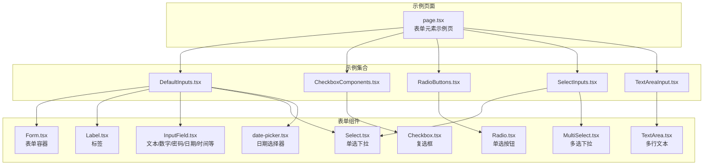
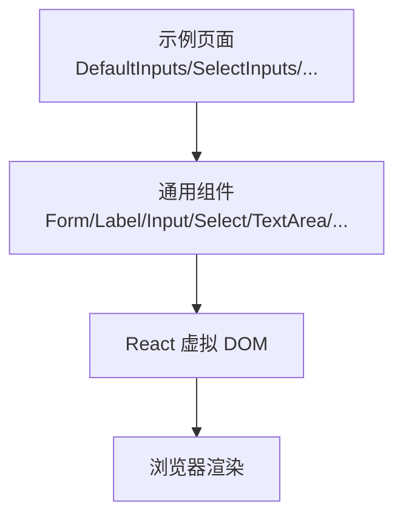
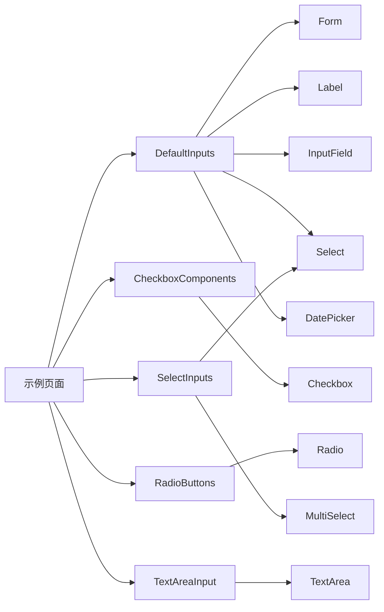
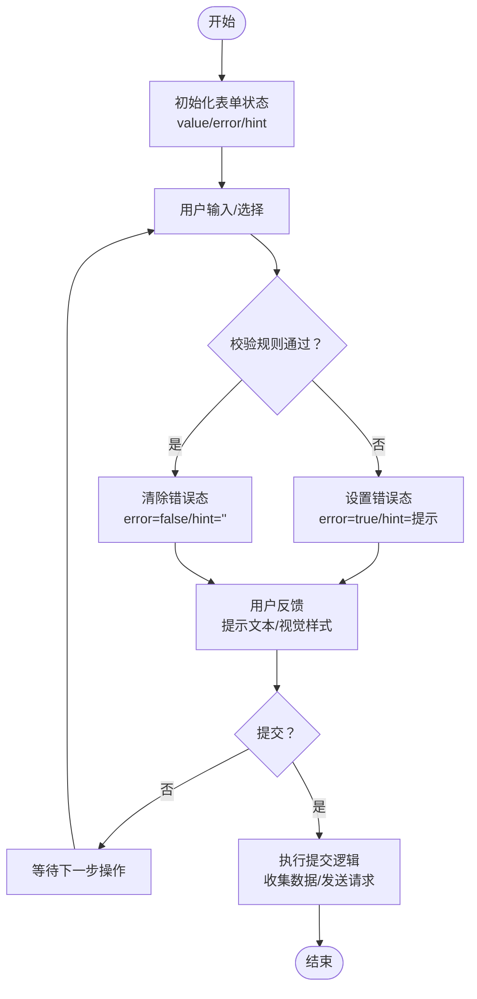
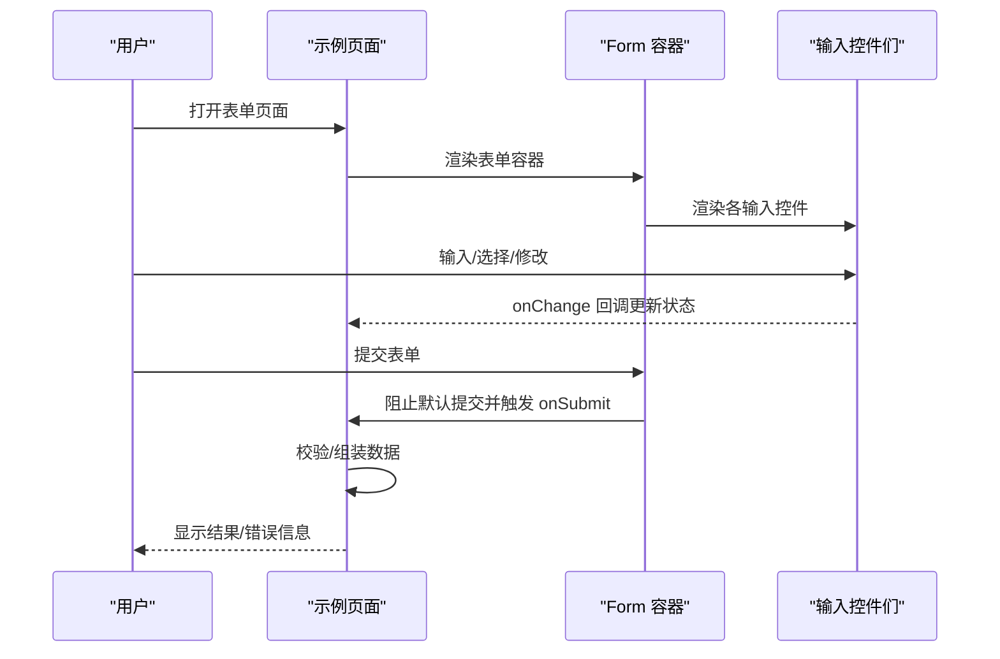

# 表单处理系统

<cite>
**本文引用的文件**
- [src/components/form/Form.tsx](file://src/components/form/Form.tsx)
- [src/app/(admin)/(others-pages)/(forms)/form-elements/page.tsx](file://src/app/(admin)/(others-pages)/(forms)/form-elements/page.tsx)
- [src/components/form/input/InputField.tsx](file://src/components/form/input/InputField.tsx)
- [src/components/form/input/Checkbox.tsx](file://src/components/form/input/Checkbox.tsx)
- [src/components/form/input/Radio.tsx](file://src/components/form/input/Radio.tsx)
- [src/components/form/input/TextArea.tsx](file://src/components/form/input/TextArea.tsx)
- [src/components/form/Select.tsx](file://src/components/form/Select.tsx)
- [src/components/form/MultiSelect.tsx](file://src/components/form/MultiSelect.tsx)
- [src/components/form/date-picker.tsx](file://src/components/form/date-picker.tsx)
- [src/components/form/Label.tsx](file://src/components/form/Label.tsx)
- [src/components/form/form-elements/DefaultInputs.tsx](file://src/components/form/form-elements/DefaultInputs.tsx)
- [src/components/form/form-elements/CheckboxComponents.tsx](file://src/components/form/form-elements/CheckboxComponents.tsx)
- [src/components/form/form-elements/RadioButtons.tsx](file://src/components/form/form-elements/RadioButtons.tsx)
- [src/components/form/form-elements/SelectInputs.tsx](file://src/components/form/form-elements/SelectInputs.tsx)
- [src/components/form/form-elements/TextAreaInput.tsx](file://src/components/form/form-elements/TextAreaInput.tsx)
</cite>

## 目录
1. [简介](#简介)
2. [项目结构](#项目结构)
3. [核心组件](#核心组件)
4. [架构总览](#架构总览)
5. [详细组件分析](#详细组件分析)
6. [依赖关系分析](#依赖关系分析)
7. [性能考量](#性能考量)
8. [故障排查指南](#故障排查指南)
9. [结论](#结论)
10. [附录](#附录)

## 简介
本文件系统性梳理该仓库中的表单处理体系，覆盖表单容器、输入控件、选择与多选、日期时间控件、标签与状态提示等模块；并结合示例页面展示各组件的组合用法。文档同时给出表单状态管理、错误处理、用户反馈与无障碍支持建议，并总结开发最佳实践与性能优化要点。

## 项目结构
表单相关代码主要集中在以下位置：
- 组件层：src/components/form 及其子目录，包含通用表单组件与输入控件
- 示例页面：src/app/(admin)/(others-pages)/(forms)/form-elements/page.tsx，用于集中演示各类表单元素
- 典型示例：DefaultInputs、CheckboxComponents、RadioButtons、SelectInputs、TextAreaInput 等

图表来源
- [src/app/(admin)/(others-pages)/(forms)/form-elements/page.tsx](file://src/app/(admin)/(others-pages)/(forms)/form-elements/page.tsx#L21-L43)
- [src/components/form/Form.tsx:9-21](file://src/components/form/Form.tsx#L9-L21)
- [src/components/form/Label.tsx:10-25](file://src/components/form/Label.tsx#L10-L25)
- [src/components/form/input/InputField.tsx:21-84](file://src/components/form/input/InputField.tsx#L21-L84)
- [src/components/form/input/TextArea.tsx:14-61](file://src/components/form/input/TextArea.tsx#L14-L61)
- [src/components/form/Select.tsx:18-62](file://src/components/form/Select.tsx#L18-L62)
- [src/components/form/MultiSelect.tsx:17-164](file://src/components/form/MultiSelect.tsx#L17-L164)
- [src/components/form/date-picker.tsx:18-60](file://src/components/form/date-picker.tsx#L18-L60)
- [src/components/form/input/Checkbox.tsx:12-80](file://src/components/form/input/Checkbox.tsx#L12-L80)
- [src/components/form/input/Radio.tsx:14-63](file://src/components/form/input/Radio.tsx#L14-L63)
- [src/components/form/form-elements/DefaultInputs.tsx:10-120](file://src/components/form/form-elements/DefaultInputs.tsx#L10-L120)
- [src/components/form/form-elements/CheckboxComponents.tsx:6-37](file://src/components/form/form-elements/CheckboxComponents.tsx#L6-L37)
- [src/components/form/form-elements/RadioButtons.tsx:6-43](file://src/components/form/form-elements/RadioButtons.tsx#L6-L43)
- [src/components/form/form-elements/SelectInputs.tsx:9-61](file://src/components/form/form-elements/SelectInputs.tsx#L9-L61)
- [src/components/form/form-elements/TextAreaInput.tsx:7-43](file://src/components/form/form-elements/TextAreaInput.tsx#L7-L43)

章节来源
- [src/app/(admin)/(others-pages)/(forms)/form-elements/page.tsx](file://src/app/(admin)/(others-pages)/(forms)/form-elements/page.tsx#L1-L44)

## 核心组件
- 表单容器 Form：封装原生 form，阻止默认提交，统一注入 className，便于布局与样式控制。
- 输入控件 InputField：支持多种类型（文本、数字、邮箱、密码、日期、时间等），内置禁用、成功、错误状态样式与可选提示文本。
- 多行文本 TextArea：支持禁用、错误状态与提示文本。
- 单选 Select：受控下拉，支持占位、禁用、值回传。
- 多选 MultiSelect：自定义多选下拉，支持展开/收起、选中项移除、回调返回当前选中值数组。
- 日期选择器 DatePicker：基于第三方库初始化，支持单选、多选、范围、时间模式，提供标签与占位。
- 复选框 Checkbox：受控勾选，支持禁用与自定义图标。
- 单选按钮 Radio：同组单选，支持禁用与自定义样式。
- 标签 Label：统一样式与可选类名合并，配合 htmlFor 关联控件。

章节来源
- [src/components/form/Form.tsx:3-24](file://src/components/form/Form.tsx#L3-L24)
- [src/components/form/input/InputField.tsx:3-87](file://src/components/form/input/InputField.tsx#L3-L87)
- [src/components/form/input/TextArea.tsx:3-64](file://src/components/form/input/TextArea.tsx#L3-L64)
- [src/components/form/Select.tsx:8-65](file://src/components/form/Select.tsx#L8-L65)
- [src/components/form/MultiSelect.tsx:9-167](file://src/components/form/MultiSelect.tsx#L9-L167)
- [src/components/form/date-picker.tsx:9-61](file://src/components/form/date-picker.tsx#L9-L61)
- [src/components/form/input/Checkbox.tsx:3-83](file://src/components/form/input/Checkbox.tsx#L3-L83)
- [src/components/form/input/Radio.tsx:3-66](file://src/components/form/input/Radio.tsx#L3-L66)
- [src/components/form/Label.tsx:4-28](file://src/components/form/Label.tsx#L4-L28)

## 架构总览
整体采用“页面示例 + 组合组件”的组织方式：页面负责布局与状态管理，组件负责渲染与交互；组件之间通过 props 进行解耦协作。

图表来源
- [src/app/(admin)/(others-pages)/(forms)/form-elements/page.tsx](file://src/app/(admin)/(others-pages)/(forms)/form-elements/page.tsx#L21-L43)
- [src/components/form/form-elements/DefaultInputs.tsx:10-120](file://src/components/form/form-elements/DefaultInputs.tsx#L10-L120)
- [src/components/form/form-elements/SelectInputs.tsx:9-61](file://src/components/form/form-elements/SelectInputs.tsx#L9-L61)
- [src/components/form/form-elements/CheckboxComponents.tsx:6-37](file://src/components/form/form-elements/CheckboxComponents.tsx#L6-L37)
- [src/components/form/form-elements/RadioButtons.tsx:6-43](file://src/components/form/form-elements/RadioButtons.tsx#L6-L43)
- [src/components/form/form-elements/TextAreaInput.tsx:7-43](file://src/components/form/form-elements/TextAreaInput.tsx#L7-L43)

## 详细组件分析

### 表单容器 Form
- 设计要点
  - 阻止默认提交，统一注入 className，便于在示例页中控制字段间距与布局。
- 使用建议
  - 在业务表单中建议结合状态管理与校验库，集中处理提交逻辑与错误反馈。

章节来源
- [src/components/form/Form.tsx:9-21](file://src/components/form/Form.tsx#L9-L21)

### 输入控件 InputField
- 支持属性
  - 类型、id、name、placeholder、value/defaultValue、onChange、className、min/max/step、disabled、success/error、hint。
- 状态样式
  - 默认、禁用、成功、错误四态，分别映射不同边框、背景与聚焦环颜色。
- 无障碍与可用性
  - 建议配合 Label 的 htmlFor 与 aria-* 属性完善可访问性。

章节来源
- [src/components/form/input/InputField.tsx:3-87](file://src/components/form/input/InputField.tsx#L3-L87)

### 多行文本 TextArea
- 支持属性
  - placeholder、rows、value、onChange、className、disabled、error、hint。
- 状态样式
  - 禁用与错误态样式分离，错误态下聚焦环与边框颜色调整。
- 提示文本
  - 支持在输入下方显示提示信息，便于引导用户。

章节来源
- [src/components/form/input/TextArea.tsx:3-64](file://src/components/form/input/TextArea.tsx#L3-L64)

### 单选下拉 Select
- 支持属性
  - options 数组、placeholder、onChange、className、value/defaultValue、disabled。
- 渲染逻辑
  - 占位选项禁用且置灰，映射 options 生成选项；受控 value 或 defaultValue。
- 交互
  - onChange 回调返回选中值字符串。

章节来源
- [src/components/form/Select.tsx:8-65](file://src/components/form/Select.tsx#L8-L65)

### 多选下拉 MultiSelect
- 支持属性
  - label、options（含 value/text/selected）、defaultSelected、onChange、disabled。
- 交互流程
  - 内部维护 selectedOptions 与 isOpen 状态；点击标签触发展开/收起；点击选项切换选中；支持移除已选项。
- 可访问性
  - 建议为“已选值”提供辅助文本（如 sr-only），提升读屏体验。

章节来源
- [src/components/form/MultiSelect.tsx:9-167](file://src/components/form/MultiSelect.tsx#L9-L167)

### 日期选择器 DatePicker
- 支持属性
  - id、mode（single/multiple/range/time）、onChange、defaultDate、label、placeholder。
- 初始化与销毁
  - 使用第三方库初始化，组件卸载时销毁实例，避免内存泄漏。
- 交互
  - 通过 onChange 获取所选日期数组或范围字符串，示例页中打印日志。

章节来源
- [src/components/form/date-picker.tsx:9-61](file://src/components/form/date-picker.tsx#L9-L61)

### 复选框 Checkbox
- 支持属性
  - label、checked、className、id、onChange、disabled。
- 视觉反馈
  - 选中态显示对勾图标，禁用态显示禁用图标；label 文字与控件对齐。

章节来源
- [src/components/form/input/Checkbox.tsx:3-83](file://src/components/form/input/Checkbox.tsx#L3-L83)

### 单选按钮 Radio
- 支持属性
  - id、name（同组）、value、checked、label、onChange、className、disabled。
- 视觉反馈
  - 选中态显示内圆点，禁用态文字与边框变灰；隐藏原生 input，通过自定义样式实现。

章节来源
- [src/components/form/input/Radio.tsx:3-66](file://src/components/form/input/Radio.tsx#L3-L66)

### 标签 Label
- 支持属性
  - htmlFor、children、className。
- 合并策略
  - 使用工具函数合并默认类名与用户传入类名，确保默认间距与文字样式不被覆盖。

章节来源
- [src/components/form/Label.tsx:4-28](file://src/components/form/Label.tsx#L4-L28)

### 示例页面与组合用法
- DefaultInputs
  - 演示文本输入、带占位符输入、下拉选择、密码显隐切换、日期选择器、时间输入、带支付图标前缀的输入。
- CheckboxComponents
  - 演示默认、选中、禁用三种状态的复选框。
- RadioButtons
  - 演示单选按钮组，含默认、选中、禁用状态。
- SelectInputs
  - 演示单选下拉与多选下拉，多选场景提供“已选值”辅助文本。
- TextAreaInput
  - 演示默认、禁用、错误态多行文本输入与提示文本。

章节来源
- [src/components/form/form-elements/DefaultInputs.tsx:10-120](file://src/components/form/form-elements/DefaultInputs.tsx#L10-L120)
- [src/components/form/form-elements/CheckboxComponents.tsx:6-37](file://src/components/form/form-elements/CheckboxComponents.tsx#L6-L37)
- [src/components/form/form-elements/RadioButtons.tsx:6-43](file://src/components/form/form-elements/RadioButtons.tsx#L6-L43)
- [src/components/form/form-elements/SelectInputs.tsx:9-61](file://src/components/form/form-elements/SelectInputs.tsx#L9-L61)
- [src/components/form/form-elements/TextAreaInput.tsx:7-43](file://src/components/form/form-elements/TextAreaInput.tsx#L7-L43)

## 依赖关系分析
- 页面到组件
  - 示例页面导入各功能组件并进行组合展示。
- 组件到基础控件
  - 输入类组件（InputField、TextArea）依赖 Label；日期选择器依赖 Label 与图标资源；多选下拉依赖内部状态与事件处理。
- 第三方依赖
  - 日期选择器引入第三方库并在组件卸载时销毁实例，避免内存泄漏。

图表来源
- [src/app/(admin)/(others-pages)/(forms)/form-elements/page.tsx](file://src/app/(admin)/(others-pages)/(forms)/form-elements/page.tsx#L21-L43)
- [src/components/form/form-elements/DefaultInputs.tsx:10-120](file://src/components/form/form-elements/DefaultInputs.tsx#L10-L120)
- [src/components/form/form-elements/CheckboxComponents.tsx:6-37](file://src/components/form/form-elements/CheckboxComponents.tsx#L6-L37)
- [src/components/form/form-elements/RadioButtons.tsx:6-43](file://src/components/form/form-elements/RadioButtons.tsx#L6-L43)
- [src/components/form/form-elements/SelectInputs.tsx:9-61](file://src/components/form/form-elements/SelectInputs.tsx#L9-L61)
- [src/components/form/form-elements/TextAreaInput.tsx:7-43](file://src/components/form/form-elements/TextAreaInput.tsx#L7-L43)

## 性能考量
- 事件处理
  - 尽量将 onChange 与状态更新逻辑保持轻量，避免在高频输入中执行昂贵操作；必要时使用节流/防抖。
- 渲染开销
  - 多选下拉在大量选项时建议虚拟化列表，减少 DOM 节点数量。
- 第三方库生命周期
  - 日期选择器在组件卸载时销毁实例，防止内存泄漏与重复初始化。
- 样式与主题
  - 统一使用主题变量与暗色模式适配，避免频繁重排与重绘。

## 故障排查指南
- 输入状态异常
  - 若输入框未按预期显示成功/错误态，请检查传入的 success/error 与 value 是否正确；确认样式类拼接逻辑未被覆盖。
- 下拉选择无响应
  - 检查 onChange 是否传入且未被禁用；确认受控 value 与 defaultValue 的优先级。
- 多选下拉无法移除
  - 确认 selectedOptions 与 handleSelect/removeOption 的逻辑一致；检查 key 与索引是否匹配。
- 日期选择器样式缺失
  - 确认第三方样式文件已正确引入；检查组件卸载时的 destroy 是否执行。
- 无障碍问题
  - 为复选框/单选按钮提供正确的 id 与 htmlFor；为多选下拉提供“已选值”辅助文本；为禁用状态添加 aria-disabled。

章节来源
- [src/components/form/input/InputField.tsx:38-50](file://src/components/form/input/InputField.tsx#L38-L50)
- [src/components/form/Select.tsx:27-40](file://src/components/form/Select.tsx#L27-L40)
- [src/components/form/MultiSelect.tsx:33-46](file://src/components/form/MultiSelect.tsx#L33-L46)
- [src/components/form/date-picker.tsx:36-41](file://src/components/form/date-picker.tsx#L36-L41)
- [src/components/form/Label.tsx:10-25](file://src/components/form/Label.tsx#L10-L25)

## 结论
该表单系统以“页面示例 + 组合组件”的方式组织，覆盖了常见的输入控件与选择器，并提供了状态管理与可访问性基础。通过统一的容器与标签组件，以及受控的输入控件，能够满足大多数复杂表单场景。建议在实际项目中结合状态管理与校验库，进一步完善表单状态、错误处理与用户体验。

## 附录

### 表单元素使用清单与配置要点
- 文本输入
  - 支持类型：text/number/email/password/date/time；支持禁用、成功、错误态与提示文本。
  - 参考路径：[src/components/form/input/InputField.tsx:21-84](file://src/components/form/input/InputField.tsx#L21-L84)
- 多行文本
  - 支持禁用、错误态与提示文本；建议设置合理行数与最小宽度。
  - 参考路径：[src/components/form/input/TextArea.tsx:14-61](file://src/components/form/input/TextArea.tsx#L14-L61)
- 单选下拉
  - 支持占位、禁用与受控值；onChange 返回选中值。
  - 参考路径：[src/components/form/Select.tsx:18-62](file://src/components/form/Select.tsx#L18-L62)
- 多选下拉
  - 支持默认选中、禁用、移除已选项；onChange 返回选中值数组。
  - 参考路径：[src/components/form/MultiSelect.tsx:17-164](file://src/components/form/MultiSelect.tsx#L17-L164)
- 日期选择器
  - 支持单选/多选/范围/时间模式；初始化后需在卸载时销毁。
  - 参考路径：[src/components/form/date-picker.tsx:18-60](file://src/components/form/date-picker.tsx#L18-L60)
- 复选框
  - 支持禁用与自定义图标；onChange 返回布尔值。
  - 参考路径：[src/components/form/input/Checkbox.tsx:12-80](file://src/components/form/input/Checkbox.tsx#L12-L80)
- 单选按钮
  - 支持禁用与自定义样式；同组通过 name 区分。
  - 参考路径：[src/components/form/input/Radio.tsx:14-63](file://src/components/form/input/Radio.tsx#L14-L63)
- 标签
  - 支持 htmlFor 与类名合并；建议与对应控件 id 对应。
  - 参考路径：[src/components/form/Label.tsx:10-25](file://src/components/form/Label.tsx#L10-L25)

### 表单状态管理与错误处理流程

### 表单提交序列图
