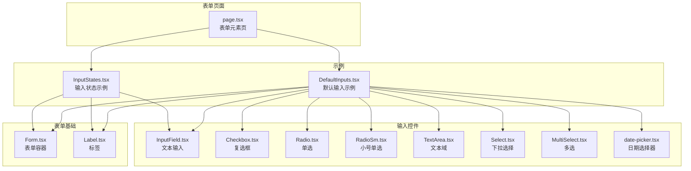
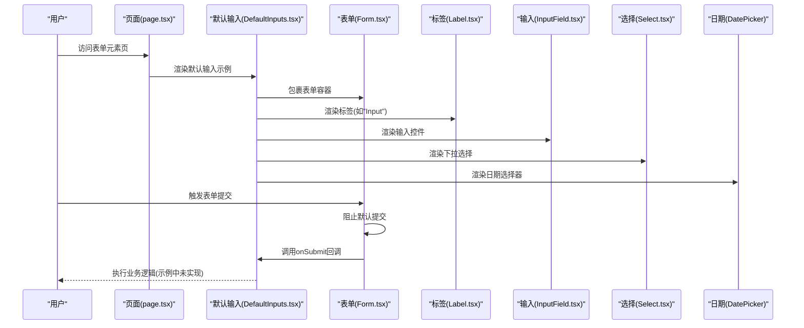
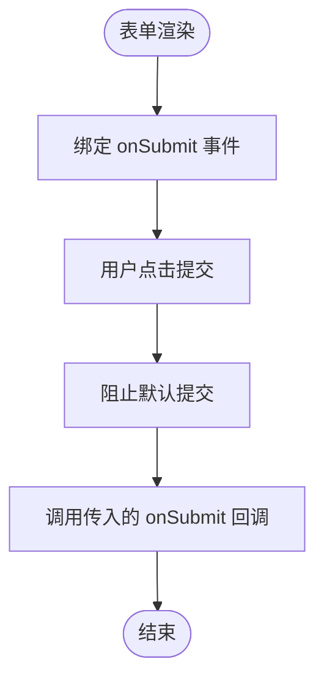
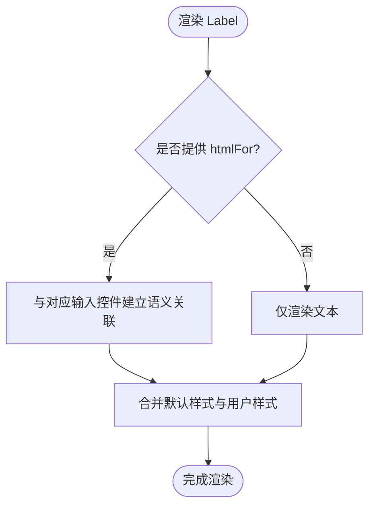
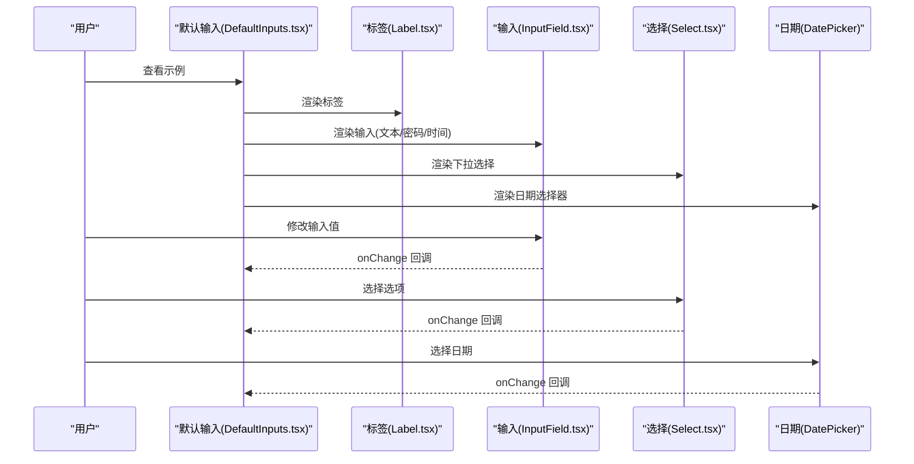
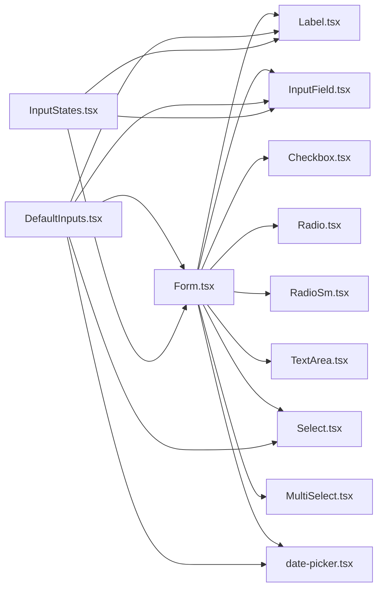

# 表单核心组件

<cite>
**本文引用的文件**
- [Form.tsx](file://src/components/form/Form.tsx)
- [Label.tsx](file://src/components/form/Label.tsx)
- [InputField.tsx](file://src/components/form/input/InputField.tsx)
- [Checkbox.tsx](file://src/components/form/input/Checkbox.tsx)
- [Radio.tsx](file://src/components/form/input/Radio.tsx)
- [RadioSm.tsx](file://src/components/form/input/RadioSm.tsx)
- [TextArea.tsx](file://src/components/form/input/TextArea.tsx)
- [Select.tsx](file://src/components/form/Select.tsx)
- [MultiSelect.tsx](file://src/components/form/MultiSelect.tsx)
- [date-picker.tsx](file://src/components/form/date-picker.tsx)
- [DefaultInputs.tsx](file://src/components/form/form-elements/DefaultInputs.tsx)
- [InputStates.tsx](file://src/components/form/form-elements/InputStates.tsx)
- [page.tsx](file://src/app/(admin)/(others-pages)/(forms)/form-elements/page.tsx)
</cite>

## 目录
1. [简介](#简介)
2. [项目结构](#项目结构)
3. [核心组件](#核心组件)
4. [架构总览](#架构总览)
5. [详细组件分析](#详细组件分析)
6. [依赖关系分析](#依赖关系分析)
7. [性能考量](#性能考量)
8. [故障排查指南](#故障排查指南)
9. [结论](#结论)
10. [附录](#附录)

## 简介
本文件聚焦于表单核心组件的设计与实现，系统性阐述 Form 主组件的事件处理机制与生命周期管理、Label 标签组件的样式定制与无障碍支持，并结合输入控件（文本、选择、多选、日期、单选/复选、文本域）展示表单容器的布局策略、间距控制与响应式设计。同时提供组件组合模式、最佳实践与常见问题解决方案，帮助开发者深入理解底层架构并高效扩展表单功能。

## 项目结构
表单相关代码主要位于 src/components/form 及其子目录中，页面示例位于 src/app 下的表单元素页。整体采用按功能分层组织：Form 与 Label 作为基础容器与标签；input 子目录封装各类输入控件；Select、MultiSelect、date-picker 提供复合交互；示例页面通过 DefaultInputs、InputStates 展示组合使用方式。

图表来源
- [page.tsx](file://src/app/(admin)/(others-pages)/(forms)/form-elements/page.tsx#L21-L43)
- [DefaultInputs.tsx:10-120](file://src/components/form/form-elements/DefaultInputs.tsx#L10-L120)
- [InputStates.tsx:7-70](file://src/components/form/form-elements/InputStates.tsx#L7-L70)
- [Form.tsx:9-21](file://src/components/form/Form.tsx#L9-L21)
- [Label.tsx:10-25](file://src/components/form/Label.tsx#L10-L25)
- [InputField.tsx:21-87](file://src/components/form/input/InputField.tsx#L21-L87)
- [Checkbox.tsx:12-83](file://src/components/form/input/Checkbox.tsx#L12-L83)
- [Radio.tsx:14-66](file://src/components/form/input/Radio.tsx#L14-L66)
- [RadioSm.tsx:13-60](file://src/components/form/input/RadioSm.tsx#L13-L60)
- [TextArea.tsx:14-64](file://src/components/form/input/TextArea.tsx#L14-L64)
- [Select.tsx:18-65](file://src/components/form/Select.tsx#L18-L65)
- [MultiSelect.tsx:17-167](file://src/components/form/MultiSelect.tsx#L17-L167)
- [date-picker.tsx:18-61](file://src/components/form/date-picker.tsx#L18-L61)

章节来源
- [page.tsx](file://src/app/(admin)/(others-pages)/(forms)/form-elements/page.tsx#L21-L43)

## 核心组件
- Form 主组件：封装原生 form 元素，统一拦截默认提交行为并通过受控回调触发业务逻辑，支持传入自定义样式类名，便于在容器层面统一间距与布局。
- Label 标签组件：基于原生 label 渲染，默认提供一致的字体、颜色与间距；通过 htmlFor 与输入控件 id 绑定，实现无障碍访问；支持用户自定义类名覆盖默认样式。

章节来源
- [Form.tsx:3-21](file://src/components/form/Form.tsx#L3-L21)
- [Label.tsx:4-25](file://src/components/form/Label.tsx#L4-L25)

## 架构总览
Form 作为顶层容器，内部通过 Label 为各输入控件提供语义化标签；输入控件根据状态（成功/错误/禁用）动态切换样式；Select/MultiSelect/DatePicker 提供复杂交互；示例页面通过组合这些组件展示典型布局与交互。

图表来源
- [page.tsx](file://src/app/(admin)/(others-pages)/(forms)/form-elements/page.tsx#L21-L43)
- [DefaultInputs.tsx:20-75](file://src/components/form/form-elements/DefaultInputs.tsx#L20-L75)
- [Form.tsx:9-21](file://src/components/form/Form.tsx#L9-L21)
- [Label.tsx:10-25](file://src/components/form/Label.tsx#L10-L25)
- [InputField.tsx:21-87](file://src/components/form/input/InputField.tsx#L21-L87)
- [Select.tsx:18-65](file://src/components/form/Select.tsx#L18-L65)
- [date-picker.tsx:18-61](file://src/components/form/date-picker.tsx#L18-L61)

## 详细组件分析

### Form 主组件
- 设计要点
  - 使用受控回调 onSubmit 处理提交，显式阻止默认提交以避免页面刷新。
  - 支持 className 自定义，便于在容器层统一间距与布局。
- 生命周期管理
  - 无内部状态，仅在渲染时绑定事件处理器；提交事件由父级或示例页面传入的回调处理。
- 事件处理机制
  - 在表单层统一拦截 submit，确保业务侧可进行校验与数据收集后再决定是否提交。

图表来源
- [Form.tsx:9-21](file://src/components/form/Form.tsx#L9-L21)

章节来源
- [Form.tsx:3-21](file://src/components/form/Form.tsx#L3-L21)

### Label 标签组件
- 实现原理
  - 基于原生 label 渲染，支持 htmlFor 指向对应输入控件 id，形成语义化关联。
  - 默认提供字体、颜色与间距，使用工具类合并库允许用户自定义覆盖。
- 样式定制
  - 通过 className 参数叠加自定义样式，保持默认间距与主题色的一致性。
- 无障碍访问支持
  - 通过 htmlFor 与输入控件 id 绑定，提升键盘导航与屏幕阅读器可用性。
- 最佳实践
  - 为每个输入控件提供唯一 id，并在 Label 上设置对应的 htmlFor。
  - 将 Label 紧邻放置在输入控件之前，保证视觉与语义顺序一致。

图表来源
- [Label.tsx:10-25](file://src/components/form/Label.tsx#L10-L25)

章节来源
- [Label.tsx:4-25](file://src/components/form/Label.tsx#L4-L25)

### 输入控件族

#### 文本输入 InputField
- 状态样式
  - 成功/错误/禁用三种状态通过条件拼接类名实现，确保焦点态、边框与提示文字的颜色一致性。
- 提示文本 hint
  - 支持显示辅助信息，颜色随状态变化，增强可读性。
- 最佳实践
  - 为输入控件提供 id 与 name，配合 Label 的 htmlFor 形成完整无障碍链路。
  - 错误态与成功态 hint 应与业务校验结果同步更新。

章节来源
- [InputField.tsx:3-87](file://src/components/form/input/InputField.tsx#L3-L87)

#### 复选框 Checkbox
- 交互与样式
  - 使用隐藏原生 checkbox，通过自绘勾选图标与状态色实现统一视觉。
  - 支持禁用态与 hover 效果，禁用时透明度与颜色调整。
- 无障碍
  - label 包裹 input，点击区域扩大，提升可触达性。

章节来源
- [Checkbox.tsx:3-83](file://src/components/form/input/Checkbox.tsx#L3-L83)

#### 单选按钮 Radio 与 RadioSm
- 交互与样式
  - 通过隐藏原生 input，自绘圆形指示器与内点，选中态与禁用态颜色区分明确。
  - RadioSm 提供更紧凑的尺寸，适用于列表或紧凑布局。
- 无障碍
  - 同组单选共享 name，通过 id 与 label 关联，确保键盘导航与读屏支持。

章节来源
- [Radio.tsx:3-66](file://src/components/form/input/Radio.tsx#L3-L66)
- [RadioSm.tsx:3-60](file://src/components/form/input/RadioSm.tsx#L3-L60)

#### 文本域 TextArea
- 状态样式
  - 错误态与默认态的边框、背景与焦点环颜色差异化明显，便于用户感知。
- 提示文本 hint
  - 支持显示简短说明，错误态下提示文字颜色与输入框状态一致。

章节来源
- [TextArea.tsx:3-64](file://src/components/form/input/TextArea.tsx#L3-L64)

#### 下拉选择 Select
- 交互与样式
  - 选项映射渲染，占位符与值状态影响文本颜色；禁用态具备不可交互外观。
- 最佳实践
  - 为 Select 提供默认值或占位符，避免空值导致的样式异常。

章节来源
- [Select.tsx:8-65](file://src/components/form/Select.tsx#L8-L65)

#### 多选 MultiSelect
- 交互与样式
  - 支持多选项选择与移除，下拉面板滚动与高亮选中项；禁用态不可交互。
- 最佳实践
  - 通过 onChange 返回选中值数组，外部维护状态并在必要时回填默认选中。

章节来源
- [MultiSelect.tsx:9-167](file://src/components/form/MultiSelect.tsx#L9-L167)

#### 日期选择器 DatePicker
- 交互与样式
  - 基于第三方库初始化，静态日历面板与月份选择器；输入框与图标位置固定。
- 生命周期
  - 组件挂载时初始化，卸载时销毁实例，避免内存泄漏。

章节来源
- [date-picker.tsx:9-61](file://src/components/form/date-picker.tsx#L9-L61)

### 示例页面与组合模式
- 默认输入示例 DefaultInputs
  - 展示文本输入、占位符、下拉选择、密码可见切换、日期选择器、时间输入与带图标的输入组合。
  - 使用 Label 与输入控件 id 对应，实现无障碍与良好布局。
- 输入状态示例 InputStates
  - 演示错误态、成功态与禁用态的输入样式与 hint 文案联动，验证流程清晰。

图表来源
- [DefaultInputs.tsx:20-75](file://src/components/form/form-elements/DefaultInputs.tsx#L20-L75)
- [Label.tsx:10-25](file://src/components/form/Label.tsx#L10-L25)
- [InputField.tsx:21-87](file://src/components/form/input/InputField.tsx#L21-L87)
- [Select.tsx:18-65](file://src/components/form/Select.tsx#L18-L65)
- [date-picker.tsx:18-61](file://src/components/form/date-picker.tsx#L18-L61)

章节来源
- [DefaultInputs.tsx:10-120](file://src/components/form/form-elements/DefaultInputs.tsx#L10-L120)
- [InputStates.tsx:7-70](file://src/components/form/form-elements/InputStates.tsx#L7-L70)

## 依赖关系分析
- 组件耦合
  - Form 与 Label 为低耦合基础组件，Form 仅负责事件拦截与容器样式，Label 仅负责语义化标签渲染。
  - 输入控件对 Form/Lable 的依赖体现在示例页面的组合使用，而非硬编码依赖。
- 外部依赖
  - 日期选择器依赖第三方库初始化与销毁，需注意生命周期管理。
- 接口契约
  - 所有输入控件均暴露 onChange/value/disabled/error/success 等通用属性，便于统一状态管理与样式切换。

图表来源
- [Form.tsx:9-21](file://src/components/form/Form.tsx#L9-L21)
- [Label.tsx:10-25](file://src/components/form/Label.tsx#L10-L25)
- [InputField.tsx:21-87](file://src/components/form/input/InputField.tsx#L21-L87)
- [Checkbox.tsx:12-83](file://src/components/form/input/Checkbox.tsx#L12-L83)
- [Radio.tsx:14-66](file://src/components/form/input/Radio.tsx#L14-L66)
- [RadioSm.tsx:13-60](file://src/components/form/input/RadioSm.tsx#L13-L60)
- [TextArea.tsx:14-64](file://src/components/form/input/TextArea.tsx#L14-L64)
- [Select.tsx:18-65](file://src/components/form/Select.tsx#L18-L65)
- [MultiSelect.tsx:17-167](file://src/components/form/MultiSelect.tsx#L17-L167)
- [date-picker.tsx:18-61](file://src/components/form/date-picker.tsx#L18-L61)
- [DefaultInputs.tsx:20-75](file://src/components/form/form-elements/DefaultInputs.tsx#L20-L75)
- [InputStates.tsx:25-67](file://src/components/form/form-elements/InputStates.tsx#L25-L67)

## 性能考量
- 事件处理
  - Form 仅绑定一次 submit 阻止逻辑，开销极低；输入控件 onChange 为轻量函数，建议在上层统一校验与节流。
- 样式计算
  - 状态类名拼接在渲染时完成，建议避免频繁重排；对于大量选项的 Select/MultiSelect，优先考虑虚拟滚动或分页加载。
- 第三方库
  - 日期选择器在卸载时需销毁实例，防止内存泄漏；避免在每次渲染都重复初始化。
- 响应式与布局
  - 使用栅格与间距工具类统一布局，减少自定义样式的重复计算；在移动端优先使用相对单位与弹性布局。

## 故障排查指南
- 提交无效
  - 确认 Form 的 onSubmit 是否被正确传入且未被覆盖；检查是否有阻止事件冒泡的逻辑。
- 标签不生效
  - 确保 Label 的 htmlFor 与输入控件 id 一致；确认输入控件已渲染并具有有效 id。
- 输入状态异常
  - 检查 error/success/disabled 状态参数是否正确传递；确认 hint 文案与状态同步。
- 多选交互卡顿
  - 检查选项数量与渲染逻辑；对长列表启用虚拟化或限制一次性渲染数量。
- 日期选择器内存泄漏
  - 确认组件卸载时执行销毁；避免在 useEffect 中重复初始化而未清理。

章节来源
- [Form.tsx:9-21](file://src/components/form/Form.tsx#L9-L21)
- [Label.tsx:10-25](file://src/components/form/Label.tsx#L10-L25)
- [InputField.tsx:38-50](file://src/components/form/input/InputField.tsx#L38-L50)
- [MultiSelect.tsx:33-46](file://src/components/form/MultiSelect.tsx#L33-L46)
- [date-picker.tsx:36-41](file://src/components/form/date-picker.tsx#L36-L41)

## 结论
该表单体系以 Form 与 Label 为基础，围绕输入控件构建了统一的状态样式与无障碍体验；通过示例页面展示了常见组合模式与最佳实践。组件间低耦合、接口一致，便于扩展与维护。建议在实际项目中遵循“语义化标签 + 状态驱动样式 + 生命周期管理”的原则，持续优化交互与性能。

## 附录
- 组合模式清单
  - 基础组合：Label + InputField/Select/TextArea
  - 交互组合：Label + Checkbox/Radio/RadioSm
  - 复杂组合：Label + DatePicker 或带图标/提示的输入
- 最佳实践清单
  - 为每个输入提供 id 与 htmlFor
  - 使用状态参数驱动样式，保持视觉一致性
  - 在示例页面中演示错误/成功/禁用三态与 hint 文案联动
  - 注意第三方组件的生命周期管理与资源释放