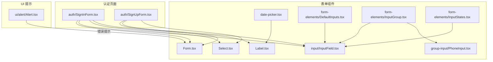
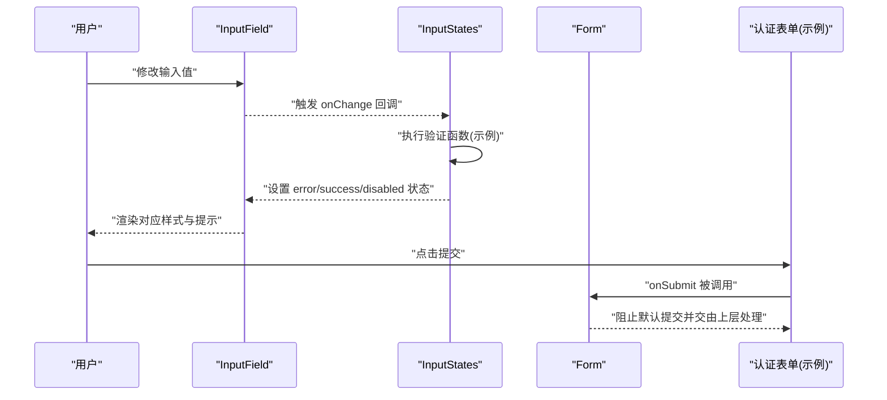
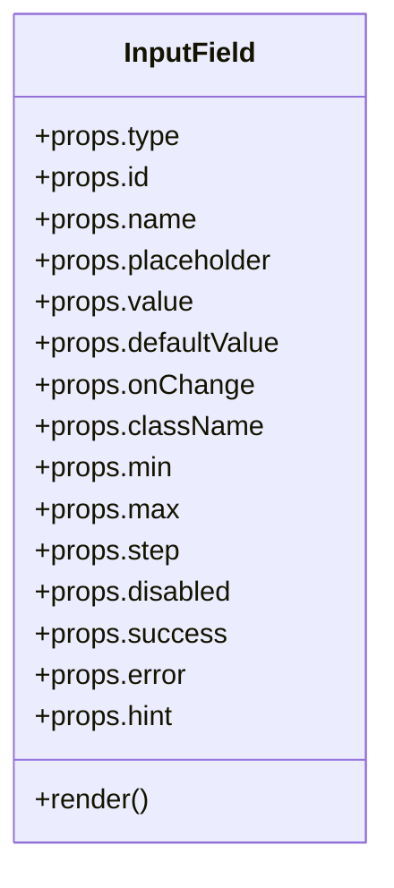
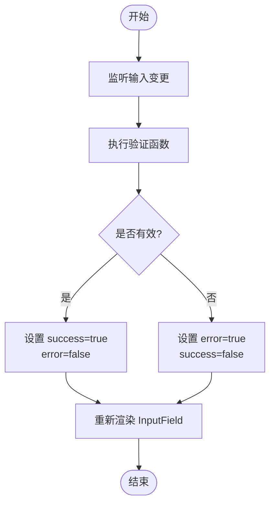
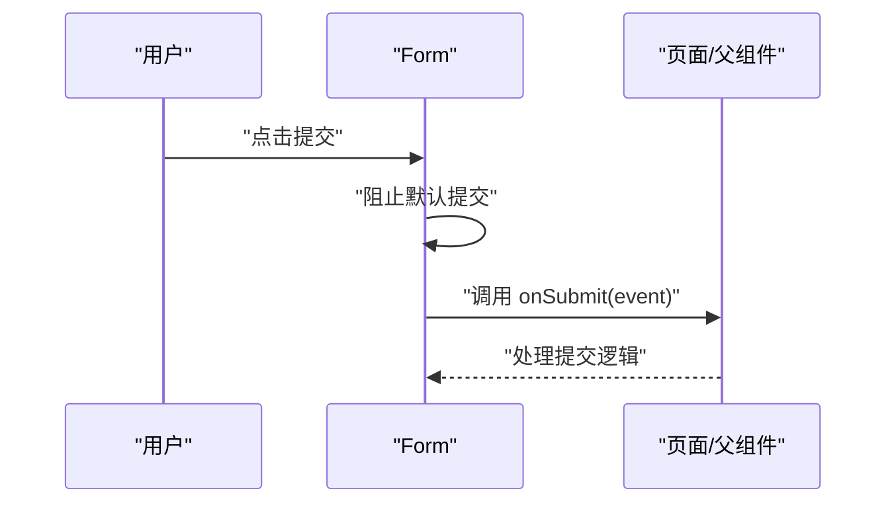
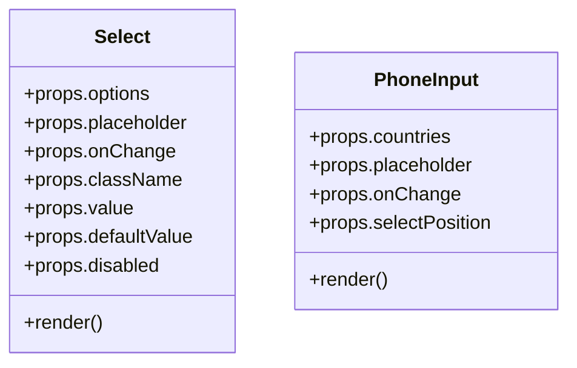
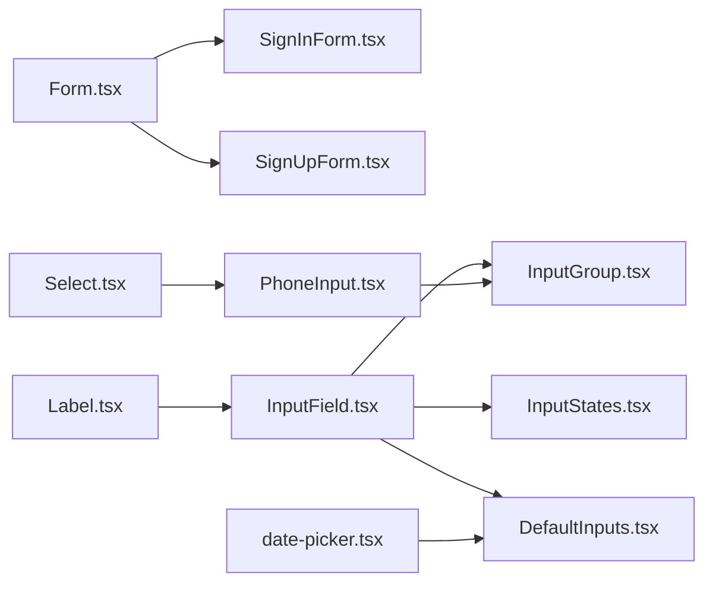

# 表单验证

<cite>
**本文引用的文件**
- [src/components/form/input/InputField.tsx](file://src/components/form/input/InputField.tsx)
- [src/components/form/form-elements/InputStates.tsx](file://src/components/form/form-elements/InputStates.tsx)
- [src/components/form/Form.tsx](file://src/components/form/Form.tsx)
- [src/components/form/form-elements/DefaultInputs.tsx](file://src/components/form/form-elements/DefaultInputs.tsx)
- [src/components/form/form-elements/InputGroup.tsx](file://src/components/form/form-elements/InputGroup.tsx)
- [src/components/form/group-input/PhoneInput.tsx](file://src/components/form/group-input/PhoneInput.tsx)
- [src/components/form/Select.tsx](file://src/components/form/Select.tsx)
- [src/components/form/date-picker.tsx](file://src/components/form/date-picker.tsx)
- [src/components/auth/SignInForm.tsx](file://src/components/auth/SignInForm.tsx)
- [src/components/auth/SignUpForm.tsx](file://src/components/auth/SignUpForm.tsx)
- [src/components/form/Label.tsx](file://src/components/form/Label.tsx)
- [src/components/ui/alert/Alert.tsx](file://src/components/ui/alert/Alert.tsx)
- [README.md](file://README.md)
</cite>

## 目录
1. [简介](#简介)
2. [项目结构](#项目结构)
3. [核心组件](#核心组件)
4. [架构总览](#架构总览)
5. [详细组件分析](#详细组件分析)
6. [依赖关系分析](#依赖关系分析)
7. [性能考虑](#性能考虑)
8. [故障排查指南](#故障排查指南)
9. [结论](#结论)
10. [附录](#附录)

## 简介
本文件面向需要在 Next.js 应用中实现复杂表单验证逻辑的开发者，系统性梳理当前代码库中的表单验证架构与实践。内容覆盖：
- 验证状态管理（success、error、warning、default）
- 实时验证机制与验证时机控制
- 错误消息呈现与错误边界处理
- 内置验证器与自定义验证函数的使用方式
- 验证组合策略与异步验证处理建议
- 性能优化、用户体验提升与无障碍访问支持

当前仓库提供了基础的输入状态样式与示例验证流程，可作为构建更复杂验证体系的起点。

## 项目结构
与表单验证直接相关的文件主要集中在 src/components/form 及其子目录，以及认证页面中的表单组件。整体组织采用“按功能域分层”的方式：通用表单元素（输入、选择、日期等）位于 form 子目录；具体业务页面（如登录/注册）在 auth 子目录中复用这些元素并集成验证逻辑。

图表来源
- [src/components/form/Form.tsx:1-24](file://src/components/form/Form.tsx#L1-L24)
- [src/components/form/Label.tsx:1-27](file://src/components/form/Label.tsx#L1-L27)
- [src/components/form/input/InputField.tsx:1-87](file://src/components/form/input/InputField.tsx#L1-L87)
- [src/components/form/Select.tsx:1-65](file://src/components/form/Select.tsx#L1-L65)
- [src/components/form/date-picker.tsx:1-61](file://src/components/form/date-picker.tsx#L1-L61)
- [src/components/form/group-input/PhoneInput.tsx:1-142](file://src/components/form/group-input/PhoneInput.tsx#L1-L142)
- [src/components/form/form-elements/DefaultInputs.tsx:1-121](file://src/components/form/form-elements/DefaultInputs.tsx#L1-L121)
- [src/components/form/form-elements/InputGroup.tsx:1-57](file://src/components/form/form-elements/InputGroup.tsx#L1-L57)
- [src/components/form/form-elements/InputStates.tsx:1-70](file://src/components/form/form-elements/InputStates.tsx#L1-L70)
- [src/components/auth/SignInForm.tsx:1-155](file://src/components/auth/SignInForm.tsx#L1-L155)
- [src/components/auth/SignUpForm.tsx:104-140](file://src/components/auth/SignUpForm.tsx#L104-L140)
- [src/components/ui/alert/Alert.tsx:45-73](file://src/components/ui/alert/Alert.tsx#L45-L73)

章节来源
- [README.md:77-89](file://README.md#L77-L89)

## 核心组件
- 输入组件 InputField：负责渲染不同状态（禁用、成功、错误）的输入框，并支持可选的提示文本。
- 表单容器 Form：统一拦截原生提交行为，转由上层处理提交逻辑。
- 选择器 Select：提供基础的选择输入能力。
- 电话输入 PhoneInput：组合国家码选择与号码输入，便于国际化手机号输入。
- 日期选择器 DatePicker：基于第三方库的日期选择控件。
- 示例页面 InputStates：演示错误/成功/禁用状态的验证样式与提示文本。
- 认证表单 SignInForm/SignUpForm：在实际业务中使用上述组件，并可扩展验证逻辑。

章节来源
- [src/components/form/input/InputField.tsx:1-87](file://src/components/form/input/InputField.tsx#L1-L87)
- [src/components/form/Form.tsx:1-24](file://src/components/form/Form.tsx#L1-L24)
- [src/components/form/Select.tsx:1-65](file://src/components/form/Select.tsx#L1-L65)
- [src/components/form/group-input/PhoneInput.tsx:1-142](file://src/components/form/group-input/PhoneInput.tsx#L1-L142)
- [src/components/form/date-picker.tsx:1-61](file://src/components/form/date-picker.tsx#L1-L61)
- [src/components/form/form-elements/InputStates.tsx:1-70](file://src/components/form/form-elements/InputStates.tsx#L1-L70)
- [src/components/auth/SignInForm.tsx:1-155](file://src/components/auth/SignInForm.tsx#L1-L155)
- [src/components/auth/SignUpForm.tsx:104-140](file://src/components/auth/SignUpForm.tsx#L104-L140)

## 架构总览
下图展示了从用户交互到状态更新与错误提示的整体流程，体现“输入变更 -> 触发校验 -> 更新状态 -> 渲染反馈”的闭环。

图表来源
- [src/components/form/input/InputField.tsx:1-87](file://src/components/form/input/InputField.tsx#L1-L87)
- [src/components/form/form-elements/InputStates.tsx:1-70](file://src/components/form/form-elements/InputStates.tsx#L1-L70)
- [src/components/form/Form.tsx:1-24](file://src/components/form/Form.tsx#L1-L24)
- [src/components/auth/SignInForm.tsx:1-155](file://src/components/auth/SignInForm.tsx#L1-L155)

## 详细组件分析

### 输入组件 InputField 分析
- 状态映射
  - 禁用态：禁用样式与不可交互
  - 成功态：绿色系边框与背景，强调正确输入
  - 错误态：红色系边框与背景，强调异常输入
  - 默认态：灰色边框与品牌色聚焦态
- 提示文本：当传入 hint 时，根据当前状态显示不同颜色的辅助文本
- 事件与属性：支持 onChange、value/defaultValue、min/max/step 等标准 HTML 属性

图表来源
- [src/components/form/input/InputField.tsx:3-19](file://src/components/form/input/InputField.tsx#L3-L19)

章节来源
- [src/components/form/input/InputField.tsx:21-87](file://src/components/form/input/InputField.tsx#L21-L87)

### 实时验证与状态管理（InputStates 示例）
- 示例通过 useState 维护输入值与错误标志
- 在 onChange 中调用验证函数，根据结果切换 error/success 状态
- 将错误或成功提示以 hint 形式展示

图表来源
- [src/components/form/form-elements/InputStates.tsx:7-23](file://src/components/form/form-elements/InputStates.tsx#L7-L23)
- [src/components/form/input/InputField.tsx:41-50](file://src/components/form/input/InputField.tsx#L41-L50)

章节来源
- [src/components/form/form-elements/InputStates.tsx:1-70](file://src/components/form/form-elements/InputStates.tsx#L1-L70)

### 表单容器 Form 的作用
- 拦截浏览器默认提交行为，统一将提交事件交给上层处理
- 保持表单字段间的间距与布局一致性

图表来源
- [src/components/form/Form.tsx:9-21](file://src/components/form/Form.tsx#L9-L21)

章节来源
- [src/components/form/Form.tsx:1-24](file://src/components/form/Form.tsx#L1-L24)

### 选择器 Select 与电话输入 PhoneInput
- Select：提供基础选项列表，支持禁用、占位符与受控/非受控值
- PhoneInput：组合国家码选择与电话号码输入，支持起始/结束两种下拉位置

图表来源
- [src/components/form/Select.tsx:8-26](file://src/components/form/Select.tsx#L8-L26)
- [src/components/form/group-input/PhoneInput.tsx:9-21](file://src/components/form/group-input/PhoneInput.tsx#L9-L21)

章节来源
- [src/components/form/Select.tsx:1-65](file://src/components/form/Select.tsx#L1-L65)
- [src/components/form/group-input/PhoneInput.tsx:1-142](file://src/components/form/group-input/PhoneInput.tsx#L1-L142)

### 日期选择器 DatePicker
- 基于第三方库初始化，支持单选/多选/范围/时间模式
- 提供标签与图标装饰，输入框样式与主题一致

章节来源
- [src/components/form/date-picker.tsx:1-61](file://src/components/form/date-picker.tsx#L1-L61)

### 认证表单中的验证集成点
- 登录/注册页复用 InputField、Select、Label 等组件
- 可在 onChange 中接入实时验证，在提交时进行集中校验

章节来源
- [src/components/auth/SignInForm.tsx:1-155](file://src/components/auth/SignInForm.tsx#L1-L155)
- [src/components/auth/SignUpForm.tsx:104-140](file://src/components/auth/SignUpForm.tsx#L104-L140)

## 依赖关系分析
- 组件间耦合
  - Form 作为容器，被认证页面与示例页面复用
  - InputField 作为原子组件，被 InputStates、DefaultInputs、InputGroup 等示例页面使用
  - PhoneInput 依赖 Select 的样式与交互特性
- 外部依赖
  - 日期选择器依赖第三方库初始化与清理
- 潜在风险
  - 若未在顶层 Form 中统一处理提交，可能导致默认刷新或重复提交
  - 输入状态切换需与验证函数解耦，避免在渲染阶段产生副作用

图表来源
- [src/components/form/Form.tsx:1-24](file://src/components/form/Form.tsx#L1-L24)
- [src/components/form/input/InputField.tsx:1-87](file://src/components/form/input/InputField.tsx#L1-L87)
- [src/components/form/form-elements/InputStates.tsx:1-70](file://src/components/form/form-elements/InputStates.tsx#L1-L70)
- [src/components/form/form-elements/DefaultInputs.tsx:1-121](file://src/components/form/form-elements/DefaultInputs.tsx#L1-L121)
- [src/components/form/form-elements/InputGroup.tsx:1-57](file://src/components/form/form-elements/InputGroup.tsx#L1-L57)
- [src/components/form/group-input/PhoneInput.tsx:1-142](file://src/components/form/group-input/PhoneInput.tsx#L1-L142)
- [src/components/form/Select.tsx:1-65](file://src/components/form/Select.tsx#L1-L65)
- [src/components/form/date-picker.tsx:1-61](file://src/components/form/date-picker.tsx#L1-L61)
- [src/components/form/Label.tsx:1-27](file://src/components/form/Label.tsx#L1-L27)

## 性能考虑
- 避免在渲染期间执行昂贵的验证逻辑，建议将验证函数与状态更新分离
- 对高频输入（如搜索、数字输入）可采用防抖策略，减少重渲染次数
- 使用受控组件时，确保 onChange 仅做必要状态更新，避免不必要的深层比较
- 日期选择器等第三方组件应在卸载时销毁实例，防止内存泄漏
- 对于大表单，可按需渲染与懒加载验证提示，降低首屏压力

## 故障排查指南
- 输入状态不更新
  - 检查是否在 onChange 中正确调用了验证函数并更新了状态
  - 确认 InputField 的 success/error/disabled 属性是否随状态变化而变化
- 提交无效
  - 确保 Form 的 onSubmit 已被调用且未被默认提交行为中断
- 错误消息未显示
  - 确认 hint 或错误提示组件已正确传入并渲染
  - 检查错误提示组件的可见性与样式类名
- 第三方组件异常
  - 确保 DatePicker 在卸载时正确销毁实例
  - 检查第三方库版本与主题样式兼容性

章节来源
- [src/components/ui/alert/Alert.tsx:45-73](file://src/components/ui/alert/Alert.tsx#L45-L73)
- [src/components/form/date-picker.tsx:36-41](file://src/components/form/date-picker.tsx#L36-L41)

## 结论
当前代码库提供了清晰的表单输入状态样式与示例验证流程，能够支撑基础的实时验证与错误提示需求。对于更复杂的验证场景，建议在此基础上引入：
- 更完善的验证器集合与组合策略
- 异步验证与并发控制
- 统一的错误边界与全局提示
- 无障碍访问增强（ARIA、键盘导航、屏幕阅读器友好）

## 附录
- 验证时机建议
  - 失效焦点时验证（blur）：适用于必填项与格式校验
  - 实时验证（change）：适用于长度限制与简单格式检查
  - 提交时集中验证：用于跨字段一致性与服务端校验
- 错误消息设计
  - 明确、简洁、可操作
  - 与输入状态颜色保持一致的语义化表达
- 无障碍访问
  - 为输入与提示添加 aria-invalid、aria-describedby 等属性
  - 确保键盘可达与焦点可见性
  - 为图片/图标提供替代文本或隐藏文本