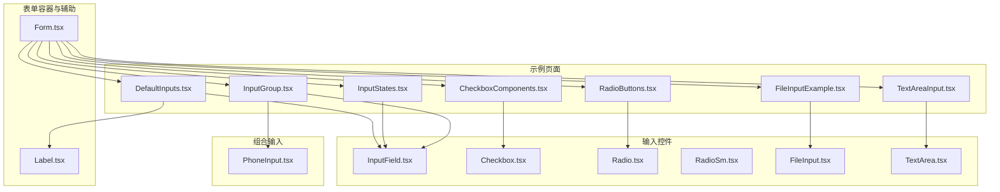
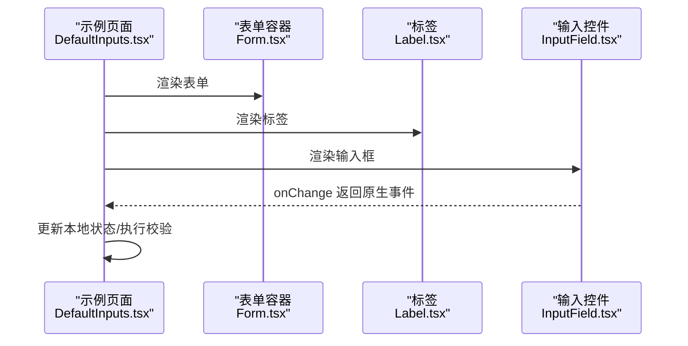
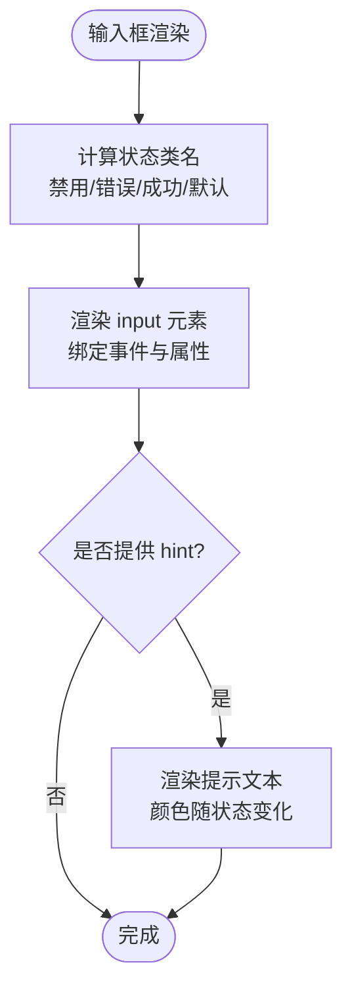
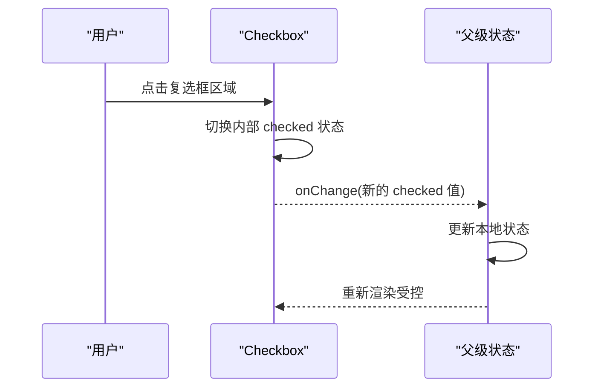
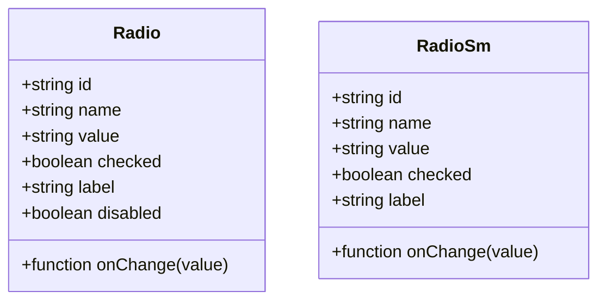
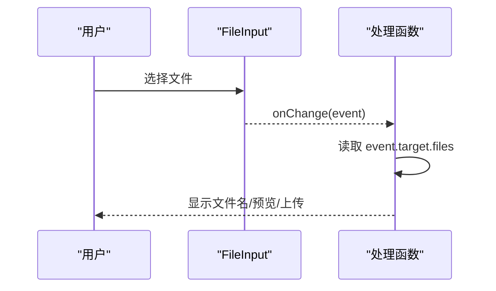
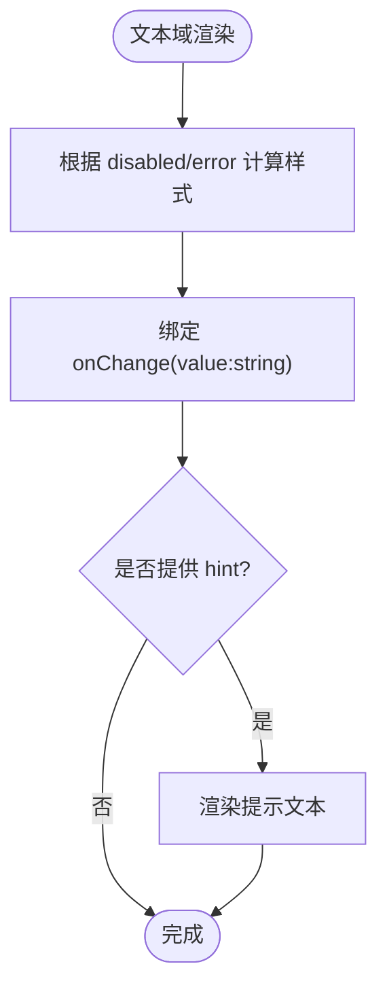
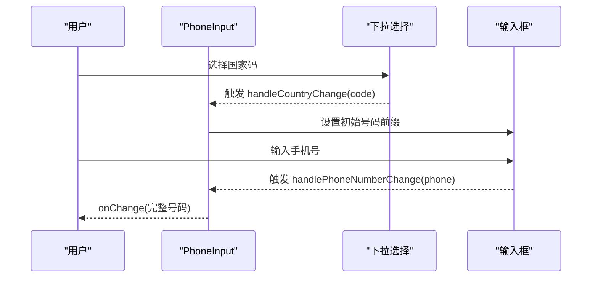
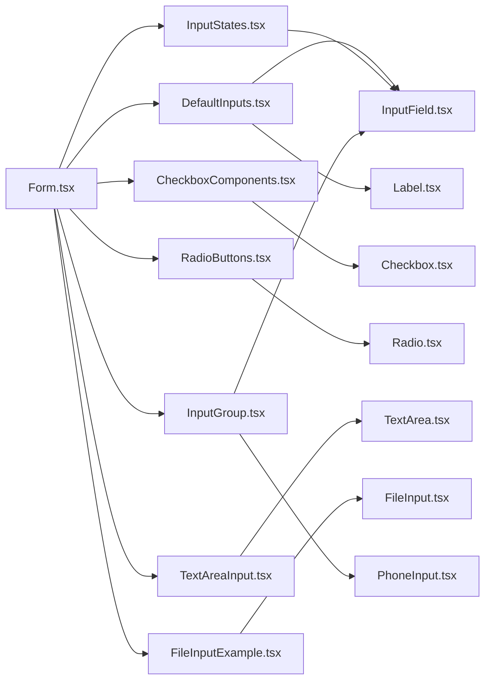

# 输入控件

<cite>
**本文引用的文件**
- [InputField.tsx](file://src/components/form/input/InputField.tsx)
- [Checkbox.tsx](file://src/components/form/input/Checkbox.tsx)
- [Radio.tsx](file://src/components/form/input/Radio.tsx)
- [RadioSm.tsx](file://src/components/form/input/RadioSm.tsx)
- [FileInput.tsx](file://src/components/form/input/FileInput.tsx)
- [TextArea.tsx](file://src/components/form/input/TextArea.tsx)
- [Form.tsx](file://src/components/form/Form.tsx)
- [Label.tsx](file://src/components/form/Label.tsx)
- [DefaultInputs.tsx](file://src/components/form/form-elements/DefaultInputs.tsx)
- [CheckboxComponents.tsx](file://src/components/form/form-elements/CheckboxComponents.tsx)
- [RadioButtons.tsx](file://src/components/form/form-elements/RadioButtons.tsx)
- [TextAreaInput.tsx](file://src/components/form/form-elements/TextAreaInput.tsx)
- [FileInputExample.tsx](file://src/components/form/form-elements/FileInputExample.tsx)
- [InputStates.tsx](file://src/components/form/form-elements/InputStates.tsx)
- [InputGroup.tsx](file://src/components/form/form-elements/InputGroup.tsx)
- [PhoneInput.tsx](file://src/components/form/group-input/PhoneInput.tsx)
</cite>

## 目录
1. [简介](#简介)
2. [项目结构](#项目结构)
3. [核心组件](#核心组件)
4. [架构总览](#架构总览)
5. [详细组件分析](#详细组件分析)
6. [依赖关系分析](#依赖关系分析)
7. [性能考虑](#性能考虑)
8. [故障排查指南](#故障排查指南)
9. [结论](#结论)
10. [附录](#附录)

## 简介
本文件系统化梳理了本仓库中的输入控件体系，覆盖文本输入框、复选框、单选框（含小型版本）、文件上传与文本域等基础输入控件，以及它们在表单中的组合使用方式。文档重点阐述：
- 设计与实现：各控件的属性、事件与状态映射
- 样式与主题：暗色/亮色模式、禁用态、成功/错误态的视觉策略
- 验证与状态：如何通过外部状态驱动控件状态
- 用户交互：可访问性、键盘导航与无障碍标签
- 组合模式：输入组、图标前缀、电话号码输入器等
- 性能与兼容：事件节流、最小重绘、跨浏览器一致性

## 项目结构
输入控件主要位于 src/components/form/input 下，配套的表单元素示例位于 src/components/form/form-elements，通用表单容器与标签组件位于 src/components/form。

图表来源
- [Form.tsx:1-24](file://src/components/form/Form.tsx#L1-L24)
- [Label.tsx:1-28](file://src/components/form/Label.tsx#L1-L28)
- [InputField.tsx:1-87](file://src/components/form/input/InputField.tsx#L1-L87)
- [Checkbox.tsx:1-83](file://src/components/form/input/Checkbox.tsx#L1-L83)
- [Radio.tsx:1-66](file://src/components/form/input/Radio.tsx#L1-L66)
- [RadioSm.tsx:1-60](file://src/components/form/input/RadioSm.tsx#L1-L60)
- [FileInput.tsx:1-19](file://src/components/form/input/FileInput.tsx#L1-L19)
- [TextArea.tsx:1-64](file://src/components/form/input/TextArea.tsx#L1-L64)
- [DefaultInputs.tsx:1-121](file://src/components/form/form-elements/DefaultInputs.tsx#L1-L121)
- [CheckboxComponents.tsx:1-38](file://src/components/form/form-elements/CheckboxComponents.tsx#L1-L38)
- [RadioButtons.tsx:1-44](file://src/components/form/form-elements/RadioButtons.tsx#L1-L44)
- [TextAreaInput.tsx:1-44](file://src/components/form/form-elements/TextAreaInput.tsx#L1-L44)
- [FileInputExample.tsx:1-24](file://src/components/form/form-elements/FileInputExample.tsx#L1-L24)
- [InputStates.tsx:1-71](file://src/components/form/form-elements/InputStates.tsx#L1-L71)
- [InputGroup.tsx:1-57](file://src/components/form/form-elements/InputGroup.tsx#L1-L57)
- [PhoneInput.tsx:1-142](file://src/components/form/group-input/PhoneInput.tsx#L1-L142)

章节来源
- [Form.tsx:1-24](file://src/components/form/Form.tsx#L1-L24)
- [Label.tsx:1-28](file://src/components/form/Label.tsx#L1-L28)
- [DefaultInputs.tsx:1-121](file://src/components/form/form-elements/DefaultInputs.tsx#L1-L121)
- [CheckboxComponents.tsx:1-38](file://src/components/form/form-elements/CheckboxComponents.tsx#L1-L38)
- [RadioButtons.tsx:1-44](file://src/components/form/form-elements/RadioButtons.tsx#L1-L44)
- [TextAreaInput.tsx:1-44](file://src/components/form/form-elements/TextAreaInput.tsx#L1-L44)
- [FileInputExample.tsx:1-24](file://src/components/form/form-elements/FileInputExample.tsx#L1-L24)
- [InputStates.tsx:1-71](file://src/components/form/form-elements/InputStates.tsx#L1-L71)
- [InputGroup.tsx:1-57](file://src/components/form/form-elements/InputGroup.tsx#L1-L57)
- [PhoneInput.tsx:1-142](file://src/components/form/group-input/PhoneInput.tsx#L1-L142)

## 核心组件
本节对每个输入控件进行属性、事件与状态的要点梳理，并给出使用建议与注意事项。

- 文本输入框 InputField
  - 关键属性：type、id、name、placeholder、value/defaultValue、onChange、className、min/max/step、disabled、success/error、hint
  - 状态映射：禁用态、错误态、成功态分别对应不同的边框、背景与焦点环颜色；支持提示文本 hint 的颜色随状态变化
  - 事件：统一通过 onChange 回调返回原生事件对象，便于外层做校验与状态更新
  - 建议：结合 Label 提供 htmlFor，确保可访问性；在受控场景使用 value，非受控使用 defaultValue
  - 章节来源
    - [InputField.tsx:3-19](file://src/components/form/input/InputField.tsx#L3-L19)
    - [InputField.tsx:21-87](file://src/components/form/input/InputField.tsx#L21-L87)

- 复选框 Checkbox
  - 关键属性：label、checked、className、id、onChange、disabled
  - 行为：内部 input 使用隐藏类名，通过自定义勾选图标与 SVG 实现视觉状态；点击 label 区域可切换
  - 可访问性：label 包裹 input，支持禁用态与半透明样式
  - 章节来源
    - [Checkbox.tsx:3-10](file://src/components/form/input/Checkbox.tsx#L3-L10)
    - [Checkbox.tsx:12-83](file://src/components/form/input/Checkbox.tsx#L12-L83)

- 单选框 Radio
  - 关键属性：id、name（同组共享）、value、checked、label、onChange、className、disabled
  - 行为：隐藏原生 input，通过自定义圆圈与内点实现选中态；禁用时阻止触发 onChange
  - 章节来源
    - [Radio.tsx:3-12](file://src/components/form/input/Radio.tsx#L3-L12)
    - [Radio.tsx:14-66](file://src/components/form/input/Radio.tsx#L14-L66)

- 小型单选框 RadioSm
  - 关键属性：id、name、value、checked、label、onChange、className
  - 行为：更小尺寸的视觉单选框，适合紧凑布局或列表项选择
  - 章节来源
    - [RadioSm.tsx:3-11](file://src/components/form/input/RadioSm.tsx#L3-L11)
    - [RadioSm.tsx:13-60](file://src/components/form/input/RadioSm.tsx#L13-L60)

- 文件上传 FileInput
  - 关键属性：className、onChange
  - 行为：基于原生 input[type=file]，提供文件按钮样式与悬停效果；onChange 返回原生事件对象
  - 注意：文件读取与预览需在外层自行处理
  - 章节来源
    - [FileInput.tsx:3-6](file://src/components/form/input/FileInput.tsx#L3-L6)
    - [FileInput.tsx:8-19](file://src/components/form/input/FileInput.tsx#L8-L19)

- 文本域 TextArea
  - 关键属性：placeholder、rows、value、onChange、className、disabled、error、hint
  - 行为：支持禁用态与错误态；onChange 接收字符串值；可选 hint 提示
  - 章节来源
    - [TextArea.tsx:3-12](file://src/components/form/input/TextArea.tsx#L3-L12)
    - [TextArea.tsx:14-64](file://src/components/form/input/TextArea.tsx#L14-L64)

- 表单容器与标签
  - Form：统一处理表单提交，阻止默认刷新，透传事件给回调
  - Label：提供默认字体、颜色与间距，支持 twMerge 合并类名
  - 章节来源
    - [Form.tsx:3-7](file://src/components/form/Form.tsx#L3-L7)
    - [Form.tsx:9-24](file://src/components/form/Form.tsx#L9-L24)
    - [Label.tsx:4-8](file://src/components/form/Label.tsx#L4-L8)
    - [Label.tsx:10-28](file://src/components/form/Label.tsx#L10-L28)

## 架构总览
下图展示从示例页面到具体输入控件的调用链路，体现“示例页面 -> 表单容器/标签 -> 控件”的分层关系。

图表来源
- [DefaultInputs.tsx:10-121](file://src/components/form/form-elements/DefaultInputs.tsx#L10-L121)
- [Form.tsx:9-24](file://src/components/form/Form.tsx#L9-L24)
- [Label.tsx:10-28](file://src/components/form/Label.tsx#L10-L28)
- [InputField.tsx:21-87](file://src/components/form/input/InputField.tsx#L21-L87)

## 详细组件分析

### 文本输入框 InputField
- 设计要点
  - 支持多种 HTML5 类型（text/number/email/password/date/time），并允许自定义类型字符串
  - 状态样式：禁用态、错误态、成功态三态分离，焦点态带品牌色环
  - hint 提示：在输入框下方显示，颜色随状态变化
- 使用建议
  - 受控：使用 value 并在 onChange 中更新状态
  - 非受控：使用 defaultValue
  - 与 Label 搭配时设置 htmlFor 与 id 对应
- 章节来源
  - [InputField.tsx:3-19](file://src/components/form/input/InputField.tsx#L3-L19)
  - [InputField.tsx:21-87](file://src/components/form/input/InputField.tsx#L21-L87)

图表来源
- [InputField.tsx:38-50](file://src/components/form/input/InputField.tsx#L38-L50)
- [InputField.tsx:69-82](file://src/components/form/input/InputField.tsx#L69-L82)

### 复选框 Checkbox
- 设计要点
  - 自定义勾选图标：通过 SVG 路径绘制勾选符号；禁用态使用浅色勾选
  - 点击区域：label 包裹 input，提升可点击面积与可访问性
- 使用建议
  - 与外部状态联动：onChange 返回布尔值，用于更新 checked
  - 无障碍：建议提供 label 文本
- 章节来源
  - [Checkbox.tsx:12-83](file://src/components/form/input/Checkbox.tsx#L12-L83)

图表来源
- [Checkbox.tsx:20-35](file://src/components/form/input/Checkbox.tsx#L20-L35)

### 单选框 Radio 与 RadioSm
- 设计要点
  - Radio：隐藏原生 input，自定义圆圈与内点；禁用时阻止 onChange
  - RadioSm：更小尺寸，适合列表/紧凑场景
- 使用建议
  - 同组单选：同一 name 下仅一个被选中
  - 无障碍：label 与 htmlFor 配合，保证键盘可达
- 章节来源
  - [Radio.tsx:14-66](file://src/components/form/input/Radio.tsx#L14-L66)
  - [RadioSm.tsx:13-60](file://src/components/form/input/RadioSm.tsx#L13-L60)

图表来源
- [Radio.tsx:3-12](file://src/components/form/input/Radio.tsx#L3-L12)
- [RadioSm.tsx:3-11](file://src/components/form/input/RadioSm.tsx#L3-L11)

### 文件上传 FileInput
- 设计要点
  - 基于原生 input[type=file]，提供文件按钮样式与 hover 效果
  - onChange 返回原生事件，便于读取 files
- 使用建议
  - 在 onChange 中读取 event.target.files 获取文件对象
  - 如需拖拽上传，可在上层封装 DropZone
- 章节来源
  - [FileInput.tsx:8-19](file://src/components/form/input/FileInput.tsx#L8-L19)

图表来源
- [FileInput.tsx:8-19](file://src/components/form/input/FileInput.tsx#L8-L19)
- [FileInputExample.tsx:8-13](file://src/components/form/form-elements/FileInputExample.tsx#L8-L13)

### 文本域 TextArea
- 设计要点
  - 支持 rows、placeholder、value、disabled、error、hint
  - 错误态与禁用态样式分离；hint 位于文本域下方
- 使用建议
  - onChange 接收字符串值，便于外层做长度限制与格式化
- 章节来源
  - [TextArea.tsx:14-64](file://src/components/form/input/TextArea.tsx#L14-L64)

图表来源
- [TextArea.tsx:30-38](file://src/components/form/input/TextArea.tsx#L30-L38)
- [TextArea.tsx:40-60](file://src/components/form/input/TextArea.tsx#L40-L60)

### 组合输入：输入组与电话号码输入器
- 输入组 InputGroup
  - 示例：在输入框左侧添加图标前缀（如邮箱图标），通过绝对定位与内边距实现
  - 章节来源
    - [InputGroup.tsx:24-33](file://src/components/form/form-elements/InputGroup.tsx#L24-L33)
    - [DefaultInputs.tsx:47-62](file://src/components/form/form-elements/DefaultInputs.tsx#L47-L62)

- 电话号码输入器 PhoneInput
  - 功能：支持国家码选择（start/end 两种位置），动态拼接电话号码
  - 章节来源
    - [PhoneInput.tsx:16-45](file://src/components/form/group-input/PhoneInput.tsx#L16-L45)
    - [InputGroup.tsx:37-52](file://src/components/form/form-elements/InputGroup.tsx#L37-L52)

图表来源
- [PhoneInput.tsx:30-45](file://src/components/form/group-input/PhoneInput.tsx#L30-L45)
- [PhoneInput.tsx:89-97](file://src/components/form/group-input/PhoneInput.tsx#L89-L97)

## 依赖关系分析
- 组件耦合
  - 示例页面依赖控件与 Label/Form，形成“页面 -> 容器/标签 -> 控件”的单向依赖
  - 控件之间低耦合，均暴露一致的 onChange/受控属性接口
- 外部依赖
  - Tailwind 类名与 tailwind-merge 用于样式合并
  - 图标库（如 EnvelopeIcon、EyeIcon 等）用于装饰
- 章节来源
  - [DefaultInputs.tsx:4-8](file://src/components/form/form-elements/DefaultInputs.tsx#L4-L8)
  - [InputGroup.tsx:5-7](file://src/components/form/form-elements/InputGroup.tsx#L5-L7)
  - [Label.tsx:2](file://src/components/form/Label.tsx#L2)

图表来源
- [DefaultInputs.tsx:10-121](file://src/components/form/form-elements/DefaultInputs.tsx#L10-L121)
- [CheckboxComponents.tsx:6-38](file://src/components/form/form-elements/CheckboxComponents.tsx#L6-L38)
- [RadioButtons.tsx:6-44](file://src/components/form/form-elements/RadioButtons.tsx#L6-L44)
- [TextAreaInput.tsx:7-44](file://src/components/form/form-elements/TextAreaInput.tsx#L7-L44)
- [FileInputExample.tsx:7-24](file://src/components/form/form-elements/FileInputExample.tsx#L7-L24)
- [InputStates.tsx:7-71](file://src/components/form/form-elements/InputStates.tsx#L7-L71)
- [InputGroup.tsx:9-57](file://src/components/form/form-elements/InputGroup.tsx#L9-L57)
- [PhoneInput.tsx:16-142](file://src/components/form/group-input/PhoneInput.tsx#L16-L142)
- [Form.tsx:9-24](file://src/components/form/Form.tsx#L9-L24)

## 性能考虑
- 事件处理
  - 控件统一使用原生 onChange，避免在渲染阶段创建新函数
  - 复杂校验建议在父级做防抖/节流，减少频繁重渲染
- 样式计算
  - 状态类名在组件内部按条件拼接，尽量保持简单逻辑，避免深层嵌套
- 渲染开销
  - 大量单选/复选场景优先使用 RadioSm 或列表虚拟化
  - 文件上传建议延迟读取文件内容，避免阻塞主线程
- 兼容性
  - 使用 appearance-none 与自定义样式替代浏览器默认样式，确保跨浏览器一致性
  - focus-visible/focus-ring 策略统一，避免重复样式覆盖

## 故障排查指南
- 输入框无响应
  - 检查是否正确传递 value 与 onChange（受控模式）
  - 确认未意外设置 disabled
  - 章节来源
    - [InputField.tsx:54-66](file://src/components/form/input/InputField.tsx#L54-L66)
- 复选框无法切换
  - 确认 onChange 是否接收布尔值并更新父级状态
  - 章节来源
    - [Checkbox.tsx:32-34](file://src/components/form/input/Checkbox.tsx#L32-L34)
- 单选框无效
  - 确保同组拥有相同 name，且仅一个 checked
  - 禁用态不会触发 onChange
  - 章节来源
    - [Radio.tsx:38-42](file://src/components/form/input/Radio.tsx#L38-L42)
- 文件上传未触发
  - 检查 onChange 是否正确读取 event.target.files
  - 章节来源
    - [FileInput.tsx:13](file://src/components/form/input/FileInput.tsx#L13)
- 文本域样式异常
  - 确认 disabled/error 状态与 className 的叠加顺序
  - 章节来源
    - [TextArea.tsx:30-38](file://src/components/form/input/TextArea.tsx#L30-L38)

## 结论
本输入控件体系以简洁一致的属性与事件接口为核心，配合完善的暗色/亮色主题与状态样式，满足常见表单场景。通过示例页面与组合输入器，开发者可以快速搭建复杂的输入界面，并在可访问性、性能与兼容性方面获得良好保障。

## 附录
- 最佳实践清单
  - 所有输入控件均应与 Label 配合，提供 htmlFor/id 对应
  - 受控输入统一使用 value + onChange，避免混用 defaultValue
  - 错误态与成功态通过外部状态驱动，避免在控件内部硬编码
  - 大量选项使用 RadioSm 或列表虚拟化，降低渲染压力
  - 文件上传建议异步处理，避免阻塞 UI
- 参考示例路径
  - 文本输入与日期/时间选择：[DefaultInputs.tsx:10-121](file://src/components/form/form-elements/DefaultInputs.tsx#L10-L121)
  - 复选框：[CheckboxComponents.tsx:6-38](file://src/components/form/form-elements/CheckboxComponents.tsx#L6-38)
  - 单选框：[RadioButtons.tsx:6-44](file://src/components/form/form-elements/RadioButtons.tsx#L6-44)
  - 文本域：[TextAreaInput.tsx:7-44](file://src/components/form/form-elements/TextAreaInput.tsx#L7-44)
  - 文件上传：[FileInputExample.tsx:7-24](file://src/components/form/form-elements/FileInputExample.tsx#L7-24)
  - 输入状态与提示：[InputStates.tsx:7-71](file://src/components/form/form-elements/InputStates.tsx#L7-71)
  - 输入组与图标前缀：[InputGroup.tsx:9-57](file://src/components/form/form-elements/InputGroup.tsx#L9-57)
  - 电话号码输入器：[PhoneInput.tsx:16-142](file://src/components/form/group-input/PhoneInput.tsx#L16-142)