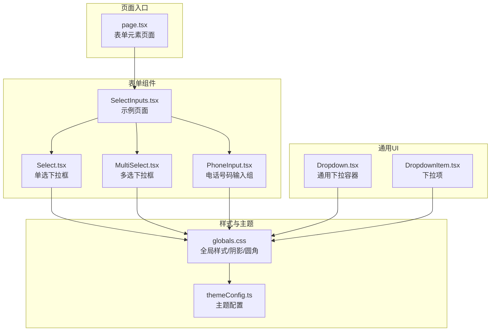
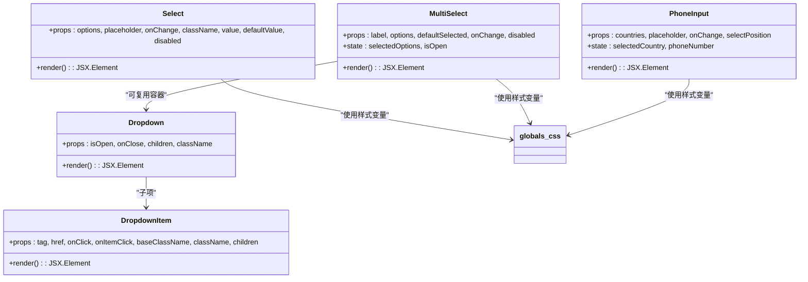
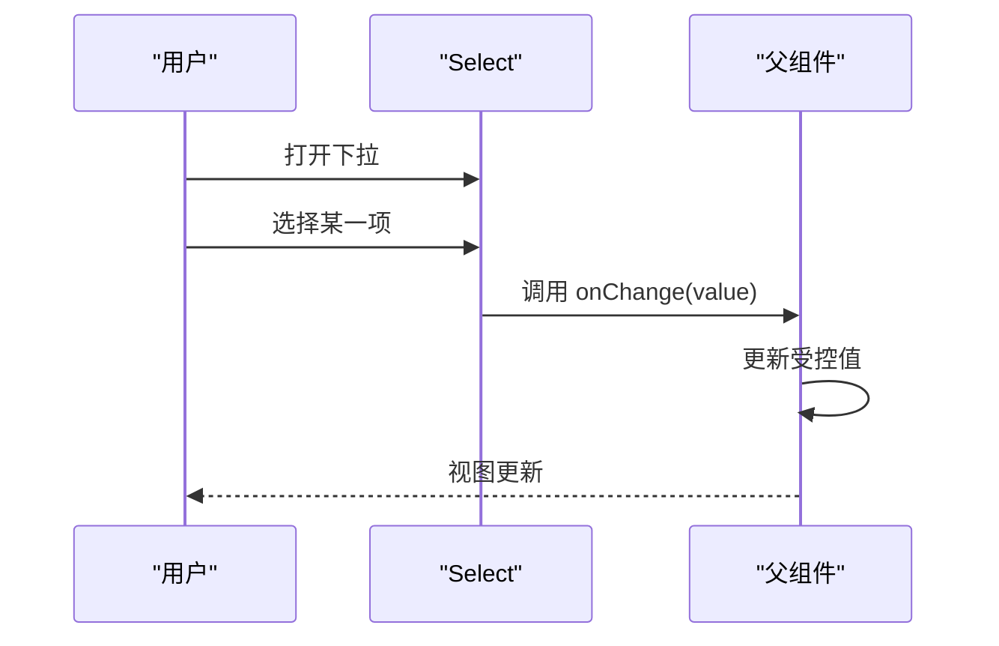
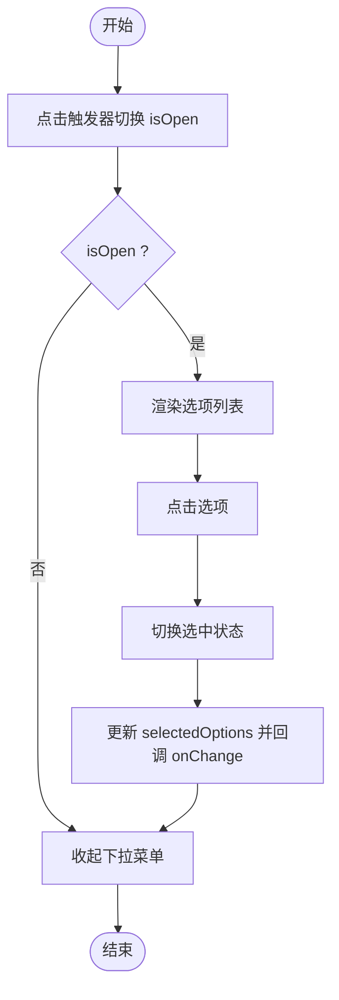
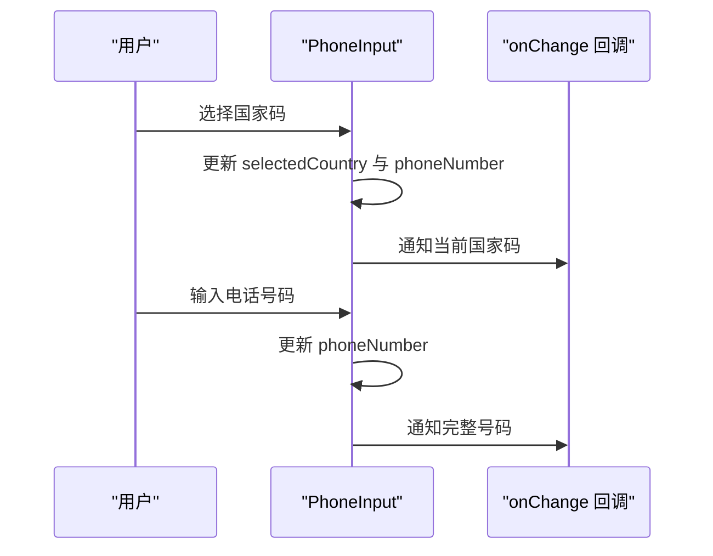
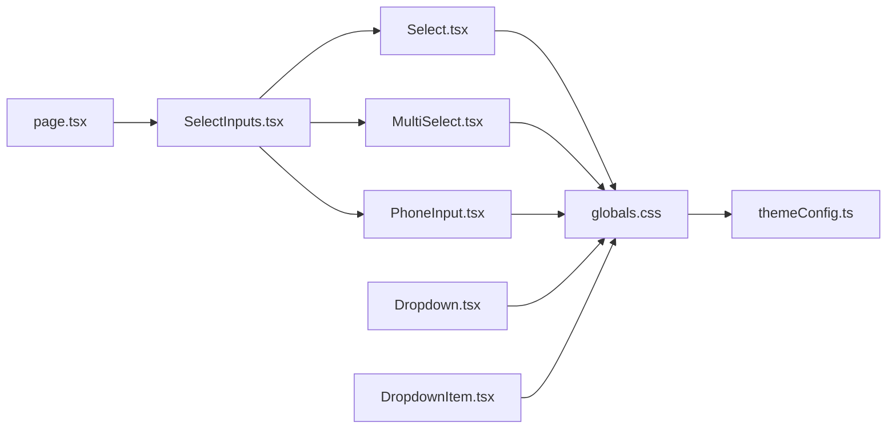

# 选择下拉组件

<cite>
**本文档引用的文件**
- [Select.tsx](file://src/components/form/Select.tsx)
- [MultiSelect.tsx](file://src/components/form/MultiSelect.tsx)
- [PhoneInput.tsx](file://src/components/form/group-input/PhoneInput.tsx)
- [SelectInputs.tsx](file://src/components/form/form-elements/SelectInputs.tsx)
- [Dropdown.tsx](file://src/components/ui/dropdown/Dropdown.tsx)
- [DropdownItem.tsx](file://src/components/ui/dropdown/DropdownItem.tsx)
- [globals.css](file://src/app/globals.css)
- [themeConfig.ts](file://src/config/themeConfig.ts)
- [page.tsx](file://src/app/(admin)/(others-pages)/(forms)/form-elements/page.tsx)
</cite>

## 目录
1. [简介](#简介)
2. [项目结构](#项目结构)
3. [核心组件](#核心组件)
4. [架构总览](#架构总览)
5. [详细组件分析](#详细组件分析)
6. [依赖关系分析](#依赖关系分析)
7. [性能考虑](#性能考虑)
8. [故障排除指南](#故障排除指南)
9. [结论](#结论)
10. [附录](#附录)

## 简介
本文件面向需要实现复杂选择交互的开发者，系统性梳理并解读仓库中的选择下拉组件体系，包括：
- 单选下拉框（Select）
- 多选下拉框（MultiSelect）
- 电话号码输入组（PhoneInput）

重点覆盖以下方面：选项数据结构、搜索过滤能力现状与扩展建议、键盘导航支持现状与增强方案、虚拟滚动优化建议、下拉菜单定位策略、动画与过渡效果、响应式适配、数据绑定模式、异步加载处理、自定义渲染选项、国际化支持等。

## 项目结构
该组件库采用按功能域分层的组织方式，表单相关组件集中在 src/components/form 下，通用 UI 组件位于 src/components/ui，全局样式与主题配置在 src/app/globals.css 和 src/config/themeConfig.ts 中。

图表来源
- [Select.tsx:1-65](file://src/components/form/Select.tsx#L1-L65)
- [MultiSelect.tsx:1-167](file://src/components/form/MultiSelect.tsx#L1-L167)
- [PhoneInput.tsx:1-142](file://src/components/form/group-input/PhoneInput.tsx#L1-L142)
- [SelectInputs.tsx:1-62](file://src/components/form/form-elements/SelectInputs.tsx#L1-L62)
- [Dropdown.tsx:1-49](file://src/components/ui/dropdown/Dropdown.tsx#L1-L49)
- [DropdownItem.tsx:1-47](file://src/components/ui/dropdown/DropdownItem.tsx#L1-L47)
- [globals.css:1-200](file://src/app/globals.css#L1-L200)
- [themeConfig.ts:1-31](file://src/config/themeConfig.ts#L1-L31)
- [page.tsx](file://src/app/(admin)/(others-pages)/(forms)/form-elements/page.tsx#L1-L44)

章节来源
- [page.tsx](file://src/app/(admin)/(others-pages)/(forms)/form-elements/page.tsx#L1-L44)

## 核心组件
本节对三个核心组件进行概览式分析，明确职责边界与接口设计。

- 单选下拉框（Select）
  - 职责：基于原生 select 的封装，提供占位符、禁用态、受控/非受控值绑定、样式主题化。
  - 关键属性：options（Option[]）、placeholder、onChange、className、value/defaultValue、disabled。
  - 数据结构：Option 接口包含 value 与 label 字段。

- 多选下拉框（MultiSelect）
  - 职责：提供多选项标签展示与交互，支持展开/收起、选择/取消选择、移除已选项、默认选中。
  - 关键属性：label、options（Option[]，含 value/text/selected）、defaultSelected、onChange、disabled。
  - 数据结构：Option 接口包含 value、text、selected 三字段；内部维护 selectedOptions 数组。

- 电话号码输入组（PhoneInput）
  - 职责：组合国家码下拉与电话号码输入，支持国家码位置（start/end）切换、回调通知。
  - 关键属性：countries（CountryCode[]）、placeholder、onChange、selectPosition。
  - 数据结构：CountryCode 包含 code 与 label；内部维护 selectedCountry 与 phoneNumber。

章节来源
- [Select.tsx:1-65](file://src/components/form/Select.tsx#L1-L65)
- [MultiSelect.tsx:1-167](file://src/components/form/MultiSelect.tsx#L1-L167)
- [PhoneInput.tsx:1-142](file://src/components/form/group-input/PhoneInput.tsx#L1-L142)

## 架构总览
下图展示了组件间的关系与调用链路，以及与通用 UI 容器的协作。

图表来源
- [Select.tsx:1-65](file://src/components/form/Select.tsx#L1-L65)
- [MultiSelect.tsx:1-167](file://src/components/form/MultiSelect.tsx#L1-L167)
- [PhoneInput.tsx:1-142](file://src/components/form/group-input/PhoneInput.tsx#L1-L142)
- [Dropdown.tsx:1-49](file://src/components/ui/dropdown/Dropdown.tsx#L1-L49)
- [DropdownItem.tsx:1-47](file://src/components/ui/dropdown/DropdownItem.tsx#L1-L47)
- [globals.css:1-200](file://src/app/globals.css#L1-L200)

## 详细组件分析

### 单选下拉框 Select
- 设计要点
  - 基于原生 select 元素，通过 className 注入主题化样式与焦点环。
  - 支持受控/非受控值，占位符作为第一个不可选选项。
  - 提供禁用态与暗色主题适配。
- 数据结构
  - Option 接口：value（字符串）、label（字符串）。
- 事件与状态
  - onChange 回调仅传递选中值字符串。
- 可扩展点
  - 搜索过滤：当前未内置搜索，可在上层包装或替换为自定义下拉实现以支持本地/远程搜索。
  - 键盘导航：原生 select 的键盘行为受限，如需增强可引入自定义键盘控制。
  - 虚拟滚动：原生 select 不支持虚拟滚动，建议在自定义实现中引入。
  - 动画与过渡：可通过外部容器或 CSS 过渡类实现开合动画。
  - 国际化：placeholder 与选项文本应从 i18n 源读取。

图表来源
- [Select.tsx:18-41](file://src/components/form/Select.tsx#L18-L41)

章节来源
- [Select.tsx:1-65](file://src/components/form/Select.tsx#L1-L65)

### 多选下拉框 MultiSelect
- 设计要点
  - 自绘下拉菜单，支持标签化显示已选项与移除按钮。
  - 展开/收起状态由 isOpen 控制；点击外部区域自动关闭。
  - 内部维护 selectedOptions 数组并通过 onChange 通知父组件。
- 数据结构
  - Option 接口：value（字符串）、text（显示文本）、selected（初始选中标记）。
- 交互流程
  - 切换 isOpen
  - 点击选项切换选中状态
  - 点击标签上的“×”移除对应选项
- 可扩展点
  - 搜索过滤：在下拉列表中增加输入框，过滤 text 后渲染。
  - 键盘导航：支持上下箭头移动高亮、空格/回车确认、Esc 关闭。
  - 虚拟滚动：当选项数量较多时，使用虚拟列表提升性能。
  - 动画与过渡：结合 CSS 过渡类实现展开/收起动画。
  - 国际化：所有文案（占位符、标签文本）应来自 i18n。

图表来源
- [MultiSelect.tsx:24-46](file://src/components/form/MultiSelect.tsx#L24-L46)
- [MultiSelect.tsx:131-159](file://src/components/form/MultiSelect.tsx#L131-L159)

章节来源
- [MultiSelect.tsx:1-167](file://src/components/form/MultiSelect.tsx#L1-L167)

### 电话号码输入组 PhoneInput
- 设计要点
  - 将国家码下拉与电话号码输入组合为一个输入组，支持 start/end 两种布局。
  - 通过 countries 映射生成国家码选项，onChange 回调返回当前国家码或完整号码。
- 数据结构
  - CountryCode 接口：code（国家码标识）、label（显示名称）。
- 使用场景
  - 表单中需要统一管理国家码与号码输入的场景。
- 可扩展点
  - 搜索过滤：在国家码下拉中加入搜索框。
  - 键盘导航：支持在下拉中使用方向键与回车。
  - 虚拟滚动：国家码列表较长时可引入虚拟滚动。
  - 动画与过渡：输入框获得焦点时的过渡效果。
  - 国际化：国家码与占位符应来自 i18n。

图表来源
- [PhoneInput.tsx:16-45](file://src/components/form/group-input/PhoneInput.tsx#L16-L45)

章节来源
- [PhoneInput.tsx:1-142](file://src/components/form/group-input/PhoneInput.tsx#L1-L142)

### 示例页面 SelectInputs
- 作用：演示 Select 与 MultiSelect 的基本用法与样式集成。
- 关键点：Select 外围包裹相对定位容器并叠加右侧下拉图标；MultiSelect 提供默认选中值并通过 onChange 更新父级状态。

章节来源
- [SelectInputs.tsx:1-62](file://src/components/form/form-elements/SelectInputs.tsx#L1-L62)

## 依赖关系分析
- 组件依赖
  - Select/MultiSelect/PhoneInput 均依赖全局样式变量（阴影、圆角、品牌色、暗色主题）。
  - MultiSelect 可与通用 Dropdown 组件配合，但当前实现为自绘下拉。
- 主题配置
  - themeConfig.ts 提供品牌色与圆角等主题常量，Select/MultiSelect/PhoneInput 的样式直接使用 CSS 变量。
- 页面集成
  - page.tsx 将 SelectInputs 页面作为表单元素示例页之一，集中展示多种表单组件。

图表来源
- [Select.tsx:1-65](file://src/components/form/Select.tsx#L1-L65)
- [MultiSelect.tsx:1-167](file://src/components/form/MultiSelect.tsx#L1-L167)
- [PhoneInput.tsx:1-142](file://src/components/form/group-input/PhoneInput.tsx#L1-L142)
- [Dropdown.tsx:1-49](file://src/components/ui/dropdown/Dropdown.tsx#L1-L49)
- [DropdownItem.tsx:1-47](file://src/components/ui/dropdown/DropdownItem.tsx#L1-L47)
- [globals.css:1-200](file://src/app/globals.css#L1-L200)
- [themeConfig.ts:1-31](file://src/config/themeConfig.ts#L1-L31)
- [page.tsx](file://src/app/(admin)/(others-pages)/(forms)/form-elements/page.tsx#L1-L44)
- [SelectInputs.tsx:1-62](file://src/components/form/form-elements/SelectInputs.tsx#L1-L62)

章节来源
- [globals.css:1-200](file://src/app/globals.css#L1-L200)
- [themeConfig.ts:1-31](file://src/config/themeConfig.ts#L1-L31)

## 性能考虑
- 当前实现
  - Select 为原生 select，性能优异但交互与样式受限。
  - MultiSelect 与 PhoneInput 为自绘下拉，具备更强的交互能力，但 DOM 结构更复杂。
- 优化建议
  - 大列表场景：为 MultiSelect/PhoneInput 的下拉列表引入虚拟滚动（例如 react-window 或 react-virtualized），减少 DOM 节点数量。
  - 异步加载：在远程搜索或懒加载场景中，使用防抖与缓存策略，避免频繁请求。
  - 渲染优化：对选项列表使用 React.memo 或 key 合理设置，降低重渲染成本。
  - 动画性能：CSS 过渡与 transform 动画优于布局变更，确保流畅体验。

## 故障排除指南
- 问题：点击外部区域无法关闭下拉
  - 检查 MultiSelect 的点击外部关闭逻辑是否正确绑定到 document。
  - 确认事件监听器在组件卸载时被清理。
- 问题：键盘导航无效
  - Select 为原生元素，键盘行为由浏览器决定；如需自定义键盘控制，应替换为自定义实现。
  - MultiSelect/PhoneInput 需要自行实现键盘事件处理（上下箭头、回车、Esc）。
- 问题：样式不生效或主题不一致
  - 确认 globals.css 中的 CSS 变量与 themeConfig.ts 的主题常量一致。
  - 检查暗色主题类名是否正确应用。
- 问题：虚拟滚动卡顿
  - 确保虚拟滚动组件的 itemSize/height 计算准确，避免频繁重算。
  - 对列表项进行必要的 memo 化处理。

章节来源
- [MultiSelect.tsx:20-35](file://src/components/form/MultiSelect.tsx#L20-L35)
- [Dropdown.tsx:20-35](file://src/components/ui/dropdown/Dropdown.tsx#L20-L35)
- [globals.css:1-200](file://src/app/globals.css#L1-L200)
- [themeConfig.ts:1-31](file://src/config/themeConfig.ts#L1-L31)

## 结论
本组件库提供了简洁而实用的选择下拉组件集合，满足常见的单选、多选与电话号码输入需求。对于更复杂的交互（搜索过滤、键盘导航、虚拟滚动）与更高定制度（动画、国际化），建议在现有基础上进行扩展或引入成熟的第三方库（如 react-select、downshift 等）。通过合理的数据结构、事件模型与主题集成，这些组件可以无缝融入各类业务场景。

## 附录

### 数据绑定模式
- 受控模式：通过 value/defaultValue 与 onChange 实现双向绑定。
- 非受控模式：仅使用 defaultValue 初始化，后续由组件内部状态驱动。
- 多选场景：onChange 返回选中值数组，父组件负责更新状态。

章节来源
- [Select.tsx:18-29](file://src/components/form/Select.tsx#L18-L29)
- [MultiSelect.tsx:24-40](file://src/components/form/MultiSelect.tsx#L24-L40)
- [PhoneInput.tsx:30-45](file://src/components/form/group-input/PhoneInput.tsx#L30-L45)

### 异步加载处理
- 建议在上层组件中实现防抖搜索与分页加载，将结果注入到 options 或自定义下拉的选项列表中。
- 对于 PhoneInput 的国家码列表，可先加载常用国家，再按需加载剩余国家。

### 自定义渲染选项
- MultiSelect/PhoneInput 的下拉列表可扩展为支持自定义选项渲染（如图标、描述、分组）。
- 通过传入渲染函数或自定义 Item 组件实现。

### 国际化支持
- 将 placeholder、选项文本、按钮文案等静态文本统一接入 i18n 源。
- 保持语言切换时组件文案同步更新。