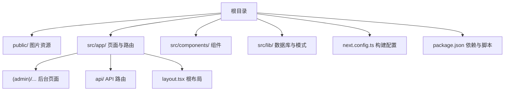
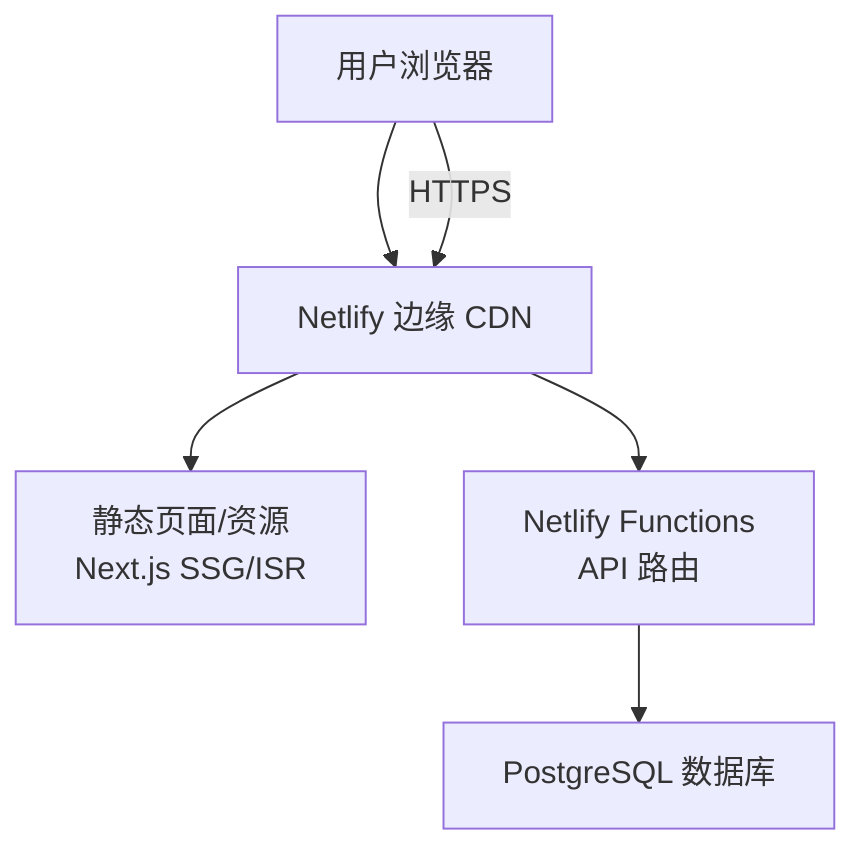
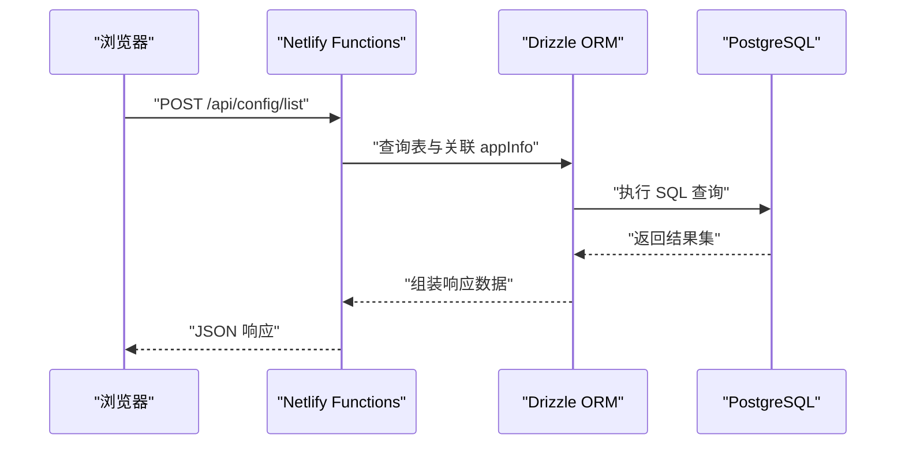
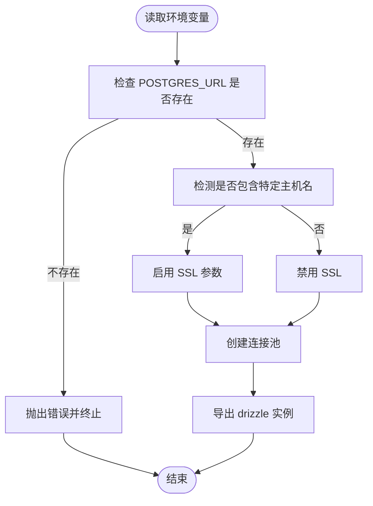
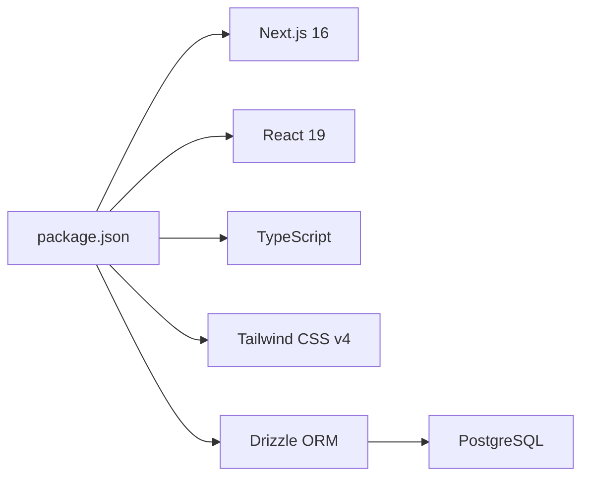

# Netlify 部署

<cite>
**本文引用的文件**
- [package.json](file://package.json)
- [next.config.ts](file://next.config.ts)
- [src/app/layout.tsx](file://src/app/layout.tsx)
- [src/app/api/config/list/route.ts](file://src/app/api/config/list/route.ts)
- [src/lib/db.ts](file://src/lib/db.ts)
- [src/lib/schema.ts](file://src/lib/schema.ts)
- [src/lib/table/schema.ts](file://src/lib/table/schema.ts)
- [README.md](file://README.md)
</cite>

## 目录
1. [简介](#简介)
2. [项目结构](#项目结构)
3. [核心组件](#核心组件)
4. [架构总览](#架构总览)
5. [详细组件分析](#详细组件分析)
6. [依赖分析](#依赖分析)
7. [性能考虑](#性能考虑)
8. [故障排查指南](#故障排查指南)
9. [结论](#结论)
10. [附录](#附录)

## 简介
本指南面向希望将基于 Next.js App Router 的管理后台应用部署到 Netlify 的开发者，覆盖从站点创建、构建配置、环境变量设置，到域名绑定与 HTTPS、Git 集成与自动部署（含分支部署与预览）、部署验证、性能优化与错误调试，以及与 Netlify Functions 结合的 API 部署方案。文档同时结合本仓库的实际代码结构，给出可操作的步骤与注意事项。

## 项目结构
该仓库为 Next.js 16 应用，采用 App Router 目录结构，前端页面位于 src/app 下，API 路由位于 src/app/api，数据库访问通过 Drizzle ORM 连接 PostgreSQL。整体结构清晰，适合在 Netlify 上进行静态站点生成（SSG）或混合部署（静态 + 函数）。

图表来源
- [src/app/layout.tsx:1-33](file://src/app/layout.tsx#L1-L33)
- [next.config.ts:1-25](file://next.config.ts#L1-L25)
- [package.json:1-79](file://package.json#L1-L79)

章节来源
- [README.md:1-201](file://README.md#L1-L201)
- [package.json:1-79](file://package.json#L1-L79)
- [next.config.ts:1-25](file://next.config.ts#L1-L25)
- [src/app/layout.tsx:1-33](file://src/app/layout.tsx#L1-L33)

## 核心组件
- 构建与运行脚本：通过 package.json 中的 scripts 字段定义开发、构建、启动等命令，适用于 Netlify 的构建流程。
- 根布局与字体：src/app/layout.tsx 提供全局样式与主题上下文，确保页面渲染一致性。
- API 路由：src/app/api/config/list/route.ts 展示了标准的 Next.js API 路由写法，可用于与 Netlify Functions 集成。
- 数据库访问：src/lib/db.ts 通过环境变量连接 PostgreSQL；src/lib/schema.ts 与 src/lib/table/schema.ts 定义数据模型，用于 API 路由中读取数据。

章节来源
- [package.json:5-14](file://package.json#L5-L14)
- [src/app/layout.tsx:1-33](file://src/app/layout.tsx#L1-L33)
- [src/app/api/config/list/route.ts:1-77](file://src/app/api/config/list/route.ts#L1-L77)
- [src/lib/db.ts:1-19](file://src/lib/db.ts#L1-L19)
- [src/lib/schema.ts:1-24](file://src/lib/schema.ts#L1-L24)
- [src/lib/table/schema.ts:1-26](file://src/lib/table/schema.ts#L1-L26)

## 架构总览
下图展示了 Netlify 部署时的典型交互：浏览器请求静态页面或 API；静态内容由 CDN 分发；API 请求可由 Netlify Functions 承载，或在混合部署中走自定义后端。

图表来源
- [src/app/api/config/list/route.ts:1-77](file://src/app/api/config/list/route.ts#L1-L77)
- [src/lib/db.ts:1-19](file://src/lib/db.ts#L1-L19)

## 详细组件分析

### 静态站点生成与 ISR
- 本项目使用 Next.js App Router，支持 SSG/ISR。在 Netlify 上可直接构建并上传静态产物，以获得更快的加载速度与全球 CDN 加速。
- 建议对不常变动的数据采用 SSG 或增量静态再生（ISR），对实时数据采用客户端请求或边缘函数。

章节来源
- [README.md:9-18](file://README.md#L9-L18)

### API 路由与 Netlify Functions 集成
- API 路由位于 src/app/api，遵循 Next.js 规范。在 Netlify 上可将其映射为 Functions，实现无服务器 API。
- 数据库连接通过环境变量 POSTGRES_URL 实现，需在 Netlify 环境中配置。

图表来源
- [src/app/api/config/list/route.ts:1-77](file://src/app/api/config/list/route.ts#L1-L77)
- [src/lib/db.ts:1-19](file://src/lib/db.ts#L1-L19)
- [src/lib/schema.ts:1-24](file://src/lib/schema.ts#L1-L24)
- [src/lib/table/schema.ts:1-26](file://src/lib/table/schema.ts#L1-L26)

章节来源
- [src/app/api/config/list/route.ts:1-77](file://src/app/api/config/list/route.ts#L1-L77)
- [src/lib/db.ts:1-19](file://src/lib/db.ts#L1-L19)
- [src/lib/schema.ts:1-24](file://src/lib/schema.ts#L1-L24)
- [src/lib/table/schema.ts:1-26](file://src/lib/table/schema.ts#L1-L26)

### 数据库连接与环境变量
- 数据库连接通过环境变量 POSTGRES_URL 初始化连接池；若连接字符串包含特定标识，会自动启用 SSL。
- 在 Netlify 上部署时，需在构建环境或 Functions 环境中配置该变量。

图表来源
- [src/lib/db.ts:1-19](file://src/lib/db.ts#L1-L19)

章节来源
- [src/lib/db.ts:1-19](file://src/lib/db.ts#L1-L19)

### 根布局与全局样式
- 根布局负责注入字体、主题上下文与全局样式，保证页面渲染一致性和主题切换能力。
- 在 Netlify 上部署时，确保字体与样式资源可被正确打包与缓存。

章节来源
- [src/app/layout.tsx:1-33](file://src/app/layout.tsx#L1-L33)

## 依赖分析
- 项目依赖 Next.js 16、React 19、TypeScript、Tailwind CSS v4，以及 Drizzle ORM 与 PostgreSQL。
- 构建脚本通过 package.json 定义，适合在 Netlify 的构建环境中执行。

图表来源
- [package.json:15-49](file://package.json#L15-L49)
- [src/lib/db.ts:1-19](file://src/lib/db.ts#L1-L19)

章节来源
- [package.json:15-49](file://package.json#L15-L49)
- [src/lib/db.ts:1-19](file://src/lib/db.ts#L1-L19)

## 性能考虑
- 利用 Next.js 的静态生成与 ISR，减少服务器压力，提升首屏性能。
- 将字体与样式资源纳入构建流程，避免运行时额外请求。
- 对 API 路由进行合理的缓存策略与错误降级，避免冷启动延迟影响用户体验。
- 在 Netlify 上开启压缩与缓存头，充分利用边缘节点加速。

## 故障排查指南
- 构建失败：检查 package.json 中的构建脚本与依赖安装是否成功；确认 Node 版本满足要求。
- API 500：检查 API 路由中的异常处理逻辑与数据库连接参数；查看 Netlify 日志定位具体错误。
- 数据库连接失败：确认 POSTGRES_URL 环境变量已正确配置；如使用特定托管服务，确保 SSL 设置正确。
- 预览失败：检查分支部署规则与构建命令；确保 API 路由在 Functions 中可用。

章节来源
- [src/app/api/config/list/route.ts:67-76](file://src/app/api/config/list/route.ts#L67-L76)
- [src/lib/db.ts:7-9](file://src/lib/db.ts#L7-L9)

## 结论
本项目具备良好的 Next.js 16 App Router 结构与清晰的 API/数据层设计，适合在 Netlify 上进行静态站点生成与 Functions 混合部署。通过合理配置环境变量、利用 ISR 与 CDN 加速、完善日志与监控，可获得稳定、高性能的线上体验。

## 附录

### Netlify 部署步骤概览
- 在 Netlify 上创建站点并连接 Git 仓库，选择构建命令与发布目录（Next.js 默认输出目录为 .next）。
- 配置环境变量：如 POSTGRES_URL 等数据库相关变量。
- 开启自动部署：可按分支进行部署与预览，便于团队协作与测试。
- 自定义域名与 HTTPS：在站点设置中添加域名并启用自动证书。
- 验证部署：访问站点首页与 API 接口，确认静态资源与接口均正常。

### netlify.toml 配置要点（概念性说明）
- 命令与发布目录：指定构建命令与输出目录，确保与 Next.js 的构建产物一致。
- 环境变量：在 [build.environment] 中设置运行时所需变量。
- 重写与代理：根据需要配置静态资源重写与 API 代理规则。
- 缓存策略：为静态资源设置合适的缓存头，提升加载速度。

### 与 Netlify Functions 结合的 API 部署
- 将 Next.js API 路由迁移至 Netlify Functions 目录结构，保持相同路径与方法。
- 在 Functions 中复用现有数据库连接与查询逻辑，确保环境变量一致。
- 对外暴露 API 时，注意跨域与鉴权策略，必要时在 Netlify 上配置 Functions 的安全头。