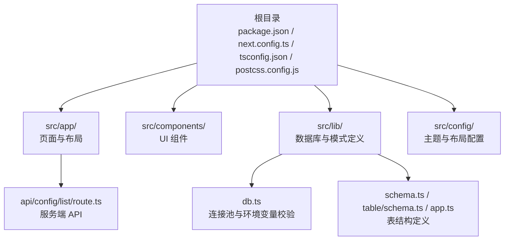
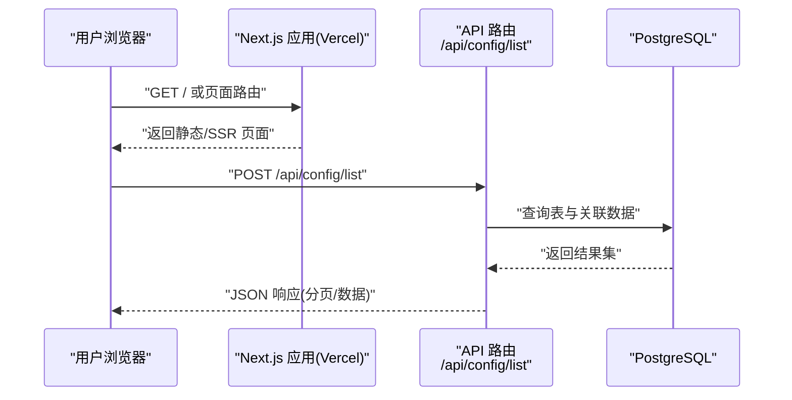
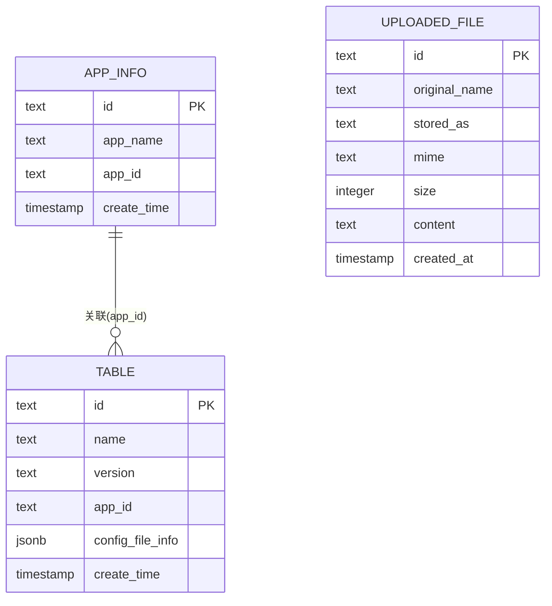
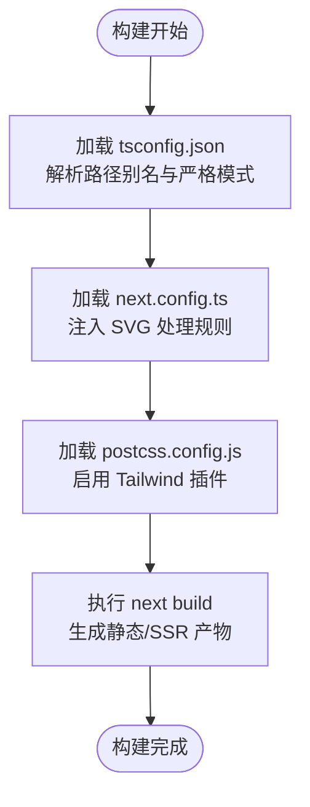
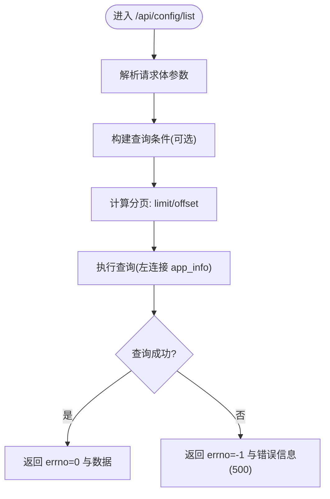
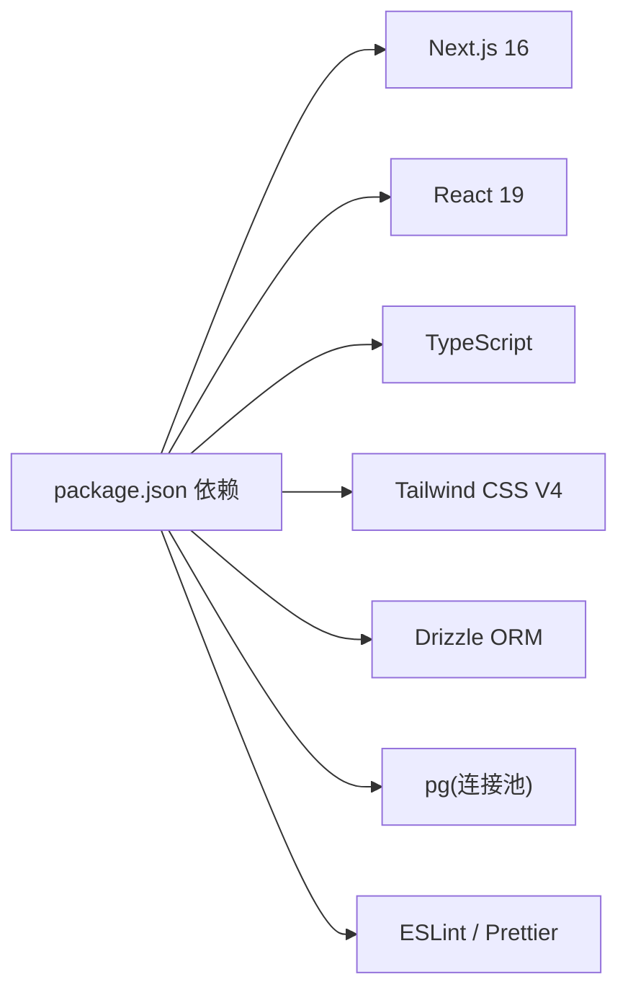

# Vercel 部署

<cite>
**本文引用的文件**
- [package.json](file://package.json)
- [next.config.ts](file://next.config.ts)
- [tsconfig.json](file://tsconfig.json)
- [postcss.config.js](file://postcss.config.js)
- [.gitignore](file://.gitignore)
- [README.md](file://README.md)
- [src/lib/db.ts](file://src/lib/db.ts)
- [src/lib/schema.ts](file://src/lib/schema.ts)
- [src/lib/table/schema.ts](file://src/lib/table/schema.ts)
- [src/lib/app.ts](file://src/lib/app.ts)
- [src/app/api/config/list/route.ts](file://src/app/api/config/list/route.ts)
- [src/app/layout.tsx](file://src/app/layout.tsx)
</cite>

## 目录
1. [简介](#简介)
2. [项目结构](#项目结构)
3. [核心组件](#核心组件)
4. [架构总览](#架构总览)
5. [详细组件分析](#详细组件分析)
6. [依赖关系分析](#依赖关系分析)
7. [性能考虑](#性能考虑)
8. [故障排查指南](#故障排查指南)
9. [结论](#结论)
10. [附录](#附录)

## 简介
本指南面向希望将基于 Next.js 的管理后台项目部署到 Vercel 的工程师与运维人员。内容覆盖从项目初始化、环境变量配置、构建设置，到 vercel.json 配置、域名绑定与 SSL 自动配置、CI/CD 集成（Git 连接与自动部署）、部署后的性能监控与日志查看、错误排查以及常见问题与最佳实践。

本项目为 Next.js 16 应用，采用 App Router、TypeScript、Tailwind CSS，并集成 Drizzle ORM 访问 PostgreSQL 数据库。部署时需关注数据库连接、静态资源处理、API 路由与构建产物等关键点。

## 项目结构
该仓库为标准 Next.js 16 App Router 结构，核心目录与文件如下：
- 根目录包含构建脚本、依赖声明、样式与工具链配置
- 源代码位于 src/，页面与 API 路由按功能分层组织
- 数据库访问通过 Drizzle ORM 与 PostgreSQL 连接池实现
- 构建与运行脚本遵循 Next.js 默认约定

图表来源
- [package.json:1-79](file://package.json#L1-L79)
- [next.config.ts:1-25](file://next.config.ts#L1-L25)
- [tsconfig.json:1-42](file://tsconfig.json#L1-L42)
- [postcss.config.js:1-6](file://postcss.config.js#L1-L6)
- [src/lib/db.ts:1-19](file://src/lib/db.ts#L1-L19)
- [src/lib/schema.ts:1-24](file://src/lib/schema.ts#L1-L24)
- [src/lib/table/schema.ts:1-26](file://src/lib/table/schema.ts#L1-L26)
- [src/lib/app.ts:1-9](file://src/lib/app.ts#L1-L9)
- [src/app/api/config/list/route.ts:1-77](file://src/app/api/config/list/route.ts#L1-L77)

章节来源
- [package.json:1-79](file://package.json#L1-L79)
- [next.config.ts:1-25](file://next.config.ts#L1-L25)
- [tsconfig.json:1-42](file://tsconfig.json#L1-L42)
- [postcss.config.js:1-6](file://postcss.config.js#L1-L6)
- [README.md:1-201](file://README.md#L1-L201)

## 核心组件
- 构建与运行脚本：通过 package.json 中的 scripts 字段定义开发、构建、启动与数据库迁移命令
- Next.js 配置：在 next.config.ts 中扩展 Webpack 处理 SVG、启用 Turbopack 规则
- 类型与路径别名：tsconfig.json 设置严格类型检查与路径别名 @/*
- PostCSS 与 Tailwind：postcss.config.js 引入 Tailwind 插件
- 数据库连接：src/lib/db.ts 读取环境变量并创建连接池，对特定托管（如 neon.tech）自动启用 SSL
- API 路由：src/app/api/config/list/route.ts 提供分页查询接口，使用 Drizzle ORM 查询 PostgreSQL
- 布局与全局样式：src/app/layout.tsx 注入字体、主题与全局样式

章节来源
- [package.json:5-14](file://package.json#L5-L14)
- [next.config.ts:3-22](file://next.config.ts#L3-L22)
- [tsconfig.json:20-30](file://tsconfig.json#L20-L30)
- [postcss.config.js:1-6](file://postcss.config.js#L1-L6)
- [src/lib/db.ts:1-19](file://src/lib/db.ts#L1-L19)
- [src/app/api/config/list/route.ts:1-77](file://src/app/api/config/list/route.ts#L1-L77)
- [src/app/layout.tsx:1-33](file://src/app/layout.tsx#L1-L33)

## 架构总览
下图展示从浏览器请求到数据库查询的整体流程，涵盖静态构建、API 路由与数据库访问：

图表来源
- [src/app/api/config/list/route.ts:7-77](file://src/app/api/config/list/route.ts#L7-L77)
- [src/lib/db.ts:1-19](file://src/lib/db.ts#L1-L19)
- [src/lib/table/schema.ts:15-25](file://src/lib/table/schema.ts#L15-L25)
- [src/lib/app.ts:3-8](file://src/lib/app.ts#L3-L8)

## 详细组件分析

### 数据库连接与 Drizzle ORM
- 连接池与 SSL：根据连接字符串是否包含特定托管标识自动启用 SSL；未设置连接字符串时抛出错误
- 表结构：包含上传文件表与主配置表，主表通过 JSONB 存储文件元信息，支持与 app_info 关联查询
- API 查询：支持多条件过滤、分页与排序，返回统一结构

图表来源
- [src/lib/table/schema.ts:3-25](file://src/lib/table/schema.ts#L3-L25)
- [src/lib/app.ts:3-8](file://src/lib/app.ts#L3-L8)

章节来源
- [src/lib/db.ts:1-19](file://src/lib/db.ts#L1-L19)
- [src/lib/schema.ts:1-24](file://src/lib/schema.ts#L1-L24)
- [src/lib/table/schema.ts:1-26](file://src/lib/table/schema.ts#L1-L26)
- [src/lib/app.ts:1-9](file://src/lib/app.ts#L1-L9)
- [src/app/api/config/list/route.ts:1-77](file://src/app/api/config/list/route.ts#L1-L77)

### Next.js 构建与静态资源
- SVG 处理：通过 Webpack 规则与 Turbopack 规则加载 @svgr/webpack，确保 SVG 作为组件导入
- 路径别名：tsconfig.json 中配置 @/* 映射到 src/*，便于模块导入
- PostCSS：postcss.config.js 引入 Tailwind 插件，保证样式构建链路

图表来源
- [tsconfig.json:20-30](file://tsconfig.json#L20-L30)
- [next.config.ts:5-20](file://next.config.ts#L5-L20)
- [postcss.config.js:1-6](file://postcss.config.js#L1-L6)

章节来源
- [next.config.ts:1-25](file://next.config.ts#L1-L25)
- [tsconfig.json:1-42](file://tsconfig.json#L1-L42)
- [postcss.config.js:1-6](file://postcss.config.js#L1-L6)

### API 路由与分页查询
- 请求体参数：name、appId、version 支持模糊/精确匹配；page、pageSize 控制分页
- 条件拼装：动态构造 where 条件，避免无效条件导致全表扫描
- 分页边界：限制每页最大条数与最小条数，计算偏移量
- 错误处理：捕获异常并返回统一错误结构，状态码 500

图表来源
- [src/app/api/config/list/route.ts:7-77](file://src/app/api/config/list/route.ts#L7-L77)

章节来源
- [src/app/api/config/list/route.ts:1-77](file://src/app/api/config/list/route.ts#L1-L77)

## 依赖关系分析
- 项目依赖 Next.js 16、React 19、TypeScript、Tailwind CSS V4
- Drizzle ORM 与 pg 连接池用于数据库访问
- 开发工具链包括 ESLint、Prettier、Tailwind CLI 等
- 构建产物与忽略项：.next、out、build、dist 等目录由 .gitignore 排除

图表来源
- [package.json:15-49](file://package.json#L15-L49)
- [.gitignore:13-19](file://.gitignore#L13-L19)

章节来源
- [package.json:1-79](file://package.json#L1-L79)
- [.gitignore:1-38](file://.gitignore#L1-L38)

## 性能考虑
- 全球 CDN：Vercel 默认提供全球边缘节点，静态资源与页面可就近分发
- 构建优化：启用严格类型与路径别名，减少运行时解析开销
- 数据库连接：合理设置连接池大小与超时，避免冷启动时的首次查询延迟
- API 分页：限制每页最大条数，避免一次性返回大量数据
- 图片与 SVG：SVG 作为组件引入，减少额外请求；图片资源建议使用现代格式与合适的尺寸

## 故障排查指南
- 构建失败
  - 检查环境变量是否正确设置（如数据库连接字符串）
  - 确认 tsconfig.json 的路径别名与模块解析策略
  - 查看 .gitignore 是否排除了必要的源文件
- 数据库连接错误
  - 确认 POSTGRES_URL 已在 Vercel 环境变量中配置
  - 若使用特定托管（如 neon.tech），确认 SSL 配置生效
- API 查询异常
  - 检查请求体参数是否符合预期（name、appId、version、page、pageSize）
  - 查看服务器日志中的错误堆栈，定位 Drizzle 查询或数据库连接问题
- 静态资源加载失败
  - 确认 SVG 处理规则已生效
  - 检查 Tailwind 插件是否正确加载

章节来源
- [src/lib/db.ts:6-9](file://src/lib/db.ts#L6-L9)
- [tsconfig.json:20-30](file://tsconfig.json#L20-L30)
- [.gitignore:29-34](file://.gitignore#L29-L34)
- [src/app/api/config/list/route.ts:67-76](file://src/app/api/config/list/route.ts#L67-L76)

## 结论
本项目具备良好的 Next.js 16 与 TypeScript 基础，配合 Drizzle ORM 与 PostgreSQL 可实现稳定的后端能力。结合 Vercel 的全球 CDN、Serverless 函数与自动化部署，可快速上线并获得优秀的性能与可靠性。部署时重点关注数据库连接、API 分页与构建配置，即可获得稳定高效的线上体验。

## 附录

### 项目初始化与本地验证
- 安装依赖与启动开发服务器
- 运行数据库迁移脚本（如需）
- 在本地访问页面与 API，确认数据库连接与分页查询正常

章节来源
- [package.json:5-14](file://package.json#L5-L14)
- [README.md:41-76](file://README.md#L41-L76)

### 环境变量配置
- 必填变量
  - POSTGRES_URL：数据库连接字符串
- 可选变量
  - NODE_ENV：生产环境建议设为 production
  - NEXT_PUBLIC_*：前端可访问的公开变量（如站点标题、分析开关）

章节来源
- [src/lib/db.ts:6-9](file://src/lib/db.ts#L6-L9)

### 构建设置与 vercel.json
- 构建命令：使用 Next.js 默认构建脚本
- 输出目录：默认 out（Next.js 构建输出）
- 环境变量：在 Vercel 项目设置中添加环境变量
- vercel.json 示例字段（说明性描述）
  - version：2
  - builds：指定构建器与命令
  - routes：自定义路由规则（如重写、跳转）
  - headers/redirects：HTTP 头部与重定向
  - git：保留/忽略分支策略
  - public：静态公开目录
  - framework：指定框架为 Next.js
  - 自定义构建钩子：如安装依赖、预处理等

章节来源
- [package.json:7-7](file://package.json#L7-L7)
- [next.config.ts:1-25](file://next.config.ts#L1-L25)

### 域名绑定与 SSL
- 在 Vercel 项目设置中添加自定义域名
- Vercel 将自动签发与续期 SSL 证书
- 如需强制 HTTPS，可在 vercel.json 中配置重定向或使用平台安全策略

### CI/CD 集成与自动部署
- Git 连接：将仓库推送到 GitHub/GitLab 等平台
- 自动部署：Vercel 监听仓库变更，自动拉取、构建与部署
- 分支策略：可配置仅主分支或特定分支触发部署
- 预览部署：为 Pull Request 创建独立预览环境

### 部署后监控与日志
- 性能监控：利用 Vercel 分析面板查看构建时间、冷启动与响应时间
- 日志查看：在项目设置中查看实时日志与错误日志
- 错误排查：结合 API 返回的 errno 与消息，定位业务逻辑与数据库问题

### 常见问题与最佳实践
- 常见问题
  - 构建失败：检查依赖安装与环境变量
  - 数据库连接失败：确认连接字符串与网络策略
  - API 报错：核对请求体参数与分页范围
- 最佳实践
  - 将敏感信息放入 Vercel 环境变量，不提交至仓库
  - 使用分页与条件过滤，避免大查询
  - 合理设置缓存与静态化策略
  - 定期更新依赖与 Next.js 版本