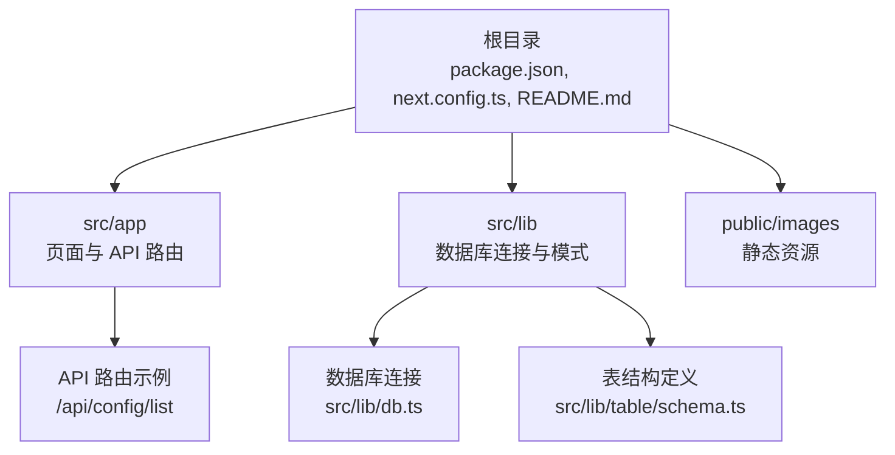
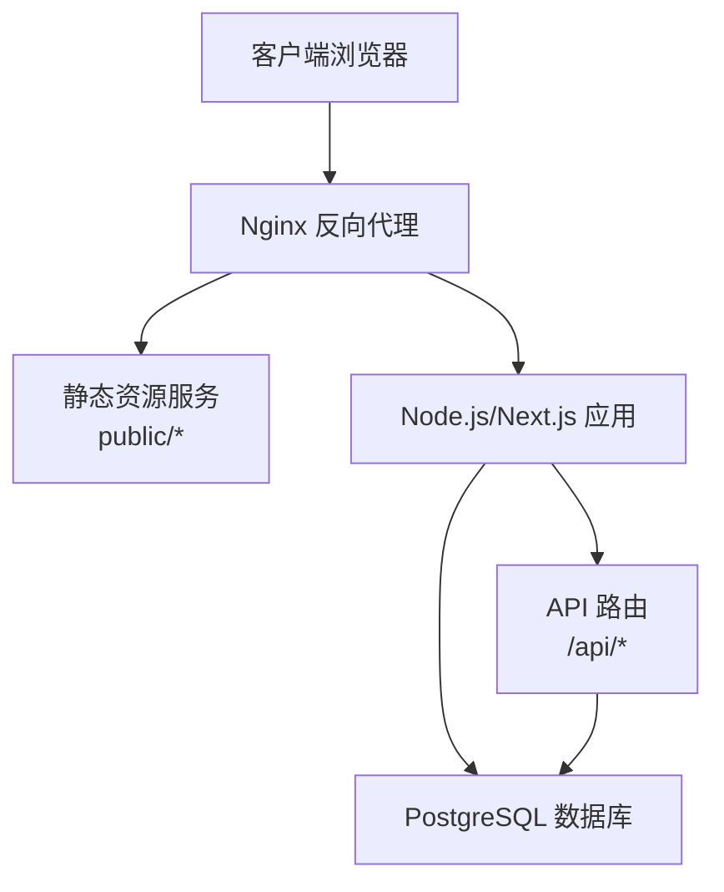
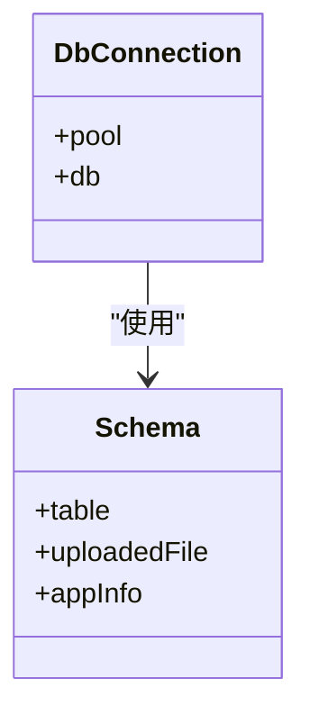
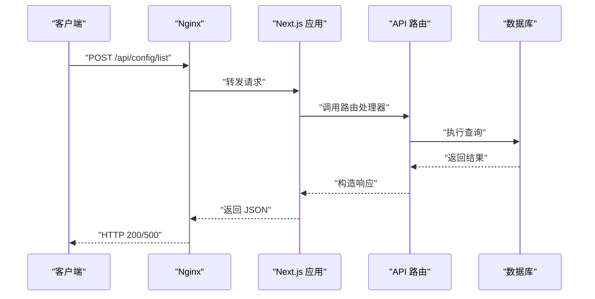
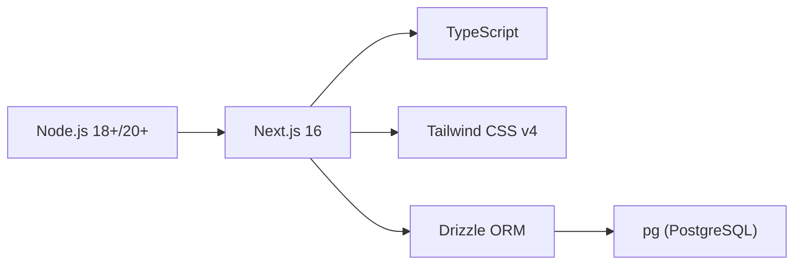

# 传统服务器部署

<cite>
**本文引用的文件**
- [package.json](file://package.json)
- [next.config.ts](file://next.config.ts)
- [README.md](file://README.md)
- [src/lib/db.ts](file://src/lib/db.ts)
- [src/lib/schema.ts](file://src/lib/schema.ts)
- [src/lib/table/schema.ts](file://src/lib/table/schema.ts)
- [src/app/api/config/list/route.ts](file://src/app/api/config/list/route.ts)
- [src/app/layout.tsx](file://src/app/layout.tsx)
</cite>

## 目录
1. [简介](#简介)
2. [项目结构](#项目结构)
3. [核心组件](#核心组件)
4. [架构总览](#架构总览)
5. [详细组件分析](#详细组件分析)
6. [依赖关系分析](#依赖关系分析)
7. [性能考量](#性能考量)
8. [故障排查指南](#故障排查指南)
9. [结论](#结论)
10. [附录](#附录)

## 简介
本指南面向在传统服务器（Nginx + Node.js）上部署基于 Next.js 的应用，涵盖从服务器环境准备、Node.js 版本与运行时要求、PM2 进程管理，到 Nginx 反向代理、静态资源服务与 API 路由转发的完整流程。同时提供生产构建、环境变量与数据库连接配置、负载均衡与 SSL 证书、防火墙设置、部署后监控与日志管理、备份策略，以及可选的 Docker 容器化与 Kubernetes 部署建议。

## 项目结构
该仓库为 Next.js 16 应用，采用 App Router 结构，包含前端页面、UI 组件、API 路由、数据库连接与 Drizzle ORM 模式定义。关键目录与文件如下：
- 根目录：构建脚本、依赖声明与 Next.js 配置
- src/app：页面与 API 路由
- src/lib：数据库连接与表结构定义
- public/images：静态资源

图表来源
- [package.json:1-79](file://package.json#L1-L79)
- [next.config.ts:1-25](file://next.config.ts#L1-L25)
- [src/app/api/config/list/route.ts:1-77](file://src/app/api/config/list/route.ts#L1-L77)
- [src/lib/db.ts:1-19](file://src/lib/db.ts#L1-L19)
- [src/lib/table/schema.ts:1-26](file://src/lib/table/schema.ts#L1-L26)

章节来源
- [package.json:1-79](file://package.json#L1-L79)
- [next.config.ts:1-25](file://next.config.ts#L1-L25)
- [README.md:41-76](file://README.md#L41-L76)

## 核心组件
- 构建与启动脚本：通过 scripts 字段定义开发、构建、启动等命令，便于在服务器上执行统一构建与启动流程。
- Next.js 配置：Webpack 与 Turbopack 规则用于 SVG 处理，确保静态资源正确打包。
- 数据库连接：使用 PostgreSQL 连接池与 Drizzle ORM，支持 Neon 技术的 SSL 特性。
- API 路由：示例 API 路由提供分页查询能力，返回标准结构数据，便于反向代理与缓存策略设计。
- 布局与主题：全局布局与主题上下文，确保页面渲染一致性。

章节来源
- [package.json:5-14](file://package.json#L5-L14)
- [next.config.ts:3-22](file://next.config.ts#L3-L22)
- [src/lib/db.ts:1-19](file://src/lib/db.ts#L1-L19)
- [src/app/api/config/list/route.ts:1-77](file://src/app/api/config/list/route.ts#L1-L77)
- [src/app/layout.tsx:16-32](file://src/app/layout.tsx#L16-L32)

## 架构总览
下图展示传统服务器部署的典型架构：客户端请求经 Nginx 反向代理至 Node.js/Next.js 应用；静态资源由 Nginx 直接服务；API 请求转发至应用；数据库通过连接池访问。

图表来源
- [src/app/api/config/list/route.ts:1-77](file://src/app/api/config/list/route.ts#L1-L77)
- [src/lib/db.ts:1-19](file://src/lib/db.ts#L1-L19)

## 详细组件分析

### 数据库连接与模式
- 连接池：使用 pg.Pool 建立连接池，自动根据 POSTGRES_URL 判断是否启用 SSL（例如针对特定托管服务）。
- Drizzle ORM：通过 schema 映射表结构，提供类型安全的查询接口。
- 环境变量：必须提供 POSTGRES_URL，否则启动时报错。

图表来源
- [src/lib/db.ts:1-19](file://src/lib/db.ts#L1-L19)
- [src/lib/schema.ts:1-24](file://src/lib/schema.ts#L1-L24)
- [src/lib/table/schema.ts:1-26](file://src/lib/table/schema.ts#L1-L26)

章节来源
- [src/lib/db.ts:1-19](file://src/lib/db.ts#L1-L19)
- [src/lib/schema.ts:15-24](file://src/lib/schema.ts#L15-L24)
- [src/lib/table/schema.ts:1-26](file://src/lib/table/schema.ts#L1-L26)

### API 路由与分页查询
- POST /api/config/list：接收分页参数与过滤条件，执行联表查询并返回结构化结果。
- 错误处理：捕获异常并返回统一错误格式，便于前端与日志系统识别。

图表来源
- [src/app/api/config/list/route.ts:7-77](file://src/app/api/config/list/route.ts#L7-L77)

章节来源
- [src/app/api/config/list/route.ts:1-77](file://src/app/api/config/list/route.ts#L1-L77)

### 构建与启动流程
- 开发：使用 next dev 启动热更新开发服务器。
- 生产构建：使用 next build 生成静态与服务端产物。
- 生产启动：使用 next start 启动生产服务器，默认监听端口可在 PM2 中配置或通过 Nginx 转发。

章节来源
- [package.json:5-14](file://package.json#L5-L14)
- [README.md:69-75](file://README.md#L69-L75)

## 依赖关系分析
- 运行时要求：Node.js 18.x 或更高版本，推荐使用 20.x 或更高以获得更好的性能与稳定性。
- 关键依赖：Next.js 16、React 19、TypeScript、Tailwind CSS v4、Drizzle ORM、pg（PostgreSQL 驱动）。
- 构建工具：Webpack 与 Turbopack 规则用于 SVG 处理，确保静态资源正确打包。

图表来源
- [README.md:47](file://README.md#L47)
- [package.json:15-49](file://package.json#L15-L49)
- [next.config.ts:5-20](file://next.config.ts#L5-L20)

章节来源
- [README.md:47](file://README.md#L47)
- [package.json:15-49](file://package.json#L15-L49)
- [next.config.ts:5-20](file://next.config.ts#L5-L20)

## 性能考量
- 静态资源优化：Nginx 直接服务 public/*，减少应用层压力；结合缓存头与压缩提升加载速度。
- API 缓存：对读多写少的列表接口可考虑短期缓存（如 Redis），降低数据库压力。
- 连接池：合理设置 PostgreSQL 连接池大小，避免并发过高导致阻塞。
- 构建优化：开启生产构建与静态导出（如适用），减少首屏渲染时间。
- 监控指标：记录请求耗时、错误率、数据库连接数与队列长度，及时发现瓶颈。

## 故障排查指南
- 数据库连接失败：检查 POSTGRES_URL 是否正确，是否需要启用 SSL；确认网络连通性与防火墙放行。
- 端口占用：确认应用监听端口未被占用，或通过 PM2 指定不同端口。
- 权限问题：确保运行用户对项目目录与日志目录有读写权限。
- 日志定位：查看 PM2 日志与 Nginx 访问/错误日志，结合 API 返回的错误码定位问题。
- 环境变量缺失：启动时报错提示缺少 POSTGRES_URL，需补齐 .env 文件。

章节来源
- [src/lib/db.ts:7-9](file://src/lib/db.ts#L7-L9)
- [src/app/api/config/list/route.ts:67-76](file://src/app/api/config/list/route.ts#L67-L76)

## 结论
在传统服务器上部署 Next.js 应用的关键在于：明确的构建与启动流程、稳定的数据库连接、合理的 Nginx 反向代理与静态资源服务、完善的日志与监控体系。通过 PM2 实现进程守护与自动重启，结合负载均衡与 SSL 证书，可显著提升可用性与安全性。

## 附录

### 服务器环境准备与 Node.js 版本要求
- 操作系统：Linux（推荐 Ubuntu/CentOS）
- Node.js：18.x 或更高，建议使用 20.x 或更高
- 包管理器：建议使用 pnpm 或 npm
- 数据库：PostgreSQL（与项目中的连接池与 Drizzle ORM 兼容）

章节来源
- [README.md:47](file://README.md#L47)
- [package.json:15-49](file://package.json#L15-L49)

### PM2 进程管理
- 安装 PM2：全局安装 pm2
- 启动应用：使用 pm2 start 命令启动 next start，并设置名称、日志路径与环境变量
- 自动重启：配置 PM2 自动拉起，避免单点故障
- 日志管理：通过 pm2 logs 查看实时日志，定期轮转日志文件

章节来源
- [package.json:7-8](file://package.json#L7-L8)

### Nginx 反向代理配置要点
- 静态资源：将 public/* 交由 Nginx 直接服务，设置合适的缓存头
- API 转发：将 /api/* 转发至本地应用端口（如 3000）
- 健康检查：可配置简单健康检查路径，便于负载均衡器探活
- 压缩与缓存：开启 gzip/deflate 与静态缓存，提升性能

### 生产构建与环境变量
- 构建：next build 生成生产产物
- 环境变量：确保 POSTGRES_URL 正确配置；其他业务所需变量按需添加
- 数据库迁移：如需，使用 drizzle-kit migrate 或 push 初始化/更新表结构

章节来源
- [package.json:10-13](file://package.json#L10-L13)
- [src/lib/db.ts:6-9](file://src/lib/db.ts#L6-L9)

### 数据库连接设置
- 连接字符串：通过 POSTGRES_URL 提供连接信息
- SSL：当目标为特定托管服务时自动启用 SSL
- 连接池：使用 pg.Pool 管理连接，避免频繁创建销毁连接

章节来源
- [src/lib/db.ts:12-16](file://src/lib/db.ts#L12-L16)

### 负载均衡与 SSL 证书
- 负载均衡：多实例部署时通过 Nginx upstream 实现轮询或加权
- SSL：使用 Let’s Encrypt 获取免费证书，配置 HTTPS 监听与重定向

### 防火墙设置
- 开放端口：仅开放 80/443（HTTPS）与 SSH 端口，其余端口限制访问
- 应用端口：默认应用端口（如 3000）仅允许内网访问或通过 Nginx 转发

### 部署后监控、日志与备份
- 监控：收集应用与数据库指标，设置告警阈值
- 日志：集中化日志（如 systemd-journald + rsyslog），定期归档
- 备份：数据库定时备份，版本化存储于安全位置；应用代码与静态资源同步备份

### Docker 容器化部署（建议）
- 构建镜像：基于 Node.js 官方镜像，复制依赖与源码，执行构建与启动
- 运行容器：挂载日志目录与配置文件，映射必要端口
- 环境变量：通过 docker run 或 compose 注入环境变量

### Kubernetes 部署配置（建议）
- Deployment：定义副本数、资源限制与健康检查
- Service：暴露应用端口，支持 ClusterIP/LoadBalancer
- ConfigMap/Secret：注入环境变量与敏感信息
- Ingress：配置 TLS 与路径转发规则，对接 Nginx Ingress 控制器