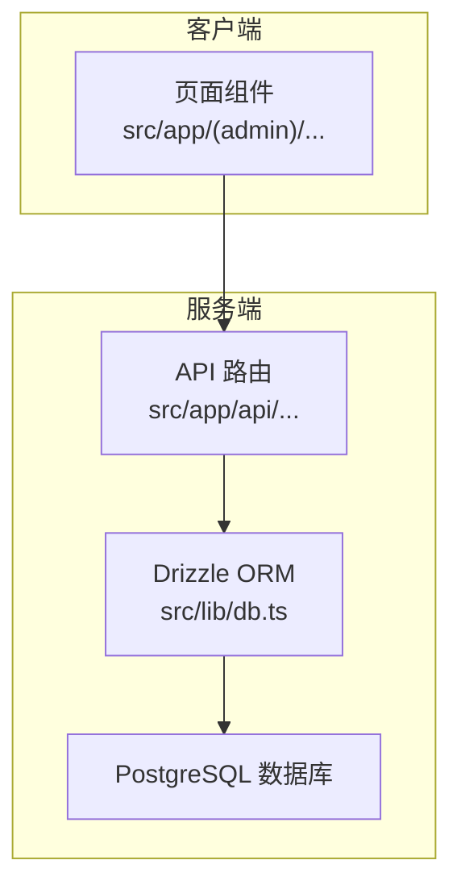
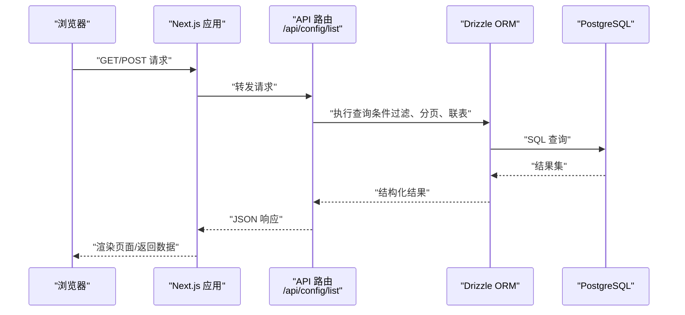
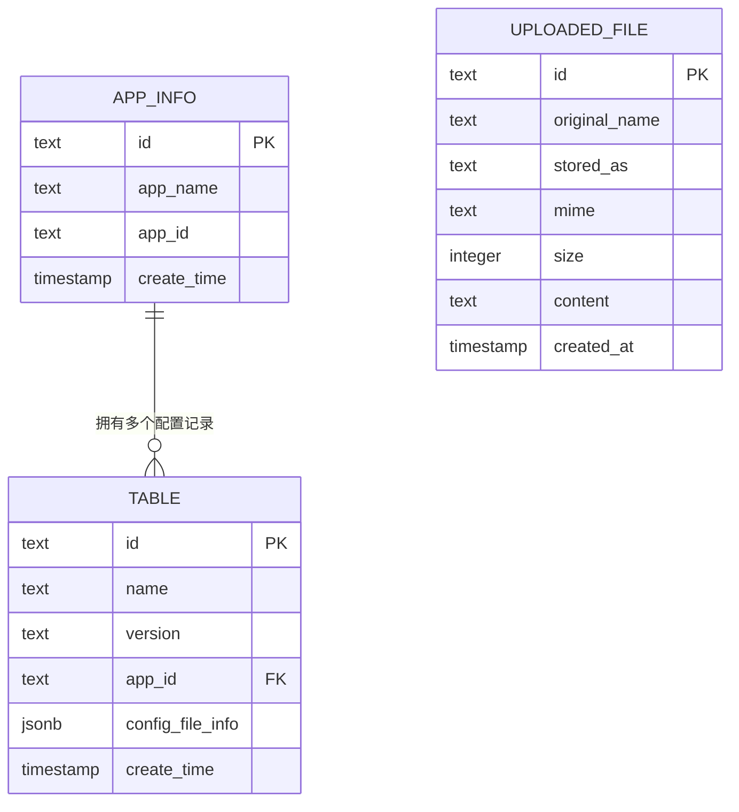
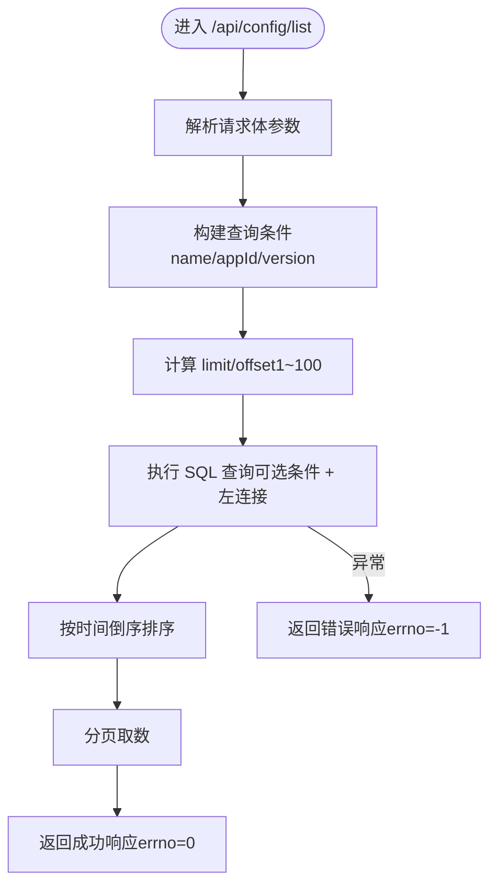

# 平台部署

<cite>
**本文引用的文件**
- [package.json](file://package.json)
- [next.config.ts](file://next.config.ts)
- [README.md](file://README.md)
- [tsconfig.json](file://tsconfig.json)
- [src/lib/db.ts](file://src/lib/db.ts)
- [src/lib/schema.ts](file://src/lib/schema.ts)
- [src/lib/table/schema.ts](file://src/lib/table/schema.ts)
- [src/lib/app.ts](file://src/lib/app.ts)
- [src/app/api/config/list/route.ts](file://src/app/api/config/list/route.ts)
- [src/app/(admin)/(others-pages)/(scene)/config/page.tsx](file://src/app/(admin)/(others-pages)/(scene)/config/page.tsx)
- [src/app/(admin)/(others-pages)/(scene)/config/new/page.tsx](file://src/app/(admin)/(others-pages)/(scene)/config/new/page.tsx)
- [src/config/themeConfig.ts](file://src/config/themeConfig.ts)
- [src/config/LayoutConfigHandler.tsx](file://src/config/LayoutConfigHandler.tsx)
</cite>

## 目录
1. [简介](#简介)
2. [项目结构](#项目结构)
3. [核心组件](#核心组件)
4. [架构总览](#架构总览)
5. [详细组件分析](#详细组件分析)
6. [依赖分析](#依赖分析)
7. [性能考量](#性能考量)
8. [故障排查指南](#故障排查指南)
9. [结论](#结论)
10. [附录](#附录)

## 简介
本指南面向需要在多平台部署该 Next.js 管理面板项目的开发者与运维团队，覆盖以下平台的部署流程与注意事项：Vercel、Netlify、传统服务器（Nginx + Node.js）。内容包括平台特定配置、环境准备、域名绑定与 SSL 证书、CI/CD 集成与自动化部署脚本、部署钩子配置、平台优劣与成本对比、部署后验证、性能监控与日志查看等。

## 项目结构
该项目基于 Next.js App Router，采用 TypeScript、Tailwind CSS V4，使用 Drizzle ORM 连接 PostgreSQL 数据库。前端页面通过 Next.js API 路由访问数据库，实现数据查询与分页展示。

图表来源
- [src/app/api/config/list/route.ts:1-77](file://src/app/api/config/list/route.ts#L1-L77)
- [src/lib/db.ts:1-19](file://src/lib/db.ts#L1-L19)
- [src/lib/schema.ts:1-24](file://src/lib/schema.ts#L1-L24)

章节来源
- [package.json:1-79](file://package.json#L1-L79)
- [next.config.ts:1-25](file://next.config.ts#L1-L25)
- [tsconfig.json:1-42](file://tsconfig.json#L1-L42)

## 核心组件
- 构建与运行脚本：开发、构建、启动、数据库迁移与本地调试工具。
- Webpack/SVGR 配置：SVG 图标按模块处理，提升构建兼容性。
- TypeScript 配置：严格模式、路径别名、Bundler 模块解析。
- 数据库连接：通过环境变量 POSTGRES_URL 建立连接池，自动识别部分托管服务的 SSL 需求。
- API 路由：提供分页查询接口，支持条件过滤与关联表查询。
- 页面组件：管理端页面与表单组件，调用 API 获取数据并渲染。

章节来源
- [package.json:5-14](file://package.json#L5-L14)
- [next.config.ts:5-20](file://next.config.ts#L5-L20)
- [tsconfig.json:25-29](file://tsconfig.json#L25-L29)
- [src/lib/db.ts:6-18](file://src/lib/db.ts#L6-L18)
- [src/app/api/config/list/route.ts:7-77](file://src/app/api/config/list/route.ts#L7-L77)

## 架构总览
下图展示了从浏览器到数据库的典型请求链路，以及数据库层的表结构关系。

图表来源
- [src/app/api/config/list/route.ts:7-77](file://src/app/api/config/list/route.ts#L7-L77)
- [src/lib/db.ts:1-19](file://src/lib/db.ts#L1-L19)
- [src/lib/schema.ts:1-24](file://src/lib/schema.ts#L1-L24)

图表来源
- [src/lib/table/schema.ts:1-25](file://src/lib/table/schema.ts#L1-L25)
- [src/lib/app.ts:1-9](file://src/lib/app.ts#L1-L9)
- [src/lib/schema.ts:1-24](file://src/lib/schema.ts#L1-L24)

## 详细组件分析

### 数据库连接与环境变量
- 必需环境变量：POSTGRES_URL。若未设置，应用启动时会抛出错误。
- 自动 SSL：当连接字符串包含特定托管服务标识时，自动启用 SSL 参数以适配其要求。
- 连接池：使用 pg 的 Pool 创建连接池，提高并发与稳定性。

章节来源
- [src/lib/db.ts:6-18](file://src/lib/db.ts#L6-L18)

### API 路由与查询逻辑
- 接口路径：/api/config/list
- 方法：POST
- 功能：根据 name、appId、version 条件过滤；支持分页（page、pageSize），默认每页 10 条，最大 100；
- 关联查询：与 app_info 表进行左连接，返回应用名称等信息；
- 错误处理：捕获异常并返回统一错误格式，HTTP 500。

图表来源
- [src/app/api/config/list/route.ts:7-77](file://src/app/api/config/list/route.ts#L7-L77)

章节来源
- [src/app/api/config/list/route.ts:7-77](file://src/app/api/config/list/route.ts#L7-L77)

### 页面组件与数据交互
- 列表页：通过 POST 请求 /api/config/list 获取数据，支持筛选与分页。
- 新增/编辑页：使用表单组件与路由参数控制编辑/详情/新增状态，提交后跳转或提示。

章节来源
- [src/app/(admin)/(others-pages)/(scene)/config/page.tsx:48-97](file://src/app/(admin)/(others-pages)/(scene)/config/page.tsx#L48-L97)
- [src/app/(admin)/(others-pages)/(scene)/config/new/page.tsx:14-31](file://src/app/(admin)/(others-pages)/(scene)/config/new/page.tsx#L14-L31)

### 主题与布局配置
- 主题配置：集中定义侧边栏宽度、头部高度、间距、圆角与品牌色。
- 布局处理器：在客户端注入 CSS 变量，使样式随主题配置动态生效。

章节来源
- [src/config/themeConfig.ts:1-30](file://src/config/themeConfig.ts#L1-L30)
- [src/config/LayoutConfigHandler.tsx:6-29](file://src/config/LayoutConfigHandler.tsx#L6-L29)

## 依赖分析
- 运行时依赖：Next.js、React、Tailwind CSS V4、Drizzle ORM、pg、dotenv 等。
- 开发依赖：TypeScript、ESLint、Prettier、Tailwind、drizzle-kit 等。
- 构建与打包：Next.js 默认使用 Bundler 模式，TS 路径别名 @/* 指向 src。

章节来源
- [package.json:15-67](file://package.json#L15-L67)
- [tsconfig.json:25-29](file://tsconfig.json#L25-L29)

## 性能考量
- 构建优化：使用 Next.js App Router 与 React Server Components，结合静态生成与服务端渲染能力，减少首屏加载时间。
- 数据库优化：合理使用索引与分页，避免一次性返回大量数据；对高频查询建立必要索引。
- 资源优化：SVG 通过 SVGR 处理为组件，减少额外请求；Tailwind CSS V4 提升样式编译效率。
- 缓存策略：在平台侧配置静态资源缓存与 API 缓存，降低数据库压力。

## 故障排查指南
- 启动报错“缺少 POSTGRES_URL”：检查环境变量是否正确设置，确保连接字符串有效。
- 数据库连接失败：确认托管服务地址与 SSL 配置；如为特定托管服务，确保连接字符串包含相应标识以便自动启用 SSL。
- API 查询异常：检查请求体参数类型与范围（page、pageSize），确认条件字段存在且非空；查看日志定位具体错误。
- 页面空白或样式异常：确认 TS 路径别名与构建产物一致；检查 Tailwind 样式是否正确编译。

章节来源
- [src/lib/db.ts:6-18](file://src/lib/db.ts#L6-L18)
- [src/app/api/config/list/route.ts:67-77](file://src/app/api/config/list/route.ts#L67-L77)

## 结论
本项目具备良好的可移植性与扩展性，可在 Vercel、Netlify 或传统服务器上稳定运行。建议优先在云原生平台（如 Vercel）利用其内置的环境变量与边缘网络优势；在传统服务器上注意 Nginx 反代与 Node.js 进程管理配置。通过合理的 CI/CD 流水线与监控告警，可显著提升交付效率与系统可靠性。

## 附录

### 多平台部署指南

#### 通用准备
- Node.js 版本：满足项目要求（建议使用较新的 LTS 版本）。
- 数据库：确保 PostgreSQL 可访问，准备好连接字符串（含凭据与主机信息）。
- 环境变量：在各平台的环境变量配置中设置 POSTGRES_URL，其他可选变量按需添加。

章节来源
- [README.md:43-76](file://README.md#L43-L76)
- [src/lib/db.ts:6-18](file://src/lib/db.ts#L6-L18)

#### Vercel 部署
- 配置要点
  - 构建命令：使用项目提供的构建脚本。
  - 输出目录：Next.js 默认输出目录。
  - 环境变量：在平台控制台设置 POSTGRES_URL 等。
- 域名与 SSL
  - 绑定自定义域名后，Vercel 自动生成并续期免费 SSL 证书。
- CI/CD 集成
  - 在仓库根目录放置平台特定配置文件（如 vercel.json），或通过平台控制台配置。
  - 推送分支触发构建，构建成功后自动部署。
- 部署钩子
  - Vercel 支持部署前/后钩子，可用于数据库迁移或缓存清理。
- 优势与限制
  - 优势：零运维、全球边缘网络、自动扩缩容、快速部署。
  - 限制：对复杂数据库操作与长连接场景可能受限。
- 成本
  - 免费层级通常足够小型项目；生产流量大时需评估付费计划。

章节来源
- [package.json:7-8](file://package.json#L7-L8)
- [src/lib/db.ts:6-18](file://src/lib/db.ts#L6-L18)

#### Netlify 部署
- 配置要点
  - 构建命令：使用项目提供的构建脚本。
  - 发布目录：Next.js 构建输出目录。
  - 环境变量：在 Netlify 控制台设置 POSTGRES_URL 等。
- 域名与 SSL
  - 绑定自定义域名后，Netlify 提供免费 SSL 证书。
- CI/CD 集成
  - 通过 Netlify 控制台关联仓库，推送即构建部署。
- 部署钩子
  - 使用 Netlify Functions 或第三方集成实现部署后任务。
- 优势与限制
  - 优势：静态站点友好、易于集成、功能丰富。
  - 限制：对 Node.js SSR 场景需配合边缘函数或托管平台。
- 成本
  - 免费层级适合小规模项目；高流量与复杂功能需升级。

章节来源
- [package.json:7-8](file://package.json#L7-L8)
- [src/lib/db.ts:6-18](file://src/lib/db.ts#L6-L18)

#### 传统服务器（Nginx + Node.js）
- 环境准备
  - 安装 Node.js 与 PM2/Nginx。
  - 准备 PostgreSQL 实例，确保网络可达。
- Nginx 反代
  - 将静态资源与 API 转发至 Node.js 应用；配置 HTTPS 与证书。
- 进程管理
  - 使用 PM2 管理 Next.js 生产进程，自动重启与日志轮转。
- 域名与 SSL
  - 通过 Nginx 配置域名与 SSL 证书（Let’s Encrypt 等）。
- CI/CD 与自动化
  - 使用 Git Hooks 或 CI 工具（如 GitHub Actions）拉取代码、安装依赖、构建并重启服务。
- 部署钩子
  - 在部署脚本中加入数据库迁移、缓存清理、健康检查等步骤。
- 优势与限制
  - 优势：完全可控、成本低、可扩展性强。
  - 限制：需要运维投入、需自行维护 SSL 与安全更新。
- 成本
  - 服务器成本与运维人力成本为主要开销。

章节来源
- [package.json:7-8](file://package.json#L7-L8)
- [src/lib/db.ts:6-18](file://src/lib/db.ts#L6-L18)

#### 部署后验证与监控
- 验证步骤
  - 访问首页与关键页面，确认渲染正常。
  - 通过 API 路由测试数据查询与分页功能。
  - 检查数据库连接是否成功。
- 性能监控
  - 平台侧：Vercel/Netlify 提供构建与运行时指标。
  - 自定义：集成 APM 工具或平台自带监控。
- 日志查看
  - 平台侧：在平台控制台查看构建日志与运行日志。
  - 传统服务器：PM2 日志与 Nginx 访问/错误日志。

章节来源
- [src/app/api/config/list/route.ts:67-77](file://src/app/api/config/list/route.ts#L67-L77)
- [src/lib/db.ts:6-18](file://src/lib/db.ts#L6-L18)