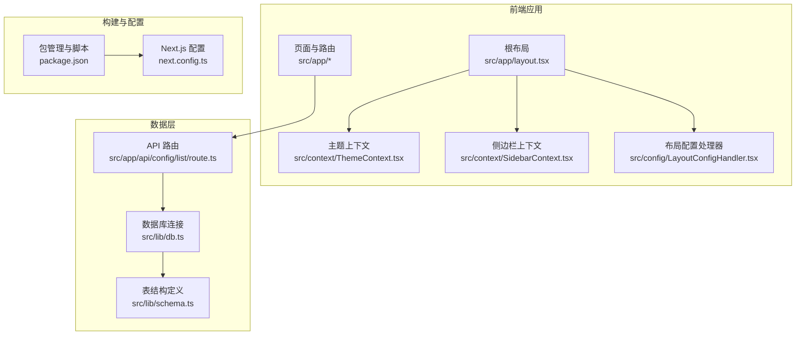
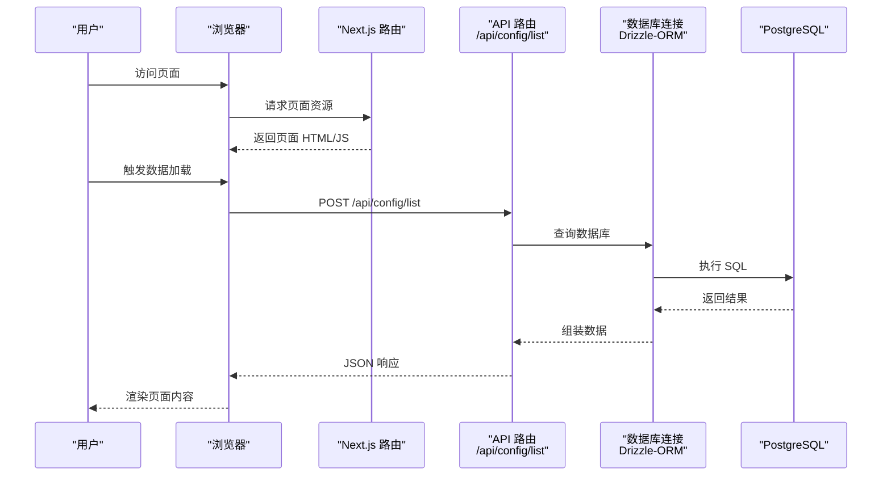
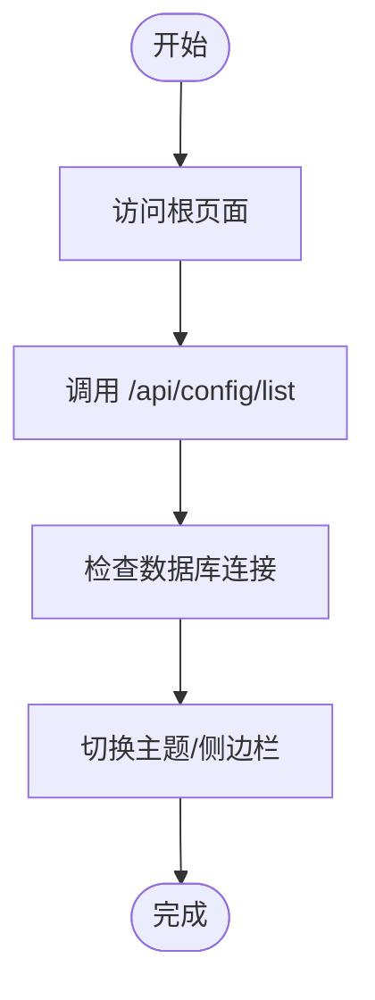
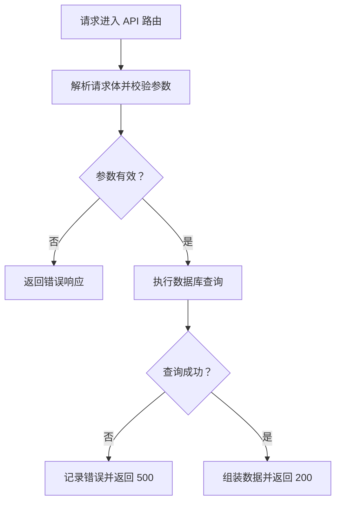
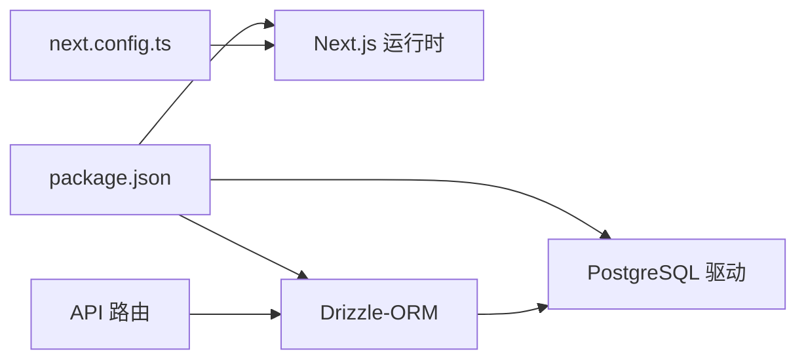

# 部署验证与监控

<cite>
**本文引用的文件**
- [package.json](file://package.json)
- [next.config.ts](file://next.config.ts)
- [src/app/layout.tsx](file://src/app/layout.tsx)
- [src/lib/db.ts](file://src/lib/db.ts)
- [src/lib/schema.ts](file://src/lib/schema.ts)
- [src/app/api/config/list/route.ts](file://src/app/api/config/list/route.ts)
- [src/components/auth/SignInForm.tsx](file://src/components/auth/SignInForm.tsx)
- [src/context/ThemeContext.tsx](file://src/context/ThemeContext.tsx)
- [src/context/SidebarContext.tsx](file://src/context/SidebarContext.tsx)
- [src/config/LayoutConfigHandler.tsx](file://src/config/LayoutConfigHandler.tsx)
- [src/app/(admin)/(others-pages)/(chart)/bar-chart/page.tsx](file://src/app/(admin)/(others-pages)/(chart)/bar-chart/page.tsx)
- [src/app/(admin)/(others-pages)/(scene)/socket/page.tsx](file://src/app/(admin)/(others-pages)/(scene)/socket/page.tsx)
</cite>

## 目录
1. [简介](#简介)
2. [项目结构](#项目结构)
3. [核心组件](#核心组件)
4. [架构总览](#架构总览)
5. [详细组件分析](#详细组件分析)
6. [依赖分析](#依赖分析)
7. [性能考虑](#性能考虑)
8. [故障排查指南](#故障排查指南)
9. [结论](#结论)
10. [附录](#附录)

## 简介
本指南面向部署后的系统运维与质量保障团队，围绕健康检查、功能测试、性能基准、日志与错误排查、APM 集成、缓存与 CDN 验证、响应时间监控、用户体验与 SEO、安全扫描以及故障恢复与回滚策略，提供可操作的验证清单与流程。文档结合当前仓库中的应用结构与关键实现点，给出落地建议与可视化图示。

## 项目结构
该 Next.js 项目采用 App Router 结构，页面按功能域组织在 src/app 下，公共样式与全局布局位于 src/app/globals.css 与根布局文件中；数据访问通过 Drizzle-ORM 连接 PostgreSQL；主题与侧边栏状态通过 Context 管理；部分页面使用图表组件与 WebSocket 场景演示。

**图表来源**
- [src/app/layout.tsx:1-33](file://src/app/layout.tsx#L1-L33)
- [src/context/ThemeContext.tsx:1-59](file://src/context/ThemeContext.tsx#L1-L59)
- [src/context/SidebarContext.tsx:1-85](file://src/context/SidebarContext.tsx#L1-L85)
- [src/config/LayoutConfigHandler.tsx:1-30](file://src/config/LayoutConfigHandler.tsx#L1-L30)
- [src/lib/db.ts:1-19](file://src/lib/db.ts#L1-L19)
- [src/lib/schema.ts:1-24](file://src/lib/schema.ts#L1-L24)
- [src/app/api/config/list/route.ts:1-77](file://src/app/api/config/list/route.ts#L1-L77)
- [package.json:1-79](file://package.json#L1-L79)
- [next.config.ts:1-25](file://next.config.ts#L1-L25)

**章节来源**
- [src/app/layout.tsx:1-33](file://src/app/layout.tsx#L1-L33)
- [src/context/ThemeContext.tsx:1-59](file://src/context/ThemeContext.tsx#L1-L59)
- [src/context/SidebarContext.tsx:1-85](file://src/context/SidebarContext.tsx#L1-L85)
- [src/config/LayoutConfigHandler.tsx:1-30](file://src/config/LayoutConfigHandler.tsx#L1-L30)
- [src/lib/db.ts:1-19](file://src/lib/db.ts#L1-L19)
- [src/lib/schema.ts:1-24](file://src/lib/schema.ts#L1-L24)
- [src/app/api/config/list/route.ts:1-77](file://src/app/api/config/list/route.ts#L1-L77)
- [package.json:1-79](file://package.json#L1-L79)
- [next.config.ts:1-25](file://next.config.ts#L1-L25)

## 核心组件
- 全局布局与主题：根布局负责字体、全局样式、主题 Provider、侧边栏 Provider 与通知组件挂载；主题切换通过本地存储持久化并在客户端生效。
- 上下文管理：主题上下文与侧边栏上下文分别维护 UI 主题状态与导航状态，支持服务端渲染与客户端交互。
- 布局配置处理器：将主题配置映射为 CSS 变量，统一控制侧边栏宽度、间距、圆角与主色。
- 数据访问：通过 Drizzle-ORM 与 PostgreSQL 连接池建立数据库会话，支持 SSL 条件性启用；API 路由对分页、条件过滤进行处理。
- 页面与组件：示例页面包含图表与 WebSocket 场景，便于验证前端渲染与交互。

**章节来源**
- [src/app/layout.tsx:1-33](file://src/app/layout.tsx#L1-L33)
- [src/context/ThemeContext.tsx:1-59](file://src/context/ThemeContext.tsx#L1-L59)
- [src/context/SidebarContext.tsx:1-85](file://src/context/SidebarContext.tsx#L1-L85)
- [src/config/LayoutConfigHandler.tsx:1-30](file://src/config/LayoutConfigHandler.tsx#L1-L30)
- [src/lib/db.ts:1-19](file://src/lib/db.ts#L1-L19)
- [src/lib/schema.ts:1-24](file://src/lib/schema.ts#L1-L24)
- [src/app/api/config/list/route.ts:1-77](file://src/app/api/config/list/route.ts#L1-L77)

## 架构总览
下图展示从浏览器到 API、数据库的典型请求链路，以及主题与布局配置在客户端的初始化过程。

**图表来源**
- [src/app/api/config/list/route.ts:1-77](file://src/app/api/config/list/route.ts#L1-L77)
- [src/lib/db.ts:1-19](file://src/lib/db.ts#L1-L19)
- [src/lib/schema.ts:1-24](file://src/lib/schema.ts#L1-L24)

## 详细组件分析

### 健康检查与可用性验证
- 页面可达性：访问根路径与示例页面（如柱状图页）确认静态/动态渲染正常。
- API 可用性：调用 /api/config/list 接口，验证分页参数与条件过滤逻辑，确保返回结构与状态码符合预期。
- 数据库连通性：检查数据库连接初始化与 SSL 配置，确认连接池可用。
- 主题与布局：切换主题、展开/收起侧边栏，验证 CSS 变量与上下文状态同步。

**图表来源**
- [src/app/api/config/list/route.ts:1-77](file://src/app/api/config/list/route.ts#L1-L77)
- [src/lib/db.ts:1-19](file://src/lib/db.ts#L1-L19)
- [src/context/ThemeContext.tsx:1-59](file://src/context/ThemeContext.tsx#L1-L59)
- [src/context/SidebarContext.tsx:1-85](file://src/context/SidebarContext.tsx#L1-L85)
- [src/config/LayoutConfigHandler.tsx:1-30](file://src/config/LayoutConfigHandler.tsx#L1-L30)

**章节来源**
- [src/app/api/config/list/route.ts:1-77](file://src/app/api/config/list/route.ts#L1-L77)
- [src/lib/db.ts:1-19](file://src/lib/db.ts#L1-L19)
- [src/context/ThemeContext.tsx:1-59](file://src/context/ThemeContext.tsx#L1-L59)
- [src/context/SidebarContext.tsx:1-85](file://src/context/SidebarContext.tsx#L1-L85)
- [src/config/LayoutConfigHandler.tsx:1-30](file://src/config/LayoutConfigHandler.tsx#L1-L30)

### 功能测试清单
- 登录流程：验证登录表单字段、第三方登录按钮、记住我选项与“忘记密码”链接。
- 页面导航：侧边栏展开/折叠、移动端模式、子菜单切换。
- 图表与场景：柱状图页面渲染、WebSocket 页面占位，确认前端组件加载无异常。
- 表单与输入：复选框、输入框、按钮等 UI 组件交互。

**章节来源**
- [src/components/auth/SignInForm.tsx:1-155](file://src/components/auth/SignInForm.tsx#L1-L155)
- [src/context/SidebarContext.tsx:1-85](file://src/context/SidebarContext.tsx#L1-L85)
- [src/app/(admin)/(others-pages)/(chart)/bar-chart/page.tsx:1-25](file://src/app/(admin)/(others-pages)/(chart)/bar-chart/page.tsx#L1-L25)
- [src/app/(admin)/(others-pages)/(scene)/socket/page.tsx:1-13](file://src/app/(admin)/(others-pages)/(scene)/socket/page.tsx#L1-L13)

### 性能基准测试
- 首屏加载时间：使用浏览器开发者工具或 Lighthouse 测量首次内容绘制（FCP）、最大内容绘制（LCP）。
- 交互延迟：测量点击按钮、切换主题、打开侧边栏的交互到反馈时间。
- API 延迟：对 /api/config/list 发起多次请求，统计平均响应时间与 P95。
- 资源体积：分析构建产物大小与关键资源加载顺序。

[本节为通用性能指导，无需特定文件引用]

### 日志查看与错误排查
- 控制台日志：在 API 路由中存在错误捕获与日志输出，用于定位查询异常。
- 数据库连接：检查连接字符串与 SSL 配置，确认连接池初始化成功。
- 前端上下文：若主题或侧边栏状态异常，检查本地存储键值与 DOM 属性变更。

**图表来源**
- [src/app/api/config/list/route.ts:1-77](file://src/app/api/config/list/route.ts#L1-L77)

**章节来源**
- [src/app/api/config/list/route.ts:1-77](file://src/app/api/config/list/route.ts#L1-L77)
- [src/lib/db.ts:1-19](file://src/lib/db.ts#L1-L19)

### APM 工具集成方案
- 新增 APM SDK：在应用入口（如根布局或全局样式引入处）初始化 APM 客户端，采集前端性能指标与错误事件。
- API 路由埋点：在 API 路由的请求入口与出口增加自定义计时与错误上报，覆盖分页与过滤逻辑。
- 数据库追踪：通过 APM 的数据库插件或手动埋点，记录查询耗时与慢查询。
- 实时监控与告警：在 APM 平台设置阈值告警（如 P95 响应时间、错误率、数据库连接失败）。

[本节为通用集成指导，无需特定文件引用]

### 缓存策略验证与 CDN 效果测试
- 缓存头验证：检查静态资源与 API 响应头，确认缓存策略（如 Cache-Control、ETag）生效。
- CDN 回源测试：通过不同区域访问资源，观察回源比例与命中率。
- 失效策略：更新资源后验证缓存失效与新版本下发。

[本节为通用优化指导，无需特定文件引用]

### 响应时间监控
- 前端指标：使用 Performance API 或 APM SDK 记录导航与资源加载时间。
- 后端指标：记录 API 路由处理时间与数据库查询耗时。
- 综合看板：在监控平台聚合前端与后端指标，形成端到端响应时间视图。

[本节为通用监控指导，无需特定文件引用]

### 用户体验测试与 SEO 检查
- 用户体验：模拟真实用户路径（登录、导航、查看图表），记录交互流畅度与错误率。
- SEO：检查页面元信息（标题、描述）、结构化数据、图片替代文本与可访问性标签。

[本节为通用测试指导，无需特定文件引用]

### 安全扫描方法
- 依赖漏洞扫描：定期运行依赖扫描工具，修复高危漏洞。
- 静态分析：对前端与后端代码进行安全规则扫描，识别潜在风险。
- 配置审计：检查数据库连接字符串、密钥管理与环境变量暴露情况。

[本节为通用安全指导，无需特定文件引用]

## 依赖分析
- 包管理与脚本：通过 package.json 管理 Next.js、React、数据库与开发工具依赖。
- 构建配置：next.config.ts 中配置 SVG 处理与 Turbopack 规则，影响打包与开发体验。
- 数据依赖：API 路由依赖 Drizzle-ORM 与 PostgreSQL，需保证连接字符串与 SSL 设置正确。

**图表来源**
- [package.json:1-79](file://package.json#L1-L79)
- [next.config.ts:1-25](file://next.config.ts#L1-L25)
- [src/app/api/config/list/route.ts:1-77](file://src/app/api/config/list/route.ts#L1-L77)
- [src/lib/db.ts:1-19](file://src/lib/db.ts#L1-L19)

**章节来源**
- [package.json:1-79](file://package.json#L1-L79)
- [next.config.ts:1-25](file://next.config.ts#L1-L25)
- [src/app/api/config/list/route.ts:1-77](file://src/app/api/config/list/route.ts#L1-L77)
- [src/lib/db.ts:1-19](file://src/lib/db.ts#L1-L19)

## 性能考虑
- 构建优化：利用 Next.js 的自动代码分割与静态生成能力，减少首屏 JS 体积。
- 数据查询：在 API 路由中限制分页大小与偏移，避免大页扫描；对常用查询建立索引。
- 资源加载：优先使用现代图片格式与懒加载，减少阻塞渲染的资源。
- 主题与布局：CSS 变量与上下文状态尽量在客户端初始化，避免服务端渲染阶段的不必要计算。

[本节为通用性能指导，无需特定文件引用]

## 故障排查指南
- API 错误：检查请求体参数、分页边界与数据库连接状态；关注错误日志与 500 响应。
- 数据库问题：核对连接字符串、SSL 配置与网络连通性；确认连接池未耗尽。
- 前端状态：若主题或侧边栏异常，检查本地存储键值与 DOM 属性变更；确认上下文提供者包裹完整。
- 部署问题：确认环境变量已注入、构建产物可正常启动、静态资源可被正确访问。

**章节来源**
- [src/app/api/config/list/route.ts:1-77](file://src/app/api/config/list/route.ts#L1-L77)
- [src/lib/db.ts:1-19](file://src/lib/db.ts#L1-L19)
- [src/context/ThemeContext.tsx:1-59](file://src/context/ThemeContext.tsx#L1-L59)
- [src/context/SidebarContext.tsx:1-85](file://src/context/SidebarContext.tsx#L1-L85)

## 结论
通过健康检查、功能测试、性能基准与日志排查，结合 APM 实时监控与告警，可全面保障部署后的系统稳定性与可观测性。针对缓存与 CDN、响应时间、用户体验与 SEO、安全扫描以及故障恢复与回滚策略，建议建立标准化流程与自动化工具，持续迭代优化。

## 附录
- 部署后验证清单
  - 健康检查：页面可达、API 可用、数据库连通
  - 功能测试：登录、导航、图表与场景页面
  - 性能基准：首屏、交互延迟、API 延迟、资源体积
  - 日志与错误：控制台日志、错误响应、数据库连接
  - APM 集成：前端 SDK 初始化、API 路由埋点、数据库追踪
  - 缓存与 CDN：缓存头验证、回源测试、失效策略
  - 监控与告警：端到端响应时间、阈值告警
  - 用户体验与 SEO：路径测试、元信息与可访问性
  - 安全扫描：依赖漏洞、静态分析、配置审计
  - 故障恢复与回滚：灰度发布、快速回滚、应急响应