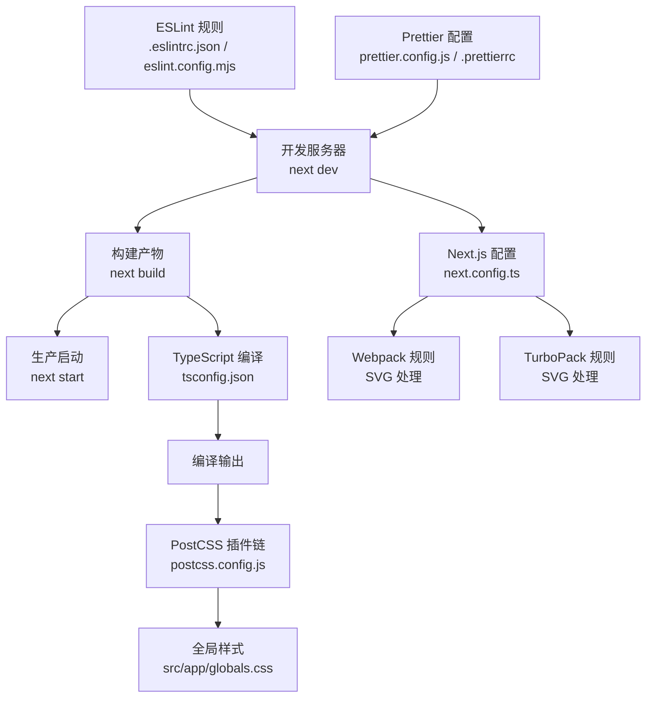
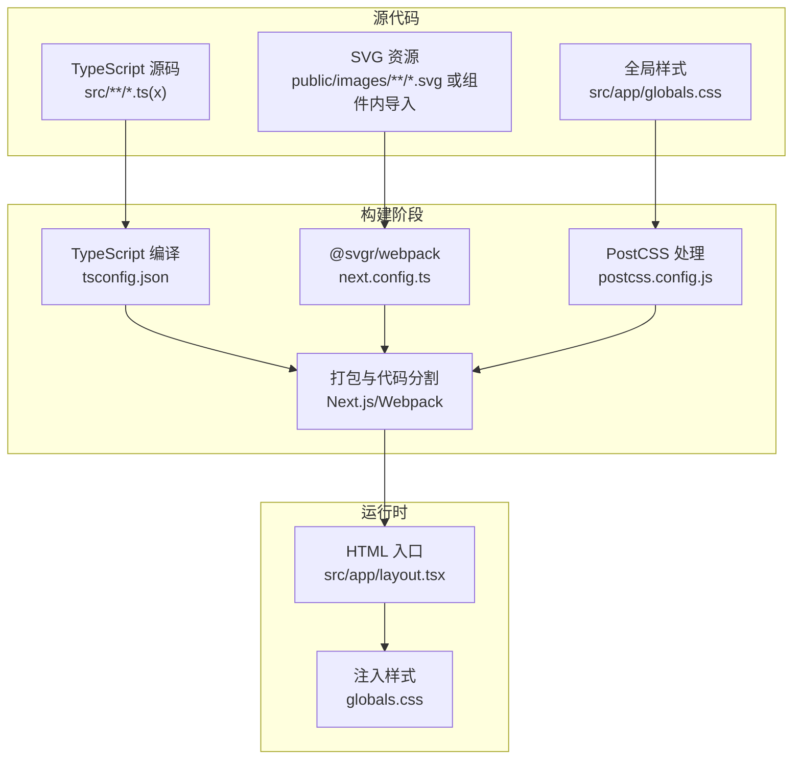
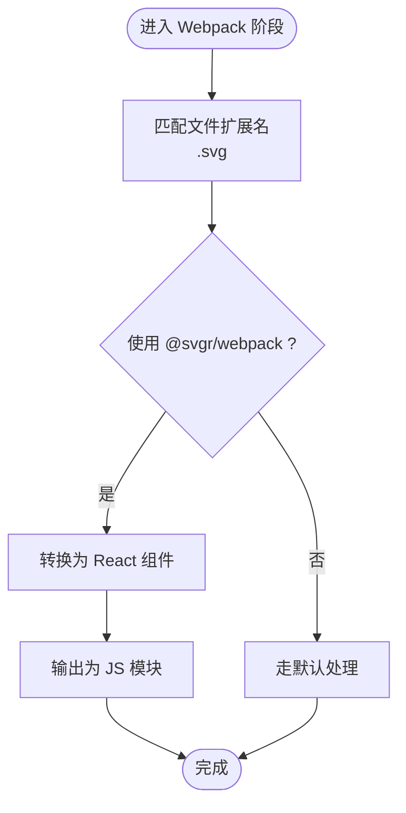
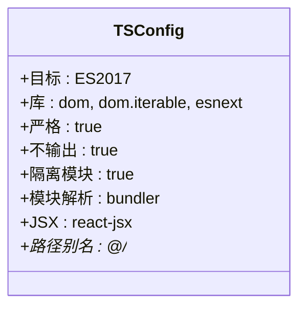
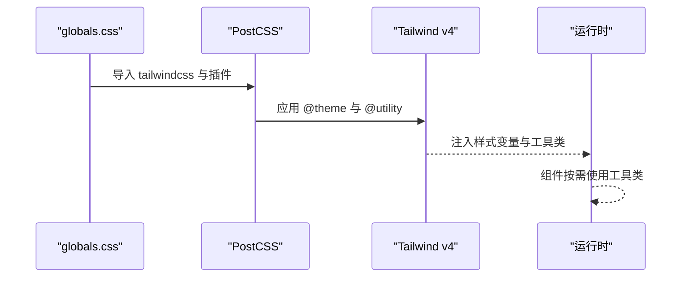
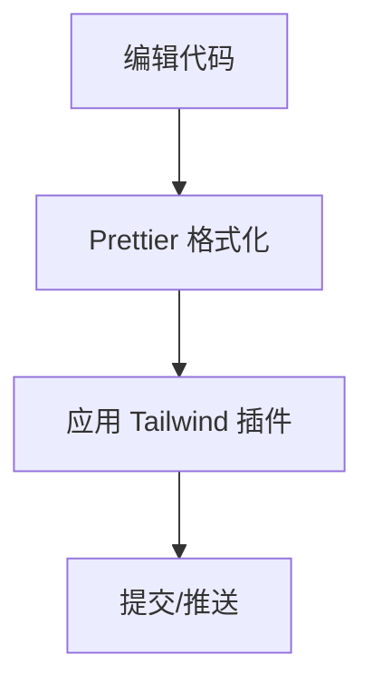
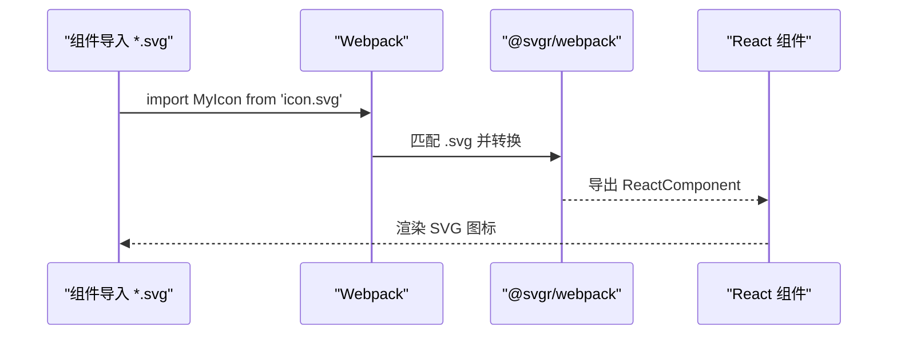
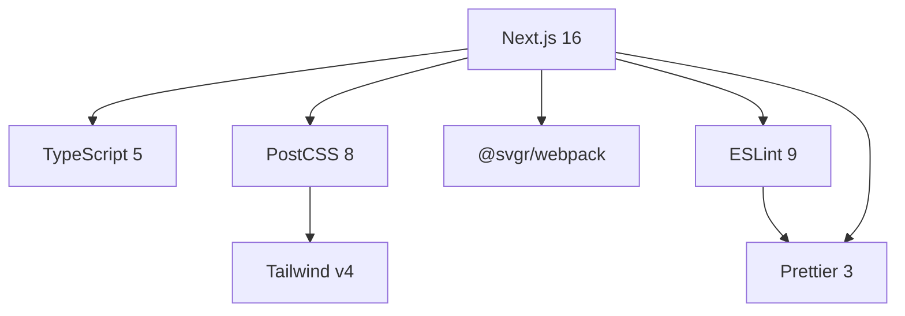

# 构建配置

<cite>
**本文引用的文件**
- [next.config.ts](file://next.config.ts)
- [tsconfig.json](file://tsconfig.json)
- [postcss.config.js](file://postcss.config.js)
- [prettier.config.js](file://prettier.config.js)
- [.prettierrc](file://.prettierrc)
- [.eslintrc.json](file://.eslintrc.json)
- [eslint.config.mjs](file://eslint.config.mjs)
- [package.json](file://package.json)
- [src/svg.d.ts](file://src/svg.d.ts)
- [src/app/layout.tsx](file://src/app/layout.tsx)
- [src/app/globals.css](file://src/app/globals.css)
- [components.json](file://components.json)
- [jsvectormap.d.ts](file://jsvectormap.d.ts)
</cite>

## 目录
1. [简介](#简介)
2. [项目结构与构建入口](#项目结构与构建入口)
3. [核心构建组件](#核心构建组件)
4. [架构总览](#架构总览)
5. [详细组件分析](#详细组件分析)
6. [依赖关系分析](#依赖关系分析)
7. [性能考量与优化建议](#性能考量与优化建议)
8. [故障排查指南](#故障排查指南)
9. [结论](#结论)
10. [附录](#附录)

## 简介
本文件系统性梳理该项目的构建配置，覆盖 Next.js 构建配置选项、TypeScript 编译配置、Webpack 自定义规则（含 SVG 处理）、TurboPack 配置、PostCSS/Tailwind 预处理、Prettier 格式化配置、ESLint 规则、以及构建优化策略、代码分割、静态资源处理与环境变量注入等主题。目标是帮助开发者快速理解并优化构建流程与产物质量。

## 项目结构与构建入口
- Next.js 应用通过脚本命令进行开发、构建与启动：
  - 开发：next dev
  - 构建：next build
  - 启动：next start
- 关键构建配置集中在 next.config.ts 中，TypeScript 编译在 tsconfig.json 中定义，样式预处理由 PostCSS 驱动，格式化与校验分别由 Prettier 与 ESLint 负责。
- 项目使用 RSC（React Server Components）与 TSX，路径别名 @/* 指向 src/*，便于模块导入与类型推断。

图表来源
- [next.config.ts:1-25](file://next.config.ts#L1-L25)
- [tsconfig.json:1-42](file://tsconfig.json#L1-L42)
- [postcss.config.js:1-6](file://postcss.config.js#L1-L6)
- [prettier.config.js:1-3](file://prettier.config.js#L1-L3)
- [.prettierrc:1-10](file://.prettierrc#L1-L10)
- [.eslintrc.json:1-4](file://.eslintrc.json#L1-L4)
- [eslint.config.mjs:1-19](file://eslint.config.mjs#L1-L19)

章节来源
- [package.json:5-14](file://package.json#L5-L14)

## 核心构建组件
- Next.js 构建配置（next.config.ts）
  - 自定义 Webpack 规则：为 .svg 文件启用 @svgr/webpack，实现 SVG 作为 React 组件导入与内联。
  - TurboPack 规则：对 *.svg 使用相同 loader 并将其视为 *.js 输出，确保 Turbopack 下的 SVG 正常工作。
- TypeScript 编译配置（tsconfig.json）
  - 目标与库：ES2017 + dom/dom.iterable/esnext。
  - 严格模式：开启 strict，noEmit，isolatedModules，jsx 使用 react-jsx。
  - 模块解析：bundler（与 Next 16 推荐一致），支持 esnext 模块与 JSON。
  - 路径映射：@/* -> ./src/*。
  - 包装器插件：next。
- PostCSS 配置（postcss.config.js）
  - 使用 @tailwindcss/postcss 插件，结合 Tailwind v4 的新语法与特性。
- Prettier 配置（prettier.config.js 与 .prettierrc）
  - 插件：prettier-plugin-tailwindcss。
  - 基础格式化偏好：分号、单引号、尾逗号、行长、缩进宽度、换行符等。
- ESLint 配置（.eslintrc.json 与 eslint.config.mjs）
  - 扩展：next/core-web-vitals 与 prettier，确保最佳实践与格式一致性。
  - 新版 ESLint 配置采用 mjs，显式覆盖默认忽略项，避免生成目录被误检。

章节来源
- [next.config.ts:3-21](file://next.config.ts#L3-L21)
- [tsconfig.json:2-29](file://tsconfig.json#L2-L29)
- [postcss.config.js:1-6](file://postcss.config.js#L1-L6)
- [prettier.config.js:1-3](file://prettier.config.js#L1-L3)
- [.prettierrc:1-10](file://.prettierrc#L1-L10)
- [.eslintrc.json:1-4](file://.eslintrc.json#L1-L4)
- [eslint.config.mjs:1-19](file://eslint.config.mjs#L1-L19)

## 架构总览
下图展示从源码到最终构建产物的关键路径，包括 TypeScript 编译、PostCSS 处理、SVG 转换、样式注入与运行时加载。

图表来源
- [next.config.ts:5-11](file://next.config.ts#L5-L11)
- [tsconfig.json:2-29](file://tsconfig.json#L2-L29)
- [postcss.config.js:1-6](file://postcss.config.js#L1-L6)
- [src/app/layout.tsx:1-33](file://src/app/layout.tsx#L1-L33)
- [src/app/globals.css:1-20](file://src/app/globals.css#L1-L20)

## 详细组件分析

### Next.js 构建配置（next.config.ts）
- Webpack 自定义规则
  - 作用：为 .svg 文件匹配 @svgr/webpack，使 SVG 可以作为 React 组件导入并在客户端渲染。
  - 影响：减少额外的图片请求，提升可访问性与主题适配能力（如通过 props 控制颜色、尺寸）。
- TurboPack 规则
  - 作用：在 Turbopack 模式下同样启用 @svgr/webpack，并将输出视为 *.js，保证开发体验与产物一致性。
- 适用场景
  - 组件内图标、品牌 Logo、装饰性矢量图形等。

图表来源
- [next.config.ts:5-11](file://next.config.ts#L5-L11)

章节来源
- [next.config.ts:3-21](file://next.config.ts#L3-L21)

### TypeScript 编译配置（tsconfig.json）
- 目标与库
  - ES2017 + dom/dom.iterable/esnext，满足现代浏览器与 Next.js 运行时需求。
- 严格性与增量
  - strict、noEmit、isolatedModules 提升类型安全与构建稳定性；incremental 支持增量编译。
- 模块解析与 JSX
  - bundler 解析器、esnext 模块、react-jsx JSX 转换，配合 Next 16 生态。
- 路径别名
  - @/* -> ./src/*，统一导入路径，减少相对路径复杂度。
- 包装器插件
  - next 插件用于类型生成与 Next.js 特性支持。

图表来源
- [tsconfig.json:2-29](file://tsconfig.json#L2-L29)

章节来源
- [tsconfig.json:1-42](file://tsconfig.json#L1-L42)

### PostCSS 与 Tailwind 预处理（postcss.config.js 与 globals.css）
- PostCSS 插件
  - @tailwindcss/postcss：启用 Tailwind v4 的新语法与功能。
- 全局样式
  - 引入 tailwindcss、tw-animate-css、shadcn/tailwind.css。
  - 定义自定义主题变量、断点、颜色体系、阴影与 z-index 等。
  - 使用 @theme inline 与 @utility 定义复用样式工具类。
- 与组件库集成
  - shadcn 集成配置位于 components.json，RSC 与 TSX 已启用。

图表来源
- [postcss.config.js:1-6](file://postcss.config.js#L1-L6)
- [src/app/globals.css:1-20](file://src/app/globals.css#L1-L20)
- [components.json:1-26](file://components.json#L1-L26)

章节来源
- [postcss.config.js:1-6](file://postcss.config.js#L1-L6)
- [src/app/globals.css:1-899](file://src/app/globals.css#L1-L899)
- [components.json:1-26](file://components.json#L1-L26)

### Prettier 代码格式化（prettier.config.js 与 .prettierrc）
- 插件
  - prettier-plugin-tailwindcss：自动排序 Tailwind 类，保持一致性。
- 基础偏好
  - 分号、单引号、尾逗号、行长、缩进宽度、换行符等。
- 与 ESLint 协作
  - .eslintrc.json 扩展 next/core-web-vitals 与 prettier，确保格式与规范一致。

图表来源
- [prettier.config.js:1-3](file://prettier.config.js#L1-L3)
- [.prettierrc:1-10](file://.prettierrc#L1-L10)
- [.eslintrc.json:1-4](file://.eslintrc.json#L1-L4)

章节来源
- [prettier.config.js:1-3](file://prettier.config.js#L1-L3)
- [.prettierrc:1-10](file://.prettierrc#L1-L10)
- [.eslintrc.json:1-4](file://.eslintrc.json#L1-L4)

### ESLint 规则（.eslintrc.json 与 eslint.config.mjs）
- 扩展
  - next/core-web-vitals：Web Vitals 最佳实践。
  - prettier：与 Prettier 格式化保持一致。
- 新版配置
  - eslint.config.mjs 使用 defineConfig 与 globalIgnores，显式排除 .next、out、build、next-env.d.ts 等目录，避免误检。

图表来源
- [.eslintrc.json:1-4](file://.eslintrc.json#L1-L4)
- [eslint.config.mjs:1-19](file://eslint.config.mjs#L1-L19)

章节来源
- [.eslintrc.json:1-4](file://.eslintrc.json#L1-L4)
- [eslint.config.mjs:1-19](file://eslint.config.mjs#L1-L19)

### SVG 处理与类型声明
- Webpack 规则
  - 通过 @svgr/webpack 将 SVG 转换为 React 组件，支持内联与主题化。
- 类型声明
  - 在 src/svg.d.ts 中声明 *.svg 模块导出 ReactComponent 与默认字符串，确保类型安全与 IDE 提示。

图表来源
- [next.config.ts:5-11](file://next.config.ts#L5-L11)
- [src/svg.d.ts:1-10](file://src/svg.d.ts#L1-L10)

章节来源
- [next.config.ts:5-11](file://next.config.ts#L5-L11)
- [src/svg.d.ts:1-10](file://src/svg.d.ts#L1-L10)

### 静态资源与字体处理
- 字体
  - 通过 next/font/google 引入 Geist 与 Outfit，并在根布局中注入变量与类名，确保字体按需加载与 SSR 友好。
- 第三方样式
  - flatpickr、apexcharts 等第三方库样式在全局 CSS 中引入，确保主题与暗色模式兼容。

章节来源
- [src/app/layout.tsx:1-33](file://src/app/layout.tsx#L1-L33)
- [src/app/globals.css:1-20](file://src/app/globals.css#L1-L20)

### 代码分割与模块解析
- 代码分割
  - Next.js 默认按路由与动态导入进行代码分割；本项目未显式配置，遵循框架默认策略。
- 模块解析
  - tsconfig.json 使用 bundler 解析器与 esnext 模块，确保与 Next 16 生态兼容。

章节来源
- [tsconfig.json:14-16](file://tsconfig.json#L14-L16)

### 环境变量注入
- 当前仓库未发现 .env* 文件，因此未启用环境变量注入。
- 如需注入，可在 next.config.ts 中通过环境变量读取并传入运行时配置或构建期插件参数。

章节来源
- [package.json:15-49](file://package.json#L15-L49)

## 依赖关系分析
- 构建工具链
  - Next.js 16、TypeScript 5、PostCSS 8、Tailwind v4、Prettier 3、ESLint 9。
- 关键依赖
  - @svgr/webpack：SVG 转 React 组件。
  - @tailwindcss/postcss：Tailwind v4 插件。
  - prettier-plugin-tailwindcss：Tailwind 类排序。
  - eslint-config-next 与 eslint-config-prettier：Web Vitals 与格式化规范。
- 类型声明
  - jsvectormap.d.ts：为 jsvectormap 提供类型支持。

图表来源
- [package.json:15-67](file://package.json#L15-L67)

章节来源
- [package.json:15-67](file://package.json#L15-L67)

## 性能考量与优化建议
- 构建性能
  - 使用 Next.js 内置的增量编译与缓存（tsconfig.json 的 incremental）。
  - 在大型项目中考虑启用 Turbopack（next.config.ts 已配置），以获得更快的开发体验。
- 代码分割
  - 利用 Next.js 的路由级分割与动态导入，减少首屏体积。
  - 对第三方库（如 apexcharts、flatpickr）按需引入，避免全量打包。
- 样式优化
  - Tailwind v4 的 @theme inline 与 @utility 减少重复样式，提高复用率。
  - 使用 Prettier 插件自动排序 Tailwind 类，降低维护成本。
- 资源优化
  - SVG 通过 @svgr/webpack 内联为 React 组件，减少网络请求与提升可访问性。
  - 字体通过 next/font 按需加载，避免阻塞渲染。
- 开发体验
  - ESLint 与 Prettier 集成，减少格式争议与构建失败风险。
  - 组件库（shadcn）与 Tailwind 集成良好，提升开发效率。

[本节为通用性能建议，无需特定文件引用]

## 故障排查指南
- SVG 无法作为组件导入
  - 检查 next.config.ts 是否正确配置 @svgr/webpack 与 TurboPack 规则。
  - 确认 src/svg.d.ts 是否存在且声明了 ReactComponent 与默认导出。
- 样式未生效或 Tailwind 类无效
  - 确认 postcss.config.js 中已启用 @tailwindcss/postcss。
  - 检查 globals.css 是否正确引入 tailwindcss 与插件。
  - 确保组件使用了正确的工具类或变量。
- ESLint 报错与 Prettier 冲突
  - 确认 .eslintrc.json 或 eslint.config.mjs 已扩展 next/core-web-vitals 与 prettier。
  - 使用 Prettier 插件自动排序 Tailwind 类，避免手动调整。
- 第三方库类型错误
  - 检查 jsvectormap.d.ts 是否存在并正确声明模块导出。
- 构建失败或类型错误
  - 确认 tsconfig.json 的 strict、noEmit、isolatedModules 设置是否符合当前项目需求。
  - 检查路径别名 @/* 是否与实际目录结构一致。

章节来源
- [next.config.ts:5-11](file://next.config.ts#L5-L11)
- [src/svg.d.ts:1-10](file://src/svg.d.ts#L1-L10)
- [postcss.config.js:1-6](file://postcss.config.js#L1-L6)
- [src/app/globals.css:1-20](file://src/app/globals.css#L1-L20)
- [.eslintrc.json:1-4](file://.eslintrc.json#L1-L4)
- [eslint.config.mjs:1-19](file://eslint.config.mjs#L1-L19)
- [jsvectormap.d.ts:1-5](file://jsvectormap.d.ts#L1-L5)
- [tsconfig.json:11-18](file://tsconfig.json#L11-L18)

## 结论
本项目构建配置围绕 Next.js 16、TypeScript 5、Tailwind v4 与 Prettier/ESLint 生态展开，重点在于：
- 通过 @svgr/webpack 实现 SVG 的组件化导入；
- 使用 bundler 解析器与 react-jsx JSX 转换，配合 tsconfig.json 的严格配置；
- 通过 PostCSS 与 Tailwind v4 提供强大的样式能力；
- ESLint 与 Prettier 协同保障代码质量与一致性；
- 通过 next.config.ts 与 eslint.config.mjs 的显式配置，避免误检与构建问题。

建议在后续迭代中：
- 明确环境变量注入策略（如需）；
- 持续评估第三方库的按需引入与 Tree Shaking；
- 结合 Turbopack 与 Next.js 的新特性进一步优化开发体验与构建速度。

[本节为总结，无需特定文件引用]

## 附录
- 路径别名与类型支持
  - @/* -> ./src/*，便于统一导入与类型推断。
- 组件库与 Tailwind 集成
  - shadcn 集成配置位于 components.json，RSC 与 TSX 已启用。
- 第三方类型声明
  - jsvectormap.d.ts 为 jsvectormap 提供类型支持。

章节来源
- [tsconfig.json:25-29](file://tsconfig.json#L25-L29)
- [components.json:1-26](file://components.json#L1-L26)
- [jsvectormap.d.ts:1-5](file://jsvectormap.d.ts#L1-L5)