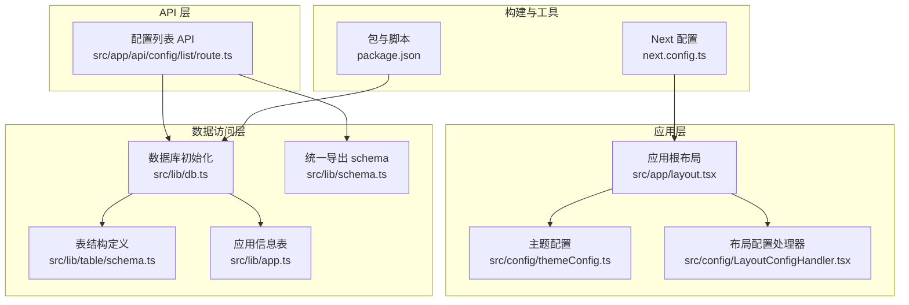
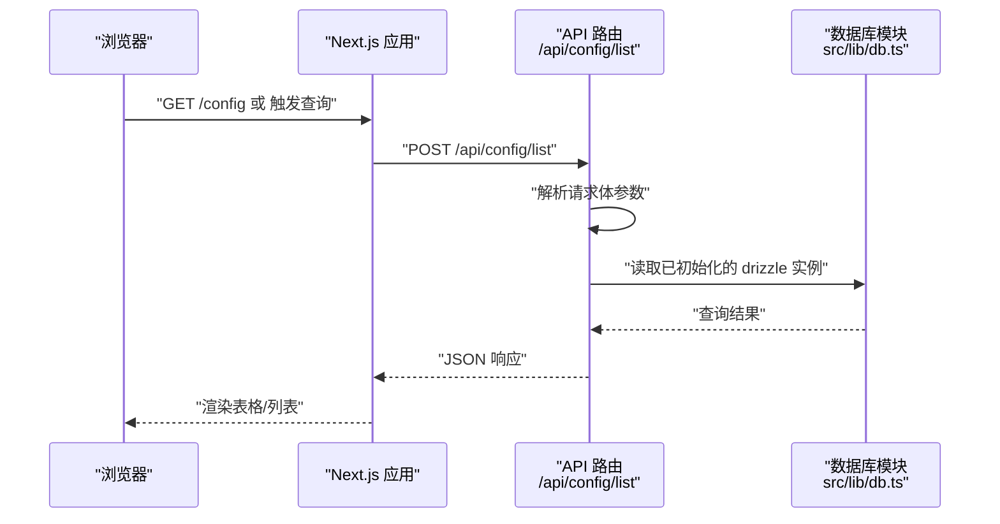
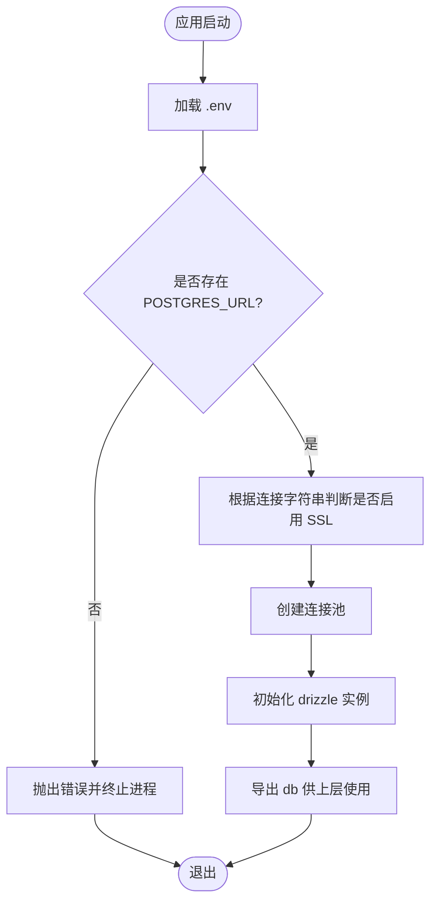
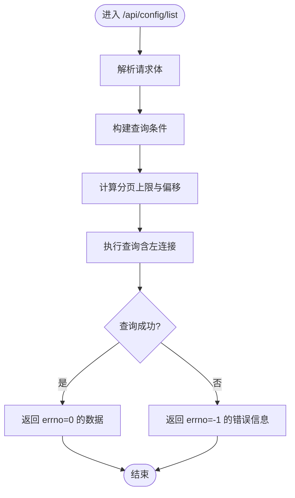
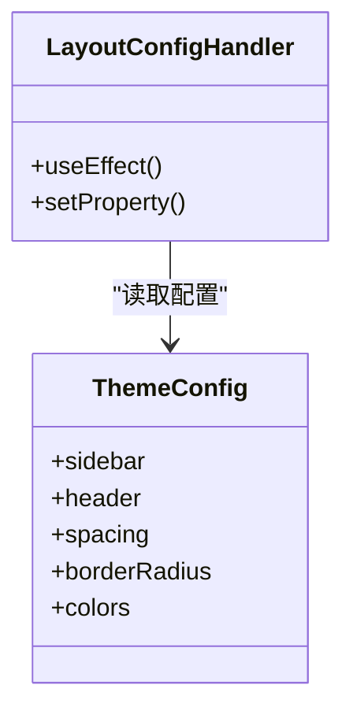
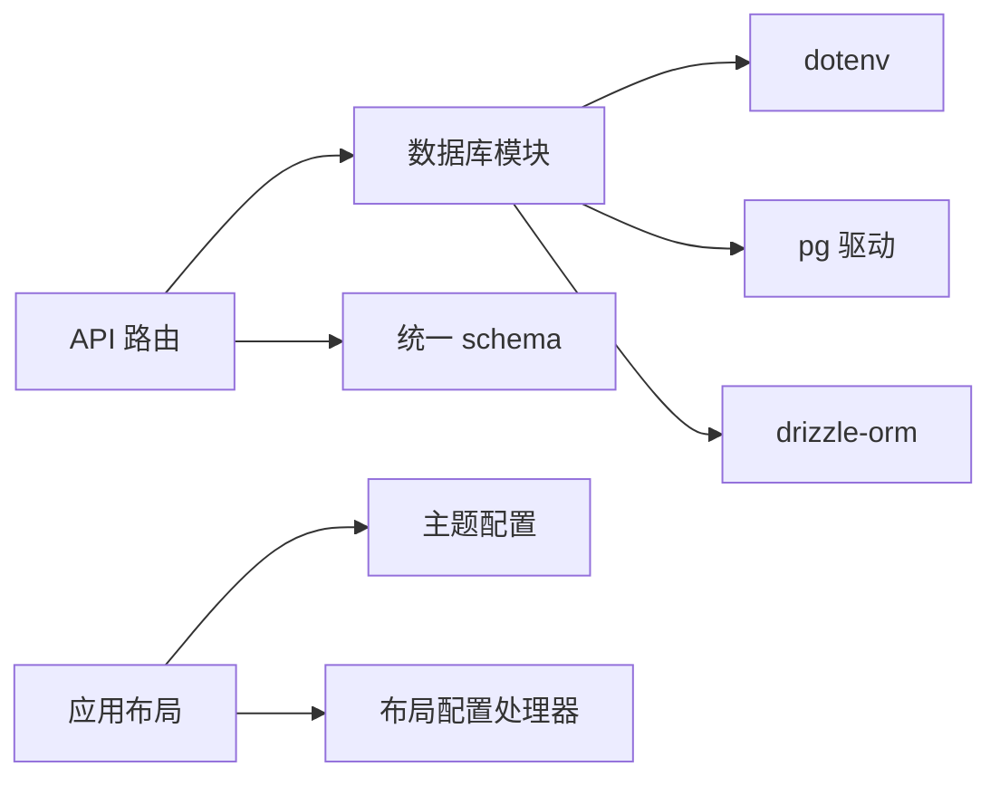

# 环境配置

<cite>
**本文引用的文件**
- [package.json](file://package.json)
- [next.config.ts](file://next.config.ts)
- [src/lib/db.ts](file://src/lib/db.ts)
- [src/lib/table/schema.ts](file://src/lib/table/schema.ts)
- [src/lib/app.ts](file://src/lib/app.ts)
- [src/lib/schema.ts](file://src/lib/schema.ts)
- [src/app/api/config/list/route.ts](file://src/app/api/config/list/route.ts)
- [src/app/layout.tsx](file://src/app/layout.tsx)
- [src/config/themeConfig.ts](file://src/config/themeConfig.ts)
- [src/config/LayoutConfigHandler.tsx](file://src/config/LayoutConfigHandler.tsx)
- [README.md](file://README.md)
</cite>

## 目录
1. [简介](#简介)
2. [项目结构](#项目结构)
3. [核心组件](#核心组件)
4. [架构总览](#架构总览)
5. [详细组件分析](#详细组件分析)
6. [依赖分析](#依赖分析)
7. [性能考虑](#性能考虑)
8. [故障排查指南](#故障排查指南)
9. [结论](#结论)
10. [附录](#附录)

## 简介
本指南面向需要正确配置项目运行环境的开发者与运维人员，围绕开发、测试、生产三类环境，系统讲解环境变量的定义、使用方式、安全存储与验证方法；覆盖数据库连接、API 密钥管理、第三方服务配置；并提供 Docker 环境配置、容器化部署准备与环境切换策略建议。文档以仓库现有实现为依据，结合最佳实践给出可操作的配置方案。

## 项目结构
本项目基于 Next.js App Router 构建，采用“按功能分层”的组织方式：页面与 API 路由位于 src/app 下，通用业务逻辑与数据访问位于 src/lib，主题与布局配置位于 src/config。数据库通过 Drizzle ORM 连接 PostgreSQL，并在启动时加载 .env 变量。

**图示来源**
- [src/app/layout.tsx:16-31](file://src/app/layout.tsx#L16-L31)
- [src/config/themeConfig.ts:1-30](file://src/config/themeConfig.ts#L1-L30)
- [src/config/LayoutConfigHandler.tsx:1-29](file://src/config/LayoutConfigHandler.tsx#L1-L29)
- [src/lib/db.ts:1-19](file://src/lib/db.ts#L1-L19)
- [src/lib/table/schema.ts:1-25](file://src/lib/table/schema.ts#L1-L25)
- [src/lib/app.ts:1-8](file://src/lib/app.ts#L1-L8)
- [src/lib/schema.ts:1-24](file://src/lib/schema.ts#L1-L24)
- [src/app/api/config/list/route.ts:1-77](file://src/app/api/config/list/route.ts#L1-L77)
- [next.config.ts:1-25](file://next.config.ts#L1-L25)
- [package.json:1-79](file://package.json#L1-L79)

**章节来源**
- [src/app/layout.tsx:16-31](file://src/app/layout.tsx#L16-L31)
- [src/config/themeConfig.ts:1-30](file://src/config/themeConfig.ts#L1-L30)
- [src/config/LayoutConfigHandler.tsx:1-29](file://src/config/LayoutConfigHandler.tsx#L1-L29)
- [src/lib/db.ts:1-19](file://src/lib/db.ts#L1-L19)
- [src/lib/table/schema.ts:1-25](file://src/lib/table/schema.ts#L1-L25)
- [src/lib/app.ts:1-8](file://src/lib/app.ts#L1-L8)
- [src/lib/schema.ts:1-24](file://src/lib/schema.ts#L1-L24)
- [src/app/api/config/list/route.ts:1-77](file://src/app/api/config/list/route.ts#L1-L77)
- [next.config.ts:1-25](file://next.config.ts#L1-L25)
- [package.json:1-79](file://package.json#L1-L79)

## 核心组件
- 数据库连接与初始化
  - 在数据库模块中加载 .env 并校验关键变量，根据连接字符串自动判断是否启用 SSL，随后建立连接池并导出 drizzle 实例供上层使用。
- API 路由
  - 列表 API 从请求体解析筛选条件，拼装查询条件，执行分页查询并返回结果。
- 主题与布局配置
  - 通过主题配置对象与布局处理器，将设计令牌注入到 CSS 变量，实现全局样式与布局的统一。

**章节来源**
- [src/lib/db.ts:1-19](file://src/lib/db.ts#L1-L19)
- [src/app/api/config/list/route.ts:1-77](file://src/app/api/config/list/route.ts#L1-L77)
- [src/config/themeConfig.ts:1-30](file://src/config/themeConfig.ts#L1-L30)
- [src/config/LayoutConfigHandler.tsx:1-29](file://src/config/LayoutConfigHandler.tsx#L1-L29)

## 架构总览
下图展示从浏览器到数据库的典型请求链路，以及环境变量在其中的作用点（如数据库连接）。

**图示来源**
- [src/app/api/config/list/route.ts:1-77](file://src/app/api/config/list/route.ts#L1-L77)
- [src/lib/db.ts:1-19](file://src/lib/db.ts#L1-L19)

## 详细组件分析

### 数据库连接与环境变量
- 关键环境变量
  - POSTGRES_URL：数据库连接字符串，用于创建连接池与初始化 drizzle。
- 初始化流程
  - 启动时加载 .env；若缺少关键变量则抛错中断；根据连接字符串判断是否启用 SSL；创建连接池并导出 db 实例。
- 安全与兼容性
  - 对特定托管平台的连接字符串进行特殊处理（例如自动禁用证书校验），提升兼容性但需确保传输安全。

**图示来源**
- [src/lib/db.ts:1-19](file://src/lib/db.ts#L1-L19)

**章节来源**
- [src/lib/db.ts:1-19](file://src/lib/db.ts#L1-L19)

### API 列表查询与参数校验
- 请求体参数
  - name、appId、version（模糊/精确匹配）、page、pageSize（限制最大值）。
- 查询逻辑
  - 动态拼接 where 条件；计算分页偏移与上限；左连接应用表获取应用名；按时间倒序返回。
- 错误处理
  - 捕获异常并返回标准化错误响应，状态码 500。

**图示来源**
- [src/app/api/config/list/route.ts:1-77](file://src/app/api/config/list/route.ts#L1-L77)

**章节来源**
- [src/app/api/config/list/route.ts:1-77](file://src/app/api/config/list/route.ts#L1-L77)

### 主题与布局配置
- 主题配置对象集中定义品牌色、尺寸、圆角等设计令牌。
- 布局处理器在客户端挂载时将这些令牌写入 CSS 变量，从而影响全局样式。

**图示来源**
- [src/config/themeConfig.ts:1-30](file://src/config/themeConfig.ts#L1-L30)
- [src/config/LayoutConfigHandler.tsx:1-29](file://src/config/LayoutConfigHandler.tsx#L1-L29)

**章节来源**
- [src/config/themeConfig.ts:1-30](file://src/config/themeConfig.ts#L1-L30)
- [src/config/LayoutConfigHandler.tsx:1-29](file://src/config/LayoutConfigHandler.tsx#L1-L29)

### 构建与运行配置
- Next 配置
  - Webpack 扩展 SVG 处理；Turbopack 规则同样配置 SVG loader。
- 包与脚本
  - 提供数据库迁移与本地数据库工具命令；依赖 dotenv 用于加载环境变量。

**章节来源**
- [next.config.ts:1-25](file://next.config.ts#L1-L25)
- [package.json:1-79](file://package.json#L1-L79)

## 依赖分析
- 组件耦合
  - API 路由依赖数据库模块与统一 schema；数据库模块依赖 .env 与连接字符串；布局配置与主题配置解耦于业务逻辑。
- 外部依赖
  - PostgreSQL 驱动与 ORM；dotenv；构建工具链。

**图示来源**
- [src/app/api/config/list/route.ts:1-77](file://src/app/api/config/list/route.ts#L1-L77)
- [src/lib/db.ts:1-19](file://src/lib/db.ts#L1-L19)
- [src/lib/schema.ts:1-24](file://src/lib/schema.ts#L1-L24)
- [src/app/layout.tsx:16-31](file://src/app/layout.tsx#L16-L31)
- [src/config/themeConfig.ts:1-30](file://src/config/themeConfig.ts#L1-L30)
- [src/config/LayoutConfigHandler.tsx:1-29](file://src/config/LayoutConfigHandler.tsx#L1-L29)

**章节来源**
- [src/app/api/config/list/route.ts:1-77](file://src/app/api/config/list/route.ts#L1-L77)
- [src/lib/db.ts:1-19](file://src/lib/db.ts#L1-L19)
- [src/lib/schema.ts:1-24](file://src/lib/schema.ts#L1-L24)
- [src/app/layout.tsx:16-31](file://src/app/layout.tsx#L16-L31)
- [src/config/themeConfig.ts:1-30](file://src/config/themeConfig.ts#L1-L30)
- [src/config/LayoutConfigHandler.tsx:1-29](file://src/config/LayoutConfigHandler.tsx#L1-L29)

## 性能考虑
- 数据库连接池
  - 使用连接池减少频繁创建/销毁连接的开销；合理设置池大小与超时。
- 分页与查询
  - 限制每页最大条数，避免一次性返回过多数据；对常用过滤字段建立索引。
- 构建与资源
  - SVG 作为组件引入时，确保仅在必要场景使用，避免不必要的打包体积。

[本节为通用指导，不直接分析具体文件]

## 故障排查指南
- 数据库连接失败
  - 确认 POSTGRES_URL 是否存在且格式正确；检查目标数据库可达性与凭据；若使用特定托管平台，确认 SSL 设置。
- API 返回错误
  - 查看 API 路由日志，定位异常堆栈；确认请求体参数类型与范围；检查数据库权限与表结构。
- 环境变量未生效
  - 确认 .env 文件路径与命名；确保在数据库模块初始化前调用加载；避免在客户端直接暴露敏感变量。

**章节来源**
- [src/lib/db.ts:1-19](file://src/lib/db.ts#L1-L19)
- [src/app/api/config/list/route.ts:67-76](file://src/app/api/config/list/route.ts#L67-L76)

## 结论
本项目以明确的模块边界与清晰的初始化流程支撑了数据库访问与 API 查询能力。建议在实际部署中完善环境变量的分层管理、安全存储与验证机制，并结合容器编排实现稳定的环境切换与发布策略。

[本节为总结性内容，不直接分析具体文件]

## 附录

### 开发/测试/生产环境配置差异建议
- 开发环境
  - 使用本地或受控的测试数据库实例；开启严格日志与断点；允许较宽松的 CORS 与调试输出。
- 测试环境
  - 使用独立的测试数据库快照；隔离 API 密钥与第三方服务凭据；启用最小化日志级别。
- 生产环境
  - 使用只读/受限账号；启用强制 SSL；限制 API 访问频率；严格控制日志输出与敏感信息脱敏。

[本节为通用指导，不直接分析具体文件]

### 环境变量定义与使用方法
- 定义位置
  - 在项目根目录放置 .env 文件；不同环境使用 .env.development/.env.production 等命名区分。
- 加载时机
  - 在数据库模块初始化前加载 .env；避免在客户端直接消费敏感变量。
- 使用范围
  - 服务器端路由与数据库初始化处使用；前端仅消费经后端提供的非敏感配置。

**章节来源**
- [src/lib/db.ts:6](file://src/lib/db.ts#L6)

### 安全存储与最佳实践
- 不将敏感变量提交至版本库；使用密钥管理服务或平台提供的机密存储。
- 为不同环境生成独立的密钥与访问凭据；定期轮换。
- 限制变量的可见范围与权限；避免在日志中打印敏感值。

[本节为通用指导，不直接分析具体文件]

### 数据库连接配置要点
- 连接字符串
  - 包含主机、端口、数据库名、用户名与密码；支持查询参数（如 SSL 选项）。
- 连接池
  - 合理设置最大连接数、空闲超时与获取超时；监控连接池健康状态。
- SSL 与托管平台
  - 针对特定托管平台调整证书校验策略；确保传输加密。

**章节来源**
- [src/lib/db.ts:12-16](file://src/lib/db.ts#L12-L16)

### API 密钥与第三方服务配置
- 密钥管理
  - 将第三方 API 密钥存放在受控机密存储中；通过环境变量注入到运行时。
- 限流与降级
  - 对外部服务调用实施限流与熔断；在密钥缺失或不可用时提供降级策略。

[本节为通用指导，不直接分析具体文件]

### Docker 环境配置与容器化部署准备
- 镜像构建
  - 使用多阶段构建减少镜像体积；在构建阶段安装依赖，在运行阶段仅包含产物与运行时。
- 环境变量注入
  - 通过镜像构建参数或运行时环境变量注入 .env 内容；避免硬编码。
- 健康检查与启动顺序
  - 添加数据库健康检查；确保数据库就绪后再启动应用；设置合理的重启策略。

[本节为通用指导，不直接分析具体文件]

### 环境切换策略
- 命名规范
  - 使用 .env.development、.env.staging、.env.production 等命名区分环境。
- CI/CD 集成
  - 在流水线中按环境注入对应密钥与配置；对生产发布进行审批与审计。
- 快速回滚
  - 保留最近 N 次发布配置；在问题出现时快速回滚到稳定版本。

[本节为通用指导，不直接分析具体文件]

### 配置验证方法
- 启动时校验
  - 在应用启动阶段对关键变量进行存在性与格式校验；失败时立即终止进程。
- 运行时验证
  - 对外部服务可用性进行探测；对数据库连接进行 ping；记录异常并告警。

[本节为通用指导，不直接分析具体文件]