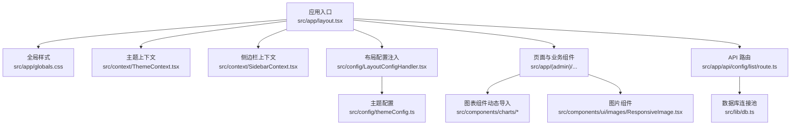
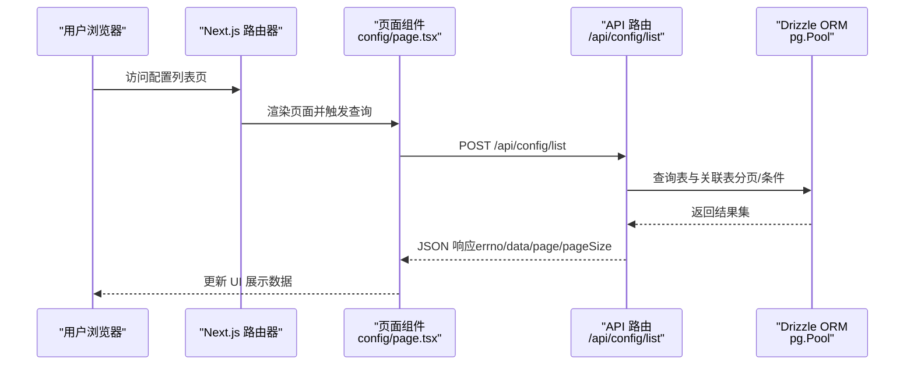
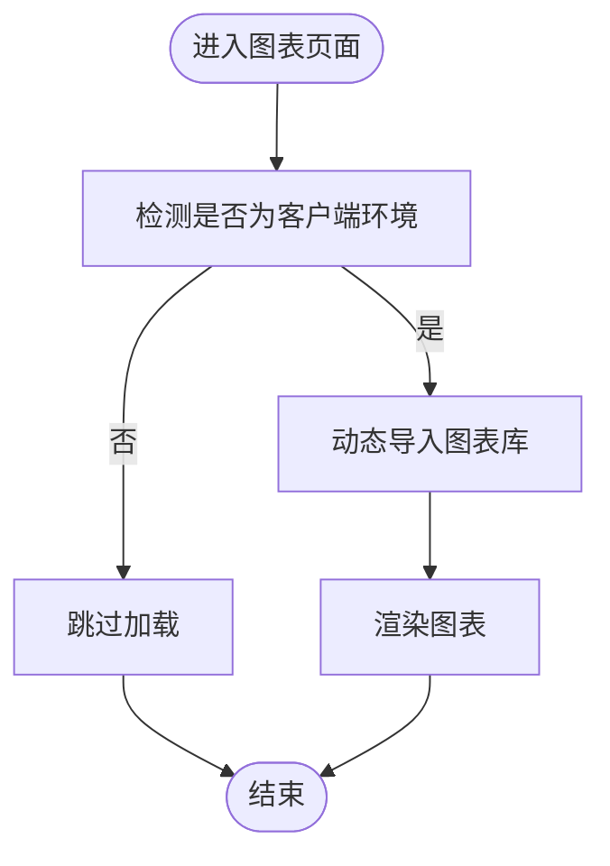
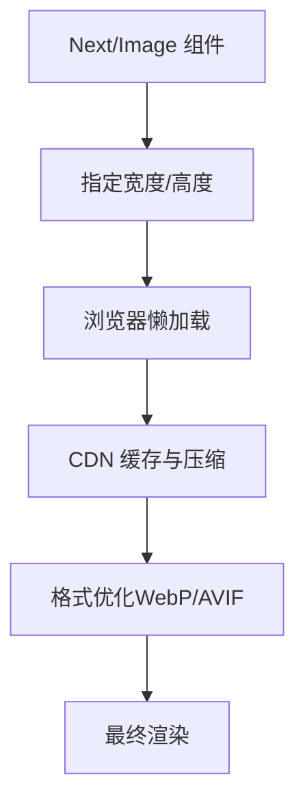
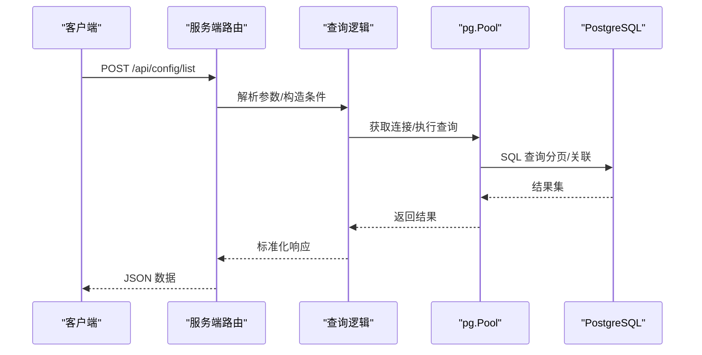
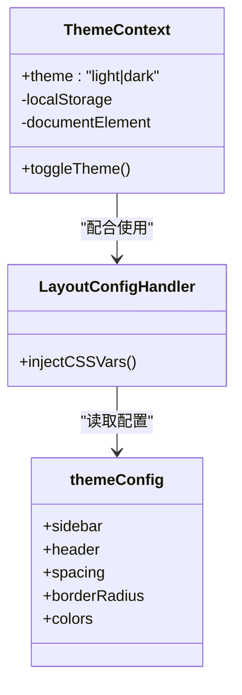
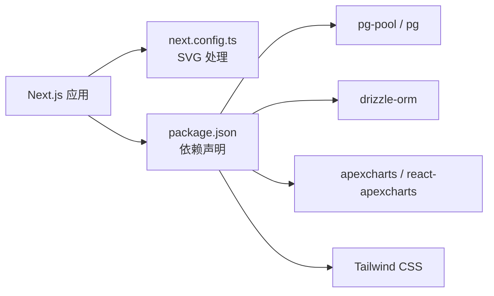

# 生产优化

<cite>
**本文引用的文件**
- [next.config.ts](file://next.config.ts)
- [package.json](file://package.json)
- [src/lib/db.ts](file://src/lib/db.ts)
- [src/app/layout.tsx](file://src/app/layout.tsx)
- [src/app/globals.css](file://src/app/globals.css)
- [src/context/ThemeContext.tsx](file://src/context/ThemeContext.tsx)
- [src/context/SidebarContext.tsx](file://src/context/SidebarContext.tsx)
- [src/config/LayoutConfigHandler.tsx](file://src/config/LayoutConfigHandler.tsx)
- [src/config/themeConfig.ts](file://src/config/themeConfig.ts)
- [src/app/api/config/list/route.ts](file://src/app/api/config/list/route.ts)
- [src/components/charts/bar/BarChartOne.tsx](file://src/components/charts/bar/BarChartOne.tsx)
- [src/components/charts/line/LineChartOne.tsx](file://src/components/charts/line/LineChartOne.tsx)
- [src/components/ecommerce/MonthlyTarget.tsx](file://src/components/ecommerce/MonthlyTarget.tsx)
- [src/components/ui/images/ResponsiveImage.tsx](file://src/components/ui/images/ResponsiveImage.tsx)
- [src/app/(admin)/(others-pages)/(scene)/config/page.tsx](file://src/app/(admin)/(others-pages)/(scene)/config/page.tsx)
- [src/app/(admin)/(others-pages)/(scene)/config/new/page.tsx](file://src/app/(admin)/(others-pages)/(scene)/config/new/page.tsx)
</cite>

## 目录
1. [引言](#引言)
2. [项目结构](#项目结构)
3. [核心组件](#核心组件)
4. [架构总览](#架构总览)
5. [详细组件分析](#详细组件分析)
6. [依赖关系分析](#依赖关系分析)
7. [性能考虑](#性能考虑)
8. [故障排查指南](#故障排查指南)
9. [结论](#结论)
10. [附录](#附录)

## 引言
本指南面向需要在生产环境中稳定高效运行的运维人员，围绕该 Next.js 管理系统给出“生产优化”的综合实践建议。内容涵盖性能优化（代码分割、图片与静态资源优化、缓存策略）、CDN 与负载均衡、数据库连接池优化、监控与日志、错误追踪与性能指标、安全加固（HTTPS、CORS、安全头）、备份与灾难恢复、版本回滚等。

## 项目结构
该项目采用 Next.js App Router 的目录组织方式，前端样式通过 Tailwind CSS v4 与自定义主题变量实现，数据库访问使用 Drizzle ORM + PostgreSQL 连接池，图表组件按需动态加载以降低首屏体积。

**图示来源**
- [src/app/layout.tsx:16-31](file://src/app/layout.tsx#L16-L31)
- [src/app/globals.css:1-20](file://src/app/globals.css#L1-L20)
- [src/context/ThemeContext.tsx:15-49](file://src/context/ThemeContext.tsx#L15-L49)
- [src/context/SidebarContext.tsx:27-83](file://src/context/SidebarContext.tsx#L27-L83)
- [src/config/LayoutConfigHandler.tsx:6-26](file://src/config/LayoutConfigHandler.tsx#L6-L26)
- [src/config/themeConfig.ts:4-30](file://src/config/themeConfig.ts#L4-L30)
- [src/app/api/config/list/route.ts:1-77](file://src/app/api/config/list/route.ts#L1-L77)
- [src/lib/db.ts:1-19](file://src/lib/db.ts#L1-L19)
- [src/components/charts/bar/BarChartOne.tsx:8-10](file://src/components/charts/bar/BarChartOne.tsx#L8-L10)
- [src/components/ui/images/ResponsiveImage.tsx:8-15](file://src/components/ui/images/ResponsiveImage.tsx#L8-L15)

**章节来源**
- [src/app/layout.tsx:16-31](file://src/app/layout.tsx#L16-L31)
- [src/app/globals.css:1-20](file://src/app/globals.css#L1-L20)
- [src/context/ThemeContext.tsx:15-49](file://src/context/ThemeContext.tsx#L15-L49)
- [src/context/SidebarContext.tsx:27-83](file://src/context/SidebarContext.tsx#L27-L83)
- [src/config/LayoutConfigHandler.tsx:6-26](file://src/config/LayoutConfigHandler.tsx#L6-L26)
- [src/config/themeConfig.ts:4-30](file://src/config/themeConfig.ts#L4-L30)
- [src/app/api/config/list/route.ts:1-77](file://src/app/api/config/list/route.ts#L1-L77)
- [src/lib/db.ts:1-19](file://src/lib/db.ts#L1-L19)
- [src/components/charts/bar/BarChartOne.tsx:8-10](file://src/components/charts/bar/BarChartOne.tsx#L8-L10)
- [src/components/ui/images/ResponsiveImage.tsx:8-15](file://src/components/ui/images/ResponsiveImage.tsx#L8-L15)

## 核心组件
- 布局与主题
  - 根布局负责字体、全局样式、主题切换上下文、侧边栏上下文与通知组件挂载。
  - 主题配置通过 CSS 自定义属性注入，支持暗色模式与布局尺寸。
- 数据层
  - 使用 Drizzle ORM + pg Pool 构建连接池，自动根据连接字符串判断是否启用 SSL。
- 图表与图片
  - 图表组件采用 next/dynamic 按需加载，减少首屏 JS 体积。
  - 图片组件使用 Next/Image 并设置宽高，利于浏览器计算布局与懒加载。
- API 路由
  - 列表查询接口支持分页、条件过滤与关联查询，返回标准化响应体。

**章节来源**
- [src/app/layout.tsx:16-31](file://src/app/layout.tsx#L16-L31)
- [src/context/ThemeContext.tsx:15-49](file://src/context/ThemeContext.tsx#L15-L49)
- [src/context/SidebarContext.tsx:27-83](file://src/context/SidebarContext.tsx#L27-L83)
- [src/config/LayoutConfigHandler.tsx:6-26](file://src/config/LayoutConfigHandler.tsx#L6-L26)
- [src/lib/db.ts:12-16](file://src/lib/db.ts#L12-L16)
- [src/components/charts/line/LineChartOne.tsx:8-10](file://src/components/charts/line/LineChartOne.tsx#L8-L10)
- [src/components/ui/images/ResponsiveImage.tsx:8-15](file://src/components/ui/images/ResponsiveImage.tsx#L8-L15)
- [src/app/api/config/list/route.ts:7-66](file://src/app/api/config/list/route.ts#L7-L66)

## 架构总览
下图展示从客户端到数据库的典型请求链路，以及关键优化点（按需渲染、连接池、静态资源处理）。

**图示来源**
- [src/app/(admin)/(others-pages)/(scene)/config/page.tsx](file://src/app/(admin)/(others-pages)/(scene)/config/page.tsx#L64-L93)
- [src/app/api/config/list/route.ts:7-66](file://src/app/api/config/list/route.ts#L7-L66)
- [src/lib/db.ts:1-19](file://src/lib/db.ts#L1-L19)

## 详细组件分析

### 组件一：按需加载的图表组件
- 动态导入策略
  - 通过 next/dynamic 在客户端按需加载图表库，避免 SSR 期间引入大型依赖。
  - 关键路径参考：[src/components/charts/bar/BarChartOne.tsx:8-10](file://src/components/charts/bar/BarChartOne.tsx#L8-L10)、[src/components/charts/line/LineChartOne.tsx:8-10](file://src/components/charts/line/LineChartOne.tsx#L8-L10)、[src/components/ecommerce/MonthlyTarget.tsx:10-13](file://src/components/ecommerce/MonthlyTarget.tsx#L10-L13)。
- 性能收益
  - 减少首屏 JS 体积，提升 TTFB 与交互时间；仅在需要时下载图表库。

**图示来源**
- [src/components/charts/bar/BarChartOne.tsx:8-10](file://src/components/charts/bar/BarChartOne.tsx#L8-L10)
- [src/components/charts/line/LineChartOne.tsx:8-10](file://src/components/charts/line/LineChartOne.tsx#L8-L10)
- [src/components/ecommerce/MonthlyTarget.tsx:10-13](file://src/components/ecommerce/MonthlyTarget.tsx#L10-L13)

**章节来源**
- [src/components/charts/bar/BarChartOne.tsx:8-10](file://src/components/charts/bar/BarChartOne.tsx#L8-L10)
- [src/components/charts/line/LineChartOne.tsx:8-10](file://src/components/charts/line/LineChartOne.tsx#L8-L10)
- [src/components/ecommerce/MonthlyTarget.tsx:10-13](file://src/components/ecommerce/MonthlyTarget.tsx#L10-L13)

### 组件二：图片组件与静态资源优化
- 使用 Next/Image 并显式指定宽高，可获得自动的布局稳定性与懒加载。
- 关键路径参考：[src/components/ui/images/ResponsiveImage.tsx:8-15](file://src/components/ui/images/ResponsiveImage.tsx#L8-L15)。
- 建议
  - 对于大量图片场景，结合 WebP/AVIF 格式与多尺寸裁剪；利用 CDN 缓存与压缩。

**图示来源**
- [src/components/ui/images/ResponsiveImage.tsx:8-15](file://src/components/ui/images/ResponsiveImage.tsx#L8-L15)

**章节来源**
- [src/components/ui/images/ResponsiveImage.tsx:8-15](file://src/components/ui/images/ResponsiveImage.tsx#L8-L15)

### 组件三：数据库连接池与查询接口
- 连接池
  - 使用 pg.Pool 创建连接池，并根据连接字符串判断是否启用 SSL。
  - 关键路径参考：[src/lib/db.ts:12-16](file://src/lib/db.ts#L12-L16)。
- API 查询
  - 支持多条件过滤、分页限制（1-100）、关联查询与标准化响应。
  - 关键路径参考：[src/app/api/config/list/route.ts:7-66](file://src/app/api/config/list/route.ts#L7-L66)。

**图示来源**
- [src/app/api/config/list/route.ts:7-66](file://src/app/api/config/list/route.ts#L7-L66)
- [src/lib/db.ts:12-16](file://src/lib/db.ts#L12-L16)

**章节来源**
- [src/lib/db.ts:12-16](file://src/lib/db.ts#L12-L16)
- [src/app/api/config/list/route.ts:7-66](file://src/app/api/config/list/route.ts#L7-L66)

### 组件四：主题与布局配置
- 主题上下文
  - 客户端保存主题偏好至本地存储，并在文档根元素上切换 dark 类名。
  - 关键路径参考：[src/context/ThemeContext.tsx:21-39](file://src/context/ThemeContext.tsx#L21-L39)。
- 布局配置注入
  - 将主题配置映射为 CSS 自定义属性，实现全局布局变量生效。
  - 关键路径参考：[src/config/LayoutConfigHandler.tsx:6-26](file://src/config/LayoutConfigHandler.tsx#L6-L26)、[src/config/themeConfig.ts:4-30](file://src/config/themeConfig.ts#L4-L30)。

**图示来源**
- [src/context/ThemeContext.tsx:15-49](file://src/context/ThemeContext.tsx#L15-L49)
- [src/config/LayoutConfigHandler.tsx:6-26](file://src/config/LayoutConfigHandler.tsx#L6-L26)
- [src/config/themeConfig.ts:4-30](file://src/config/themeConfig.ts#L4-L30)

**章节来源**
- [src/context/ThemeContext.tsx:21-39](file://src/context/ThemeContext.tsx#L21-L39)
- [src/config/LayoutConfigHandler.tsx:6-26](file://src/config/LayoutConfigHandler.tsx#L6-L26)
- [src/config/themeConfig.ts:4-30](file://src/config/themeConfig.ts#L4-L30)

## 依赖关系分析
- 构建与打包
  - 通过 next.config.ts 注册 SVG 处理规则，便于在组件中直接使用 SVG。
  - 关键路径参考：[next.config.ts:5-11](file://next.config.ts#L5-L11)。
- 运行时依赖
  - 包含 React、Next.js、Tailwind CSS、apexcharts、react-apexcharts、pg、drizzle-orm 等。
  - 关键路径参考：[package.json:15-49](file://package.json#L15-L49)。
- 锁定文件
  - pnpm-lock.yaml 显示 pg-pool、pg、sharp 等底层依赖版本，有助于生产一致性与安全审计。
  - 关键路径参考：[pnpm-lock.yaml:3807-3810](file://pnpm-lock.yaml#L3807-L3810)。

**图示来源**
- [next.config.ts:5-11](file://next.config.ts#L5-L11)
- [package.json:15-49](file://package.json#L15-L49)
- [pnpm-lock.yaml:3807-3810](file://pnpm-lock.yaml#L3807-L3810)

**章节来源**
- [next.config.ts:5-11](file://next.config.ts#L5-L11)
- [package.json:15-49](file://package.json#L15-L49)
- [pnpm-lock.yaml:3807-3810](file://pnpm-lock.yaml#L3807-L3810)

## 性能考虑
- 代码分割与按需加载
  - 图表组件已使用 next/dynamic 实现客户端按需加载，建议对其他重型第三方库同样采用动态导入策略。
  - 参考：[src/components/charts/bar/BarChartOne.tsx:8-10](file://src/components/charts/bar/BarChartOne.tsx#L8-L10)、[src/components/charts/line/LineChartOne.tsx:8-10](file://src/components/charts/line/LineChartOne.tsx#L8-L10)、[src/components/ecommerce/MonthlyTarget.tsx:10-13](file://src/components/ecommerce/MonthlyTarget.tsx#L10-L13)。
- 图片与静态资源
  - 使用 Next/Image 并设置宽高；建议结合 CDN 与现代图片格式（WebP/AVIF）进一步优化。
  - 参考：[src/components/ui/images/ResponsiveImage.tsx:8-15](file://src/components/ui/images/ResponsiveImage.tsx#L8-L15)。
- 缓存策略
  - 静态资源与构建产物建议开启长期缓存与版本化命名；API 响应可设置合理的 Cache-Control。
  - 参考：[src/app/api/config/list/route.ts:61-66](file://src/app/api/config/list/route.ts#L61-L66)。
- 数据库连接池
  - 已使用 pg.Pool；建议在生产中配置最大连接数、空闲超时、获取超时等参数，并监控连接池命中率与等待时间。
  - 参考：[src/lib/db.ts:12-16](file://src/lib/db.ts#L12-L16)。
- 构建与打包
  - 保持 Next.js 最新稳定版，启用生产构建；SVG 已通过 @svgr/webpack 处理，避免 SSR 中的体积膨胀。
  - 参考：[next.config.ts:5-11](file://next.config.ts#L5-L11)、[package.json:50-66](file://package.json#L50-L66)。

**章节来源**
- [src/components/charts/bar/BarChartOne.tsx:8-10](file://src/components/charts/bar/BarChartOne.tsx#L8-L10)
- [src/components/charts/line/LineChartOne.tsx:8-10](file://src/components/charts/line/LineChartOne.tsx#L8-L10)
- [src/components/ecommerce/MonthlyTarget.tsx:10-13](file://src/components/ecommerce/MonthlyTarget.tsx#L10-L13)
- [src/components/ui/images/ResponsiveImage.tsx:8-15](file://src/components/ui/images/ResponsiveImage.tsx#L8-L15)
- [src/app/api/config/list/route.ts:61-66](file://src/app/api/config/list/route.ts#L61-L66)
- [src/lib/db.ts:12-16](file://src/lib/db.ts#L12-L16)
- [next.config.ts:5-11](file://next.config.ts#L5-L11)
- [package.json:50-66](file://package.json#L50-L66)

## 故障排查指南
- 数据库连接异常
  - 现象：启动时报错提示缺少 POSTGRES_URL 或连接失败。
  - 排查：确认环境变量存在且连接字符串正确；若为特定托管服务（如 neon.tech），SSL 配置会自动调整。
  - 参考：[src/lib/db.ts:7-16](file://src/lib/db.ts#L7-L16)。
- API 查询错误
  - 现象：列表查询返回错误码与消息。
  - 排查：检查请求体字段、分页参数范围（1-100）、SQL 条件拼接；查看服务端日志定位异常。
  - 参考：[src/app/api/config/list/route.ts:67-76](file://src/app/api/config/list/route.ts#L67-L76)。
- 图表不显示或空白
  - 现象：图表组件未渲染。
  - 排查：确认动态导入是否成功、客户端环境判断、图表容器尺寸；避免在 SSR 期间渲染重型组件。
  - 参考：[src/components/charts/line/LineChartOne.tsx:8-10](file://src/components/charts/line/LineChartOne.tsx#L8-L10)。
- 主题切换无效
  - 现象：切换主题后未持久化或未更新 DOM。
  - 排查：确认本地存储可用、documentElement 上的 dark 类名切换逻辑。
  - 参考：[src/context/ThemeContext.tsx:30-39](file://src/context/ThemeContext.tsx#L30-L39)。

**章节来源**
- [src/lib/db.ts:7-16](file://src/lib/db.ts#L7-L16)
- [src/app/api/config/list/route.ts:67-76](file://src/app/api/config/list/route.ts#L67-L76)
- [src/components/charts/line/LineChartOne.tsx:8-10](file://src/components/charts/line/LineChartOne.tsx#L8-L10)
- [src/context/ThemeContext.tsx:30-39](file://src/context/ThemeContext.tsx#L30-L39)

## 结论
本项目在前端按需加载、图片优化与数据库连接池方面已有良好基础。生产部署建议在此基础上完善 CDN 与缓存策略、监控与日志体系、安全加固与灾备方案，并持续关注依赖升级与性能回归测试，以确保系统在高并发与复杂业务场景下的稳定性与可维护性。

## 附录
- 生产环境建议清单（概要）
  - CDN 与缓存：静态资源长期缓存、API 合理缓存控制、边缘压缩与图片格式优化。
  - 负载均衡：多实例部署、健康检查、会话亲和或无状态设计。
  - 数据库：连接池参数调优、慢查询监控、只读副本与备份策略。
  - 监控与日志：APM/Trace、指标采集（QPS/响应时间/P95）、日志聚合与告警。
  - 安全：强制 HTTPS、CORS 白名单、安全响应头、输入校验与权限控制。
  - 备份与回滚：自动化备份、蓝绿/金丝雀发布、快速回滚脚本与演练。