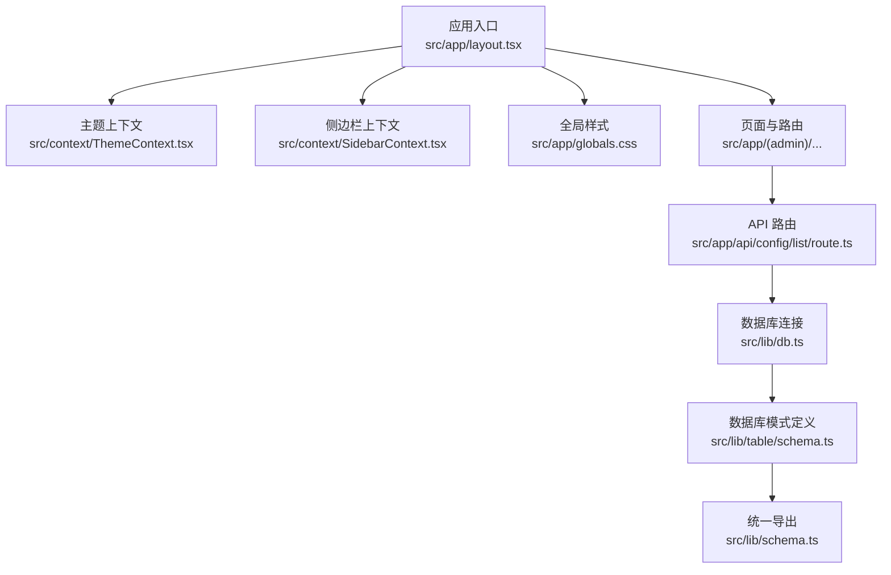
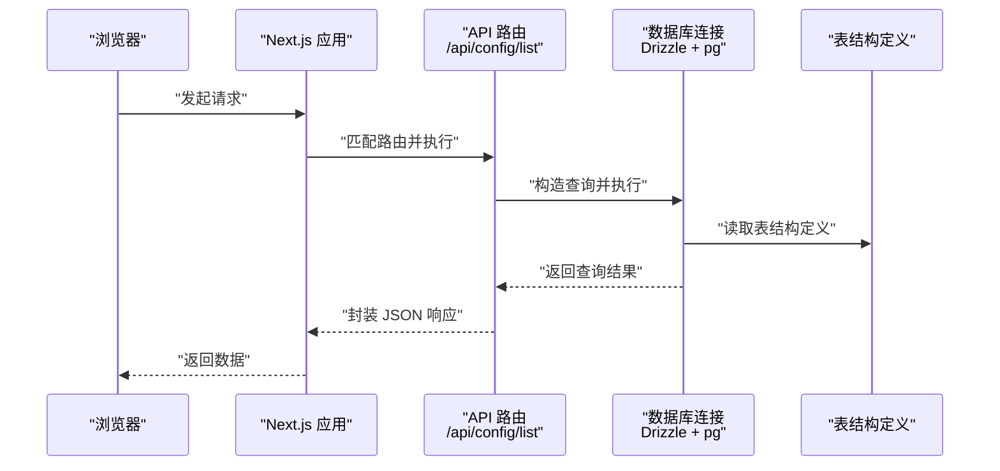
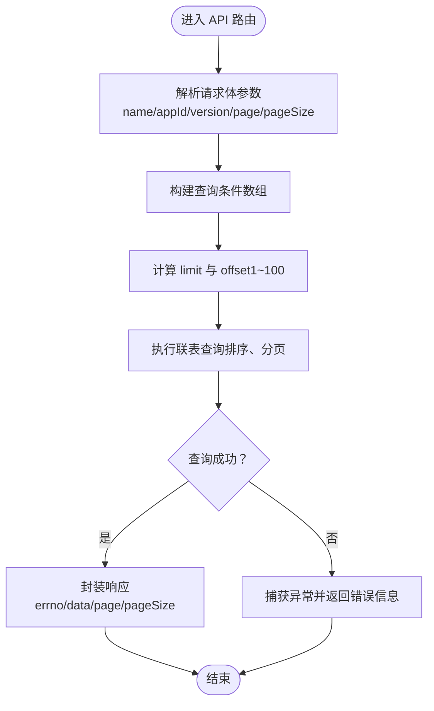
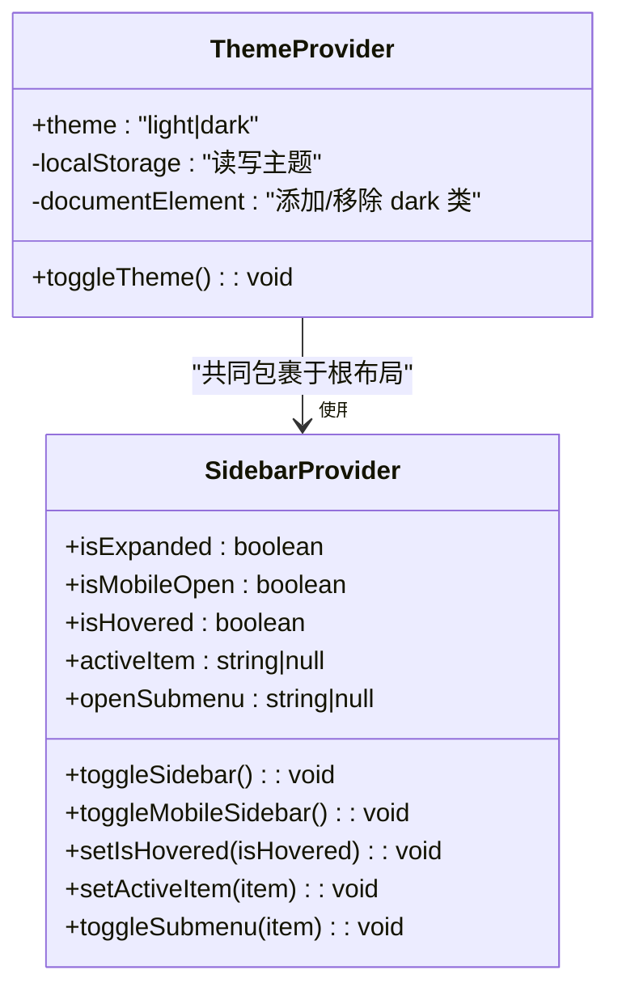
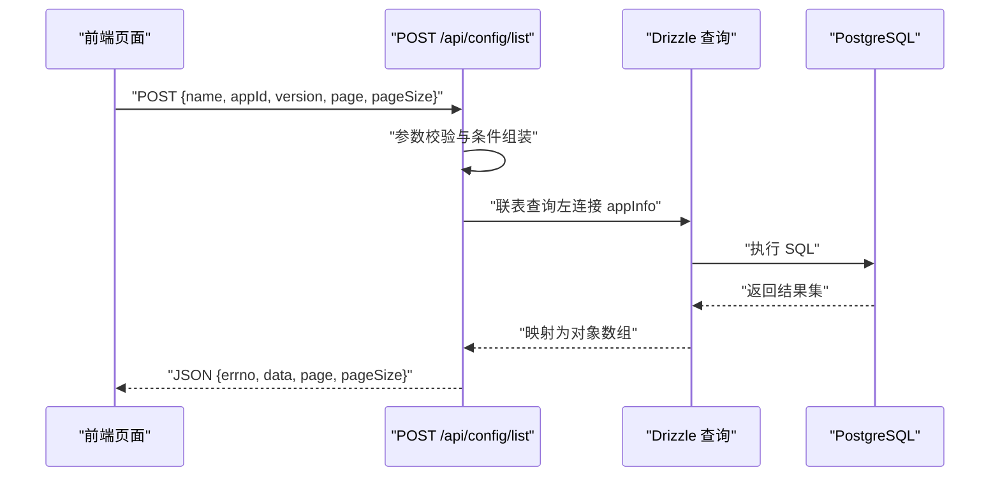
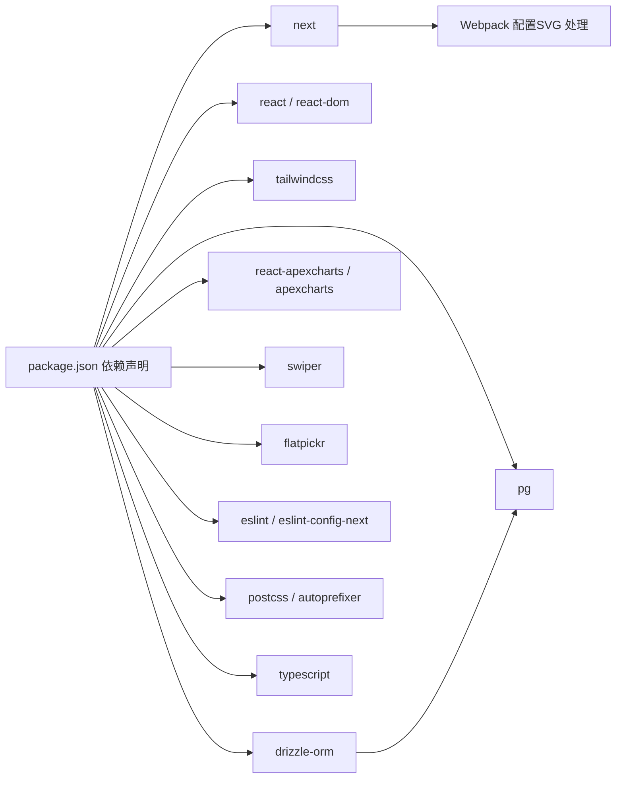
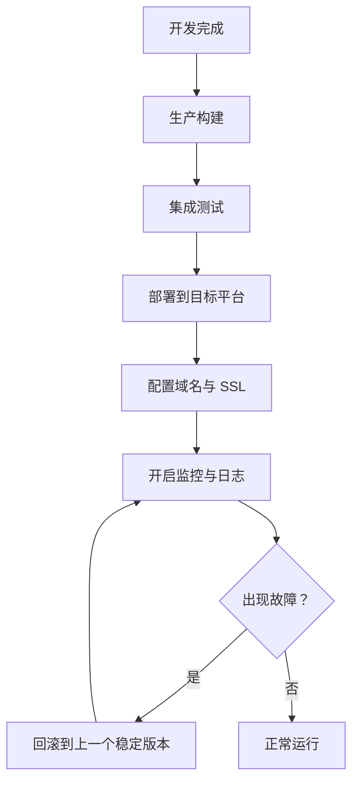

# 部署指南

<cite>
**本文引用的文件**   
- [package.json](file://package.json)
- [next.config.ts](file://next.config.ts)
- [README.md](file://README.md)
- [src/app/layout.tsx](file://src/app/layout.tsx)
- [src/lib/db.ts](file://src/lib/db.ts)
- [src/lib/schema.ts](file://src/lib/schema.ts)
- [src/lib/table/schema.ts](file://src/lib/table/schema.ts)
- [src/app/api/config/list/route.ts](file://src/app/api/config/list/route.ts)
- [src/context/ThemeContext.tsx](file://src/context/ThemeContext.tsx)
- [src/context/SidebarContext.tsx](file://src/context/SidebarContext.tsx)
- [src/hooks/useGoBack.ts](file://src/hooks/useGoBack.ts)
</cite>

## 目录
1. [简介](#简介)
2. [项目结构](#项目结构)
3. [核心组件](#核心组件)
4. [架构总览](#架构总览)
5. [详细组件分析](#详细组件分析)
6. [依赖关系分析](#依赖关系分析)
7. [性能考虑](#性能考虑)
8. [故障排查指南](#故障排查指南)
9. [结论](#结论)
10. [附录](#附录)

## 简介
本指南面向需要将该项目部署到生产环境的开发者与运维人员，覆盖生产构建配置、环境变量、域名与 SSL 配置、多平台部署流程（Vercel、Netlify、传统服务器）、性能优化与缓存策略、监控与告警、回滚策略、以及部署前检查清单与常见问题处理。项目基于 Next.js App Router、React 19、TypeScript 与 Tailwind CSS v4，采用 Drizzle ORM 连接 PostgreSQL 数据库。

## 项目结构
- 前端框架：Next.js 16（App Router）
- 样式：Tailwind CSS v4
- 类型：TypeScript
- 构建工具：Next.js 内置 Webpack（SVG 处理已通过配置启用）
- 数据层：Drizzle ORM + PostgreSQL（使用 pg 连接池）
- 开发与运行：npm 脚本（dev/build/start），支持 Node.js 18+（推荐 20+）

图表来源
- [src/app/layout.tsx:1-33](file://src/app/layout.tsx#L1-L33)
- [src/context/ThemeContext.tsx:1-59](file://src/context/ThemeContext.tsx#L1-L59)
- [src/context/SidebarContext.tsx:1-85](file://src/context/SidebarContext.tsx#L1-L85)
- [src/app/api/config/list/route.ts:1-77](file://src/app/api/config/list/route.ts#L1-L77)
- [src/lib/db.ts:1-19](file://src/lib/db.ts#L1-L19)
- [src/lib/table/schema.ts:1-26](file://src/lib/table/schema.ts#L1-L26)
- [src/lib/schema.ts:1-24](file://src/lib/schema.ts#L1-L24)

章节来源
- [README.md:41-76](file://README.md#L41-L76)
- [package.json:15-49](file://package.json#L15-L49)
- [next.config.ts:1-25](file://next.config.ts#L1-L25)

## 核心组件
- 应用根布局与字体加载：在根布局中引入 Google Fonts 并挂载主题与侧边栏上下文，确保客户端功能可用。
- 主题系统：基于本地存储持久化用户偏好，切换时更新 HTML 根元素类名以驱动暗色模式。
- 侧边栏上下文：管理展开/折叠、移动端显示、悬停状态与活动项，响应窗口尺寸变化。
- 数据库连接：通过环境变量 POSTGRES_URL 初始化连接池；对特定托管（如 neon.tech）自动启用 SSL。
- API 路由：提供分页查询接口，支持按名称、应用 ID、版本过滤，返回带应用名称的联合结果。

章节来源
- [src/app/layout.tsx:10-32](file://src/app/layout.tsx#L10-L32)
- [src/context/ThemeContext.tsx:15-50](file://src/context/ThemeContext.tsx#L15-L50)
- [src/context/SidebarContext.tsx:27-83](file://src/context/SidebarContext.tsx#L27-L83)
- [src/lib/db.ts:6-18](file://src/lib/db.ts#L6-L18)
- [src/app/api/config/list/route.ts:7-77](file://src/app/api/config/list/route.ts#L7-L77)

## 架构总览
下图展示从浏览器请求到数据库查询的整体流程，包括 API 路由、数据库连接与模式定义的关系。

图表来源
- [src/app/api/config/list/route.ts:1-77](file://src/app/api/config/list/route.ts#L1-L77)
- [src/lib/db.ts:1-19](file://src/lib/db.ts#L1-L19)
- [src/lib/table/schema.ts:1-26](file://src/lib/table/schema.ts#L1-L26)
- [src/lib/schema.ts:14-24](file://src/lib/schema.ts#L14-L24)

## 详细组件分析

### 组件一：数据库连接与模式
- 连接池初始化：从环境变量读取连接字符串，针对特定托管自动启用 SSL；导出 drizzle 实例供 API 路由使用。
- 模式定义：定义上传文件与表格配置等核心表结构，统一导出以便 API 层引用。
- API 查询：根据传入参数动态拼接 where 条件，限制分页范围，执行联表查询并返回分页数据。

图表来源
- [src/app/api/config/list/route.ts:7-77](file://src/app/api/config/list/route.ts#L7-L77)

章节来源
- [src/lib/db.ts:6-18](file://src/lib/db.ts#L6-L18)
- [src/lib/table/schema.ts:1-26](file://src/lib/table/schema.ts#L1-L26)
- [src/lib/schema.ts:14-24](file://src/lib/schema.ts#L14-L24)
- [src/app/api/config/list/route.ts:7-77](file://src/app/api/config/list/route.ts#L7-L77)

### 组件二：主题与侧边栏上下文
- 主题上下文：在客户端初始化主题状态，优先读取本地存储，切换时同步更新 DOM 类名。
- 侧边栏上下文：维护展开/折叠、移动端状态、悬停与活动项，监听窗口尺寸变化以适配移动端。

图表来源
- [src/context/ThemeContext.tsx:15-50](file://src/context/ThemeContext.tsx#L15-L50)
- [src/context/SidebarContext.tsx:27-83](file://src/context/SidebarContext.tsx#L27-L83)

章节来源
- [src/context/ThemeContext.tsx:15-50](file://src/context/ThemeContext.tsx#L15-L50)
- [src/context/SidebarContext.tsx:27-83](file://src/context/SidebarContext.tsx#L27-L83)

### 组件三：API 列表查询流程
- 请求参数校验与过滤：支持模糊匹配名称、精确匹配应用 ID 与版本。
- 分页控制：限制每页最大 100 条，最小 1 条，偏移量基于页码与大小计算。
- 联表查询：左连接应用信息表，返回应用名称字段，按创建时间倒序。

图表来源
- [src/app/api/config/list/route.ts:7-77](file://src/app/api/config/list/route.ts#L7-L77)

章节来源
- [src/app/api/config/list/route.ts:7-77](file://src/app/api/config/list/route.ts#L7-L77)

## 依赖关系分析
- 运行时依赖：Next.js、React、Tailwind CSS v4、ApexCharts、Swiper、Flatpickr、pg、drizzle-orm 等。
- 开发依赖：ESLint、Prettier、Tailwind、TypeScript、drizzle-kit 等。
- 构建配置：Next.js Webpack 已启用 SVG 处理；未发现其他自定义打包规则。
- 数据库：通过环境变量 POSTGRES_URL 连接，若包含特定托管域名则自动启用 SSL。

图表来源
- [package.json:15-49](file://package.json#L15-L49)
- [package.json:50-67](file://package.json#L50-L67)
- [next.config.ts:5-11](file://next.config.ts#L5-L11)

章节来源
- [package.json:15-49](file://package.json#L15-L49)
- [package.json:50-67](file://package.json#L50-L67)
- [next.config.ts:1-25](file://next.config.ts#L1-L25)
- [src/lib/db.ts:6-18](file://src/lib/db.ts#L6-L18)

## 性能考虑
- 构建与运行
  - 使用 Next.js 生产构建命令生成静态资源与服务端产物，启动时使用生产服务器。
  - 启用 SVG 作为 React 组件导入，减少额外体积与渲染开销。
- 数据访问
  - 使用连接池复用连接，避免频繁建立/销毁连接带来的延迟。
  - 对特定托管自动启用 SSL，减少握手失败与重试。
- 前端交互
  - 主题与侧边栏状态本地化，减少服务端压力。
  - 页面级分页查询限制每页最大条数，降低单次查询负载。
- 缓存与 CDN
  - 在平台层面开启静态资源缓存与边缘缓存（见各平台部署章节）。
  - 将第三方静态资源（如图标、图表库）尽量使用 CDN 加速。
- 监控与日志
  - 记录数据库查询异常，便于定位慢查询与错误。
  - 在 API 层统一返回结构，便于前端与平台侧埋点与观测。

章节来源
- [README.md:41-76](file://README.md#L41-L76)
- [next.config.ts:5-11](file://next.config.ts#L5-L11)
- [src/lib/db.ts:12-16](file://src/lib/db.ts#L12-L16)
- [src/app/api/config/list/route.ts:25-26](file://src/app/api/config/list/route.ts#L25-L26)

## 故障排查指南
- 数据库连接失败
  - 确认环境变量 POSTGRES_URL 已正确设置且可访问。
  - 若托管地址包含特定域名，确认网络允许访问并正确启用 SSL。
- API 查询异常
  - 检查请求体参数是否符合预期（name、appId、version、page、pageSize）。
  - 查看返回的错误码与消息，结合后端日志定位问题。
- 主题或侧边栏行为异常
  - 确保在客户端上下文中使用对应 Hook，避免在服务端直接调用。
  - 检查本地存储键值是否被意外清除或覆盖。
- 回滚策略
  - 保留最近一次生产构建产物与数据库迁移记录，必要时回退到上一个稳定版本。
  - 对数据库变更使用迁移工具进行版本化管理，回滚时按顺序执行逆向迁移。

章节来源
- [src/lib/db.ts:7-9](file://src/lib/db.ts#L7-L9)
- [src/app/api/config/list/route.ts:67-76](file://src/app/api/config/list/route.ts#L67-L76)
- [src/context/ThemeContext.tsx:21-39](file://src/context/ThemeContext.tsx#L21-L39)
- [src/context/SidebarContext.tsx:37-52](file://src/context/SidebarContext.tsx#L37-L52)

## 结论
本指南提供了从构建、配置到多平台部署与运维的完整路径。建议在正式上线前完成部署前检查清单中的所有事项，并在各平台开启缓存与监控，制定回滚策略以应对突发状况。

## 附录

### 部署前检查清单
- 环境变量
  - 必填：POSTGRES_URL
  - 可选：NODE_ENV（生产环境设为 production）
- 构建与启动
  - 使用生产构建命令生成静态资源与服务端产物
  - 使用生产服务器启动
- 数据库
  - 确认连接字符串可访问
  - 如使用特定托管，确认网络与 SSL 设置
- 域名与 SSL
  - 配置域名解析与平台提供的 SSL 证书
- 监控与告警
  - 配置日志采集与错误上报
  - 设置关键指标阈值与通知渠道

### 不同部署平台的部署流程与配置要点

- Vercel
  - 环境准备
    - 在项目根目录创建 vercel.json（如需自定义构建/重写规则）
    - 在平台控制台设置环境变量（如 POSTGRES_URL）
  - 构建与部署
    - 关联 Git 仓库，启用自动部署
    - 平台默认使用 Next.js 构建，无需额外配置
  - 域名与 SSL
    - 在平台控制台绑定自定义域名，平台自动签发免费 SSL
  - 缓存与性能
    - 使用平台的边缘缓存与图片优化
    - 静态资源由平台 CDN 分发
  - 监控与日志
    - 平台提供访问日志与错误追踪，可接入通知渠道

- Netlify
  - 环境准备
    - 在 Netlify 控制台设置环境变量（如 POSTGRES_URL）
  - 构建与部署
    - 配置构建命令与发布目录（Next.js 生产构建输出）
    - 使用 Edge Functions 或第三方代理对接 API
  - 域名与 SSL
    - 绑定自定义域名，平台提供免费 SSL
  - 缓存与性能
    - 启用边缘缓存与压缩
    - 图片与静态资源由 Netlify CDN 分发
  - 监控与日志
    - 使用平台日志与错误报告，配置告警

- 传统服务器（Nginx + PM2/Node）
  - 环境准备
    - 安装 Node.js（推荐 20+）
    - 准备 PostgreSQL 服务与网络连通性
  - 构建与部署
    - 在服务器执行生产构建，复制产物至部署目录
    - 使用 Nginx 作为反向代理，转发静态资源与 API
    - 使用 PM2 管理 Node 进程，实现自动重启与日志轮转
  - 域名与 SSL
    - 在 Nginx 中配置域名与 SSL 证书（可使用 Let’s Encrypt）
  - 缓存与性能
    - Nginx 启用 gzip/缓存头，静态资源走 CDN
    - 启用上游缓存（如 Redis）以减轻数据库压力
  - 监控与日志
    - 使用 PM2 日志与系统日志，结合告警工具

### 部署流程（概念示意）

[此图为概念流程，不直接映射具体源文件，故无图表来源]

### 常见部署问题与解决方案
- 环境变量缺失导致启动失败
  - 解决：在平台控制台或服务器环境补全变量
- 数据库连接超时
  - 解决：检查网络连通性、防火墙与 SSL 设置
- API 查询报错
  - 解决：核对请求体参数与后端日志，修正查询逻辑
- 主题或侧边栏不生效
  - 解决：确认在客户端上下文中使用 Hook，检查本地存储权限

章节来源
- [src/lib/db.ts:7-9](file://src/lib/db.ts#L7-L9)
- [src/app/api/config/list/route.ts:67-76](file://src/app/api/config/list/route.ts#L67-L76)
- [src/context/ThemeContext.tsx:21-39](file://src/context/ThemeContext.tsx#L21-L39)
- [src/context/SidebarContext.tsx:37-52](file://src/context/SidebarContext.tsx#L37-L52)