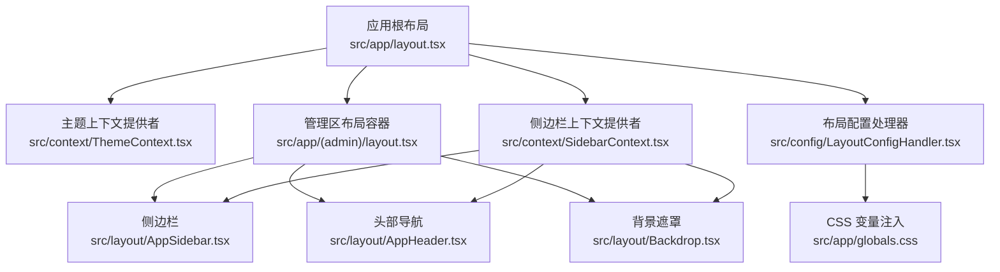
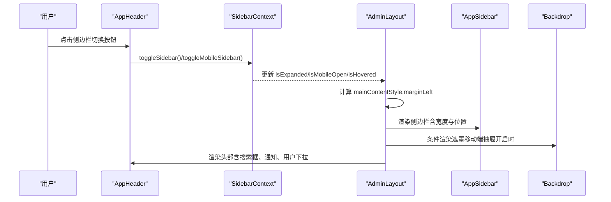
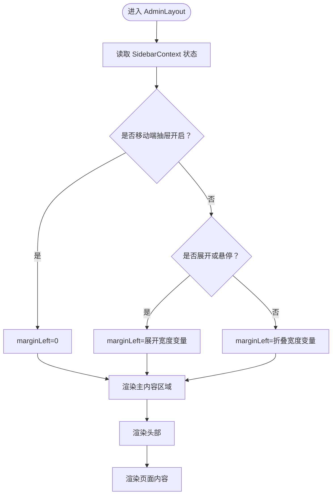
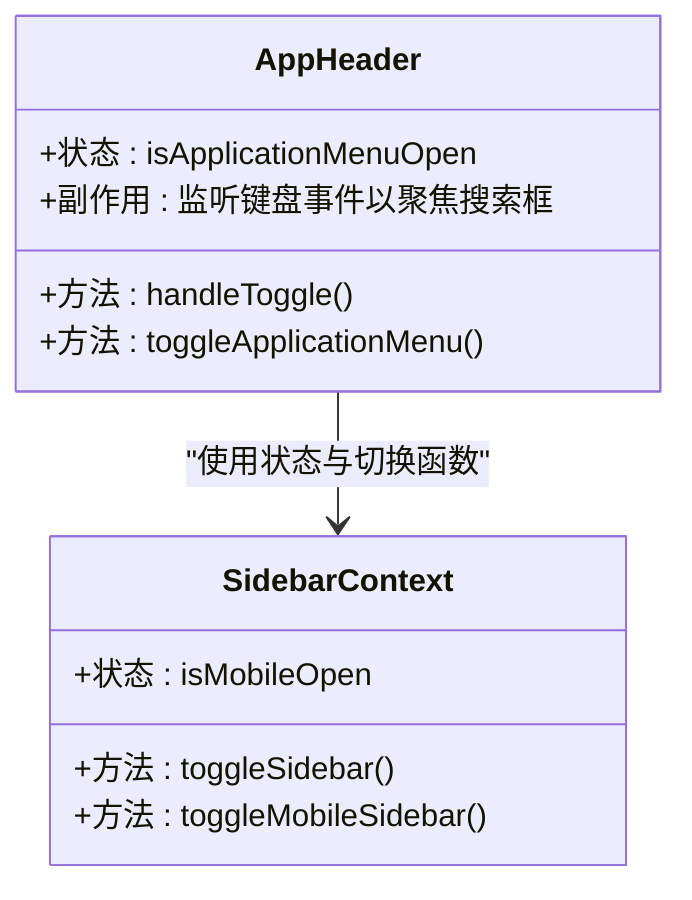
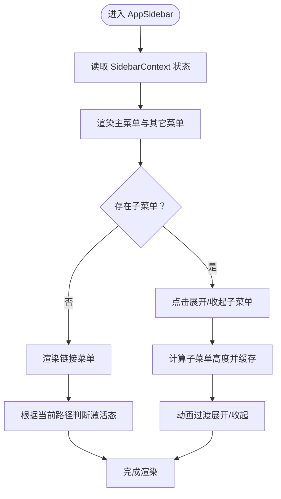
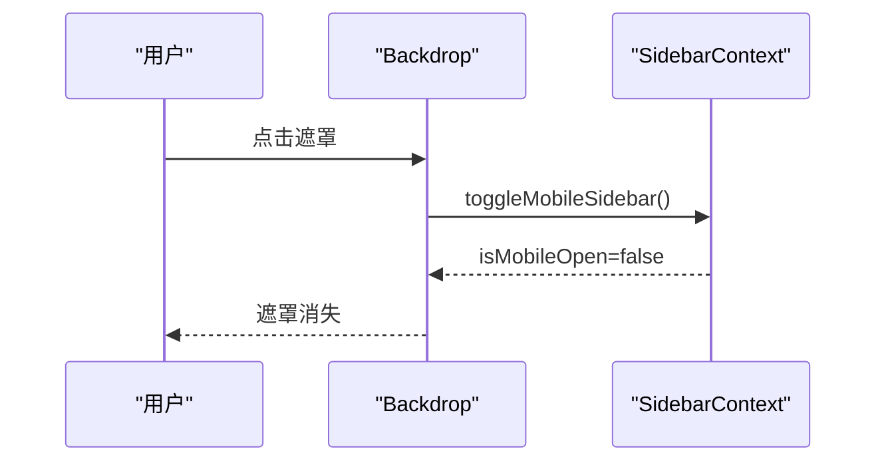
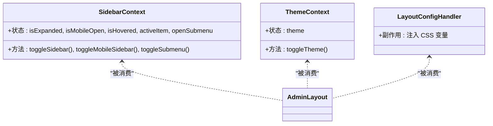
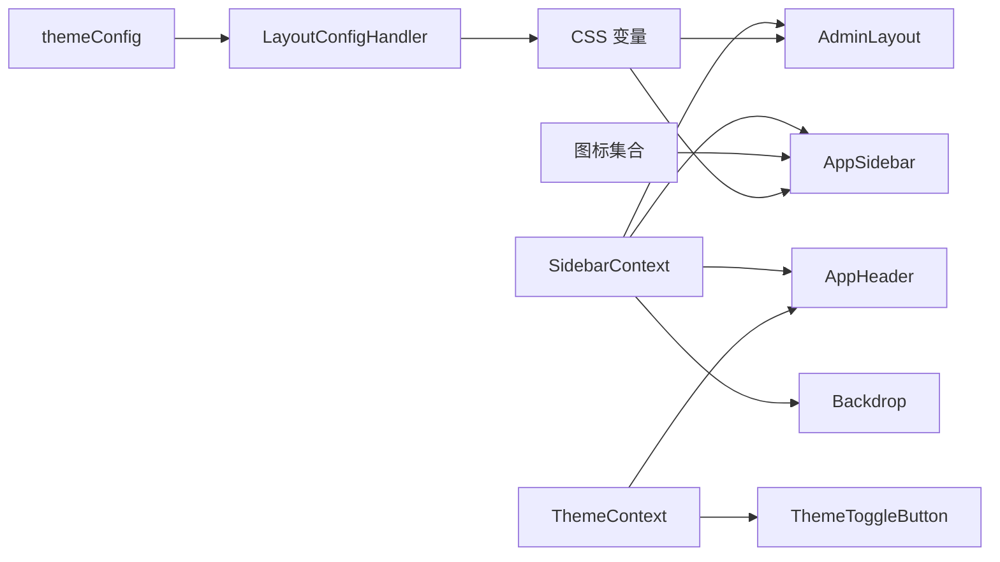

# 管理面板布局系统

<cite>
**本文档引用的文件**
- [src/app/layout.tsx](file://src/app/layout.tsx)
- [src/app/(admin)/layout.tsx](file://src/app/(admin)/layout.tsx)
- [src/layout/AppHeader.tsx](file://src/layout/AppHeader.tsx)
- [src/layout/AppSidebar.tsx](file://src/layout/AppSidebar.tsx)
- [src/layout/Backdrop.tsx](file://src/layout/Backdrop.tsx)
- [src/context/SidebarContext.tsx](file://src/context/SidebarContext.tsx)
- [src/context/ThemeContext.tsx](file://src/context/ThemeContext.tsx)
- [src/config/LayoutConfigHandler.tsx](file://src/config/LayoutConfigHandler.tsx)
- [src/config/themeConfig.ts](file://src/config/themeConfig.ts)
- [src/app/globals.css](file://src/app/globals.css)
- [src/components/common/ThemeToggleButton.tsx](file://src/components/common/ThemeToggleButton.tsx)
- [src/components/header/NotificationDropdown.tsx](file://src/components/header/NotificationDropdown.tsx)
- [src/components/header/UserDropdown.tsx](file://src/components/header/UserDropdown.tsx)
- [src/icons/index.tsx](file://src/icons/index.tsx)
</cite>

## 目录
1. [简介](#简介)
2. [项目结构](#项目结构)
3. [核心组件](#核心组件)
4. [架构总览](#架构总览)
5. [详细组件分析](#详细组件分析)
6. [依赖关系分析](#依赖关系分析)
7. [性能考量](#性能考量)
8. [故障排查指南](#故障排查指南)
9. [结论](#结论)
10. [附录](#附录)

## 简介
本文件面向需要修改或扩展管理面板布局系统的开发者，系统性阐述 AdminLayout 布局体系的设计架构与实现细节，包括：
- AdminLayout 的嵌套布局机制与控制流
- 响应式布局策略与移动端适配
- 组件协作关系：AppHeader 头部导航、AppSidebar 侧边栏、Backdrop 背景遮罩
- 布局状态管理、动态样式计算
- 样式覆盖方法与性能优化建议

## 项目结构
管理面板布局系统采用分层与功能模块化组织：
- 应用根布局负责全局上下文提供（主题与侧边栏）
- 管理区布局 AdminLayout 负责页面级布局容器与状态联动
- 布局子组件分别承担头部、侧边栏与移动端遮罩
- 配置层通过 CSS 变量与主题配置统一管理尺寸与颜色

**图表来源**
- [src/app/layout.tsx:16-32](file://src/app/layout.tsx#L16-L32)
- [src/app/(admin)/layout.tsx:9-44](file://src/app/(admin)/layout.tsx#L9-L44)
- [src/config/LayoutConfigHandler.tsx:6-29](file://src/config/LayoutConfigHandler.tsx#L6-L29)
- [src/context/SidebarContext.tsx:27-84](file://src/context/SidebarContext.tsx#L27-L84)
- [src/context/ThemeContext.tsx:15-59](file://src/context/ThemeContext.tsx#L15-L59)

**章节来源**
- [src/app/layout.tsx:16-32](file://src/app/layout.tsx#L16-L32)
- [src/app/(admin)/layout.tsx:9-44](file://src/app/(admin)/layout.tsx#L9-L44)

## 核心组件
- AdminLayout：页面级布局容器，负责根据侧边栏状态动态计算主内容区域的外边距，协调头部、侧边栏与遮罩的渲染顺序与交互
- AppHeader：顶部导航栏，集成主题切换、通知下拉、用户下拉、移动端菜单开关等能力
- AppSidebar：左侧导航菜单，支持展开/折叠、悬停展开、移动端抽屉、多级子菜单动画与激活态高亮
- Backdrop：移动端侧边栏遮罩层，点击关闭抽屉，仅在移动端抽屉开启时显示
- SidebarContext：侧边栏状态与行为的全局上下文，包含展开/折叠、移动端抽屉、悬停、子菜单等状态
- ThemeContext：主题状态与切换逻辑，持久化到本地存储并在 DOM 上同步暗色类名
- LayoutConfigHandler：将主题配置映射为 CSS 变量，供布局与组件使用

**章节来源**
- [src/app/(admin)/layout.tsx:14-43](file://src/app/(admin)/layout.tsx#L14-L43)
- [src/layout/AppHeader.tsx:10-182](file://src/layout/AppHeader.tsx#L10-L182)
- [src/layout/AppSidebar.tsx:104-376](file://src/layout/AppSidebar.tsx#L104-L376)
- [src/layout/Backdrop.tsx:4-18](file://src/layout/Backdrop.tsx#L4-L18)
- [src/context/SidebarContext.tsx:27-84](file://src/context/SidebarContext.tsx#L27-L84)
- [src/context/ThemeContext.tsx:15-59](file://src/context/ThemeContext.tsx#L15-L59)
- [src/config/LayoutConfigHandler.tsx:6-29](file://src/config/LayoutConfigHandler.tsx#L6-L29)

## 架构总览
AdminLayout 作为页面容器，通过 SidebarContext 获取当前侧边栏状态，动态计算主内容区域的 marginLeft，确保在不同状态下（展开/折叠/移动端抽屉）布局保持一致的视觉与交互体验。

**图表来源**
- [src/layout/AppHeader.tsx:13-21](file://src/layout/AppHeader.tsx#L13-L21)
- [src/context/SidebarContext.tsx:54-64](file://src/context/SidebarContext.tsx#L54-L64)
- [src/app/(admin)/layout.tsx:17-23](file://src/app/(admin)/layout.tsx#L17-L23)
- [src/layout/AppSidebar.tsx:300-312](file://src/layout/AppSidebar.tsx#L300-L312)
- [src/layout/Backdrop.tsx:7-14](file://src/layout/Backdrop.tsx#L7-L14)

## 详细组件分析

### AdminLayout 组件分析
- 状态来源：从 SidebarContext 读取 isExpanded、isHovered、isMobileOpen
- 动态样式：根据 isMobileOpen 与 isExpanded/isHovered 计算主内容 marginLeft，使用 CSS 变量控制侧边栏宽度
- 结构组织：先渲染侧边栏与遮罩，再渲染主内容区域；头部位于主内容区域内

**图表来源**
- [src/app/(admin)/layout.tsx:14-43](file://src/app/(admin)/layout.tsx#L14-L43)
- [src/config/LayoutConfigHandler.tsx:10-12](file://src/config/LayoutConfigHandler.tsx#L10-L12)

**章节来源**
- [src/app/(admin)/layout.tsx:14-43](file://src/app/(admin)/layout.tsx#L14-L43)

### AppHeader 组件分析
- 交互逻辑：根据窗口宽度选择桌面端或移动端的切换方式；支持快捷键聚焦搜索框
- 组成部分：侧边栏切换按钮、品牌 Logo（移动端）、应用菜单按钮（移动端）、搜索框、主题切换、通知下拉、用户下拉
- 状态依赖：通过 SidebarContext 控制侧边栏展开/折叠与移动端抽屉

**图表来源**
- [src/layout/AppHeader.tsx:10-41](file://src/layout/AppHeader.tsx#L10-L41)
- [src/context/SidebarContext.tsx:19-25](file://src/context/SidebarContext.tsx#L19-L25)

**章节来源**
- [src/layout/AppHeader.tsx:10-182](file://src/layout/AppHeader.tsx#L10-L182)

### AppSidebar 组件分析
- 数据结构：定义两组导航项（主菜单与其它），每项可包含子菜单
- 状态管理：内部维护 openSubmenu 与子菜单高度缓存，用于动画展开/收起
- 响应式行为：根据 isExpanded/isHovered/isMobileOpen 决定图标/文字/箭头的显示与宽度；悬停展开非移动端模式
- 激活态：基于当前路径高亮对应菜单项与子菜单项

**图表来源**
- [src/layout/AppSidebar.tsx:104-296](file://src/layout/AppSidebar.tsx#L104-L296)
- [src/layout/AppSidebar.tsx:246-283](file://src/layout/AppSidebar.tsx#L246-L283)

**章节来源**
- [src/layout/AppSidebar.tsx:104-376](file://src/layout/AppSidebar.tsx#L104-L376)

### Backdrop 组件分析
- 显示条件：仅当 isMobileOpen 为真时渲染
- 行为：点击后调用 toggleMobileSidebar 关闭移动端抽屉
- 样式：固定定位、全屏遮罩、移动端可见

**图表来源**
- [src/layout/Backdrop.tsx:4-18](file://src/layout/Backdrop.tsx#L4-L18)
- [src/context/SidebarContext.tsx:58-60](file://src/context/SidebarContext.tsx#L58-L60)

**章节来源**
- [src/layout/Backdrop.tsx:4-18](file://src/layout/Backdrop.tsx#L4-L18)

### SidebarContext 与 ThemeContext
- SidebarContext：提供 isExpanded、isMobileOpen、isHovered、activeItem、openSubmenu 等状态与切换函数；在窗口尺寸变化时自动处理移动端抽屉关闭
- ThemeContext：提供 theme 与 toggleTheme，持久化到 localStorage 并在 DOM 上添加/移除 dark 类名

**图表来源**
- [src/context/SidebarContext.tsx:27-84](file://src/context/SidebarContext.tsx#L27-L84)
- [src/context/ThemeContext.tsx:15-59](file://src/context/ThemeContext.tsx#L15-L59)
- [src/config/LayoutConfigHandler.tsx:6-29](file://src/config/LayoutConfigHandler.tsx#L6-L29)

**章节来源**
- [src/context/SidebarContext.tsx:27-84](file://src/context/SidebarContext.tsx#L27-L84)
- [src/context/ThemeContext.tsx:15-59](file://src/context/ThemeContext.tsx#L15-L59)
- [src/config/LayoutConfigHandler.tsx:6-29](file://src/config/LayoutConfigHandler.tsx#L6-L29)

## 依赖关系分析
- AdminLayout 依赖 SidebarContext 提供的状态与切换函数，动态计算主内容区域样式
- AppHeader 依赖 SidebarContext 进行侧边栏切换，并依赖 ThemeToggleButton 实现主题切换
- AppSidebar 依赖 SidebarContext 与图标集合，内部维护子菜单状态与高度
- Backdrop 依赖 SidebarContext 控制移动端抽屉显隐
- 布局配置通过 LayoutConfigHandler 将 themeConfig 映射为 CSS 变量，供全局使用

**图表来源**
- [src/app/(admin)/layout.tsx:14-43](file://src/app/(admin)/layout.tsx#L14-L43)
- [src/layout/AppHeader.tsx:13-16](file://src/layout/AppHeader.tsx#L13-L16)
- [src/layout/AppSidebar.tsx:6-19](file://src/layout/AppSidebar.tsx#L6-L19)
- [src/layout/Backdrop.tsx:5](file://src/layout/Backdrop.tsx#L5)
- [src/context/SidebarContext.tsx:19-25](file://src/context/SidebarContext.tsx#L19-L25)
- [src/context/ThemeContext.tsx:52-58](file://src/context/ThemeContext.tsx#L52-L58)
- [src/icons/index.tsx:55-109](file://src/icons/index.tsx#L55-L109)
- [src/config/themeConfig.ts:4-30](file://src/config/themeConfig.ts#L4-L30)
- [src/config/LayoutConfigHandler.tsx:7-26](file://src/config/LayoutConfigHandler.tsx#L7-L26)
- [src/app/globals.css:171-187](file://src/app/globals.css#L171-L187)

**章节来源**
- [src/app/(admin)/layout.tsx:14-43](file://src/app/(admin)/layout.tsx#L14-L43)
- [src/layout/AppHeader.tsx:13-16](file://src/layout/AppHeader.tsx#L13-L16)
- [src/layout/AppSidebar.tsx:6-19](file://src/layout/AppSidebar.tsx#L6-L19)
- [src/layout/Backdrop.tsx:5](file://src/layout/Backdrop.tsx#L5)
- [src/context/SidebarContext.tsx:19-25](file://src/context/SidebarContext.tsx#L19-L25)
- [src/context/ThemeContext.tsx:52-58](file://src/context/ThemeContext.tsx#L52-L58)
- [src/icons/index.tsx:55-109](file://src/icons/index.tsx#L55-L109)
- [src/config/themeConfig.ts:4-30](file://src/config/themeConfig.ts#L4-L30)
- [src/config/LayoutConfigHandler.tsx:7-26](file://src/config/LayoutConfigHandler.tsx#L7-L26)
- [src/app/globals.css:171-187](file://src/app/globals.css#L171-L187)

## 性能考量
- 子菜单高度计算：通过 ref 与 scrollHeight 计算并缓存，避免重复测量导致的回流
- 状态更新：SidebarContext 在 resize 时仅在非移动端时关闭抽屉，减少不必要的重渲染
- 动画过渡：侧边栏与子菜单使用 CSS 过渡，保持流畅体验
- 主题切换：ThemeContext 使用 localStorage 缓存，避免每次刷新重新计算
- 建议
  - 对频繁触发的 resize 事件进行节流
  - 对子菜单高度计算增加防抖，避免快速切换导致的性能问题
  - 将图标组件按需加载，减少首屏体积

[本节为通用性能建议，不直接分析具体文件]

## 故障排查指南
- 侧边栏无法展开/折叠
  - 检查 SidebarContext 是否正确提供上下文
  - 确认 AdminLayout 中是否正确读取状态并计算 marginLeft
- 移动端抽屉无法关闭
  - 检查 Backdrop 是否渲染以及点击事件是否触发 toggleMobileSidebar
- 子菜单动画异常
  - 确认子菜单高度计算逻辑与 ref 引用是否正确
  - 检查 CSS 过渡属性与高度值
- 主题切换无效
  - 检查 ThemeContext 的 toggleTheme 是否执行，localStorage 是否写入
  - 确认 DOM 上是否正确添加/移除 dark 类名

**章节来源**
- [src/context/SidebarContext.tsx:27-84](file://src/context/SidebarContext.tsx#L27-L84)
- [src/layout/Backdrop.tsx:7-14](file://src/layout/Backdrop.tsx#L7-L14)
- [src/layout/AppSidebar.tsx:272-283](file://src/layout/AppSidebar.tsx#L272-L283)
- [src/context/ThemeContext.tsx:41-43](file://src/context/ThemeContext.tsx#L41-L43)

## 结论
该布局系统通过清晰的分层设计与上下文状态管理，实现了响应式、可扩展的管理面板布局。AdminLayout 作为容器协调头部、侧边栏与遮罩，SidebarContext 与 ThemeContext 提供全局状态与主题能力，LayoutConfigHandler 将配置映射为 CSS 变量，确保布局一致性与可定制性。开发者可在不破坏现有结构的前提下，对菜单项、样式变量与交互行为进行扩展与优化。

[本节为总结性内容，不直接分析具体文件]

## 附录

### 布局状态管理与动态样式计算
- 状态来源：SidebarContext
- 动态样式：AdminLayout 根据 isMobileOpen、isExpanded、isHovered 计算 marginLeft
- CSS 变量：LayoutConfigHandler 注入侧边栏宽度、间距、圆角与主色调

**章节来源**
- [src/app/(admin)/layout.tsx:17-23](file://src/app/(admin)/layout.tsx#L17-L23)
- [src/config/LayoutConfigHandler.tsx:10-26](file://src/config/LayoutConfigHandler.tsx#L10-L26)

### 响应式布局与移动端适配
- 移动端断点：SidebarContext 在 resize 时检测小于 768px 的窗口，自动关闭移动端抽屉
- 侧边栏抽屉：AppSidebar 使用 translateX 控制抽屉显隐，Backdrop 仅在移动端抽屉开启时显示
- 头部搜索框：支持 ⌘K 快捷键聚焦

**章节来源**
- [src/context/SidebarContext.tsx:37-52](file://src/context/SidebarContext.tsx#L37-L52)
- [src/layout/AppSidebar.tsx:300-312](file://src/layout/AppSidebar.tsx#L300-L312)
- [src/layout/Backdrop.tsx:7-14](file://src/layout/Backdrop.tsx#L7-L14)
- [src/layout/AppHeader.tsx:28-41](file://src/layout/AppHeader.tsx#L28-L41)

### 布局定制指南
- 修改侧边栏宽度：调整 themeConfig.sidebar.widthExpanded 与 widthCollapsed，并确保 LayoutConfigHandler 注入
- 修改间距与圆角：调整 themeConfig.spacing 与 themeConfig.borderRadius
- 修改主色调：调整 themeConfig.colors.primary 与 primaryHover
- 自定义菜单项：在 AppSidebar 的 navItems/othersItems 中新增条目，支持子菜单与徽标

**章节来源**
- [src/config/themeConfig.ts:4-30](file://src/config/themeConfig.ts#L4-L30)
- [src/config/LayoutConfigHandler.tsx:10-26](file://src/config/LayoutConfigHandler.tsx#L10-L26)
- [src/layout/AppSidebar.tsx:28-102](file://src/layout/AppSidebar.tsx#L28-L102)

### 样式覆盖方法
- 全局样式：通过 src/app/globals.css 中的 @theme 与自定义工具类覆盖默认样式
- 菜单样式：使用 menu-item、menu-item-active、menu-dropdown-item 等工具类
- 滚动条样式：使用 custom-scrollbar/no-scrollbar 工具类
- 主题变量：通过 CSS 变量覆盖 --color-brand-500、--color-brand-600 等

**章节来源**
- [src/app/globals.css:171-187](file://src/app/globals.css#L171-L187)
- [src/app/globals.css:228-286](file://src/app/globals.css#L228-L286)
- [src/app/globals.css:288-295](file://src/app/globals.css#L288-L295)