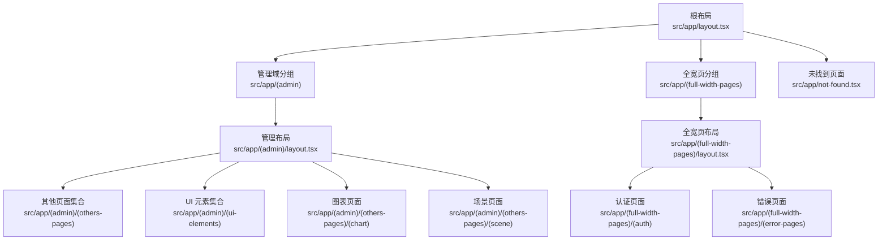
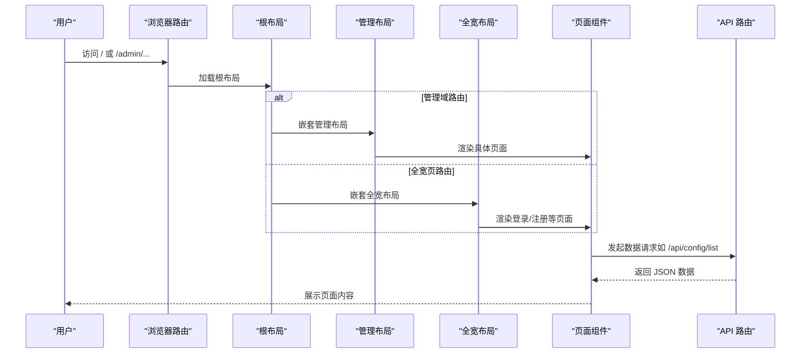
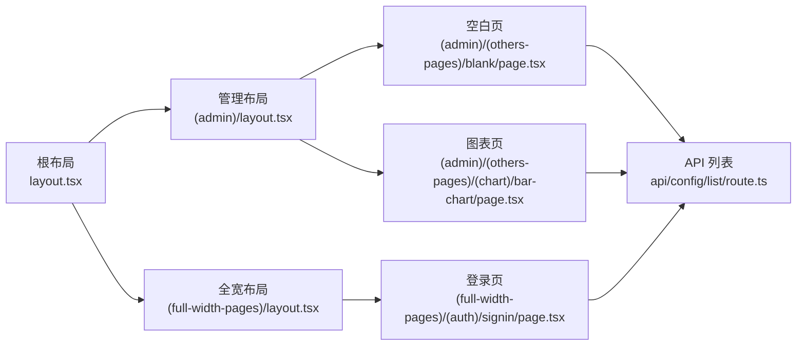

# 路由模式与约定

<cite>
**本文引用的文件**
- [src/app/layout.tsx](file://src/app/layout.tsx)
- [src/app/not-found.tsx](file://src/app/not-found.tsx)
- [src/app/(admin)/layout.tsx](file://src/app/(admin)/layout.tsx)
- [src/app/(full-width-pages)/layout.tsx](file://src/app/(full-width-pages)/layout.tsx)
- [src/app/(admin)/(others-pages)/(chart)/bar-chart/page.tsx](file://src/app/(admin)/(others-pages)/(chart)/bar-chart/page.tsx)
- [src/app/(admin)/(others-pages)/(scene)/config/new/page.tsx](file://src/app/(admin)/(others-pages)/(scene)/config/new/page.tsx)
- [src/app/(full-width-pages)/(auth)/signin/page.tsx](file://src/app/(full-width-pages)/(auth)/signin/page.tsx)
- [src/app/(full-width-pages)/(error-pages)/error-404/page.tsx](file://src/app/(full-width-pages)/(error-pages)/error-404/page.tsx)
- [src/app/api/config/list/route.ts](file://src/app/api/config/list/route.ts)
</cite>

## 目录
1. [引言](#引言)
2. [项目结构](#项目结构)
3. [核心组件](#核心组件)
4. [架构总览](#架构总览)
5. [详细组件分析](#详细组件分析)
6. [依赖分析](#依赖分析)
7. [性能考量](#性能考量)
8. [故障排查指南](#故障排查指南)
9. [结论](#结论)
10. [附录](#附录)

## 引言
本文件面向需要深入理解 Next.js App Router 路由机制的高级开发者，系统梳理本项目的路由约定、文件系统路由规则、嵌套路由实现方式，并结合实际代码示例说明页面文件命名规范、目录结构约定、路由参数传递机制，以及路由重定向、错误处理与 404 页面处理策略。同时提供路由配置最佳实践、SEO 优化策略与性能考虑建议。

## 项目结构
本项目采用 Next.js App Router 的文件系统路由（File System Routing）与分组（Grouping）相结合的方式组织页面与布局。根级布局负责全局主题、上下文与通用样式注入；不同业务域通过分组目录进行逻辑隔离；页面通过约定的 page.tsx 文件暴露路由与元数据；API 路由通过 route.ts 文件定义服务端接口。

图示来源
- [src/app/layout.tsx:16-32](file://src/app/layout.tsx#L16-L32)
- [src/app/(admin)/layout.tsx](file://src/app/(admin)/layout.tsx#L9-L44)
- [src/app/(full-width-pages)/layout.tsx](file://src/app/(full-width-pages)/layout.tsx#L1-L7)
- [src/app/not-found.tsx:6-49](file://src/app/not-found.tsx#L6-L49)

章节来源
- [src/app/layout.tsx:1-33](file://src/app/layout.tsx#L1-L33)
- [src/app/(admin)/layout.tsx](file://src/app/(admin)/layout.tsx#L1-L45)
- [src/app/(full-width-pages)/layout.tsx](file://src/app/(full-width-pages)/layout.tsx#L1-L8)
- [src/app/not-found.tsx:1-50](file://src/app/not-found.tsx#L1-L50)

## 核心组件
- 根布局与全局上下文
  - 根布局负责注入字体、全局样式、主题与侧边栏上下文，为子路由提供统一容器。
  - 章节来源
    - [src/app/layout.tsx:16-32](file://src/app/layout.tsx#L16-L32)

- 管理域布局
  - 管理域布局通过客户端上下文控制侧边栏展开/折叠状态，动态计算主内容区边距，保证页面在不同设备与交互下的视觉一致性。
  - 章节来源
    - [src/app/(admin)/layout.tsx](file://src/app/(admin)/layout.tsx#L9-L44)

- 全宽页布局
  - 全宽页布局用于登录、注册等无需侧边栏与面包屑的页面，提供简洁的容器。
  - 章节来源
    - [src/app/(full-width-pages)/layout.tsx](file://src/app/(full-width-pages)/layout.tsx#L1-L7)

- 未找到页面
  - 未找到页面作为 404 渲染组件，展示错误提示与返回首页链接，配合全局未匹配路由自动触发。
  - 章节来源
    - [src/app/not-found.tsx:6-49](file://src/app/not-found.tsx#L6-L49)

## 架构总览
下图展示了从请求到页面渲染的关键路径，包括布局嵌套、页面加载与 API 请求流程。

图示来源
- [src/app/layout.tsx:16-32](file://src/app/layout.tsx#L16-L32)
- [src/app/(admin)/layout.tsx](file://src/app/(admin)/layout.tsx#L9-L44)
- [src/app/(full-width-pages)/layout.tsx](file://src/app/(full-width-pages)/layout.tsx#L1-L7)
- [src/app/api/config/list/route.ts:7-77](file://src/app/api/config/list/route.ts#L7-L77)

## 详细组件分析

### 文件系统路由与页面命名规范
- page.tsx 是页面文件的标准命名，Next.js 将根据文件所在目录层级映射为路由路径。
- 示例：
  - 管理域下的“空白页”路由：/admin/others-pages/blank
  - 图表页路由：/admin/others-pages/chart/bar-chart
  - 登录页路由：/full-width-pages/auth/signin
- 章节来源
  - [src/app/(admin)/(others-pages)/blank/page.tsx](file://src/app/(admin)/(others-pages)/blank/page.tsx#L10-L27)
  - [src/app/(admin)/(others-pages)/(chart)/bar-chart/page.tsx](file://src/app/(admin)/(others-pages)/(chart)/bar-chart/page.tsx#L13-L24)
  - [src/app/(full-width-pages)/(auth)/signin/page.tsx](file://src/app/(full-width-pages)/(auth)/signin/page.tsx#L9-L11)

### 目录结构约定与分组（Grouping）
- 使用圆括号包裹的分组目录实现逻辑隔离与可选嵌套，不影响最终 URL。
- 示例：
  - (admin) 管理域与子分组 (others-pages)、(ui-elements)、(chart)、(scene)
  - (full-width-pages) 全宽页域与子分组 (auth)、(error-pages)
- 章节来源
  - [src/app/(admin)/layout.tsx](file://src/app/(admin)/layout.tsx#L1-L45)
  - [src/app/(full-width-pages)/layout.tsx](file://src/app/(full-width-pages)/layout.tsx#L1-L7)

### 嵌套路由与布局继承
- 布局文件按目录层级自上而下继承，父级布局中的 children 即为子路由内容。
- 示例：
  - 根布局 -> 管理布局 -> 具体页面
  - 根布局 -> 全宽布局 -> 登录页
- 章节来源
  - [src/app/layout.tsx:16-32](file://src/app/layout.tsx#L16-L32)
  - [src/app/(admin)/layout.tsx](file://src/app/(admin)/layout.tsx#L9-L44)
  - [src/app/(full-width-pages)/layout.tsx](file://src/app/(full-width-pages)/layout.tsx#L1-L7)

### 路由参数传递机制
- 查询参数（Search Params）
  - 在客户端页面中通过 next/navigation 提供的 useSearchParams 获取查询字符串，实现轻量参数传递与状态同步。
  - 示例：在“新增配置”页面中，通过查询参数判断新增/编辑/详情三种模式，并据此发起不同 API 请求与 UI 行为。
  - 章节来源
    - [src/app/(admin)/(others-pages)/(scene)/config/new/page.tsx](file://src/app/(admin)/(others-pages)/(scene)/config/new/page.tsx#L14-L63)

- 动态路由参数（Dynamic Routes）
  - 本项目在 API 路由中使用方括号语法定义动态段，如 [id]，用于接收资源标识符并执行 CRUD 操作。
  - 示例：/api/config/[id] 对应读取或更新单条记录。
  - 章节来源
    - [src/app/api/config/list/route.ts:1-77](file://src/app/api/config/list/route.ts#L1-L77)

### 路由重定向与导航
- 客户端重定向
  - 在客户端页面中通过 next/navigation 提供的 useRouter 进行程序化导航，完成提交成功后的页面跳转。
  - 示例：提交成功后跳转至表格页。
  - 章节来源
    - [src/app/(admin)/(others-pages)/(scene)/config/new/page.tsx](file://src/app/(admin)/(others-pages)/(scene)/config/new/page.tsx#L182-L193)

- 链接跳转
  - 使用 next/link 组件在页面内进行内部导航，保持 SPA 导航体验。
  - 示例：404 页面中的“返回首页”链接。
  - 章节来源
    - [src/app/not-found.tsx:36-41](file://src/app/not-found.tsx#L36-L41)
    - [src/app/(full-width-pages)/(error-pages)/error-404/page.tsx](file://src/app/(full-width-pages)/(error-pages)/error-404/page.tsx#L43-L48)

### 错误处理与 404 页面
- 未找到页面
  - 当路由无法匹配任何页面时，Next.js 自动渲染 not-found.tsx，用于统一处理 404 场景。
  - 章节来源
    - [src/app/not-found.tsx:6-49](file://src/app/not-found.tsx#L6-L49)

- 页面内错误处理
  - 页面内部通过 try/catch 与条件判断处理异步请求失败、参数缺失等情况，并通过通知组件反馈给用户。
  - 示例：文件上传、下载、表单提交等操作均包含错误处理与用户提示。
  - 章节来源
    - [src/app/(admin)/(others-pages)/(scene)/config/new/page.tsx](file://src/app/(admin)/(others-pages)/(scene)/config/new/page.tsx#L84-L109)
    - [src/app/(admin)/(others-pages)/(scene)/config/new/page.tsx](file://src/app/(admin)/(others-pages)/(scene)/config/new/page.tsx#L147-L189)

### API 路由与数据流
- API 路由
  - 以 route.ts 命名的文件定义 API 接口，支持 GET/POST/PUT/DELETE 等方法，返回 JSON 响应。
  - 示例：列表查询接口根据传入的过滤条件与分页参数返回数据。
  - 章节来源
    - [src/app/api/config/list/route.ts:7-77](file://src/app/api/config/list/route.ts#L7-L77)

- 客户端调用
  - 页面通过原生 fetch 或第三方库向 API 发起请求，解析响应并更新 UI。
  - 章节来源
    - [src/app/(admin)/(others-pages)/(scene)/config/new/page.tsx](file://src/app/(admin)/(others-pages)/(scene)/config/new/page.tsx#L39-L62)
    - [src/app/(admin)/(others-pages)/(scene)/config/new/page.tsx](file://src/app/(admin)/(others-pages)/(scene)/config/new/page.tsx#L67-L77)

### SEO 优化策略
- 元数据（Metadata）
  - 每个页面导出 Metadata 对象，设置标题与描述，提升搜索引擎可见性。
  - 示例：空白页、登录页、图表页等均提供独立的标题与描述。
  - 章节来源
    - [src/app/(admin)/(others-pages)/blank/page.tsx](file://src/app/(admin)/(others-pages)/blank/page.tsx#L5-L8)
    - [src/app/(full-width-pages)/(auth)/signin/page.tsx](file://src/app/(full-width-pages)/(auth)/signin/page.tsx#L4-L7)
    - [src/app/(admin)/(others-pages)/(chart)/bar-chart/page.tsx](file://src/app/(admin)/(others-pages)/(chart)/bar-chart/page.tsx#L7-L11)

- 结构化数据与 Open Graph
  - 可在 Metadata 中扩展 Open Graph、Twitter Card 等字段，增强社交分享效果（建议在实际项目中补充）。

- 静态生成与预渲染
  - 对于不依赖运行时数据的页面，可结合生成策略减少首屏延迟（建议在实际项目中评估）。

## 依赖分析
- 布局与页面的耦合关系
  - 根布局对全局上下文与主题有强依赖，管理布局依赖侧边栏上下文，页面依赖布局提供的容器与导航能力。
- API 路由与页面的数据耦合
  - 页面通过 fetch 与 API 路由交互，API 路由依赖数据库访问层与 ORM 工具。
- 外部依赖
  - Next.js 版本与相关生态（如 drizzle-orm、react、tailwind 等）影响路由行为与构建产物。

图示来源
- [src/app/layout.tsx:16-32](file://src/app/layout.tsx#L16-L32)
- [src/app/(admin)/layout.tsx](file://src/app/(admin)/layout.tsx#L9-L44)
- [src/app/(full-width-pages)/layout.tsx](file://src/app/(full-width-pages)/layout.tsx#L1-L7)
- [src/app/(admin)/(others-pages)/blank/page.tsx](file://src/app/(admin)/(others-pages)/blank/page.tsx#L10-L27)
- [src/app/(admin)/(others-pages)/(chart)/bar-chart/page.tsx](file://src/app/(admin)/(others-pages)/(chart)/bar-chart/page.tsx#L13-L24)
- [src/app/(full-width-pages)/(auth)/signin/page.tsx](file://src/app/(full-width-pages)/(auth)/signin/page.tsx#L9-L11)
- [src/app/api/config/list/route.ts:1-77](file://src/app/api/config/list/route.ts#L1-L77)

## 性能考量
- 路由与布局
  - 合理拆分布局层级，避免不必要的重复渲染；在管理布局中仅对必要状态进行响应式更新。
- 数据请求
  - 在 API 路由中实现分页与条件过滤，减少一次性传输的数据量；在页面中使用缓存与防抖策略降低请求频率。
- 资源加载
  - 将静态资源放置于 public 目录，利用浏览器缓存；对大体积图表或地图组件采用懒加载策略。
- 构建与运行
  - 使用 Next.js 的并行渲染与增量静态再生（ISR）能力，结合 CDN 提升全球访问速度。

## 故障排查指南
- 404 页面未显示
  - 确认未找到页面组件存在且位于正确路径；检查是否存在同名文件覆盖或拼写错误。
  - 章节来源
    - [src/app/not-found.tsx:6-49](file://src/app/not-found.tsx#L6-L49)

- 查询参数无效
  - 确保在客户端页面中使用正确的查询参数键名与类型；在服务端 API 中对参数进行严格校验与默认值处理。
  - 章节来源
    - [src/app/(admin)/(others-pages)/(scene)/config/new/page.tsx](file://src/app/(admin)/(others-pages)/(scene)/config/new/page.tsx#L14-L20)
    - [src/app/api/config/list/route.ts:10-26](file://src/app/api/config/list/route.ts#L10-L26)

- API 请求失败
  - 检查 API 路由的错误处理分支与状态码返回；在页面中捕获异常并提供用户提示。
  - 章节来源
    - [src/app/api/config/list/route.ts:67-76](file://src/app/api/config/list/route.ts#L67-L76)
    - [src/app/(admin)/(others-pages)/(scene)/config/new/page.tsx](file://src/app/(admin)/(others-pages)/(scene)/config/new/page.tsx#L54-L59)

## 结论
本项目通过清晰的分组与嵌套布局，结合标准的 page.tsx 与 route.ts 命名规范，实现了高内聚、低耦合的路由体系。借助查询参数与动态路由参数，页面能够灵活处理不同业务场景；通过统一的 404 页面与错误处理机制，提升了用户体验与可维护性。建议在后续迭代中进一步完善 SEO 字段、引入 ISR 与懒加载策略，以获得更优的性能与搜索表现。

## 附录
- 最佳实践清单
  - 使用分组目录隔离业务域，保持 URL 与目录结构一致。
  - 在每个页面导出明确的元数据，提升 SEO 与社交分享质量。
  - 在 API 路由中实现严格的输入校验与分页控制。
  - 在客户端页面中统一处理错误与加载状态，提供友好的用户反馈。
  - 对大体量数据与重型组件采用懒加载与缓存策略。