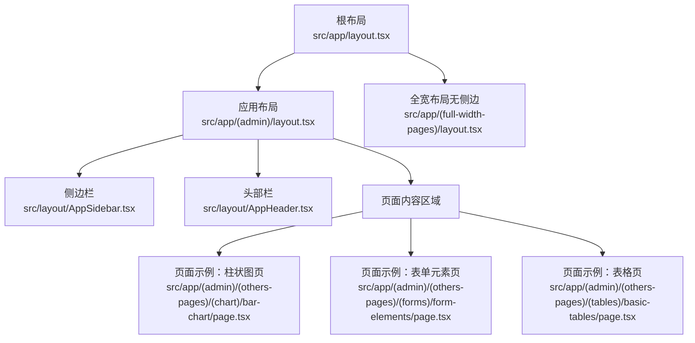
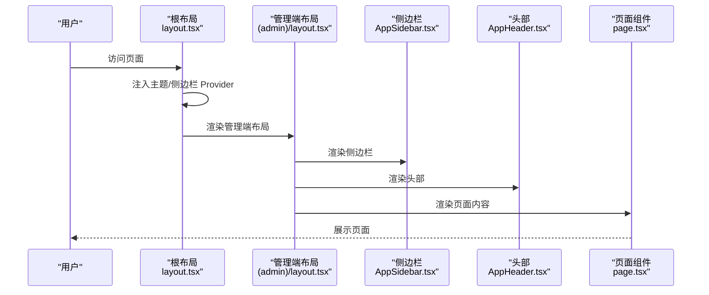
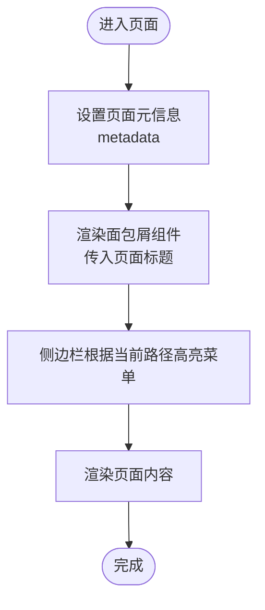
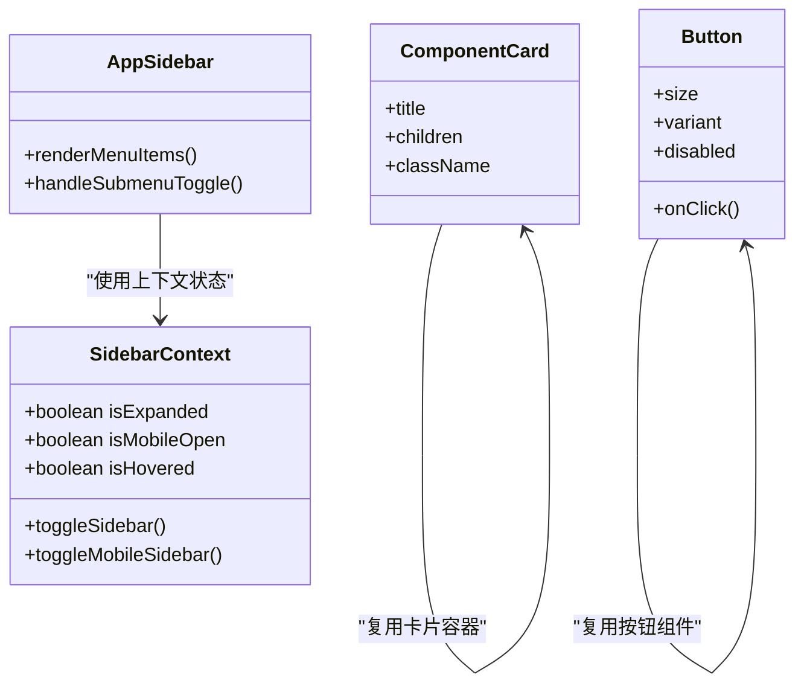
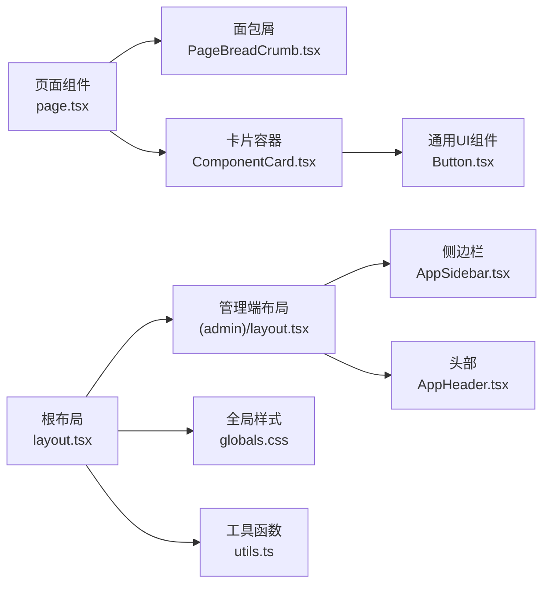

# 页面开发指南

<cite>
**本文引用的文件**
- [src/app/layout.tsx](file://src/app/layout.tsx)
- [src/app/(admin)/layout.tsx](file://src/app/(admin)/layout.tsx)
- [src/layout/AppHeader.tsx](file://src/layout/AppHeader.tsx)
- [src/layout/AppSidebar.tsx](file://src/layout/AppSidebar.tsx)
- [src/context/SidebarContext.tsx](file://src/context/SidebarContext.tsx)
- [src/components/common/PageBreadCrumb.tsx](file://src/components/common/PageBreadCrumb.tsx)
- [src/app/(admin)/(others-pages)/(chart)/bar-chart/page.tsx](file://src/app/(admin)/(others-pages)/(chart)/bar-chart/page.tsx)
- [src/app/(admin)/(others-pages)/(forms)/form-elements/page.tsx](file://src/app/(admin)/(others-pages)/(forms)/form-elements/page.tsx)
- [src/app/(admin)/(others-pages)/(tables)/basic-tables/page.tsx](file://src/app/(admin)/(others-pages)/(tables)/basic-tables/page.tsx)
- [src/components/common/ComponentCard.tsx](file://src/components/common/ComponentCard.tsx)
- [src/components/ui/button/Button.tsx](file://src/components/ui/button/Button.tsx)
- [src/app/globals.css](file://src/app/globals.css)
- [src/lib/utils.ts](file://src/lib/utils.ts)
- [src/app/(full-width-pages)/layout.tsx](file://src/app/(full-width-pages)/layout.tsx)
</cite>

## 目录
1. [引言](#引言)
2. [项目结构](#项目结构)
3. [核心组件](#核心组件)
4. [架构总览](#架构总览)
5. [详细组件分析](#详细组件分析)
6. [依赖关系分析](#依赖关系分析)
7. [性能考虑](#性能考虑)
8. [故障排查指南](#故障排查指南)
9. [结论](#结论)
10. [附录](#附录)

## 引言
本指南面向新加入项目的开发者，提供从零开始创建新页面的完整流程与最佳实践，涵盖文件结构、基础模板、组件集成、样式应用、导航集成、面包屑生成、页面标题管理、常见页面类型模板、调试技巧与性能优化建议。目标是帮助你快速上手并高质量交付页面。

## 项目结构
Next.js 应用采用 App Router 的分组路由与布局嵌套结构，页面位于 src/app 下，按功能域划分（如 (admin)、(full-width-pages) 等），每个页面以 page.tsx 作为入口。全局样式通过 src/app/globals.css 统一注入，主题与上下文通过根布局与 Provider 提供。

图表来源
- [src/app/layout.tsx:16-32](file://src/app/layout.tsx#L16-L32)
- [src/app/(admin)/layout.tsx:9-44](file://src/app/(admin)/layout.tsx#L9-L44)
- [src/layout/AppSidebar.tsx:104-376](file://src/layout/AppSidebar.tsx#L104-L376)
- [src/layout/AppHeader.tsx:10-182](file://src/layout/AppHeader.tsx#L10-L182)
- [src/app/(admin)/(others-pages)/(chart)/bar-chart/page.tsx:13-24](file://src/app/(admin)/(others-pages)/(chart)/bar-chart/page.tsx#L13-L24)
- [src/app/(admin)/(others-pages)/(forms)/form-elements/page.tsx:21-43](file://src/app/(admin)/(others-pages)/(forms)/form-elements/page.tsx#L21-L43)
- [src/app/(admin)/(others-pages)/(tables)/basic-tables/page.tsx:14-25](file://src/app/(admin)/(others-pages)/(tables)/basic-tables/page.tsx#L14-L25)
- [src/app/(full-width-pages)/layout.tsx:1-7](file://src/app/(full-width-pages)/layout.tsx#L1-L7)

章节来源
- [src/app/layout.tsx:16-32](file://src/app/layout.tsx#L16-L32)
- [src/app/(admin)/layout.tsx:9-44](file://src/app/(admin)/layout.tsx#L9-L44)

## 核心组件
- 布局与上下文
  - 根布局负责字体、全局样式、主题 Provider、侧边栏 Provider、通知等顶层设置。
  - 管理端布局负责侧边栏、头部、主内容区的动态样式与过渡。
  - 侧边栏上下文提供展开/折叠、移动端打开状态、悬停状态等状态与切换方法。
- 导航与头部
  - 头部包含侧边栏切换、搜索快捷键、主题切换、通知、用户下拉菜单。
  - 侧边栏包含主菜单与“其他”菜单，支持子菜单展开、高亮当前路径。
- 面包屑与卡片容器
  - 面包屑组件提供页面标题与首页链接。
  - 组件卡片用于包裹业务组件，统一标题与内边距。
- 全局样式与工具
  - 全局样式定义主题变量、阴影、圆角、断点等，并为第三方库提供样式覆盖。
  - 工具函数 cn 聚合并合并类名，避免冲突。

章节来源
- [src/app/layout.tsx:16-32](file://src/app/layout.tsx#L16-L32)
- [src/app/(admin)/layout.tsx:9-44](file://src/app/(admin)/layout.tsx#L9-L44)
- [src/context/SidebarContext.tsx:19-84](file://src/context/SidebarContext.tsx#L19-L84)
- [src/layout/AppHeader.tsx:10-182](file://src/layout/AppHeader.tsx#L10-L182)
- [src/layout/AppSidebar.tsx:104-376](file://src/layout/AppSidebar.tsx#L104-L376)
- [src/components/common/PageBreadCrumb.tsx:8-52](file://src/components/common/PageBreadCrumb.tsx#L8-L52)
- [src/components/common/ComponentCard.tsx:10-40](file://src/components/common/ComponentCard.tsx#L10-L40)
- [src/app/globals.css:1-899](file://src/app/globals.css#L1-L899)
- [src/lib/utils.ts:4-6](file://src/lib/utils.ts#L4-L6)

## 架构总览
页面渲染由根布局注入 Provider，管理端布局承载侧边栏与头部，页面组件在主内容区渲染。页面元信息通过页面级 metadata 暴露给浏览器标签页与 SEO。

图表来源
- [src/app/layout.tsx:16-32](file://src/app/layout.tsx#L16-L32)
- [src/app/(admin)/layout.tsx:9-44](file://src/app/(admin)/layout.tsx#L9-L44)
- [src/layout/AppSidebar.tsx:104-376](file://src/layout/AppSidebar.tsx#L104-L376)
- [src/layout/AppHeader.tsx:10-182](file://src/layout/AppHeader.tsx#L10-L182)
- [src/app/(admin)/(others-pages)/(chart)/bar-chart/page.tsx:13-24](file://src/app/(admin)/(others-pages)/(chart)/bar-chart/page.tsx#L13-L24)

## 详细组件分析

### 页面创建流程（从零到一）
- 步骤一：确定页面位置与分组
  - 在 src/app 下选择合适的分组目录（如 (admin)/(others-pages)/(chart)），或根据需要新增分组。
  - 参考现有页面组织方式，保持层级清晰。
- 步骤二：创建 page.tsx
  - 使用 Metadata 定义页面标题与描述，便于 SEO 与浏览器标签显示。
  - 引入面包屑组件与通用卡片组件，统一页面结构。
  - 按需引入业务组件（图表、表格、表单等）。
- 步骤三：基础模板参考
  - 可参考“柱状图页”、“表单元素页”、“表格页”的结构与导入方式。
- 步骤四：样式与主题
  - 使用全局样式中的主题变量与断点，确保深浅色一致体验。
  - 使用工具函数 cn 合并类名，避免重复与冲突。
- 步骤五：导航与面包屑
  - 在页面中使用面包屑组件传入当前页面标题。
  - 侧边栏会根据当前路径自动高亮对应菜单项。
- 步骤六：全宽页面（可选）
  - 若页面无需侧边栏，使用全宽布局包装页面内容。

章节来源
- [src/app/(admin)/(others-pages)/(chart)/bar-chart/page.tsx:7-24](file://src/app/(admin)/(others-pages)/(chart)/bar-chart/page.tsx#L7-L24)
- [src/app/(admin)/(others-pages)/(forms)/form-elements/page.tsx:15-43](file://src/app/(admin)/(others-pages)/(forms)/form-elements/page.tsx#L15-L43)
- [src/app/(admin)/(others-pages)/(tables)/basic-tables/page.tsx:7-25](file://src/app/(admin)/(others-pages)/(tables)/basic-tables/page.tsx#L7-L25)
- [src/components/common/PageBreadCrumb.tsx:8-52](file://src/components/common/PageBreadCrumb.tsx#L8-L52)
- [src/app/globals.css:1-899](file://src/app/globals.css#L1-L899)
- [src/lib/utils.ts:4-6](file://src/lib/utils.ts#L4-L6)
- [src/app/(full-width-pages)/layout.tsx:1-7](file://src/app/(full-width-pages)/layout.tsx#L1-L7)

### 页面导航集成与面包屑
- 导航集成
  - 侧边栏通过静态配置维护菜单与子菜单，路径与当前路由匹配时自动高亮。
  - 支持移动端抽屉、桌面端展开/折叠、悬停预览等交互。
- 面包屑生成
  - 页面通过面包屑组件传入当前页面标题，自动生成“首页 → 当前页面”的导航链路。
- 页面标题管理
  - 页面级 metadata 提供标题与描述，影响浏览器标签页与 SEO。

图表来源
- [src/app/(admin)/(others-pages)/(chart)/bar-chart/page.tsx:7-11](file://src/app/(admin)/(others-pages)/(chart)/bar-chart/page.tsx#L7-L11)
- [src/components/common/PageBreadCrumb.tsx:8-52](file://src/components/common/PageBreadCrumb.tsx#L8-L52)
- [src/layout/AppSidebar.tsx:243-270](file://src/layout/AppSidebar.tsx#L243-L270)

章节来源
- [src/layout/AppSidebar.tsx:243-270](file://src/layout/AppSidebar.tsx#L243-L270)
- [src/components/common/PageBreadCrumb.tsx:8-52](file://src/components/common/PageBreadCrumb.tsx#L8-L52)
- [src/app/(admin)/(others-pages)/(chart)/bar-chart/page.tsx:7-11](file://src/app/(admin)/(others-pages)/(chart)/bar-chart/page.tsx#L7-L11)

### 组件复用与状态管理
- 组件复用
  - 使用通用卡片组件包裹业务组件，统一标题与内边距。
  - 使用按钮组件统一按钮尺寸、变体与交互状态。
- 状态管理
  - 侧边栏状态通过上下文提供，包括展开/折叠、移动端打开、悬停等。
  - 页面内部状态使用 React useState/useEffect 管理，如表单选择器、开关等。

图表来源
- [src/context/SidebarContext.tsx:19-84](file://src/context/SidebarContext.tsx#L19-L84)
- [src/layout/AppSidebar.tsx:104-376](file://src/layout/AppSidebar.tsx#L104-L376)
- [src/components/common/ComponentCard.tsx:10-40](file://src/components/common/ComponentCard.tsx#L10-L40)
- [src/components/ui/button/Button.tsx:15-56](file://src/components/ui/button/Button.tsx#L15-L56)

章节来源
- [src/context/SidebarContext.tsx:19-84](file://src/context/SidebarContext.tsx#L19-L84)
- [src/layout/AppSidebar.tsx:104-376](file://src/layout/AppSidebar.tsx#L104-L376)
- [src/components/common/ComponentCard.tsx:10-40](file://src/components/common/ComponentCard.tsx#L10-L40)
- [src/components/ui/button/Button.tsx:15-56](file://src/components/ui/button/Button.tsx#L15-L56)

### 数据获取与错误处理
- 数据获取
  - 页面内可通过异步请求获取数据，推荐在客户端组件中使用 fetch 或自定义 Hook。
  - 对于需要服务端渲染的场景，可在页面导出服务端函数（如 revalidate、searchParams 等）。
- 错误处理
  - 使用 try/catch 包裹异步逻辑，捕获错误后通过全局通知或本地状态提示用户。
  - 对于表单类页面，结合表单组件的状态管理与校验，提升用户体验。

[本节为通用指导，不直接分析具体文件，故无章节来源]

### 常见页面类型开发模板
- 图表页
  - 引入图表组件与卡片容器，使用面包屑与页面标题。
  - 参考路径：src/app/(admin)/(others-pages)/(chart)/bar-chart/page.tsx
- 表单页
  - 引入多种表单组件（输入、选择、多选、开关、文件上传等），使用网格布局展示。
  - 参考路径：src/app/(admin)/(others-pages)/(forms)/form-elements/page.tsx
- 表格页
  - 引入表格组件与卡片容器，使用面包屑与页面标题。
  - 参考路径：src/app/(admin)/(others-pages)/(tables)/basic-tables/page.tsx

章节来源
- [src/app/(admin)/(others-pages)/(chart)/bar-chart/page.tsx:13-24](file://src/app/(admin)/(others-pages)/(chart)/bar-chart/page.tsx#L13-L24)
- [src/app/(admin)/(others-pages)/(forms)/form-elements/page.tsx:21-43](file://src/app/(admin)/(others-pages)/(forms)/form-elements/page.tsx#L21-L43)
- [src/app/(admin)/(others-pages)/(tables)/basic-tables/page.tsx:14-25](file://src/app/(admin)/(others-pages)/(tables)/basic-tables/page.tsx#L14-L25)

## 依赖关系分析
- 布局与上下文
  - 根布局提供主题与侧边栏上下文，管理端布局消费上下文并计算主内容区样式。
- 组件依赖
  - 页面组件依赖面包屑、卡片容器、业务组件；业务组件依赖通用 UI 组件（如按钮、下拉框）。
- 样式依赖
  - 全局样式定义主题变量与第三方库样式覆盖，页面通过类名与工具函数 cn 使用。

图表来源
- [src/app/layout.tsx:16-32](file://src/app/layout.tsx#L16-L32)
- [src/app/(admin)/layout.tsx:9-44](file://src/app/(admin)/layout.tsx#L9-L44)
- [src/layout/AppSidebar.tsx:104-376](file://src/layout/AppSidebar.tsx#L104-L376)
- [src/layout/AppHeader.tsx:10-182](file://src/layout/AppHeader.tsx#L10-L182)
- [src/components/common/PageBreadCrumb.tsx:8-52](file://src/components/common/PageBreadCrumb.tsx#L8-L52)
- [src/components/common/ComponentCard.tsx:10-40](file://src/components/common/ComponentCard.tsx#L10-L40)
- [src/components/ui/button/Button.tsx:15-56](file://src/components/ui/button/Button.tsx#L15-L56)
- [src/app/globals.css:1-899](file://src/app/globals.css#L1-L899)
- [src/lib/utils.ts:4-6](file://src/lib/utils.ts#L4-L6)

章节来源
- [src/app/layout.tsx:16-32](file://src/app/layout.tsx#L16-L32)
- [src/app/(admin)/layout.tsx:9-44](file://src/app/(admin)/layout.tsx#L9-L44)
- [src/layout/AppSidebar.tsx:104-376](file://src/layout/AppSidebar.tsx#L104-L376)
- [src/layout/AppHeader.tsx:10-182](file://src/layout/AppHeader.tsx#L10-L182)
- [src/components/common/PageBreadCrumb.tsx:8-52](file://src/components/common/PageBreadCrumb.tsx#L8-L52)
- [src/components/common/ComponentCard.tsx:10-40](file://src/components/common/ComponentCard.tsx#L10-L40)
- [src/components/ui/button/Button.tsx:15-56](file://src/components/ui/button/Button.tsx#L15-L56)
- [src/app/globals.css:1-899](file://src/app/globals.css#L1-L899)
- [src/lib/utils.ts:4-6](file://src/lib/utils.ts#L4-L6)

## 性能考虑
- 组件懒加载
  - 对于大型图表或视频组件，优先使用动态导入与 Suspense 边界，减少首屏阻塞。
- 样式与类名
  - 使用工具函数 cn 合并类名，避免重复与无效样式叠加。
  - 全局样式集中管理，避免在组件内重复定义变量。
- 交互性能
  - 侧边栏动画与过渡使用 CSS 过渡，避免在 JS 中做重计算。
  - 头部搜索快捷键监听仅在客户端组件中启用，避免水合问题。

[本节为通用指导，不直接分析具体文件，故无章节来源]

## 故障排查指南
- 侧边栏状态异常
  - 检查是否在客户端组件中使用了 useSidebar 上下文。
  - 确认 resize 事件监听是否正确清理，避免内存泄漏。
- 面包屑不显示或标题错误
  - 确认页面是否传入正确的页面标题。
  - 检查面包屑组件的标题渲染逻辑。
- 样式不生效
  - 确认全局样式已正确引入。
  - 检查自定义类名是否与主题变量冲突。
- 全宽页面布局错位
  - 确认页面是否使用了全宽布局包装内容。

章节来源
- [src/context/SidebarContext.tsx:19-84](file://src/context/SidebarContext.tsx#L19-L84)
- [src/components/common/PageBreadCrumb.tsx:8-52](file://src/components/common/PageBreadCrumb.tsx#L8-L52)
- [src/app/globals.css:1-899](file://src/app/globals.css#L1-L899)
- [src/app/(full-width-pages)/layout.tsx:1-7](file://src/app/(full-width-pages)/layout.tsx#L1-L7)

## 结论
通过遵循本指南，你可以快速搭建符合项目规范的新页面：先确定分组与页面入口，再引入面包屑与卡片容器，集成常用组件与上下文，最后统一应用样式与主题。配合导航高亮、面包屑与页面标题管理，确保页面具备良好的可用性与一致性。在开发过程中注意组件复用、状态管理与性能优化，遇到问题可依据故障排查指南快速定位。

## 附录
- 快速检查清单
  - 页面分组与命名是否符合现有约定？
  - 是否设置了页面元信息（标题/描述）？
  - 是否使用面包屑组件并传入正确标题？
  - 是否使用卡片容器包裹业务组件？
  - 是否使用工具函数 cn 合并类名？
  - 侧边栏是否正确高亮当前菜单项？
  - 是否对大型组件进行懒加载或分块加载？

[本节为通用指导，不直接分析具体文件，故无章节来源]