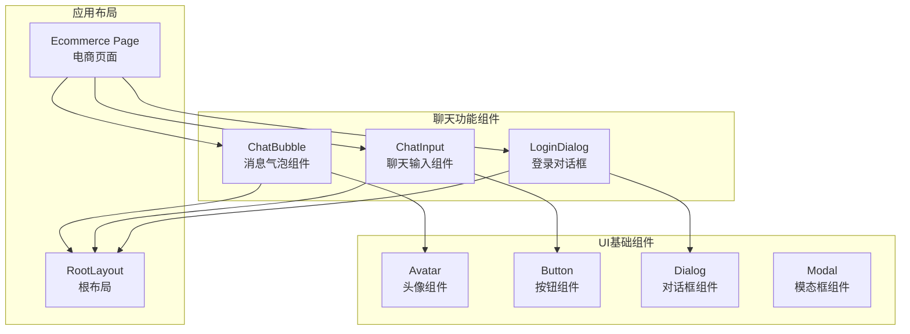
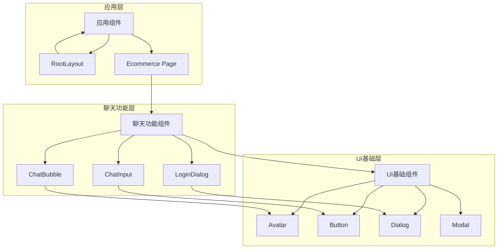
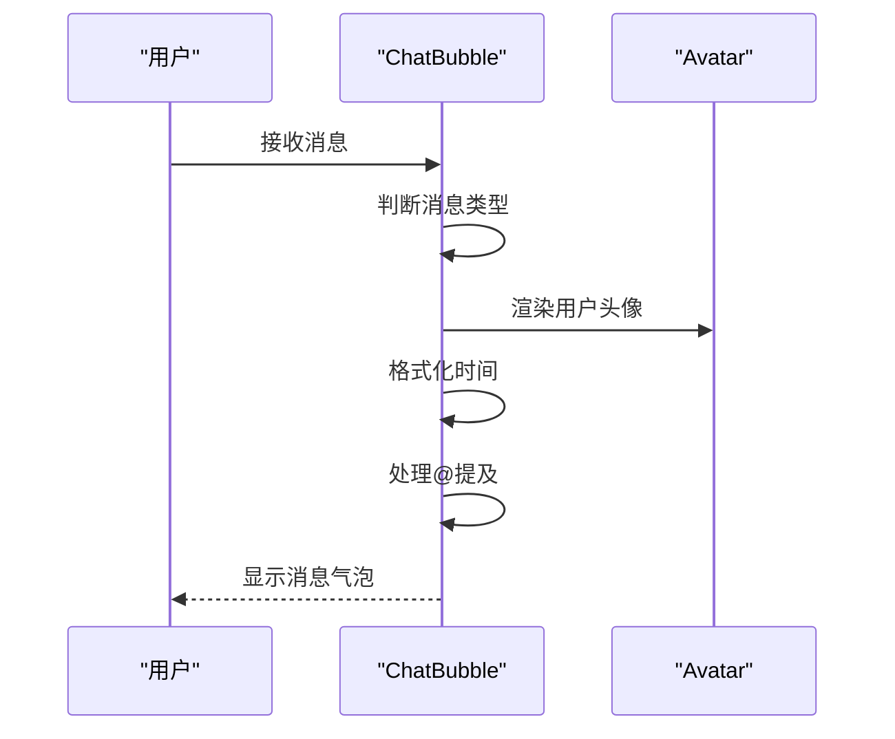
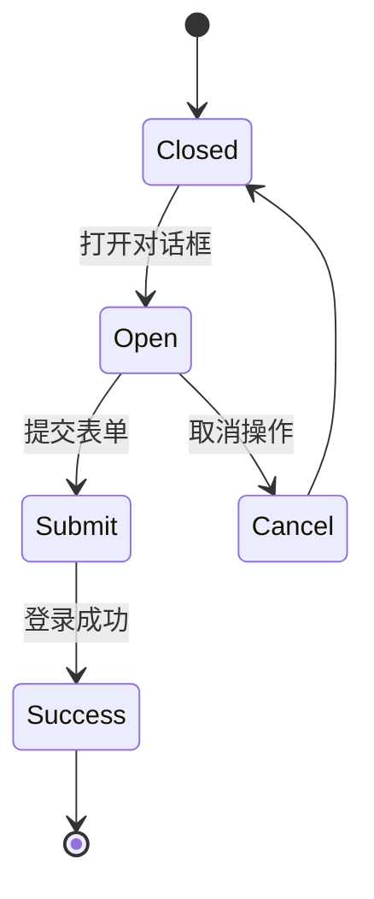
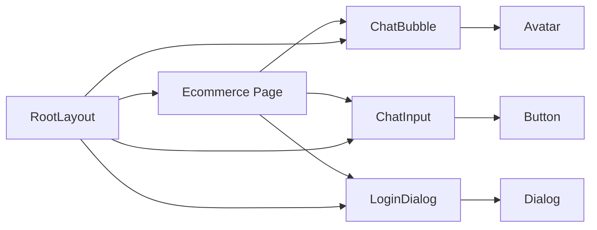

# UI元素页面

<cite>
**本文引用的文件**
- [src/components/ui/avatar.tsx](file://apps/web/src/components/ui/avatar.tsx)
- [src/components/ui/button.tsx](file://apps/web/src/components/ui/button.tsx)
- [src/components/ui/dialog.tsx](file://apps/web/src/components/ui/dialog.tsx)
- [src/components/ui/modal/index.tsx](file://apps/web/src/components/ui/modal/index.tsx)
- [src/components/chat/ChatBubble.tsx](file://apps/web/src/components/chat/ChatBubble.tsx)
- [src/components/chat/ChatInput.tsx](file://apps/web/src/components/chat/ChatInput.tsx)
- [src/components/chat/LoginDialog.tsx](file://apps/web/src/components/chat/LoginDialog.tsx)
- [src/app/layout.tsx](file://apps/web/src/app/layout.tsx)
- [src/app/(admin)/page.tsx](file://apps/web/src/app/(admin)/page.tsx)
- [src/components/common/ComponentCard.tsx](file://apps/web/src/components/common/ComponentCard.tsx)
- [src/components/common/PageBreadCrumb.tsx](file://apps/web/src/components/common/PageBreadCrumb.tsx)
- [src/icons/index.tsx](file://apps/web/src/icons/index.tsx)
</cite>

## 更新摘要
**所做更改**
- 更新了项目结构说明，反映代码库已简化为专注于核心聊天功能
- 调整了架构概述，重点介绍当前的聊天功能组件体系
- 更新了UI组件分析章节，仅保留当前存在的UI组件
- 删除了已不存在的UI元素页面相关内容
- 更新了依赖关系分析，反映当前的组件使用模式

## 目录
1. [简介](#简介)
2. [项目结构](#项目结构)
3. [核心组件](#核心组件)
4. [架构总览](#架构总览)
5. [聊天功能组件分析](#聊天功能组件分析)
6. [UI基础组件分析](#ui基础组件分析)
7. [依赖关系分析](#依赖关系分析)
8. [性能考量](#性能考量)
9. [故障排查指南](#故障排查指南)
10. [结论](#结论)
11. [附录](#附录)

## 简介
本文件面向需要理解当前项目架构的开发者，系统性梳理本仓库中基于聊天功能的核心组件设计与实现方式。由于项目已简化为专注于核心聊天功能，文档现在重点关注：
- 聊天界面的组件化设计与实现
- 头像、按钮、对话框等基础UI组件在聊天场景中的应用
- 聊天消息气泡、输入框、登录对话框等核心功能组件
- 组件组合模式、交互行为与响应式布局
- 聊天功能开发模板、组件复用策略与设计系统集成

## 项目结构
项目结构已简化为专注于聊天功能，主要包含聊天组件、UI基础组件和应用布局：



**图表来源**
- [src/components/chat/ChatBubble.tsx:1-132](file://apps/web/src/components/chat/ChatBubble.tsx#L1-L132)
- [src/components/chat/ChatInput.tsx:1-190](file://apps/web/src/components/chat/ChatInput.tsx#L1-L190)
- [src/components/chat/LoginDialog.tsx:1-117](file://apps/web/src/components/chat/LoginDialog.tsx#L1-L117)
- [src/components/ui/avatar.tsx:1-110](file://apps/web/src/components/ui/avatar.tsx#L1-L110)
- [src/components/ui/button.tsx:1-59](file://apps/web/src/components/ui/button.tsx#L1-L59)
- [src/components/ui/dialog.tsx:1-161](file://apps/web/src/components/ui/dialog.tsx#L1-L161)
- [src/components/ui/modal/index.tsx:1-96](file://apps/web/src/components/ui/modal/index.tsx#L1-L96)
- [src/app/layout.tsx:1-34](file://apps/web/src/app/layout.tsx#L1-L34)
- [src/app/(admin)/page.tsx:1-43](file://apps/web/src/app/(admin)/page.tsx#L1-L43)

**章节来源**
- [src/components/chat/ChatBubble.tsx:1-132](file://apps/web/src/components/chat/ChatBubble.tsx#L1-L132)
- [src/components/chat/ChatInput.tsx:1-190](file://apps/web/src/components/chat/ChatInput.tsx#L1-L190)
- [src/components/chat/LoginDialog.tsx:1-117](file://apps/web/src/components/chat/LoginDialog.tsx#L1-L117)
- [src/components/ui/avatar.tsx:1-110](file://apps/web/src/components/ui/avatar.tsx#L1-L110)
- [src/components/ui/button.tsx:1-59](file://apps/web/src/components/ui/button.tsx#L1-L59)
- [src/components/ui/dialog.tsx:1-161](file://apps/web/src/components/ui/dialog.tsx#L1-L161)
- [src/components/ui/modal/index.tsx:1-96](file://apps/web/src/components/ui/modal/index.tsx#L1-L96)
- [src/app/layout.tsx:1-34](file://apps/web/src/app/layout.tsx#L1-L34)
- [src/app/(admin)/page.tsx:1-43](file://apps/web/src/app/(admin)/page.tsx#L1-L43)

## 核心组件
- **聊天消息气泡组件**：负责渲染不同类型的消息（用户消息、系统消息），支持时间格式化、@提及高亮等功能
- **聊天输入组件**：提供消息输入、自动调整高度、@提及功能、在线人数显示等完整聊天体验
- **登录对话框组件**：提供用户登录验证，支持昵称设置和头像选择功能
- **头像组件**：支持不同尺寸、状态指示器、群组头像等聊天场景所需的头像展示
- **按钮组件**：提供多种变体和尺寸，支持图标插槽，满足聊天界面的各种交互需求
- **对话框组件**：提供模态对话框的基础功能，支持自定义内容和关闭按钮
- **应用布局**：包含主题提供者、Socket连接、侧边栏状态管理等全局功能

**章节来源**
- [src/components/chat/ChatBubble.tsx:1-132](file://apps/web/src/components/chat/ChatBubble.tsx#L1-L132)
- [src/components/chat/ChatInput.tsx:1-190](file://apps/web/src/components/chat/ChatInput.tsx#L1-L190)
- [src/components/chat/LoginDialog.tsx:1-117](file://apps/web/src/components/chat/LoginDialog.tsx#L1-L117)
- [src/components/ui/avatar.tsx:1-110](file://apps/web/src/components/ui/avatar.tsx#L1-L110)
- [src/components/ui/button.tsx:1-59](file://apps/web/src/components/ui/button.tsx#L1-L59)
- [src/components/ui/dialog.tsx:1-161](file://apps/web/src/components/ui/dialog.tsx#L1-L161)
- [src/app/layout.tsx:1-34](file://apps/web/src/app/layout.tsx#L1-L34)

## 架构总览
项目采用组件化架构，聊天功能作为核心业务模块，通过基础UI组件和布局组件协同工作。聊天组件直接使用UI基础组件，形成清晰的层次结构。



**图表来源**
- [src/components/chat/ChatBubble.tsx:1-132](file://apps/web/src/components/chat/ChatBubble.tsx#L1-L132)
- [src/components/chat/ChatInput.tsx:1-190](file://apps/web/src/components/chat/ChatInput.tsx#L1-L190)
- [src/components/chat/LoginDialog.tsx:1-117](file://apps/web/src/components/chat/LoginDialog.tsx#L1-L117)
- [src/components/ui/avatar.tsx:1-110](file://apps/web/src/components/ui/avatar.tsx#L1-L110)
- [src/components/ui/button.tsx:1-59](file://apps/web/src/components/ui/button.tsx#L1-L59)
- [src/components/ui/dialog.tsx:1-161](file://apps/web/src/components/ui/dialog.tsx#L1-L161)
- [src/components/ui/modal/index.tsx:1-96](file://apps/web/src/components/ui/modal/index.tsx#L1-L96)
- [src/app/layout.tsx:1-34](file://apps/web/src/app/layout.tsx#L1-L34)
- [src/app/(admin)/page.tsx:1-43](file://apps/web/src/app/(admin)/page.tsx#L1-L43)

## 聊天功能组件分析

### 聊天消息气泡组件（ChatBubble）
- **设计模式**
  - 条件渲染：根据消息类型渲染不同的UI组件（用户消息、系统消息）
  - 用户头像：集成头像组件，支持不同尺寸和占位符
  - 内容高亮：@提及功能的文本高亮显示
- **使用场景**
  - 实时聊天界面的消息展示
  - 系统通知和状态消息
  - 用户个人消息和群组消息
- **配置选项**
  - 消息类型：chat（用户消息）、system（系统消息）
  - 用户信息：昵称、头像索引、用户ID
  - 时间格式：本地化时间显示
- **样式定制**
  - 用户消息：绿色主题，右侧对齐
  - 系统消息：灰色主题，居中显示
  - 支持深色模式适配
- **交互行为**
  - 自动时间格式化
  - @提及的高亮显示
  - 不同消息类型的视觉区分



**图表来源**
- [src/components/chat/ChatBubble.tsx:1-132](file://apps/web/src/components/chat/ChatBubble.tsx#L1-L132)
- [src/components/ui/avatar.tsx:1-110](file://apps/web/src/components/ui/avatar.tsx#L1-L110)

**章节来源**
- [src/components/chat/ChatBubble.tsx:1-132](file://apps/web/src/components/chat/ChatBubble.tsx#L1-L132)

### 聊天输入组件（ChatInput）
- **设计模式**
  - 自动调整高度：根据输入内容动态调整textarea高度
  - @提及功能：智能提示用户列表
  - 键盘快捷键：Enter发送、Shift+Enter换行
- **使用场景**
  - 实时聊天消息输入
  - 群组聊天中的@提及功能
  - 在线用户状态显示
- **配置选项**
  - 输入值绑定：双向数据绑定
  - 成员列表：在线用户列表
  - 在线人数：实时在线统计
  - 禁用状态：输入框禁用控制
- **样式定制**
  - 自适应高度：最大120px限制
  - 提示样式：@提及提示框
  - 状态显示：在线人数标签
- **交互行为**
  - 自动高度调整
  - @提及搜索和选择
  - 键盘导航和选择
  - Enter发送消息

```mermaid
flowchart TD
Start(["开始输入"]) --> Type{"输入字符"}
Type --> |普通字符| AutoResize["自动调整高度"]
Type --> |@符号| Mention["开启@提及"]
Mention --> Search["搜索匹配用户"]
Search --> ShowList["显示用户列表"]
ShowList --> Select{"选择用户"}
Select --> |确定| Insert["插入用户名"]
Select --> |取消| Close["关闭列表"]
AutoResize --> Send{"按键操作"}
Insert --> Send
Close --> Send
Send --> |Enter| SendMessage["发送消息"]
Send --> |Shift+Enter| NewLine["新行"]
SendMessage --> End(["完成"])
NewLine --> End
```

**图表来源**
- [src/components/chat/ChatInput.tsx:1-190](file://apps/web/src/components/chat/ChatInput.tsx#L1-L190)

**章节来源**
- [src/components/chat/ChatInput.tsx:1-190](file://apps/web/src/components/chat/ChatInput.tsx#L1-L190)

### 登录对话框组件（LoginDialog）
- **设计模式**
  - 表单验证：昵称输入验证和提交控制
  - 头像选择：网格布局的头像预览和选择
  - 状态管理：打开/关闭状态和用户输入状态
- **使用场景**
  - 用户首次进入聊天室的身份验证
  - 切换用户身份时的重新登录
  - 用户信息初始化设置
- **配置选项**
  - 对话框状态：open属性控制显示隐藏
  - 登录回调：onLogin函数处理登录逻辑
  - 取消功能：onCancel可选的取消处理
- **样式定制**
  - 响应式网格：6列头像预览布局
  - 选中状态：选中头像的边框和阴影效果
  - 禁用状态：无效输入时的按钮禁用
- **交互行为**
  - 昵称输入验证和回车提交
  - 头像点击选择和视觉反馈
  - 登录按钮的状态控制



**图表来源**
- [src/components/chat/LoginDialog.tsx:1-117](file://apps/web/src/components/chat/LoginDialog.tsx#L1-L117)

**章节来源**
- [src/components/chat/LoginDialog.tsx:1-117](file://apps/web/src/components/chat/LoginDialog.tsx#L1-L117)

## UI基础组件分析

### 头像组件（Avatar）
- **设计模式**
  - 多尺寸支持：sm、default、lg三种尺寸
  - 状态指示：在线、离线、忙碌等状态显示
  - 群组头像：多个头像的重叠显示
- **使用场景**
  - 聊天界面的用户标识
  - 成员列表展示
  - 群组头像显示
- **配置选项**
  - 尺寸：small、default、large
  - 状态：在线、离线、忙碌状态指示器
  - 群组：多个用户的头像组合
- **样式定制**
  - 尺寸与图标大小的联动
  - 状态指示器的位置和大小
  - 群组头像的重叠间距
- **交互行为**
  - 状态指示器的视觉反馈
  - 点击事件的传递
  - 加载失败的占位符显示

**章节来源**
- [src/components/ui/avatar.tsx:1-110](file://apps/web/src/components/ui/avatar.tsx#L1-L110)

### 按钮组件（Button）
- **设计模式**
  - 变体系统：default、outline、secondary、ghost、destructive、link
  - 尺寸系统：default、xs、sm、lg、icon等
  - 图标支持：起始图标和结束图标插槽
- **使用场景**
  - 聊天发送按钮
  - 功能操作按钮
  - 导航按钮
- **配置选项**
  - 变体：不同视觉风格的主题色
  - 尺寸：不同密度的按钮大小
  - 禁用状态：交互状态控制
  - 图标：SVG图标的支持
- **样式定制**
  - 主题色的变体切换
  - 悬停、聚焦、禁用状态
  - 图标与文字的间距
- **交互行为**
  - 基础的悬停、聚焦反馈
  - 点击状态的视觉变化
  - 禁用状态的交互阻止

**章节来源**
- [src/components/ui/button.tsx:1-59](file://apps/web/src/components/ui/button.tsx#L1-L59)

### 对话框组件（Dialog）
- **设计模式**
  - 模态容器：提供对话框的基础容器和背景遮罩
  - 内容组织：头部、主体、底部的标准结构
  - 关闭机制：Esc键关闭和外部点击关闭
- **使用场景**
  - 登录对话框
  - 确认对话框
  - 设置对话框
- **配置选项**
  - 打开状态：open属性控制显示隐藏
  - 关闭按钮：showCloseButton控制是否显示
  - 内容结构：标题、描述、操作按钮
- **样式定制**
  - 动画效果：打开/关闭的淡入淡出动画
  - 响应式宽度：最大宽度和自适应布局
  - 边框和阴影：卡片样式的视觉效果
- **交互行为**
  - Esc键监听和关闭
  - 外部点击关闭
  - 焦点管理和键盘导航

**章节来源**
- [src/components/ui/dialog.tsx:1-161](file://apps/web/src/components/ui/dialog.tsx#L1-L161)

### 模态框组件（Modal）
- **设计模式**
  - 容器管理：提供模态框的基础容器和遮罩
  - 事件处理：Esc键监听和外部点击关闭
  - 样式控制：全屏和常规模态框的不同样式
- **使用场景**
  - 图片查看器
  - 设置面板
  - 全屏内容展示
- **配置选项**
  - 开启状态：isOpen控制显示隐藏
  - 关闭回调：onClose处理关闭逻辑
  - 关闭按钮：showCloseButton控制显示
  - 全屏模式：isFullscreen控制布局
- **样式定制**
  - 遮罩效果：半透明背景和模糊效果
  - 关闭按钮：绝对定位和响应式尺寸
  - 内容区域：圆角和背景色设置
- **交互行为**
  - Esc键监听和关闭
  - 外部点击关闭
  - 滚动锁定和焦点管理

**章节来源**
- [src/components/ui/modal/index.tsx:1-96](file://apps/web/src/components/ui/modal/index.tsx#L1-L96)

## 依赖关系分析
- **聊天组件依赖**
  - ChatBubble依赖Avatar组件进行用户头像展示
  - ChatInput依赖Button组件进行发送按钮
  - LoginDialog依赖Dialog组件进行对话框功能
- **UI基础组件**
  - 所有聊天组件都依赖基础UI组件
  - 组件间保持松耦合的依赖关系
- **应用层依赖**
  - 聊天组件依赖应用布局和上下文提供者
  - 全局主题和Socket连接的集成



**图表来源**
- [src/components/chat/ChatBubble.tsx:1-132](file://apps/web/src/components/chat/ChatBubble.tsx#L1-L132)
- [src/components/chat/ChatInput.tsx:1-190](file://apps/web/src/components/chat/ChatInput.tsx#L1-L190)
- [src/components/chat/LoginDialog.tsx:1-117](file://apps/web/src/components/chat/LoginDialog.tsx#L1-L117)
- [src/components/ui/avatar.tsx:1-110](file://apps/web/src/components/ui/avatar.tsx#L1-L110)
- [src/components/ui/button.tsx:1-59](file://apps/web/src/components/ui/button.tsx#L1-L59)
- [src/components/ui/dialog.tsx:1-161](file://apps/web/src/components/ui/dialog.tsx#L1-L161)
- [src/app/layout.tsx:1-34](file://apps/web/src/app/layout.tsx#L1-L34)
- [src/app/(admin)/page.tsx:1-43](file://apps/web/src/app/(admin)/page.tsx#L1-L43)

**章节来源**
- [src/components/chat/ChatBubble.tsx:1-132](file://apps/web/src/components/chat/ChatBubble.tsx#L1-L132)
- [src/components/chat/ChatInput.tsx:1-190](file://apps/web/src/components/chat/ChatInput.tsx#L1-L190)
- [src/components/chat/LoginDialog.tsx:1-117](file://apps/web/src/components/chat/LoginDialog.tsx#L1-L117)
- [src/components/ui/avatar.tsx:1-110](file://apps/web/src/components/ui/avatar.tsx#L1-L110)
- [src/components/ui/button.tsx:1-59](file://apps/web/src/components/ui/button.tsx#L1-L59)
- [src/components/ui/dialog.tsx:1-161](file://apps/web/src/components/ui/dialog.tsx#L1-L161)
- [src/app/layout.tsx:1-34](file://apps/web/src/app/layout.tsx#L1-L34)
- [src/app/(admin)/page.tsx:1-43](file://apps/web/src/app/(admin)/page.tsx#L1-L43)

## 性能考量
- **组件渲染优化**
  - ChatBubble使用React.memo避免不必要的重新渲染
  - ChatInput的@提及功能使用防抖和条件渲染
- **资源加载**
  - 头像图片使用Next.js Image组件优化加载
  - 聊天消息的自动高度调整使用原生DOM操作
- **交互优化**
  - 按钮组件的禁用状态避免无效的事件处理
  - 聊天输入的textarea自动调整高度减少重排
- **建议**
  - 对大量聊天消息的列表可以考虑虚拟滚动
  - 头像图片可以添加懒加载和占位符

## 故障排查指南
- **聊天消息不显示**
  - 检查消息数据结构和类型判断
  - 确认用户信息的完整性和头像索引
- **@提及功能异常**
  - 检查成员列表的数据格式
  - 确认@符号检测和光标位置计算
- **输入框高度问题**
  - 检查textarea的ref引用和scrollHeight计算
  - 确认最小和最大高度限制
- **头像显示问题**
  - 检查图片路径和占位符逻辑
  - 确认头像尺寸和状态指示器的样式
- **按钮交互问题**
  - 检查变体和尺寸参数的正确性
  - 确认图标插槽的使用和禁用状态
- **对话框显示问题**
  - 检查open属性和状态管理
  - 确认Esc键监听和外部点击关闭功能
- **模态框问题**
  - 检查isOpen状态和事件监听
  - 确认滚动锁定和焦点管理

## 结论
当前项目已简化为专注于核心聊天功能，通过精心设计的组件架构实现了完整的聊天体验。聊天消息气泡、输入组件和登录对话框提供了丰富的交互功能，基础UI组件确保了良好的用户体验。这种组件化的设计使得代码具有良好的可维护性和扩展性，适合进一步的功能增强和优化。

## 附录
- **开发模板建议**
  - 聊天组件：基于ChatBubble和ChatInput的组合模式
  - UI组件：利用Button和Avatar的变体系统
  - 对话框组件：基于Dialog的登录对话框模式
  - 布局组件：遵循RootLayout的上下文提供者模式
- **组件复用策略**
  - 聊天组件直接复用基础UI组件
  - 通过props传递实现组件间的解耦
  - 使用TypeScript接口确保类型安全
- **设计系统集成**
  - 组件样式遵循Base UI的设计系统
  - 主题系统支持深色模式切换
  - 响应式设计适配不同设备尺寸