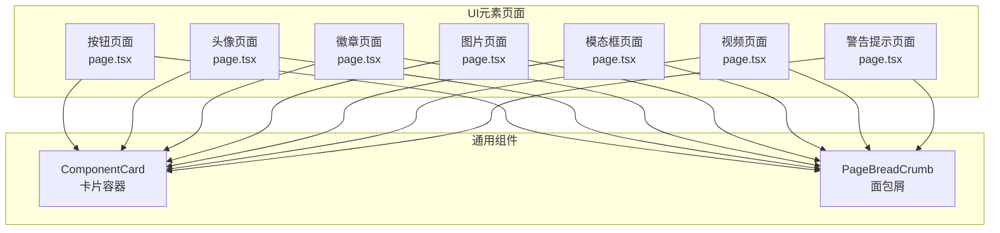
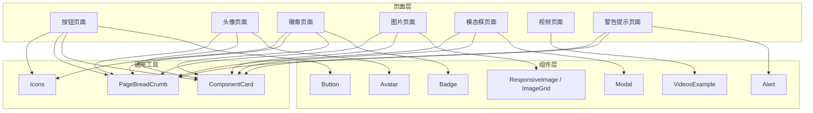
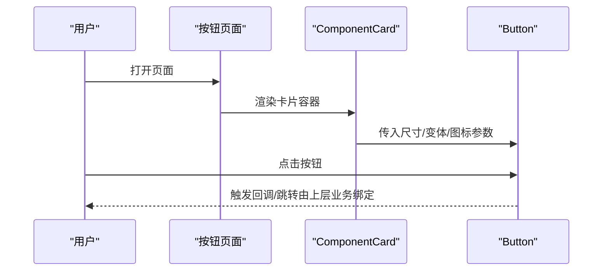
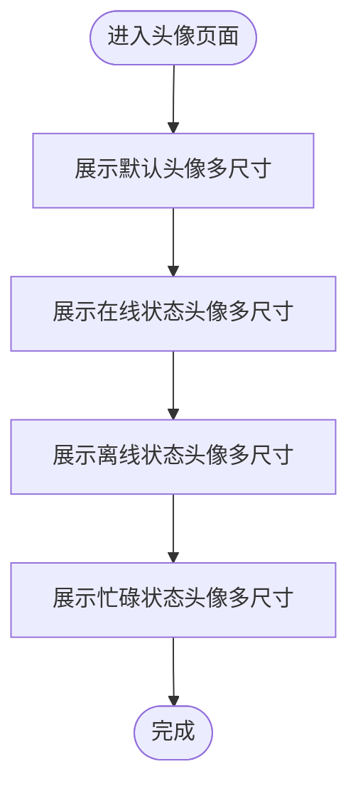
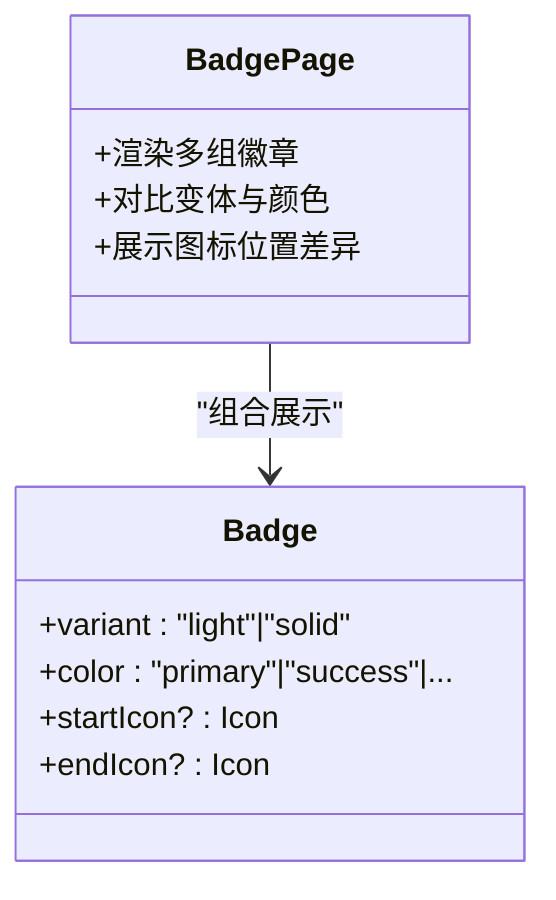
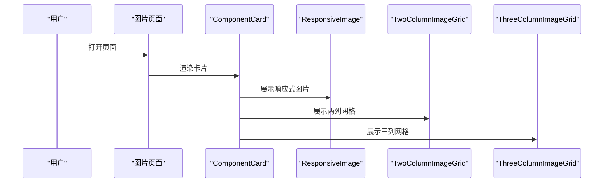
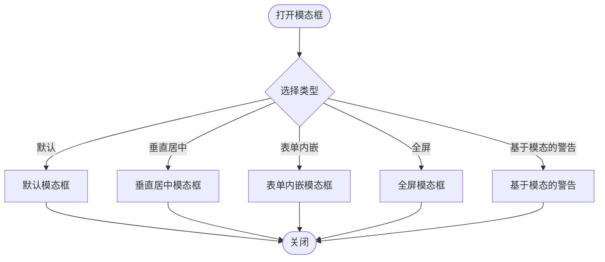
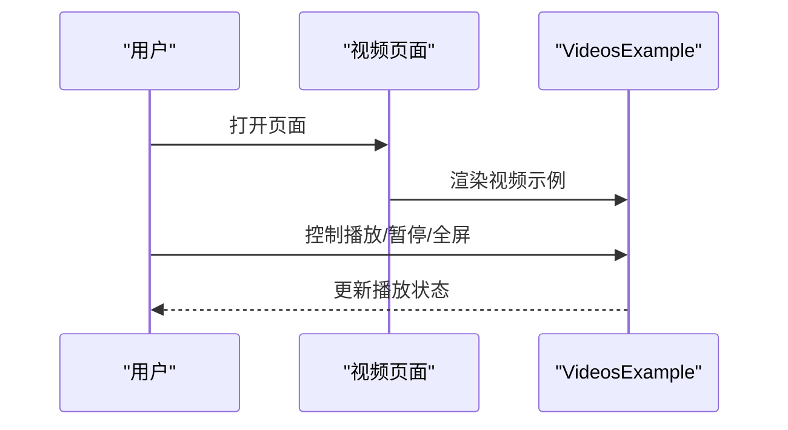
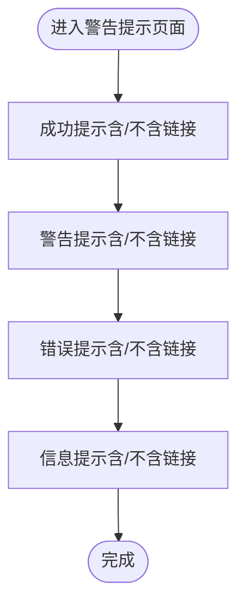
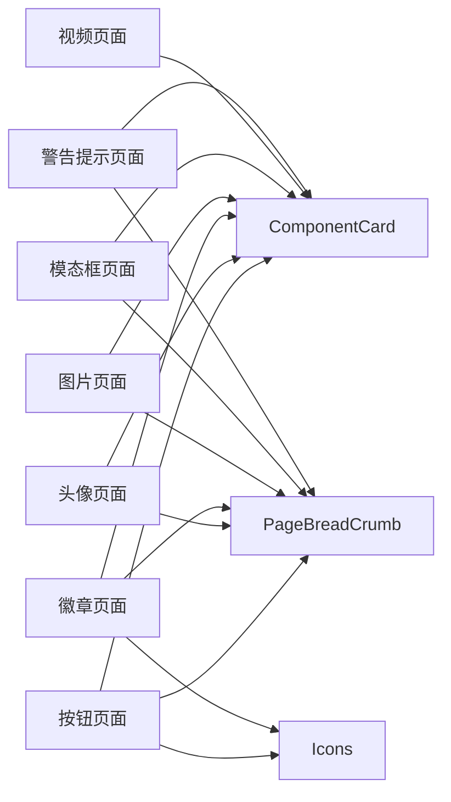

# UI元素页面

<cite>
**本文引用的文件**
- [src/app/(admin)/(ui-elements)/buttons/page.tsx](file://src/app/(admin)/(ui-elements)/buttons/page.tsx)
- [src/app/(admin)/(ui-elements)/avatars/page.tsx](file://src/app/(admin)/(ui-elements)/avatars/page.tsx)
- [src/app/(admin)/(ui-elements)/badge/page.tsx](file://src/app/(admin)/(ui-elements)/badge/page.tsx)
- [src/app/(admin)/(ui-elements)/images/page.tsx](file://src/app/(admin)/(ui-elements)/images/page.tsx)
- [src/app/(admin)/(ui-elements)/modals/page.tsx](file://src/app/(admin)/(ui-elements)/modals/page.tsx)
- [src/app/(admin)/(ui-elements)/videos/page.tsx](file://src/app/(admin)/(ui-elements)/videos/page.tsx)
- [src/app/(admin)/(ui-elements)/alerts/page.tsx](file://src/app/(admin)/(ui-elements)/alerts/page.tsx)
- [src/components/common/ComponentCard.tsx](file://src/components/common/ComponentCard.tsx)
- [src/components/common/PageBreadCrumb.tsx](file://src/components/common/PageBreadCrumb.tsx)
- [src/components/ui/button/Button.tsx](file://src/components/ui/button/Button.tsx)
- [src/components/ui/avatar/Avatar.tsx](file://src/components/ui/avatar/Avatar.tsx)
- [src/components/ui/badge/Badge.tsx](file://src/components/ui/badge/Badge.tsx)
- [src/components/ui/images/ResponsiveImage.tsx](file://src/components/ui/images/ResponsiveImage.tsx)
- [src/components/ui/images/TwoColumnImageGrid.tsx](file://src/components/ui/images/TwoColumnImageGrid.tsx)
- [src/components/ui/images/ThreeColumnImageGrid.tsx](file://src/components/ui/images/ThreeColumnImageGrid.tsx)
- [src/components/ui/modal/index.tsx](file://src/components/ui/modal/index.tsx)
- [src/components/ui/video/VideosExample.tsx](file://src/components/ui/video/VideosExample.tsx)
- [src/components/ui/alert/Alert.tsx](file://src/components/ui/alert/Alert.tsx)
- [src/icons/index.tsx](file://src/icons/index.tsx)
</cite>

## 目录
1. [简介](#简介)
2. [项目结构](#项目结构)
3. [核心组件](#核心组件)
4. [架构总览](#架构总览)
5. [详细组件分析](#详细组件分析)
6. [依赖关系分析](#依赖关系分析)
7. [性能考量](#性能考量)
8. [故障排查指南](#故障排查指南)
9. [结论](#结论)
10. [附录](#附录)

## 简介
本文件面向需要创建“UI元素页面”的开发者，系统性梳理本仓库中按钮、徽章、头像、模态框、图片、视频、警告提示等UI组件的展示页面设计与实现方式。文档涵盖：
- 设计模式与页面组织方式
- 各组件的使用场景、配置项与样式定制
- 组件组合模式、交互行为与响应式布局
- 开发模板、组件复用策略与设计系统集成建议

## 项目结构
UI元素页面位于应用路由分组 `(admin)/(ui-elements)/` 下，每个子页面对应一个UI类别，统一通过面包屑导航与卡片容器进行内容组织，便于快速浏览与对比不同变体。

**图表来源**
- [src/app/(admin)/(ui-elements)/buttons/page.tsx](file://src/app/(admin)/(ui-elements)/buttons/page.tsx#L14-L89)
- [src/app/(admin)/(ui-elements)/avatars/page.tsx](file://src/app/(admin)/(ui-elements)/avatars/page.tsx#L13-L126)
- [src/app/(admin)/(ui-elements)/badge/page.tsx](file://src/app/(admin)/(ui-elements)/badge/page.tsx#L14-L221)
- [src/app/(admin)/(ui-elements)/images/page.tsx](file://src/app/(admin)/(ui-elements)/images/page.tsx#L16-L33)
- [src/app/(admin)/(ui-elements)/modals/page.tsx](file://src/app/(admin)/(ui-elements)/modals/page.tsx#L17-L30)
- [src/app/(admin)/(ui-elements)/videos/page.tsx](file://src/app/(admin)/(ui-elements)/videos/page.tsx#L12-L20)
- [src/app/(admin)/(ui-elements)/alerts/page.tsx](file://src/app/(admin)/(ui-elements)/alerts/page.tsx#L14-L86)

**章节来源**
- [src/app/(admin)/(ui-elements)/buttons/page.tsx](file://src/app/(admin)/(ui-elements)/buttons/page.tsx#L1-L90)
- [src/app/(admin)/(ui-elements)/avatars/page.tsx](file://src/app/(admin)/(ui-elements)/avatars/page.tsx#L1-L127)
- [src/app/(admin)/(ui-elements)/badge/page.tsx](file://src/app/(admin)/(ui-elements)/badge/page.tsx#L1-L222)
- [src/app/(admin)/(ui-elements)/images/page.tsx](file://src/app/(admin)/(ui-elements)/images/page.tsx#L1-L34)
- [src/app/(admin)/(ui-elements)/modals/page.tsx](file://src/app/(admin)/(ui-elements)/modals/page.tsx#L1-L31)
- [src/app/(admin)/(ui-elements)/videos/page.tsx](file://src/app/(admin)/(ui-elements)/videos/page.tsx#L1-L21)
- [src/app/(admin)/(ui-elements)/alerts/page.tsx](file://src/app/(admin)/(ui-elements)/alerts/page.tsx#L1-L87)

## 核心组件
- 页面容器与布局
  - 面包屑导航：用于标识当前页面主题，提升可发现性。
  - 卡片容器：为每组示例提供标题与分隔，统一视觉节奏。
- 图标系统：通过图标索引集中导出，便于在按钮、徽章等组件中作为前后缀图标使用。
- 通用页面元数据：各页面均定义了标题与描述，利于SEO与分享预览。

**章节来源**
- [src/components/common/PageBreadCrumb.tsx](file://src/components/common/PageBreadCrumb.tsx)
- [src/components/common/ComponentCard.tsx](file://src/components/common/ComponentCard.tsx)
- [src/icons/index.tsx](file://src/icons/index.tsx)

## 架构总览
UI元素页面采用“页面即示例集合”的组织方式：每个页面引入一组相关组件，并以卡片形式展示不同变体（尺寸、状态、颜色、图标位置等）。页面内不直接耦合业务逻辑，仅负责组合与呈现，确保高复用与易维护。

**图表来源**
- [src/app/(admin)/(ui-elements)/buttons/page.tsx](file://src/app/(admin)/(ui-elements)/buttons/page.tsx#L1-L90)
- [src/app/(admin)/(ui-elements)/avatars/page.tsx](file://src/app/(admin)/(ui-elements)/avatars/page.tsx#L1-L127)
- [src/app/(admin)/(ui-elements)/badge/page.tsx](file://src/app/(admin)/(ui-elements)/badge/page.tsx#L1-L222)
- [src/app/(admin)/(ui-elements)/images/page.tsx](file://src/app/(admin)/(ui-elements)/images/page.tsx#L1-L34)
- [src/app/(admin)/(ui-elements)/modals/page.tsx](file://src/app/(admin)/(ui-elements)/modals/page.tsx#L1-L31)
- [src/app/(admin)/(ui-elements)/videos/page.tsx](file://src/app/(admin)/(ui-elements)/videos/page.tsx#L1-L21)
- [src/app/(admin)/(ui-elements)/alerts/page.tsx](file://src/app/(admin)/(ui-elements)/alerts/page.tsx#L1-L87)
- [src/components/ui/button/Button.tsx](file://src/components/ui/button/Button.tsx)
- [src/components/ui/avatar/Avatar.tsx](file://src/components/ui/avatar/Avatar.tsx)
- [src/components/ui/badge/Badge.tsx](file://src/components/ui/badge/Badge.tsx)
- [src/components/ui/images/ResponsiveImage.tsx](file://src/components/ui/images/ResponsiveImage.tsx)
- [src/components/ui/images/TwoColumnImageGrid.tsx](file://src/components/ui/images/TwoColumnImageGrid.tsx)
- [src/components/ui/images/ThreeColumnImageGrid.tsx](file://src/components/ui/images/ThreeColumnImageGrid.tsx)
- [src/components/ui/modal/index.tsx](file://src/components/ui/modal/index.tsx)
- [src/components/ui/video/VideosExample.tsx](file://src/components/ui/video/VideosExample.tsx)
- [src/components/ui/alert/Alert.tsx](file://src/components/ui/alert/Alert.tsx)

## 详细组件分析

### 按钮页面（Buttons）
- 设计模式
  - 使用卡片容器分组展示不同变体，如主按钮与轮廓按钮、带左右图标的按钮等。
  - 通过尺寸与变体参数控制外观与语义层级。
- 使用场景
  - 主要操作：使用主按钮强调重要动作。
  - 次要或取消操作：使用轮廓按钮降低视觉权重。
  - 带图标的按钮：用于直观传达操作意图。
- 配置选项
  - 尺寸：小、中等等多档位。
  - 变体：主按钮、轮廓按钮等。
  - 图标：起始图标与结束图标，支持任意SVG组件。
- 样式定制
  - 通过变体与尺寸参数切换主题色与密度。
  - 图标通过插槽注入，保持一致的间距与对齐。
- 组合模式
  - 在同一卡片内横向排列不同尺寸，便于对比。
  - 左右图标与无图标的版本并列展示，突出图标差异。
- 响应式设计
  - 使用弹性布局与间距类，保证在小屏下仍保持良好的可读性与点击面积。
- 交互行为
  - 按钮具备基础悬停、聚焦与禁用态，具体交互由底层组件实现。

**图表来源**
- [src/app/(admin)/(ui-elements)/buttons/page.tsx](file://src/app/(admin)/(ui-elements)/buttons/page.tsx#L14-L89)
- [src/components/common/ComponentCard.tsx](file://src/components/common/ComponentCard.tsx)
- [src/components/ui/button/Button.tsx](file://src/components/ui/button/Button.tsx)

**章节来源**
- [src/app/(admin)/(ui-elements)/buttons/page.tsx](file://src/app/(admin)/(ui-elements)/buttons/page.tsx#L1-L90)
- [src/components/ui/button/Button.tsx](file://src/components/ui/button/Button.tsx)

### 头像页面（Avatars）
- 设计模式
  - 分组展示默认头像与带在线/离线/忙碌状态的头像，按尺寸递增排列。
- 使用场景
  - 用户资料、消息列表、评论区等场景下的身份标识。
- 配置选项
  - 尺寸：超小到超大多档位。
  - 状态：在线、离线、忙碌等状态指示器。
- 样式定制
  - 状态指示器与尺寸联动，确保在不同尺寸下保持合适的视觉权重。
- 组合模式
  - 同一卡片内横向展示多尺寸，便于对比视觉效果。
- 响应式设计
  - 在小屏设备上调整为纵向堆叠，避免拥挤。
- 交互行为
  - 头像通常作为静态展示，可结合点击事件跳转至用户详情页。

**图表来源**
- [src/app/(admin)/(ui-elements)/avatars/page.tsx](file://src/app/(admin)/(ui-elements)/avatars/page.tsx#L13-L126)
- [src/components/ui/avatar/Avatar.tsx](file://src/components/ui/avatar/Avatar.tsx)

**章节来源**
- [src/app/(admin)/(ui-elements)/avatars/page.tsx](file://src/app/(admin)/(ui-elements)/avatars/page.tsx#L1-L127)
- [src/components/ui/avatar/Avatar.tsx](file://src/components/ui/avatar/Avatar.tsx)

### 徽章页面（Badge）
- 设计模式
  - 分组展示浅色背景与实心背景两类，以及带左右图标的版本。
- 使用场景
  - 标签、计数、状态提示等非主要操作区域。
- 配置选项
  - 变体：浅色、实心。
  - 颜色：主色、成功、错误、警告、信息、浅色、深色。
  - 图标：起始图标与结束图标。
- 样式定制
  - 通过变体与颜色参数快速切换风格与语义。
  - 图标位置通过插槽控制，保持与文本的对齐一致性。
- 组合模式
  - 同一卡片内横向展示多种颜色，便于对比。
  - 左右图标版本分别展示，突出图标位置差异。
- 响应式设计
  - 使用换行与居中类，使多徽章在窄屏下自动换行。
- 交互行为
  - 徽章通常为只读展示，可结合点击事件触发筛选或跳转。

**图表来源**
- [src/app/(admin)/(ui-elements)/badge/page.tsx](file://src/app/(admin)/(ui-elements)/badge/page.tsx#L14-L221)
- [src/components/ui/badge/Badge.tsx](file://src/components/ui/badge/Badge.tsx)

**章节来源**
- [src/app/(admin)/(ui-elements)/badge/page.tsx](file://src/app/(admin)/(ui-elements)/badge/page.tsx#L1-L222)
- [src/components/ui/badge/Badge.tsx](file://src/components/ui/badge/Badge.tsx)

### 图片页面（Images）
- 设计模式
  - 展示响应式图片与网格布局两种典型用法。
- 使用场景
  - 产品图册、画廊、缩略图列表等。
- 配置选项
  - 响应式图片：自动适配容器宽度与像素密度。
  - 网格布局：两列与三列网格，支持等比缩放与间距控制。
- 样式定制
  - 通过容器类控制布局与间距，确保在不同断点下保持良好观感。
- 组合模式
  - 单独卡片展示单一功能，便于独立测试与复用。
- 响应式设计
  - 基于CSS媒体查询与Flex/Grid布局，自适应移动端与桌面端。
- 交互行为
  - 图片通常为只读展示，可结合点击事件放大或跳转详情。

**图表来源**
- [src/app/(admin)/(ui-elements)/images/page.tsx](file://src/app/(admin)/(ui-elements)/images/page.tsx#L16-L33)
- [src/components/ui/images/ResponsiveImage.tsx](file://src/components/ui/images/ResponsiveImage.tsx)
- [src/components/ui/images/TwoColumnImageGrid.tsx](file://src/components/ui/images/TwoColumnImageGrid.tsx)
- [src/components/ui/images/ThreeColumnImageGrid.tsx](file://src/components/ui/images/ThreeColumnImageGrid.tsx)

**章节来源**
- [src/app/(admin)/(ui-elements)/images/page.tsx](file://src/app/(admin)/(ui-elements)/images/page.tsx#L1-L34)

### 模态框页面（Modals）
- 设计模式
  - 以网格布局展示多种模态框示例：默认、垂直居中、表单内嵌、全屏、基于模态的警告等。
- 使用场景
  - 表单提交、确认对话、富内容弹窗、全屏预览等。
- 配置选项
  - 弹窗类型：默认、全屏、垂直居中等。
  - 内容：表单、文本、图片、视频等。
- 样式定制
  - 通过布局类控制卡片网格，确保在不同屏幕尺寸下合理排列。
- 组合模式
  - 将多个示例放在同一页面，便于对比不同交互形态。
- 响应式设计
  - 网格根据断点变化，保证在小屏设备上的可用性。
- 交互行为
  - 模态框的打开/关闭、遮罩点击、键盘Esc等交互由底层模态组件处理。

**图表来源**
- [src/app/(admin)/(ui-elements)/modals/page.tsx](file://src/app/(admin)/(ui-elements)/modals/page.tsx#L17-L30)
- [src/components/ui/modal/index.tsx](file://src/components/ui/modal/index.tsx)

**章节来源**
- [src/app/(admin)/(ui-elements)/modals/page.tsx](file://src/app/(admin)/(ui-elements)/modals/page.tsx#L1-L31)
- [src/components/ui/modal/index.tsx](file://src/components/ui/modal/index.tsx)

### 视频页面（Videos）
- 设计模式
  - 通过示例组件集中展示视频播放的常见场景。
- 使用场景
  - 教程视频、产品演示、直播预览等。
- 配置选项
  - 视频源：本地或外部嵌入（如YouTube）。
  - 容器比例：等比缩放以适配不同屏幕。
- 样式定制
  - 通过容器类控制宽高比与边距，确保在不同设备上保持一致观感。
- 组合模式
  - 将多种视频示例整合在一个页面，便于快速查阅与复用。
- 响应式设计
  - 基于宽高比容器实现流式缩放。
- 交互行为
  - 视频播放、暂停、全屏等由底层播放器组件处理。

**图表来源**
- [src/app/(admin)/(ui-elements)/videos/page.tsx](file://src/app/(admin)/(ui-elements)/videos/page.tsx#L12-L20)
- [src/components/ui/video/VideosExample.tsx](file://src/components/ui/video/VideosExample.tsx)

**章节来源**
- [src/app/(admin)/(ui-elements)/videos/page.tsx](file://src/app/(admin)/(ui-elements)/videos/page.tsx#L1-L21)
- [src/components/ui/video/VideosExample.tsx](file://src/components/ui/video/VideosExample.tsx)

### 警告提示页面（Alerts）
- 设计模式
  - 分组展示成功、警告、错误、信息四类提示，每类均提供带链接与不带链接两个版本。
- 使用场景
  - 操作反馈、错误提示、状态通知、引导性信息等。
- 配置选项
  - 变体：成功、警告、错误、信息。
  - 标题与消息：支持简短文案与可选链接。
  - 链接：可显示/隐藏，支持外链或内部路由。
- 样式定制
  - 通过变体参数切换语义色彩与图标。
  - 链接样式与间距统一，确保可读性。
- 组合模式
  - 同类变体成组展示，便于对比语义差异。
- 响应式设计
  - 文案与链接在小屏下自动换行，保证可读性。
- 交互行为
  - 链接点击由上层业务绑定，组件仅负责渲染。

**图表来源**
- [src/app/(admin)/(ui-elements)/alerts/page.tsx](file://src/app/(admin)/(ui-elements)/alerts/page.tsx#L14-L86)
- [src/components/ui/alert/Alert.tsx](file://src/components/ui/alert/Alert.tsx)

**章节来源**
- [src/app/(admin)/(ui-elements)/alerts/page.tsx](file://src/app/(admin)/(ui-elements)/alerts/page.tsx#L1-L87)
- [src/components/ui/alert/Alert.tsx](file://src/components/ui/alert/Alert.tsx)

## 依赖关系分析
- 页面到组件
  - 每个UI元素页面仅依赖通用容器与目标组件，耦合度低，便于替换与扩展。
- 通用依赖
  - 页面统一依赖面包屑与卡片容器，形成一致的页面骨架。
  - 图标通过索引导出，减少页面对具体SVG的依赖。
- 组件间关系
  - 模态框示例组件与底层模态组件解耦，页面仅负责组合与布局。
  - 视频示例组件封装播放器细节，页面仅负责调用。

**图表来源**
- [src/app/(admin)/(ui-elements)/buttons/page.tsx](file://src/app/(admin)/(ui-elements)/buttons/page.tsx#L1-L90)
- [src/app/(admin)/(ui-elements)/avatars/page.tsx](file://src/app/(admin)/(ui-elements)/avatars/page.tsx#L1-L127)
- [src/app/(admin)/(ui-elements)/badge/page.tsx](file://src/app/(admin)/(ui-elements)/badge/page.tsx#L1-L222)
- [src/app/(admin)/(ui-elements)/images/page.tsx](file://src/app/(admin)/(ui-elements)/images/page.tsx#L1-L34)
- [src/app/(admin)/(ui-elements)/modals/page.tsx](file://src/app/(admin)/(ui-elements)/modals/page.tsx#L1-L31)
- [src/app/(admin)/(ui-elements)/videos/page.tsx](file://src/app/(admin)/(ui-elements)/videos/page.tsx#L1-L21)
- [src/app/(admin)/(ui-elements)/alerts/page.tsx](file://src/app/(admin)/(ui-elements)/alerts/page.tsx#L1-L87)
- [src/icons/index.tsx](file://src/icons/index.tsx)

**章节来源**
- [src/icons/index.tsx](file://src/icons/index.tsx)

## 性能考量
- 资源加载
  - 图片与视频采用懒加载与响应式适配，减少首屏压力。
- 组件渲染
  - 页面仅负责组合与布局，避免在页面层做复杂计算。
- 交互优化
  - 模态框与视频组件内部处理焦点管理与键盘事件，页面无需重复实现。
- 建议
  - 对于大量图片的网格，建议启用占位符与渐进式加载，提升感知性能。

## 故障排查指南
- 图标未显示
  - 检查图标是否正确从索引导出并在页面中使用。
- 图片加载失败
  - 确认资源路径有效且与public目录结构一致。
- 模态框无法关闭
  - 检查模态组件的开关状态与遮罩点击事件绑定。
- 视频无法播放
  - 检查视频源地址与跨域设置，必要时使用嵌入式播放器组件。
- 响应式异常
  - 检查容器类与断点类的使用，确保在目标设备上生效。

## 结论
本项目的UI元素页面以“页面即示例集合”为核心理念，通过统一的容器与布局规范，高效展示了按钮、头像、徽章、图片、模态框、视频与警告提示等组件的多种变体与组合方式。该模式易于扩展与维护，适合快速构建组件展示页面与设计系统文档。

## 附录
- 开发模板建议
  - 页面骨架：面包屑 + 卡片容器 + 示例组合。
  - 组件参数：优先通过变体、尺寸、颜色等参数控制外观；通过插槽注入图标与内容。
  - 响应式：使用Flex/Grid与断点类，确保在移动端可读可用。
- 组件复用策略
  - 将通用容器与布局抽离为公共组件，页面仅关注组合与示例。
  - 将图标与颜色方案集中管理，便于统一更新。
- 设计系统集成
  - 将页面中的参数映射到设计令牌（颜色、间距、字号、阴影等），实现从设计到代码的一致性。