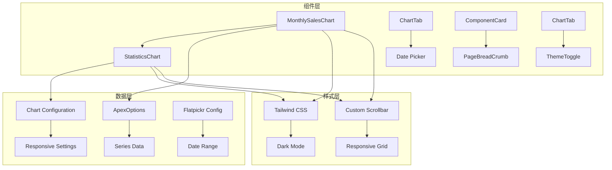
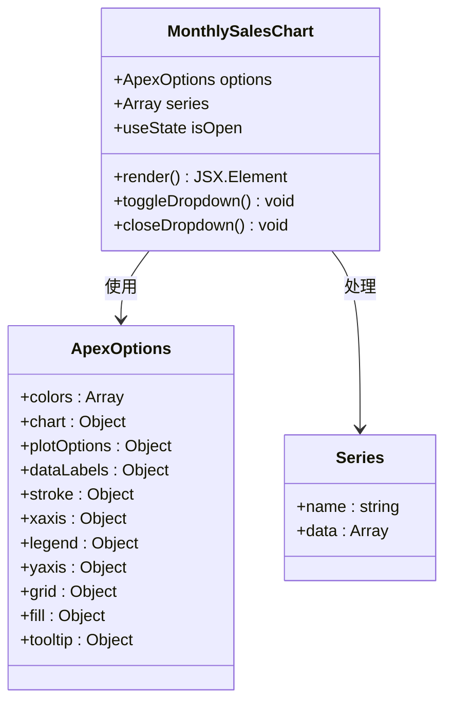
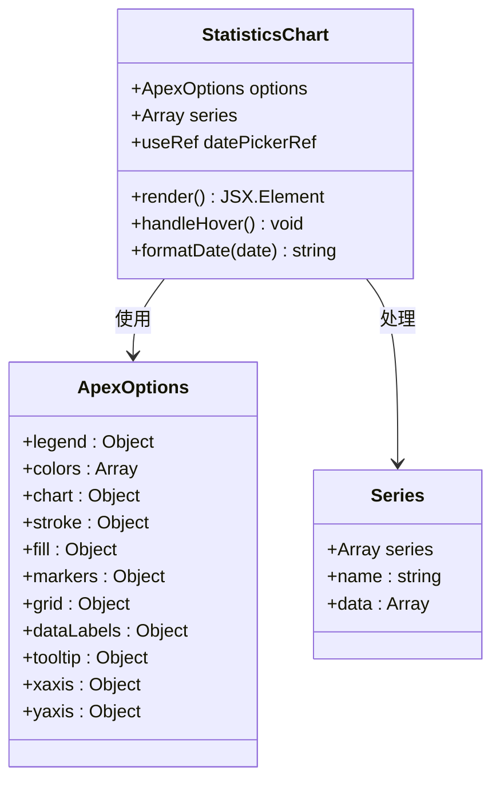
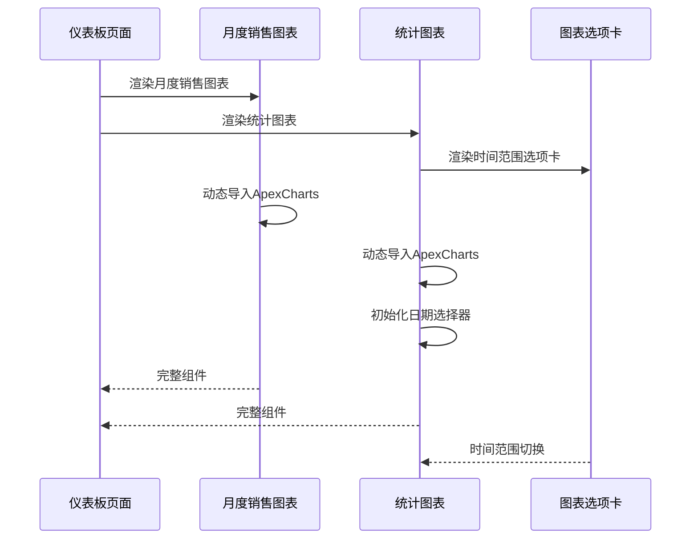
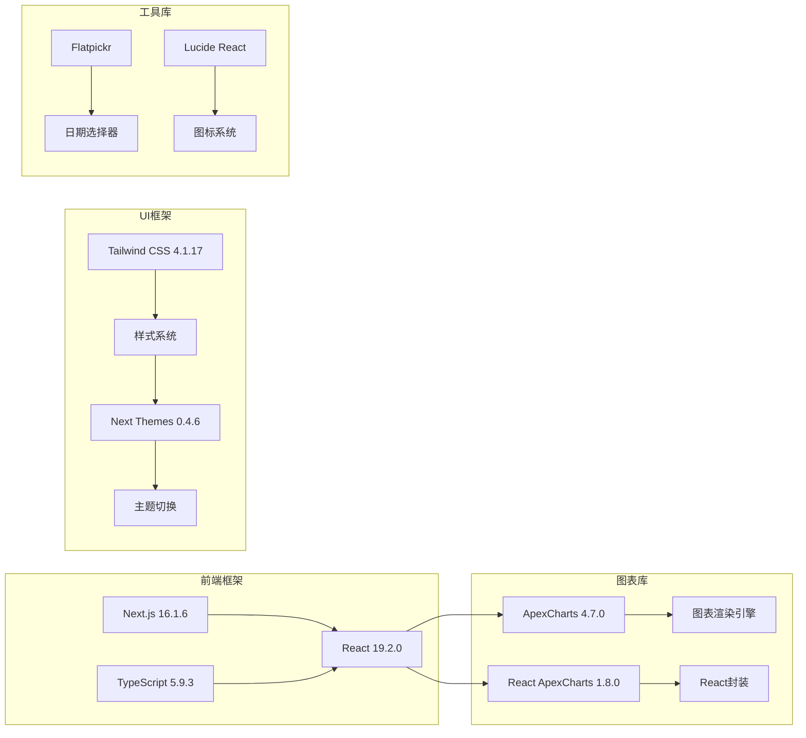
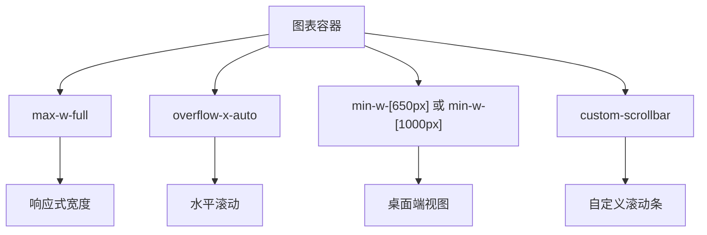
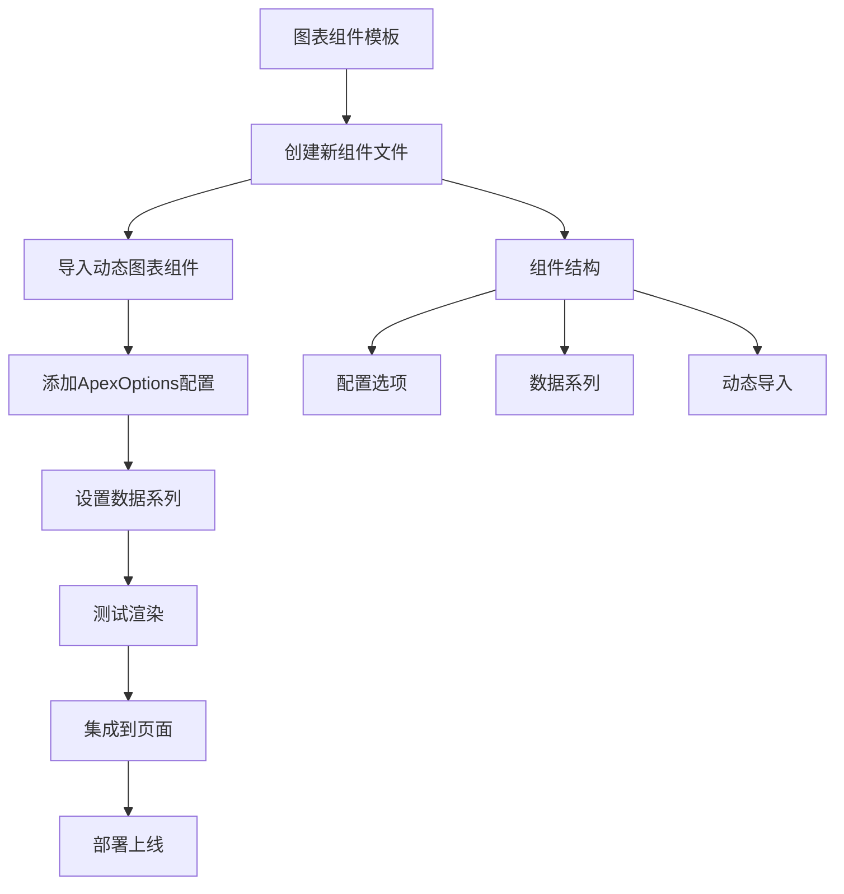

# 图表页面

<cite>
**本文档引用的文件**
- [src/components/ecommerce/MonthlySalesChart.tsx](file://apps/web/src/components/ecommerce/MonthlySalesChart.tsx)
- [src/components/ecommerce/StatisticsChart.tsx](file://apps/web/src/components/ecommerce/StatisticsChart.tsx)
- [src/components/common/ChartTab.tsx](file://apps/web/src/components/common/ChartTab.tsx)
- [src/app/(admin)/page.tsx](file://apps/web/src/app/(admin)/page.tsx)
- [package.json](file://apps/web/package.json)
</cite>

## 更新摘要
**所做更改**
- 移除了原有的独立图表页面（柱状图和折线图页面）文档内容
- 更新为反映当前代码库中仍存在的图表组件实现
- 保留了现有的图表组件分析和集成模式说明
- 更新了项目结构以反映实际的组件组织方式

## 目录
1. [简介](#简介)
2. [项目结构](#项目结构)
3. [核心组件](#核心组件)
4. [架构概览](#架构概览)
5. [详细组件分析](#详细组件分析)
6. [依赖关系分析](#依赖关系分析)
7. [性能考虑](#性能考虑)
8. [故障排除指南](#故障排除指南)
9. [结论](#结论)
10. [附录](#附录)

## 简介

本项目提供了完整的图表组件解决方案，基于Next.js框架和ApexCharts库构建。系统包含柱状图和折线图两种主要图表类型，采用模块化设计，支持响应式布局和深色主题切换。每个图表组件都遵循统一的设计模式，确保开发效率和维护性。

**重要更新**：代码库已简化为专注于核心功能，图表页面已被移除，但图表组件仍保留在电商组件库中，用于仪表板和数据分析场景。

图表组件的核心设计理念是：
- **模块化架构**：图表组件独立封装，便于复用和测试
- **响应式设计**：适配不同屏幕尺寸，提供最佳用户体验
- **主题兼容**：完美支持深色和浅色主题切换
- **高性能渲染**：使用动态导入避免首屏阻塞

## 项目结构

图表组件系统采用按功能分组的目录结构，清晰分离了电商组件层和通用工具层：

```mermaid
graph TB
subgraph "电商组件层"
A[src/components/ecommerce] --> B[MonthlySalesChart]
A --> C[StatisticsChart]
end
subgraph "通用组件层"
D[src/components/common] --> E[ChartTab]
end
subgraph "应用层"
F[src/app/(admin)] --> G[Dashboard页面]
end
subgraph "依赖库"
H[ApexCharts] --> I[图表渲染]
J[React ApexCharts] --> K[React封装]
L[Next.js Dynamic] --> M[动态导入]
end
B --> H
C --> H
B --> J
C --> J
B --> L
C --> L
G --> B
G --> C
```

**图表组件目录结构**：
- 电商图表组件：`src/components/ecommerce/`
- 通用图表工具：`src/components/common/ChartTab.tsx`
- 应用集成：`src/app/(admin)/page.tsx`

**章节来源**
- [src/app/(admin)/page.tsx:1-43](file://apps/web/src/app/(admin)/page.tsx#L1-L43)

## 核心组件

### 电商图表组件

系统提供了两个专门的电商图表组件，它们共享相同的设计模式和集成方式：

#### 月度销售柱状图 (`MonthlySalesChart`)
- **组件名称**：MonthlySalesChart
- **功能**：展示单系列柱状图销售数据
- **数据格式**：单数组销售数据系列
- **配置特点**：垂直柱状图，带边框圆角，工具提示定制

#### 统计图表 (`StatisticsChart`)
- **组件名称**：StatisticsChart  
- **功能**：展示双系列折线图数据（销售和收入）
- **数据格式**：双数组数据系列
- **配置特点**：面积填充，渐变背景，日期范围选择器

### 通用组件

#### 图表选项卡 (`ChartTab`)
- **作用**：提供图表时间范围切换功能
- **特性**：支持月度、季度、年度三种视图
- **样式**：响应式按钮组，深色模式兼容

**章节来源**
- [src/components/common/ChartTab.tsx:1-46](file://apps/web/src/components/common/ChartTab.tsx#L1-L46)

## 架构概览

图表组件系统采用分层架构设计，确保各层职责明确且松耦合：



### 设计模式

系统采用了以下设计模式：

1. **组件-页面分离模式**：组件负责具体实现，页面负责布局和组合
2. **配置驱动模式**：通过ApexOptions对象集中管理图表配置
3. **动态导入模式**：使用Next.js的dynamic导入避免首屏阻塞
4. **组合模式**：通用组件与图表组件的灵活组合

**图表来源**
- [src/components/ecommerce/MonthlySalesChart.tsx:9-12](file://apps/web/src/components/ecommerce/MonthlySalesChart.tsx#L9-L12)
- [src/components/ecommerce/StatisticsChart.tsx:8-9](file://apps/web/src/components/ecommerce/StatisticsChart.tsx#L8-L9)

## 详细组件分析

### 月度销售柱状图组件 (`MonthlySalesChart`)

#### 实现架构



#### 配置选项详解

**颜色配置**：
- 主色调：`#465fff`（统一品牌色）
- 边框颜色：透明色（增强视觉层次）

**图表行为**：
- 类型：垂直柱状图
- 高度：180像素（紧凑布局）
- 工具栏：禁用（减少干扰）

**视觉样式**：
- 字体：Outfit，sans-serif
- 圆角：5像素（现代外观）
- 透明度：1（纯色填充）

**数据标签**：
- 显示：禁用（保持简洁）
- 格式化：数值格式

**网格系统**：
- Y轴网格：启用（辅助读数）
- X轴网格：禁用（避免视觉混乱）

**图例配置**：
- 显示：启用
- 位置：顶部左侧
- 对齐：左对齐
- 字体：Outfit

**工具提示**：
- X轴：禁用（避免重复信息）
- Y轴：自定义格式化器

**章节来源**
- [src/components/ecommerce/MonthlySalesChart.tsx:14-99](file://apps/web/src/components/ecommerce/MonthlySalesChart.tsx#L14-L99)

### 统计图表组件 (`StatisticsChart`)

#### 实现架构



#### 配置选项详解

**多系列支持**：
- 销售数据系列：`[180, 190, 170, ...]`
- 收入数据系列：`[40, 30, 50, ...]`
- 颜色方案：`#465FFF` 和 `#9CB9FF`

**线条样式**：
- 曲线：直线（清晰的数据趋势）
- 宽度：2像素（细线风格）
- 渐变填充：从半透明到透明

**标记点配置**：
- 默认大小：0（隐藏点）
- 悬停大小：6（突出显示）
- 边框颜色：白色
- 边框宽度：2

**网格系统**：
- X轴网格：禁用（避免水平分割线）
- Y轴网格：启用（辅助读数）

**坐标轴配置**：
- X轴类型：分类轴（月份标签）
- Y轴标签：12px字体，灰色调
- 轴线：隐藏（极简设计）

**工具提示**：
- 启用：是
- 日期格式：`dd MMM yyyy`
- 自定义格式化器

**章节来源**
- [src/components/ecommerce/StatisticsChart.tsx:11-180](file://apps/web/src/components/ecommerce/StatisticsChart.tsx#L11-L180)

### 组件集成模式

#### 仪表板集成



#### 数据绑定策略

**静态数据绑定**：
- 月份数组：`["Jan", "Feb", ..., "Dec"]`
- 数值数据：预定义的数值数组
- 系列名称：`"Sales"` 和 `"Revenue"`

**动态配置**：
- 字体家族：`Outfit, sans-serif`
- 颜色主题：根据品牌色调整
- 响应式尺寸：根据容器自动调整

**章节来源**
- [src/app/(admin)/page.tsx:16-42](file://apps/web/src/app/(admin)/page.tsx#L16-L42)

## 依赖关系分析

### 核心依赖

系统依赖于以下关键库：



### 依赖版本兼容性

**关键依赖版本**：
- Next.js：16.1.6（最新稳定版）
- React：19.2.0（新版本特性）
- ApexCharts：4.7.0（图表功能完整）
- React ApexCharts：1.8.0（React集成稳定）

**主题系统集成**：
- Next Themes提供全局主题状态管理
- Tailwind CSS支持深色模式类名
- 动态导入确保客户端渲染

**章节来源**
- [package.json:17-51](file://apps/web/package.json#L17-L51)

## 性能考虑

### 动态导入优化

系统采用动态导入策略来优化首屏加载性能：


**优化策略**：
- **延迟加载**：仅在客户端渲染时加载图表库
- **代码分割**：独立的图表模块包
- **缓存机制**：浏览器缓存已加载的图表库

### 响应式设计实现

#### 容器适配



**桌面端优化**：
- 不同组件有不同的最小宽度要求
- 自定义滚动条：提升用户体验
- 水平滚动：处理长数据系列

**移动端适配**：
- 容器宽度：100%响应式
- 滚动行为：触摸友好的滚动体验
- 字体缩放：根据屏幕尺寸调整

### 内存管理

**组件卸载清理**：
- 图表实例自动销毁
- 事件监听器清理
- 内存泄漏防护

**渲染优化**：
- 避免不必要的重渲染
- 优化数据更新策略
- 合理的重新计算

## 故障排除指南

### 常见问题及解决方案

#### 图表不显示问题

**症状**：图表空白或只显示坐标轴
**可能原因**：
- 动态导入失败
- 数据格式错误
- 容器尺寸问题

**解决步骤**：
1. 检查浏览器控制台错误
2. 验证数据数组格式
3. 确认容器有明确的高度

#### 样式异常问题

**症状**：图表样式错乱或主题不匹配
**可能原因**：
- Tailwind CSS未正确编译
- 深色模式切换失效
- 自定义滚动条样式冲突

**解决步骤**：
1. 检查Tailwind配置
2. 验证主题上下文设置
3. 确认CSS优先级

#### 性能问题

**症状**：页面加载缓慢或图表渲染卡顿
**可能原因**：
- 图表库过大
- 数据量过多
- 重复渲染

**优化建议**：
1. 使用虚拟滚动处理大数据集
2. 实现数据懒加载
3. 优化重渲染逻辑

### 调试工具

**开发工具**：
- 浏览器开发者工具
- React DevTools
- ApexCharts调试模式

**监控指标**：
- 首屏渲染时间
- 图表绘制性能
- 内存使用情况

**章节来源**
- [src/components/ecommerce/MonthlySalesChart.tsx:1-10](file://apps/web/src/components/ecommerce/MonthlySalesChart.tsx#L1-L10)
- [src/components/ecommerce/StatisticsChart.tsx:1-10](file://apps/web/src/components/ecommerce/StatisticsChart.tsx#L1-L10)

## 结论

本图表组件系统提供了完整的数据可视化解决方案，具有以下优势：

**技术优势**：
- 模块化设计，易于扩展和维护
- 响应式布局，适配多种设备
- 主题兼容，支持深色模式
- 性能优化，动态导入策略

**开发效率**：
- 标准化的组件接口
- 一致的配置模式
- 完善的类型定义
- 丰富的配置选项

**适用场景**：
- 电商仪表板数据展示
- 销售数据分析
- 实时监控界面
- 报表系统

系统为开发者提供了快速创建数据可视化页面的完整工具链，既保证了功能完整性，又确保了良好的用户体验。

## 附录

### 开发模板

#### 新图表组件创建流程



**模板步骤**：
1. 复制现有图表组件作为基础
2. 导入动态图表组件
3. 配置ApexOptions选项
4. 设置数据系列
5. 测试响应式效果
6. 集成到目标页面
7. 部署到生产环境

#### 数据格式要求

**标准数据结构**：
```typescript
interface ChartData {
  name: string;
  data: number[];
}

interface ChartOptions {
  colors: string[];
  chart: {
    type: 'bar' | 'line' | 'area';
    height: number;
  };
  xaxis: {
    categories: string[];
  };
}
```

**数据验证规则**：
- 数组长度必须一致
- 数值必须为有效数字
- 类别名称必须唯一
- 颜色值必须为合法十六进制

### 性能优化技巧

#### 图表渲染优化

**内存管理**：
- 及时清理图表实例
- 避免内存泄漏
- 合理使用事件监听器

**渲染性能**：
- 批量更新数据
- 避免频繁重绘
- 使用虚拟滚动

#### 用户体验优化

**加载体验**：
- 占位符动画
- 加载指示器
- 错误边界处理

**交互优化**：
- 平滑过渡效果
- 响应式交互
- 触摸友好的手势