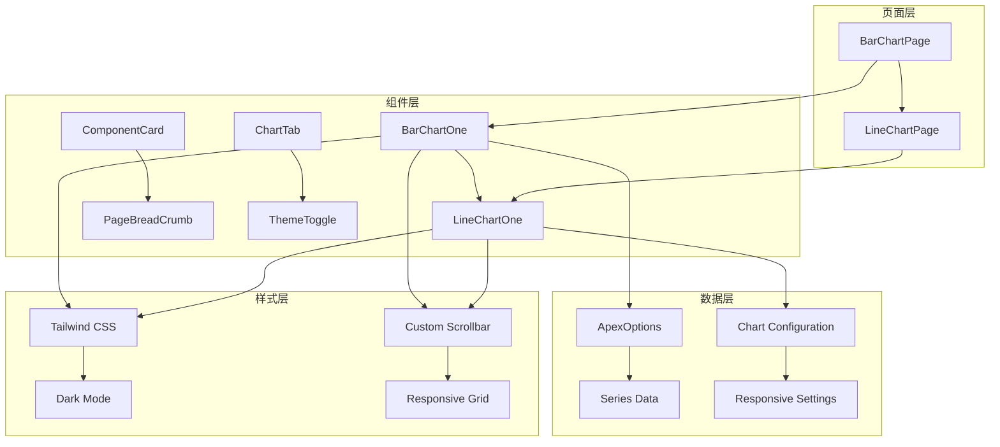
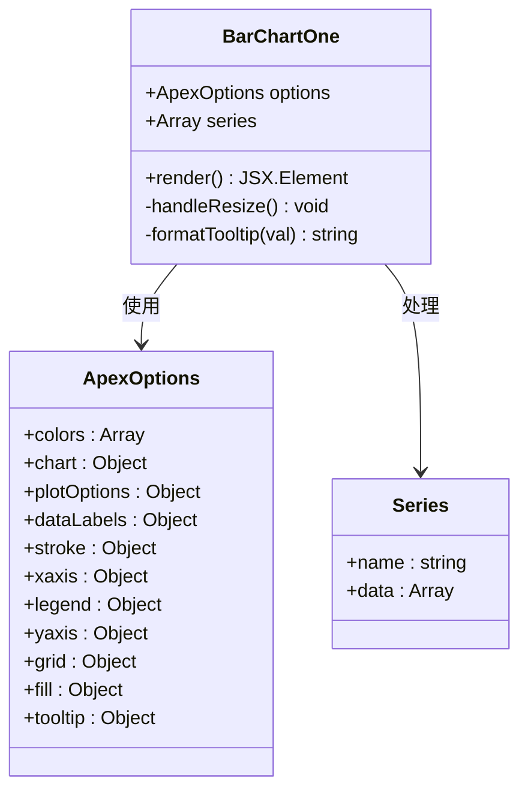
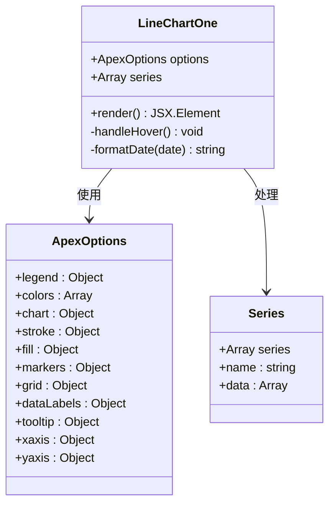
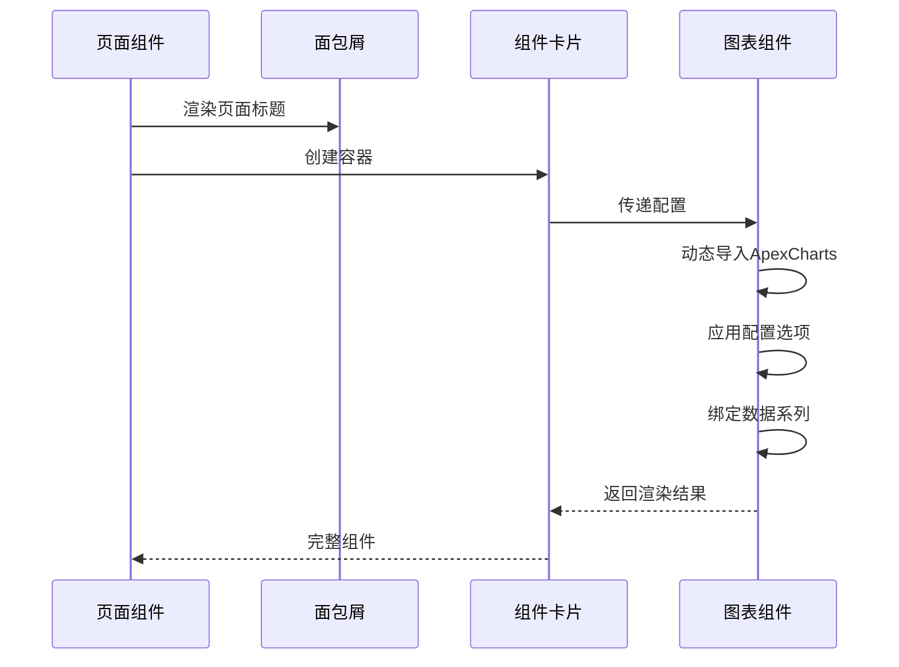
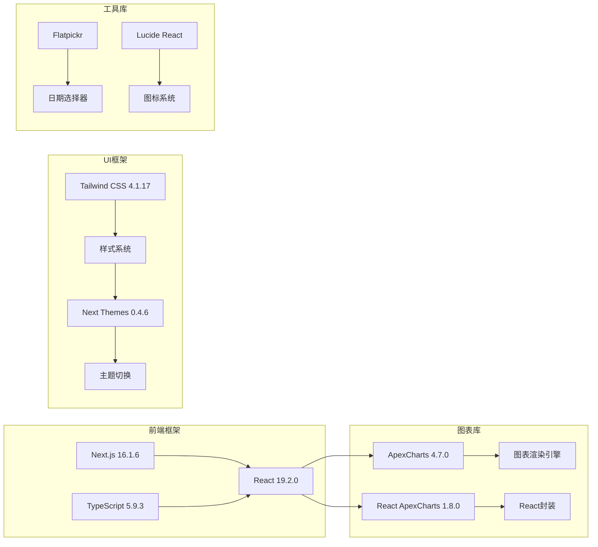
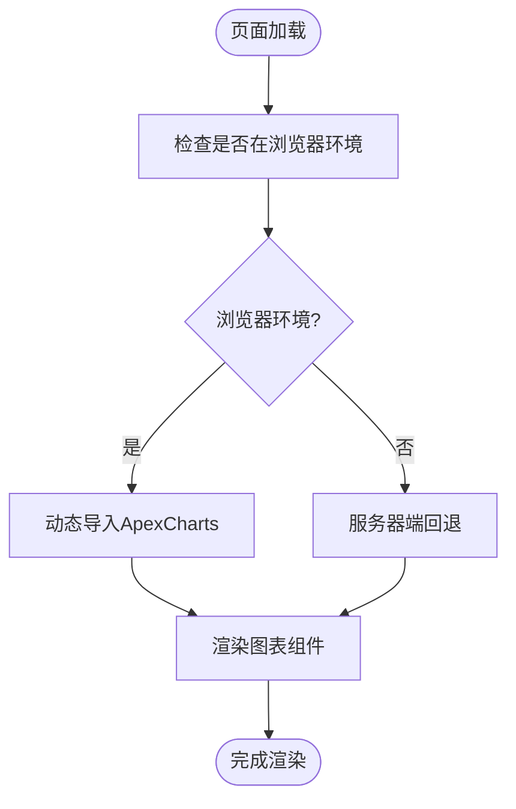
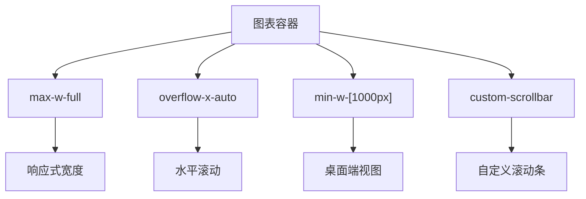
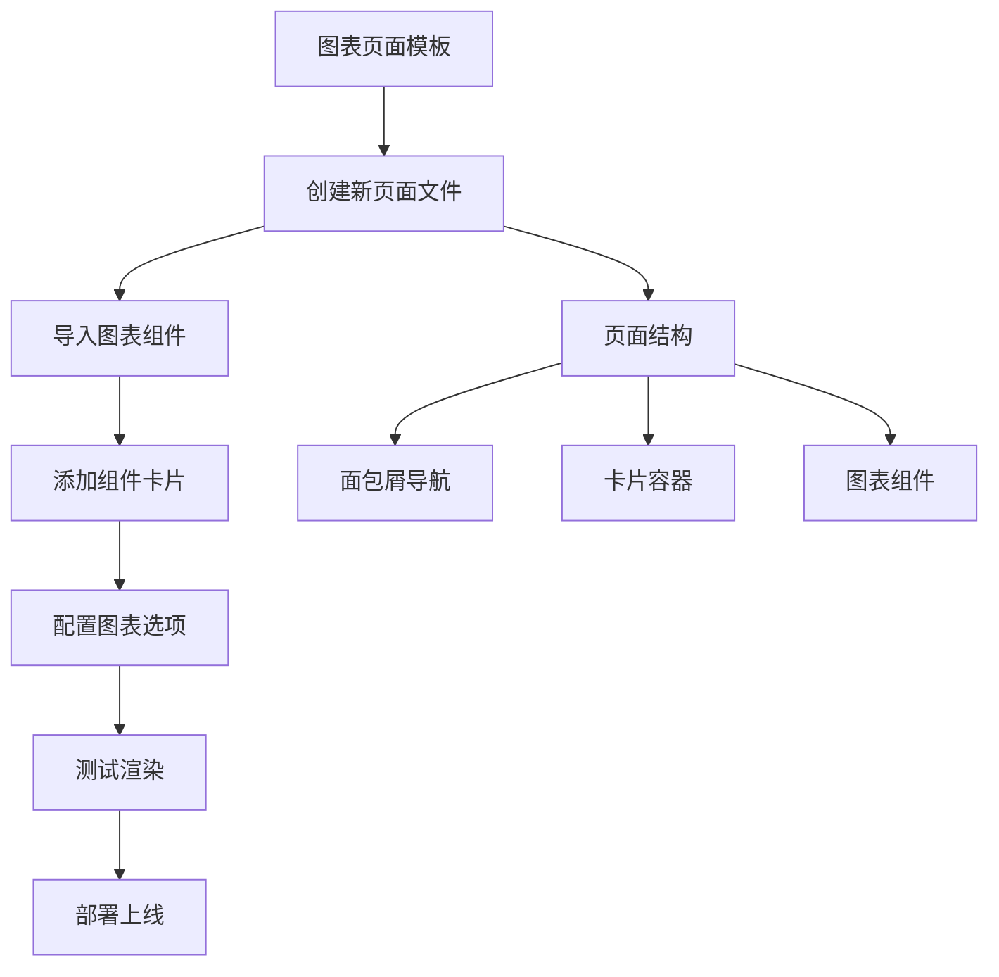

# 图表页面

<cite>
**本文档引用的文件**
- [src/app/(admin)/(others-pages)/(chart)/bar-chart/page.tsx](file://src/app/(admin)/(others-pages)/(chart)/bar-chart/page.tsx)
- [src/app/(admin)/(others-pages)/(chart)/line-chart/page.tsx](file://src/app/(admin)/(others-pages)/(chart)/line-chart/page.tsx)
- [src/components/charts/bar/BarChartOne.tsx](file://src/components/charts/bar/BarChartOne.tsx)
- [src/components/charts/line/LineChartOne.tsx](file://src/components/charts/line/LineChartOne.tsx)
- [src/components/common/ComponentCard.tsx](file://src/components/common/ComponentCard.tsx)
- [src/components/common/PageBreadCrumb.tsx](file://src/components/common/PageBreadCrumb.tsx)
- [src/components/common/ChartTab.tsx](file://src/components/common/ChartTab.tsx)
- [src/app/layout.tsx](file://src/app/layout.tsx)
- [package.json](file://package.json)
</cite>

## 目录
1. [简介](#简介)
2. [项目结构](#项目结构)
3. [核心组件](#核心组件)
4. [架构概览](#架构概览)
5. [详细组件分析](#详细组件分析)
6. [依赖关系分析](#依赖关系分析)
7. [性能考虑](#性能考虑)
8. [故障排除指南](#故障排除指南)
9. [结论](#结论)
10. [附录](#附录)

## 简介

本项目提供了完整的图表页面解决方案，基于Next.js框架和ApexCharts库构建。系统包含柱状图和折线图两种主要图表类型，采用模块化设计，支持响应式布局和深色主题切换。每个图表页面都遵循统一的设计模式，确保开发效率和维护性。

图表页面的核心设计理念是：
- **模块化架构**：图表组件独立封装，便于复用和测试
- **响应式设计**：适配不同屏幕尺寸，提供最佳用户体验
- **主题兼容**：完美支持深色和浅色主题切换
- **高性能渲染**：使用动态导入避免首屏阻塞

## 项目结构

图表页面系统采用按功能分组的目录结构，清晰分离了页面层、组件层和通用工具层：

```mermaid
graph TB
subgraph "应用层"
A[src/app/(admin)/(others-pages)/(chart)] --> B[柱状图页面]
A --> C[折线图页面]
end
subgraph "组件层"
D[src/components/charts] --> E[图表组件]
F[src/components/common] --> G[通用组件]
end
subgraph "依赖库"
H[ApexCharts] --> I[图表渲染]
J[React ApexCharts] --> K[React封装]
L[Next.js Dynamic] --> M[动态导入]
end
B --> E
C --> E
E --> H
E --> J
E --> L
```

**图表页面目录结构**：
- 页面路由：`src/app/(admin)/(others-pages)/(chart)/`
- 柱状图页面：`bar-chart/page.tsx`
- 折线图页面：`line-chart/page.tsx`
- 图表组件：`src/components/charts/`
- 通用组件：`src/components/common/`

**章节来源**
- [src/app/(admin)/(others-pages)/(chart)/bar-chart/page.tsx:1-25](file://src/app/(admin)/(others-pages)/(chart)/bar-chart/page.tsx#L1-L25)
- [src/app/(admin)/(others-pages)/(chart)/line-chart/page.tsx:1-24](file://src/app/(admin)/(others-pages)/(chart)/line-chart/page.tsx#L1-L24)

## 核心组件

### 图表页面组件

系统提供了两个标准化的图表页面组件，它们共享相同的设计模式和集成方式：

#### 柱状图页面 (`BarChartPage`)
- **组件名称**：BarChartPage
- **功能**：展示单系列柱状图数据
- **数据格式**：单数组数据点
- **配置特点**：垂直柱状图，带边框圆角

#### 折线图页面 (`LineChartPage`)
- **组件名称**：LineChartPage  
- **功能**：展示双系列折线图数据
- **数据格式**：双数组数据系列
- **配置特点**：面积填充，渐变背景

### 通用组件

#### 组件卡片 (`ComponentCard`)
- **作用**：为图表提供统一的容器和标题
- **特性**：支持自定义描述文本
- **样式**：响应式边距和内边距

#### 页面面包屑 (`PageBreadCrumb`)
- **作用**：提供页面导航路径
- **特性**：动态页面标题显示
- **样式**：符合整体设计语言

**章节来源**
- [src/components/common/ComponentCard.tsx:1-41](file://src/components/common/ComponentCard.tsx#L1-L41)
- [src/components/common/PageBreadCrumb.tsx:1-53](file://src/components/common/PageBreadCrumb.tsx#L1-L53)

## 架构概览

图表页面系统采用分层架构设计，确保各层职责明确且松耦合：



### 设计模式

系统采用了以下设计模式：

1. **页面-组件分离模式**：页面负责路由和布局，组件负责具体实现
2. **配置驱动模式**：通过ApexOptions对象集中管理图表配置
3. **动态导入模式**：使用Next.js的dynamic导入避免首屏阻塞
4. **组合模式**：通用组件与图表组件的灵活组合

**图表来源**
- [src/app/(admin)/(others-pages)/(chart)/bar-chart/page.tsx:13-24](file://src/app/(admin)/(others-pages)/(chart)/bar-chart/page.tsx#L13-L24)
- [src/app/(admin)/(others-pages)/(chart)/line-chart/page.tsx:12-23](file://src/app/(admin)/(others-pages)/(chart)/line-chart/page.tsx#L12-L23)

## 详细组件分析

### 柱状图组件 (`BarChartOne`)

#### 实现架构



#### 配置选项详解

**颜色配置**：
- 主色调：`#465fff`（统一品牌色）
- 边框颜色：透明色（增强视觉层次）

**图表行为**：
- 类型：垂直柱状图
- 高度：180像素（紧凑布局）
- 工具栏：禁用（减少干扰）

**视觉样式**：
- 字体：Outfit，sans-serif
- 圆角：5像素（现代外观）
- 透明度：1（纯色填充）

**数据标签**：
- 显示：禁用（保持简洁）
- 格式化：数值格式

**网格系统**：
- Y轴网格：启用（辅助读数）
- X轴网格：禁用（避免视觉混乱）

**图例配置**：
- 显示：启用
- 位置：顶部左侧
- 对齐：左对齐
- 字体：Outfit

**章节来源**
- [src/components/charts/bar/BarChartOne.tsx:12-111](file://src/components/charts/bar/BarChartOne.tsx#L12-L111)

### 折线图组件 (`LineChartOne`)

#### 实现架构



#### 配置选项详解

**多系列支持**：
- 销售数据系列：`[180, 190, 170, ...]`
- 收入数据系列：`[40, 30, 50, ...]`
- 颜色方案：`#465FFF` 和 `#9CB9FF`

**线条样式**：
- 曲线：直线（清晰的数据趋势）
- 宽度：2像素（细线风格）
- 渐变填充：从半透明到透明

**标记点配置**：
- 默认大小：0（隐藏点）
- 悬停大小：6（突出显示）
- 边框颜色：白色
- 边框宽度：2

**网格系统**：
- X轴网格：禁用（避免水平分割线）
- Y轴网格：启用（辅助读数）

**坐标轴配置**：
- X轴类型：分类轴（月份标签）
- Y轴标签：12px字体，灰色调
- 轴线：隐藏（极简设计）

**工具提示**：
- 启用：是
- 日期格式：`dd MMM yyyy`
- 自定义格式化器

**章节来源**
- [src/components/charts/line/LineChartOne.tsx:12-134](file://src/components/charts/line/LineChartOne.tsx#L12-L134)

### 页面集成模式

#### 统一页面结构



#### 数据绑定策略

**静态数据绑定**：
- 月份数组：`["Jan", "Feb", ..., "Dec"]`
- 数值数据：预定义的数值数组
- 系列名称：`"Sales"` 和 `"Revenue"`

**动态配置**：
- 字体家族：`Outfit, sans-serif`
- 颜色主题：根据品牌色调整
- 响应式尺寸：根据容器自动调整

**章节来源**
- [src/app/(admin)/(others-pages)/(chart)/bar-chart/page.tsx:13-24](file://src/app/(admin)/(others-pages)/(chart)/bar-chart/page.tsx#L13-L24)
- [src/app/(admin)/(others-pages)/(chart)/line-chart/page.tsx:12-23](file://src/app/(admin)/(others-pages)/(chart)/line-chart/page.tsx#L12-L23)

## 依赖关系分析

### 核心依赖

系统依赖于以下关键库：



### 依赖版本兼容性

**关键依赖版本**：
- Next.js：16.1.6（最新稳定版）
- React：19.2.0（新版本特性）
- ApexCharts：4.7.0（图表功能完整）
- React ApexCharts：1.8.0（React集成稳定）

**主题系统集成**：
- Next Themes提供全局主题状态管理
- Tailwind CSS支持深色模式类名
- 动态导入确保客户端渲染

**章节来源**
- [package.json:15-49](file://package.json#L15-L49)
- [src/app/layout.tsx:22-31](file://src/app/layout.tsx#L22-L31)

## 性能考虑

### 动态导入优化

系统采用动态导入策略来优化首屏加载性能：



**优化策略**：
- **延迟加载**：仅在客户端渲染时加载图表库
- **代码分割**：独立的图表模块包
- **缓存机制**：浏览器缓存已加载的图表库

### 响应式设计实现

#### 容器适配



**桌面端优化**：
- 最小宽度：1000px（确保数据可读性）
- 自定义滚动条：提升用户体验
- 水平滚动：处理长数据系列

**移动端适配**：
- 容器宽度：100%响应式
- 滚动行为：触摸友好的滚动体验
- 字体缩放：根据屏幕尺寸调整

### 内存管理

**组件卸载清理**：
- 图表实例自动销毁
- 事件监听器清理
- 内存泄漏防护

**渲染优化**：
- 避免不必要的重渲染
- 优化数据更新策略
- 合理的重新计算

## 故障排除指南

### 常见问题及解决方案

#### 图表不显示问题

**症状**：图表空白或只显示坐标轴
**可能原因**：
- 动态导入失败
- 数据格式错误
- 容器尺寸问题

**解决步骤**：
1. 检查浏览器控制台错误
2. 验证数据数组格式
3. 确认容器有明确的高度

#### 样式异常问题

**症状**：图表样式错乱或主题不匹配
**可能原因**：
- Tailwind CSS未正确编译
- 深色模式切换失效
- 自定义滚动条样式冲突

**解决步骤**：
1. 检查Tailwind配置
2. 验证主题上下文设置
3. 确认CSS优先级

#### 性能问题

**症状**：页面加载缓慢或图表渲染卡顿
**可能原因**：
- 图表库过大
- 数据量过多
- 重复渲染

**优化建议**：
1. 使用虚拟滚动处理大数据集
2. 实现数据懒加载
3. 优化重渲染逻辑

### 调试工具

**开发工具**：
- 浏览器开发者工具
- React DevTools
- ApexCharts调试模式

**监控指标**：
- 首屏渲染时间
- 图表绘制性能
- 内存使用情况

**章节来源**
- [src/components/charts/bar/BarChartOne.tsx:6-10](file://src/components/charts/bar/BarChartOne.tsx#L6-L10)
- [src/components/charts/line/LineChartOne.tsx:6-10](file://src/components/charts/line/LineChartOne.tsx#L6-L10)

## 结论

本图表页面系统提供了完整的数据可视化解决方案，具有以下优势：

**技术优势**：
- 模块化设计，易于扩展和维护
- 响应式布局，适配多种设备
- 主题兼容，支持深色模式
- 性能优化，动态导入策略

**开发效率**：
- 标准化的组件接口
- 一致的配置模式
- 完善的类型定义
- 丰富的配置选项

**适用场景**：
- 仪表板数据展示
- 报表系统
- 实时监控界面
- 分析报告页面

系统为开发者提供了快速创建数据可视化页面的完整工具链，既保证了功能完整性，又确保了良好的用户体验。

## 附录

### 开发模板

#### 新图表页面创建流程



**模板步骤**：
1. 复制现有页面文件作为基础
2. 导入相应的图表组件
3. 配置页面元数据
4. 设置组件卡片
5. 测试响应式效果
6. 部署到生产环境

#### 数据格式要求

**标准数据结构**：
```typescript
interface ChartData {
  name: string;
  data: number[];
}

interface ChartOptions {
  colors: string[];
  chart: {
    type: 'bar' | 'line' | 'area';
    height: number;
  };
  xaxis: {
    categories: string[];
  };
}
```

**数据验证规则**：
- 数组长度必须一致
- 数值必须为有效数字
- 类别名称必须唯一
- 颜色值必须为合法十六进制

### 性能优化技巧

#### 图表渲染优化

**内存管理**：
- 及时清理图表实例
- 避免内存泄漏
- 合理使用事件监听器

**渲染性能**：
- 批量更新数据
- 避免频繁重绘
- 使用虚拟滚动

#### 用户体验优化

**加载体验**：
- 占位符动画
- 加载指示器
- 错误边界处理

**交互优化**：
- 平滑过渡效果
- 响应式交互
- 触摸友好的手势