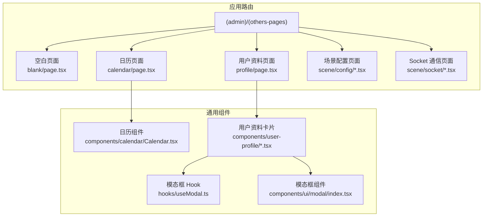
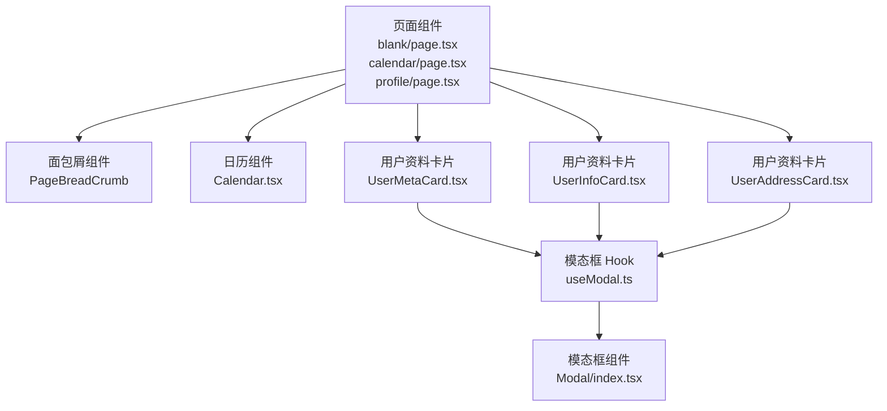
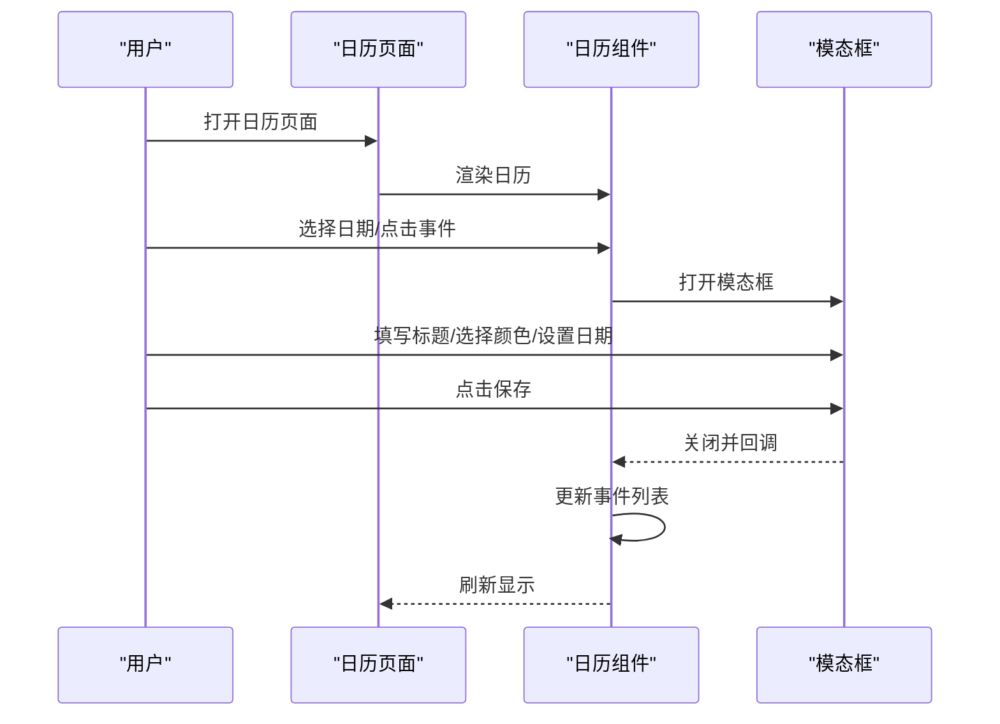
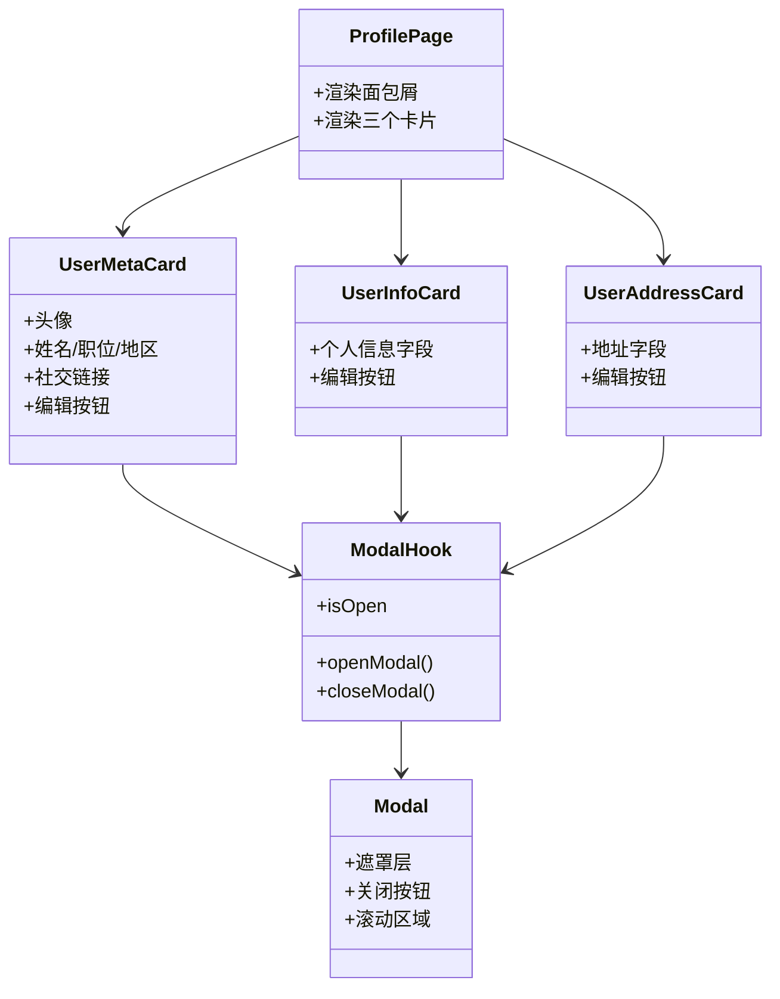
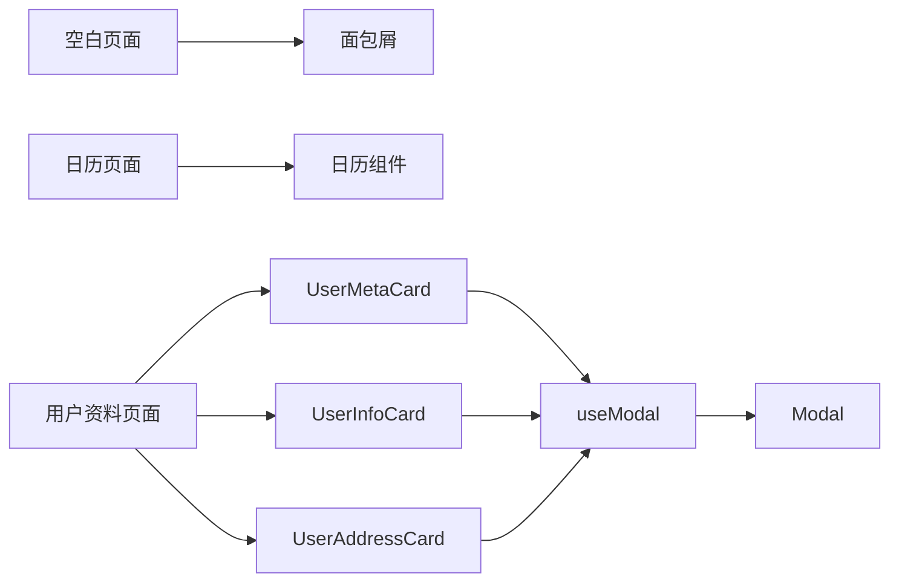

# 特殊功能页面

<cite>
**本文引用的文件**
- [src/app/(admin)/(others-pages)/blank/page.tsx](file://src/app/(admin)/(others-pages)/blank/page.tsx)
- [src/app/(admin)/(others-pages)/calendar/page.tsx](file://src/app/(admin)/(others-pages)/calendar/page.tsx)
- [src/app/(admin)/(others-pages)/profile/page.tsx](file://src/app/(admin)/(others-pages)/profile/page.tsx)
- [src/components/calendar/Calendar.tsx](file://src/components/calendar/Calendar.tsx)
- [src/components/user-profile/UserMetaCard.tsx](file://src/components/user-profile/UserMetaCard.tsx)
- [src/components/user-profile/UserInfoCard.tsx](file://src/components/user-profile/UserInfoCard.tsx)
- [src/components/user-profile/UserAddressCard.tsx](file://src/components/user-profile/UserAddressCard.tsx)
- [src/hooks/useModal.ts](file://src/hooks/useModal.ts)
- [src/components/ui/modal/index.tsx](file://src/components/ui/modal/index.tsx)
</cite>

## 目录
1. [简介](#简介)
2. [项目结构](#项目结构)
3. [核心组件](#核心组件)
4. [架构总览](#架构总览)
5. [详细组件分析](#详细组件分析)
6. [依赖关系分析](#依赖关系分析)
7. [性能考虑](#性能考虑)
8. [故障排查指南](#故障排查指南)
9. [结论](#结论)
10. [附录：开发模板与最佳实践](#附录开发模板与最佳实践)

## 简介
本文件面向需要在 Next.js 项目中创建“特殊功能页面”的开发者，系统性梳理并总结以下页面类型的设计模式与实现方法：
- 空白页面（Blank Page）
- 日历页面（Calendar Page）
- 用户资料页面（Profile Page）
- 场景配置页面（Scene Config Page）
- Socket 通信页面（Socket Page）

内容涵盖页面布局设计、功能集成、状态管理、交互流程、错误处理与性能优化建议，并提供可复用的开发模板与最佳实践，帮助快速扩展更多特殊页面。

## 项目结构
特殊功能页面主要位于应用路由分组 `(admin)/(others-pages)` 下，采用按功能域组织的目录结构，便于维护与扩展。页面文件通常仅负责元数据与布局，核心功能由独立的业务组件承担。

图表来源
- [src/app/(admin)/(others-pages)/blank/page.tsx](file://src/app/(admin)/(others-pages)/blank/page.tsx#L1-L28)
- [src/app/(admin)/(others-pages)/calendar/page.tsx](file://src/app/(admin)/(others-pages)/calendar/page.tsx#L1-L20)
- [src/app/(admin)/(others-pages)/profile/page.tsx](file://src/app/(admin)/(others-pages)/profile/page.tsx#L1-L29)
- [src/components/calendar/Calendar.tsx:1-284](file://src/components/calendar/Calendar.tsx#L1-L284)
- [src/components/user-profile/UserMetaCard.tsx:1-234](file://src/components/user-profile/UserMetaCard.tsx#L1-L234)
- [src/hooks/useModal.ts:1-13](file://src/hooks/useModal.ts#L1-L13)
- [src/components/ui/modal/index.tsx:1-96](file://src/components/ui/modal/index.tsx#L1-L96)

章节来源
- [src/app/(admin)/(others-pages)/blank/page.tsx](file://src/app/(admin)/(others-pages)/blank/page.tsx#L1-L28)
- [src/app/(admin)/(others-pages)/calendar/page.tsx](file://src/app/(admin)/(others-pages)/calendar/page.tsx#L1-L20)
- [src/app/(admin)/(others-pages)/profile/page.tsx](file://src/app/(admin)/(others-pages)/profile/page.tsx#L1-L29)

## 核心组件
- 页面级组件：负责页面标题、面包屑导航、容器样式与布局，不直接承载复杂逻辑。
- 业务组件：封装具体功能（如日历、用户资料卡片），通过 props 与状态管理进行交互。
- 通用工具：模态框 Hook 与通用模态框组件，统一弹窗行为与样式。

章节来源
- [src/app/(admin)/(others-pages)/blank/page.tsx](file://src/app/(admin)/(others-pages)/blank/page.tsx#L1-L28)
- [src/app/(admin)/(others-pages)/calendar/page.tsx](file://src/app/(admin)/(others-pages)/calendar/page.tsx#L1-L20)
- [src/app/(admin)/(others-pages)/profile/page.tsx](file://src/app/(admin)/(others-pages)/profile/page.tsx#L1-L29)
- [src/hooks/useModal.ts:1-13](file://src/hooks/useModal.ts#L1-L13)
- [src/components/ui/modal/index.tsx:1-96](file://src/components/ui/modal/index.tsx#L1-L96)

## 架构总览
特殊功能页面遵循“页面即容器 + 组件即功能”的分层架构：
- 页面层：定义页面元信息、面包屑、外层容器与布局。
- 组件层：封装业务能力（日历、资料卡片、模态编辑等）。
- 工具层：提供通用状态与交互能力（模态框 Hook 与组件）。

图表来源
- [src/app/(admin)/(others-pages)/blank/page.tsx](file://src/app/(admin)/(others-pages)/blank/page.tsx#L1-L28)
- [src/app/(admin)/(others-pages)/calendar/page.tsx](file://src/app/(admin)/(others-pages)/calendar/page.tsx#L1-L20)
- [src/app/(admin)/(others-pages)/profile/page.tsx](file://src/app/(admin)/(others-pages)/profile/page.tsx#L1-L29)
- [src/components/calendar/Calendar.tsx:1-284](file://src/components/calendar/Calendar.tsx#L1-L284)
- [src/components/user-profile/UserMetaCard.tsx:1-234](file://src/components/user-profile/UserMetaCard.tsx#L1-L234)
- [src/components/user-profile/UserInfoCard.tsx:1-190](file://src/components/user-profile/UserInfoCard.tsx#L1-L190)
- [src/components/user-profile/UserAddressCard.tsx:1-135](file://src/components/user-profile/UserAddressCard.tsx#L1-L135)
- [src/hooks/useModal.ts:1-13](file://src/hooks/useModal.ts#L1-L13)
- [src/components/ui/modal/index.tsx:1-96](file://src/components/ui/modal/index.tsx#L1-L96)

## 详细组件分析

### 空白页面（Blank Page）
- 功能特性
  - 提供一个干净的页面骨架，用于快速搭建自定义布局或引入网格面板。
  - 内置面包屑导航与容器样式，适配深色主题。
- 技术实现
  - 使用页面元数据设置标题与描述。
  - 外层容器具备圆角边框、背景色与内边距，适配不同屏幕尺寸。
- 使用场景
  - 新功能开发的占位页。
  - 需要自定义栅格布局时的基底页面。
- 状态管理
  - 无状态组件，无需本地状态。
- 布局设计
  - 居中内容区，标题与描述分层展示，支持响应式排版。

章节来源
- [src/app/(admin)/(others-pages)/blank/page.tsx](file://src/app/(admin)/(others-pages)/blank/page.tsx#L1-L28)

### 日历页面（Calendar Page）
- 功能特性
  - 集成 FullCalendar 插件，支持月/周/日视图切换、日期选择、事件点击与弹窗编辑。
  - 支持事件颜色分类（危险/成功/主要/警告）。
- 技术实现
  - 页面组件负责渲染面包屑与日历容器。
  - 日历组件内部管理事件列表、选中事件、表单字段与模态框状态。
  - 使用自定义 Hook 控制模态框开关，避免重复逻辑。
- 使用场景
  - 日程安排、会议管理、活动调度等。
- 状态管理
  - 事件列表、选中事件、表单字段、模态框开关均在组件内部通过 useState 管理。
- 交互流程（新增/编辑事件）

图表来源
- [src/app/(admin)/(others-pages)/calendar/page.tsx](file://src/app/(admin)/(others-pages)/calendar/page.tsx#L1-L20)
- [src/components/calendar/Calendar.tsx:1-284](file://src/components/calendar/Calendar.tsx#L1-L284)
- [src/hooks/useModal.ts:1-13](file://src/hooks/useModal.ts#L1-L13)
- [src/components/ui/modal/index.tsx:1-96](file://src/components/ui/modal/index.tsx#L1-L96)

章节来源
- [src/app/(admin)/(others-pages)/calendar/page.tsx](file://src/app/(admin)/(others-pages)/calendar/page.tsx#L1-L20)
- [src/components/calendar/Calendar.tsx:1-284](file://src/components/calendar/Calendar.tsx#L1-L284)

### 用户资料页面（Profile Page）
- 功能特性
  - 分块展示用户头像、基本信息、地址信息与社交链接。
  - 每个区块支持“编辑”操作，打开模态框进行修改。
- 技术实现
  - 页面容器统一风格，内部组合多个资料卡片组件。
  - 资料卡片各自维护模态框状态与表单字段，通过 Hook 实现复用。
- 使用场景
  - 用户个人中心、团队成员资料页。
- 状态管理
  - 各卡片内部维护 isOpen、表单字段与保存逻辑。
- 布局设计
  - 卡片分层排列，响应式网格布局，支持横向与纵向展示。

图表来源
- [src/app/(admin)/(others-pages)/profile/page.tsx](file://src/app/(admin)/(others-pages)/profile/page.tsx#L1-L29)
- [src/components/user-profile/UserMetaCard.tsx:1-234](file://src/components/user-profile/UserMetaCard.tsx#L1-L234)
- [src/components/user-profile/UserInfoCard.tsx:1-190](file://src/components/user-profile/UserInfoCard.tsx#L1-L190)
- [src/components/user-profile/UserAddressCard.tsx:1-135](file://src/components/user-profile/UserAddressCard.tsx#L1-L135)
- [src/hooks/useModal.ts:1-13](file://src/hooks/useModal.ts#L1-L13)
- [src/components/ui/modal/index.tsx:1-96](file://src/components/ui/modal/index.tsx#L1-L96)

章节来源
- [src/app/(admin)/(others-pages)/profile/page.tsx](file://src/app/(admin)/(others-pages)/profile/page.tsx#L1-L29)
- [src/components/user-profile/UserMetaCard.tsx:1-234](file://src/components/user-profile/UserMetaCard.tsx#L1-L234)
- [src/components/user-profile/UserInfoCard.tsx:1-190](file://src/components/user-profile/UserInfoCard.tsx#L1-L190)
- [src/components/user-profile/UserAddressCard.tsx:1-135](file://src/components/user-profile/UserAddressCard.tsx#L1-L135)

### 场景配置页面（Scene Config Page）
- 设计模式
  - 采用“页面 + 表单 + 预览/回显”的结构，页面负责导航与容器，表单负责输入与校验，预览负责结果反馈。
  - 可拆分为“新建场景”与“编辑场景”，共享同一套表单组件与校验规则。
- 技术实现
  - 页面层：设置标题、面包屑与容器样式。
  - 表单层：使用受控组件收集字段，结合通用表单组件与标签组件。
  - 状态管理：表单字段与错误状态在组件内部管理；提交后通过 API 或本地存储更新。
- 使用场景
  - 系统场景参数配置、动态布局设置、主题切换等。
- 最佳实践
  - 将表单字段抽象为可复用的输入组件，统一校验与错误提示。
  - 对于复杂表单，采用分步向导或分节折叠，提升可读性与可用性。

章节来源
- [src/app/(admin)/(others-pages)/(scene)/config/page.tsx](file://src/app/(admin)/(others-pages)/(scene)/config/page.tsx)
- [src/app/(admin)/(others-pages)/(scene)/config/new/page.tsx](file://src/app/(admin)/(others-pages)/(scene)/config/new/page.tsx)

### Socket 通信页面（Socket Page）
- 设计模式
  - 以“连接管理 + 数据流 + 实时渲染”为核心，页面负责初始化连接、订阅事件与展示消息。
  - 将连接状态、消息列表、输入框与发送按钮解耦为独立模块，便于测试与扩展。
- 技术实现
  - 页面层：设置标题、面包屑与容器样式。
  - 连接层：封装 WebSocket 初始化、重连策略与错误处理。
  - 渲染层：消息列表按时间排序，区分发送/接收；输入框支持快捷键与粘贴校验。
- 使用场景
  - 实时聊天、监控面板、协作编辑、通知推送等。
- 最佳实践
  - 在组件卸载时清理连接与事件监听，避免内存泄漏。
  - 对消息去重、限流与失败重试进行统一处理。

章节来源
- [src/app/(admin)/(others-pages)/(scene)/socket/page.tsx](file://src/app/(admin)/(others-pages)/(scene)/socket/page.tsx)

## 依赖关系分析
- 页面到组件
  - 日历页面依赖日历组件；用户资料页面依赖三个资料卡片组件。
- 组件到工具
  - 资料卡片组件依赖模态框 Hook；模态框 Hook 依赖通用模态框组件。
- 状态与副作用
  - 日历组件在挂载时初始化事件；模态框组件在打开时禁用 body 滚动并监听 ESC 键盘事件。

图表来源
- [src/app/(admin)/(others-pages)/blank/page.tsx](file://src/app/(admin)/(others-pages)/blank/page.tsx#L1-L28)
- [src/app/(admin)/(others-pages)/calendar/page.tsx](file://src/app/(admin)/(others-pages)/calendar/page.tsx#L1-L20)
- [src/app/(admin)/(others-pages)/profile/page.tsx](file://src/app/(admin)/(others-pages)/profile/page.tsx#L1-L29)
- [src/components/calendar/Calendar.tsx:1-284](file://src/components/calendar/Calendar.tsx#L1-L284)
- [src/components/user-profile/UserMetaCard.tsx:1-234](file://src/components/user-profile/UserMetaCard.tsx#L1-L234)
- [src/components/user-profile/UserInfoCard.tsx:1-190](file://src/components/user-profile/UserInfoCard.tsx#L1-L190)
- [src/components/user-profile/UserAddressCard.tsx:1-135](file://src/components/user-profile/UserAddressCard.tsx#L1-L135)
- [src/hooks/useModal.ts:1-13](file://src/hooks/useModal.ts#L1-L13)
- [src/components/ui/modal/index.tsx:1-96](file://src/components/ui/modal/index.tsx#L1-L96)

章节来源
- [src/hooks/useModal.ts:1-13](file://src/hooks/useModal.ts#L1-L13)
- [src/components/ui/modal/index.tsx:1-96](file://src/components/ui/modal/index.tsx#L1-L96)

## 性能考虑
- 按需加载
  - 将第三方库（如 FullCalendar）按需引入，减少首屏体积。
- 事件与副作用
  - 在组件卸载时清理定时器、事件监听与 WebSocket 连接，避免内存泄漏。
- 渲染优化
  - 对长列表使用虚拟滚动或分页；对频繁更新的状态进行防抖/节流。
- 主题与样式
  - 使用暗色主题变量与条件类名，避免不必要的重绘。

## 故障排查指南
- 模态框无法关闭
  - 检查是否正确调用 Hook 的 open/close 方法；确认点击遮罩层与 ESC 键盘事件是否生效。
- 日历事件未显示
  - 检查事件数组格式与日期字符串格式；确认插件是否正确注册。
- 资料卡片编辑无效
  - 检查表单字段是否受控；确认保存回调是否触发状态更新。
- Socket 连接异常
  - 检查连接初始化逻辑、重连策略与错误回调；确保在组件卸载时清理连接。

章节来源
- [src/components/ui/modal/index.tsx:23-49](file://src/components/ui/modal/index.tsx#L23-L49)
- [src/components/calendar/Calendar.tsx:41-64](file://src/components/calendar/Calendar.tsx#L41-L64)
- [src/hooks/useModal.ts:4-12](file://src/hooks/useModal.ts#L4-L12)

## 结论
特殊功能页面通过“页面容器 + 业务组件 + 通用工具”的分层设计，实现了高内聚、低耦合与强复用。日历与用户资料页面展示了复杂交互与状态管理的最佳实践；空白页面提供了灵活的布局基底；场景配置与 Socket 页面则体现了可扩展的数据流与实时通信能力。遵循本文的模板与规范，可快速构建高质量的特殊功能页面。

## 附录：开发模板与最佳实践
- 开发模板
  - 页面模板：设置元数据、面包屑与容器样式，导入业务组件。
  - 组件模板：使用受控表单字段、统一的错误提示与保存逻辑。
  - 模态框模板：通过 Hook 管理 isOpen 状态，通用 Modal 组件负责遮罩与键盘事件。
- 最佳实践
  - 将 UI 与逻辑分离，保持组件单一职责。
  - 对外部依赖（日历、Socket）进行封装，提供稳定接口。
  - 在页面与组件间传递最小化、明确化的 props。
  - 对关键路径添加边界检查与错误处理，保证用户体验。