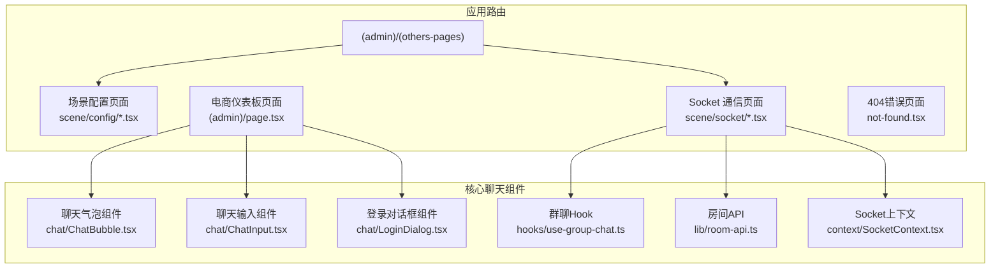
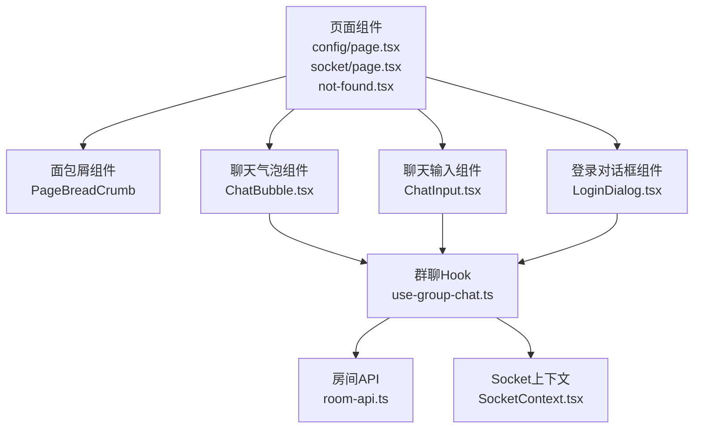
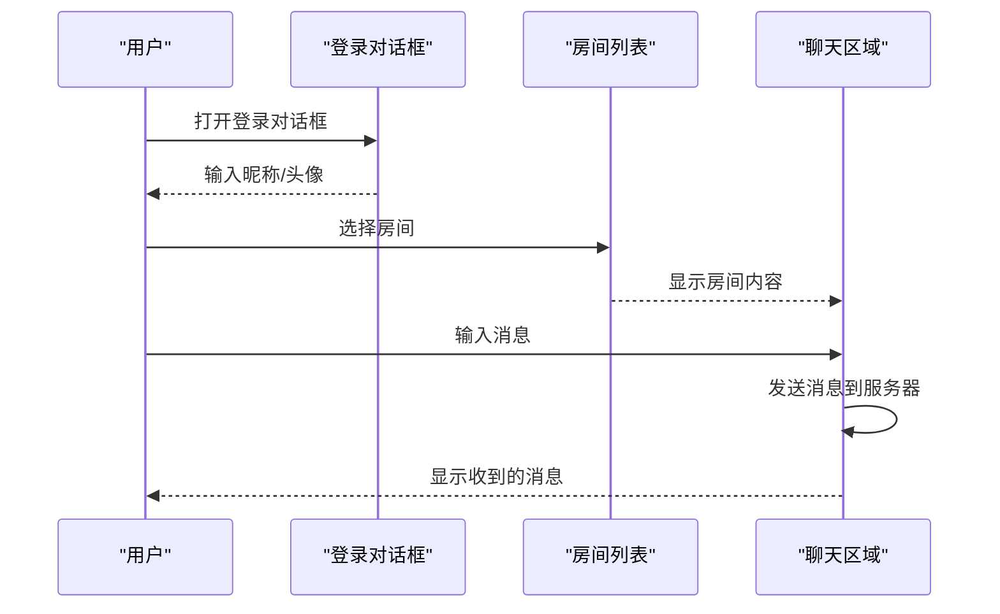
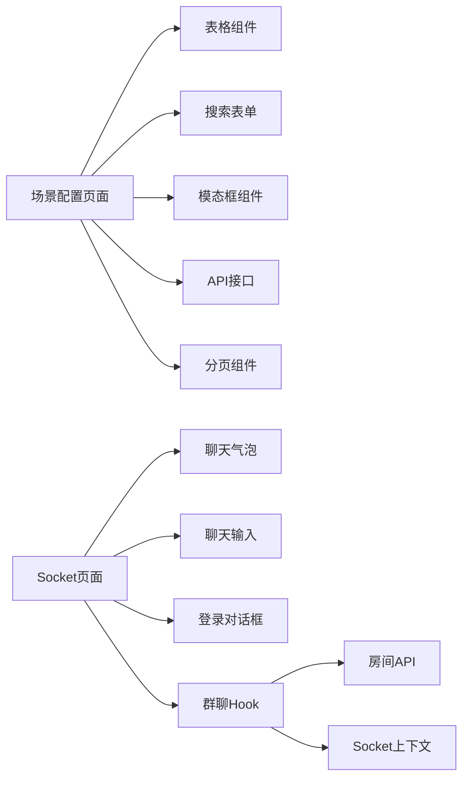

# 特殊功能页面

<cite>
**本文引用的文件**
- [src/app/(admin)/(others-pages)/(scene)/config/page.tsx](file://apps/web/src/app/(admin)/(others-pages)/(scene)/config/page.tsx)
- [src/app/(admin)/(others-pages)/(scene)/socket/page.tsx](file://apps/web/src/app/(admin)/(others-pages)/(scene)/socket/page.tsx)
- [src/app/(admin)/page.tsx](file://apps/web/src/app/(admin)/page.tsx)
- [src/app/not-found.tsx](file://apps/web/src/app/not-found.tsx)
- [src/app/layout.tsx](file://apps/web/src/app/layout.tsx)
- [src/components/chat/ChatBubble.tsx](file://apps/web/src/components/chat/ChatBubble.tsx)
- [src/components/chat/ChatInput.tsx](file://apps/web/src/components/chat/ChatInput.tsx)
- [src/components/chat/LoginDialog.tsx](file://apps/web/src/components/chat/LoginDialog.tsx)
- [src/hooks/use-group-chat.ts](file://apps/web/src/hooks/use-group-chat.ts)
- [src/lib/room-api.ts](file://apps/web/src/lib/room-api.ts)
- [src/context/SocketContext.tsx](file://apps/web/src/context/SocketContext.tsx)
- [src/components/common/PageBreadCrumb.tsx](file://apps/web/src/components/common/PageBreadCrumb.tsx)
</cite>

## 更新摘要
**所做更改**
- 移除了空白页面、日历页面、用户资料页面等传统特殊功能页面的文档内容
- 更新了项目结构说明，反映代码库简化为专注于核心聊天功能
- 重新组织了文档结构，重点突出当前存在的场景配置页面和Socket通信页面
- 更新了架构总览和组件分析，移除了已不存在的组件引用
- 添加了新的章节来说明当前的核心功能页面

## 目录
1. [简介](#简介)
2. [项目结构](#项目结构)
3. [核心组件](#核心组件)
4. [架构总览](#架构总览)
5. [详细组件分析](#详细组件分析)
6. [依赖关系分析](#依赖关系分析)
7. [性能考虑](#性能考虑)
8. [故障排查指南](#故障排查指南)
9. [结论](#结论)
10. [附录：开发模板与最佳实践](#附录开发模板与最佳实践)

## 简介
本文件面向需要在 Next.js 项目中创建"特殊功能页面"的开发者，系统性梳理并总结当前代码库中保留的页面类型的设计模式与实现方法：
- 场景配置页面（Scene Config Page）
- Socket 通信页面（Socket Page）
- 错误404页面（Error 404 Page）

**更新** 代码库已简化为专注于核心聊天功能，移除了传统的空白页面、日历页面、用户资料页面等特殊功能页面，现在主要围绕场景配置管理和实时聊天通信展开。

内容涵盖页面布局设计、功能集成、状态管理、交互流程、错误处理与性能优化建议，并提供可复用的开发模板与最佳实践，帮助快速扩展更多核心功能页面。

## 项目结构
当前特殊功能页面主要位于应用路由分组 `(admin)/(others-pages)` 下，采用按功能域组织的目录结构，专注于场景配置和实时通信功能。页面文件通常仅负责元数据与布局，核心功能由独立的业务组件承担。

**图表来源**
- [src/app/(admin)/(others-pages)/(scene)/config/page.tsx](file://apps/web/src/app/(admin)/(others-pages)/(scene)/config/page.tsx#L1-L473)
- [src/app/(admin)/(others-pages)/(scene)/socket/page.tsx](file://apps/web/src/app/(admin)/(others-pages)/(scene)/socket/page.tsx#L1-L361)
- [src/app/(admin)/page.tsx](file://apps/web/src/app/(admin)/page.tsx#L1-L43)
- [src/app/not-found.tsx:1-50](file://apps/web/src/app/not-found.tsx#L1-L50)
- [src/components/chat/ChatBubble.tsx](file://apps/web/src/components/chat/ChatBubble.tsx)
- [src/components/chat/ChatInput.tsx](file://apps/web/src/components/chat/ChatInput.tsx)
- [src/components/chat/LoginDialog.tsx](file://apps/web/src/components/chat/LoginDialog.tsx)
- [src/hooks/use-group-chat.ts](file://apps/web/src/hooks/use-group-chat.ts)
- [src/lib/room-api.ts](file://apps/web/src/lib/room-api.ts)
- [src/context/SocketContext.tsx](file://apps/web/src/context/SocketContext.tsx)

**章节来源**
- [src/app/(admin)/(others-pages)/(scene)/config/page.tsx](file://apps/web/src/app/(admin)/(others-pages)/(scene)/config/page.tsx#L1-L473)
- [src/app/(admin)/(others-pages)/(scene)/socket/page.tsx](file://apps/web/src/app/(admin)/(others-pages)/(scene)/socket/page.tsx#L1-L361)
- [src/app/(admin)/page.tsx](file://apps/web/src/app/(admin)/page.tsx#L1-L43)
- [src/app/not-found.tsx:1-50](file://apps/web/src/app/not-found.tsx#L1-L50)

## 核心组件
- 页面级组件：负责页面标题、面包屑导航、容器样式与布局，不直接承载复杂逻辑。
- 业务组件：封装具体功能（如聊天气泡、输入框、登录对话框），通过 props 与状态管理进行交互。
- 通用工具：群聊Hook、房间API、Socket上下文等，统一聊天功能的状态管理与数据流。

**更新** 移除了原有的日历组件、用户资料卡片等组件的引用，现在主要围绕聊天相关的组件进行组织。

**章节来源**
- [src/app/(admin)/(others-pages)/(scene)/config/page.tsx](file://apps/web/src/app/(admin)/(others-pages)/(scene)/config/page.tsx#L1-L473)
- [src/app/(admin)/(others-pages)/(scene)/socket/page.tsx](file://apps/web/src/app/(admin)/(others-pages)/(scene)/socket/page.tsx#L1-L361)
- [src/components/chat/ChatBubble.tsx](file://apps/web/src/components/chat/ChatBubble.tsx)
- [src/components/chat/ChatInput.tsx](file://apps/web/src/components/chat/ChatInput.tsx)
- [src/components/chat/LoginDialog.tsx](file://apps/web/src/components/chat/LoginDialog.tsx)
- [src/hooks/use-group-chat.ts](file://apps/web/src/hooks/use-group-chat.ts)
- [src/lib/room-api.ts](file://apps/web/src/lib/room-api.ts)
- [src/context/SocketContext.tsx](file://apps/web/src/context/SocketContext.tsx)

## 架构总览
当前特殊功能页面遵循"页面即容器 + 组件即功能"的分层架构：
- 页面层：定义页面元信息、面包屑、外层容器与布局。
- 组件层：封装业务能力（聊天气泡、输入框、登录对话框等）。
- 工具层：提供通用状态与交互能力（群聊Hook、房间API、Socket上下文）。

**图表来源**
- [src/app/(admin)/(others-pages)/(scene)/config/page.tsx](file://apps/web/src/app/(admin)/(others-pages)/(scene)/config/page.tsx#L1-L473)
- [src/app/(admin)/(others-pages)/(scene)/socket/page.tsx](file://apps/web/src/app/(admin)/(others-pages)/(scene)/socket/page.tsx#L1-L361)
- [src/app/not-found.tsx:1-50](file://apps/web/src/app/not-found.tsx#L1-L50)
- [src/components/chat/ChatBubble.tsx](file://apps/web/src/components/chat/ChatBubble.tsx)
- [src/components/chat/ChatInput.tsx](file://apps/web/src/components/chat/ChatInput.tsx)
- [src/components/chat/LoginDialog.tsx](file://apps/web/src/components/chat/LoginDialog.tsx)
- [src/hooks/use-group-chat.ts](file://apps/web/src/hooks/use-group-chat.ts)
- [src/lib/room-api.ts](file://apps/web/src/lib/room-api.ts)
- [src/context/SocketContext.tsx](file://apps/web/src/context/SocketContext.tsx)

## 详细组件分析

### 场景配置页面（Scene Config Page）
- 功能特性
  - 提供场景配置的增删改查功能，支持分页浏览、搜索过滤、批量操作。
  - 集成应用管理功能，支持新增应用与配置关联。
  - 包含完整的表单验证、错误处理和用户反馈机制。
- 技术实现
  - 页面组件负责渲染面包屑、搜索表单、配置列表和分页控件。
  - 使用受控组件收集搜索条件，结合API进行数据查询。
  - 通过模态框组件实现删除确认和应用新增功能。
- 使用场景
  - 系统场景参数配置管理、应用关联配置、动态布局设置等。
- 状态管理
  - 搜索条件、分页状态、列表数据、加载状态、错误状态在组件内部管理。
- 布局设计
  - 采用网格布局，支持响应式设计，搜索表单与操作按钮合理分布。

**章节来源**
- [src/app/(admin)/(others-pages)/(scene)/config/page.tsx](file://apps/web/src/app/(admin)/(others-pages)/(scene)/config/page.tsx#L1-L473)

### Socket 通信页面（Socket Page）
- 功能特性
  - 实现实时聊天功能，支持多房间聊天、用户登录、在线状态显示。
  - 集成天气信息展示、@提及提醒、消息历史记录等功能。
  - 提供房间管理、用户管理、消息发送等完整聊天体验。
- 技术实现
  - 页面组件负责渲染房间列表、聊天区域、用户控制栏。
  - 使用群聊Hook管理连接状态、用户信息、消息列表等。
  - 通过自定义Hook实现房间管理、用户登录、消息发送等核心功能。
- 使用场景
  - 实时聊天室、团队协作、公告发布、客服系统等。
- 状态管理
  - 连接状态、用户信息、房间列表、消息历史、输入内容等状态集中管理。
- 交互流程（聊天流程）

**图表来源**
- [src/app/(admin)/(others-pages)/(scene)/socket/page.tsx](file://apps/web/src/app/(admin)/(others-pages)/(scene)/socket/page.tsx#L1-L361)
- [src/components/chat/LoginDialog.tsx](file://apps/web/src/components/chat/LoginDialog.tsx)
- [src/components/chat/ChatInput.tsx](file://apps/web/src/components/chat/ChatInput.tsx)
- [src/hooks/use-group-chat.ts](file://apps/web/src/hooks/use-group-chat.ts)

**章节来源**
- [src/app/(admin)/(others-pages)/(scene)/socket/page.tsx](file://apps/web/src/app/(admin)/(others-pages)/(scene)/socket/page.tsx#L1-L361)
- [src/hooks/use-group-chat.ts](file://apps/web/src/hooks/use-group-chat.ts)
- [src/lib/room-api.ts](file://apps/web/src/lib/room-api.ts)

### 错误404页面（Error 404 Page）
- 功能特性
  - 提供友好的页面未找到提示，包含错误标识、图片展示、返回首页按钮。
  - 支持深色/浅色主题适配，响应式布局设计。
- 技术实现
  - 页面组件负责渲染网格背景、错误图片、提示文字和操作按钮。
  - 使用Next.js的Link组件实现页面跳转功能。
- 使用场景
  - 处理用户访问不存在的页面、路由错误等情况。
- 状态管理
  - 无状态组件，无需本地状态管理。
- 布局设计
  - 居中布局，支持响应式设计，深色主题下自动切换图片。

**章节来源**
- [src/app/not-found.tsx:1-50](file://apps/web/src/app/not-found.tsx#L1-L50)

### 电商仪表板页面（Dashboard Page）
- 功能特性
  - 提供电商相关的数据展示，包括销售指标、目标完成度、统计数据等。
  - 采用网格布局，支持多种图表组件的组合展示。
- 技术实现
  - 页面组件负责渲染各种电商相关的统计卡片和图表组件。
  - 使用响应式网格布局，支持不同屏幕尺寸的适配。
- 使用场景
  - 电商后台管理、销售数据分析、业务监控等。
- 状态管理
  - 无状态组件，数据通过props传递或从API获取。

**章节来源**
- [src/app/(admin)/page.tsx](file://apps/web/src/app/(admin)/page.tsx#L1-L43)

## 依赖关系分析
- 页面到组件
  - 场景配置页面依赖表格组件、表单组件、模态框组件等。
  - Socket通信页面依赖聊天组件、登录对话框、群聊Hook等。
- 组件到工具
  - 聊天组件依赖群聊Hook；群聊Hook依赖房间API和Socket上下文。
- 状态与副作用
  - 群聊Hook管理WebSocket连接、用户状态、消息列表等复杂状态。

**图表来源**
- [src/app/(admin)/(others-pages)/(scene)/config/page.tsx](file://apps/web/src/app/(admin)/(others-pages)/(scene)/config/page.tsx#L1-L473)
- [src/app/(admin)/(others-pages)/(scene)/socket/page.tsx](file://apps/web/src/app/(admin)/(others-pages)/(scene)/socket/page.tsx#L1-L361)
- [src/components/chat/ChatBubble.tsx](file://apps/web/src/components/chat/ChatBubble.tsx)
- [src/components/chat/ChatInput.tsx](file://apps/web/src/components/chat/ChatInput.tsx)
- [src/components/chat/LoginDialog.tsx](file://apps/web/src/components/chat/LoginDialog.tsx)
- [src/hooks/use-group-chat.ts](file://apps/web/src/hooks/use-group-chat.ts)
- [src/lib/room-api.ts](file://apps/web/src/lib/room-api.ts)
- [src/context/SocketContext.tsx](file://apps/web/src/context/SocketContext.tsx)

**章节来源**
- [src/hooks/use-group-chat.ts](file://apps/web/src/hooks/use-group-chat.ts)
- [src/lib/room-api.ts](file://apps/web/src/lib/room-api.ts)
- [src/context/SocketContext.tsx](file://apps/web/src/context/SocketContext.tsx)

## 性能考虑
- 按需加载
  - 将第三方库按需引入，减少首屏体积。
- 事件与副作用
  - 在组件卸载时清理WebSocket连接、定时器、事件监听，避免内存泄漏。
- 渲染优化
  - 对长列表使用虚拟滚动或分页；对频繁更新的状态进行防抖/节流。
- 主题与样式
  - 使用暗色主题变量与条件类名，避免不必要的重绘。

**更新** 性能考虑现在主要针对聊天功能和配置管理的优化需求。

## 故障排查指南
- Socket连接异常
  - 检查WebSocket连接初始化逻辑、重连策略与错误回调。
  - 确保在组件卸载时清理连接和事件监听。
- 聊天消息丢失
  - 检查消息发送和接收的回调函数；确认消息ID生成和去重逻辑。
- 配置页面数据不更新
  - 检查API请求的错误处理；确认分页状态和搜索条件的同步。
- 登录对话框无法关闭
  - 检查登录状态管理；确认用户信息的正确传递和存储。

**章节来源**
- [src/app/(admin)/(others-pages)/(scene)/socket/page.tsx](file://apps/web/src/app/(admin)/(others-pages)/(scene)/socket/page.tsx#L1-L361)
- [src/hooks/use-group-chat.ts](file://apps/web/src/hooks/use-group-chat.ts)
- [src/components/chat/LoginDialog.tsx](file://apps/web/src/components/chat/LoginDialog.tsx)

## 结论
当前特殊功能页面通过"页面容器 + 业务组件 + 通用工具"的分层设计，实现了高内聚、低耦合与强复用。场景配置页面展示了复杂数据管理和表单处理的最佳实践；Socket通信页面体现了实时数据流和状态管理的能力；404错误页面提供了友好的用户体验。代码库的简化使我们能够专注于核心聊天功能的开发，遵循本文的模板与规范，可快速构建高质量的核心功能页面。

**更新** 代码库已简化为专注于核心聊天功能，移除了传统的特殊功能页面，现在主要围绕场景配置管理和实时通信展开。

## 附录：开发模板与最佳实践
- 开发模板
  - 页面模板：设置元数据、面包屑与容器样式，导入业务组件。
  - 组件模板：使用受控表单字段、统一的错误提示与保存逻辑。
  - Hook模板：通过Hook管理复杂状态，提供稳定的接口给组件使用。
- 最佳实践
  - 将UI与逻辑分离，保持组件单一职责。
  - 对外部依赖（Socket、API）进行封装，提供稳定接口。
  - 在页面与组件间传递最小化、明确化的props。
  - 对关键路径添加边界检查与错误处理，保证用户体验。
- 新功能扩展
  - 基于现有的群聊Hook和Socket上下文，可以轻松扩展新的聊天功能。
  - 场景配置页面的表格和表单组件可以作为新配置页面的基础模板。

**更新** 开发模板现在更加聚焦于聊天功能和配置管理的开发模式。