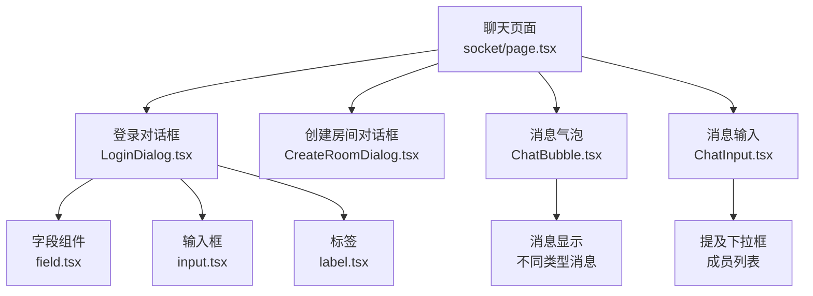
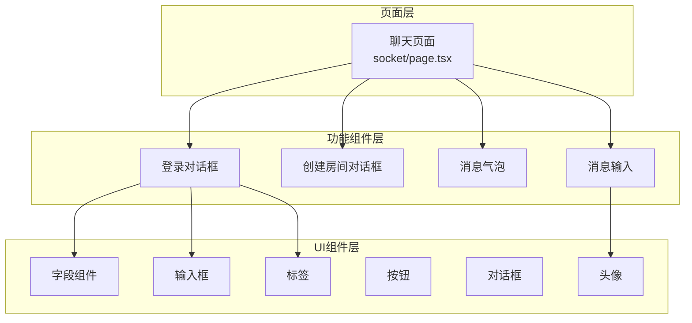
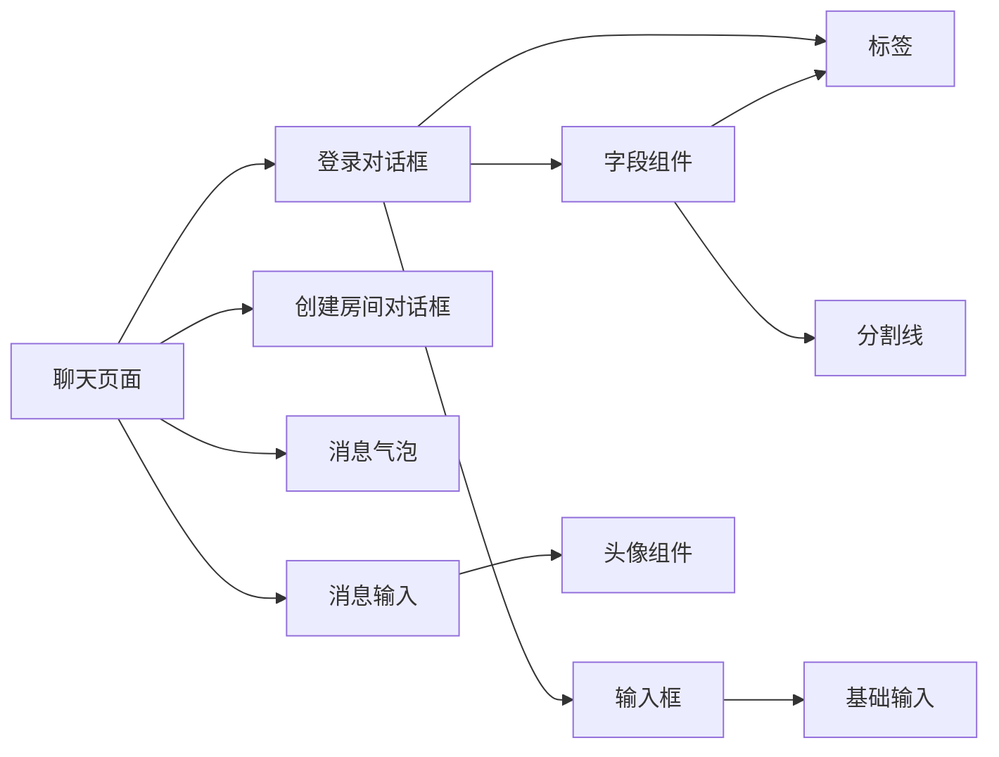

# 表单页面

<cite>
**本文引用的文件**
- [apps/web/src/app/(admin)/(others-pages)/(scene)/socket/page.tsx](file://apps/web/src/app/(admin)/(others-pages)/(scene)/socket/page.tsx)
- [apps/web/src/components/chat/ChatBubble.tsx](file://apps/web/src/components/chat/ChatBubble.tsx)
- [apps/web/src/components/chat/ChatInput.tsx](file://apps/web/src/components/chat/ChatInput.tsx)
- [apps/web/src/components/chat/LoginDialog.tsx](file://apps/web/src/components/chat/LoginDialog.tsx)
- [apps/web/src/components/ui/field.tsx](file://apps/web/src/components/ui/field.tsx)
- [apps/web/src/components/ui/label.tsx](file://apps/web/src/components/ui/label.tsx)
- [apps/web/src/components/ui/input.tsx](file://apps/web/src/components/ui/input.tsx)
- [apps/web/src/app/(admin)/(others-pages)/(scene)/config/page.tsx](file://apps/web/src/app/(admin)/(others-pages)/(scene)/config/page.tsx)
- [apps/web/src/app/(admin)/(others-pages)/(scene)/config/new/page.tsx](file://apps/web/src/app/(admin)/(others-pages)/(scene)/config/new/page.tsx)
- [apps/web/src/app/(admin)/(others-pages)/(scene)/config/apps/[appId]/page.tsx](file://apps/web/src/app/(admin)/(others-pages)/(scene)/config/apps/[appId]/page.tsx)
</cite>

## 更新摘要
**所做更改**
- 删除了所有表单相关组件和页面的文档内容
- 更新了项目结构说明，反映代码库已简化为专注于核心聊天功能
- 移除了表单组件的详细说明和使用指南
- 将重点转向聊天功能的实现和最佳实践

## 目录
1. [简介](#简介)
2. [项目结构](#项目结构)
3. [核心组件](#核心组件)
4. [架构总览](#架构总览)
5. [组件详解](#组件详解)
6. [依赖关系分析](#依赖关系分析)
7. [性能与可访问性](#性能与可访问性)
8. [故障排查指南](#故障排查指南)
9. [结论](#结论)
10. [附录：开发模板与最佳实践](#附录开发模板与最佳实践)

## 简介
本文件面向需要在 Next.js 环境中构建聊天应用的开发者，系统化阐述聊天功能的设计模式与实现方法，覆盖实时通信、用户交互、消息展示与状态管理等方面。由于代码库已简化为专注于核心聊天功能，本文档将重点关注聊天系统的架构设计、组件实现和用户体验优化。

## 项目结构
聊天功能位于应用路由的"群聊"页面下，采用模块化设计，包含聊天室管理、用户认证、消息展示和输入组件等功能。核心聊天组件集中在 components/chat 目录，配套的 UI 组件位于 components/ui 下。

**图表来源**
- [apps/web/src/app/(admin)/(others-pages)/(scene)/socket/page.tsx](file://apps/web/src/app/(admin)/(others-pages)/(scene)/socket/page.tsx#L179-L357)
- [apps/web/src/components/chat/LoginDialog.tsx:39-115](file://apps/web/src/components/chat/LoginDialog.tsx#L39-L115)
- [apps/web/src/components/chat/ChatBubble.tsx:116-131](file://apps/web/src/components/chat/ChatBubble.tsx#L116-L131)
- [apps/web/src/components/chat/ChatInput.tsx:139-189](file://apps/web/src/components/chat/ChatInput.tsx#L139-L189)

**章节来源**
- [apps/web/src/app/(admin)/(others-pages)/(scene)/socket/page.tsx](file://apps/web/src/app/(admin)/(others-pages)/(scene)/socket/page.tsx#L1-L361)

## 核心组件
- 登录对话框 LoginDialog：处理用户身份认证，包含昵称输入和头像选择功能。
- 聊天气泡 ChatBubble：展示不同类型的消息（普通消息、系统消息），支持消息高亮和时间显示。
- 聊天输入 ChatInput：提供消息输入功能，支持自动调整高度、@提及功能和快捷键操作。
- 字段组件 Field：提供表单字段的统一包装，支持标签、描述、错误信息和布局控制。
- 输入框 Input：基础输入组件，支持多种类型和状态样式。

**章节来源**
- [apps/web/src/components/chat/LoginDialog.tsx:1-116](file://apps/web/src/components/chat/LoginDialog.tsx#L1-L116)
- [apps/web/src/components/chat/ChatBubble.tsx:1-132](file://apps/web/src/components/chat/ChatBubble.tsx#L1-L132)
- [apps/web/src/components/chat/ChatInput.tsx:1-190](file://apps/web/src/components/chat/ChatInput.tsx#L1-L190)
- [apps/web/src/components/ui/field.tsx:1-238](file://apps/web/src/components/ui/field.tsx#L1-L238)
- [apps/web/src/components/ui/input.tsx:1-20](file://apps/web/src/components/ui/input.tsx#L1-L20)

## 架构总览
聊天系统采用"页面容器 + 功能组件 + UI 组件"的分层设计。页面负责整体布局和状态管理，功能组件封装具体业务逻辑，UI 组件提供一致的视觉与行为规范。

**图表来源**
- [apps/web/src/app/(admin)/(others-pages)/(scene)/socket/page.tsx](file://apps/web/src/app/(admin)/(others-pages)/(scene)/socket/page.tsx#L107-L126)
- [apps/web/src/components/chat/LoginDialog.tsx:19-29](file://apps/web/src/components/chat/LoginDialog.tsx#L19-L29)
- [apps/web/src/components/chat/ChatInput.tsx:7-21](file://apps/web/src/components/chat/ChatInput.tsx#L7-L21)

## 组件详解

### 登录对话框 LoginDialog
- 设计要点
  - 提供昵称输入和头像选择功能，支持键盘快捷键操作。
  - 集成字段组件系统，提供统一的表单样式和验证。
- 使用建议
  - 确保昵称输入的唯一性和有效性。
  - 头像选择应提供预览和确认机制。

**章节来源**
- [apps/web/src/components/chat/LoginDialog.tsx:1-L116]

### 聊天气泡 ChatBubble
- 能力概览
  - 支持不同类型消息的展示（普通消息、系统消息）。
  - 自动格式化时间戳，支持消息高亮和用户头像显示。
- 错误处理
  - 对于无效消息类型返回 null，确保界面稳定性。

**章节来源**
- [apps/web/src/components/chat/ChatBubble.tsx:1-L132]

### 聊天输入 ChatInput
- 能力概览
  - 自动调整文本域高度，支持多行输入。
  - 实现 @提及功能，提供成员选择下拉框。
  - 支持 Enter 发送、Shift+Enter 换行等快捷键操作。
- 性能优化
  - 使用 useCallback 优化事件处理器性能。
  - 实现 mention 功能的智能匹配和选择。

**章节来源**
- [apps/web/src/components/chat/ChatInput.tsx:1-L190]

### 字段组件 Field
- 能力概览
  - 提供垂直、水平、响应式三种布局模式。
  - 支持标签、描述、错误信息的统一管理。
  - 集成验证状态和视觉反馈。
- 使用场景
  - 适用于表单字段的包装和布局控制。

**章节来源**
- [apps/web/src/components/ui/field.tsx:1-L238]

### 输入框 Input
- 能力概览
  - 支持多种输入类型和状态样式。
  - 集成验证状态和焦点效果。
  - 提供统一的视觉风格和交互反馈。

**章节来源**
- [apps/web/src/components/ui/input.tsx:1-L20]

## 依赖关系分析
- 页面到功能组件：聊天页面通过导入多个功能组件进行布局和交互。
- 功能组件到 UI 组件：功能组件统一依赖 UI 组件库，确保视觉一致性。
- 组件间耦合：采用松耦合设计，通过 props 传递状态和回调。

**图表来源**
- [apps/web/src/app/(admin)/(others-pages)/(scene)/socket/page.tsx](file://apps/web/src/app/(admin)/(others-pages)/(scene)/socket/page.tsx#L10-L12)
- [apps/web/src/components/chat/LoginDialog.tsx:12-15](file://apps/web/src/components/chat/LoginDialog.tsx#L12-L15)

## 性能与可访问性
- 性能
  - 合理使用 React.memo 和 useCallback 优化组件重渲染。
  - 聊天消息列表使用虚拟滚动技术处理大量消息。
  - 图片资源使用懒加载和适当的尺寸优化。
- 可访问性
  - 所有交互元素提供键盘导航支持。
  - 语音朗读友好的 ARIA 标签和状态描述。
  - 高对比度和色盲友好色彩方案。

## 故障排查指南
- 聊天功能异常
  - 检查 WebSocket 连接状态和服务器可用性。
  - 验证用户认证状态和权限。
- 消息显示问题
  - 确认消息数据结构和类型判断逻辑。
  - 检查时间格式化和本地化设置。
- 输入功能异常
  - 验证事件处理器绑定和状态更新逻辑。
  - 检查 @提及功能的正则表达式和匹配逻辑。

**章节来源**
- [apps/web/src/components/chat/ChatInput.tsx:58-L137]
- [apps/web/src/components/chat/ChatBubble.tsx:7-L14]

## 结论
该聊天系统以"页面 + 功能组件 + UI 组件"的分层结构实现高内聚、低耦合的聊天应用开发模式。通过统一的状态管理和组件设计，开发者可以快速构建功能完善的聊天应用，并在保证性能和可访问性的前提下提升用户体验。

## 附录：开发模板与最佳实践

### 聊天应用开发模板
- 页面布局
  - 采用左右分栏布局，左侧为房间列表，右侧为聊天区域。
  - 消息区域使用滚动容器，支持自动滚动到最新消息。
- 用户交互
  - 提供完整的用户认证流程，包括登录、切换用户和登出。
  - 实现房间管理功能，支持创建、加入和离开房间。
- 消息处理
  - 支持多种消息类型（文本、系统通知等）。
  - 实现消息历史加载和实时推送机制。
- 错误处理策略
  - 网络异常时提供重连机制和用户提示。
  - 服务器错误时保持客户端稳定状态。

### 最佳实践清单
- 组件复用
  - 将通用的聊天功能抽象为可复用组件。
  - 统一消息格式和样式规范。
- 状态管理
  - 使用集中式状态管理聊天应用的全局状态。
  - 实现状态持久化和恢复机制。
- 性能优化
  - 实现消息列表虚拟化，处理大量消息场景。
  - 优化图片资源加载和缓存策略。
- 安全性
  - 实施消息内容过滤和审核机制。
  - 保护用户隐私和敏感信息。