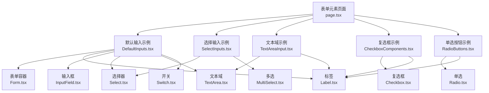
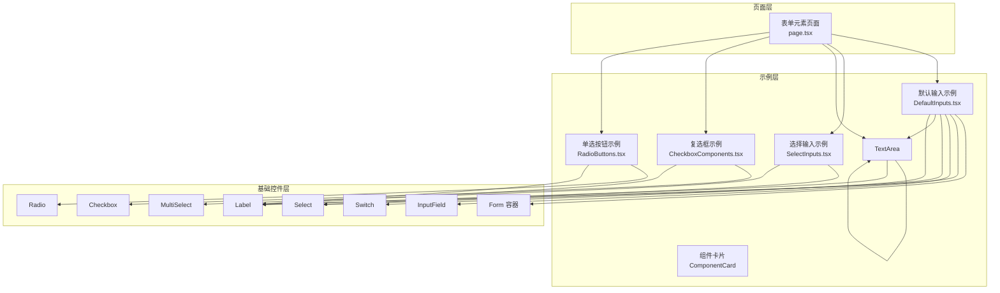
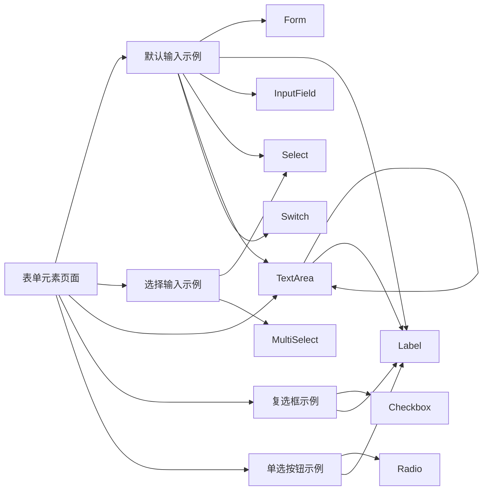

# 表单页面

<cite>
**本文引用的文件**
- [src/app/(admin)/(others-pages)/(forms)/form-elements/page.tsx](file://src/app/(admin)/(others-pages)/(forms)/form-elements/page.tsx)
- [src/components/form/Form.tsx](file://src/components/form/Form.tsx)
- [src/components/form/Label.tsx](file://src/components/form/Label.tsx)
- [src/components/form/input/InputField.tsx](file://src/components/form/input/InputField.tsx)
- [src/components/form/input/TextArea.tsx](file://src/components/form/input/TextArea.tsx)
- [src/components/form/Select.tsx](file://src/components/form/Select.tsx)
- [src/components/form/MultiSelect.tsx](file://src/components/form/MultiSelect.tsx)
- [src/components/form/input/Checkbox.tsx](file://src/components/form/input/Checkbox.tsx)
- [src/components/form/input/Radio.tsx](file://src/components/form/input/Radio.tsx)
- [src/components/form/switch/Switch.tsx](file://src/components/form/switch/Switch.tsx)
- [src/components/form/form-elements/DefaultInputs.tsx](file://src/components/form/form-elements/DefaultInputs.tsx)
- [src/components/form/form-elements/SelectInputs.tsx](file://src/components/form/form-elements/SelectInputs.tsx)
- [src/components/form/form-elements/TextAreaInput.tsx](file://src/components/form/form-elements/TextAreaInput.tsx)
- [src/components/form/form-elements/CheckboxComponents.tsx](file://src/components/form/form-elements/CheckboxComponents.tsx)
- [src/components/form/form-elements/RadioButtons.tsx](file://src/components/form/form-elements/RadioButtons.tsx)
</cite>

## 目录
1. [简介](#简介)
2. [项目结构](#项目结构)
3. [核心组件](#核心组件)
4. [架构总览](#架构总览)
5. [组件详解](#组件详解)
6. [依赖关系分析](#依赖关系分析)
7. [性能与可访问性](#性能与可访问性)
8. [故障排查指南](#故障排查指南)
9. [结论](#结论)
10. [附录：开发模板与最佳实践](#附录开发模板与最佳实践)

## 简介
本文件面向需要在 Next.js 环境中构建复杂表单页面的开发者，系统化阐述表单页面的设计模式与实现方法，覆盖表单元素组合、组件集成、状态管理、验证策略与数据提交流程，并提供布局设计、字段配置、错误处理与用户体验优化建议。内容基于仓库中的表单组件与示例页面进行归纳总结，帮助快速搭建一致、可维护且易用的表单页面。

## 项目结构
表单页面位于应用路由的“表单”分组下，示例页面通过网格布局组织多种输入控件，便于演示与复用。核心表单组件集中在 components/form 及其子目录，配套的表单元素示例位于 components/form/form-elements 下。

图表来源
- [src/app/(admin)/(others-pages)/(forms)/form-elements/page.tsx](file://src/app/(admin)/(others-pages)/(forms)/form-elements/page.tsx#L21-L43)
- [src/components/form/form-elements/DefaultInputs.tsx:10-120](file://src/components/form/form-elements/DefaultInputs.tsx#L10-L120)
- [src/components/form/form-elements/SelectInputs.tsx:9-61](file://src/components/form/form-elements/SelectInputs.tsx#L9-L61)
- [src/components/form/form-elements/TextAreaInput.tsx:7-43](file://src/components/form/form-elements/TextAreaInput.tsx#L7-L43)
- [src/components/form/form-elements/CheckboxComponents.tsx:6-37](file://src/components/form/form-elements/CheckboxComponents.tsx#L6-L37)
- [src/components/form/form-elements/RadioButtons.tsx:6-43](file://src/components/form/form-elements/RadioButtons.tsx#L6-L43)

章节来源
- [src/app/(admin)/(others-pages)/(forms)/form-elements/page.tsx](file://src/app/(admin)/(others-pages)/(forms)/form-elements/page.tsx#L1-L44)

## 核心组件
- 表单容器 Form：封装原生 form 元素，统一阻止默认提交并透传事件，支持自定义样式类名，作为所有表单页面的根容器。
- 输入控件 InputField：支持多种类型（文本、数字、密码、日期等），内置禁用、成功、错误状态样式与提示文本。
- 文本域 TextArea：支持禁用、错误状态与提示文本，可配置行数。
- 选择器 Select：单选下拉，支持占位、禁用、受控/非受控值。
- 多选 MultiSelect：多选项展示与交互，支持移除已选项、展开/收起下拉列表。
- 复选框 Checkbox：带图标与禁用态，支持受控状态与回调。
- 单选按钮 Radio：按组管理，支持禁用与受控选中态。
- 开关 Switch：双色主题（蓝/灰）切换，支持禁用与回调。
- 标签 Label：为表单元素提供语义化标签，支持自定义类名合并。

章节来源
- [src/components/form/Form.tsx:1-24](file://src/components/form/Form.tsx#L1-L24)
- [src/components/form/input/InputField.tsx:1-87](file://src/components/form/input/InputField.tsx#L1-L87)
- [src/components/form/input/TextArea.tsx:1-64](file://src/components/form/input/TextArea.tsx#L1-L64)
- [src/components/form/Select.tsx:1-65](file://src/components/form/Select.tsx#L1-L65)
- [src/components/form/MultiSelect.tsx:1-167](file://src/components/form/MultiSelect.tsx#L1-L167)
- [src/components/form/input/Checkbox.tsx:1-83](file://src/components/form/input/Checkbox.tsx#L1-L83)
- [src/components/form/input/Radio.tsx:1-66](file://src/components/form/input/Radio.tsx#L1-L66)
- [src/components/form/switch/Switch.tsx:1-74](file://src/components/form/switch/Switch.tsx#L1-L74)
- [src/components/form/Label.tsx:1-28](file://src/components/form/Label.tsx#L1-L28)

## 架构总览
表单页面采用“页面容器 + 组件卡片 + 基础表单控件”的分层设计。页面负责布局与分组，组件卡片封装示例与交互逻辑，基础控件提供一致的视觉与行为规范。表单容器统一处理提交事件，避免页面重复实现。

图表来源
- [src/app/(admin)/(others-pages)/(forms)/form-elements/page.tsx](file://src/app/(admin)/(others-pages)/(forms)/form-elements/page.tsx#L21-L43)
- [src/components/form/form-elements/DefaultInputs.tsx:10-120](file://src/components/form/form-elements/DefaultInputs.tsx#L10-L120)
- [src/components/form/form-elements/SelectInputs.tsx:9-61](file://src/components/form/form-elements/SelectInputs.tsx#L9-L61)
- [src/components/form/form-elements/TextAreaInput.tsx:7-43](file://src/components/form/form-elements/TextAreaInput.tsx#L7-L43)
- [src/components/form/form-elements/CheckboxComponents.tsx:6-37](file://src/components/form/form-elements/CheckboxComponents.tsx#L6-L37)
- [src/components/form/form-elements/RadioButtons.tsx:6-43](file://src/components/form/form-elements/RadioButtons.tsx#L6-L43)

## 组件详解

### 表单容器 Form
- 设计要点
  - 阻止浏览器默认提交，统一由 onSubmit 回调处理。
  - 支持自定义样式类名，便于与栅格或卡片布局结合。
- 使用建议
  - 将页面级提交逻辑放在 onSubmit 中，内部再拆分校验与提交步骤。
  - 在复杂表单中配合节流/防抖与加载态，提升交互体验。

章节来源
- [src/components/form/Form.tsx:1-24](file://src/components/form/Form.tsx#L1-L24)

### 输入控件 InputField
- 能力概览
  - 类型丰富（文本、数字、邮箱、密码、日期、时间等）。
  - 内置禁用、成功、错误三种状态样式与提示文本。
  - 支持最小/最大值、步进、占位符、受控/非受控值。
- 错误处理
  - 通过 error 属性触发展示错误样式与提示文本颜色。
  - 建议在表单提交时集中校验并反馈到对应字段。

章节来源
- [src/components/form/input/InputField.tsx:1-87](file://src/components/form/input/InputField.tsx#L1-L87)

### 文本域 TextArea
- 能力概览
  - 可配置行数、禁用、错误状态与提示文本。
- 错误处理
  - 通过 error 属性触发展示错误样式与提示文本颜色。
  - 建议在提交前统计字符长度并给出剩余提示。

章节来源
- [src/components/form/input/TextArea.tsx:1-64](file://src/components/form/input/TextArea.tsx#L1-L64)

### 选择器 Select 与多选 MultiSelect
- Select
  - 支持占位、禁用、受控/非受控值。
  - 通过 onChange 获取选中值，用于联动其他控件。
- MultiSelect
  - 支持多选、移除单项、展开/收起下拉列表。
  - 通过 onChange 返回当前选中值数组，便于批量处理。
- 布局建议
  - 为 Select 添加下拉图标装饰，提升可发现性。
  - 多选面板设置最大高度与滚动条，避免遮挡。

章节来源
- [src/components/form/Select.tsx:1-65](file://src/components/form/Select.tsx#L1-L65)
- [src/components/form/MultiSelect.tsx:1-167](file://src/components/form/MultiSelect.tsx#L1-L167)

### 复选框 Checkbox 与单选按钮 Radio
- Checkbox
  - 支持禁用、受控状态与回调；勾选图标与禁用态图标区分明显。
- Radio
  - 按组管理，同一组 name 相同，支持禁用与受控选中态。
- 用户体验
  - 单选组建议使用统一的间距与对齐，确保视觉一致性。

章节来源
- [src/components/form/input/Checkbox.tsx:1-83](file://src/components/form/input/Checkbox.tsx#L1-L83)
- [src/components/form/input/Radio.tsx:1-66](file://src/components/form/input/Radio.tsx#L1-L66)

### 开关 Switch
- 能力概览
  - 支持蓝色与灰色两种主题，禁用态不可点击。
  - 通过 onChange 获取切换后的布尔值。
- 使用场景
  - 适合“启用/禁用”、“同意条款”等二元操作。

章节来源
- [src/components/form/switch/Switch.tsx:1-74](file://src/components/form/switch/Switch.tsx#L1-L74)

### 标签 Label
- 能力概览
  - 通过 htmlFor 关联控件，支持自定义类名合并。
- 可访问性
  - 始终为每个输入绑定 label，提升屏幕阅读器可用性。

章节来源
- [src/components/form/Label.tsx:1-28](file://src/components/form/Label.tsx#L1-L28)

### 示例页面与组合使用
- 默认输入示例 DefaultInputs
  - 展示文本输入、占位符、下拉选择、密码显示切换、日期选择器、时间输入与支付卡样式输入。
  - 提供图标装饰与交互反馈，便于直接复用。
- 选择输入示例 SelectInputs
  - 展示单选 Select 与多选 MultiSelect 的组合使用。
- 文本域示例 TextAreaInput
  - 展示默认、禁用、错误三种状态的文本域。
- 复选框与单选示例
  - 展示不同状态下的复选框与单选按钮，便于统一风格。

章节来源
- [src/components/form/form-elements/DefaultInputs.tsx:10-120](file://src/components/form/form-elements/DefaultInputs.tsx#L10-L120)
- [src/components/form/form-elements/SelectInputs.tsx:9-61](file://src/components/form/form-elements/SelectInputs.tsx#L9-L61)
- [src/components/form/form-elements/TextAreaInput.tsx:7-43](file://src/components/form/form-elements/TextAreaInput.tsx#L7-L43)
- [src/components/form/form-elements/CheckboxComponents.tsx:6-37](file://src/components/form/form-elements/CheckboxComponents.tsx#L6-L37)
- [src/components/form/form-elements/RadioButtons.tsx:6-43](file://src/components/form/form-elements/RadioButtons.tsx#L6-L43)

## 依赖关系分析
- 页面到示例组件：页面通过导入多个示例组件进行布局展示。
- 示例组件到基础控件：示例组件统一依赖 Form、Label、InputField、Select、TextArea、Checkbox、Radio、Switch 等基础控件。
- 控件间耦合：控件之间低耦合，通过 props 传递状态与回调，便于替换与扩展。

图表来源
- [src/app/(admin)/(others-pages)/(forms)/form-elements/page.tsx](file://src/app/(admin)/(others-pages)/(forms)/form-elements/page.tsx#L21-L43)
- [src/components/form/form-elements/DefaultInputs.tsx:10-120](file://src/components/form/form-elements/DefaultInputs.tsx#L10-L120)
- [src/components/form/form-elements/SelectInputs.tsx:9-61](file://src/components/form/form-elements/SelectInputs.tsx#L9-L61)
- [src/components/form/form-elements/TextAreaInput.tsx:7-43](file://src/components/form/form-elements/TextAreaInput.tsx#L7-L43)
- [src/components/form/form-elements/CheckboxComponents.tsx:6-37](file://src/components/form/form-elements/CheckboxComponents.tsx#L6-L37)
- [src/components/form/form-elements/RadioButtons.tsx:6-43](file://src/components/form/form-elements/RadioButtons.tsx#L6-L43)

## 性能与可访问性
- 性能
  - 合理拆分表单为多个卡片组件，避免单个组件过大导致重渲染。
  - 对频繁变更的输入使用受控组件，必要时在提交阶段统一收集数据。
  - 多选面板设置最大高度与滚动，减少布局抖动。
- 可访问性
  - 所有输入均需关联 label，确保屏幕阅读器正确读取。
  - 错误状态使用语义化提示文本，避免仅依赖颜色传达信息。
  - 提供键盘可操作性（如单选组可通过方向键切换）。

## 故障排查指南
- 表单未触发提交
  - 确认页面根容器是否使用 Form 并正确传入 onSubmit。
  - 检查是否存在阻止事件冒泡的行为。
- 输入状态异常（禁用/错误/成功）
  - 确认传入的 disabled、error、success 状态属性是否正确。
  - 检查样式类名是否被外部覆盖。
- 多选不更新
  - 确认 onChange 是否返回最新选中值数组，并在父组件中更新状态。
- 单选无法切换
  - 确保 Radio 的 name 相同且 onChange 正确更新选中值。
- 可访问性问题
  - 检查 label 的 htmlFor 是否与对应控件 id 匹配。
  - 错误提示文本是否对屏幕阅读器可见。

章节来源
- [src/components/form/Form.tsx:1-24](file://src/components/form/Form.tsx#L1-L24)
- [src/components/form/input/InputField.tsx:1-87](file://src/components/form/input/InputField.tsx#L1-L87)
- [src/components/form/input/TextArea.tsx:1-64](file://src/components/form/input/TextArea.tsx#L1-L64)
- [src/components/form/Select.tsx:1-65](file://src/components/form/Select.tsx#L1-L65)
- [src/components/form/MultiSelect.tsx:1-167](file://src/components/form/MultiSelect.tsx#L1-L167)
- [src/components/form/input/Checkbox.tsx:1-83](file://src/components/form/input/Checkbox.tsx#L1-L83)
- [src/components/form/input/Radio.tsx:1-66](file://src/components/form/input/Radio.tsx#L1-L66)
- [src/components/form/Label.tsx:1-28](file://src/components/form/Label.tsx#L1-L28)

## 结论
该表单体系以“页面 + 卡片 + 基础控件”的分层结构实现高内聚、低耦合的表单页面开发模式。通过统一的状态管理与样式规范，开发者可以快速组合出复杂表单，并在保证可访问性与性能的前提下提升用户体验。建议在实际项目中进一步完善校验与提交流程，形成标准化的表单开发模板。

## 附录：开发模板与最佳实践

### 表单页面开发模板
- 页面布局
  - 使用网格布局将不同功能区域分组展示，如“基础输入区”“选择区”“高级输入区”。
  - 每个区域使用组件卡片包裹，便于独立维护与复用。
- 字段配置
  - 为每个字段提供明确的标签与可选提示文本。
  - 对必填字段使用星号标识并在提交时强制校验。
- 验证机制
  - 建议在输入变更时进行即时校验（轻量规则），在提交时进行完整校验。
  - 将错误信息集中展示在表单顶部或字段旁，避免分散。
- 数据提交流程
  - 在 Form 的 onSubmit 中收集数据，先执行本地校验，再发起网络请求。
  - 提交过程中显示加载态，成功后提示并重置部分字段，失败时保留用户输入并高亮错误字段。
- 错误处理策略
  - 分类错误：必填、格式、范围、唯一性等，分别给出针对性提示。
  - 网络错误：统一拦截并提示，支持重试与错误日志上报。
- 用户体验优化
  - 为长表单提供分步导航与保存草稿能力。
  - 对移动端输入优化（如键盘适配、自动聚焦下一个字段）。
  - 提供清空、全选、复制等便捷操作。

### 最佳实践清单
- 组件复用
  - 将常用字段抽象为可复用组件，统一样式与行为。
- 状态管理
  - 使用受控组件与集中式状态（如 useReducer 或表单库），避免状态碎片化。
- 可访问性
  - 严格遵循 label 关联、键盘导航、错误提示语义化。
- 性能
  - 对昂贵计算进行缓存，对高频输入进行节流/防抖。
- 安全
  - 对敏感字段（密码、支付信息）进行安全处理，避免明文存储与泄露。