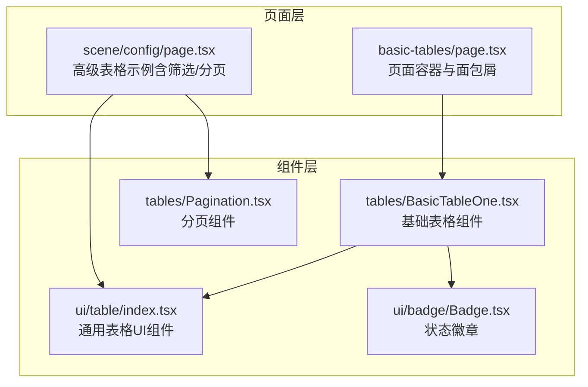
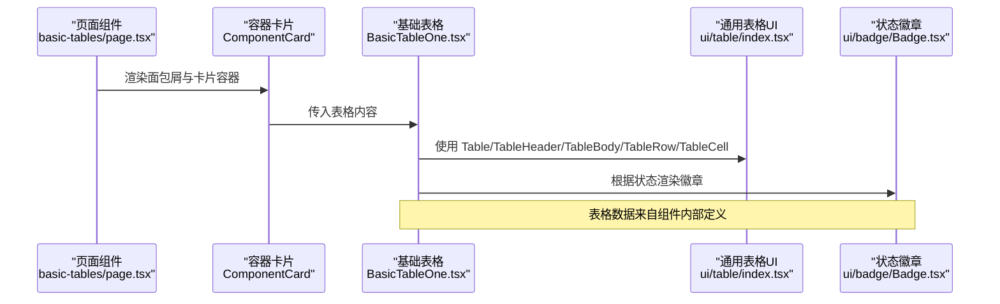
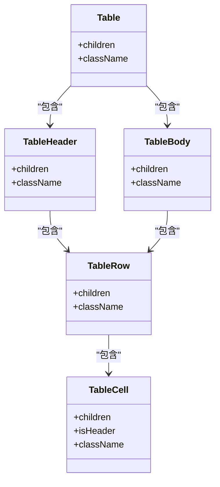
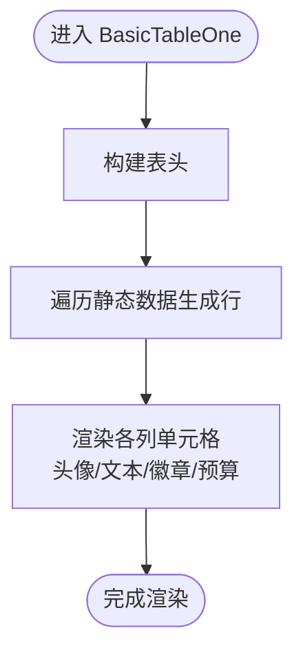
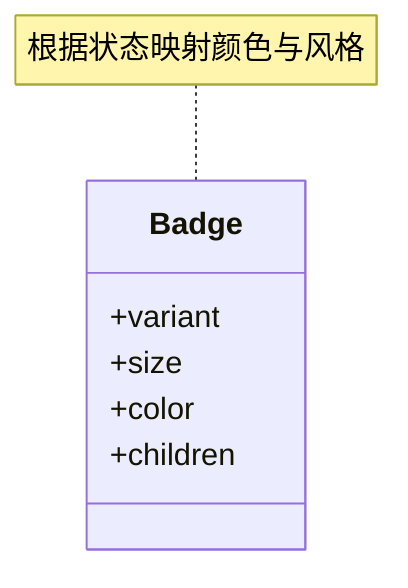
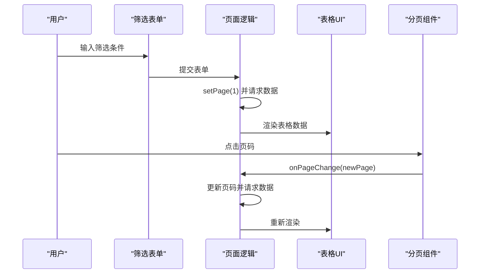
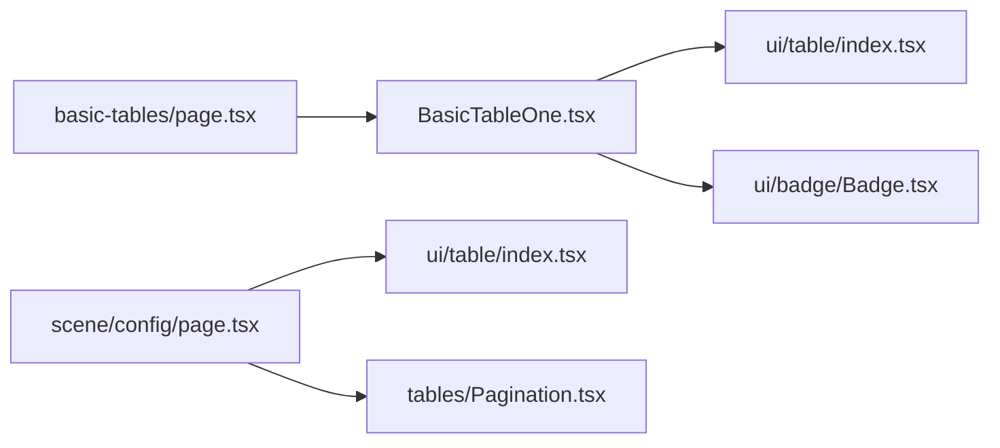

# 表格页面

<cite>
**本文引用的文件**
- [src/app/(admin)/(others-pages)/(tables)/basic-tables/page.tsx](file://src/app/(admin)/(others-pages)/(tables)/basic-tables/page.tsx)
- [src/components/tables/BasicTableOne.tsx](file://src/components/tables/BasicTableOne.tsx)
- [src/components/ui/table/index.tsx](file://src/components/ui/table/index.tsx)
- [src/components/tables/Pagination.tsx](file://src/components/tables/Pagination.tsx)
- [src/components/ui/badge/Badge.tsx](file://src/components/ui/badge/Badge.tsx)
- [src/app/(admin)/(others-pages)/(scene)/config/page.tsx](file://src/app/(admin)/(others-pages)/(scene)/config/page.tsx)
</cite>

## 目录
1. [简介](#简介)
2. [项目结构](#项目结构)
3. [核心组件](#核心组件)
4. [架构总览](#架构总览)
5. [详细组件分析](#详细组件分析)
6. [依赖关系分析](#依赖关系分析)
7. [性能考虑](#性能考虑)
8. [故障排查指南](#故障排查指南)
9. [结论](#结论)
10. [附录：开发模板与最佳实践](#附录开发模板与最佳实践)

## 简介
本文件面向需要在后台管理系统中快速构建“表格页面”的开发者，系统性阐述表格页面的设计模式与实现方法，覆盖以下主题：
- 基础表格的数据展示与交互
- 表格组件的集成方式、数据绑定、排序与筛选
- 表格布局设计、分页实现、响应式表格
- 表格页面开发模板、性能优化与大数据表格处理方案

通过仓库中的现有实现（基础表格、通用表格UI、分页组件、徽章状态等），给出可直接复用的组件化思路与工程化实践。

## 项目结构
表格页面在本项目中的组织方式如下：
- 页面层：位于路由目录下，负责页面元信息与容器卡片包装
- 组件层：包含通用表格UI组件、具体业务表格组件、分页组件、状态徽章等
- 数据与交互：页面组件通过状态与回调与分页组件协作，完成筛选、翻页等交互

图表来源
- [src/app/(admin)/(others-pages)/(tables)/basic-tables/page.tsx:14-25](file://src/app/(admin)/(others-pages)/(tables)/basic-tables/page.tsx#L14-L25)
- [src/components/tables/BasicTableOne.tsx:114-226](file://src/components/tables/BasicTableOne.tsx#L114-L226)
- [src/components/ui/table/index.tsx:34-66](file://src/components/ui/table/index.tsx#L34-L66)
- [src/components/tables/Pagination.tsx:7-54](file://src/components/tables/Pagination.tsx#L7-L54)
- [src/components/ui/badge/Badge.tsx:23-77](file://src/components/ui/badge/Badge.tsx#L23-L77)
- [src/app/(admin)/(others-pages)/(scene)/config/page.tsx:48-349](file://src/app/(admin)/(others-pages)/(scene)/config/page.tsx#L48-L349)

章节来源
- [src/app/(admin)/(others-pages)/(tables)/basic-tables/page.tsx:14-25](file://src/app/(admin)/(others-pages)/(tables)/basic-tables/page.tsx#L14-L25)
- [src/app/(admin)/(others-pages)/(scene)/config/page.tsx:48-349](file://src/app/(admin)/(others-pages)/(scene)/config/page.tsx#L48-L349)

## 核心组件
- 通用表格UI组件：封装 table/thead/tbody/tr/td/th 的基础能力，统一样式与语义
- 基础表格组件：以静态数据演示用户头像、团队头像、状态徽章、预算展示等
- 分页组件：提供上一页/下一页与中间页码跳转，支持禁用态与高亮当前页
- 状态徽章：按状态映射不同颜色与风格，用于“Active/Pending/Cancel”等状态展示

章节来源
- [src/components/ui/table/index.tsx:34-66](file://src/components/ui/table/index.tsx#L34-L66)
- [src/components/tables/BasicTableOne.tsx:114-226](file://src/components/tables/BasicTableOne.tsx#L114-L226)
- [src/components/tables/Pagination.tsx:7-54](file://src/components/tables/Pagination.tsx#L7-L54)
- [src/components/ui/badge/Badge.tsx:23-77](file://src/components/ui/badge/Badge.tsx#L23-L77)

## 架构总览
下图展示了从页面到组件的调用链路与数据流：

图表来源
- [src/app/(admin)/(others-pages)/(tables)/basic-tables/page.tsx:14-25](file://src/app/(admin)/(others-pages)/(tables)/basic-tables/page.tsx#L14-L25)
- [src/components/tables/BasicTableOne.tsx:114-226](file://src/components/tables/BasicTableOne.tsx#L114-L226)
- [src/components/ui/table/index.tsx:34-66](file://src/components/ui/table/index.tsx#L34-L66)
- [src/components/ui/badge/Badge.tsx:23-77](file://src/components/ui/badge/Badge.tsx#L23-L77)

## 详细组件分析

### 通用表格UI组件（Table/thead/tbody/tr/td/th）
- 设计要点
  - 将 HTML 表格标签抽象为 React 组件，统一 className 与 children 接口
  - TableCell 支持 isHeader 切换 th/td，便于语义化与样式控制
- 复杂度与性能
  - O(n) 渲染开销与行数线性相关；建议配合虚拟滚动或分页降低单次渲染量
- 错误处理与边界
  - 未对空 children 做特殊处理，需确保父组件传入有效子节点

图表来源
- [src/components/ui/table/index.tsx:34-66](file://src/components/ui/table/index.tsx#L34-L66)

章节来源
- [src/components/ui/table/index.tsx:34-66](file://src/components/ui/table/index.tsx#L34-L66)

### 基础表格组件（BasicTableOne）
- 功能概述
  - 展示用户头像、姓名与角色、项目名、团队成员头像集合、状态徽章、预算
  - 内置静态数据，演示多列复杂单元格布局
- 数据绑定
  - 使用接口定义数据结构，map 渲染每行
- 交互与扩展
  - 当前为只读展示；可扩展点击、排序、筛选、编辑等交互

图表来源
- [src/components/tables/BasicTableOne.tsx:114-226](file://src/components/tables/BasicTableOne.tsx#L114-L226)

章节来源
- [src/components/tables/BasicTableOne.tsx:114-226](file://src/components/tables/BasicTableOne.tsx#L114-L226)

### 分页组件（Pagination）
- 功能概述
  - 支持上一页/下一页与中间页码跳转，高亮当前页，两端省略号
  - 通过回调 onPageChange 通知父组件页码变更
- 性能与可用性
  - 仅渲染当前页附近的页码，避免超长列表造成渲染压力
  - 提供禁用态，防止越界操作

图表来源
- [src/components/tables/Pagination.tsx:7-54](file://src/components/tables/Pagination.tsx#L7-L54)

章节来源
- [src/components/tables/Pagination.tsx:7-54](file://src/components/tables/Pagination.tsx#L7-L54)

### 状态徽章（Badge）
- 功能概述
  - 支持多种颜色与尺寸，根据状态映射不同视觉风格
- 在表格中的使用
  - 依据订单状态选择不同颜色与风格，提升可读性

图表来源
- [src/components/ui/badge/Badge.tsx:23-77](file://src/components/ui/badge/Badge.tsx#L23-L77)

章节来源
- [src/components/ui/badge/Badge.tsx:23-77](file://src/components/ui/badge/Badge.tsx#L23-L77)

### 高级表格示例（带筛选/分页）
- 页面职责
  - 表单筛选（名称/版本/应用ID）、重置、新建、删除弹窗
  - 列表渲染、分页展示、操作按钮（编辑/详情/删除）
- 关键交互
  - handleSearch/handleReset 控制筛选与重置
  - handlePageChange 控制分页
  - handleUpdate/handleDetail 打开编辑/详情
  - openDeleteModal/handleDelete 触发删除流程

图表来源
- [src/app/(admin)/(others-pages)/(scene)/config/page.tsx:134-150](file://src/app/(admin)/(others-pages)/(scene)/config/page.tsx#L134-L150)
- [src/app/(admin)/(others-pages)/(scene)/config/page.tsx:226-333](file://src/app/(admin)/(others-pages)/(scene)/config/page.tsx#L226-L333)
- [src/components/tables/Pagination.tsx:7-54](file://src/components/tables/Pagination.tsx#L7-L54)

章节来源
- [src/app/(admin)/(others-pages)/(scene)/config/page.tsx:48-349](file://src/app/(admin)/(others-pages)/(scene)/config/page.tsx#L48-L349)

## 依赖关系分析
- 页面到组件
  - basic-tables/page.tsx 依赖 BasicTableOne.tsx
  - scene/config/page.tsx 依赖 ui/table 与 tables/Pagination
- 组件内聚与耦合
  - BasicTableOne 聚合 ui/table 与 ui/badge，耦合度低，便于复用
  - Pagination 无外部依赖，独立性强
- 外部依赖
  - Next.js Image 组件用于头像渲染
  - Next.js Link 用于应用链接跳转

图表来源
- [src/app/(admin)/(others-pages)/(tables)/basic-tables/page.tsx:14-25](file://src/app/(admin)/(others-pages)/(tables)/basic-tables/page.tsx#L14-L25)
- [src/components/tables/BasicTableOne.tsx:114-226](file://src/components/tables/BasicTableOne.tsx#L114-L226)
- [src/components/ui/table/index.tsx:34-66](file://src/components/ui/table/index.tsx#L34-L66)
- [src/components/tables/Pagination.tsx:7-54](file://src/components/tables/Pagination.tsx#L7-L54)
- [src/components/ui/badge/Badge.tsx:23-77](file://src/components/ui/badge/Badge.tsx#L23-L77)
- [src/app/(admin)/(others-pages)/(scene)/config/page.tsx:48-349](file://src/app/(admin)/(others-pages)/(scene)/config/page.tsx#L48-L349)

章节来源
- [src/app/(admin)/(others-pages)/(tables)/basic-tables/page.tsx:14-25](file://src/app/(admin)/(others-pages)/(tables)/basic-tables/page.tsx#L14-L25)
- [src/components/tables/BasicTableOne.tsx:114-226](file://src/components/tables/BasicTableOne.tsx#L114-L226)
- [src/components/ui/table/index.tsx:34-66](file://src/components/ui/table/index.tsx#L34-L66)
- [src/components/tables/Pagination.tsx:7-54](file://src/components/tables/Pagination.tsx#L7-L54)
- [src/components/ui/badge/Badge.tsx:23-77](file://src/components/ui/badge/Badge.tsx#L23-L77)
- [src/app/(admin)/(others-pages)/(scene)/config/page.tsx:48-349](file://src/app/(admin)/(others-pages)/(scene)/config/page.tsx#L48-L349)

## 性能考虑
- 单页渲染规模控制
  - 使用分页组件限制每页条目数量，避免一次性渲染大量行
- 虚拟滚动（推荐）
  - 对于超大列表，采用虚拟滚动仅渲染可视区域内的行，显著降低 DOM 节点数量
- 图片懒加载
  - 头像等图片资源启用懒加载，减少首屏压力
- 事件与状态更新
  - 筛选与分页尽量合并状态更新，避免频繁重渲染
- 列宽与最小宽度
  - 固定最小宽度与溢出处理，保证表格在小屏设备上的可读性

## 故障排查指南
- 表格列错位或显示异常
  - 检查是否为每行提供了相同数量的单元格，确保表头与表体一致
- 点击无反应
  - 确认按钮事件绑定与回调函数传递正确，检查禁用态逻辑
- 分页不生效
  - 确认 onPageChange 回调被正确触发并更新页码状态
- 状态徽章颜色不符合预期
  - 检查状态值与颜色映射逻辑，确保传入正确的 color 值

## 结论
本项目提供了从“通用表格UI组件”到“基础表格组件”再到“高级表格示例”的完整路径，既满足快速落地的基础需求，又具备扩展空间（筛选、分页、排序、编辑等）。通过组件化与分页策略，可在保持良好用户体验的同时控制渲染成本。

## 附录：开发模板与最佳实践

### 开发模板（步骤清单）
- 页面容器
  - 引入面包屑与卡片容器，包裹表格组件
- 表格组件
  - 使用通用表格UI组件构建表头与表体
  - 在单元格中组合头像、文本、徽章等元素
- 分页与筛选
  - 在页面中引入分页组件，并通过回调更新页码
  - 提供筛选表单，结合重置与查询按钮
- 响应式设计
  - 使用横向滚动容器与最小宽度约束，保证小屏可读性
- 可访问性
  - 为表格提供简洁的表头语义，必要时补充标题属性

### 排序与筛选（实现建议）
- 排序
  - 在父组件维护排序字段与方向，点击表头时切换方向并重新请求数据
- 筛选
  - 将筛选条件集中管理，提交时重置页码并刷新数据
- 高级交互
  - 支持多列排序、自定义过滤器、批量操作等

### 大数据表格处理方案
- 分页优先：默认分页，限制每页条目
- 虚拟滚动：在超大列表场景下替换传统分页
- 懒加载：图片与子内容按需加载
- 服务端渲染：将排序、筛选、分页逻辑下沉至后端接口