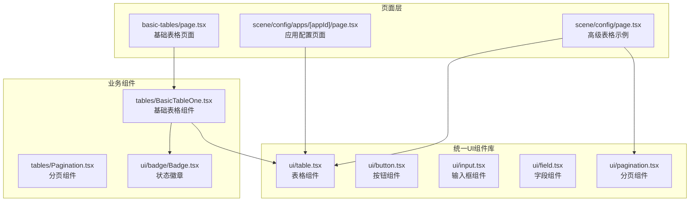
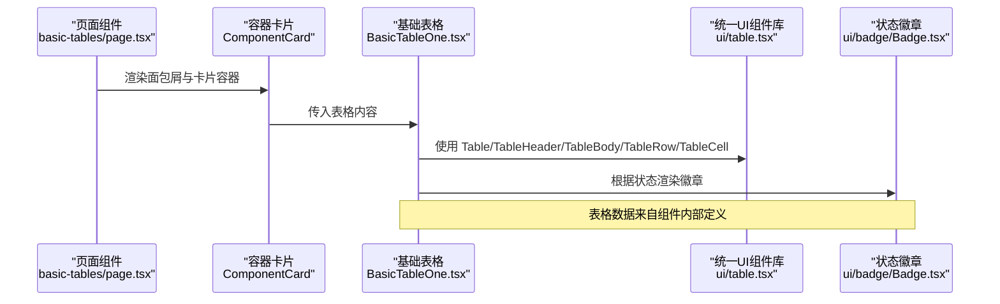
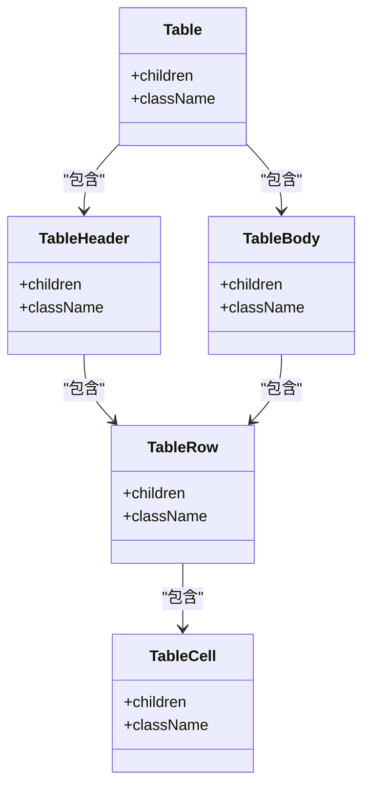
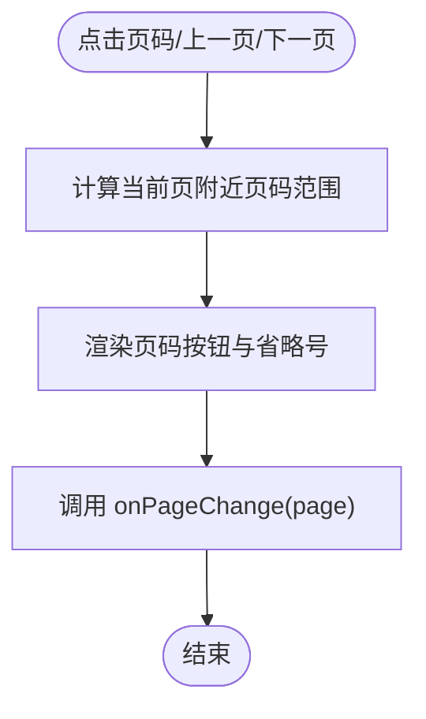
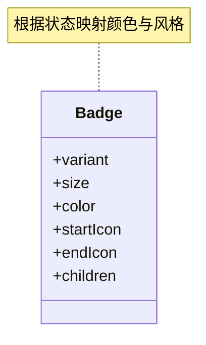
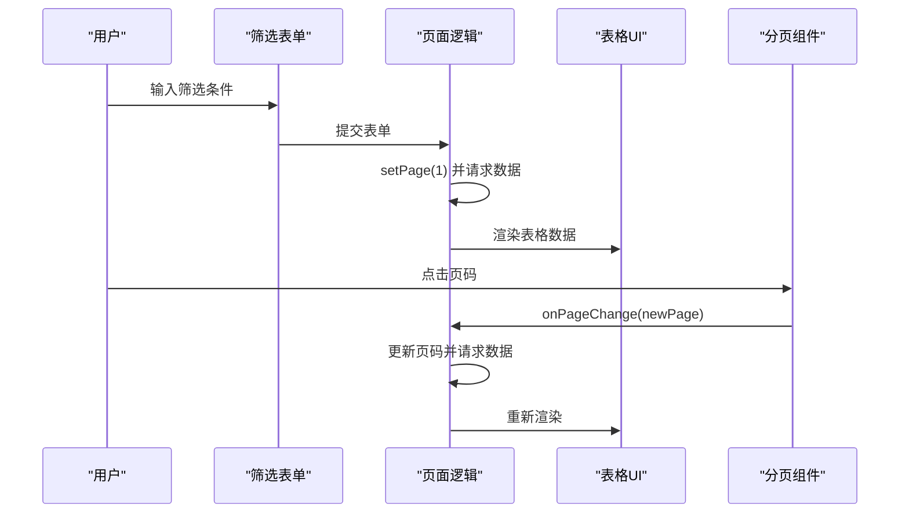
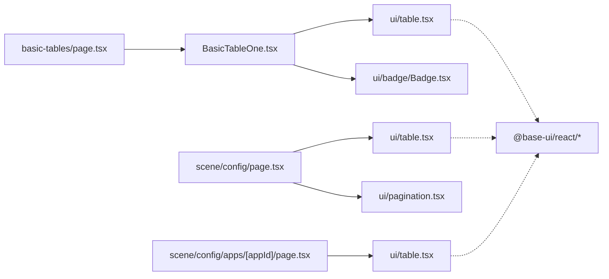

# 表格页面

<cite>
**本文引用的文件**
- [src/app/(admin)/(others-pages)/(tables)/basic-tables/page.tsx](file://src/app/(admin)/(others-pages)/(tables)/basic-tables/page.tsx)
- [src/components/tables/BasicTableOne.tsx](file://src/components/tables/BasicTableOne.tsx)
- [src/components/ui/table.tsx](file://src/components/ui/table.tsx)
- [src/components/tables/Pagination.tsx](file://src/components/tables/Pagination.tsx)
- [src/components/ui/badge/Badge.tsx](file://src/components/ui/badge/Badge.tsx)
- [src/app/(admin)/(others-pages)/(scene)/config/page.tsx](file://src/app/(admin)/(others-pages)/(scene)/config/page.tsx)
- [src/app/(admin)/(others-pages)/(scene)/config/apps/[appId]/page.tsx](file://src/app/(admin)/(others-pages)/(scene)/config/apps/[appId]/page.tsx)
- [src/components/ui/pagination.tsx](file://src/components/ui/pagination.tsx)
- [src/components/ui/button.tsx](file://src/components/ui/button.tsx)
- [src/components/ui/input.tsx](file://src/components/ui/input.tsx)
- [src/components/ui/field.tsx](file://src/components/ui/field.tsx)
</cite>

## 更新摘要
**所做更改**
- 更新了UI组件库架构，从旧的表格组件迁移到新的统一UI组件库
- 新增了完整的UI组件库体系，包括button、input、field等基础组件
- 更新了高级表格示例，采用新的UI组件库和现代化的表格实现
- 重构了分页组件，采用新的Pagination组件库
- 增强了表格页面的交互性和可访问性

## 目录
1. [简介](#简介)
2. [项目结构](#项目结构)
3. [核心组件](#核心组件)
4. [架构总览](#架构总览)
5. [详细组件分析](#详细组件分析)
6. [依赖关系分析](#依赖关系分析)
7. [性能考虑](#性能考虑)
8. [故障排查指南](#故障排查指南)
9. [结论](#结论)
10. [附录：开发模板与最佳实践](#附录开发模板与最佳实践)

## 简介
本文件面向需要在后台管理系统中快速构建"表格页面"的开发者，系统性阐述表格页面的设计模式与实现方法，覆盖以下主题：
- 基础表格的数据展示与交互
- 表格组件的集成方式、数据绑定、排序与筛选
- 表格布局设计、分页实现、响应式表格
- 表格页面开发模板、性能优化与大数据表格处理方案

**更新** 本版本反映了新的UI组件库架构变更，包括统一的表格组件、增强的交互组件和现代化的路由系统。

通过仓库中的现有实现（基础表格、统一UI组件库、高级表格示例、分页组件、徽章状态等），给出可直接复用的组件化思路与工程化实践。

## 项目结构
表格页面在本项目中的组织方式如下：
- 页面层：位于路由目录下，负责页面元信息与容器卡片包装
- 组件层：包含统一UI组件库、具体业务表格组件、分页组件、状态徽章等
- 数据与交互：页面组件通过状态与回调与分页组件协作，完成筛选、翻页等交互

**图表来源**
- [src/app/(admin)/(others-pages)/(tables)/basic-tables/page.tsx:14-25](file://src/app/(admin)/(others-pages)/(tables)/basic-tables/page.tsx#L14-L25)
- [src/components/tables/BasicTableOne.tsx:114-226](file://src/components/tables/BasicTableOne.tsx#L114-L226)
- [src/components/ui/table.tsx:1-117](file://src/components/ui/table.tsx#L1-L117)
- [src/components/tables/Pagination.tsx:7-54](file://src/components/tables/Pagination.tsx#L7-L54)
- [src/components/ui/badge/Badge.tsx:23-77](file://src/components/ui/badge/Badge.tsx#L23-L77)
- [src/app/(admin)/(others-pages)/(scene)/config/page.tsx:48-349](file://src/app/(admin)/(others-pages)/(scene)/config/page.tsx#L48-L349)

**章节来源**
- [src/app/(admin)/(others-pages)/(tables)/basic-tables/page.tsx:14-25](file://src/app/(admin)/(others-pages)/(tables)/basic-tables/page.tsx#L14-L25)
- [src/app/(admin)/(others-pages)/(scene)/config/page.tsx:48-349](file://src/app/(admin)/(others-pages)/(scene)/config/page.tsx#L48-L349)

## 核心组件
- **统一UI组件库**：提供完整的组件生态系统，包括表格、按钮、输入框、字段等基础组件
- **基础表格组件**：以静态数据演示用户头像、团队头像、状态徽章、预算展示等
- **现代化分页组件**：提供上一页/下一页与中间页码跳转，支持禁用态与高亮当前页
- **状态徽章**：按状态映射不同颜色与风格，用于"Active/Pending/Cancel"等状态展示
- **增强的交互组件**：包括按钮、输入框、字段组等，提供更好的用户体验

**章节来源**
- [src/components/ui/table.tsx:1-117](file://src/components/ui/table.tsx#L1-L117)
- [src/components/tables/BasicTableOne.tsx:114-226](file://src/components/tables/BasicTableOne.tsx#L114-L226)
- [src/components/tables/Pagination.tsx:7-54](file://src/components/tables/Pagination.tsx#L7-L54)
- [src/components/ui/badge/Badge.tsx:23-77](file://src/components/ui/badge/Badge.tsx#L23-L77)

## 架构总览
下图展示了从页面到组件的调用链路与数据流：

**图表来源**
- [src/app/(admin)/(others-pages)/(tables)/basic-tables/page.tsx:14-25](file://src/app/(admin)/(others-pages)/(tables)/basic-tables/page.tsx#L14-L25)
- [src/components/tables/BasicTableOne.tsx:114-226](file://src/components/tables/BasicTableOne.tsx#L114-L226)
- [src/components/ui/table.tsx:1-117](file://src/components/ui/table.tsx#L1-L117)
- [src/components/ui/badge/Badge.tsx:23-77](file://src/components/ui/badge/Badge.tsx#L23-L77)

## 详细组件分析

### 统一UI组件库（Table/thead/tbody/tr/td/th）
- **设计要点**
  - 将HTML表格标签抽象为React组件，统一className与children接口
  - TableCell支持isHeader切换th/td，便于语义化与样式控制
  - 提供完整的表格组件生态系统，包括Table、TableHeader、TableBody、TableRow、TableCell等
- **复杂度与性能**
  - O(n)渲染开销与行数线性相关；建议配合虚拟滚动或分页降低单次渲染量
- **错误处理与边界**
  - 未对空children做特殊处理，需确保父组件传入有效子节点

**图表来源**
- [src/components/ui/table.tsx:1-117](file://src/components/ui/table.tsx#L1-L117)

**章节来源**
- [src/components/ui/table.tsx:1-117](file://src/components/ui/table.tsx#L1-L117)

### 基础表格组件（BasicTableOne）
- **功能概述**
  - 展示用户头像、姓名与角色、项目名、团队成员头像集合、状态徽章、预算
  - 内置静态数据，演示多列复杂单元格布局
- **数据绑定**
  - 使用接口定义数据结构，map渲染每行
- **交互与扩展**
  - 当前为只读展示；可扩展点击、排序、筛选、编辑等交互

**图表来源**
- [src/components/tables/BasicTableOne.tsx:114-226](file://src/components/tables/BasicTableOne.tsx#L114-L226)

**章节来源**
- [src/components/tables/BasicTableOne.tsx:114-226](file://src/components/tables/BasicTableOne.tsx#L114-L226)

### 现代化分页组件（Pagination）
- **功能概述**
  - 支持上一页/下一页与中间页码跳转，高亮当前页，两端省略号
  - 通过回调onPageChange通知父组件页码变更
  - 集成新的UI组件库，提供更好的视觉效果和交互体验
- **性能与可用性**
  - 仅渲染当前页附近的页码，避免超长列表造成渲染压力
  - 提供禁用态，防止越界操作
  - 支持键盘导航和屏幕阅读器访问

**图表来源**
- [src/components/tables/Pagination.tsx:7-54](file://src/components/tables/Pagination.tsx#L7-L54)

**章节来源**
- [src/components/tables/Pagination.tsx:7-54](file://src/components/tables/Pagination.tsx#L7-L54)

### 状态徽章（Badge）
- **功能概述**
  - 支持多种颜色与尺寸，根据状态映射不同视觉风格
  - 提供light和solid两种变体，支持图标前后缀
- **在表格中的使用**
  - 依据订单状态选择不同颜色与风格，提升可读性

**图表来源**
- [src/components/ui/badge/Badge.tsx:23-77](file://src/components/ui/badge/Badge.tsx#L23-L77)

**章节来源**
- [src/components/ui/badge/Badge.tsx:23-77](file://src/components/ui/badge/Badge.tsx#L23-L77)

### 高级表格示例（带筛选/分页）
- **页面职责**
  - 表单筛选（名称/版本/应用ID）、重置、新建、删除弹窗
  - 列表渲染、分页展示、操作按钮（编辑/详情/删除）
  - 集成新的UI组件库，提供更好的用户体验
- **关键交互**
  - handleSearch/handleReset控制筛选与重置
  - handlePageChange控制分页
  - handleUpdate/handleDetail打开编辑/详情
  - openDeleteModal/handleDelete触发删除流程
- **现代化特性**
  - 使用新的Pagination组件库
  - 集成Toast通知系统
  - 支持批量操作和导出功能

**图表来源**
- [src/app/(admin)/(others-pages)/(scene)/config/page.tsx:134-150](file://src/app/(admin)/(others-pages)/(scene)/config/page.tsx#L134-L150)
- [src/app/(admin)/(others-pages)/(scene)/config/page.tsx:226-333](file://src/app/(admin)/(others-pages)/(scene)/config/page.tsx#L226-L333)
- [src/components/tables/Pagination.tsx:7-54](file://src/components/tables/Pagination.tsx#L7-L54)

**章节来源**
- [src/app/(admin)/(others-pages)/(scene)/config/page.tsx:48-349](file://src/app/(admin)/(others-pages)/(scene)/config/page.tsx#L48-L349)

### 应用配置表格页面
- **功能特性**
  - 支持批量选择和操作
  - 集成统计信息展示
  - 支持CSV导出功能
  - 完整的CRUD操作流程
- **技术实现**
  - 使用新的UI组件库构建表单和按钮
  - 实现完整的状态管理和错误处理
  - 支持路由参数传递和页面跳转

**章节来源**
- [src/app/(admin)/(others-pages)/(scene)/config/apps/[appId]/page.tsx:1-313](file://src/app/(admin)/(others-pages)/(scene)/config/apps/[appId]/page.tsx#L1-L313)

## 依赖关系分析
- **页面到组件**
  - basic-tables/page.tsx依赖BasicTableOne.tsx
  - scene/config/page.tsx依赖ui/table与tables/Pagination
  - 新增对统一UI组件库的依赖
- **组件内聚与耦合**
  - BasicTableOne聚合ui/table与ui/badge，耦合度低，便于复用
  - Pagination无外部依赖，独立性强
  - 新的UI组件库提供统一的组件接口
- **外部依赖**
  - Next.js Image组件用于头像渲染
  - Next.js Link用于应用链接跳转
  - 新增对@base-ui/react组件库的依赖

**图表来源**
- [src/app/(admin)/(others-pages)/(tables)/basic-tables/page.tsx:14-25](file://src/app/(admin)/(others-pages)/(tables)/basic-tables/page.tsx#L14-L25)
- [src/components/tables/BasicTableOne.tsx:114-226](file://src/components/tables/BasicTableOne.tsx#L114-L226)
- [src/components/ui/table.tsx:1-117](file://src/components/ui/table.tsx#L1-L117)
- [src/components/tables/Pagination.tsx:7-54](file://src/components/tables/Pagination.tsx#L7-L54)
- [src/components/ui/badge/Badge.tsx:23-77](file://src/components/ui/badge/Badge.tsx#L23-L77)
- [src/app/(admin)/(others-pages)/(scene)/config/page.tsx:48-349](file://src/app/(admin)/(others-pages)/(scene)/config/page.tsx#L48-L349)

**章节来源**
- [src/app/(admin)/(others-pages)/(tables)/basic-tables/page.tsx:14-25](file://src/app/(admin)/(others-pages)/(tables)/basic-tables/page.tsx#L14-L25)
- [src/components/tables/BasicTableOne.tsx:114-226](file://src/components/tables/BasicTableOne.tsx#L114-L226)
- [src/components/ui/table.tsx:1-117](file://src/components/ui/table.tsx#L1-L117)
- [src/components/tables/Pagination.tsx:7-54](file://src/components/tables/Pagination.tsx#L7-L54)
- [src/components/ui/badge/Badge.tsx:23-77](file://src/components/ui/badge/Badge.tsx#L23-L77)
- [src/app/(admin)/(others-pages)/(scene)/config/page.tsx:48-349](file://src/app/(admin)/(others-pages)/(scene)/config/page.tsx#L48-L349)

## 性能考虑
- **单页渲染规模控制**
  - 使用分页组件限制每页条目数量，避免一次性渲染大量行
  - 新的UI组件库提供更好的渲染性能
- **虚拟滚动（推荐）**
  - 对于超大列表，采用虚拟滚动仅渲染可视区域内的行，显著降低DOM节点数量
- **图片懒加载**
  - 头像等图片资源启用懒加载，减少首屏压力
- **事件与状态更新**
  - 筛选与分页尽量合并状态更新，避免频繁重渲染
- **列宽与最小宽度**
  - 固定最小宽度与溢出处理，保证表格在小屏设备上的可读性
- **组件缓存**
  - 利用React.memo和useMemo优化组件重渲染
  - 新的UI组件库内置性能优化

## 故障排查指南
- **表格列错位或显示异常**
  - 检查是否为每行提供了相同数量的单元格，确保表头与表体一致
  - 验证新的UI组件库版本兼容性
- **点击无反应**
  - 确认按钮事件绑定与回调函数传递正确，检查禁用态逻辑
  - 检查新UI组件库的事件处理机制
- **分页不生效**
  - 确认onPageChange回调被正确触发并更新页码状态
  - 验证新的Pagination组件库的使用方式
- **状态徽章颜色不符合预期**
  - 检查状态值与颜色映射逻辑，确保传入正确的color值
  - 验证新的Badge组件的颜色变体支持
- **UI组件样式问题**
  - 检查Tailwind CSS类名是否正确
  - 验证新UI组件库的样式系统

## 结论
本项目提供了从"统一UI组件库"到"基础表格组件"再到"高级表格示例"的完整路径，既满足快速落地的基础需求，又具备扩展空间（筛选、分页、排序、编辑等）。通过组件化与分页策略，可在保持良好用户体验的同时控制渲染成本。

**更新** 新的UI组件库架构提供了更强大的组件生态系统，包括统一的样式系统、更好的可访问性支持和现代化的交互体验。

## 附录：开发模板与最佳实践

### 开发模板（步骤清单）
- **页面容器**
  - 引入面包屑与卡片容器，包裹表格组件
  - 使用新的UI组件库构建页面布局
- **表格组件**
  - 使用统一UI组件库构建表头与表体
  - 在单元格中组合头像、文本、徽章等元素
  - 集成新的Badge组件进行状态展示
- **分页与筛选**
  - 在页面中引入新的Pagination组件
  - 通过回调更新页码，实现完整的分页逻辑
  - 提供筛选表单，结合重置与查询按钮
  - 使用新的Button和Input组件构建表单界面
- **响应式设计**
  - 使用横向滚动容器与最小宽度约束，保证小屏可读性
  - 利用新的UI组件库的响应式特性
- **可访问性**
  - 为表格提供简洁的表头语义，必要时补充标题属性
  - 使用新的UI组件库内置的可访问性支持

### 排序与筛选（实现建议）
- **排序**
  - 在父组件维护排序字段与方向，点击表头时切换方向并重新请求数据
  - 使用新的UI组件库的Table组件进行排序状态管理
- **筛选**
  - 将筛选条件集中管理，提交时重置页码并刷新数据
  - 利用新的Field组件构建复杂的筛选表单
- **高级交互**
  - 支持多列排序、自定义过滤器、批量操作等
  - 集成Toast通知系统提供操作反馈

### 大数据表格处理方案
- **分页优先**：默认分页，限制每页条目
- **虚拟滚动**：在超大列表场景下替换传统分页
- **懒加载**：图片与子内容按需加载
- **服务端渲染**：将排序、筛选、分页逻辑下沉至后端接口
- **组件优化**：利用React.memo和useMemo优化渲染性能
- **内存管理**：及时清理事件监听器和定时器

### 新UI组件库使用指南
- **组件导入**：从"@/components/ui"路径导入所需组件
- **样式系统**：遵循新的Tailwind CSS类名规范
- **可访问性**：充分利用组件内置的ARIA属性
- **主题定制**：通过CSS变量和Tailwind配置进行主题定制
- **类型安全**：利用TypeScript接口确保组件使用正确