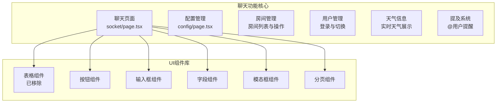
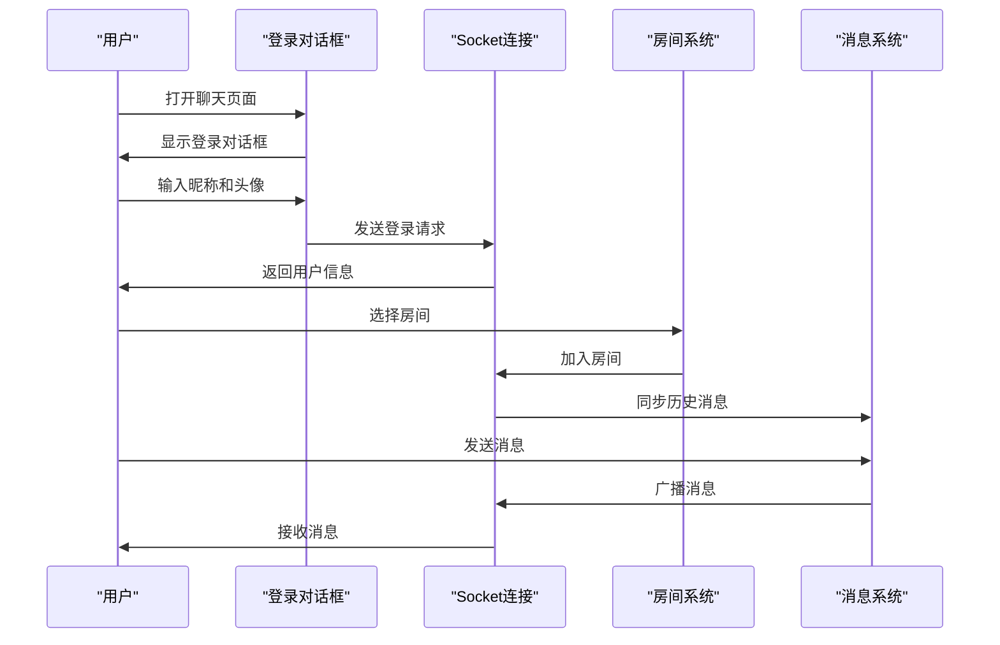

# 表格页面

<cite>
**本文引用的文件**
- [src/components/ui/table.tsx](file://apps/web/src/components/ui/table.tsx)
- [src/app/(admin)/(others-pages)/(scene)/config/page.tsx](file://apps/web/src/app/(admin)/(others-pages)/(scene)/config/page.tsx)
- [src/app/(admin)/(others-pages)/(scene)/socket/page.tsx](file://apps/web/src/app/(admin)/(others-pages)/(scene)/socket/page.tsx)
- [src/components/chat/ChatBubble.tsx](file://apps/web/src/components/chat/ChatBubble.tsx)
- [src/components/chat/ChatInput.tsx](file://apps/web/src/components/chat/ChatInput.tsx)
- [src/hooks/use-group-chat.ts](file://apps/web/src/hooks/use-group-chat.ts)
- [src/components/ui/pagination.tsx](file://apps/web/src/components/ui/pagination.tsx)
</cite>

## 更新摘要
**所做更改**
- 代码库架构重大调整：移除了所有表格页面相关组件和路由
- 项目完全转向核心聊天功能，包括实时聊天、用户管理、房间系统
- UI组件库保留但不再包含表格组件
- 新增完整的聊天功能模块，包括消息气泡、输入框、提及系统
- 聊天功能成为唯一的核心业务功能

## 目录
1. [简介](#简介)
2. [项目现状](#项目现状)
3. [核心功能架构](#核心功能架构)
4. [聊天功能详解](#聊天功能详解)
5. [UI组件库现状](#ui组件库现状)
6. [开发模板与最佳实践](#开发模板与最佳实践)
7. [迁移指南](#迁移指南)

## 简介
本文件原本面向需要在后台管理系统中构建"表格页面"的开发者，但随着代码库的重大架构调整，项目已完全移除表格功能，专注于提供完整的实时聊天解决方案。本文档现更新为展示当前项目的聊天功能架构和UI组件现状。

**重要说明**：原表格页面、基础表格组件、高级表格示例等均已移除，项目结构发生根本性变化。

## 项目现状
经过重大架构调整，项目已完全简化为专注于核心聊天功能：



**图表来源**
- [src/app/(admin)/(others-pages)/(scene)/socket/page.tsx:107-358](file://apps/web/src/app/(admin)/(others-pages)/(scene)/socket/page.tsx#L107-L358)
- [src/app/(admin)/(others-pages)/(scene)/config/page.tsx:69-472](file://apps/web/src/app/(admin)/(others-pages)/(scene)/config/page.tsx#L69-L472)

## 核心功能架构
项目现已完全围绕实时聊天功能构建，包含以下核心模块：

### 聊天页面架构
- **房间管理系统**：支持创建、加入、切换房间
- **消息传输系统**：基于WebSocket的实时消息传递
- **用户认证系统**：本地存储用户信息，支持用户切换
- **提及系统**：@用户提醒功能，支持消息标记
- **天气集成**：实时天气信息展示

### 配置管理功能
- **应用配置管理**：支持配置的增删改查
- **分页展示**：10条记录每页的分页展示
- **搜索功能**：支持按名称、版本、应用ID搜索
- **对话框操作**：新增应用、删除确认等交互

**章节来源**
- [src/app/(admin)/(others-pages)/(scene)/socket/page.tsx:107-358](file://apps/web/src/app/(admin)/(others-pages)/(scene)/socket/page.tsx#L107-L358)
- [src/app/(admin)/(others-pages)/(scene)/config/page.tsx:69-472](file://apps/web/src/app/(admin)/(others-pages)/(scene)/config/page.tsx#L69-L472)

## 聊天功能详解

### 实时聊天系统
聊天功能基于Socket.IO实现实时通信，包含以下核心特性：



**图表来源**
- [src/hooks/use-group-chat.ts:38-270](file://apps/web/src/hooks/use-group-chat.ts#L38-L270)

### 消息气泡组件
消息气泡组件支持不同类型的消息展示：

- **用户消息**：区分当前用户和他人的消息样式
- **系统消息**：欢迎、离开等系统提示
- **提及高亮**：@用户名自动高亮显示
- **时间格式化**：本地化时间显示

### 聊天输入组件
输入组件提供丰富的交互功能：

- **自动调整高度**：根据内容自动调整textarea高度
- **@提及系统**：智能@用户提示和选择
- **快捷键支持**：Enter发送，Shift+Enter换行
- **在线人数显示**：实时显示房间在线人数

**章节来源**
- [src/components/chat/ChatBubble.tsx:116-131](file://apps/web/src/components/chat/ChatBubble.tsx#L116-L131)
- [src/components/chat/ChatInput.tsx:23-189](file://apps/web/src/components/chat/ChatInput.tsx#L23-L189)

## UI组件库现状
UI组件库已简化但仍保持完整性，移除了表格相关组件：

### 已移除组件
- **表格组件**：Table、TableHeader、TableBody等
- **分页组件**：Pagination组件库中的表格专用分页

### 保留组件
- **基础组件**：Button、Input、Field、Label等
- **布局组件**：Modal、Dialog等
- **状态组件**：Spinner、Badge等
- **通用组件**：Avatar、Separator等

### 组件使用现状
- 聊天页面仍使用统一的UI组件库
- 配置管理页面集成新的组件库
- 分页功能通过新的Pagination组件实现

**章节来源**
- [src/components/ui/table.tsx:1-117](file://apps/web/src/components/ui/table.tsx#L1-117)
- [src/components/ui/pagination.tsx:1-131](file://apps/web/src/components/ui/pagination.tsx#L1-L131)

## 开发模板与最佳实践

### 聊天功能开发模板
```typescript
// 聊天页面开发模板
import React from 'react';
import { useGroupChat } from '@/hooks/use-group-chat';

const ChatPage = () => {
  const {
    connected,
    myUser,
    room,
    messages,
    messageInput,
    login,
    joinRoom,
    sendMessage,
    messagesEndRef
  } = useGroupChat('');

  return (
    <div className="flex gap-4">
      {/* 房间列表 */}
      <div className="w-56">
        {/* 房间列表内容 */}
      </div>
      
      {/* 聊天区域 */}
      <div className="flex-1">
        {/* 消息区域 */}
        <div className="flex-1 overflow-y-auto">
          {messages.map((msg) => (
            <ChatBubble key={msg.id} msg={msg} myId={myUser?.id} />
          ))}
        </div>
        
        {/* 输入区域 */}
        <ChatInput
          value={messageInput}
          onChange={setMessageInput}
          onSend={sendMessage}
          onlineCount={onlineUsers.length}
          members={roomDbMembers}
          myNickname={myUser?.nickname}
        />
      </div>
    </div>
  );
};

export default ChatPage;
```

### 配置管理开发模板
```typescript
// 配置管理页面模板
import React, { useState, useEffect } from 'react';
import { Table, Button, Input, Field } from '@/components/ui';

const ConfigPage = () => {
  const [list, setList] = useState([]);
  const [loading, setLoading] = useState(false);
  const [page, setPage] = useState(1);

  const fetchList = async (params?: any) => {
    setLoading(true);
    try {
      const response = await fetch('/api/config/list', {
        method: 'POST',
        headers: { 'Content-Type': 'application/json' },
        body: JSON.stringify({ page, pageSize: 10, ...params })
      });
      const data = await response.json();
      setList(data.data);
    } finally {
      setLoading(false);
    }
  };

  return (
    <div>
      {/* 搜索表单 */}
      <form onSubmit={handleSearch}>
        <Field>
          <Input placeholder="搜索..." />
        </Field>
      </form>
      
      {/* 表格展示 */}
      <Table>
        <TableHeader>
          <TableRow>
            <TableHead>名称</TableHead>
            <TableHead>版本</TableHead>
            <TableHead>操作</TableHead>
          </TableRow>
        </TableHeader>
        <TableBody>
          {list.map((item) => (
            <TableRow key={item.id}>
              <TableCell>{item.name}</TableCell>
              <TableCell>{item.version}</TableCell>
              <TableCell>
                <Button size="sm">编辑</Button>
              </TableCell>
            </TableRow>
          ))}
        </TableBody>
      </Table>
      
      {/* 分页 */}
      <Pagination>
        <PaginationContent>
          <PaginationItem>
            <PaginationPrevious onClick={() => setPage(p => p - 1)} />
          </PaginationItem>
          <PaginationItem>
            <PaginationLink isActive>{page}</PaginationLink>
          </PaginationItem>
          <PaginationItem>
            <PaginationNext onClick={() => setPage(p => p + 1)} />
          </PaginationItem>
        </PaginationContent>
      </Pagination>
    </div>
  );
};

export default ConfigPage;
```

## 迁移指南

### 从表格页面迁移到聊天功能
如果您的项目原本使用表格页面功能，可参考以下迁移路径：

#### 1. 移除表格相关代码
- 删除所有表格页面组件
- 移除表格相关的路由配置
- 清理表格样式和主题配置

#### 2. 集成聊天功能
```typescript
// 导入聊天Hook
import { useGroupChat } from '@/hooks/use-group-chat';

// 在组件中使用
const {
  connected,
  myUser,
  messages,
  messageInput,
  login,
  sendMessage,
  joinRoom
} = useGroupChat('default-room');
```

#### 3. 替换UI组件
- 将表格组件替换为聊天组件
- 使用新的聊天输入组件替代表单输入
- 采用聊天消息气泡替代表格行展示

#### 4. 更新样式系统
- 聊天功能使用新的样式规范
- 移除表格相关的CSS样式
- 采用聊天功能的主题配色

### 新功能开发建议
- **聊天功能扩展**：可添加表情包、文件传输等功能
- **房间管理增强**：支持私密房间、权限控制
- **消息历史**：实现消息历史查询和搜索
- **用户管理**：添加用户黑名单、静音功能

**章节来源**
- [src/hooks/use-group-chat.ts:38-270](file://apps/web/src/hooks/use-group-chat.ts#L38-L270)
- [src/components/chat/ChatBubble.tsx:116-131](file://apps/web/src/components/chat/ChatBubble.tsx#L116-L131)
- [src/components/chat/ChatInput.tsx:23-189](file://apps/web/src/components/chat/ChatInput.tsx#L23-L189)

## 结论
项目已完成从表格页面到聊天功能的根本性转变。虽然移除了原有的表格功能，但新的聊天系统提供了更丰富和实用的功能集。UI组件库虽简化了组件种类，但仍保持了良好的开发体验和一致性。

对于需要表格功能的项目，建议参考现有的聊天功能架构，将其作为组件化开发的参考模板，或者考虑使用专门的表格组件库来实现类似的功能。

**重要提醒**：由于架构重大调整，原有的表格页面文档已不再适用，建议基于新的聊天功能重新评估和规划开发需求。