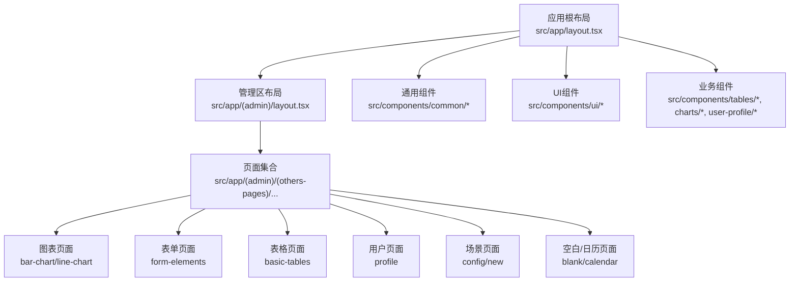
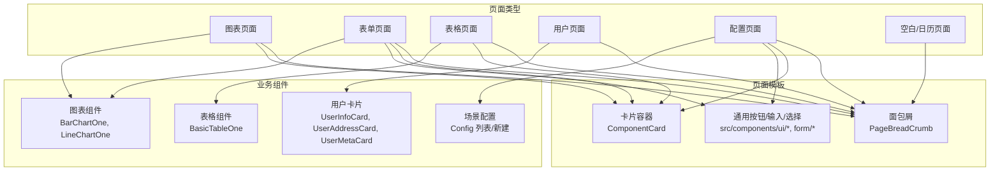
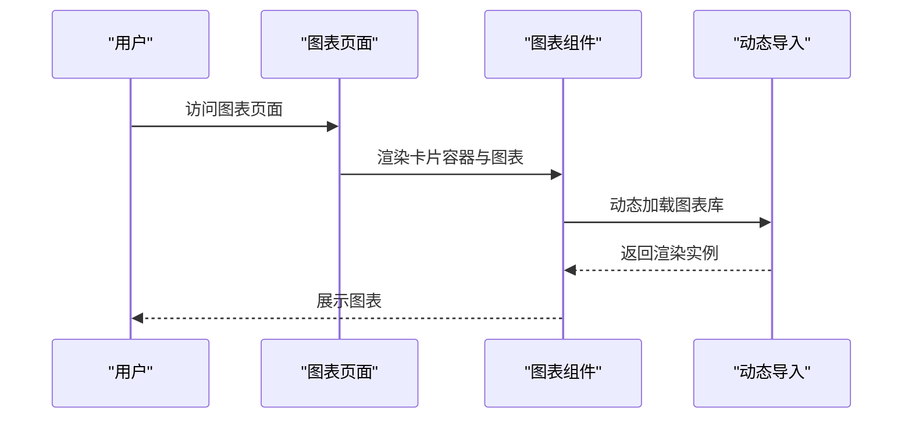
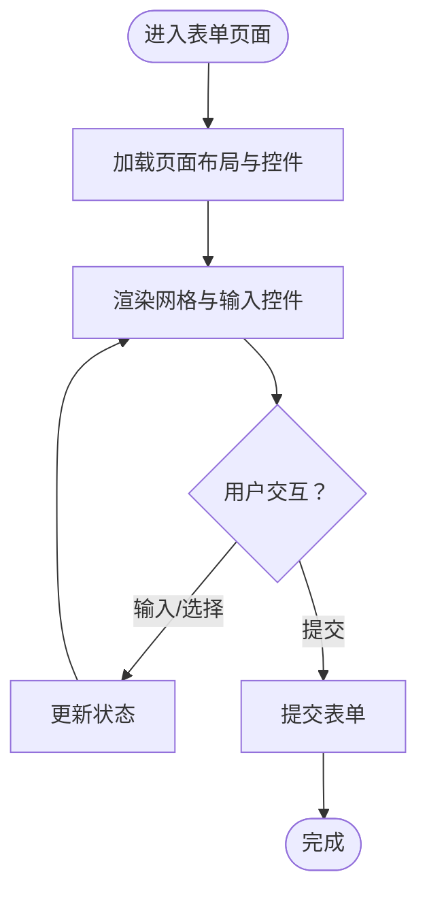
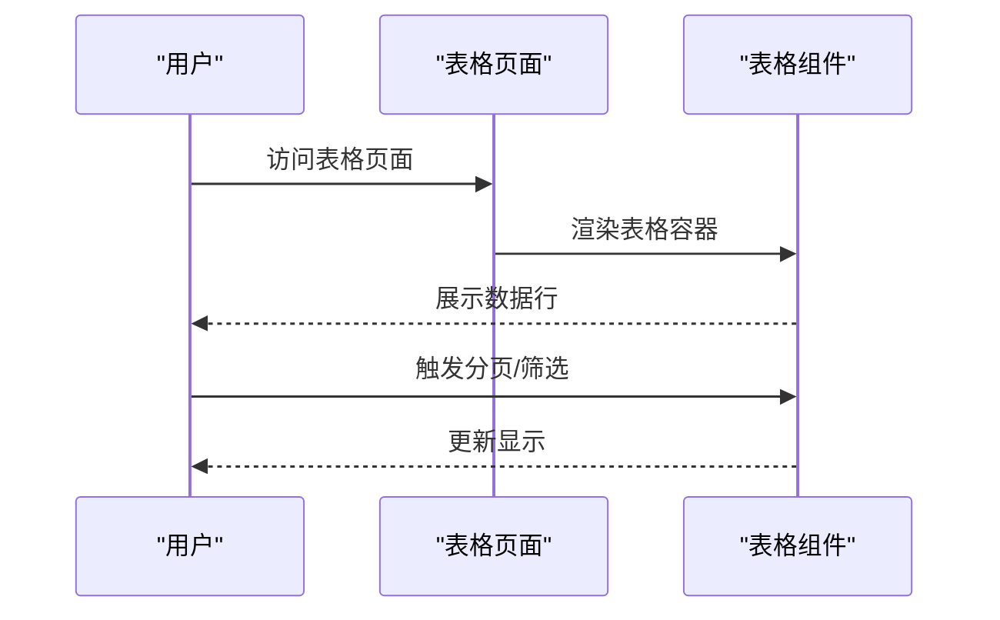
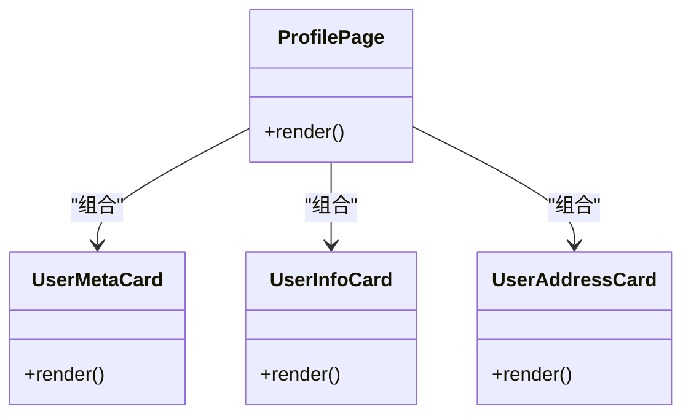
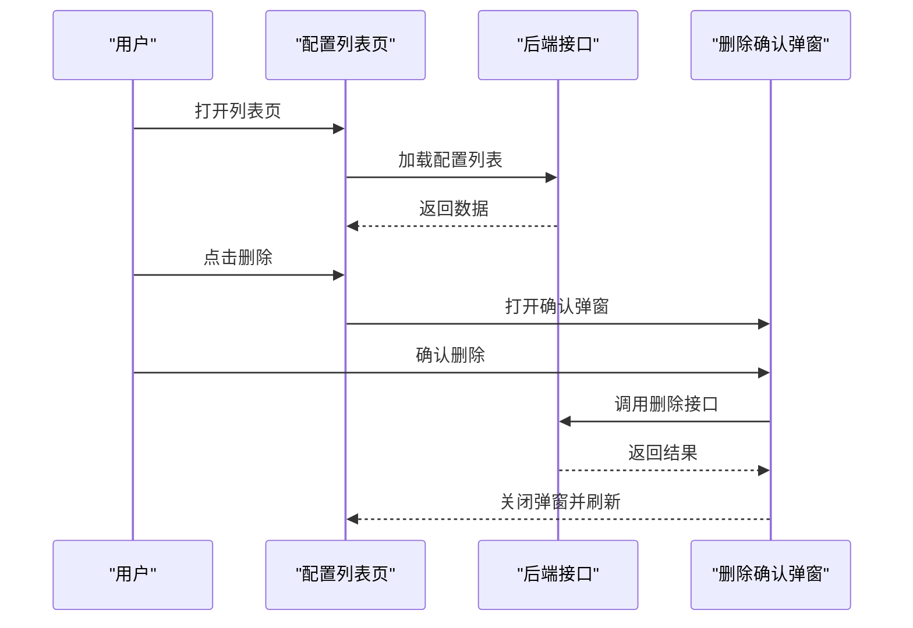
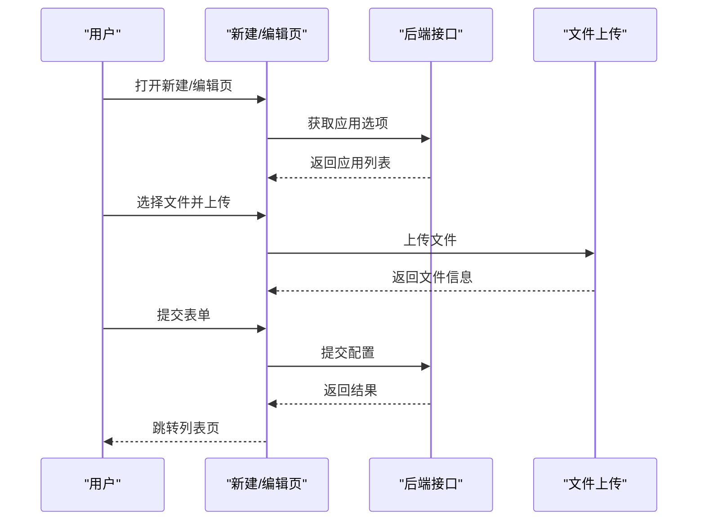
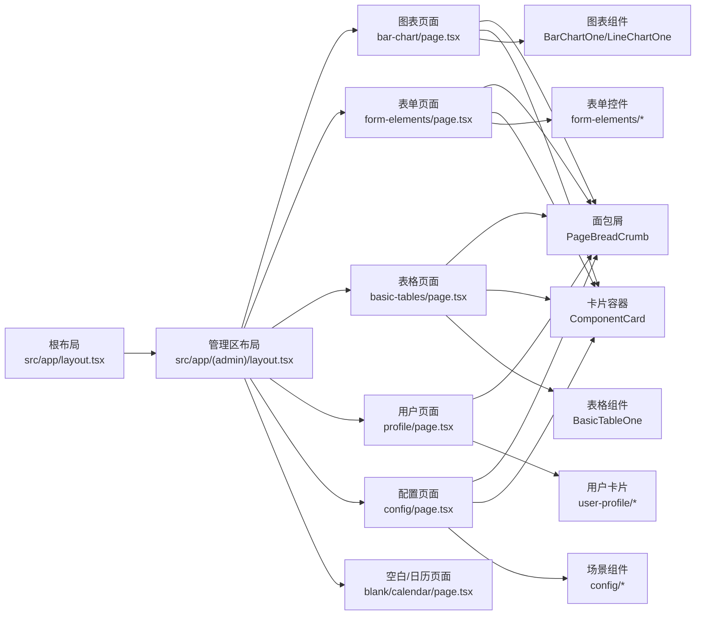

# 页面类型组织结构

<cite>
**本文档引用的文件**
- [src/app/(admin)/layout.tsx](file://src/app/(admin)/layout.tsx)
- [src/app/layout.tsx](file://src/app/layout.tsx)
- [src/components/common/PageBreadCrumb.tsx](file://src/components/common/PageBreadCrumb.tsx)
- [src/components/common/ComponentCard.tsx](file://src/components/common/ComponentCard.tsx)
- [src/components/charts/bar/BarChartOne.tsx](file://src/components/charts/bar/BarChartOne.tsx)
- [src/components/charts/line/LineChartOne.tsx](file://src/components/charts/line/LineChartOne.tsx)
- [src/components/tables/BasicTableOne.tsx](file://src/components/tables/BasicTableOne.tsx)
- [src/components/user-profile/UserInfoCard.tsx](file://src/components/user-profile/UserInfoCard.tsx)
- [src/components/user-profile/UserAddressCard.tsx](file://src/components/user-profile/UserAddressCard.tsx)
- [src/components/user-profile/UserMetaCard.tsx](file://src/components/user-profile/UserMetaCard.tsx)
- [src/app/(admin)/(others-pages)/(chart)/bar-chart/page.tsx](file://src/app/(admin)/(others-pages)/(chart)/bar-chart/page.tsx)
- [src/app/(admin)/(others-pages)/(chart)/line-chart/page.tsx](file://src/app/(admin)/(others-pages)/(chart)/line-chart/page.tsx)
- [src/app/(admin)/(others-pages)/(forms)/form-elements/page.tsx](file://src/app/(admin)/(others-pages)/(forms)/form-elements/page.tsx)
- [src/app/(admin)/(others-pages)/(tables)/basic-tables/page.tsx](file://src/app/(admin)/(others-pages)/(tables)/basic-tables/page.tsx)
- [src/app/(admin)/(others-pages)/profile/page.tsx](file://src/app/(admin)/(others-pages)/profile/page.tsx)
- [src/app/(admin)/(others-pages)/blank/page.tsx](file://src/app/(admin)/(others-pages)/blank/page.tsx)
- [src/app/(admin)/(others-pages)/calendar/page.tsx](file://src/app/(admin)/(others-pages)/calendar/page.tsx)
- [src/app/(admin)/(others-pages)/(scene)/config/page.tsx](file://src/app/(admin)/(others-pages)/(scene)/config/page.tsx)
- [src/app/(admin)/(others-pages)/(scene)/config/new/page.tsx](file://src/app/(admin)/(others-pages)/(scene)/config/new/page.tsx)
</cite>

## 目录
1. [引言](#引言)
2. [项目结构](#项目结构)
3. [核心组件](#核心组件)
4. [架构总览](#架构总览)
5. [详细组件分析](#详细组件分析)
6. [依赖关系分析](#依赖关系分析)
7. [性能考虑](#性能考虑)
8. [故障排除指南](#故障排除指南)
9. [结论](#结论)
10. [附录](#附录)

## 引言
本文件系统性梳理管理面板中的页面类型组织结构与开发范式，覆盖图表页面、表单页面、表格页面、用户页面、配置页面等常见类型。文档从页面模板设计、通用布局模式、数据展示策略出发，给出页面开发模板、命名规范与文件组织建议，帮助新功能开发者快速复用现有模式，稳定高效地扩展页面。

## 项目结构
管理面板采用分层清晰的目录组织方式：
- 应用根布局负责主题、侧边栏上下文与全局配置注入
- 管理区布局负责头部、侧边栏、遮罩与主内容区域的统一样式与交互
- 页面按功能域分组在“其他页面”目录下，如图表、表单、表格、场景（业务场景）等
- 通用组件与业务组件分离，便于复用与维护

图示来源
- [src/app/layout.tsx:16-32](file://src/app/layout.tsx#L16-L32)
- [src/app/(admin)/layout.tsx:9-44](file://src/app/(admin)/layout.tsx#L9-L44)

章节来源
- [src/app/layout.tsx:16-32](file://src/app/layout.tsx#L16-L32)
- [src/app/(admin)/layout.tsx:9-44](file://src/app/(admin)/layout.tsx#L9-L44)

## 核心组件
- 布局与导航
  - 管理区布局：统一处理侧边栏展开/折叠/移动端打开状态，动态计算主内容区域边距，包裹头部与页面内容
  - 根布局：提供主题上下文、侧边栏上下文、布局配置处理器与全局通知组件
- 通用页面元素
  - 面包屑：提供页面标题与返回路径
  - 卡片容器：为每个页面模块提供统一的卡片式容器，支持标题与描述
- 业务组件
  - 图表组件：条形图、折线图等，使用动态导入避免 SSR 渲染问题
  - 表格组件：基础表格与分页组件
  - 用户信息组件：用户元信息、地址信息、基本信息卡片

章节来源
- [src/app/(admin)/layout.tsx:9-44](file://src/app/(admin)/layout.tsx#L9-L44)
- [src/app/layout.tsx:16-32](file://src/app/layout.tsx#L16-L32)
- [src/components/common/PageBreadCrumb.tsx:8-50](file://src/components/common/PageBreadCrumb.tsx#L8-L50)
- [src/components/common/ComponentCard.tsx:10-37](file://src/components/common/ComponentCard.tsx#L10-L37)
- [src/components/charts/bar/BarChartOne.tsx:12-110](file://src/components/charts/bar/BarChartOne.tsx#L12-L110)
- [src/components/charts/line/LineChartOne.tsx:12-133](file://src/components/charts/line/LineChartOne.tsx#L12-L133)
- [src/components/tables/BasicTableOne.tsx](file://src/components/tables/BasicTableOne.tsx)
- [src/components/user-profile/UserInfoCard.tsx](file://src/components/user-profile/UserInfoCard.tsx)
- [src/components/user-profile/UserAddressCard.tsx](file://src/components/user-profile/UserAddressCard.tsx)
- [src/components/user-profile/UserMetaCard.tsx](file://src/components/user-profile/UserMetaCard.tsx)

## 架构总览
页面类型在目录与组件层面形成清晰的“类型-模板-实现”三层结构：
- 类型：按功能域划分的目录（图表、表单、表格、用户、场景）
- 模板：页面级通用结构（面包屑、卡片容器、按钮、表单/表格/图表等）
- 实现：具体业务组件与交互逻辑

图示来源
- [src/components/common/PageBreadCrumb.tsx:8-50](file://src/components/common/PageBreadCrumb.tsx#L8-L50)
- [src/components/common/ComponentCard.tsx:10-37](file://src/components/common/ComponentCard.tsx#L10-L37)
- [src/components/charts/bar/BarChartOne.tsx:12-110](file://src/components/charts/bar/BarChartOne.tsx#L12-L110)
- [src/components/charts/line/LineChartOne.tsx:12-133](file://src/components/charts/line/LineChartOne.tsx#L12-L133)
- [src/components/tables/BasicTableOne.tsx](file://src/components/tables/BasicTableOne.tsx)
- [src/components/user-profile/UserInfoCard.tsx](file://src/components/user-profile/UserInfoCard.tsx)
- [src/components/user-profile/UserAddressCard.tsx](file://src/components/user-profile/UserAddressCard.tsx)
- [src/components/user-profile/UserMetaCard.tsx](file://src/components/user-profile/UserMetaCard.tsx)

## 详细组件分析

### 图表页面
- 典型特征
  - 使用面包屑标识页面标题
  - 使用卡片容器承载单一图表组件
  - 图表组件通过动态导入避免 SSR 渲染问题
- 适用场景
  - KPI 展示、趋势分析、对比分析等可视化需求
- 组件组合模式
  - 页面级：面包屑 → 卡片容器 → 图表组件
  - 图表组件：配置选项、系列数据、响应式容器
- 数据展示策略
  - 内置静态示例数据，便于演示；生产环境可替换为异步数据源
- 开发模板要点
  - 页面文件仅负责布局与容器，不包含业务数据
  - 图表组件内部封装配置与渲染逻辑
- 文件组织建议
  - 页面：src/app/(admin)/(others-pages)/(chart)/[图表名]/page.tsx
  - 组件：src/components/charts/[type]/[ChartName].tsx

图示来源
- [src/app/(admin)/(others-pages)/(chart)/bar-chart/page.tsx:13-24](file://src/app/(admin)/(others-pages)/(chart)/bar-chart/page.tsx#L13-L24)
- [src/app/(admin)/(others-pages)/(chart)/line-chart/page.tsx:12-23](file://src/app/(admin)/(others-pages)/(chart)/line-chart/page.tsx#L12-L23)
- [src/components/charts/bar/BarChartOne.tsx:6-110](file://src/components/charts/bar/BarChartOne.tsx#L6-L110)
- [src/components/charts/line/LineChartOne.tsx:6-133](file://src/components/charts/line/LineChartOne.tsx#L6-L133)

章节来源
- [src/app/(admin)/(others-pages)/(chart)/bar-chart/page.tsx:13-24](file://src/app/(admin)/(others-pages)/(chart)/bar-chart/page.tsx#L13-L24)
- [src/app/(admin)/(others-pages)/(chart)/line-chart/page.tsx:12-23](file://src/app/(admin)/(others-pages)/(chart)/line-chart/page.tsx#L12-L23)
- [src/components/charts/bar/BarChartOne.tsx:6-110](file://src/components/charts/bar/BarChartOne.tsx#L6-L110)
- [src/components/charts/line/LineChartOne.tsx:6-133](file://src/components/charts/line/LineChartOne.tsx#L6-L133)

### 表单页面
- 典型特征
  - 使用网格布局展示多种输入控件
  - 面包屑标识页面标题
  - 每个输入控件独立封装，便于复用
- 适用场景
  - 配置项录入、用户资料编辑、批量设置等
- 组件组合模式
  - 页面级：面包屑 → 多列网格 → 各类输入组件
  - 输入组件：标签、输入框、选择器、开关、文件上传等
- 数据展示策略
  - 以受控组件形式管理状态，支持校验与提示
- 开发模板要点
  - 页面文件负责布局与分组，具体控件职责单一
  - 提供默认值与禁用态控制
- 文件组织建议
  - 页面：src/app/(admin)/(others-pages)/(forms)/form-elements/page.tsx
  - 控件：src/components/form/form-elements/*.tsx

图示来源
- [src/app/(admin)/(others-pages)/(forms)/form-elements/page.tsx:21-43](file://src/app/(admin)/(others-pages)/(forms)/form-elements/page.tsx#L21-L43)

章节来源
- [src/app/(admin)/(others-pages)/(forms)/form-elements/page.tsx:21-43](file://src/app/(admin)/(others-pages)/(forms)/form-elements/page.tsx#L21-L43)

### 表格页面
- 典型特征
  - 使用卡片容器承载表格组件
  - 面包屑标识页面标题
  - 支持排序、筛选、分页等高级能力（视具体实现而定）
- 适用场景
  - 列表展示、数据检索、批量操作等
- 组件组合模式
  - 页面级：面包屑 → 卡片容器 → 表格组件
  - 表格组件：表头、表体、行、单元格
- 数据展示策略
  - 分页加载、空态占位、加载态优化
- 开发模板要点
  - 表格组件应与页面解耦，便于复用
  - 提供统一的分页与操作按钮
- 文件组织建议
  - 页面：src/app/(admin)/(others-pages)/(tables)/basic-tables/page.tsx
  - 组件：src/components/tables/BasicTableOne.tsx

图示来源
- [src/app/(admin)/(others-pages)/(tables)/basic-tables/page.tsx:14-25](file://src/app/(admin)/(others-pages)/(tables)/basic-tables/page.tsx#L14-L25)
- [src/components/tables/BasicTableOne.tsx](file://src/components/tables/BasicTableOne.tsx)

章节来源
- [src/app/(admin)/(others-pages)/(tables)/basic-tables/page.tsx:14-25](file://src/app/(admin)/(others-pages)/(tables)/basic-tables/page.tsx#L14-L25)

### 用户页面
- 典型特征
  - 使用卡片容器分块展示用户信息
  - 面包屑标识页面标题
  - 信息卡片化，便于阅读与维护
- 适用场景
  - 用户资料查看、编辑、设置等
- 组件组合模式
  - 页面级：面包屑 → 用户信息卡片 → 用户资料卡片 → 地址卡片
  - 卡片组件：元信息、基本信息、地址信息等
- 数据展示策略
  - 结构化展示，支持只读/编辑切换
- 开发模板要点
  - 卡片组件职责单一，便于组合与复用
- 文件组织建议
  - 页面：src/app/(admin)/(others-pages)/profile/page.tsx
  - 卡片：src/components/user-profile/*.tsx

图示来源
- [src/app/(admin)/(others-pages)/profile/page.tsx:13-28](file://src/app/(admin)/(others-pages)/profile/page.tsx#L13-L28)
- [src/components/user-profile/UserMetaCard.tsx](file://src/components/user-profile/UserMetaCard.tsx)
- [src/components/user-profile/UserInfoCard.tsx](file://src/components/user-profile/UserInfoCard.tsx)
- [src/components/user-profile/UserAddressCard.tsx](file://src/components/user-profile/UserAddressCard.tsx)

章节来源
- [src/app/(admin)/(others-pages)/profile/page.tsx:13-28](file://src/app/(admin)/(others-pages)/profile/page.tsx#L13-L28)

### 配置页面（场景页面）
- 典型特征
  - 列表页：搜索表单、表格、分页、操作按钮（编辑/详情/删除）
  - 新建/编辑页：表单、文件上传、下载、提交/取消
  - 使用面包屑与卡片容器
- 适用场景
  - 配置项管理、应用关联、文件上传与下载、权限控制等
- 组件组合模式
  - 列表页：面包屑 → 搜索表单 → 表格 → 分页 → 删除确认弹窗
  - 新建页：面包屑 → 表单 → 文件上传/下载 → 提交/取消
- 数据展示策略
  - 列表分页加载、搜索条件持久化、错误提示与加载态
  - 表单受控状态、文件上传进度与结果反馈
- 开发模板要点
  - 页面与 API 解耦，集中处理状态与副作用
  - 使用模态框进行确认与交互
- 文件组织建议
  - 列表页：src/app/(admin)/(others-pages)/(scene)/config/page.tsx
  - 新建页：src/app/(admin)/(others-pages)/(scene)/config/new/page.tsx

图示来源
- [src/app/(admin)/(others-pages)/(scene)/config/page.tsx:48-370](file://src/app/(admin)/(others-pages)/(scene)/config/page.tsx#L48-L370)

图示来源
- [src/app/(admin)/(others-pages)/(scene)/config/new/page.tsx:14-293](file://src/app/(admin)/(others-pages)/(scene)/config/new/page.tsx#L14-L293)

章节来源
- [src/app/(admin)/(others-pages)/(scene)/config/page.tsx:48-370](file://src/app/(admin)/(others-pages)/(scene)/config/page.tsx#L48-L370)
- [src/app/(admin)/(others-pages)/(scene)/config/new/page.tsx:14-293](file://src/app/(admin)/(others-pages)/(scene)/config/new/page.tsx#L14-L293)

### 空白/日历页面
- 典型特征
  - 空白页：提供占位文案与容器，便于快速搭建新页面骨架
  - 日历页：集成日历组件，展示日期选择与事件
- 适用场景
  - 快速原型、临时页面、日程管理
- 组件组合模式
  - 页面级：面包屑 → 容器 → 组件
- 开发模板要点
  - 空白页作为页面开发模板，复制粘贴即可
  - 日历页可扩展为日程管理页面

章节来源
- [src/app/(admin)/(others-pages)/blank/page.tsx:10-27](file://src/app/(admin)/(others-pages)/blank/page.tsx#L10-L27)
- [src/app/(admin)/(others-pages)/calendar/page.tsx:12-19](file://src/app/(admin)/(others-pages)/calendar/page.tsx#L12-L19)

## 依赖关系分析
- 页面到组件的依赖
  - 页面文件仅依赖通用组件与业务组件，不直接依赖第三方库
  - 通用组件（面包屑、卡片）被多页面复用
  - 业务组件（图表、表格、用户卡片）按页面职责组合
- 上下文与布局
  - 根布局提供主题与侧边栏上下文，管理区布局消费上下文状态
  - 页面通过管理区布局获得统一的头部、侧边栏与内容区域

图示来源
- [src/app/layout.tsx:16-32](file://src/app/layout.tsx#L16-L32)
- [src/app/(admin)/layout.tsx:9-44](file://src/app/(admin)/layout.tsx#L9-L44)
- [src/app/(admin)/(others-pages)/(chart)/bar-chart/page.tsx:13-24](file://src/app/(admin)/(others-pages)/(chart)/bar-chart/page.tsx#L13-L24)
- [src/app/(admin)/(others-pages)/(forms)/form-elements/page.tsx:21-43](file://src/app/(admin)/(others-pages)/(forms)/form-elements/page.tsx#L21-L43)
- [src/app/(admin)/(others-pages)/(tables)/basic-tables/page.tsx:14-25](file://src/app/(admin)/(others-pages)/(tables)/basic-tables/page.tsx#L14-L25)
- [src/app/(admin)/(others-pages)/profile/page.tsx:13-28](file://src/app/(admin)/(others-pages)/profile/page.tsx#L13-L28)
- [src/app/(admin)/(others-pages)/(scene)/config/page.tsx:48-370](file://src/app/(admin)/(others-pages)/(scene)/config/page.tsx#L48-L370)
- [src/app/(admin)/(others-pages)/blank/page.tsx:10-27](file://src/app/(admin)/(others-pages)/blank/page.tsx#L10-L27)
- [src/app/(admin)/(others-pages)/calendar/page.tsx:12-19](file://src/app/(admin)/(others-pages)/calendar/page.tsx#L12-L19)

章节来源
- [src/app/layout.tsx:16-32](file://src/app/layout.tsx#L16-L32)
- [src/app/(admin)/layout.tsx:9-44](file://src/app/(admin)/layout.tsx#L9-L44)

## 性能考虑
- 图表组件动态导入
  - 通过动态导入避免 SSR 渲染，减少首屏体积与初次渲染时间
- 列表分页与懒加载
  - 列表页采用分页加载，降低一次性渲染压力
- 主内容区域自适应
  - 管理区布局根据侧边栏状态动态调整主内容边距，提升视觉一致性与交互流畅度
- 通用组件复用
  - 面包屑与卡片容器等通用组件减少重复实现，提高开发效率与运行时性能

章节来源
- [src/components/charts/bar/BarChartOne.tsx:6-110](file://src/components/charts/bar/BarChartOne.tsx#L6-L110)
- [src/components/charts/line/LineChartOne.tsx:6-133](file://src/components/charts/line/LineChartOne.tsx#L6-L133)
- [src/app/(admin)/layout.tsx:17-23](file://src/app/(admin)/layout.tsx#L17-L23)
- [src/app/(admin)/(others-pages)/(scene)/config/page.tsx:134-151](file://src/app/(admin)/(others-pages)/(scene)/config/page.tsx#L134-L151)

## 故障排除指南
- 图表不显示或报错
  - 确认图表组件已使用动态导入并在客户端执行
  - 检查图表容器最小宽度与溢出处理
- 列表页无数据或加载异常
  - 检查接口返回格式与 errno 字段
  - 确认分页参数与搜索条件传递正确
- 表单提交失败
  - 校验必填字段与格式
  - 查看错误提示与网络请求状态码
- 文件上传/下载异常
  - 确认文件选择与上传流程
  - 下载时检查后端返回的 MIME 与 Base64 内容

章节来源
- [src/components/charts/bar/BarChartOne.tsx:6-110](file://src/components/charts/bar/BarChartOne.tsx#L6-L110)
- [src/app/(admin)/(others-pages)/(scene)/config/page.tsx:74-93](file://src/app/(admin)/(others-pages)/(scene)/config/page.tsx#L74-L93)
- [src/app/(admin)/(others-pages)/(scene)/config/new/page.tsx:147-189](file://src/app/(admin)/(others-pages)/(scene)/config/new/page.tsx#L147-L189)

## 结论
本项目通过“类型-模板-实现”的页面组织方式，实现了高内聚、低耦合的页面体系。通用布局与组件为各类页面提供了统一的开发范式，开发者可基于现有模板快速扩展新的页面类型，同时保持一致的用户体验与开发效率。

## 附录

### 页面开发模板与命名规范
- 页面模板
  - 面包屑：用于标识页面标题与返回路径
  - 卡片容器：用于承载业务组件，提供统一的标题与内容区域
  - 表单/表格/图表：按需引入对应组件
- 命名规范
  - 页面文件：page.tsx
  - 组件文件：[ComponentName].tsx
  - 目录命名：小写短横线分隔（如 basic-tables）
- 文件组织建议
  - 页面：src/app/(admin)/(others-pages)/[类型]/[子类型]/page.tsx
  - 通用组件：src/components/common/*
  - UI 组件：src/components/ui/*
  - 业务组件：src/components/[category]/*

章节来源
- [src/components/common/PageBreadCrumb.tsx:8-50](file://src/components/common/PageBreadCrumb.tsx#L8-L50)
- [src/components/common/ComponentCard.tsx:10-37](file://src/components/common/ComponentCard.tsx#L10-L37)
- [src/app/(admin)/(others-pages)/(tables)/basic-tables/page.tsx:14-25](file://src/app/(admin)/(others-pages)/(tables)/basic-tables/page.tsx#L14-L25)