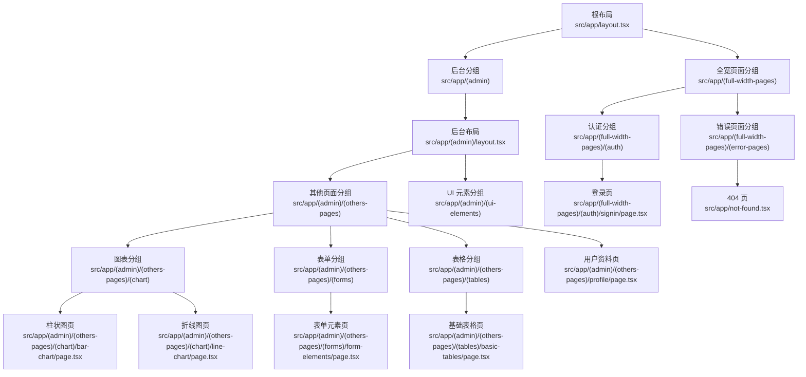
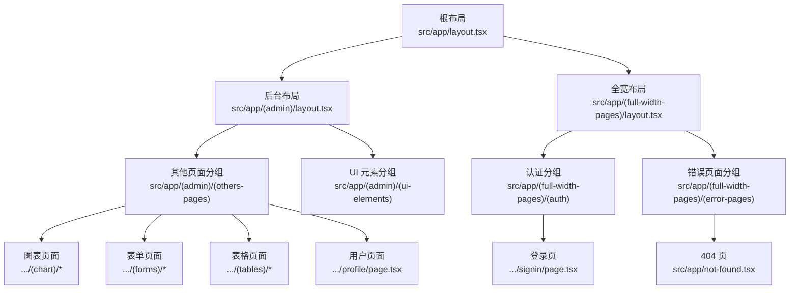
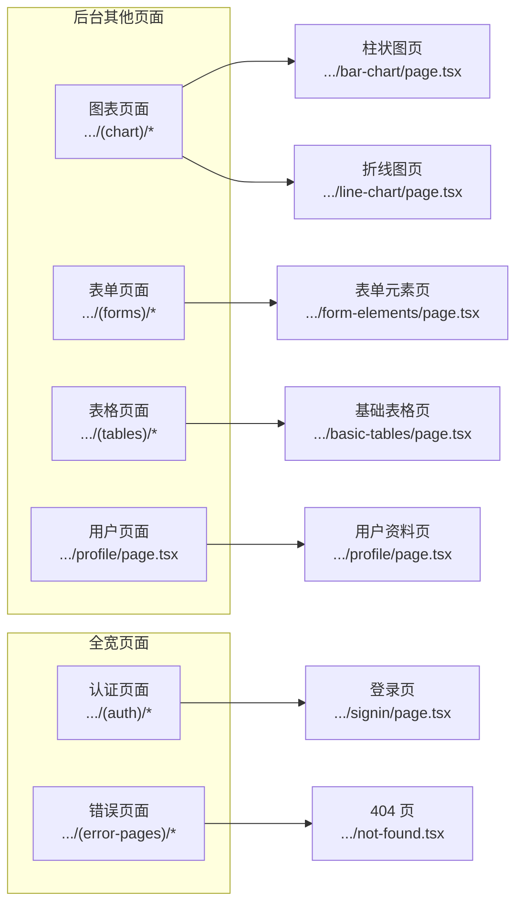
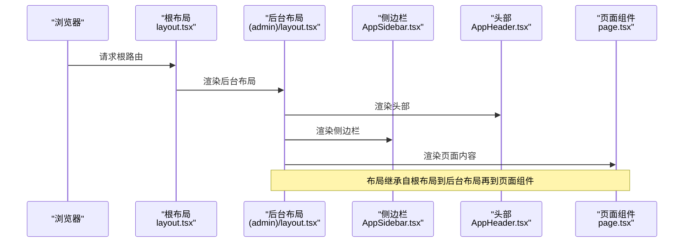
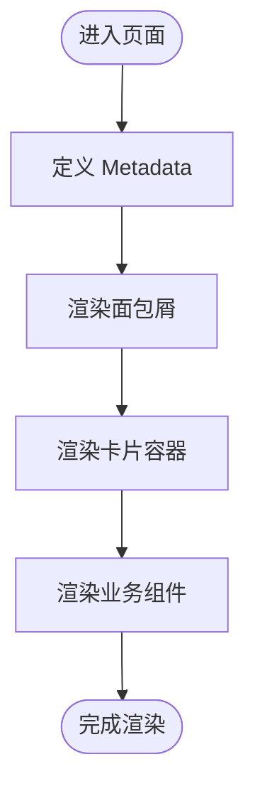
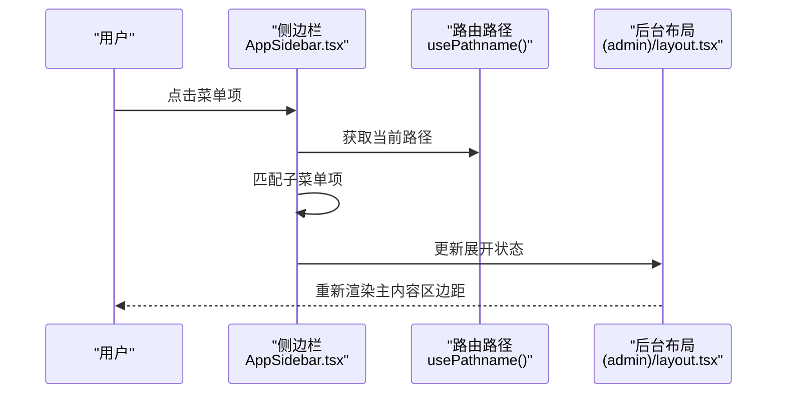
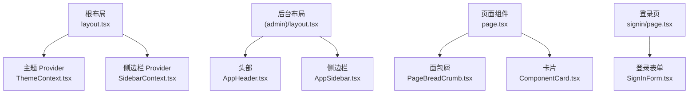

# 页面路由系统

<cite>
**本文引用的文件**
- [src/app/layout.tsx](file://src/app/layout.tsx)
- [src/app/(admin)/layout.tsx](file://src/app/(admin)/layout.tsx)
- [src/app/(full-width-pages)/layout.tsx](file://src/app/(full-width-pages)/layout.tsx)
- [src/app/not-found.tsx](file://src/app/not-found.tsx)
- [src/app/api/config/list/route.ts](file://src/app/api/config/list/route.ts)
- [src/app/(admin)/(others-pages)/(chart)/bar-chart/page.tsx](file://src/app/(admin)/(others-pages)/(chart)/bar-chart/page.tsx)
- [src/app/(admin)/(others-pages)/(forms)/form-elements/page.tsx](file://src/app/(admin)/(others-pages)/(forms)/form-elements/page.tsx)
- [src/app/(admin)/(others-pages)/(tables)/basic-tables/page.tsx](file://src/app/(admin)/(others-pages)/(tables)/basic-tables/page.tsx)
- [src/app/(admin)/(others-pages)/profile/page.tsx](file://src/app/(admin)/(others-pages)/profile/page.tsx)
- [src/app/(full-width-pages)/(auth)/signin/page.tsx](file://src/app/(full-width-pages)/(auth)/signin/page.tsx)
- [src/context/SidebarContext.tsx](file://src/context/SidebarContext.tsx)
- [src/context/ThemeContext.tsx](file://src/context/ThemeContext.tsx)
- [src/layout/AppHeader.tsx](file://src/layout/AppHeader.tsx)
- [src/layout/AppSidebar.tsx](file://src/layout/AppSidebar.tsx)
- [src/components/auth/SignInForm.tsx](file://src/components/auth/SignInForm.tsx)
</cite>

## 目录
1. [简介](#简介)
2. [项目结构](#项目结构)
3. [核心组件](#核心组件)
4. [架构总览](#架构总览)
5. [详细组件分析](#详细组件分析)
6. [依赖分析](#依赖分析)
7. [性能考虑](#性能考虑)
8. [故障排查指南](#故障排查指南)
9. [结论](#结论)
10. [附录](#附录)

## 简介
本文件系统性梳理基于 Next.js App Router 的页面路由体系，覆盖路由组织结构、嵌套布局、页面组件设计模式，并结合管理面板的页面分类（图表页面、表单页面、表格页面、用户页面）与路由层级关系进行深入解析。同时提供路由配置说明、页面权限控制思路、动态路由处理建议、路由守卫实现方案、页面开发指南、路由最佳实践以及 SEO 优化策略，帮助开发者快速扩展新页面或深入理解现有路由机制。

## 项目结构
该工程采用 Next.js App Router 的文件系统路由与分组路由相结合的方式，通过“路由段分组”实现清晰的页面分类与布局继承。顶层根布局负责全局主题、字体与 Provider 注入；管理后台与全宽页面分别由独立的布局包裹；各页面目录下以 page.tsx 作为页面入口，配合 Metadata 提供 SEO 元数据。

**图表来源**
- [src/app/layout.tsx:1-33](file://src/app/layout.tsx#L1-L33)
- [src/app/(admin)/layout.tsx:1-45](file://src/app/(admin)/layout.tsx#L1-L45)
- [src/app/(full-width-pages)/layout.tsx:1-8](file://src/app/(full-width-pages)/layout.tsx#L1-L8)
- [src/app/(admin)/(others-pages)/(chart)/bar-chart/page.tsx:1-25](file://src/app/(admin)/(others-pages)/(chart)/bar-chart/page.tsx#L1-L25)
- [src/app/(admin)/(others-pages)/(forms)/form-elements/page.tsx:1-44](file://src/app/(admin)/(others-pages)/(forms)/form-elements/page.tsx#L1-L44)
- [src/app/(admin)/(others-pages)/(tables)/basic-tables/page.tsx:1-26](file://src/app/(admin)/(others-pages)/(tables)/basic-tables/page.tsx#L1-L26)
- [src/app/(admin)/(others-pages)/profile/page.tsx:1-29](file://src/app/(admin)/(others-pages)/profile/page.tsx#L1-L29)
- [src/app/(full-width-pages)/(auth)/signin/page.tsx:1-12](file://src/app/(full-width-pages)/(auth)/signin/page.tsx#L1-L12)
- [src/app/not-found.tsx:1-50](file://src/app/not-found.tsx#L1-L50)

**章节来源**
- [src/app/layout.tsx:1-33](file://src/app/layout.tsx#L1-L33)
- [src/app/(admin)/layout.tsx:1-45](file://src/app/(admin)/layout.tsx#L1-L45)
- [src/app/(full-width-pages)/layout.tsx:1-8](file://src/app/(full-width-pages)/layout.tsx#L1-L8)
- [src/app/not-found.tsx:1-50](file://src/app/not-found.tsx#L1-L50)

## 核心组件
- 根布局：负责全局样式、字体、主题 Provider、侧边栏 Provider、全局提示等。
- 后台布局：注入头部、侧边栏、内容区域，根据侧边栏状态动态计算主内容区边距。
- 分组布局：全宽页面分组用于无需后台框架的页面（如登录页）。
- 页面组件：每个页面目录下的 page.tsx 作为入口，统一设置 Metadata 以提升 SEO。
- 上下文：SidebarContext 与 ThemeContext 提供侧边栏状态与主题切换能力。
- 导航：AppSidebar 基于路由路径高亮当前菜单项，支持主菜单与“其他”菜单的子菜单展开。

**章节来源**
- [src/app/layout.tsx:16-32](file://src/app/layout.tsx#L16-L32)
- [src/app/(admin)/layout.tsx:9-44](file://src/app/(admin)/layout.tsx#L9-L44)
- [src/app/(full-width-pages)/layout.tsx:1-8](file://src/app/(full-width-pages)/layout.tsx#L1-L8)
- [src/context/SidebarContext.tsx:17-25](file://src/context/SidebarContext.tsx#L17-L25)
- [src/context/ThemeContext.tsx:13-18](file://src/context/ThemeContext.tsx#L13-L18)
- [src/layout/AppSidebar.tsx:104-376](file://src/layout/AppSidebar.tsx#L104-L376)

## 架构总览
Next.js App Router 通过“路由段分组”实现页面分类与布局继承。根布局提供全局上下文与样式；后台分组使用后台布局包裹，内部再细分为“其他页面”“UI 元素”等子分组；全宽分组用于认证与错误页面，不包裹后台布局。页面组件在各自目录内定义，统一导出 Metadata 以增强 SEO。

**图表来源**
- [src/app/layout.tsx:16-32](file://src/app/layout.tsx#L16-L32)
- [src/app/(admin)/layout.tsx:9-44](file://src/app/(admin)/layout.tsx#L9-L44)
- [src/app/(full-width-pages)/layout.tsx:1-8](file://src/app/(full-width-pages)/layout.tsx#L1-L8)
- [src/app/not-found.tsx:6-49](file://src/app/not-found.tsx#L6-L49)

## 详细组件分析

### 路由组织与页面分类
- 图表页面：位于后台“其他页面”分组下的图表目录，包含折线图与柱状图示例页。
- 表单页面：位于后台“其他页面”分组下的表单目录，集中展示各类表单元素。
- 表格页面：位于后台“其他页面”分组下的表格目录，提供基础表格示例。
- 用户页面：位于后台“其他页面”分组下的用户资料页，展示用户信息卡片。
- 认证页面：位于全宽分组下的认证目录，提供登录页入口。
- 错误页面：位于全宽分组下的错误页面目录，提供 404 未找到页。

**图表来源**
- [src/app/(admin)/(others-pages)/(chart)/bar-chart/page.tsx:13-24](file://src/app/(admin)/(others-pages)/(chart)/bar-chart/page.tsx#L13-L24)
- [src/app/(admin)/(others-pages)/(forms)/form-elements/page.tsx:21-43](file://src/app/(admin)/(others-pages)/(forms)/form-elements/page.tsx#L21-L43)
- [src/app/(admin)/(others-pages)/(tables)/basic-tables/page.tsx:14-25](file://src/app/(admin)/(others-pages)/(tables)/basic-tables/page.tsx#L14-L25)
- [src/app/(admin)/(others-pages)/profile/page.tsx:13-28](file://src/app/(admin)/(others-pages)/profile/page.tsx#L13-L28)
- [src/app/(full-width-pages)/(auth)/signin/page.tsx:9-11](file://src/app/(full-width-pages)/(auth)/signin/page.tsx#L9-L11)
- [src/app/not-found.tsx:6-49](file://src/app/not-found.tsx#L6-L49)

**章节来源**
- [src/app/(admin)/(others-pages)/(chart)/bar-chart/page.tsx:1-25](file://src/app/(admin)/(others-pages)/(chart)/bar-chart/page.tsx#L1-L25)
- [src/app/(admin)/(others-pages)/(forms)/form-elements/page.tsx:1-44](file://src/app/(admin)/(others-pages)/(forms)/form-elements/page.tsx#L1-L44)
- [src/app/(admin)/(others-pages)/(tables)/basic-tables/page.tsx:1-26](file://src/app/(admin)/(others-pages)/(tables)/basic-tables/page.tsx#L1-L26)
- [src/app/(admin)/(others-pages)/profile/page.tsx:1-29](file://src/app/(admin)/(others-pages)/profile/page.tsx#L1-L29)
- [src/app/(full-width-pages)/(auth)/signin/page.tsx:1-12](file://src/app/(full-width-pages)/(auth)/signin/page.tsx#L1-L12)
- [src/app/not-found.tsx:1-50](file://src/app/not-found.tsx#L1-L50)

### 嵌套布局系统与布局继承
- 根布局负责全局 Provider 注入与样式初始化。
- 后台布局负责渲染头部、侧边栏与内容区域，根据侧边栏状态动态调整主内容区的边距。
- 全宽布局仅包裹页面内容，适用于无需后台框架的页面（如登录页）。
- 页面组件在各自目录内定义，统一导出 Metadata 以提升 SEO。

**图表来源**
- [src/app/layout.tsx:16-32](file://src/app/layout.tsx#L16-L32)
- [src/app/(admin)/layout.tsx:9-44](file://src/app/(admin)/layout.tsx#L9-L44)
- [src/layout/AppHeader.tsx:10-182](file://src/layout/AppHeader.tsx#L10-L182)
- [src/layout/AppSidebar.tsx:104-376](file://src/layout/AppSidebar.tsx#L104-L376)

**章节来源**
- [src/app/layout.tsx:16-32](file://src/app/layout.tsx#L16-L32)
- [src/app/(admin)/layout.tsx:9-44](file://src/app/(admin)/layout.tsx#L9-L44)
- [src/layout/AppHeader.tsx:10-182](file://src/layout/AppHeader.tsx#L10-L182)
- [src/layout/AppSidebar.tsx:104-376](file://src/layout/AppSidebar.tsx#L104-L376)

### 页面组件设计模式
- 统一的 Metadata 定义：每个页面在组件中导出 Metadata，包含标题与描述，便于搜索引擎抓取与社交分享预览。
- 结构化页面骨架：页面通常包含面包屑导航、卡片容器与业务组件组合，保证一致的视觉与交互体验。
- 组件复用：页面通过引入通用组件（如面包屑、卡片）实现内容模块化与可维护性。

**图表来源**
- [src/app/(admin)/(others-pages)/(chart)/bar-chart/page.tsx:7-24](file://src/app/(admin)/(others-pages)/(chart)/bar-chart/page.tsx#L7-L24)
- [src/app/(admin)/(others-pages)/(forms)/form-elements/page.tsx:15-43](file://src/app/(admin)/(others-pages)/(forms)/form-elements/page.tsx#L15-L43)
- [src/app/(admin)/(others-pages)/(tables)/basic-tables/page.tsx:7-25](file://src/app/(admin)/(others-pages)/(tables)/basic-tables/page.tsx#L7-L25)
- [src/app/(admin)/(others-pages)/profile/page.tsx:7-28](file://src/app/(admin)/(others-pages)/profile/page.tsx#L7-L28)

**章节来源**
- [src/app/(admin)/(others-pages)/(chart)/bar-chart/page.tsx:7-24](file://src/app/(admin)/(others-pages)/(chart)/bar-chart/page.tsx#L7-L24)
- [src/app/(admin)/(others-pages)/(forms)/form-elements/page.tsx:15-43](file://src/app/(admin)/(others-pages)/(forms)/form-elements/page.tsx#L15-L43)
- [src/app/(admin)/(others-pages)/(tables)/basic-tables/page.tsx:7-25](file://src/app/(admin)/(others-pages)/(tables)/basic-tables/page.tsx#L7-L25)
- [src/app/(admin)/(others-pages)/profile/page.tsx:7-28](file://src/app/(admin)/(others-pages)/profile/page.tsx#L7-L28)

### 路由层级关系与导航高亮
- AppSidebar 维护主菜单与“其他”菜单，支持子菜单展开与收起。
- 使用路由路径进行高亮判断，当子菜单项匹配当前路径时自动展开对应父级菜单。
- 侧边栏状态（展开/折叠/悬停/移动端打开）影响菜单图标与文字显示，同时驱动后台布局主内容区的边距变化。

**图表来源**
- [src/layout/AppSidebar.tsx:104-376](file://src/layout/AppSidebar.tsx#L104-L376)
- [src/app/(admin)/layout.tsx:14-23](file://src/app/(admin)/layout.tsx#L14-L23)

**章节来源**
- [src/layout/AppSidebar.tsx:104-376](file://src/layout/AppSidebar.tsx#L104-L376)
- [src/app/(admin)/layout.tsx:14-23](file://src/app/(admin)/layout.tsx#L14-L23)

### 页面权限控制与路由守卫
- 当前代码库未发现显式的路由守卫实现（如中间件或客户端鉴权逻辑）。若需实现权限控制，可在以下位置进行扩展：
  - 中间件：在根目录添加中间件文件，对特定路由进行鉴权拦截与重定向。
  - 客户端守卫：在后台布局或页面组件中增加鉴权检查，未授权则跳转至登录页。
  - 菜单控制：根据用户角色动态渲染侧边栏菜单项，避免直接访问无权限页面。
- 建议：将权限状态存储在上下文中（如使用现有 Context 模式），并在导航与页面渲染前进行统一校验。

[本节为概念性指导，不直接分析具体文件，故无“章节来源”]

### 动态路由处理
- 当前示例页面均为静态路由（如 /bar-chart、/form-elements）。若需扩展动态路由：
  - 使用方括号命名动态段（如 /[id]/page.tsx），在页面中通过参数读取器获取动态值。
  - 在服务端或客户端根据动态参数加载数据并渲染页面。
  - 对于 API 路由，可参考现有 API 实现方式（如 /api/config/list/route.ts）进行动态参数处理与分页查询。

**章节来源**
- [src/app/api/config/list/route.ts:7-77](file://src/app/api/config/list/route.ts#L7-L77)

### 路由配置说明
- 路由段分组：通过目录名加括号实现分组（如 (admin)、(others-pages)），用于逻辑分类与共享布局。
- 页面入口：每个页面目录下必须存在 page.tsx 作为入口文件。
- Metadata：在页面组件中导出 Metadata，提升 SEO 与社交分享效果。
- 全宽页面：无需后台布局，适合登录、注册、404 等页面。

**章节来源**
- [src/app/layout.tsx:16-32](file://src/app/layout.tsx#L16-L32)
- [src/app/(admin)/layout.tsx:9-44](file://src/app/(admin)/layout.tsx#L9-L44)
- [src/app/(full-width-pages)/layout.tsx:1-8](file://src/app/(full-width-pages)/layout.tsx#L1-L8)
- [src/app/not-found.tsx:6-49](file://src/app/not-found.tsx#L6-L49)

### 页面开发指南
- 新增页面步骤：
  - 在目标分组下创建新目录，并添加 page.tsx。
  - 在页面中导出 Metadata，完善标题与描述。
  - 引入通用组件（面包屑、卡片）构建页面骨架。
  - 如需加入侧边栏菜单，在 AppSidebar 中注册导航项。
- 组件复用：优先使用现有通用组件（如面包屑、卡片、按钮、输入框等），保持风格一致。
- 数据加载：对于需要后端数据的页面，可参考 API 路由模式进行请求封装与错误处理。

**章节来源**
- [src/app/(admin)/(others-pages)/(chart)/bar-chart/page.tsx:7-24](file://src/app/(admin)/(others-pages)/(chart)/bar-chart/page.tsx#L7-L24)
- [src/layout/AppSidebar.tsx:28-102](file://src/layout/AppSidebar.tsx#L28-L102)

### 路由最佳实践
- 使用语义化路由：路径应清晰表达页面功能（如 /basic-tables）。
- 合理分组：将相关页面归类到同一分组，减少布局切换成本。
- SEO 友好：为每个页面提供明确的 Metadata，包含标题与描述。
- 性能优化：避免在页面中进行不必要的服务端渲染，合理使用客户端组件与懒加载。

**章节来源**
- [src/app/(admin)/(others-pages)/(tables)/basic-tables/page.tsx:7-25](file://src/app/(admin)/(others-pages)/(tables)/basic-tables/page.tsx#L7-L25)
- [src/app/(admin)/(others-pages)/(forms)/form-elements/page.tsx:15-43](file://src/app/(admin)/(others-pages)/(forms)/form-elements/page.tsx#L15-L43)

### SEO 优化策略
- Metadata：在页面组件中导出标题与描述，确保搜索引擎正确抓取页面信息。
- 静态生成：尽量使用静态生成（SSG）或服务端渲染（SSR）以提升 SEO。
- 结构化数据：在需要时为关键页面添加结构化数据标记。
- 内容质量：页面内容应具备明确的主题与价值，提升用户体验与搜索引擎评分。

**章节来源**
- [src/app/(admin)/(others-pages)/(chart)/bar-chart/page.tsx:7-11](file://src/app/(admin)/(others-pages)/(chart)/bar-chart/page.tsx#L7-L11)
- [src/app/(admin)/(others-pages)/(forms)/form-elements/page.tsx:15-19](file://src/app/(admin)/(others-pages)/(forms)/form-elements/page.tsx#L15-L19)
- [src/app/(admin)/(others-pages)/(tables)/basic-tables/page.tsx:7-12](file://src/app/(admin)/(others-pages)/(tables)/basic-tables/page.tsx#L7-L12)
- [src/app/(admin)/(others-pages)/profile/page.tsx:7-11](file://src/app/(admin)/(others-pages)/profile/page.tsx#L7-L11)

## 依赖分析
- 根布局依赖主题与侧边栏 Provider，为整个应用提供上下文能力。
- 后台布局依赖头部与侧边栏组件，形成完整的后台框架。
- 页面组件依赖通用组件（面包屑、卡片）与业务组件（图表、表格、表单等）。
- 认证页面依赖登录表单组件，提供用户身份验证入口。

**图表来源**
- [src/app/layout.tsx:24-26](file://src/app/layout.tsx#L24-L26)
- [src/context/ThemeContext.tsx:45-49](file://src/context/ThemeContext.tsx#L45-L49)
- [src/context/SidebarContext.tsx:66-83](file://src/context/SidebarContext.tsx#L66-L83)
- [src/app/(admin)/layout.tsx:26-42](file://src/app/(admin)/layout.tsx#L26-L42)
- [src/layout/AppHeader.tsx:10-182](file://src/layout/AppHeader.tsx#L10-L182)
- [src/layout/AppSidebar.tsx:104-376](file://src/layout/AppSidebar.tsx#L104-L376)
- [src/app/(full-width-pages)/(auth)/signin/page.tsx:9-11](file://src/app/(full-width-pages)/(auth)/signin/page.tsx#L9-L11)
- [src/components/auth/SignInForm.tsx:10-154](file://src/components/auth/SignInForm.tsx#L10-L154)

**章节来源**
- [src/app/layout.tsx:24-26](file://src/app/layout.tsx#L24-L26)
- [src/context/ThemeContext.tsx:45-49](file://src/context/ThemeContext.tsx#L45-L49)
- [src/context/SidebarContext.tsx:66-83](file://src/context/SidebarContext.tsx#L66-L83)
- [src/app/(admin)/layout.tsx:26-42](file://src/app/(admin)/layout.tsx#L26-L42)
- [src/layout/AppHeader.tsx:10-182](file://src/layout/AppHeader.tsx#L10-L182)
- [src/layout/AppSidebar.tsx:104-376](file://src/layout/AppSidebar.tsx#L104-L376)
- [src/app/(full-width-pages)/(auth)/signin/page.tsx:9-11](file://src/app/(full-width-pages)/(auth)/signin/page.tsx#L9-L11)
- [src/components/auth/SignInForm.tsx:10-154](file://src/components/auth/SignInForm.tsx#L10-L154)

## 性能考虑
- 减少不必要的服务端渲染：对于纯展示型页面，优先使用静态生成（SSG）。
- 组件懒加载：对大型图表或复杂组件采用动态导入，降低首屏负载。
- 资源优化：合理使用图片与第三方资源，启用压缩与缓存策略。
- 路由预取：在导航到高频页面时进行预取，提升用户体验。

[本节为通用指导，不直接分析具体文件，故无“章节来源”]

## 故障排查指南
- 404 页面：当访问不存在的路由时，系统会渲染 404 页面，包含返回首页的链接与品牌信息。
- 登录问题：登录页依赖登录表单组件，若出现样式或交互异常，检查表单组件与上下文 Provider 的使用。
- 侧边栏异常：若侧边栏无法展开或菜单高亮不正确，检查侧边栏状态与路径匹配逻辑。

**章节来源**
- [src/app/not-found.tsx:6-49](file://src/app/not-found.tsx#L6-L49)
- [src/components/auth/SignInForm.tsx:10-154](file://src/components/auth/SignInForm.tsx#L10-L154)
- [src/layout/AppSidebar.tsx:243-270](file://src/layout/AppSidebar.tsx#L243-L270)

## 结论
本路由系统通过分组路由与嵌套布局实现了清晰的页面分类与一致的后台体验。页面组件遵循统一的 Metadata 与结构化设计模式，配合通用组件提升了可维护性与一致性。未来可在此基础上扩展权限控制、动态路由与更完善的 SEO 策略，以满足更复杂的业务需求。

## 附录
- API 列表接口：提供分页查询与条件过滤能力，可作为页面数据加载的参考实现。

**章节来源**
- [src/app/api/config/list/route.ts:7-77](file://src/app/api/config/list/route.ts#L7-L77)