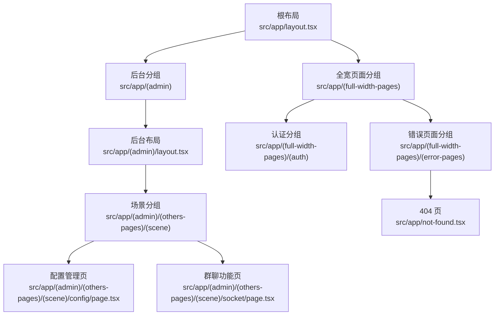
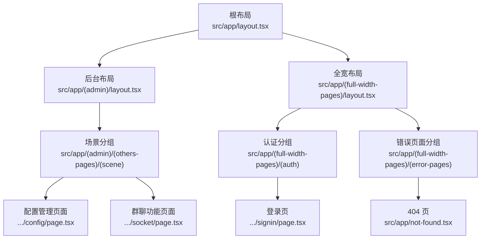
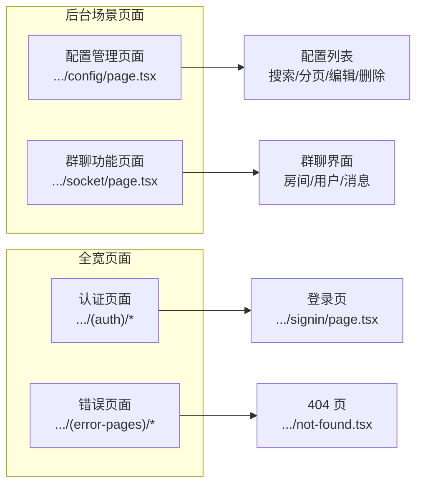
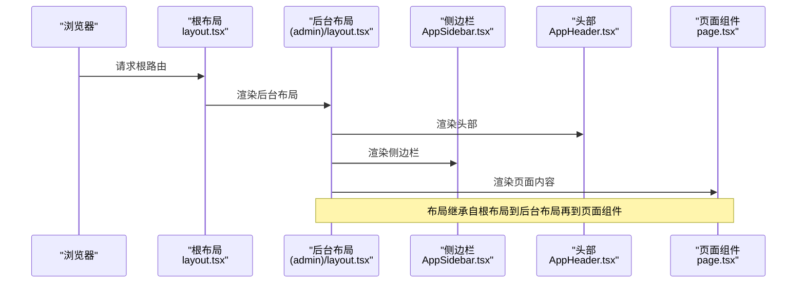
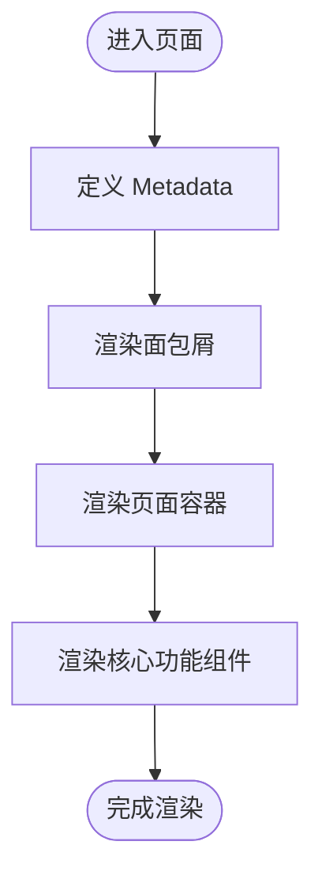
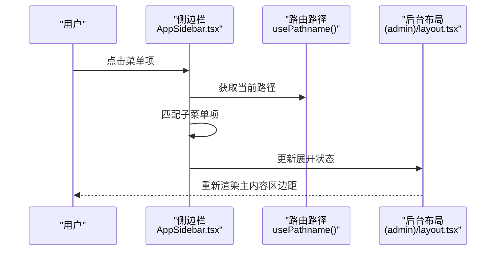
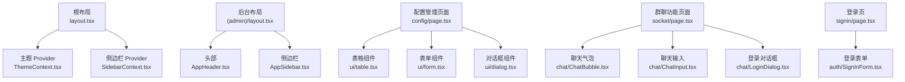

# 页面路由系统

<cite>
**本文引用的文件**
- [src/app/layout.tsx](file://src/app/layout.tsx)
- [src/app/(admin)/layout.tsx](file://src/app/(admin)/layout.tsx)
- [src/app/(full-width-pages)/layout.tsx](file://src/app/(full-width-pages)/layout.tsx)
- [src/app/not-found.tsx](file://src/app/not-found.tsx)
- [src/app/api/config/list/route.ts](file://src/app/api/config/list/route.ts)
- [src/app/(admin)/(others-pages)/(scene)/config/page.tsx](file://src/app/(admin)/(others-pages)/(scene)/config/page.tsx)
- [src/app/(admin)/(others-pages)/(scene)/socket/page.tsx](file://src/app/(admin)/(others-pages)/(scene)/socket/page.tsx)
- [src/context/SidebarContext.tsx](file://src/context/SidebarContext.tsx)
- [src/context/ThemeContext.tsx](file://src/context/ThemeContext.tsx)
- [src/layout/AppHeader.tsx](file://src/layout/AppHeader.tsx)
- [src/layout/AppSidebar.tsx](file://src/layout/AppSidebar.tsx)
- [src/components/chat/ChatBubble.tsx](file://src/components/chat/ChatBubble.tsx)
- [src/components/chat/ChatInput.tsx](file://src/components/chat/ChatInput.tsx)
- [src/components/chat/LoginDialog.tsx](file://src/components/chat/LoginDialog.tsx)
</cite>

## 更新摘要
**所做更改**
- 更新了路由结构以反映大幅简化的页面系统
- 移除了大量示例页面和UI组件页面的文档内容
- 重点保留核心聊天功能路由的相关说明
- 更新了页面分类和路由层级关系的描述
- 调整了架构总览和详细组件分析的内容

## 目录
1. [简介](#简介)
2. [项目结构](#项目结构)
3. [核心组件](#核心组件)
4. [架构总览](#架构总览)
5. [详细组件分析](#详细组件分析)
6. [依赖分析](#依赖分析)
7. [性能考虑](#性能考虑)
8. [故障排查指南](#故障排查指南)
9. [结论](#结论)
10. [附录](#附录)

## 简介
本文件系统性梳理基于 Next.js App Router 的页面路由体系，覆盖路由组织结构、嵌套布局、页面组件设计模式，并结合管理面板的核心功能路由（配置管理、群聊功能）与路由层级关系进行深入解析。同时提供路由配置说明、页面权限控制思路、动态路由处理建议、路由守卫实现方案、页面开发指南、路由最佳实践以及 SEO 优化策略，帮助开发者快速理解现有路由机制并进行扩展。

## 项目结构
该工程采用 Next.js App Router 的文件系统路由与分组路由相结合的方式，通过"路由段分组"实现清晰的页面分类与布局继承。顶层根布局负责全局主题、字体与 Provider 注入；管理后台与全宽页面分别由独立的布局包裹；各页面目录下以 page.tsx 作为页面入口，配合 Metadata 提供 SEO 元数据。

**更新** 路由系统已大幅简化，移除了大量示例页面和UI组件页面，目前主要保留核心功能路由：

**图表来源**
- [src/app/layout.tsx:16-33](file://src/app/layout.tsx#L16-L33)
- [src/app/(admin)/layout.tsx:9-44](file://src/app/(admin)/layout.tsx#L9-L44)
- [src/app/(full-width-pages)/layout.tsx:1-8](file://src/app/(full-width-pages)/layout.tsx#L1-L8)
- [src/app/(admin)/(others-pages)/(scene)/config/page.tsx:1-473](file://src/app/(admin)/(others-pages)/(scene)/config/page.tsx#L1-L473)
- [src/app/(admin)/(others-pages)/(scene)/socket/page.tsx:1-361](file://src/app/(admin)/(others-pages)/(scene)/socket/page.tsx#L1-L361)
- [src/app/not-found.tsx:1-50](file://src/app/not-found.tsx#L1-L50)

**章节来源**
- [src/app/layout.tsx:16-33](file://src/app/layout.tsx#L16-L33)
- [src/app/(admin)/layout.tsx:9-44](file://src/app/(admin)/layout.tsx#L9-L44)
- [src/app/(full-width-pages)/layout.tsx:1-8](file://src/app/(full-width-pages)/layout.tsx#L1-L8)
- [src/app/not-found.tsx:1-50](file://src/app/not-found.tsx#L1-L50)

## 核心组件
- 根布局：负责全局样式、字体、主题 Provider、侧边栏 Provider、全局提示等。
- 后台布局：注入头部、侧边栏、内容区域，根据侧边栏状态动态计算主内容区边距。
- 分组布局：全宽页面分组用于无需后台框架的页面（如登录页）。
- 场景页面：配置管理页面和群聊功能页面作为核心业务页面。
- 聊天组件：ChatBubble、ChatInput、LoginDialog 等专门的聊天功能组件。
- 上下文：SidebarContext 与 ThemeContext 提供侧边栏状态与主题切换能力。
- 导航：AppSidebar 基于路由路径高亮当前菜单项，支持主菜单与"其他"菜单的子菜单展开。

**章节来源**
- [src/app/layout.tsx:16-33](file://src/app/layout.tsx#L16-L33)
- [src/app/(admin)/layout.tsx:9-44](file://src/app/(admin)/layout.tsx#L9-L44)
- [src/app/(full-width-pages)/layout.tsx:1-8](file://src/app/(full-width-pages)/layout.tsx#L1-L8)
- [src/context/SidebarContext.tsx:17-25](file://src/context/SidebarContext.tsx#L17-L25)
- [src/context/ThemeContext.tsx:13-18](file://src/context/ThemeContext.tsx#L13-L18)
- [src/layout/AppSidebar.tsx:104-376](file://src/layout/AppSidebar.tsx#L104-L376)

## 架构总览
Next.js App Router 通过"路由段分组"实现页面分类与布局继承。根布局提供全局上下文与样式；后台分组使用后台布局包裹，内部再细分为场景分组；全宽分组用于认证与错误页面，不包裹后台布局。核心页面包括配置管理和群聊功能，统一导出 Metadata 以增强 SEO。

**更新** 架构已简化为两个核心场景页面：

**图表来源**
- [src/app/layout.tsx:16-33](file://src/app/layout.tsx#L16-L33)
- [src/app/(admin)/layout.tsx:9-44](file://src/app/(admin)/layout.tsx#L9-L44)
- [src/app/(full-width-pages)/layout.tsx:1-8](file://src/app/(full-width-pages)/layout.tsx#L1-L8)
- [src/app/not-found.tsx:6-49](file://src/app/not-found.tsx#L6-L49)

## 详细组件分析

### 路由组织与页面分类
**更新** 路由系统已大幅简化，主要保留两个核心场景页面：

- 配置管理页面：位于后台场景分组下的配置目录，提供应用配置的增删改查功能，包含搜索、分页、对话框等完整功能。
- 群聊功能页面：位于后台场景分组下的socket目录，提供实时聊天功能，包含房间管理、用户登录、消息发送等核心功能。
- 错误页面：位于全宽分组下的错误页面目录，提供 404 未找到页。

**图表来源**
- [src/app/(admin)/(others-pages)/(scene)/config/page.tsx:69-473](file://src/app/(admin)/(others-pages)/(scene)/config/page.tsx#L69-L473)
- [src/app/(admin)/(others-pages)/(scene)/socket/page.tsx:107-361](file://src/app/(admin)/(others-pages)/(scene)/socket/page.tsx#L107-L361)
- [src/app/not-found.tsx:6-49](file://src/app/not-found.tsx#L6-L49)

**章节来源**
- [src/app/(admin)/(others-pages)/(scene)/config/page.tsx:69-473](file://src/app/(admin)/(others-pages)/(scene)/config/page.tsx#L69-L473)
- [src/app/(admin)/(others-pages)/(scene)/socket/page.tsx:107-361](file://src/app/(admin)/(others-pages)/(scene)/socket/page.tsx#L107-L361)
- [src/app/not-found.tsx:1-50](file://src/app/not-found.tsx#L1-L50)

### 嵌套布局系统与布局继承
- 根布局负责全局 Provider 注入与样式初始化。
- 后台布局负责渲染头部、侧边栏与内容区域，根据侧边栏状态动态调整主内容区的边距。
- 全宽布局仅包裹页面内容，适用于无需后台框架的页面（如登录页）。
- 页面组件在各自目录内定义，统一导出 Metadata 以提升 SEO。

**图表来源**
- [src/app/layout.tsx:16-33](file://src/app/layout.tsx#L16-L33)
- [src/app/(admin)/layout.tsx:9-44](file://src/app/(admin)/layout.tsx#L9-L44)
- [src/layout/AppHeader.tsx:10-182](file://src/layout/AppHeader.tsx#L10-L182)
- [src/layout/AppSidebar.tsx:104-376](file://src/layout/AppSidebar.tsx#L104-L376)

**章节来源**
- [src/app/layout.tsx:16-33](file://src/app/layout.tsx#L16-L33)
- [src/app/(admin)/layout.tsx:9-44](file://src/app/(admin)/layout.tsx#L9-L44)
- [src/layout/AppHeader.tsx:10-182](file://src/layout/AppHeader.tsx#L10-L182)
- [src/layout/AppSidebar.tsx:104-376](file://src/layout/AppSidebar.tsx#L104-L376)

### 页面组件设计模式
**更新** 简化后的页面设计更加专注核心功能：

- 配置管理页面：采用表格+表单的设计模式，包含搜索表单、数据表格、分页导航、对话框等完整CRUD功能。
- 群聊功能页面：采用左右布局设计，左侧房间列表，右侧聊天区域，包含用户管理、消息展示、输入框等实时通信功能。
- 统一的 Metadata 定义：每个页面在组件中导出 Metadata，包含标题与描述，便于搜索引擎抓取与社交分享预览。
- 组件复用：页面通过引入通用组件（如面包屑、卡片、按钮、输入框、对话框等）实现内容模块化与可维护性。

**图表来源**
- [src/app/(admin)/(others-pages)/(scene)/config/page.tsx:10-14](file://src/app/(admin)/(others-pages)/(scene)/config/page.tsx#L10-L14)
- [src/app/(admin)/(others-pages)/(scene)/socket/page.tsx:179-357](file://src/app/(admin)/(others-pages)/(scene)/socket/page.tsx#L179-L357)

**章节来源**
- [src/app/(admin)/(others-pages)/(scene)/config/page.tsx:10-14](file://src/app/(admin)/(others-pages)/(scene)/config/page.tsx#L10-L14)
- [src/app/(admin)/(others-pages)/(scene)/socket/page.tsx:179-357](file://src/app/(admin)/(others-pages)/(scene)/socket/page.tsx#L179-L357)

### 路由层级关系与导航高亮
- AppSidebar 维护主菜单与"其他"菜单，支持子菜单展开与收起。
- 使用路由路径进行高亮判断，当子菜单项匹配当前路径时自动展开对应父级菜单。
- 侧边栏状态（展开/折叠/悬停/移动端打开）影响菜单图标与文字显示，同时驱动后台布局主内容区的边距变化。

**图表来源**
- [src/layout/AppSidebar.tsx:104-376](file://src/layout/AppSidebar.tsx#L104-L376)
- [src/app/(admin)/layout.tsx:14-23](file://src/app/(admin)/layout.tsx#L14-L23)

**章节来源**
- [src/layout/AppSidebar.tsx:104-376](file://src/layout/AppSidebar.tsx#L104-L376)
- [src/app/(admin)/layout.tsx:14-23](file://src/app/(admin)/layout.tsx#L14-L23)

### 页面权限控制与路由守卫
- 当前代码库未发现显式的路由守卫实现（如中间件或客户端鉴权逻辑）。若需实现权限控制，可在以下位置进行扩展：
  - 中间件：在根目录添加中间件文件，对特定路由进行鉴权拦截与重定向。
  - 客户端守卫：在后台布局或页面组件中增加鉴权检查，未授权则跳转至登录页。
  - 菜单控制：根据用户角色动态渲染侧边栏菜单项，避免直接访问无权限页面。
- 建议：将权限状态存储在上下文中（如使用现有 Context 模式），并在导航与页面渲染前进行统一校验。

### 动态路由处理
**更新** 现有动态路由主要集中在配置管理页面：

- 配置管理页面使用动态参数处理（如 `/config/apps/[appId]/page.tsx`），在页面中通过参数读取器获取动态值。
- 在服务端或客户端根据动态参数加载数据并渲染页面。
- 对于 API 路由，可参考现有 API 实现方式（如 /api/config/list/route.ts）进行动态参数处理与分页查询。

**章节来源**
- [src/app/api/config/list/route.ts:7-77](file://src/app/api/config/list/route.ts#L7-L77)

### 路由配置说明
- 路由段分组：通过目录名加括号实现分组（如 (admin)、(others-pages)、(scene)），用于逻辑分类与共享布局。
- 页面入口：每个页面目录下必须存在 page.tsx 作为入口文件。
- Metadata：在页面组件中导出 Metadata，提升 SEO 与社交分享效果。
- 全宽页面：无需后台布局，适合登录、注册、404 等页面。

**章节来源**
- [src/app/layout.tsx:16-33](file://src/app/layout.tsx#L16-L33)
- [src/app/(admin)/layout.tsx:9-44](file://src/app/(admin)/layout.tsx#L9-L44)
- [src/app/(full-width-pages)/layout.tsx:1-8](file://src/app/(full-width-pages)/layout.tsx#L1-L8)
- [src/app/not-found.tsx:6-49](file://src/app/not-found.tsx#L6-L49)

### 页面开发指南
**更新** 开发指南已调整为简化后的核心页面：

- 配置管理页面开发：
  - 在场景分组下创建配置目录，并添加 page.tsx。
  - 在页面中导出 Metadata，完善标题与描述。
  - 使用表单组件实现搜索功能，使用表格组件展示数据。
  - 实现分页组件与对话框组件，提供完整的CRUD操作。
  - 如需加入侧边栏菜单，在 AppSidebar 中注册导航项。
- 群聊功能页面开发：
  - 在场景分组下创建 socket 目录，并添加 page.tsx。
  - 在页面中导出 Metadata，完善标题与描述。
  - 使用聊天组件构建实时通信功能。
  - 实现房间管理、用户登录、消息发送等核心功能。
  - 如需加入侧边栏菜单，在 AppSidebar 中注册导航项。
- 组件复用：优先使用现有通用组件（如面包屑、卡片、按钮、输入框、对话框等），保持风格一致。
- 数据加载：对于需要后端数据的页面，可参考 API 路由模式进行请求封装与错误处理。

**章节来源**
- [src/app/(admin)/(others-pages)/(scene)/config/page.tsx:10-14](file://src/app/(admin)/(others-pages)/(scene)/config/page.tsx#L10-L14)
- [src/app/(admin)/(others-pages)/(scene)/socket/page.tsx:179-357](file://src/app/(admin)/(others-pages)/(scene)/socket/page.tsx#L179-L357)
- [src/layout/AppSidebar.tsx:28-102](file://src/layout/AppSidebar.tsx#L28-L102)

### 路由最佳实践
**更新** 最佳实践已适配简化后的路由结构：

- 使用语义化路由：路径应清晰表达页面功能（如 /config、/socket）。
- 合理分组：将相关页面归类到同一分组，减少布局切换成本。
- SEO 友好：为每个页面提供明确的 Metadata，包含标题与描述。
- 性能优化：避免在页面中进行不必要的服务端渲染，合理使用客户端组件与懒加载。
- 功能聚焦：专注于核心业务功能，避免过度复杂的页面结构。

**章节来源**
- [src/app/(admin)/(others-pages)/(scene)/config/page.tsx:10-14](file://src/app/(admin)/(others-pages)/(scene)/config/page.tsx#L10-L14)
- [src/app/(admin)/(others-pages)/(scene)/socket/page.tsx:179-357](file://src/app/(admin)/(others-pages)/(scene)/socket/page.tsx#L179-L357)

### SEO 优化策略
**更新** SEO 策略已针对核心页面进行优化：

- Metadata：在配置管理页面和群聊功能页面中导出标题与描述，确保搜索引擎正确抓取页面信息。
- 静态生成：尽量使用静态生成（SSG）或服务端渲染（SSR）以提升 SEO。
- 结构化数据：在需要时为关键页面添加结构化数据标记。
- 内容质量：页面内容应具备明确的主题与价值，提升用户体验与搜索引擎评分。

**章节来源**
- [src/app/(admin)/(others-pages)/(scene)/config/page.tsx:10-14](file://src/app/(admin)/(others-pages)/(scene)/config/page.tsx#L10-L14)
- [src/app/(admin)/(others-pages)/(scene)/socket/page.tsx:179-357](file://src/app/(admin)/(others-pages)/(scene)/socket/page.tsx#L179-L357)

## 依赖分析
**更新** 依赖关系已简化为核心功能：

- 根布局依赖主题与侧边栏 Provider，为整个应用提供上下文能力。
- 后台布局依赖头部与侧边栏组件，形成完整的后台框架。
- 配置管理页面依赖表格、表单、分页、对话框等通用组件。
- 群聊功能页面依赖聊天组件（ChatBubble、ChatInput、LoginDialog）和实时通信Hook。
- 认证页面依赖登录表单组件，提供用户身份验证入口。

**图表来源**
- [src/app/layout.tsx:24-26](file://src/app/layout.tsx#L24-L26)
- [src/context/ThemeContext.tsx:45-49](file://src/context/ThemeContext.tsx#L45-L49)
- [src/context/SidebarContext.tsx:66-83](file://src/context/SidebarContext.tsx#L66-L83)
- [src/app/(admin)/layout.tsx:26-42](file://src/app/(admin)/layout.tsx#L26-L42)
- [src/layout/AppHeader.tsx:10-182](file://src/layout/AppHeader.tsx#L10-L182)
- [src/layout/AppSidebar.tsx:104-376](file://src/layout/AppSidebar.tsx#L104-L376)
- [src/app/(full-width-pages)/(auth)/signin/page.tsx:9-11](file://src/app/(full-width-pages)/(auth)/signin/page.tsx#L9-L11)
- [src/components/chat/ChatBubble.tsx:1-200](file://src/components/chat/ChatBubble.tsx#L1-L200)
- [src/components/chat/ChatInput.tsx:1-200](file://src/components/chat/ChatInput.tsx#L1-L200)
- [src/components/chat/LoginDialog.tsx:1-200](file://src/components/chat/LoginDialog.tsx#L1-L200)

**章节来源**
- [src/app/layout.tsx:24-26](file://src/app/layout.tsx#L24-L26)
- [src/context/ThemeContext.tsx:45-49](file://src/context/ThemeContext.tsx#L45-L49)
- [src/context/SidebarContext.tsx:66-83](file://src/context/SidebarContext.tsx#L66-L83)
- [src/app/(admin)/layout.tsx:26-42](file://src/app/(admin)/layout.tsx#L26-L42)
- [src/layout/AppHeader.tsx:10-182](file://src/layout/AppHeader.tsx#L10-L182)
- [src/layout/AppSidebar.tsx:104-376](file://src/layout/AppSidebar.tsx#L104-L376)
- [src/app/(full-width-pages)/(auth)/signin/page.tsx:9-11](file://src/app/(full-width-pages)/(auth)/signin/page.tsx#L9-L11)
- [src/components/chat/ChatBubble.tsx:1-200](file://src/components/chat/ChatBubble.tsx#L1-L200)
- [src/components/chat/ChatInput.tsx:1-200](file://src/components/chat/ChatInput.tsx#L1-L200)
- [src/components/chat/LoginDialog.tsx:1-200](file://src/components/chat/LoginDialog.tsx#L1-L200)

## 性能考虑
**更新** 性能优化已适配简化后的路由结构：

- 减少不必要的服务端渲染：对于配置管理页面，优先使用静态生成（SSG）或客户端数据获取。
- 组件懒加载：对大型聊天组件采用动态导入，降低首屏负载。
- 资源优化：合理使用图片与第三方资源，启用压缩与缓存策略。
- 路由预取：在导航到高频页面时进行预取，提升用户体验。
- 状态管理：使用合适的React状态管理模式，避免不必要的重渲染。

## 故障排查指南
**更新** 故障排查已针对简化后的页面：

- 404 页面：当访问不存在的路由时，系统会渲染 404 页面，包含返回首页的链接与品牌信息。
- 配置管理页面问题：检查API接口调用、表格渲染、分页功能是否正常工作。
- 群聊功能页面问题：检查WebSocket连接、用户登录、消息发送等功能。
- 登录问题：登录页依赖登录表单组件，若出现样式或交互异常，检查表单组件与上下文 Provider 的使用。
- 侧边栏异常：若侧边栏无法展开或菜单高亮不正确，检查侧边栏状态与路径匹配逻辑。

**章节来源**
- [src/app/not-found.tsx:6-49](file://src/app/not-found.tsx#L6-L49)
- [src/app/(admin)/(others-pages)/(scene)/config/page.tsx:87-120](file://src/app/(admin)/(others-pages)/(scene)/config/page.tsx#L87-L120)
- [src/app/(admin)/(others-pages)/(scene)/socket/page.tsx:107-168](file://src/app/(admin)/(others-pages)/(scene)/socket/page.tsx#L107-L168)
- [src/components/chat/LoginDialog.tsx:1-200](file://src/components/chat/LoginDialog.tsx#L1-L200)
- [src/layout/AppSidebar.tsx:243-270](file://src/layout/AppSidebar.tsx#L243-L270)

## 结论
**更新** 结论已适配大幅简化的路由系统：

本路由系统通过分组路由与嵌套布局实现了清晰的页面分类与一致的后台体验。当前版本已大幅简化，主要保留配置管理和群聊功能两大核心页面，移除了大量示例页面和UI组件页面。页面组件遵循统一的 Metadata 与设计模式，配合专用的聊天组件提升了核心功能的专业性和用户体验。未来可在此基础上扩展更多业务功能，同时保持路由结构的简洁性和可维护性。

## 附录
**更新** 附录内容已调整：

- API 列表接口：提供分页查询与条件过滤能力，支持配置管理页面的数据加载。
- 聊天功能接口：提供房间管理、用户登录、消息发送等实时通信能力。

**章节来源**
- [src/app/api/config/list/route.ts:7-77](file://src/app/api/config/list/route.ts#L7-L77)