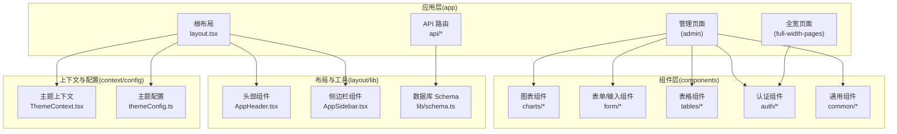
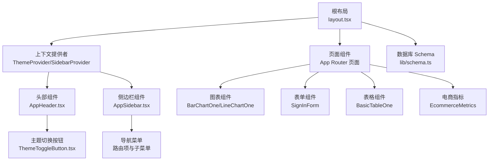
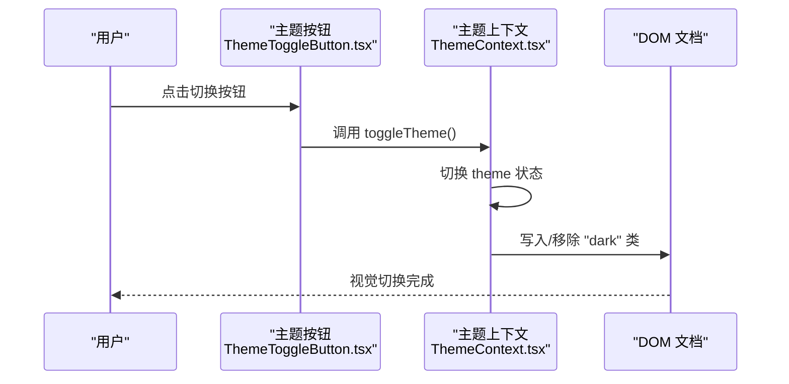
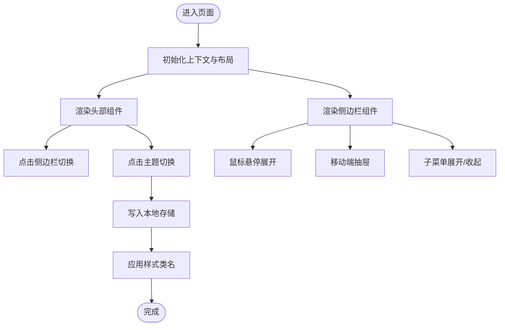
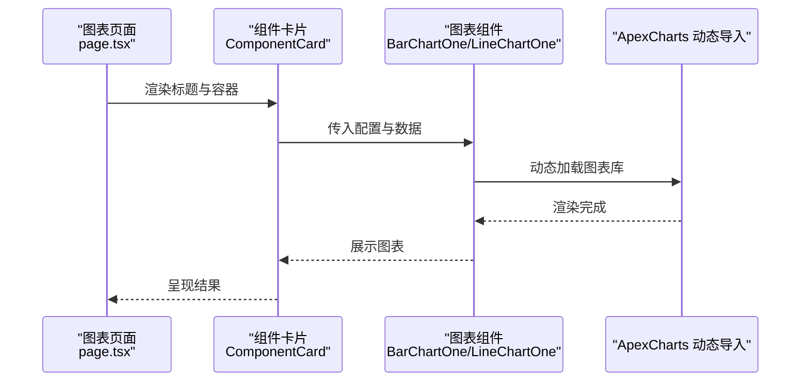
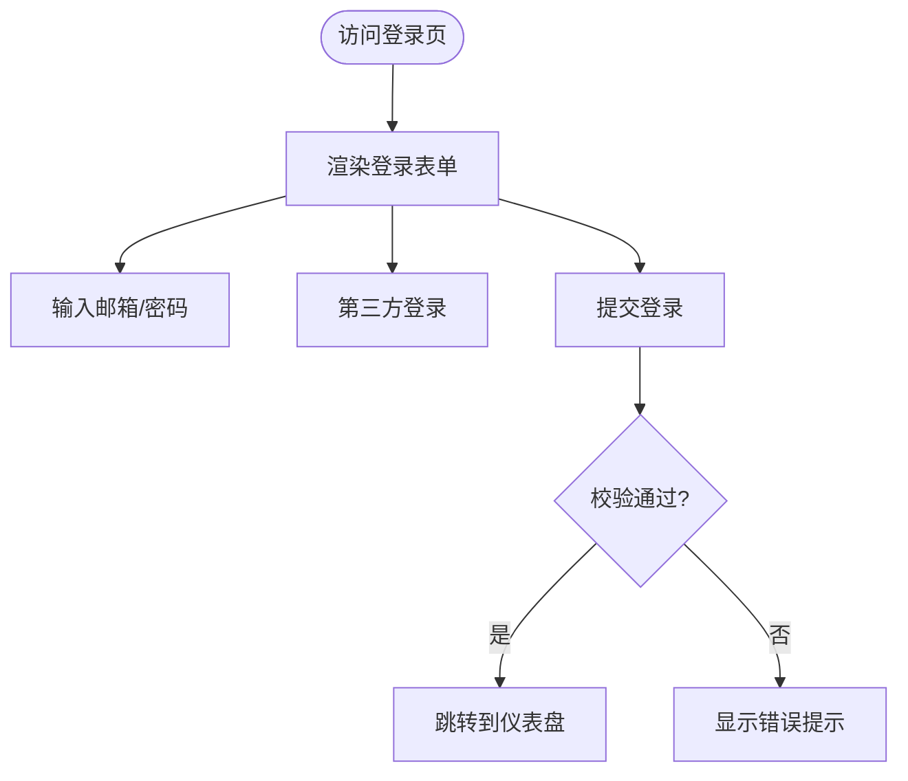
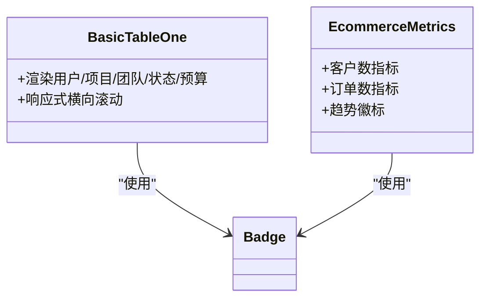
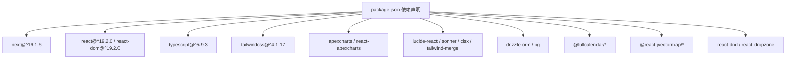

# 项目概览

<cite>
**本文引用的文件**   
- [README.md](file://README.md)
- [package.json](file://package.json)
- [src/app/layout.tsx](file://src/app/layout.tsx)
- [src/context/ThemeContext.tsx](file://src/context/ThemeContext.tsx)
- [src/config/themeConfig.ts](file://src/config/themeConfig.ts)
- [src/components/common/ThemeToggleButton.tsx](file://src/components/common/ThemeToggleButton.tsx)
- [src/layout/AppHeader.tsx](file://src/layout/AppHeader.tsx)
- [src/layout/AppSidebar.tsx](file://src/layout/AppSidebar.tsx)
- [src/components/charts/bar/BarChartOne.tsx](file://src/components/charts/bar/BarChartOne.tsx)
- [src/components/charts/line/LineChartOne.tsx](file://src/components/charts/line/LineChartOne.tsx)
- [src/components/auth/SignInForm.tsx](file://src/components/auth/SignInForm.tsx)
- [src/components/tables/BasicTableOne.tsx](file://src/components/tables/BasicTableOne.tsx)
- [src/components/ecommerce/EcommerceMetrics.tsx](file://src/components/ecommerce/EcommerceMetrics.tsx)
- [src/lib/schema.ts](file://src/lib/schema.ts)
- [src/app/(admin)/(others-pages)/(chart)/bar-chart/page.tsx](file://src/app/(admin)/(others-pages)/(chart)/bar-chart/page.tsx)
</cite>

## 目录
1. [简介](#简介)
2. [项目结构](#项目结构)
3. [核心组件](#核心组件)
4. [架构总览](#架构总览)
5. [详细组件分析](#详细组件分析)
6. [依赖关系分析](#依赖关系分析)
7. [性能考量](#性能考量)
8. [故障排查指南](#故障排查指南)
9. [结论](#结论)
10. [附录](#附录)

## 简介
本项目是一个基于 Next.js App Router 的免费管理面板模板，采用 React 19 与 TypeScript 构建，结合 Tailwind CSS V4 实现现代化、可定制的仪表盘界面。项目提供完整的后台管理所需 UI 组件与页面，包括数据可视化图表、认证表单、表格、日历、通知与用户下拉菜单等，支持暗色模式与响应式布局，适合快速搭建各类 Web 后台、控制面板或数据驱动型应用。

- 技术栈：Next.js 16.x、React 19、TypeScript、Tailwind CSS V4
- 核心能力：数据可视化（折线图、柱状图）、用户认证（登录/注册）、响应式布局、主题切换（明/暗）、侧边栏导航、表格与电商指标展示、日历与通知等
- 版本定位：免费版本提供基础仪表盘与组件；专业版提供多套主题仪表盘与完整设计资源

**章节来源**
- [README.md:11-108](file://README.md#L11-L108)
- [package.json:15-49](file://package.json#L15-L49)

## 项目结构
项目采用 Next.js App Router 的目录组织方式，按功能域划分页面与组件，同时通过 app 目录下的布局与全局样式实现统一的主题与上下文注入。

- app 目录：页面路由与布局
  - (admin)：管理区域页面（如图表、表单、表格、UI 元素、场景配置等）
  - (full-width-pages)：全宽页面（如认证页、错误页）
  - api：服务端接口（如配置列表等）
  - 布局与全局样式：根布局、全局 CSS、字体与上下文提供者
- components：可复用 UI 组件（图表、表单、表格、通知、用户下拉等）
- context：全局状态（主题、侧边栏）
- config：主题与布局配置
- lib：数据库 schema 与工具（drizzle-orm、schema 定义）
- hooks：自定义 Hook（如模态框、返回逻辑）

**图表来源**
- [src/app/layout.tsx:16-32](file://src/app/layout.tsx#L16-L32)
- [src/layout/AppHeader.tsx:10-181](file://src/layout/AppHeader.tsx#L10-L181)
- [src/layout/AppSidebar.tsx:104-375](file://src/layout/AppSidebar.tsx#L104-L375)
- [src/context/ThemeContext.tsx:15-50](file://src/context/ThemeContext.tsx#L15-L50)
- [src/config/themeConfig.ts:4-30](file://src/config/themeConfig.ts#L4-L30)
- [src/lib/schema.ts:15-24](file://src/lib/schema.ts#L15-L24)

**章节来源**
- [src/app/layout.tsx:16-32](file://src/app/layout.tsx#L16-L32)
- [src/layout/AppHeader.tsx:10-181](file://src/layout/AppHeader.tsx#L10-L181)
- [src/layout/AppSidebar.tsx:104-375](file://src/layout/AppSidebar.tsx#L104-L375)
- [src/context/ThemeContext.tsx:15-50](file://src/context/ThemeContext.tsx#L15-L50)
- [src/config/themeConfig.ts:4-30](file://src/config/themeConfig.ts#L4-L30)
- [src/lib/schema.ts:15-24](file://src/lib/schema.ts#L15-L24)

## 核心组件
- 主题系统与切换
  - 主题上下文：提供明/暗主题状态与切换方法，并持久化到本地存储
  - 主题按钮：在头部组件中提供一键切换明/暗模式
  - 主题配置：集中管理侧边栏宽度、头部高度、间距、圆角与品牌色
- 响应式布局与导航
  - 头部组件：集成搜索、通知、用户下拉菜单与主题切换
  - 侧边栏组件：支持展开/折叠、移动端抽屉、子菜单动画与高亮当前路径
- 数据可视化
  - 折线图与柱状图：基于 ApexCharts 的动态图表组件，支持 SSR 关闭以适配客户端渲染
- 表单与认证
  - 登录表单：支持邮箱密码登录、第三方登录入口、记住我与忘记密码
- 表格与电商指标
  - 基础表格：展示用户、项目、团队头像与状态徽标
  - 电商指标：客户数与订单数指标卡片，带趋势徽标
- 数据库与 Schema
  - 使用 drizzle-orm 定义 PostgreSQL 表结构与类型别名

**章节来源**
- [src/context/ThemeContext.tsx:15-59](file://src/context/ThemeContext.tsx#L15-L59)
- [src/components/common/ThemeToggleButton.tsx:4-43](file://src/components/common/ThemeToggleButton.tsx#L4-L43)
- [src/config/themeConfig.ts:4-30](file://src/config/themeConfig.ts#L4-L30)
- [src/layout/AppHeader.tsx:10-181](file://src/layout/AppHeader.tsx#L10-L181)
- [src/layout/AppSidebar.tsx:104-375](file://src/layout/AppSidebar.tsx#L104-L375)
- [src/components/charts/bar/BarChartOne.tsx:12-111](file://src/components/charts/bar/BarChartOne.tsx#L12-L111)
- [src/components/charts/line/LineChartOne.tsx:12-134](file://src/components/charts/line/LineChartOne.tsx#L12-L134)
- [src/components/auth/SignInForm.tsx:10-155](file://src/components/auth/SignInForm.tsx#L10-L155)
- [src/components/tables/BasicTableOne.tsx:114-227](file://src/components/tables/BasicTableOne.tsx#L114-L227)
- [src/components/ecommerce/EcommerceMetrics.tsx:6-57](file://src/components/ecommerce/EcommerceMetrics.tsx#L6-L57)
- [src/lib/schema.ts:15-24](file://src/lib/schema.ts#L15-L24)

## 架构总览
项目采用“布局-上下文-组件”三层架构：
- 布局层：根布局注入主题、侧边栏上下文与全局样式，页面通过 App Router 组织
- 上下文层：主题上下文与侧边栏上下文提供跨组件的状态共享
- 组件层：按功能拆分的 UI 组件，图表、表单、表格、认证等模块化组织

**图表来源**
- [src/app/layout.tsx:16-32](file://src/app/layout.tsx#L16-L32)
- [src/context/ThemeContext.tsx:15-50](file://src/context/ThemeContext.tsx#L15-L50)
- [src/layout/AppHeader.tsx:10-181](file://src/layout/AppHeader.tsx#L10-L181)
- [src/layout/AppSidebar.tsx:104-375](file://src/layout/AppSidebar.tsx#L104-L375)
- [src/components/common/ThemeToggleButton.tsx:4-43](file://src/components/common/ThemeToggleButton.tsx#L4-L43)
- [src/components/charts/bar/BarChartOne.tsx:12-111](file://src/components/charts/bar/BarChartOne.tsx#L12-L111)
- [src/components/charts/line/LineChartOne.tsx:12-134](file://src/components/charts/line/LineChartOne.tsx#L12-L134)
- [src/components/auth/SignInForm.tsx:10-155](file://src/components/auth/SignInForm.tsx#L10-L155)
- [src/components/tables/BasicTableOne.tsx:114-227](file://src/components/tables/BasicTableOne.tsx#L114-L227)
- [src/components/ecommerce/EcommerceMetrics.tsx:6-57](file://src/components/ecommerce/EcommerceMetrics.tsx#L6-L57)
- [src/lib/schema.ts:15-24](file://src/lib/schema.ts#L15-L24)

## 详细组件分析

### 主题系统与切换
- 主题上下文：初始化时读取本地存储的用户偏好，设置 documentElement 的 dark 类名，确保样式即时生效
- 主题按钮：点击切换明/暗模式，配合全局样式与图标实现昼夜模式切换
- 主题配置：集中管理尺寸、间距、圆角与品牌色，便于统一风格

**图表来源**
- [src/components/common/ThemeToggleButton.tsx:4-43](file://src/components/common/ThemeToggleButton.tsx#L4-L43)
- [src/context/ThemeContext.tsx:15-50](file://src/context/ThemeContext.tsx#L15-L50)

**章节来源**
- [src/context/ThemeContext.tsx:15-59](file://src/context/ThemeContext.tsx#L15-L59)
- [src/components/common/ThemeToggleButton.tsx:4-43](file://src/components/common/ThemeToggleButton.tsx#L4-L43)
- [src/config/themeConfig.ts:4-30](file://src/config/themeConfig.ts#L4-L30)

### 响应式布局与导航
- 头部组件：包含侧边栏切换、搜索框（支持快捷键）、通知与用户下拉菜单，以及主题切换按钮
- 侧边栏组件：支持桌面端展开/折叠、移动端抽屉、悬停展开、子菜单折叠动画与当前路径高亮

**图表来源**
- [src/layout/AppHeader.tsx:10-181](file://src/layout/AppHeader.tsx#L10-L181)
- [src/layout/AppSidebar.tsx:104-375](file://src/layout/AppSidebar.tsx#L104-L375)
- [src/context/ThemeContext.tsx:15-50](file://src/context/ThemeContext.tsx#L15-L50)

**章节来源**
- [src/layout/AppHeader.tsx:10-181](file://src/layout/AppHeader.tsx#L10-L181)
- [src/layout/AppSidebar.tsx:104-375](file://src/layout/AppSidebar.tsx#L104-L375)

### 数据可视化（图表）
- 折线图与柱状图：使用 ApexCharts 动态导入，关闭 SSR 以避免浏览器环境相关问题；配置包含颜色、坐标轴、网格、提示与填充等
- 页面示例：图表页面通过面包屑与卡片容器展示图表组件

**图表来源**
- [src/app/(admin)/(others-pages)/(chart)/bar-chart/page.tsx:13-24](file://src/app/(admin)/(others-pages)/(chart)/bar-chart/page.tsx#L13-L24)
- [src/components/charts/bar/BarChartOne.tsx:12-111](file://src/components/charts/bar/BarChartOne.tsx#L12-L111)
- [src/components/charts/line/LineChartOne.tsx:12-134](file://src/components/charts/line/LineChartOne.tsx#L12-L134)

**章节来源**
- [src/components/charts/bar/BarChartOne.tsx:12-111](file://src/components/charts/bar/BarChartOne.tsx#L12-L111)
- [src/components/charts/line/LineChartOne.tsx:12-134](file://src/components/charts/line/LineChartOne.tsx#L12-L134)
- [src/app/(admin)/(others-pages)/(chart)/bar-chart/page.tsx:13-24](file://src/app/(admin)/(others-pages)/(chart)/bar-chart/page.tsx#L13-L24)

### 认证与表单
- 登录表单：包含邮箱、密码输入、第三方登录入口、记住我与忘记密码链接，使用通用输入与按钮组件
- 表单元素：输入、选择、开关、文件上传等组件按功能拆分，便于复用

**图表来源**
- [src/components/auth/SignInForm.tsx:10-155](file://src/components/auth/SignInForm.tsx#L10-L155)

**章节来源**
- [src/components/auth/SignInForm.tsx:10-155](file://src/components/auth/SignInForm.tsx#L10-L155)

### 表格与电商指标
- 基础表格：展示用户、项目、团队头像与状态徽标，支持响应式横向滚动
- 电商指标：客户数与订单数指标卡片，带趋势箭头与百分比变化徽标

**图表来源**
- [src/components/tables/BasicTableOne.tsx:114-227](file://src/components/tables/BasicTableOne.tsx#L114-L227)
- [src/components/ecommerce/EcommerceMetrics.tsx:6-57](file://src/components/ecommerce/EcommerceMetrics.tsx#L6-L57)

**章节来源**
- [src/components/tables/BasicTableOne.tsx:114-227](file://src/components/tables/BasicTableOne.tsx#L114-L227)
- [src/components/ecommerce/EcommerceMetrics.tsx:6-57](file://src/components/ecommerce/EcommerceMetrics.tsx#L6-L57)

### 数据库与 Schema
- 使用 drizzle-orm 定义 PostgreSQL 表结构，导出类型别名用于类型安全
- 集中导出表与类型，便于在业务层直接引用

**章节来源**
- [src/lib/schema.ts:15-24](file://src/lib/schema.ts#L15-L24)

## 依赖关系分析
- 运行时依赖
  - Next.js 16、React 19、TypeScript、Tailwind CSS V4
  - 图表：apexcharts、react-apexcharts
  - UI 工具：lucide-react、sonner、clsx、tailwind-merge
  - 数据库：drizzle-orm、pg
  - 日历：@fullcalendar/*
  - 地图：@react-jvectormap/*
  - 拖拽：react-dnd、react-dropzone
- 开发依赖
  - ESLint、Prettier、TailwindCSS、TypeScript

**图表来源**
- [package.json:15-49](file://package.json#L15-L49)

**章节来源**
- [package.json:15-49](file://package.json#L15-L49)

## 性能考量
- 图表 SSR 关闭：图表组件通过动态导入并在客户端渲染，避免 SSR 环境差异导致的问题
- 响应式与滚动：表格组件启用横向滚动与最小宽度约束，保证在窄屏设备上的可读性
- 主题切换：通过本地存储与 DOM 类名切换实现即时视觉反馈，避免不必要的重渲染
- 依赖优化：Tailwind CSS V4 提升样式编译效率，减少运行时开销

**章节来源**
- [src/components/charts/bar/BarChartOne.tsx:8-10](file://src/components/charts/bar/BarChartOne.tsx#L8-L10)
- [src/components/charts/line/LineChartOne.tsx:8-10](file://src/components/charts/line/LineChartOne.tsx#L8-L10)
- [src/layout/AppSidebar.tsx:174-228](file://src/layout/AppSidebar.tsx#L174-L228)
- [src/context/ThemeContext.tsx:30-39](file://src/context/ThemeContext.tsx#L30-L39)

## 故障排查指南
- 主题切换无效
  - 检查主题上下文是否包裹在根布局中
  - 确认本地存储键值是否存在且可写
  - 验证 documentElement 是否正确添加/移除 "dark" 类
- 图表不显示或报错
  - 确认动态导入已执行且仅在客户端渲染
  - 检查 ApexCharts 依赖是否安装
- 表格横向滚动异常
  - 确认容器设置了最小宽度与横向滚动属性
  - 检查表格列数与内容宽度是否超出容器
- 认证表单提交失败
  - 检查必填字段与格式验证
  - 确认第三方登录与表单提交逻辑未被禁用

**章节来源**
- [src/context/ThemeContext.tsx:15-50](file://src/context/ThemeContext.tsx#L15-L50)
- [src/components/charts/bar/BarChartOne.tsx:8-10](file://src/components/charts/bar/BarChartOne.tsx#L8-L10)
- [src/components/tables/BasicTableOne.tsx:114-227](file://src/components/tables/BasicTableOne.tsx#L114-L227)
- [src/components/auth/SignInForm.tsx:10-155](file://src/components/auth/SignInForm.tsx#L10-L155)

## 结论
本项目以 Next.js App Router 为核心，结合 React 19 与 TypeScript，构建了具备完整后台管理能力的模板。其组件化设计与上下文状态管理使主题切换、响应式布局与导航体验更加一致；数据可视化、认证、表格与电商指标等模块覆盖常见后台需求。免费版本提供基础仪表盘与组件，专业版则扩展至多套主题仪表盘与完整设计资源，适合快速落地各类数据驱动型管理平台。

## 附录

### 功能对比表（免费版 vs 专业版）
- 免费版本
  - 1 套唯一仪表盘
  - 30+ 仪表盘组件
  - 50+ UI 元素
  - 基础 Figma 设计文件
  - 社区支持
- 专业版本
  - 7 套独特仪表盘：分析、电商、营销、CRM、SaaS、股票、物流（持续新增）
  - 500+ 仪表盘组件与 UI 元素
  - 完整 Figma 设计文件
  - 邮件支持

**章节来源**
- [README.md:91-108](file://README.md#L91-L108)

### 版本更新历史摘要
- 2.2.3（2026-03-15）：升级 ESLint 与依赖；Next.js 升级至 16.1.6
- 2.2.2（2025-12-30）：修复统计图表中的日期选择器定位与功能
- 2.1.0（2025-11-15）：迁移至 Next.js 16.x；修复若干小问题
- 2.0.2（2025-03-25）：升级至 Next.js 16.x 以应对 CVE-2025-29927；替换向量地图依赖；迁移到 flatpickr 以兼容 React 19
- 2.0.1（2025-02-27）：升级至 Tailwind CSS v4；更新类名语法与样式
- 2.0.0（2025-02）：重大更新，采用 Next.js 16 App Router 与 React Server Components；增强 UI、响应式与可访问性；新增可折叠侧边栏、聊天与日历；认证流程迁移至 Server Actions 与中间件；图表组件改用 ApexCharts

**章节来源**
- [README.md:110-167](file://README.md#L110-L167)

### 许可证信息
- 本项目采用 MIT 许可证发布，允许自由使用、复制、修改与再发布，但需保留版权声明与许可声明。

**章节来源**
- [README.md:195-197](file://README.md#L195-L197)